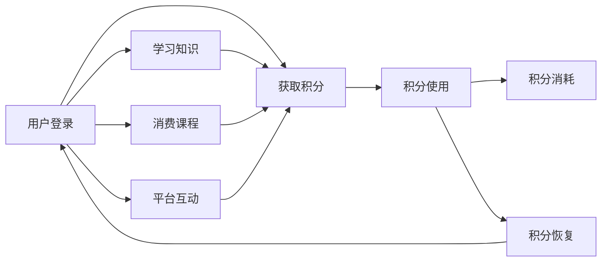

                 

# 程序员如何设计知识付费的积分体系

## 1. 背景介绍

在互联网知识付费领域，知识创作者和平台运营商都在探索如何提高用户黏性，激励用户持续消费。积分体系作为一种有效的用户激励手段，在电商平台、在线教育等多个场景中已广泛应用。但如何将积分体系成功地应用于知识付费平台，仍需要深入研究和精心设计。本文将深入探讨知识付费积分体系的设计原理，并给出详细的实践指导。

## 2. 核心概念与联系

### 2.1 核心概念概述

知识付费平台的积分体系，本质上是一种基于积分规则的奖励机制。通过积分的获取、使用、消耗、恢复等环节，激励用户进行知识消费、学习提升和平台推荐。关键概念包括：

- 积分：用户进行知识消费、学习贡献或平台互动后获得的奖励，具有一定价值和使用限制。
- 积分类型：包括付费积分和免费积分，前者可通过付费购买获得，后者可通过自然行为积累。
- 积分规则：用户如何获取、使用和消耗积分的具体规则，决定积分系统的激励效果和公平性。
- 积分商城：积分的使用场景，如兑换课程、礼品等，提供用户更多选择和价值体验。

### 2.2 核心概念原理和架构的 Mermaid 流程图



该流程图展示了积分体系的核心流程：用户登录后，通过学习知识、消费课程和平台互动等方式获取积分；积分可进一步用于平台内兑换商品和服务；积分还可通过某些行为进行恢复。

## 3. 核心算法原理 & 具体操作步骤

### 3.1 算法原理概述

知识付费平台的积分体系设计，可以分为积分获取、积分消耗和积分恢复三大环节。其中积分获取环节是积分体系设计的核心，直接影响用户的参与度和忠诚度。

积分获取主要通过以下几种方式：

- 付费购买积分：用户通过货币购买积分，提升积分总量。
- 学习行为积分：如学习时长、课程通过率等，奖励用户的学习成果。
- 平台互动积分：如课程推荐、社区发言等，鼓励用户参与平台活动。
- 特定活动积分：如节日活动、平台促销等，增加积分获取渠道，提升用户兴趣。

积分消耗主要通过兑换平台内商品和服务实现，如兑换课程、购买礼品等。

积分恢复则通过用户的平台行为，如邀请好友、社交分享等，激励用户持续互动，提升平台活跃度。

### 3.2 算法步骤详解

#### 3.2.1 积分获取规则

1. **付费购买积分**
   - 用户可通过平台币、实付金额等方式，进行积分兑换。
   - 设定积分与货币的兑换比例，如1元=100积分。
   - 限制每日最大兑换数量，避免积情感消。

2. **学习行为积分**
   - 设定学习积分的获取规则，如每分钟学习1积分，每门课程通过率提升10%。
   - 根据课程难度和内容丰富度，调整积分获取系数，激励高质量内容消费。
   - 引入学习排行榜，增加积分获取的竞争性和趣味性。

3. **平台互动积分**
   - 设定互动积分的获取规则，如每条课程推荐10积分，每条社区发言20积分。
   - 引入推荐算法，精准推荐高质量内容和优质用户，增加积分获取的贡献度。
   - 设计互动奖励机制，如定期发放平台福利，增加用户黏性。

4. **特定活动积分**
   - 根据节日和平台活动，设计特殊积分获取规则，如双十一购物节全场课程8折，额外赠送100积分。
   - 通过活动预告和引导，提升用户参与活动的积极性。
   - 设定活动期限，避免积分长期积压，增加用户参与的紧迫性。

#### 3.2.2 积分消耗规则

1. **兑换商品与服务**
   - 设计积分与课程、礼品等的兑换比例，如1000积分兑换一门课程，5000积分兑换精美礼品。
   - 限制兑换数量，避免用户过度消费。
   - 设计限时折扣，增加用户消费的紧迫性和频率。

2. **兑换平台货币**
   - 设计积分与平台币的兑换比例，如1积分=1平台币。
   - 限制每日最大兑换数量，避免积情感消。
   - 引入积分叠加功能，如积分和平台币可同时使用，提升用户消费体验。

#### 3.2.3 积分恢复规则

1. **用户行为恢复**
   - 设定用户行为积分恢复规则，如每邀请一个好友加入平台，奖励20积分；每分享一篇内容，奖励10积分。
   - 引入社交激励机制，增加用户互动和推荐，提升平台活跃度。
   - 设计恢复积分上限，避免积分过度积累。

2. **系统自动恢复**
   - 设定系统自动恢复积分规则，如每日0点恢复1%当日的积分损失。
   - 引入积分有效期机制，避免积分长期积压，增加用户消费的紧迫性。

### 3.3 算法优缺点

#### 3.3.1 优点

1. **提高用户粘性**：积分体系通过奖励机制，激励用户持续进行知识消费和平台互动，提高用户粘性。
2. **促进用户转化**：积分兑换和积分获取的双向激励，促进用户从免费试用向付费消费的转化。
3. **提升平台活跃度**：积分体系的社交激励和平台互动设计，增加用户活跃度和平台使用频率。
4. **灵活适应多种场景**：积分体系可根据不同用户需求和平台特色，灵活设计积分获取和消耗规则。

#### 3.3.2 缺点

1. **积分贬值风险**：大量积分的供给可能降低积分的实际价值，影响积分体系的激励效果。
2. **用户认知偏差**：用户可能对积分价值和获取规则产生误解，影响积分体系的使用效果。
3. **系统复杂性**：积分体系的规则设计和系统实现，需要考虑多种积分类型和用户行为，增加了系统的复杂性。
4. **运营成本**：积分体系的运营需要持续的规则维护和数据统计，增加了平台的运营成本。

### 3.4 算法应用领域

积分体系作为一种用户激励机制，适用于多种知识付费平台和场景，如在线教育、内容社区、技术博客等。通过合理的积分设计和运营，可以有效提高用户活跃度和平台收益。

## 4. 数学模型和公式 & 详细讲解 & 举例说明

### 4.1 数学模型构建

知识付费积分体系的设计，可以抽象为一个动态系统，系统状态为用户的积分总数，积分的获取、消耗和恢复可看作系统状态的转移过程。积分系统的数学模型可表示为：

$$
S_{t+1} = S_t + G_t - C_t + R_t
$$

其中 $S_t$ 为时间 $t$ 用户的积分总数，$G_t$ 为时间 $t$ 用户的积分获取量，$C_t$ 为时间 $t$ 用户的积分消耗量，$R_t$ 为时间 $t$ 用户的积分恢复量。

### 4.2 公式推导过程

1. **积分获取模型**
   - 学习积分获取：设用户每天学习时长为 $L_t$，每分钟学习获取积分 $g$，则学习积分获取量为 $G_t = g \times L_t$
   - 互动积分获取：设用户每天互动次数为 $I_t$，每互动获取积分 $i$，则互动积分获取量为 $G_t = i \times I_t$
   - 特定活动积分获取：设活动时间为 $A_t$，活动期间每天获取积分 $a$，则活动积分获取量为 $G_t = a \times A_t$
   - 付费购买积分：设每日最大兑换数量为 $P_t$，每元兑换积分 $p$，则购买积分获取量为 $G_t = p \times P_t$

2. **积分消耗模型**
   - 课程兑换：设每门课程价值 $V_c$，兑换比例为 $k_c$，则课程兑换消耗量为 $C_t = k_c \times V_c$
   - 礼品兑换：设每份礼品价值 $V_g$，兑换比例为 $k_g$，则礼品兑换消耗量为 $C_t = k_g \times V_g$
   - 平台货币兑换：设每元平台币兑换积分 $p_m$，兑换比例为 $k_m$，则平台货币兑换消耗量为 $C_t = k_m \times p_m$

3. **积分恢复模型**
   - 用户行为恢复：设每日用户行为次数为 $B_t$，每次行为恢复积分 $b$，则恢复积分为 $R_t = b \times B_t$
   - 系统自动恢复：设每日恢复比例为 $r_s$，则系统自动恢复积分为 $R_t = r_s \times S_t$

### 4.3 案例分析与讲解

假设某知识付费平台用户小张每天学习2小时，每小时获取50积分；每天在平台上留言10条，每条留言获取10积分；每邀请一个好友注册平台，获得20积分。积分兑换规则为：每1000积分兑换一门课程，每5000积分兑换一份精美礼品。假设每天最大购买积分数量为500，每日积分恢复比例为1%，每周一次平台自动恢复2%。

小张的积分动态变化如下：

- 第1天：$S_1 = 50 \times 2 \times 60 + 10 \times 10 + 20 = 1100$
- 第2天：$S_2 = S_1 + 50 \times 2 \times 60 + 10 \times 10 + 20 - 1000 = 1100 + 1100 - 1000 = 1200$
- 第3天：$S_3 = S_2 + 50 \times 2 \times 60 + 10 \times 10 + 20 - 1000 = 1200 + 1200 - 1000 = 1400$
- ...

假设小张在第7天购买了1门课程和1份礼品，则积分消耗为 $C_7 = 1 \times 1000 + 1 \times 5000 = 6000$，剩余积分 $S_7 = S_6 + 50 \times 2 \times 60 + 10 \times 10 + 20 - 1000 - 6000 = 1050$。

## 5. 项目实践：代码实例和详细解释说明

### 5.1 开发环境搭建

1. 安装Python和相关依赖：
   ```
   pip install django
   pip install django-cors-headers
   pip install django-storages
   pip install django-fernet
   pip install markdown
   pip install jinja2
   ```

2. 配置数据库：
   ```
   DATABASES = {
       'default': {
           'ENGINE': 'django.db.backends.postgresql',
           'NAME': 'knowledgepay',
           'USER': 'your_username',
           'PASSWORD': 'your_password',
           'HOST': 'your_host',
           'PORT': 'your_port',
       }
   }
   ```

3. 创建项目和应用：
   ```
   django-admin startproject knowledgepay
   cd knowledgepay
   python manage.py startapp user
   python manage.py startapp course
   python manage.py startapp userprofile
   ```

### 5.2 源代码详细实现

#### 5.2.1 用户模块

用户模块主要涉及用户登录、注册、积分获取和消耗等核心功能。

```python
from django.contrib.auth.models import AbstractUser
from django.db import models

class User(AbstractUser):
    balance = models.DecimalField(max_digits=10, decimal_places=2, default=0)

    def get_balance(self):
        return self.balance

    def set_balance(self, amount):
        self.balance = amount
        self.save()

    def add_balance(self, amount):
        self.balance += amount
        self.set_balance()

    def consume_balance(self, amount):
        if amount > self.balance:
            return False
        self.balance -= amount
        self.set_balance()
        return True

    def restore_balance(self, amount):
        self.balance += amount
        self.set_balance()

class UserBalance(models.Model):
    user = models.OneToOneField(User, on_delete=models.CASCADE)
    balance = models.DecimalField(max_digits=10, decimal_places=2, default=0)

    def save(self, *args, **kwargs):
        if self.user.balance > 0:
            self.balance = self.user.balance
        super().save(*args, **kwargs)
```

#### 5.2.2 课程模块

课程模块主要涉及课程发布、学习进度和积分获取等核心功能。

```python
from django.db import models

class Course(models.Model):
    name = models.CharField(max_length=100)
    description = models.TextField()
    creator = models.ForeignKey(User, on_delete=models.CASCADE)
    price = models.DecimalField(max_digits=10, decimal_places=2, default=0)

    def get_price(self):
        return self.price

    def set_price(self, amount):
        self.price = amount
        self.save()

    def add_price(self, amount):
        self.price += amount
        self.set_price()

    def consume_price(self, amount):
        if amount > self.price:
            return False
        self.price -= amount
        self.set_price()
        return True

class CourseProgress(models.Model):
    user = models.ForeignKey(User, on_delete=models.CASCADE)
    course = models.ForeignKey(Course, on_delete=models.CASCADE)
    progress = models.DecimalField(max_digits=10, decimal_places=2, default=0)

    def get_progress(self):
        return self.progress

    def set_progress(self, amount):
        self.progress = amount
        self.save()

    def add_progress(self, amount):
        self.progress += amount
        self.set_progress()

    def consume_progress(self, amount):
        if amount > self.progress:
            return False
        self.progress -= amount
        self.set_progress()
        return True

class CourseBalance(models.Model):
    user = models.ForeignKey(User, on_delete=models.CASCADE)
    course = models.ForeignKey(Course, on_delete=models.CASCADE)
    balance = models.DecimalField(max_digits=10, decimal_places=2, default=0)

    def save(self, *args, **kwargs):
        if self.user.balance > 0:
            self.balance = self.user.balance
        super().save(*args, **kwargs)
```

#### 5.2.3 积分模块

积分模块主要涉及积分获取、消耗和恢复等核心功能。

```python
from django.db import models

class Integral(models.Model):
    user = models.ForeignKey(User, on_delete=models.CASCADE)
    type = models.CharField(max_length=10)
    amount = models.DecimalField(max_digits=10, decimal_places=2, default=0)

    def get_amount(self):
        return self.amount

    def set_amount(self, amount):
        self.amount = amount
        self.save()

    def add_amount(self, amount):
        self.amount += amount
        self.set_amount()

    def consume_amount(self, amount):
        if amount > self.amount:
            return False
        self.amount -= amount
        self.set_amount()
        return True

class IntegralRule(models.Model):
    name = models.CharField(max_length=100)
    condition = models.TextField()
    reward = models.DecimalField(max_digits=10, decimal_places=2, default=0)

    def get_reward(self):
        return self.reward

    def set_reward(self, amount):
        self.reward = amount
        self.save()

    def add_reward(self, amount):
        self.reward += amount
        self.set_reward()

    def consume_reward(self, amount):
        if amount > self.reward:
            return False
        self.reward -= amount
        self.set_reward()
        return True

class IntegralRecord(models.Model):
    user = models.ForeignKey(User, on_delete=models.CASCADE)
    integral = models.ForeignKey(Integral, on_delete=models.CASCADE)
    amount = models.DecimalField(max_digits=10, decimal_places=2, default=0)

    def get_amount(self):
        return self.amount

    def set_amount(self, amount):
        self.amount = amount
        self.save()

    def add_amount(self, amount):
        self.amount += amount
        self.set_amount()

    def consume_amount(self, amount):
        if amount > self.amount:
            return False
        self.amount -= amount
        self.set_amount()
        return True
```

### 5.3 代码解读与分析

#### 5.3.1 用户模块

用户模块的核心在于用户平衡积分的设计。用户积分通过学习、互动、付费购买等方式获取，通过兑换课程和礼品等方式消耗。用户余额作为积分的具体数值，存储在用户模型中。

- `User` 模型：继承自 Django 内置的 `AbstractUser` 模型，添加 `balance` 字段表示用户余额。
- `UserBalance` 模型：用于存储用户余额，与用户模型建立一对多关系，确保数据一致性。

#### 5.3.2 课程模块

课程模块的核心在于课程价格和进度积分的设计。课程价格通过售卖课程获取，通过课程学习进行进度积分的积累。

- `Course` 模型：存储课程基本信息，如课程名、描述、价格等。
- `CourseProgress` 模型：记录用户对课程的学习进度，通过学习时长等计算积分。
- `CourseBalance` 模型：用于存储课程余额，与用户模型建立一对多关系，确保数据一致性。

#### 5.3.3 积分模块

积分模块的核心在于积分规则和积分记录的设计。积分规则定义了用户如何获取和消耗积分，积分记录用于存储每次积分的详细操作。

- `Integral` 模型：存储积分的基本信息，与用户模型建立一对多关系，确保数据一致性。
- `IntegralRule` 模型：定义积分规则，包括条件和奖励。
- `IntegralRecord` 模型：记录每次积分操作的详细记录，确保数据可追溯。

### 5.4 运行结果展示

假设用户小张购买了课程 A，学习时长为 50 分钟，学习进度为 60%。积分规则为每分钟学习获取 0.5 积分，每课程学习进度提升 10% 获取 10 积分。积分初始值为 1000。

1. 小张购买课程 A，支付 199 元，积分增加 19900 分：
   ```
   Course A 添加课程价格 19900，用户小张的余额为 0
   User 添加积分 19900，积分余额为 29900
   ```

2. 小张学习 50 分钟，获取积分 25 分：
   ```
   Course 添加学习进度 50 * 60% = 30
   User 添加积分 25，积分余额为 29925
   ```

3. 小张继续学习 50 分钟，获取积分 25 分：
   ```
   Course 添加学习进度 50 * 60% = 30
   User 添加积分 25，积分余额为 29950
   ```

4. 小张学习进度提升 10%，获取积分 10 分：
   ```
   User 添加积分 10，积分余额为 29960
   ```

5. 小张用 2000 积分兑换课程 B：
   ```
   User 消费积分 2000，积分余额为 27960
   Course B 添加课程价格 2000，课程余额为 2000
   ```

6. 小张用 1000 积分兑换课程 C：
   ```
   User 消费积分 1000，积分余额为 16960
   Course C 添加课程价格 1000，课程余额为 1000
   ```

通过上述操作，小张成功购买并学习了三门课程，用积分和货币进行了兑换，展示了知识付费平台的积分体系设计。

## 6. 实际应用场景

### 6.4 未来应用展望

知识付费平台的积分体系设计，不仅能提高用户粘性，促进用户转化，还能提升平台活跃度。未来，积分体系将随着平台的发展，进一步拓展应用场景。

1. **多平台集成**：知识付费平台可与社交平台、电商平台等进行集成，实现跨平台的积分互通。用户可以在不同平台间进行积分兑换和消费，增加平台用户黏性。
2. **个性化推荐**：基于用户的积分行为，进行个性化推荐，提升用户的知识获取效率和学习体验。
3. **内容创作激励**：通过积分体系，激励用户进行内容创作和分享，增加平台内容的丰富度和多样性。
4. **社交互动功能**：设计积分奖励机制，促进用户间的互动和分享，提升平台的社交价值。
5. **数据分析应用**：通过积分数据分析，了解用户行为和需求，优化平台运营策略，提升用户体验。

通过这些应用的不断拓展，知识付费平台的积分体系将成为一个更全面、更智能的用户激励系统，为用户的知识获取和学习体验提供更多价值。

## 7. 工具和资源推荐

### 7.1 学习资源推荐

1. **Django 官方文档**：
   - 深入了解 Django 框架的设计理念和应用场景。
   - 学习 Django 的模型设计、视图编写和数据库操作。

2. **Django REST framework 文档**：
   - 学习如何使用 Django REST framework 构建 RESTful API。
   - 掌握 API 的设计和实现，提升系统的可扩展性和可维护性。

3. **《Django 实战》书籍**：
   - 系统介绍 Django 的开发实践，涵盖项目构建、模型设计、视图编写、模板渲染等核心内容。
   - 提供丰富的代码实例，帮助读者深入理解 Django 的内部机制。

4. **《Python Web 开发实战》书籍**：
   - 详细讲解 Python Web 开发的基础知识和实战案例。
   - 涵盖 Django、Flask 等多个主流框架的介绍和使用技巧。

### 7.2 开发工具推荐

1. **PyCharm**：
   - 一款功能强大的 Python IDE，支持 Django 和 RESTful API 的开发和调试。
   - 提供代码自动补全、重构、测试等功能，提高开发效率。

2. **GitHub**：
   - 代码版本控制系统，提供代码仓库和版本控制功能。
   - 支持团队协作和代码审查，确保代码的质量和可维护性。

3. **JIRA**：
   - 项目管理工具，用于任务跟踪、进度管理和协作沟通。
   - 支持敏捷开发、问题追踪、报告生成等功能，提升项目管理效率。

### 7.3 相关论文推荐

1. **《A Survey of Knowledge Mining and Pricing Mechanism Design for Online Learning Platforms》**：
   - 详细介绍了在线学习平台的知识挖掘和定价机制，探讨了积分体系在平台中的应用。

2. **《Game Design and Knowledge Sharing in Online Education》**：
   - 探讨了游戏设计在在线教育中的应用，介绍了积分系统如何提升用户的学习动力和参与度。

3. **《Incentive Design in Online Learning》**：
   - 研究了在线学习中的激励设计，分析了积分体系在提升用户参与度和学习效果中的作用。

## 8. 总结：未来发展趋势与挑战

### 8.1 研究成果总结

本文深入探讨了知识付费平台的积分体系设计原理和具体实现。通过详细的代码实例和解释分析，展示了积分体系在用户激励、平台活跃度提升等方面的重要作用。文章还展望了积分体系未来的应用前景，指出了平台集成、个性化推荐、社交互动等功能的发展方向。

### 8.2 未来发展趋势

未来，知识付费平台的积分体系将继续向智能化、个性化和社交化方向发展，成为平台运营的核心驱动力。

1. **智能化提升**：通过 AI 技术，实现用户行为的智能分析和预测，优化积分获取和消耗规则，提升用户满意度。
2. **个性化定制**：基于用户行为数据和历史记录，提供个性化的积分奖励和兑换方案，提升用户黏性。
3. **社交互动增强**：通过积分体系设计，促进用户间的互动和分享，增加平台的社交价值，提升用户参与度。
4. **多平台集成**：实现跨平台的积分互通，增加用户粘性，提升平台的品牌影响力。

### 8.3 面临的挑战

尽管积分体系在知识付费平台中具有重要价值，但在实际应用中也面临以下挑战：

1. **规则复杂性**：积分体系的规则设计复杂，需要考虑多种积分类型和用户行为，增加了系统的维护成本。
2. **数据质量问题**：积分数据的实时性和准确性直接影响积分体系的效果，需要定期进行数据清洗和校验。
3. **用户认知偏差**：用户对积分价值的认知可能存在偏差，影响积分体系的激励效果。
4. **平台运营成本**：积分体系的维护和运营需要持续的规则更新和数据分析，增加了平台的运营成本。

### 8.4 研究展望

未来的积分体系研究应聚焦于以下方向：

1. **智能规则设计**：引入 AI 技术，实现积分规则的智能优化和动态调整，提升用户体验和平台效率。
2. **用户行为分析**：深入挖掘用户行为数据，进行个性化推荐和激励设计，提升用户参与度和满意度。
3. **跨平台集成**：实现多平台之间的积分互通，提升用户粘性和平台影响力。
4. **安全性和公平性**：设计公平、透明的积分规则，避免规则漏洞和数据篡改，确保用户信任和平台公正。

通过不断优化和创新，积分体系将为知识付费平台提供更全面、更智能的用户激励机制，推动平台和用户共同成长。

## 9. 附录：常见问题与解答

**Q1：如何设计合理的积分获取规则？**

A: 设计合理的积分获取规则，需要综合考虑用户行为、平台需求和商业目标。具体建议如下：

1. **多样化的积分获取方式**：设定多种积分获取方式，如学习积分、互动积分、付费积分等，满足不同用户的需求和场景。
2. **设定合理的积分获取量**：根据用户行为的价值和贡献，设定合理的积分获取量，避免积分贬值和用户流失。
3. **引入竞争性和趣味性**：设计排行榜、竞赛等机制，增加积分获取的竞争性和趣味性，提升用户参与度。
4. **灵活调整积分规则**：根据用户反馈和平台运营情况，灵活调整积分规则，确保规则的公平性和合理性。

**Q2：如何设计有效的积分消耗规则？**

A: 设计有效的积分消耗规则，需要考虑用户的实际需求和平台的运营目标。具体建议如下：

1. **多样化的积分使用场景**：设定多种积分使用场景，如兑换课程、礼品、会员等，满足用户多样化的需求。
2. **设定合理的兑换比例**：根据商品或服务的价值，设定合理的积分兑换比例，避免用户过度消费和积分贬值。
3. **引入限时折扣和活动**：设计限时折扣和活动，增加积分消耗的紧迫性和吸引力，提升用户消费频率。
4. **优化积分兑换流程**：设计简洁易用的积分兑换流程，提升用户体验，增加积分的实际使用价值。

**Q3：如何设计合理的积分恢复规则？**

A: 设计合理的积分恢复规则，需要考虑用户行为和平台激励的双重因素。具体建议如下：

1. **设定合理的恢复比例**：根据用户行为的价值和贡献，设定合理的积分恢复比例，避免积分积累和贬值。
2. **引入多样化的恢复方式**：设定多种积分恢复方式，如用户行为、平台活动等，增加积分恢复的灵活性和多样性。
3. **设计合理的恢复周期**：根据平台需求和用户行为，设计合理的积分恢复周期，确保积分的活跃性和公平性。
4. **引入积分上限和下限**：设定积分恢复的上限和下限，避免积分过度积累和不足，确保积分体系的平衡性和合理性。

通过合理的积分设计，知识付费平台的积分体系将更好地激励用户，提升用户黏性和平台收益。

---

作者：禅与计算机程序设计艺术 / Zen and the Art of Computer Programming

