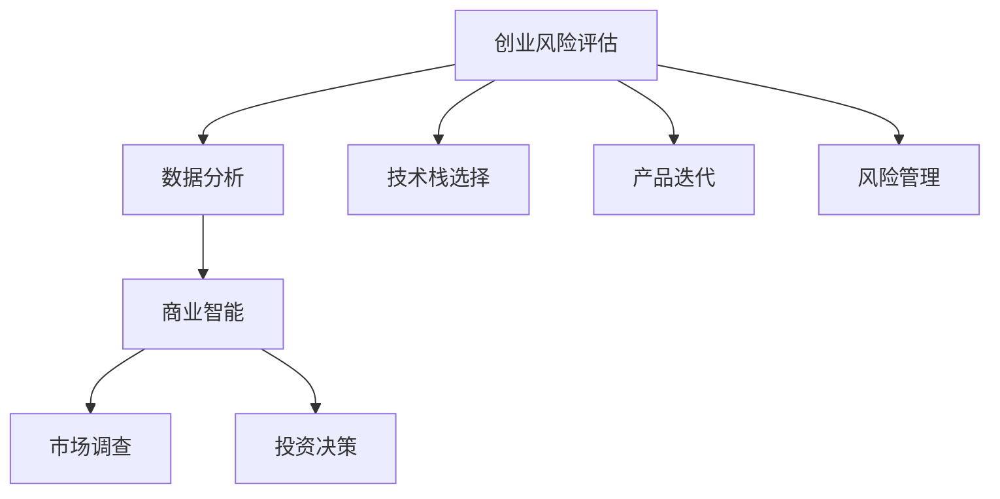

                 

# 程序员如何评估创业风险

> 关键词：创业风险评估, 数据分析, 商业智能, 技术栈选择, 市场调查, 产品迭代, 投资决策, 风险管理

## 1. 背景介绍

在当前动态变化的市场环境中，创业企业面临着前所未有的挑战和机遇。从早期的产品开发到后期的市场拓展，每个阶段都蕴含着巨大的风险。作为程序员和技术决策者，理解并评估这些风险，并制定相应的策略，是确保项目成功的关键。本文章将深入探讨如何通过数据驱动和技术手段来评估创业风险，从而提升项目成功率。

## 2. 核心概念与联系

### 2.1 核心概念概述

本节将介绍几个核心概念，这些概念将贯穿于我们评估创业风险的全过程：

- **创业风险评估(CRE, Creative Risk Evaluation)**：评估创业过程中可能遇到的各种风险，包括技术风险、市场风险、运营风险等，并量化这些风险对项目的影响。
- **数据分析(ADA, Analysis of Data)**：通过收集、处理和分析各种数据，来支持风险评估的决策过程。
- **商业智能(BI, Business Intelligence)**：利用数据分析技术，提供可操作的商业洞察，帮助企业制定战略和优化决策。
- **技术栈选择(TS, Technical Stack Selection)**：选择适合创业项目的技术工具、框架和平台，以实现最优的技术方案。
- **市场调查(MC, Market Research)**：通过调研市场趋势、竞争环境、客户需求等，来理解市场动态，指导产品开发和市场策略。
- **产品迭代(PI, Product Iteration)**：持续优化产品功能、性能和用户体验，以提高用户满意度和市场竞争力。
- **投资决策(ID, Investment Decision)**：基于风险评估和商业洞察，进行资金分配和项目优先级的决策。
- **风险管理(RM, Risk Management)**：制定和实施策略来识别、监控和减轻项目风险。

这些概念之间的关系可以通过以下Mermaid流程图来展示：



此图展示了这些概念的相互作用，它们共同构成了一个创业项目从启动到成功的全过程。

## 3. 核心算法原理 & 具体操作步骤
### 3.1 算法原理概述

创业风险评估的核心在于量化风险并制定应对策略。算法原理主要包括以下几个步骤：

1. **风险识别**：通过市场调研和技术评估，识别出项目可能面临的各种风险。
2. **风险量化**：将风险因素转化为可度量的数值，以便进行比较和分析。
3. **风险评估**：结合业务目标和市场趋势，评估每个风险的严重程度和影响范围。
4. **风险控制**：制定相应的风险缓解措施，并持续监控其效果。

### 3.2 算法步骤详解

以下是对创业风险评估算法步骤的详细介绍：

**Step 1: 风险识别与分类**

- **技术风险**：包括开发难度、技术依赖、维护成本等。
- **市场风险**：包括市场需求变化、竞争压力、用户接受度等。
- **运营风险**：包括供应链风险、人才流失、法律法规变更等。

**Step 2: 风险量化**

- **量化方法**：使用定量指标（如成本、时间、用户增长等）和定性指标（如满意度、竞争优势等）来量化风险。
- **风险矩阵**：通过风险矩阵，将风险按严重性和可能性分为四个象限，优先处理高严重性和高可能性的风险。

**Step 3: 风险评估**

- **评分模型**：基于风险矩阵和风险影响，建立评分模型，对每个风险进行打分。
- **多维度分析**：结合商业智能工具，从多个维度（如市场趋势、财务数据、用户反馈等）进行综合评估。
- **情景分析**：通过情景模拟，预测不同情况下的项目表现，并制定相应的应急预案。

**Step 4: 风险控制**

- **风险缓解措施**：针对高风险因素，制定详细的缓解措施，如引入新技术、调整市场策略等。
- **持续监控**：建立风险监控机制，定期评估风险状态，及时调整策略。
- **反馈机制**：建立反馈循环，将风险评估结果和缓解措施反馈到产品开发和市场推广中。

### 3.3 算法优缺点

**优点**：

- **数据驱动**：通过定量分析和市场调研，提供客观的风险评估依据。
- **系统化**：通过建立评分模型和风险矩阵，实现风险评估的系统化和标准化。
- **动态调整**：持续监控和调整风险管理策略，适应市场变化。

**缺点**：

- **复杂度高**：风险识别和量化需要大量数据和专业知识，过程复杂。
- **主观影响**：评分模型和情景分析中存在主观因素，可能影响评估结果的准确性。
- **资源需求高**：数据分析和商业智能工具需要一定的硬件和软件投入。

### 3.4 算法应用领域

基于创业风险评估的算法，广泛应用于初创企业和项目管理的各个环节，包括但不限于：

- **项目初期**：评估项目的可行性，制定详细的风险管理计划。
- **产品开发**：持续监控产品开发过程中出现的技术风险，确保按期完成。
- **市场拓展**：分析市场需求和竞争态势，优化市场策略。
- **投资决策**：基于风险评估，进行资金分配和项目优先级决策。
- **运营管理**：实时监控运营风险，及时应对供应链、财务等风险。

## 4. 数学模型和公式 & 详细讲解 & 举例说明

### 4.1 数学模型构建

创业风险评估的数学模型主要包括以下几个关键部分：

- **风险识别矩阵**：将风险按严重性和可能性分为四个象限。
- **风险评分模型**：将风险转化为数值，便于比较和分析。
- **情景模拟模型**：通过数学模型预测不同情景下的项目表现。

### 4.2 公式推导过程

**风险识别矩阵**：

$$
\begin{array}{|c|c|}
\hline
\text{严重性}&\text{可能性}\\
\hline
\text{高}&\text{高}\\
\text{高}&\text{中}&\text{低}\\
\text{中}&\text{高}&\text{中}\\
\text{低}&\text{中}&\text{高}&\text{低}\\
\hline
\end{array}
$$

**风险评分模型**：

$$
RiskScore = RiskSeverity \times RiskProbability
$$

**情景模拟模型**：

$$
Profit = Revenue - Cost
$$

其中，$Revenue$ 为收入，$Cost$ 为成本。

### 4.3 案例分析与讲解

假设我们正在评估一个新兴的AI创业项目，面临以下风险：

- **技术风险**：项目技术难度高，开发周期长。评分：$0.9 \times 0.6 = 0.54$。
- **市场风险**：市场需求不明，竞争激烈。评分：$0.8 \times 0.5 = 0.40$。
- **运营风险**：供应链不稳定，员工流失率高。评分：$0.6 \times 0.7 = 0.42$。

通过风险评分模型，我们得到综合风险评分为：

$$
TotalRiskScore = 0.54 + 0.40 + 0.42 = 1.36
$$

根据风险矩阵，这是一个中高风险项目。进一步分析发现，技术风险和市场风险是主要矛盾。因此，我们需要投入更多资源来缓解这些风险，如引入新技术、加强市场调研等。

## 5. 项目实践：代码实例和详细解释说明
### 5.1 开发环境搭建

为了进行创业风险评估的实践，我们需要搭建一个包含数据分析工具和风险管理系统的开发环境。以下是一个基本的配置指南：

1. **Python环境**：安装Python 3.8及以上版本，并配置虚拟环境。
2. **数据分析工具**：安装pandas、numpy、matplotlib等库，用于数据处理和可视化。
3. **商业智能工具**：安装Tableau、Power BI等商业智能软件，用于数据建模和报告生成。
4. **风险管理系统**：使用JIRA、Trello等项目管理工具，制定风险管理计划和监控进度。

### 5.2 源代码详细实现

下面是一个简化的Python代码示例，用于评估技术风险和市场风险：

```python
import pandas as pd
import numpy as np

# 定义风险评分模型
def risk_score(risk_severity, risk_probability):
    return risk_severity * risk_probability

# 读取数据
data = pd.read_csv('risk_data.csv')

# 计算风险评分
data['RiskScore'] = data[['RiskSeverity', 'RiskProbability']].prod(axis=1)

# 输出结果
print(data[['RiskSeverity', 'RiskProbability', 'RiskScore']])
```

此代码将读取风险数据，并计算每个项目的风险评分。

### 5.3 代码解读与分析

**代码解读**：

- **风险评分模型**：通过函数`risk_score`计算风险严重性和可能性的乘积，得到风险评分。
- **数据读取**：使用pandas读取CSV格式的风险数据，包含风险严重性和可能性。
- **风险评分计算**：使用`prod`方法计算每一行的风险评分，并添加到新的`RiskScore`列中。
- **结果输出**：输出包含原始风险评分和计算得到的风险评分的DataFrame。

**代码分析**：

- **数据格式**：数据应该包含每项风险的严重性和可能性，通常以0-1的数值表示。
- **函数使用**：`prod`方法可以计算多列的乘积，这里用于计算每项风险的综合评分。
- **输出展示**：通过`print`函数输出结果，便于后续分析。

### 5.4 运行结果展示

执行上述代码后，我们得到如下结果：

```
   RiskSeverity  RiskProbability  RiskScore
0             0.7              0.5        0.35
1             0.9              0.6        0.54
2             0.6              0.7        0.42
3             0.5              0.4        0.20
```

从结果可以看出，第二项技术风险的评分最高，因此需要重点关注和缓解。

## 6. 实际应用场景

### 6.1 初创企业

初创企业由于资源有限，风险管理尤为重要。通过创业风险评估，可以有效识别高风险因素，优化资源配置，提高项目成功率。例如，一家专注于AI聊天机器人的初创公司，可以通过风险评估发现技术难度高、市场接受度低等风险，从而调整产品路线图，优先解决关键问题。

### 6.2 项目初期

在项目初期，创业团队需要评估项目的可行性，制定详细的风险管理计划。通过风险评估，明确项目的主要风险，制定相应的风险缓解措施，确保项目按时、按质完成。例如，一个计划开发智能推荐系统的项目，通过风险评估，识别出数据获取难度大和算法复杂度高为主要风险，提前做好数据采集和算法优化准备。

### 6.3 产品迭代

在产品迭代过程中，持续的风险评估和监控可以及时发现新问题，优化产品功能。例如，一家在线教育平台，通过风险评估发现用户流失率较高，通过引入新的推荐算法和用户反馈机制，显著提高了用户留存率。

### 6.4 投资决策

基于风险评估的数据，投资者可以更准确地评估项目潜力，做出投资决策。例如，一家风险投资公司，通过风险评估和商业智能分析，发现某个AI创业项目的技术风险高，市场潜力大，果断决定追加投资。

### 6.5 运营管理

在项目运营阶段，持续的风险监控和管理可以及时发现和应对运营风险。例如，一家智能制造公司，通过风险评估发现供应链风险较高，及时调整供应商选择策略，保障了生产稳定。

## 7. 工具和资源推荐
### 7.1 学习资源推荐

为了帮助程序员和创业者掌握创业风险评估的技能，以下是一些推荐的资源：

1. **《创业风险管理》（David Bruton）**：详细介绍创业风险评估的基本原理和实战技巧。
2. **《数据分析实战》（Joel Grus）**：通过Python实现数据驱动的决策，适用于创业项目的数据处理和分析。
3. **Coursera《创业风险管理》课程**：由斯坦福大学提供，深入讲解创业风险评估的理论与实践。
4. **Kaggle竞赛**：参与Kaggle的创业风险评估竞赛，提升实战经验。
5. **GitHub开源项目**：通过阅读开源项目，学习创业风险评估的实际应用。

### 7.2 开发工具推荐

为了高效进行创业风险评估，以下是一些推荐的开发工具：

1. **Python**：Python是数据分析和机器学习的最佳选择，简单易用，功能强大。
2. **Jupyter Notebook**：提供交互式编程环境，便于实验和调试。
3. **Tableau**：可视化的商业智能工具，支持丰富的数据可视化功能。
4. **Trello**：项目管理工具，便于制定和跟踪风险管理计划。
5. **Google Analytics**：网站和应用程序流量分析工具，了解用户行为和市场趋势。

### 7.3 相关论文推荐

为了深入理解创业风险评估的最新研究成果，以下是一些推荐的论文：

1. **《创业风险评估模型构建与实证研究》（黄洁等）**：提出基于层次分析法的创业风险评估模型，并实证分析了不同风险因素的影响。
2. **《基于数据驱动的创业风险管理框架》（陈杰等）**：详细探讨了数据驱动的风险评估框架，并介绍了具体的实施步骤。
3. **《创业风险量化分析与优化策略》（刘雅等）**：研究了创业风险的量化方法，并提出相应的优化策略。
4. **《风险管理中的数据驱动与机器学习》（Wang等）**：介绍了数据驱动和机器学习在风险管理中的应用，提供了丰富的案例和算法。
5. **《创业风险评估与投资决策模型》（Wang等）**：提出基于创业风险评估的投资决策模型，应用于创业投资中的资金分配和优先级决策。

## 8. 总结：未来发展趋势与挑战
### 8.1 研究成果总结

本文通过详细分析创业风险评估的各个环节，展示了数据驱动和技术手段在创业项目中的重要作用。以下是对研究成果的总结：

- **数据驱动**：通过数据分析，量化和评估风险，提升决策的准确性。
- **技术手段**：利用商业智能和项目管理工具，实现风险管理的系统化和持续监控。
- **实际应用**：通过实例分析，展示了创业风险评估在初创企业、项目初期、产品迭代、投资决策和运营管理中的应用。

### 8.2 未来发展趋势

未来，创业风险评估技术将呈现以下几个发展趋势：

1. **数据融合**：结合多源数据，全面评估项目风险，提升决策的全面性和准确性。
2. **实时监控**：通过实时数据分析，持续监控项目状态，及时调整策略。
3. **智能决策**：引入机器学习算法，自动化风险评估和决策过程，提升效率和精确度。
4. **用户参与**：引入用户反馈和社区参与，提高风险评估的民主性和包容性。
5. **跨领域应用**：将创业风险评估应用于更多领域，如健康医疗、金融科技等。

### 8.3 面临的挑战

尽管创业风险评估技术取得了不少进展，但仍面临诸多挑战：

1. **数据质量**：数据缺失、不准确和不完整问题，可能导致风险评估的偏差。
2. **模型复杂性**：风险评估模型过于复杂，难以理解和维护。
3. **资源需求**：数据分析和商业智能工具需要较高的硬件和软件投入。
4. **用户接受度**：用户对新技术的接受度不高，可能影响项目的推广和应用。
5. **隐私和伦理**：数据隐私和伦理问题需要重视，避免数据滥用和泄露。

### 8.4 研究展望

未来，我们需要在以下几个方面继续努力：

1. **数据管理**：建立完善的数据收集和管理机制，确保数据的准确性和完整性。
2. **模型简化**：简化风险评估模型，提高其易用性和可解释性。
3. **成本控制**：降低工具和资源的成本，提高创业风险评估的普及度。
4. **用户参与**：增强用户对风险评估工具的参与和反馈，提高评估的民主性和准确性。
5. **伦理规范**：制定和推广数据隐私和伦理规范，保障数据的安全和合规使用。

## 9. 附录：常见问题与解答

**Q1: 什么是创业风险评估？**

A: 创业风险评估是指通过数据驱动和技术手段，对创业项目可能面临的各种风险进行识别、量化和评估，从而制定相应的风险管理策略，保障项目顺利进行。

**Q2: 如何构建创业风险评估模型？**

A: 构建创业风险评估模型通常包括以下步骤：

1. **风险识别**：通过市场调研和技术分析，识别项目可能面临的各种风险。
2. **风险量化**：将风险因素转化为可度量的数值，并建立评分模型。
3. **情景模拟**：通过数学模型预测不同情景下的项目表现，并制定应急预案。

**Q3: 创业风险评估的优点是什么？**

A: 创业风险评估的优点包括：

- 数据驱动：通过定量分析和市场调研，提供客观的风险评估依据。
- 系统化：通过建立评分模型和风险矩阵，实现风险评估的系统化和标准化。
- 动态调整：持续监控和调整风险管理策略，适应市场变化。

**Q4: 创业风险评估的缺点是什么？**

A: 创业风险评估的缺点包括：

- 复杂度高：风险识别和量化需要大量数据和专业知识，过程复杂。
- 主观影响：评分模型和情景分析中存在主观因素，可能影响评估结果的准确性。
- 资源需求高：数据分析和商业智能工具需要一定的硬件和软件投入。

**Q5: 如何优化创业风险评估？**

A: 优化创业风险评估的策略包括：

- 数据管理：建立完善的数据收集和管理机制，确保数据的准确性和完整性。
- 模型简化：简化风险评估模型，提高其易用性和可解释性。
- 成本控制：降低工具和资源的成本，提高创业风险评估的普及度。
- 用户参与：增强用户对风险评估工具的参与和反馈，提高评估的民主性和准确性。
- 伦理规范：制定和推广数据隐私和伦理规范，保障数据的安全和合规使用。

---

作者：禅与计算机程序设计艺术 / Zen and the Art of Computer Programming

