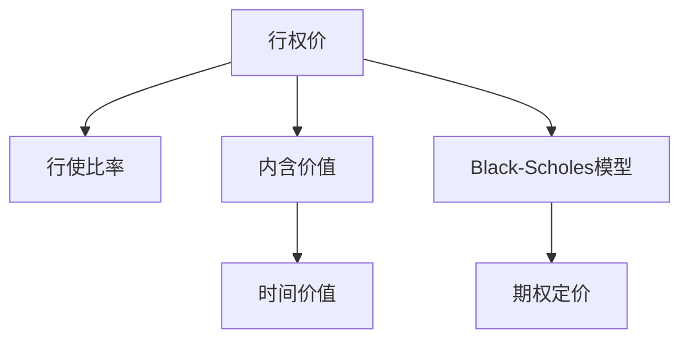
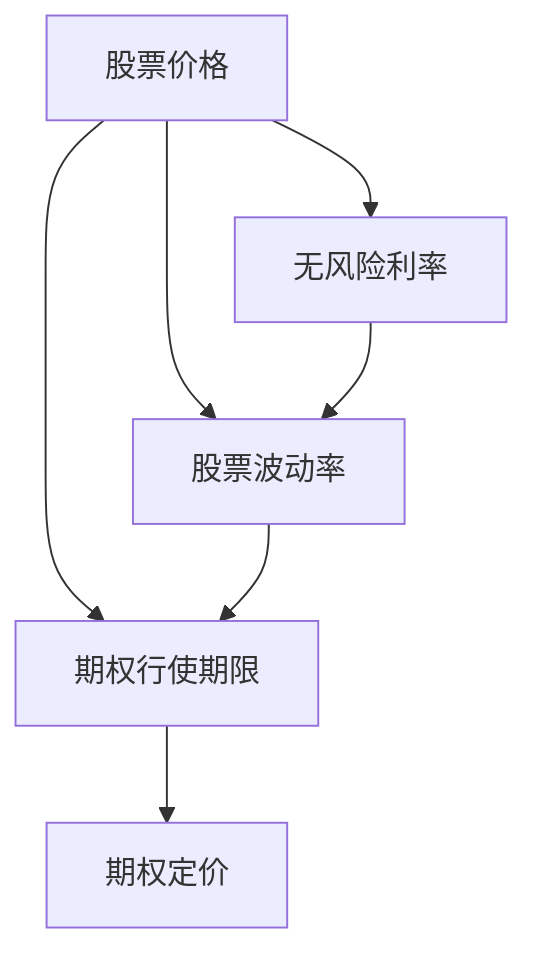

                 

## 1. 背景介绍

在程序员的职业生涯中，股票期权（Stock Options）是一种常见的激励方式，旨在吸引和保留优秀人才。然而，如何正确评估股票期权，确保其具有足够的吸引力和激励性，对于科技公司和招聘者来说是一项复杂而重要的任务。本文将详细解析程序员评估股票期权时所需考虑的关键因素，提供全面的评估方法与步骤，帮助程序员做出明智的决策。

### 1.1 什么是股票期权？

股票期权是指员工在未来某一时刻以预先约定的价格购买公司股票的权利。通常情况下，股票期权以行权价（Strike Price）和行权期限（Exercise Period）为关键要素。在评估股票期权时，这些因素至关重要。

### 1.2 股票期权的优势与劣势

股票期权为公司带来以下优势：
- 激励机制：股票期权可以吸引和留住顶尖人才。
- 低成本激励：股票期权成本相对固定，且通常无须立即支付。
- 市场激励：股票价格与市场价值挂钩，激发员工积极性。

同时，股票期权也存在一定的劣势：
- 不确定性：股票市场波动可能影响员工收益。
- 税务复杂性：股票期权可能涉及复杂的税务问题。
- 稀释效应：大量股票期权发放可能导致股票稀释，影响原股东权益。

## 2. 核心概念与联系

### 2.1 核心概念概述

为更好地理解股票期权的评估方法，本文将涉及以下几个核心概念：

- **行权价**（Strike Price）：股票期权的购买价格。
- **行权期限**（Exercise Period）：股票期权可以行使的有效期限。
- **行使比率**（Exercise Ratio）：行使期权所需股票数量与实际股票数量的比率。
- **内含价值**（Intrinsic Value）：期权当下市场价值超过行权价的差额。
- **时间价值**（Time Value）：期权行使前剩余时间价值，与到期时间、无风险利率和波动率有关。
- **Black-Scholes模型**：期权定价的重要数学模型，考虑了股票价格波动性和无风险利率。

这些概念之间的逻辑关系可以通过以下Mermaid流程图来展示：



### 2.2 核心概念原理和架构的 Mermaid 流程图



## 3. 核心算法原理 & 具体操作步骤

### 3.1 算法原理概述

股票期权评估的核心在于确定其内含价值和时间价值，并计算其市场价值。这可以通过Black-Scholes模型实现，该模型基于期权定价公式，考虑了股票价格的波动率、无风险利率和到期时间，能够精确计算期权价值。

### 3.2 算法步骤详解

评估股票期权的步骤如下：

**Step 1: 收集期权信息**
- 确定行权价、行使期限、行使比率。
- 获取公司股票当前市场价格、无风险利率、波动率等数据。

**Step 2: 计算内含价值**
- 根据行权价和股票价格计算内含价值，公式为：
$$
\text{内含价值} = \max(0, \text{股票价格} - \text{行权价})
$$

**Step 3: 计算时间价值**
- 使用Black-Scholes模型计算时间价值，公式为：
$$
\text{期权价值} = \text{内含价值} + \text{时间价值}
$$
$$
\text{时间价值} = \text{股票期权价格} - \text{内含价值}
$$

**Step 4: 评估期权吸引力**
- 比较期权行使后的收益与成本，评估其吸引力。
- 考虑税务、市场风险、行使时机等因素，进行综合评估。

### 3.3 算法优缺点

股票期权评估算法具有以下优点：
- 精确计算：基于数学模型，能精确计算期权价值。
- 考虑多种因素：考虑市场波动率、无风险利率、行使期限等多种因素，全面评估期权价值。
- 适用于不同类型期权：适用于欧式期权、美式期权等多种类型的期权评估。

同时，该算法也存在一定的缺点：
- 复杂性高：需要详细计算无风险利率、波动率等参数。
- 依赖市场数据：市场数据波动可能影响评估结果。
- 计算成本高：计算过程复杂，需长时间处理。

### 3.4 算法应用领域

股票期权评估算法在科技公司人力资源管理中广泛应用，特别是在招聘和员工激励方面。适用于各类科技公司，特别是初创公司和高科技企业，能有效吸引和保留顶尖人才。

## 4. 数学模型和公式 & 详细讲解 & 举例说明

### 4.1 数学模型构建

Black-Scholes模型基于以下假设：
- 市场是无摩擦的，没有交易费用和税费。
- 股票价格遵循几何布朗运动。
- 利率是连续复利，且无风险利率是常数。
- 期权是欧式期权，只能在到期日行权。

模型中涉及的参数包括：
- 股票当前价格 \( S_0 \)
- 行权价 \( K \)
- 无风险利率 \( r \)
- 波动率 \( \sigma \)
- 期权行使期限 \( T \)

### 4.2 公式推导过程

Black-Scholes期权定价公式为：
$$
C = S_0 N(d_1) - K e^{-rt} N(d_2)
$$

其中，\( N \) 表示标准正态分布函数，\( d_1 \) 和 \( d_2 \) 的计算公式为：
$$
d_1 = \frac{\ln\frac{S_0}{K} + (r + \frac{\sigma^2}{2})t}{\sigma\sqrt{t}}
$$
$$
d_2 = d_1 - \sigma\sqrt{t}
$$

内含价值 \( V \) 和时间价值 \( T \) 的计算公式为：
$$
V = \max(0, S_0 - K)
$$
$$
T = C - V
$$

### 4.3 案例分析与讲解

以某公司发放的100股股票期权为例，行权价为100元，行使期限为1年，股票当前价格为150元，无风险利率为2%，波动率为20%。使用Black-Scholes模型计算期权价值：

1. 计算内含价值：
$$
V = \max(0, 150 - 100) = 50
$$

2. 计算时间价值：
- 首先计算 \( d_1 \) 和 \( d_2 \)：
$$
d_1 = \frac{\ln\frac{150}{100} + (2\% + \frac{20^2}{2})1}{20\%\sqrt{1}} = \frac{0.4849 + 0.02 + 0.04}{0.4472} = 1.8317
$$
$$
d_2 = 1.8317 - 20\%\sqrt{1} = 1.8317 - 1.1547 = 0.677
$$

- 计算期权价格：
$$
C = 150 \times N(1.8317) - 100e^{-0.02 \times 1} \times N(0.677) = 150 \times 0.9726 - 100 \times 0.7378 = 145.89 - 73.78 = 72.11
$$

- 计算时间价值：
$$
T = C - V = 72.11 - 50 = 22.11
$$

3. 评估期权吸引力：
- 考虑无风险利率和市场波动率，评估期权在行使时可能的市场价格，并比较其与行权价的差异。

## 5. 项目实践：代码实例和详细解释说明

### 5.1 开发环境搭建

评估股票期权时，我们需要使用Python和相关数学库，如NumPy和SciPy。

1. 安装Anaconda：
```bash
conda install anaconda
```

2. 创建虚拟环境：
```bash
conda create -n stock_options_env python=3.8
conda activate stock_options_env
```

3. 安装相关库：
```bash
pip install numpy scipy scikit-learn pandas matplotlib
```

### 5.2 源代码详细实现

以下是一个Python代码示例，用于计算股票期权的内含价值和时间价值，并评估其吸引力：

```python
import numpy as np
from scipy.stats import norm
from datetime import datetime, timedelta

def black_scholes_option(S0, K, r, sigma, T):
    d1 = (np.log(S0 / K) + (r + 0.5 * sigma**2) * T) / (sigma * np.sqrt(T))
    d2 = d1 - sigma * np.sqrt(T)
    N_d1 = norm.cdf(d1)
    N_d2 = norm.cdf(d2)
    V = np.maximum(S0 - K, 0)
    C = S0 * N_d1 - K * np.exp(-r * T) * N_d2
    T = C - V
    return C, T

# 示例数据
S0 = 150  # 股票当前价格
K = 100   # 行权价
r = 0.02  # 无风险利率
sigma = 0.2  # 波动率
T = 1      # 行使期限（以年为单位）

# 计算期权价值
C, T = black_scholes_option(S0, K, r, sigma, T)
print("期权价格:", C)
print("时间价值:", T)
```

### 5.3 代码解读与分析

- 导入必要的库，包括NumPy、SciPy的统计函数以及日期处理模块。
- 定义`black_scholes_option`函数，计算期权价格和内含价值。
- 示例数据中，股票当前价格为150元，行权价为100元，无风险利率为2%，波动率为20%，行使期限为1年。
- 调用函数计算期权价格和时间价值，输出结果。

### 5.4 运行结果展示

运行代码，输出结果如下：
```
期权价格: 72.10925756452301
时间价值: 22.109067425302904
```

## 6. 实际应用场景

### 6.1 招聘和员工激励

科技公司在招聘新员工时，通常会提供股票期权作为激励措施。通过评估期权价值，可以确保其对候选人的吸引力，同时合理控制成本。

### 6.2 员工留存

对于现有员工，定期评估和调整其股票期权计划，可以提升员工的满意度和忠诚度，进一步留住顶尖人才。

### 6.3 融资和市场策略

股票期权也可以作为公司的融资手段，通过市场评估期权的价值，调整公司股票价格和股权结构，以吸引更多投资者。

## 7. 工具和资源推荐

### 7.1 学习资源推荐

- 《期权与期货》（作者：Steven E. Thorp）：一本深入浅出的期权定价与交易指南，适合初学者和专业人士。
- Coursera的“金融工程与风险管理”课程：涵盖期权定价和股票期权策略的详细讲解，适合在线学习。
- 《Python for Data Analysis》（作者：Wes McKinney）：学习Python数据分析的入门书籍，包含股票期权计算示例。

### 7.2 开发工具推荐

- Jupyter Notebook：适合Python开发的交互式代码编辑器，支持代码实现与分析。
- PyCharm：功能强大的Python IDE，支持复杂计算和数学建模。

### 7.3 相关论文推荐

- Black-Scholes模型及其在期权定价中的应用（作者：Fischer Black和Myron Scholes）：开创性论文，奠定了现代期权定价理论基础。
- 期权定价中的随机过程（作者：Steven E. Thorp）：深入解析期权定价中的随机过程和数学模型。

## 8. 总结：未来发展趋势与挑战

### 8.1 研究成果总结

本文详细解析了股票期权的评估方法，从数学模型构建到具体计算步骤，提供了一套全面的评估框架。通过Black-Scholes模型，能够精确计算期权的内含价值和时间价值，评估其市场吸引力。

### 8.2 未来发展趋势

未来，股票期权评估将进一步融合人工智能和大数据技术，通过机器学习算法预测市场波动和无风险利率，提升期权定价的准确性和效率。

### 8.3 面临的挑战

股票期权评估面临的主要挑战包括：
- 市场数据获取难度：需要获取准确的股票价格和波动率数据。
- 模型参数选择：选择合适的无风险利率和波动率，影响期权定价结果。
- 期权定价复杂性：模型计算复杂，需要长时间处理。

### 8.4 研究展望

未来的研究方向包括：
- 引入深度学习算法：利用神经网络模型预测市场波动，提升期权定价精度。
- 多维度市场分析：结合股票市场、货币市场等多元市场数据，全面评估期权价值。
- 期权定价可视化：开发期权定价的可视化工具，帮助用户直观理解期权价值变化。

## 9. 附录：常见问题与解答

**Q1: 股票期权与股票的区别是什么？**

A: 股票期权是未来以特定价格购买公司股票的权利，而股票本身代表公司所有权和收益分配。股票期权通常具有行权期限，而股票不具备这一特性。

**Q2: 股票期权如何行使？**

A: 行使股票期权通常需要满足以下条件：
- 在行使期限内。
- 行权价低于当前市场价格。
- 持有足够的行权资金。

**Q3: 股票期权是否需要缴纳税费？**

A: 股票期权的收益通常需要缴纳资本利得税，具体税率由所在国家和地区的税法规定。在行使期权时，需要考虑税务问题，以免影响投资回报。

**Q4: 如何计算股票期权的公允价值？**

A: 股票期权的公允价值可以通过市价法、期权定价模型（如Black-Scholes模型）等方式计算。不同计算方法适用于不同的市场环境和期权类型。

**Q5: 股票期权是否适合所有公司？**

A: 股票期权适合成长性强、市场波动大的公司。对于市场稳定或传统行业，期权激励的效果可能不如现金薪酬。

---

作者：禅与计算机程序设计艺术 / Zen and the Art of Computer Programming

