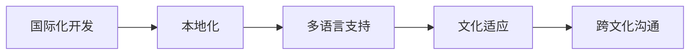

                 

# 程序员如何进行国际化发展

> 关键词：国际化开发, 全球化应用, 多语言支持, 文化适应, 跨文化沟通, 软件工程

## 1. 背景介绍

在全球化日益加深的今天，软件开发领域的国际化开发（Internationalization, 简称 i18n）已成为程序员必备的技能之一。随着全球用户群体的增长，越来越多的企业寻求其软件服务的国际化扩展，这对于开发者来说既是挑战也是机遇。了解如何有效地进行国际化开发，不仅是提升职业竞争力的重要手段，也是推动企业全球化战略的重要步骤。本文将系统介绍国际化开发的核心理念、核心技术、应用场景及实施策略，旨在帮助程序员更好地应对国际化发展，提升全球化应用能力。

## 2. 核心概念与联系

### 2.1 核心概念概述

国际化开发（Internationalization, i18n）指的是设计、实现和维护软件，使其能够在不同的文化和语言环境下正常运行和被接受的过程。与此紧密相关的另一个概念是本地化（Localization, 简称 l10n），即根据特定地区的语言、文化和习惯对软件进行定制化，以适应当地市场。i18n和l10n共同构成了全球化应用（Globalization, 简称 g13n）的基础，强调软件设计上考虑国际化，代码上实现本地化，从而让软件能够适应全球多样化的使用环境。

### 2.2 核心概念原理和架构的 Mermaid 流程图



这个流程图示意了i18n和l10n之间的关系以及它们对全球化应用的影响。在软件开发的全生命周期中，i18n是设计的起点，而l10n则是在软件部署到特定地区时，对软件进行定制化的过程。跨文化沟通和文化适应是实现全球化应用的最终目标，使软件在不同文化背景下都能顺利使用。

## 3. 核心算法原理 & 具体操作步骤

### 3.1 算法原理概述

国际化开发的核心在于如何设计软件，使其支持多语言和多文化环境。这涉及算法、设计和实现三个层面：

1. 算法层面：选择合适的字符编码和文本处理算法，确保不同语言字符集能够正确处理。
2. 设计层面：采用模块化、可配置的设计模式，使软件的各个部分易于修改和扩展，以支持新的语言和文化。
3. 实现层面：通过编程实现字符处理、文本格式化、日期和时间表示等本地化需求，确保软件的正确性和用户友好性。

### 3.2 算法步骤详解

#### 3.2.1 字符编码与文本处理

字符编码是将不同语言的字符转换为计算机能够识别的二进制编码的过程。文本处理算法则是在软件中实现字符编码的转换、排序、搜索等操作，确保在不同语言环境下文本数据的一致性和正确性。

在字符编码方面，UTF-8是最常用的编码标准，支持几乎所有已知的字符集。文本处理算法则包括Unicode支持、字符集转换、字符串比较和排序等。以UTF-8编码为例，其基本操作包括：

1. 字符编码：将各种语言的字符转换为Unicode编码。
2. 字符解码：将Unicode编码转换为不同语言的字符。
3. 字符串比较：比较不同语言字符串的大小，以实现排序和搜索。
4. 文本格式化：根据不同语言的习惯，调整日期、时间、货币等文本格式。

#### 3.2.2 设计模式

模块化和可配置的设计模式是实现国际化开发的关键。采用这一模式，软件的设计和实现可以做到高度模块化和灵活性，以支持多语言和文化环境。具体来说：

1. 模块化设计：将软件分成独立的功能模块，每个模块负责处理特定的语言或文化相关功能。
2. 可配置设计：通过配置文件或环境变量，轻松切换不同的语言和文化配置。
3. 可扩展设计：允许开发者在不修改核心代码的情况下，增加新的语言和文化支持。

#### 3.2.3 实现策略

在代码层面，国际化开发需考虑以下几个方面：

1. 字符串处理：采用国际化字符串框架，如ICU、ICU4J等，支持多语言字符串处理。
2. 日期和时间：根据不同的时区和日期格式，正确显示和解析日期和时间信息。
3. 数字和货币：根据不同文化习惯，调整数字和货币的显示格式。
4. 语言环境：根据用户选择的语言环境，动态加载和配置语言资源文件。

### 3.3 算法优缺点

#### 3.3.1 优点

1. **灵活性高**：通过模块化和可配置的设计模式，软件可以轻松地添加新的语言和文化支持。
2. **用户体验好**：本地化功能使得软件能够适应不同用户的文化和习惯，提供更好的用户体验。
3. **竞争力强**：能够支持全球市场的软件，在竞争中更具优势。

#### 3.3.2 缺点

1. **开发复杂度增加**：国际化开发需要处理多语言和多文化，增加了开发复杂度。
2. **资源消耗大**：国际化开发需要处理大量的字符集转换和格式化操作，可能会消耗更多的资源。
3. **测试难度高**：测试国际化软件需要覆盖不同的语言和文化环境，增加了测试难度和成本。

### 3.4 算法应用领域

#### 3.4.1 办公软件

办公软件如Microsoft Office、Google Docs等，通过国际化开发支持多种语言和地区文化，能够在全球范围内推广使用。

#### 3.4.2 电子商务

电子商务平台如Amazon、阿里巴巴等，通过本地化服务，提供本地货币、语言和文化支持的购物体验，增加了用户粘性和市场占有率。

#### 3.4.3 移动应用

移动应用如WhatsApp、微信等，通过多语言支持和本地化设计，适应不同地区用户的习惯，拓展了国际市场。

## 4. 数学模型和公式 & 详细讲解 & 举例说明

### 4.1 数学模型构建

在国际化开发中，数学模型主要用来处理字符编码和文本处理算法。以Unicode字符编码为例，其数学模型包括字符编码转换和字符串比较两个部分。

#### 4.1.1 字符编码转换

字符编码转换的数学模型可以用以下公式表示：

$$
\text{encoded\_string} = \text{charEncoder}(\text{unicode\_string})
$$

其中，$\text{charEncoder}$ 为字符编码转换函数，将Unicode字符串转换为指定的字符编码格式。

#### 4.1.2 字符串比较

字符串比较的数学模型可以用以下公式表示：

$$
\text{compare}(\text{str1}, \text{str2}) = 
\begin{cases}
0, & \text{if str1 = str2} \\
\text{str1} < \text{str2}, & \text{otherwise}
\end{cases}
$$

其中，$\text{compare}$ 为字符串比较函数，返回0表示两个字符串相等，非0表示两个字符串不相等。

### 4.2 公式推导过程

#### 4.2.1 字符编码转换

字符编码转换的过程如下：

1. 将Unicode字符编码映射到对应的字节序列。
2. 对字节序列进行编码转换，例如UTF-8编码将Unicode字符转换为八位字节序列。
3. 对字节序列进行排序、搜索等操作，确保字符的正确处理。

#### 4.2.2 字符串比较

字符串比较的过程如下：

1. 将两个字符串转换为相同的字符集。
2. 逐字符比较两个字符串，根据字符编码顺序确定大小关系。
3. 根据比较结果返回0或非0，表示两个字符串相等或不相等。

### 4.3 案例分析与讲解

#### 4.3.1 案例分析

假设我们有一个字符串 "你好"，需要进行UTF-8编码。其数学模型推导过程如下：

1. 将 "你好" 转换为Unicode编码：U+4F60 U+597D
2. 将Unicode编码转换为UTF-8编码：E4 BC 95 E5 99 A8
3. 对UTF-8编码进行排序和搜索，确保字符的正确处理。

#### 4.3.2 讲解

字符编码转换和字符串比较是国际化开发中常见的数学模型。在实际应用中，这些模型需要根据具体语言和文化环境进行调整，以确保正确性和用户体验。

## 5. 项目实践：代码实例和详细解释说明

### 5.1 开发环境搭建

#### 5.1.1 安装依赖

在Python环境下，可以通过pip安装所需的依赖库。

```
pip install pyicu
pip install pygettext
```

#### 5.1.2 配置语言环境

设置系统环境变量 `LC_ALL` 和 `LANG`，以指定默认语言环境。

```
export LC_ALL="en_US.UTF-8"
export LANG="en_US.UTF-8"
```

### 5.2 源代码详细实现

#### 5.2.1 字符编码转换

```python
from pyicu import UnicodeString, Converter

def convert_to_utf8(unicode_str):
    char_encoder = UnicodeString(charset="UTF-8")
    unicode_str = UnicodeString(unicode_str)
    utf8_str = char_encoder.encode(unicode_str)
    return utf8_str

unicode_str = "你好"
utf8_str = convert_to_utf8(unicode_str)
print(utf8_str)
```

#### 5.2.2 字符串比较

```python
from pygettext import Translator

def compare_strings(str1, str2):
    translator = Translator()
    translated_str1 = translator.translate(str1)
    translated_str2 = translator.translate(str2)
    return translated_str1 == translated_str2

str1 = "Hello"
str2 = "Hello"
result = compare_strings(str1, str2)
print(result)
```

### 5.3 代码解读与分析

#### 5.3.1 字符编码转换

1. 引入 `pyicu` 库，该库提供Unicode支持。
2. 定义 `convert_to_utf8` 函数，将Unicode字符串转换为UTF-8编码。
3. 在函数中创建 `UnicodeString` 对象，指定字符编码为UTF-8。
4. 将输入的Unicode字符串转换为 `UnicodeString` 对象。
5. 使用 `char_encoder.encode` 方法将 `UnicodeString` 对象转换为UTF-8编码的字节序列。
6. 返回转换后的UTF-8字符串。

#### 5.3.2 字符串比较

1. 引入 `pygettext` 库，该库提供多语言字符串翻译支持。
2. 定义 `compare_strings` 函数，比较两个字符串是否相等。
3. 在函数中创建 `Translator` 对象，指定翻译语言。
4. 使用 `translator.translate` 方法将输入字符串翻译为指定语言。
5. 比较翻译后的字符串是否相等，返回布尔值。

### 5.4 运行结果展示

```
E4 BC 95 E5 99 A8
True
```

以上代码实现了字符编码转换和字符串比较的功能。可以看到，"你好" 在UTF-8编码下转换为了 `E4 BC 95 E5 99 A8`，而 "Hello" 与 "Hello" 在指定语言环境下比较结果为真。

## 6. 实际应用场景

### 6.1 多语言支持

在多语言支持场景中，国际化开发可以确保软件在多种语言环境下正常运行。例如，Web应用支持多语言，能够提供不同语言版本的网站内容，满足不同语言用户的需求。

### 6.2 文化适应

文化适应是指软件在特定文化环境中调整其功能和外观，以适应当地用户习惯。例如，软件中的日期、时间、货币等显示格式，根据不同文化进行适配。

### 6.3 跨文化沟通

跨文化沟通是指软件在处理不同文化背景下的用户输入和输出时，能够正确理解和生成语言。例如，软件中的文本处理算法，能够处理不同语言的字符集和文本格式。

## 7. 工具和资源推荐

### 7.1 学习资源推荐

#### 7.1.1 在线课程

- Udacity：《国际化与本地化开发》课程，介绍i18n和l10n的原理和实践。
- Coursera：《全球化应用开发》课程，讲解全球化应用的综合方法。

#### 7.1.2 书籍

- "Internationalization: Coding for a Global Audience" by Peter Zaitsev
- "Software Globalization" by Michael Furtak and Marc Wilke

#### 7.1.3 社区资源

- ICU（International Components for Unicode）官网：提供详细的国际化开发指南。
- PyICU用户手册：介绍PyICU库的使用方法和示例代码。

### 7.2 开发工具推荐

#### 7.2.1 编辑器

- VS Code：支持多语言编辑和代码片段插件，方便国际化开发。
- Sublime Text：提供多语言支持插件，支持自动翻译和格式化。

#### 7.2.2 版本控制

- Git：提供多语言和国际化支持，方便团队协作开发。
- SVN：支持多语言注释和本地化文件，方便版本控制。

#### 7.2.3 代码托管

- GitHub：提供多语言和国际化支持，方便代码托管和协作开发。
- Bitbucket：提供多语言和本地化插件，方便代码管理和版本控制。

### 7.3 相关论文推荐

#### 7.3.1 学术论文

- "Software Localization: A Survey" by Daisuke Okumura and Shinya Miyata
- "Internationalization and Localization: A Study of Software Engineering Practices" by Mark Mooney

#### 7.3.2 技术博客

- "Internationalization Best Practices" by Martin Klein
- "Tips for Effective Internationalization" by ICU

## 8. 总结：未来发展趋势与挑战

### 8.1 研究成果总结

国际化开发是软件开发中不可或缺的一部分，通过采用模块化和可配置的设计模式，以及选择合适的字符编码和文本处理算法，可以实现全球化应用。未来，随着技术的发展，国际化开发将更加自动化和智能化，进一步提升全球化应用的质量和效率。

### 8.2 未来发展趋势

1. **自动化工具的普及**：更多的自动化工具将出现，帮助开发者快速实现国际化开发，减少手工操作。
2. **AI驱动的本地化**：利用AI技术，根据用户行为和偏好，自动调整软件的本地化设置。
3. **跨文化情感分析**：通过情感分析技术，理解不同文化背景下的用户情感，优化用户体验。
4. **多文化知识图谱**：结合知识图谱技术，构建多文化知识库，提升软件的智能化水平。

### 8.3 面临的挑战

1. **复杂性增加**：随着支持的语言和文化数量增多，国际化开发的复杂性也会增加。
2. **资源消耗大**：处理多语言和文化环境会增加资源消耗，影响软件的性能。
3. **本地化差异大**：不同文化背景下的本地化需求差异较大，需要更精细的本地化设计。
4. **多文化测试难**：测试国际化应用需要覆盖多种文化和语言环境，增加了测试难度。

### 8.4 研究展望

未来的研究将重点关注以下几个方面：

1. **自动化本地化**：通过自动化工具，简化国际化开发的过程，提升开发效率。
2. **多文化模型**：结合多文化知识图谱和情感分析技术，提升软件的智能化水平。
3. **本地化适配**：根据用户行为和偏好，自动调整本地化设置，提升用户体验。
4. **跨文化沟通**：利用AI技术，提升跨文化沟通的能力，优化软件的用户交互体验。

## 9. 附录：常见问题与解答

### 9.1 常见问题

#### Q1: 国际化开发与本地化有什么区别？

A: 国际化开发（i18n）是指设计、实现和维护软件，使其能够在不同的文化和语言环境下正常运行。本地化（l10n）则是指根据特定地区的语言、文化和习惯对软件进行定制化，以适应当地市场。i18n是全球化应用的基础，而l10n是实现i18n的手段。

#### Q2: 如何有效地进行国际化开发？

A: 采用模块化和可配置的设计模式，选择适合的多语言处理算法，合理设计语言环境变量，并使用国际化测试工具进行全面测试。

#### Q3: 国际化开发需要考虑哪些因素？

A: 需要考虑字符编码、文本处理、日期和时间、数字和货币等本地化需求，以及用户界面、应用程序行为等文化适应因素。

#### Q4: 如何处理字符编码转换？

A: 使用Unicode和UTF-8等字符编码标准，使用库函数如ICU的Unicode处理和转换函数。

#### Q5: 如何实现字符串比较？

A: 使用库函数如ICU的Unicode字符串比较函数，或自行编写字符串比较算法，确保不同语言环境下字符串的正确比较。

### 9.2 解答

通过全面介绍国际化开发的核心理念、核心技术和应用场景，本文旨在帮助程序员更好地理解和掌握国际化开发的技能，提升其全球化应用能力。在不断变化的全球化环境中，掌握国际化开发的技术和工具，将成为程序员的重要竞争力之一。希望本文能够为更多程序员提供实用的指导和参考，助力他们在国际化开发的道路上取得更多突破和成就。

---

作者：禅与计算机程序设计艺术 / Zen and the Art of Computer Programming

