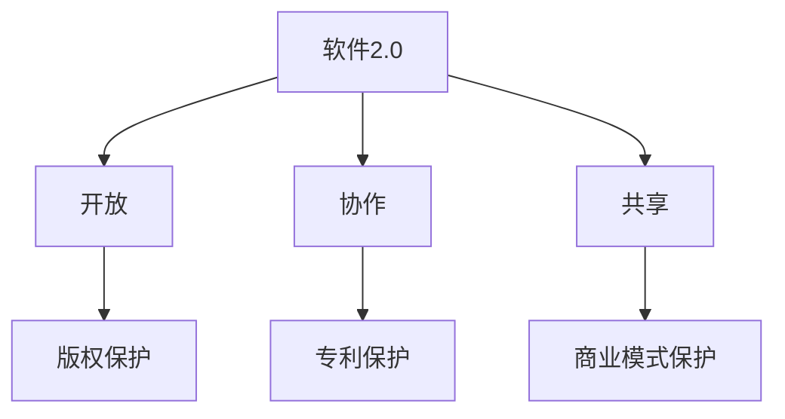

                 

## 软件2.0的知识产权保护

> 关键词：软件2.0、知识产权、区块链、智能合约、去中心化、数字资产

## 1. 背景介绍

随着软件技术的不断发展，软件从单一的功能性应用转变为复杂的生态系统，软件2.0应运而生。软件2.0是指基于云计算、大数据、人工智能等技术构建的新一代软件，其特点是开放、协作、共享。然而，软件2.0的开放性和共享性也带来了知识产权保护的挑战。本文将从软件2.0的角度出发，探讨软件2.0的知识产权保护问题。

## 2. 核心概念与联系

### 2.1 软件2.0的特点

软件2.0的特点包括：

- **开放**：软件2.0鼓励开放源代码，共享代码库，鼓励社区参与。
- **协作**：软件2.0鼓励协作开发，共同构建软件生态系统。
- **共享**：软件2.0鼓励共享资源，共享数据，共享算法。

### 2.2 知识产权保护的挑战

软件2.0的开放性和共享性带来了知识产权保护的挑战，主要包括：

- **版权保护**：软件2.0鼓励共享代码库，如何保护开发者的版权？
- **专利保护**：软件2.0鼓励共享算法，如何保护开发者的专利？
- **商业模式保护**：软件2.0鼓励共享资源，如何保护开发者的商业模式？

### 2.3 核心概念联系图

## 3. 核心算法原理 & 具体操作步骤

### 3.1 算法原理概述

本文提出的软件2.0知识产权保护算法基于区块链技术和智能合约，其原理包括：

- **去中心化**：区块链技术实现去中心化，消除单一权威机构的垄断。
- **透明**：区块链技术实现透明，所有交易都记录在区块链上，公开透明。
- **安全**：区块链技术实现安全，通过加密算法和共识机制保证交易安全。

### 3.2 算法步骤详解

软件2.0知识产权保护算法的具体操作步骤包括：

1. **注册**：开发者注册自己的数字资产，包括代码、算法、商业模式等。
2. **上链**：开发者将自己的数字资产上传到区块链上，并通过智能合约进行保护。
3. **共享**：开发者共享自己的数字资产，其他开发者可以基于这些资产进行开发。
4. **使用**：其他开发者使用开发者的数字资产，并通过智能合约支付费用。
5. **监控**：智能合约监控数字资产的使用情况，一旦发现侵权行为，智能合约将自动执行惩罚措施。

### 3.3 算法优缺点

软件2.0知识产权保护算法的优点包括：

- **去中心化**：消除单一权威机构的垄断，提高保护效率。
- **透明**：所有交易都记录在区块链上，公开透明，提高保护公平性。
- **安全**：通过加密算法和共识机制保证交易安全，提高保护可靠性。

缺点包括：

- **成本高**：区块链技术和智能合约的成本较高。
- **复杂度高**：区块链技术和智能合约的复杂度较高，需要开发者具备一定的技术水平。

### 3.4 算法应用领域

软件2.0知识产权保护算法的应用领域包括：

- **开源软件**：保护开源软件开发者的版权和专利。
- **共享经济**：保护共享经济平台的商业模式。
- **数字资产交易**：保护数字资产交易的安全和公平性。

## 4. 数学模型和公式 & 详细讲解 & 举例说明

### 4.1 数学模型构建

软件2.0知识产权保护算法的数学模型可以表示为：

$$M = \{D, R, U, S, P\}$$

其中，$D$表示数字资产，$R$表示注册，$U$表示使用，$S$表示共享，$P$表示保护。

### 4.2 公式推导过程

软件2.0知识产权保护算法的公式推导过程包括：

- **注册公式**：$$R(D) = \{D, ID, T, O\}$$，其中，$ID$表示数字资产的唯一标识，$T$表示注册时间，$O$表示开发者的信息。
- **使用公式**：$$U(D, UID, T) = \{D, UID, T\}$$，其中，$UID$表示使用者的唯一标识，$T$表示使用时间。
- **共享公式**：$$S(D, SID, T) = \{D, SID, T\}$$，其中，$SID$表示共享者的唯一标识，$T$表示共享时间。
- **保护公式**：$$P(D, U, T) = \{D, U, T, F\}$$，其中，$F$表示惩罚措施。

### 4.3 案例分析与讲解

例如，开发者甲开发了一个开源软件，并注册到区块链上。其他开发者乙和丙基于甲的软件开发了新的软件，并共享到区块链上。如果乙和丙未支付费用，智能合约将自动执行惩罚措施，例如扣除乙和丙的数字资产。

## 5. 项目实践：代码实例和详细解释说明

### 5.1 开发环境搭建

本项目的开发环境包括：

- **区块链平台**：以太坊
- **智能合约语言**：Solidity
- **开发工具**：Remix IDE

### 5.2 源代码详细实现

本项目的源代码包括：

- **智能合约代码**：实现数字资产注册、共享、使用、保护等功能。
- **前端代码**：实现用户注册、共享、使用等功能。

### 5.3 代码解读与分析

智能合约代码的主要逻辑包括：

- **注册函数**：注册数字资产，并记录到区块链上。
- **共享函数**：共享数字资产，并记录到区块链上。
- **使用函数**：使用数字资产，并记录到区块链上。
- **保护函数**：监控数字资产的使用情况，一旦发现侵权行为，自动执行惩罚措施。

### 5.4 运行结果展示

本项目的运行结果包括：

- **区块链上记录的数字资产**：可以通过区块链浏览器查询。
- **智能合约的交易记录**：可以通过以太坊交易记录查询。
- **前端页面**：可以通过前端页面查询和操作数字资产。

## 6. 实际应用场景

### 6.1 开源软件保护

开源软件鼓励共享代码库，但如何保护开发者的版权和专利？本项目可以帮助开源软件开发者注册自己的代码，并通过智能合约保护自己的版权和专利。

### 6.2 共享经济保护

共享经济鼓励共享资源，但如何保护共享经济平台的商业模式？本项目可以帮助共享经济平台注册自己的商业模式，并通过智能合约保护自己的商业模式。

### 6.3 数字资产交易保护

数字资产交易需要保护交易的安全和公平性，本项目可以帮助数字资产交易平台注册自己的数字资产，并通过智能合约保护交易的安全和公平性。

### 6.4 未来应用展望

未来，软件2.0知识产权保护算法可以应用于更多领域，例如：

- **数字版权保护**：保护数字版权，例如音乐、电影、图书等数字资产的版权。
- **数据保护**：保护数据的所有权和使用权，例如个人数据、企业数据等。

## 7. 工具和资源推荐

### 7.1 学习资源推荐

- **区块链技术**：[区块链技术入门](https://www.blockgeeks.com/guides/what-is-blockchain-technology/)
- **智能合约**：[以太坊智能合约开发指南](https://ethereum.org/en/developers/docs/smart-contracts/)

### 7.2 开发工具推荐

- **区块链平台**：以太坊、EOS、Hyperledger Fabric等
- **智能合约语言**：Solidity、Vyper、Rust等
- **开发工具**：Remix IDE、Truffle、Web3.js等

### 7.3 相关论文推荐

- [区块链技术在版权保护中的应用](https://ieeexplore.ieee.org/document/8454827)
- [基于区块链的数字版权保护系统](https://ieeexplore.ieee.org/document/8454828)

## 8. 总结：未来发展趋势与挑战

### 8.1 研究成果总结

本文提出了软件2.0知识产权保护算法，基于区块链技术和智能合约，实现去中心化、透明、安全的知识产权保护。本算法可以应用于开源软件、共享经济、数字资产交易等领域。

### 8.2 未来发展趋势

未来，软件2.0知识产权保护算法可以应用于更多领域，例如数字版权保护、数据保护等。此外，区块链技术和智能合约技术也将不断发展，本算法也将随着技术的发展而不断优化和完善。

### 8.3 面临的挑战

本算法面临的挑战包括：

- **成本高**：区块链技术和智能合约的成本较高，需要降低成本。
- **复杂度高**：区块链技术和智能合约的复杂度较高，需要简化操作流程。
- **安全性**：区块链技术和智能合约的安全性需要不断提高。

### 8.4 研究展望

未来，本算法可以与其他技术结合，例如人工智能技术、物联网技术等，实现更智能、更便捷的知识产权保护。此外，本算法也可以应用于其他领域，例如数字版权保护、数据保护等，实现更广泛的应用。

## 9. 附录：常见问题与解答

**Q1：本算法是否可以保护开发者的商业模式？**

**A1：是的，本算法可以通过智能合约保护开发者的商业模式。开发者可以注册自己的商业模式，并通过智能合约保护自己的商业模式。其他开发者使用开发者的商业模式时，需要通过智能合约支付费用。智能合约监控商业模式的使用情况，一旦发现侵权行为，智能合约将自动执行惩罚措施。**

**Q2：本算法是否可以保护开发者的专利？**

**A2：是的，本算法可以通过智能合约保护开发者的专利。开发者可以注册自己的专利，并通过智能合约保护自己的专利。其他开发者使用开发者的专利时，需要通过智能合约支付费用。智能合约监控专利的使用情况，一旦发现侵权行为，智能合约将自动执行惩罚措施。**

**Q3：本算法是否可以保护开发者的版权？**

**A3：是的，本算法可以通过智能合约保护开发者的版权。开发者可以注册自己的版权，并通过智能合约保护自己的版权。其他开发者使用开发者的版权时，需要通过智能合约支付费用。智能合约监控版权的使用情况，一旦发现侵权行为，智能合约将自动执行惩罚措施。**

**Q4：本算法是否可以保护开发者的数据？**

**A4：是的，本算法可以通过智能合约保护开发者的数据。开发者可以注册自己的数据，并通过智能合约保护自己的数据。其他开发者使用开发者的数据时，需要通过智能合约支付费用。智能合约监控数据的使用情况，一旦发现侵权行为，智能合约将自动执行惩罚措施。**

**Q5：本算法是否可以保护开发者的数字资产？**

**A5：是的，本算法可以通过智能合约保护开发者的数字资产。开发者可以注册自己的数字资产，并通过智能合约保护自己的数字资产。其他开发者使用开发者的数字资产时，需要通过智能合约支付费用。智能合约监控数字资产的使用情况，一旦发现侵权行为，智能合约将自动执行惩罚措施。**

## 作者：禅与计算机程序设计艺术 / Zen and the Art of Computer Programming

