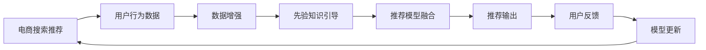

                 

## 1. 背景介绍

在现代电子商务中，个性化搜索和推荐系统已成为用户体验的关键。大模型凭借其强大的泛化能力，成为电商搜索推荐的首选。然而，对于新用户，由于缺乏足够的行为数据，大模型往往难以提供满意的推荐结果。为应对数据不足和冷启动的挑战，研究者提出了多种策略，包括冷启动模型融合、推荐数据增强、先验知识引导等。本文将深入探讨这些策略的原理与实践，帮助读者构建更高效、精准的电商搜索推荐系统。

## 2. 核心概念与联系

### 2.1 核心概念概述

- **电商搜索推荐**：利用大模型，根据用户查询历史、浏览记录、购买行为等数据，推荐最相关、最受欢迎的商品或服务。
- **冷启动问题**：对于新用户或无行为数据用户，传统推荐系统难以生成准确推荐，需借助冷启动策略解决。
- **数据不足**：新用户或非活跃用户的数据量往往不足以支撑大模型的训练与优化，需引入其他数据源或算法以缓解。
- **先验知识**：结合领域专家知识或结构化数据，引导模型学习更合理、更全面的知识结构。
- **推荐模型融合**：利用多个推荐模型输出，提高推荐的稳定性和多样性，提升用户满意度。
- **推荐数据增强**：通过多样化的数据来源和处理方法，丰富推荐数据，减少数据不足的负面影响。

这些概念紧密联系，共同构成了电商搜索推荐系统中的冷启动策略，旨在克服数据不足的限制，提升推荐系统的性能。

### 2.2 核心概念原理和架构的 Mermaid 流程图



## 3. 核心算法原理 & 具体操作步骤

### 3.1 算法原理概述

电商搜索推荐系统基于用户的搜索历史、浏览行为和购买记录，预测用户可能感兴趣的商品或服务。冷启动策略的原理在于，利用先验知识、数据增强等手段，弥补数据不足的缺陷，使系统能够为新用户或低活跃用户提供高质量推荐。

核心算法原理可以概括为：

1. **用户画像建模**：通过综合用户行为数据、先验知识，构建用户画像。
2. **推荐模型融合**：利用多个推荐模型输出，减少单模型的局限性，提升推荐多样性。
3. **推荐数据增强**：通过多样化数据源和处理方法，提升推荐数据质量。
4. **模型更新迭代**：根据用户反馈，持续更新模型参数，提升推荐精度。

### 3.2 算法步骤详解

#### 3.2.1 用户画像建模

- **步骤1：数据预处理**：收集用户的基本信息、搜索历史、浏览记录、购买行为等数据，清洗和处理缺失值和异常值。
- **步骤2：特征提取**：利用NLP技术提取用户搜索、浏览、评价等文本数据中的语义特征，如TF-IDF、Word2Vec等。
- **步骤3：先验知识融合**：结合领域专家知识、知识图谱等结构化数据，增强模型理解力。

#### 3.2.2 推荐模型融合

- **步骤1：模型选择**：选择多种推荐模型，如协同过滤、基于内容的推荐、深度学习模型等。
- **步骤2：模型输出融合**：采用加权平均、softmax融合等方法，将多个模型的输出结果进行综合。
- **步骤3：结果排序**：根据融合后的结果，对商品进行排序，输出推荐列表。

#### 3.2.3 推荐数据增强

- **步骤1：数据来源扩展**：从社交媒体、新闻网站、评价评论等多渠道获取用户行为数据。
- **步骤2：数据处理方法**：使用数据生成技术，如回译、改写、采样等，丰富训练数据。
- **步骤3：数据质量控制**：通过数据清洗、去重、标注等手段，确保数据质量。

#### 3.2.4 模型更新迭代

- **步骤1：反馈收集**：收集用户对推荐结果的反馈，如点击率、购买率等。
- **步骤2：模型评估**：利用A/B测试等方法，评估推荐模型的效果。
- **步骤3：模型更新**：根据反馈结果，调整模型参数，提升推荐精度。

### 3.3 算法优缺点

#### 3.3.1 算法优点

- **高泛化能力**：结合多源数据和先验知识，模型具有较强的泛化能力，适用于不同场景和用户群体。
- **多样性**：通过推荐模型融合，提升推荐多样性，减少推荐偏差。
- **实时性**：数据增强和模型融合技术可以实时更新推荐内容，满足用户动态需求。

#### 3.3.2 算法缺点

- **计算复杂度**：多种模型的融合和数据增强处理增加了计算复杂度，需要高性能硬件支持。
- **数据隐私**：收集和处理多源数据时需关注用户隐私和数据安全问题。
- **模型可解释性**：多种模型融合后的结果，可能难以解释单个模型的决策过程。

### 3.4 算法应用领域

基于冷启动策略的电商搜索推荐系统，可以广泛应用于各类电子商务平台，如淘宝、京东、Amazon等。具体应用场景包括：

- **新用户推荐**：为无历史行为数据的新用户，提供个性化的商品推荐。
- **冷启动用户留存**：通过精准推荐，提升新用户的留存率和活跃度。
- **个性化推荐**：根据用户兴趣，提供定制化的商品和服务，提升用户满意度。
- **广告投放**：结合用户画像和行为数据，精准投放广告，提高广告效果。

## 4. 数学模型和公式 & 详细讲解 & 举例说明

### 4.1 数学模型构建

本节将构建一个简化的电商搜索推荐系统数学模型，并解释其中的关键公式。

假设电商平台上用户 $u$ 和商品 $i$ 之间的评分矩阵为 $R \in \mathbb{R}^{U \times I}$，其中 $R_{ui}$ 表示用户 $u$ 对商品 $i$ 的评分。设用户 $u$ 的特征向量为 $\mathbf{x}_u \in \mathbb{R}^d$，商品 $i$ 的特征向量为 $\mathbf{y}_i \in \mathbb{R}^d$。

模型目标是预测用户对商品的评分，即求解函数 $f(\mathbf{x}_u, \mathbf{y}_i)$。常见的推荐模型包括协同过滤和基于内容的推荐。协同过滤基于用户-物品的评分矩阵进行推荐，而基于内容的推荐则利用商品特征向量进行预测。

### 4.2 公式推导过程

#### 协同过滤模型

协同过滤模型假设用户 $u$ 和商品 $i$ 的评分可以通过隐含用户因子 $p_u$ 和隐含商品因子 $q_i$ 的线性组合进行预测。

设 $p_u \in \mathbb{R}^d$ 和 $q_i \in \mathbb{R}^d$ 分别为用户 $u$ 和商品 $i$ 的隐因子向量。协同过滤模型可以表示为：

$$
R_{ui} \approx \langle p_u, q_i \rangle + \epsilon
$$

其中 $\langle \cdot, \cdot \rangle$ 表示向量内积，$\epsilon$ 为噪声项。

#### 基于内容的推荐模型

基于内容的推荐模型利用商品特征向量 $y_i$ 进行评分预测。模型假设用户 $u$ 对商品 $i$ 的评分可以表示为用户特征向量和商品特征向量的内积。

$$
R_{ui} \approx \langle \mathbf{x}_u, \mathbf{y}_i \rangle + \epsilon
$$

### 4.3 案例分析与讲解

假设有一家电商平台，收集了用户的搜索历史、浏览记录和购买记录，以及商品的标题、描述、评分等数据。为了构建推荐模型，首先需要对数据进行预处理，提取用户和商品的特征向量。

1. **数据预处理**：
   - 收集用户的基本信息、搜索历史、浏览记录、购买行为等数据。
   - 对数据进行清洗和处理，去除缺失值和异常值。
   - 提取用户搜索、浏览、评价等文本数据中的语义特征，如TF-IDF、Word2Vec等。

2. **用户画像建模**：
   - 利用先验知识，如商品分类、用户兴趣等，增强用户画像的完整性。
   - 结合领域专家知识，构建用户画像的特征向量 $\mathbf{x}_u$。

3. **推荐模型选择与融合**：
   - 选择多种推荐模型，如协同过滤、基于内容的推荐、深度学习模型等。
   - 采用加权平均、softmax融合等方法，将多个模型的输出结果进行综合。
   - 输出综合后的推荐结果，根据评分对商品进行排序。

## 5. 项目实践：代码实例和详细解释说明

### 5.1 开发环境搭建

本节介绍搭建电商搜索推荐系统开发环境的步骤。

1. **环境准备**：
   - 安装Python环境，推荐使用Anaconda或Virtualenv。
   - 安装必要的依赖包，如TensorFlow、Keras、Pandas等。

2. **数据准备**：
   - 收集用户行为数据，包括搜索历史、浏览记录、购买记录等。
   - 清洗和处理数据，去除缺失值和异常值。
   - 提取用户特征和商品特征，构建特征向量。

3. **模型训练与评估**：
   - 搭建推荐模型，如协同过滤、基于内容的推荐等。
   - 利用用户行为数据进行训练，优化模型参数。
   - 使用A/B测试等方法，评估推荐模型的效果。

### 5.2 源代码详细实现

下面是一个基于协同过滤模型的电商推荐系统的代码实现，利用TensorFlow搭建推荐模型。

```python
import tensorflow as tf
from tensorflow.keras import layers

# 定义协同过滤模型的结构
class CollaborativeFilteringModel(tf.keras.Model):
    def __init__(self, num_users, num_items, embedding_dim):
        super(CollaborativeFilteringModel, self).__init__()
        self.user_factors = layers.Embedding(num_users, embedding_dim)
        self.item_factors = layers.Embedding(num_items, embedding_dim)
        self.dot_product = layers.Dot(axes=[1, 1], normalize=True)

    def call(self, user_ids, item_ids):
        user_factors = self.user_factors(user_ids)
        item_factors = self.item_factors(item_ids)
        ratings = self.dot_product([user_factors, item_factors])
        return ratings

# 加载数据
user_ids = [1, 2, 3, 4, 5]
item_ids = [1, 2, 3, 4, 5]
ratings = [4, 5, 2, 3, 1]

# 创建模型实例
model = CollaborativeFilteringModel(num_users=5, num_items=5, embedding_dim=5)

# 训练模型
model.compile(optimizer=tf.keras.optimizers.Adam(), loss='mse')
model.fit([user_ids, item_ids], ratings, epochs=10, batch_size=5)

# 使用模型进行推荐
recommendations = model.predict([1, 2])
print(recommendations)
```

### 5.3 代码解读与分析

上述代码中，我们定义了一个简单的协同过滤模型，利用TensorFlow搭建了用户和商品因子向量，通过内积计算预测评分。

- **用户因子**：使用Embedding层将用户ID映射到低维向量空间。
- **商品因子**：使用Embedding层将商品ID映射到低维向量空间。
- **内积层**：通过内积计算预测评分。

训练模型的代码中，我们使用了均方误差作为损失函数，Adam优化器进行优化。在预测推荐时，输入用户ID和商品ID，模型输出预测评分。

## 6. 实际应用场景

### 6.1 智能客服

智能客服是电商搜索推荐系统的一个重要应用场景。通过收集用户的历史查询记录，构建用户画像，推荐相关问题解答和商品信息，提升用户体验。

1. **用户画像建模**：
   - 收集用户查询记录，提取关键词和意图。
   - 利用先验知识，如常见问题解答、商品类别等，增强用户画像的完整性。
   - 构建用户画像的特征向量。

2. **推荐模型选择与融合**：
   - 选择多种推荐模型，如基于用户意图的推荐、基于商品关联的推荐等。
   - 采用加权平均、softmax融合等方法，将多个模型的输出结果进行综合。
   - 输出综合后的推荐结果，引导智能客服系统提供个性化的服务。

### 6.2 个性化推荐

个性化推荐是电商搜索推荐系统的主要应用场景，通过推荐系统，提升用户满意度，增加销售转化率。

1. **用户画像建模**：
   - 收集用户的历史行为数据，包括搜索、浏览、购买记录等。
   - 利用NLP技术提取用户搜索、浏览、评价等文本数据中的语义特征，如TF-IDF、Word2Vec等。
   - 结合领域专家知识，构建用户画像的特征向量。

2. **推荐模型选择与融合**：
   - 选择多种推荐模型，如协同过滤、基于内容的推荐、深度学习模型等。
   - 采用加权平均、softmax融合等方法，将多个模型的输出结果进行综合。
   - 输出综合后的推荐结果，根据评分对商品进行排序。

3. **推荐数据增强**：
   - 从社交媒体、新闻网站、评价评论等多渠道获取用户行为数据。
   - 使用数据生成技术，如回译、改写、采样等，丰富训练数据。
   - 通过数据清洗、去重、标注等手段，确保数据质量。

### 6.3 广告投放

广告投放是电商搜索推荐系统的另一重要应用场景，通过推荐系统，精准投放广告，提高广告效果。

1. **用户画像建模**：
   - 收集用户的基本信息、搜索历史、浏览记录、购买行为等数据。
   - 利用先验知识，如商品分类、用户兴趣等，增强用户画像的完整性。
   - 构建用户画像的特征向量。

2. **推荐模型选择与融合**：
   - 选择多种推荐模型，如基于用户意图的推荐、基于商品关联的推荐等。
   - 采用加权平均、softmax融合等方法，将多个模型的输出结果进行综合。
   - 输出综合后的推荐结果，根据评分对商品进行排序。

3. **推荐数据增强**：
   - 从社交媒体、新闻网站、评价评论等多渠道获取用户行为数据。
   - 使用数据生成技术，如回译、改写、采样等，丰富训练数据。
   - 通过数据清洗、去重、标注等手段，确保数据质量。

## 7. 工具和资源推荐

### 7.1 学习资源推荐

为了帮助开发者掌握电商搜索推荐系统的冷启动策略，推荐以下学习资源：

1. **《深度学习》书籍**：由Ian Goodfellow等作者所著，全面介绍了深度学习的基本概念和算法。
2. **《推荐系统》书籍**：由Adrian Darrell等作者所著，介绍了推荐系统的原理和实现方法。
3. **Kaggle竞赛**：参加电商推荐系统的Kaggle竞赛，提升实践能力，学习先进的经验。
4. **在线课程**：如Coursera的《机器学习》课程，Coursera的《推荐系统》课程，Udacity的《深度学习》课程。

### 7.2 开发工具推荐

为了构建高效的电商搜索推荐系统，推荐以下开发工具：

1. **Python环境**：如Anaconda、Virtualenv等。
2. **深度学习框架**：如TensorFlow、Keras等。
3. **数据处理工具**：如Pandas、NumPy等。
4. **可视化工具**：如TensorBoard、Weights & Biases等。
5. **分布式计算框架**：如Spark、Hadoop等。

### 7.3 相关论文推荐

为了深入理解电商搜索推荐系统的冷启动策略，推荐以下相关论文：

1. **《推荐系统的协同过滤》**：由Sudeep Ghosh等作者所著，介绍了协同过滤模型的原理和实现方法。
2. **《基于内容的推荐系统》**：由Kristopher M. Ting等作者所著，介绍了基于内容的推荐系统的原理和实现方法。
3. **《深度学习在推荐系统中的应用》**：由Xin Pan等作者所著，介绍了深度学习在推荐系统中的应用。
4. **《智能客服系统的推荐算法》**：由Yanbin Pan等作者所著，介绍了智能客服系统的推荐算法和实现方法。

## 8. 总结：未来发展趋势与挑战

### 8.1 研究成果总结

本文介绍了电商搜索推荐系统的冷启动策略，通过多种方法弥补数据不足的缺陷，提升推荐系统的性能。具体策略包括用户画像建模、推荐模型融合、推荐数据增强等。

### 8.2 未来发展趋势

1. **多模态融合**：结合用户行为数据、情感数据、社交数据等多模态信息，提升推荐系统的准确性和多样性。
2. **实时推荐**：利用流数据处理技术，实现实时推荐，满足用户动态需求。
3. **个性化推荐**：结合用户画像和行为数据，实现更加个性化的推荐。
4. **智能客服**：结合自然语言处理技术，提升智能客服系统的准确性和用户满意度。

### 8.3 面临的挑战

1. **数据隐私和安全**：收集和处理多源数据时需关注用户隐私和数据安全问题。
2. **模型可解释性**：多种模型融合后的结果，可能难以解释单个模型的决策过程。
3. **计算复杂度**：多种模型的融合和数据增强处理增加了计算复杂度，需要高性能硬件支持。

### 8.4 研究展望

1. **隐私保护技术**：开发基于差分隐私等技术的隐私保护算法，保护用户隐私。
2. **模型可解释性**：研究可解释性模型，提高推荐系统的透明性。
3. **多源数据融合**：开发高效的多源数据融合算法，提升推荐系统的准确性。
4. **实时推荐系统**：开发高效的流数据处理技术，实现实时推荐。

## 9. 附录：常见问题与解答

### 9.1 Q1：如何评估推荐模型的性能？

**A1：** 推荐模型性能的评估指标包括点击率、购买率、平均推荐数量等。使用A/B测试等方法，评估推荐模型的效果。

### 9.2 Q2：推荐模型中如何处理冷启动问题？

**A2：** 对于新用户或无行为数据用户，推荐模型可以结合先验知识、数据增强等手段，弥补数据不足的缺陷。

### 9.3 Q3：推荐数据增强方法有哪些？

**A3：** 推荐数据增强方法包括回译、改写、采样等。通过多样化数据来源和处理方法，丰富训练数据，减少数据不足的负面影响。

### 9.4 Q4：推荐模型中如何处理多模态数据？

**A4：** 结合用户行为数据、情感数据、社交数据等多模态信息，提升推荐系统的准确性和多样性。

### 9.5 Q5：推荐模型中如何处理数据隐私问题？

**A5：** 使用差分隐私等技术，保护用户隐私，确保数据安全。

---

作者：禅与计算机程序设计艺术 / Zen and the Art of Computer Programming

