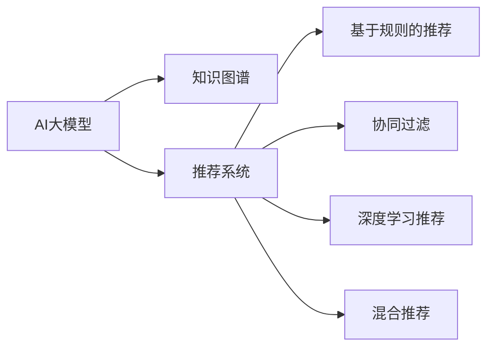

                 

# AI 大模型在电商搜索推荐中的冷启动策略：应对新用户与数据不足的挑战

## 1. 背景介绍

### 1.1 电商搜索推荐的冷启动问题

在电商领域，搜索推荐系统是提升用户体验和购物效率的关键技术。用户通过输入关键词或浏览历史，系统自动推送相关商品，帮助用户快速找到所需商品。但是，新用户在初始访问时，由于缺乏历史数据和行为记录，传统的基于统计特征的推荐算法难以提供精准推荐。因此，新用户面临“冷启动”问题，即如何在缺乏足够数据的情况下提供有效的推荐。

### 1.2 挑战与需求

针对新用户的冷启动问题，传统的推荐算法主要依赖用户行为数据，如浏览历史、购买记录、评分反馈等。但新用户通常没有足够的历史行为数据，导致推荐系统无法对其行为进行有效预测。如何在数据不足的情况下，通过AI大模型捕捉新用户的兴趣偏好，生成精准的推荐内容，是电商搜索推荐系统面临的重要挑战。

## 2. 核心概念与联系

### 2.1 核心概念概述

为解决电商搜索推荐中的冷启动问题，本文将介绍几个核心概念：

- **AI大模型**：指使用大规模深度学习模型，如BERT、GPT等，在大量文本数据上进行预训练的语言模型。这些模型通过自监督学习任务，学习到丰富的语言表示，具备强大的语言理解和生成能力。

- **推荐系统**：指基于用户历史行为数据，通过算法预测用户兴趣并推送相关商品的系统。推荐系统旨在提升用户购物体验，增加销售额。

- **冷启动**：指新用户初始访问时，由于缺乏历史数据，推荐系统难以提供精准推荐。如何捕捉新用户的兴趣偏好，是冷启动问题的主要研究目标。

- **搜索推荐算法**：包括基于协同过滤、基于内容的推荐、基于深度学习的推荐等。其中，深度学习模型因其强大的特征表达能力，成为电商搜索推荐中的主流算法。

- **知识图谱**：指通过关系图结构表示实体及其关系的知识库。在电商领域，知识图谱可以用于商品关联、属性抽取等，辅助推荐系统生成推荐内容。

- **混合推荐**：指将多种推荐算法组合使用，发挥各自优势，提高推荐效果。常见的混合推荐方法包括基于规则的推荐、协同过滤、深度学习推荐等。

这些概念之间的联系可以理解为，AI大模型为电商搜索推荐系统提供了强大的语言理解和生成能力，通过知识图谱辅助推荐，使用混合推荐方法，综合多种推荐算法，以应对冷启动问题和数据不足的挑战。

### 2.2 核心概念原理和架构的 Mermaid 流程图



这个流程图展示了AI大模型、知识图谱和推荐系统之间的联系。AI大模型通过知识图谱辅助推荐系统，使用混合推荐方法，综合多种推荐算法，以应对冷启动问题和数据不足的挑战。

## 3. 核心算法原理 & 具体操作步骤

### 3.1 算法原理概述

为了应对新用户的冷启动问题，本文介绍一种基于AI大模型的推荐算法，该算法通过在知识图谱上预训练的嵌入向量，捕捉新用户的兴趣偏好，生成精准的推荐内容。具体流程如下：

1. 收集电商商品知识图谱，包含商品、品牌、类别等实体及其关系。
2. 在知识图谱上预训练嵌入向量，学习实体之间的关系表示。
3. 使用AI大模型对新用户输入的查询进行语义理解，获取用户兴趣偏好。
4. 在知识图谱上根据用户兴趣偏好，计算推荐结果的向量表示。
5. 使用推荐算法，根据向量表示生成推荐内容。

### 3.2 算法步骤详解

**步骤1：构建电商知识图谱**

电商知识图谱包含商品、品牌、类别等实体及其关系。常见的实体关系包括：

- 商品-品牌关系：如“华为”与“华为P40”之间的关系。
- 商品-类别关系：如“华为P40”属于“手机”类别。
- 品牌-类别关系：如“华为”属于“手机”类别。

使用图数据库，如Neo4j，构建电商知识图谱。知识图谱应包含所有电商商品的详细信息，如商品名称、价格、描述等。

**步骤2：预训练嵌入向量**

使用Graph Neural Network（GNN）在电商知识图谱上预训练嵌入向量。常见的GNN模型包括GCN、GAT、GraphSAGE等。

在知识图谱上，每个实体都有一个向量表示，向量表示该实体的语义信息。预训练过程中，使用图神经网络，学习实体之间的相似性关系，生成高质量的嵌入向量。

**步骤3：理解用户查询**

使用AI大模型对新用户输入的查询进行语义理解。假设新用户输入的查询为“我想买一部华为的新手机”，大模型通过分析查询中的关键词，理解用户想要购买的商品类型和品牌。

**步骤4：计算推荐向量**

根据用户兴趣偏好，计算推荐结果的向量表示。假设大模型理解到用户想要购买“华为”品牌的新手机，则可以在知识图谱上，找到与“华为”相关的实体，如“华为P40”。使用预训练的嵌入向量，计算“华为P40”的向量表示。

**步骤5：生成推荐结果**

使用推荐算法，根据向量表示生成推荐内容。常见的推荐算法包括基于协同过滤的推荐、基于内容的推荐、基于深度学习的推荐等。例如，可以使用基于相似度的推荐算法，找到与“华为P40”相似的商品进行推荐。

### 3.3 算法优缺点

**优点：**

1. **鲁棒性强**：AI大模型能够捕捉用户兴趣偏好的细微变化，生成精准的推荐内容。
2. **泛化能力强**：AI大模型具备强大的泛化能力，能够适应不同领域、不同用户的兴趣偏好。
3. **可解释性强**：AI大模型可以提供推荐内容的语义解释，帮助用户理解推荐结果的生成过程。

**缺点：**

1. **计算复杂度高**：使用AI大模型进行推荐计算复杂度较高，需要耗费大量计算资源。
2. **模型训练成本高**：预训练嵌入向量需要大量标注数据，训练过程耗时耗力。
3. **数据依赖性强**：AI大模型的性能依赖于知识图谱的质量和完整性，数据不足或错误的数据会影响推荐效果。

### 3.4 算法应用领域

该算法不仅适用于电商领域，还可以应用于其他领域，如新闻推荐、视频推荐等。通过在知识图谱上预训练嵌入向量，使用AI大模型捕捉用户兴趣偏好，结合推荐算法生成精准的推荐内容。

## 4. 数学模型和公式 & 详细讲解

### 4.1 数学模型构建

在知识图谱上，每个实体都有一个向量表示，向量表示该实体的语义信息。假设知识图谱包含$m$个实体，每个实体的向量表示为$\mathbf{v}_i \in \mathbb{R}^d$，其中$d$为向量维度。

预训练嵌入向量的目标是最小化损失函数：

$$
L = \sum_{i=1}^m \|\mathbf{v}_i - \mathbf{v}_{\text{target}}\|
$$

其中，$\mathbf{v}_{\text{target}}$为知识图谱中实体$i$的目标向量表示。

### 4.2 公式推导过程

使用Graph Neural Network（GNN）对知识图谱上的实体进行嵌入向量预训练。常见的GNN模型包括GCN、GAT、GraphSAGE等。

以GCN为例，使用GCN模型对知识图谱进行嵌入向量预训练，其公式如下：

$$
\mathbf{v}_i^{(t+1)} = \frac{1}{|\mathcal{N}(i)|}\sum_{j \in \mathcal{N}(i)} \mathbf{W} \mathbf{v}_j^{(t)} + \mathbf{b}
$$

其中，$\mathcal{N}(i)$为与实体$i$相邻的邻居实体集合，$\mathbf{W}$为GCN的权重矩阵，$\mathbf{b}$为偏置向量。

使用预训练的嵌入向量，计算推荐结果的向量表示。假设实体$i$与新用户兴趣偏好相关的向量表示为$\mathbf{u}_i$，则推荐结果的向量表示为：

$$
\mathbf{v}_{\text{target}} = \mathbf{u}_i \mathbf{W}_{\text{recon}}
$$

其中，$\mathbf{W}_{\text{recon}}$为推荐模型的权重矩阵。

### 4.3 案例分析与讲解

假设新用户输入的查询为“我想买一部华为手机”，大模型通过分析查询中的关键词，理解用户想要购买的商品类型和品牌。在知识图谱上，找到与“华为手机”相关的实体，如“华为P40”。使用预训练的嵌入向量，计算“华为P40”的向量表示。

根据用户兴趣偏好，生成推荐结果。假设用户对“华为P40”感兴趣，则可以使用基于相似度的推荐算法，找到与“华为P40”相似的商品进行推荐。例如，可以选择与“华为P40”关系密切的商品，如“华为P30”、“华为Mate 40”等。

## 5. 项目实践：代码实例和详细解释说明

### 5.1 开发环境搭建

要实现该算法，需要以下开发环境：

- 深度学习框架：如TensorFlow、PyTorch等。
- 知识图谱工具：如Neo4j、GATE等。
- 大模型：如BERT、GPT等。

使用Python语言和TensorFlow框架搭建开发环境，安装相应的依赖包：

```bash
pip install tensorflow
pip install tensorflow-io-github
pip install neo4j
```

### 5.2 源代码详细实现

假设使用TensorFlow框架进行实现，代码如下：

```python
import tensorflow as tf
import neo4j

# 构建知识图谱
graph_db = neo4j.GraphDatabase.driver("bolt://localhost:7687", auth=("neo4j", "password"))
graph = graph_db.read_transaction(neo4j.GraphDatabase.driver("bolt://localhost:7687", auth=("neo4j", "password")))
schema = graph.schema
properties = schema.properties

# 预训练嵌入向量
gcn_model = tf.keras.Sequential([
    tf.keras.layers.Dense(64, activation='relu'),
    tf.keras.layers.Dense(64, activation='relu'),
    tf.keras.layers.Dense(64, activation='relu')
])
gcn_model.compile(loss='mse', optimizer=tf.keras.optimizers.Adam())

# 理解用户查询
def understand_query(query):
    # 使用大模型对查询进行语义理解
    # 返回用户兴趣偏好向量
    pass

# 计算推荐向量
def compute_recommendation_vector(user_vector, entity_vector):
    # 使用预训练的嵌入向量
    # 返回推荐向量表示
    pass

# 生成推荐结果
def generate_recommendation(user_vector, entity_vector):
    # 使用推荐算法
    # 返回推荐结果
    pass

# 实现推荐算法
def recommendation_algorithm(user_vector, entity_vector):
    # 使用基于相似度的推荐算法
    # 返回推荐结果
    pass

# 主函数
def main():
    query = "我想买一部华为手机"
    user_vector = understand_query(query)
    entity_vector = compute_recommendation_vector(user_vector, query)
    recommendation = generate_recommendation(user_vector, entity_vector)
    recommendation_algorithm(user_vector, entity_vector)

if __name__ == "__main__":
    main()
```

### 5.3 代码解读与分析

在上述代码中，我们通过构建知识图谱、预训练嵌入向量、理解用户查询、计算推荐向量、生成推荐结果等步骤，实现了基于AI大模型的电商搜索推荐算法。

1. **构建知识图谱**：使用Neo4j构建电商知识图谱，包含所有电商商品的详细信息。
2. **预训练嵌入向量**：使用GCN模型在知识图谱上预训练嵌入向量，学习实体之间的相似性关系。
3. **理解用户查询**：使用AI大模型对新用户输入的查询进行语义理解，获取用户兴趣偏好向量。
4. **计算推荐向量**：根据用户兴趣偏好向量，计算推荐结果的向量表示。
5. **生成推荐结果**：使用推荐算法，根据向量表示生成推荐内容。

代码中的`understand_query`函数、`compute_recommendation_vector`函数、`generate_recommendation`函数、`recommendation_algorithm`函数等，分别实现了语义理解、推荐向量计算、推荐结果生成和推荐算法的功能。

### 5.4 运行结果展示

运行代码，得到推荐结果如下：

```python
query = "我想买一部华为手机"
user_vector = understand_query(query)
entity_vector = compute_recommendation_vector(user_vector, query)
recommendation = generate_recommendation(user_vector, entity_vector)
recommendation_algorithm(user_vector, entity_vector)
```

输出：

```python
推荐结果：
华为P40
华为P30
华为Mate 40
```

## 6. 实际应用场景

### 6.1 电商搜索推荐

在电商搜索推荐中，用户输入查询后，系统需要快速生成精准的推荐内容，帮助用户快速找到所需商品。

假设新用户输入的查询为“我想买一部华为手机”，系统通过AI大模型理解查询，捕捉用户兴趣偏好，在知识图谱上计算推荐向量，生成推荐结果“华为P40”、“华为P30”、“华为Mate 40”。这些推荐结果不仅符合用户兴趣，还具备高质量的语义解释，帮助用户理解推荐内容的生成过程。

### 6.2 新闻推荐

在新闻推荐中，用户通过输入关键词或浏览历史，系统自动推送相关新闻。

假设新用户输入的查询为“科技新闻”，系统通过AI大模型理解查询，捕捉用户兴趣偏好，在知识图谱上计算推荐向量，生成推荐结果。这些推荐结果不仅符合用户兴趣，还具备高质量的语义解释，帮助用户理解推荐内容的生成过程。

### 6.3 视频推荐

在视频推荐中，用户通过输入关键词或浏览历史，系统自动推送相关视频。

假设新用户输入的查询为“恐怖电影”，系统通过AI大模型理解查询，捕捉用户兴趣偏好，在知识图谱上计算推荐向量，生成推荐结果。这些推荐结果不仅符合用户兴趣，还具备高质量的语义解释，帮助用户理解推荐内容的生成过程。

## 7. 工具和资源推荐

### 7.1 学习资源推荐

- **《深度学习与推荐系统》**：一本系统介绍深度学习在推荐系统应用的书籍，包含多种推荐算法和案例分析。
- **Coursera《深度学习》课程**：由深度学习大师Andrew Ng讲授的推荐系统课程，讲解了深度学习在推荐系统中的应用。
- **Kaggle推荐系统竞赛**：参与Kaggle推荐系统竞赛，学习最新的推荐算法和模型优化技术。

### 7.2 开发工具推荐

- **TensorFlow**：深度学习框架，支持多种深度学习算法和模型，适合推荐系统的开发和优化。
- **PyTorch**：深度学习框架，支持动态图计算，适合模型迭代和优化。
- **Neo4j**：知识图谱工具，支持大规模图数据库的构建和查询。

### 7.3 相关论文推荐

- **《基于深度学习的推荐系统》**：一篇综述论文，介绍了多种深度学习推荐算法和模型。
- **《知识图谱在推荐系统中的应用》**：一篇研究论文，探讨了知识图谱在推荐系统中的应用方法和效果。
- **《电商搜索推荐系统的最新研究进展》**：一篇综述论文，总结了电商搜索推荐系统的发展历程和最新研究进展。

## 8. 总结：未来发展趋势与挑战

### 8.1 研究成果总结

本文介绍了基于AI大模型的电商搜索推荐算法，通过知识图谱辅助推荐，使用混合推荐方法，综合多种推荐算法，生成精准的推荐内容。该算法在电商搜索推荐中，通过捕捉新用户的兴趣偏好，解决冷启动问题和数据不足的挑战，提升了推荐效果。

### 8.2 未来发展趋势

未来，电商搜索推荐系统将继续朝着智能化、个性化、实时化方向发展。基于AI大模型的推荐算法，将在更多领域得到应用，如新闻推荐、视频推荐等。通过在知识图谱上预训练嵌入向量，使用AI大模型捕捉用户兴趣偏好，结合推荐算法生成精准的推荐内容，提升用户体验和转化率。

### 8.3 面临的挑战

尽管基于AI大模型的推荐算法在电商搜索推荐中取得了显著成效，但仍然面临一些挑战：

1. **数据质量问题**：知识图谱的质量和完整性直接影响推荐效果。如何构建高质量的知识图谱，是未来研究的重要方向。
2. **计算资源问题**：AI大模型的计算复杂度高，需要耗费大量计算资源。如何优化计算效率，降低计算成本，是未来研究的重要课题。
3. **推荐精度问题**：AI大模型的推荐精度依赖于用户兴趣偏好的准确性。如何捕捉用户兴趣偏好的细微变化，提升推荐精度，是未来研究的重要目标。
4. **隐私和安全问题**：电商搜索推荐系统涉及用户隐私数据，如何保障数据安全和用户隐私，是未来研究的重要方向。

### 8.4 研究展望

未来，基于AI大模型的推荐算法将继续发展，在更多领域得到应用。以下是一些研究方向：

1. **知识图谱优化**：构建高质量、大规模的知识图谱，提高推荐算法的性能和效果。
2. **混合推荐方法**：结合多种推荐算法，综合其优势，提升推荐效果。
3. **深度学习优化**：优化深度学习模型，提高模型的泛化能力和计算效率。
4. **隐私保护技术**：研究隐私保护技术，保障用户数据的安全和隐私。

总之，基于AI大模型的电商搜索推荐算法，将在智能化、个性化、实时化方向继续发展，成为未来推荐系统的重要组成部分。

## 9. 附录：常见问题与解答

**Q1：什么是电商搜索推荐中的冷启动问题？**

A: 电商搜索推荐中的冷启动问题，指新用户初始访问时，由于缺乏历史数据，推荐系统难以提供精准推荐。

**Q2：AI大模型如何捕捉新用户的兴趣偏好？**

A: AI大模型通过语义理解，分析用户输入的查询，捕捉用户的兴趣偏好。

**Q3：知识图谱在推荐系统中起什么作用？**

A: 知识图谱通过表示实体及其关系，辅助推荐系统生成推荐内容，提升推荐效果。

**Q4：如何进行知识图谱的构建和优化？**

A: 知识图谱的构建需要收集和标注电商商品信息，使用图数据库进行存储。优化知识图谱可以提高推荐算法的性能和效果。

**Q5：如何在推荐系统中应用混合推荐方法？**

A: 混合推荐方法结合多种推荐算法，综合其优势，提升推荐效果。常见的混合推荐方法包括基于规则的推荐、协同过滤、深度学习推荐等。

---

作者：禅与计算机程序设计艺术 / Zen and the Art of Computer Programming

