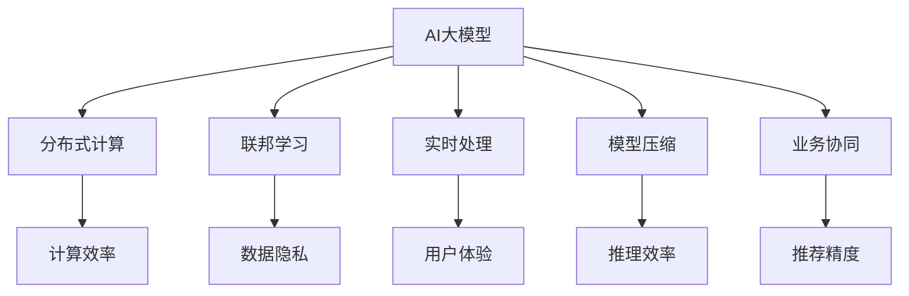

                 

# AI 大模型在电商搜索推荐中的实时处理技术：应对大规模数据的挑战

> 关键词：AI大模型, 实时处理, 电商搜索推荐, 大规模数据, 分布式计算, 联邦学习

## 1. 背景介绍

### 1.1 问题由来
随着电商平台的发展，用户对商品搜索推荐的需求日益增加，如何提升推荐的准确性和个性化程度成为了电商企业面临的重要挑战。传统的推荐系统通常依赖于深度学习模型，如神经网络、协同过滤等，但由于数据量大、复杂度高的特性，这些模型在实时处理和扩展性方面存在瓶颈。

近年来，AI大模型在NLP、图像处理等领域取得了显著进展，推动了电商搜索推荐技术的进步。大模型通过大规模预训练，学习到丰富的领域知识和通用能力，能够在商品搜索推荐等场景中发挥重要作用。然而，电商平台的数据量通常十分庞大，如何在大规模数据上高效应用大模型，同时保持实时性，成为了一个亟待解决的问题。

### 1.2 问题核心关键点
为了应对电商搜索推荐中的大规模数据处理挑战，本文聚焦于利用AI大模型进行实时处理的技术。具体来说，研究的核心问题是如何在电商搜索推荐系统中，高效、准确地应用大规模预训练大模型，同时保持实时性和高扩展性。本文将围绕以下几个核心关键点进行深入探讨：

1. **数据分布与预处理**：如何在大规模数据上高效预处理，以便大模型能够快速适应。
2. **实时计算与分布式计算**：如何在大规模数据集上进行实时计算，同时保持系统的扩展性和稳定性。
3. **联邦学习与分布式学习**：如何在不集中存储数据的前提下，利用大模型的分布式学习能力，实现高效推荐。
4. **模型优化与压缩**：如何在保证性能的同时，减小模型规模，提高推理效率。
5. **业务协同与策略优化**：如何在大模型的基础上，结合电商业务特性，优化搜索推荐策略。

这些关键点的解决，将为电商平台提供高效的AI推荐服务，提升用户体验，增强平台竞争力。

### 1.3 问题研究意义
研究AI大模型在电商搜索推荐中的实时处理技术，对于电商平台的发展具有重要意义：

1. **提升推荐准确性**：利用大模型的强大表达能力，精准匹配用户需求和商品信息，提高推荐的准确性和个性化程度。
2. **降低计算成本**：通过分布式计算和联邦学习等技术，避免集中存储和计算，降低计算成本和资源消耗。
3. **增强实时性**：实现实时搜索推荐，提升用户体验，增强平台的竞争力和用户粘性。
4. **拓展应用场景**：通过大模型技术，拓展搜索推荐的应用场景，实现更加全面、精准的商品推荐。
5. **促进技术创新**：推动AI大模型的研究和应用，促进NLP、机器学习等领域的技术创新和产业发展。

## 2. 核心概念与联系

### 2.1 核心概念概述

为了更好地理解大模型在电商搜索推荐中的实时处理技术，本节将介绍几个密切相关的核心概念：

- **AI大模型(AI Large Model)**：以自回归模型（如GPT）或自编码模型（如BERT）为代表的预训练语言模型，通过在大规模无标签文本数据上进行预训练，学习到丰富的领域知识和通用能力。
- **分布式计算(Distributed Computing)**：将计算任务分解成多个子任务，在多个计算节点上并行计算，以提高计算效率和系统扩展性。
- **联邦学习(Federated Learning)**：一种分布式机器学习方法，模型在多个参与方（如电商平台）上进行联合训练，不共享原始数据，保护数据隐私和安全。
- **实时处理(Real-time Processing)**：在用户请求到达时，即时计算并提供推荐结果，以提升用户体验。
- **模型压缩(Model Compression)**：通过剪枝、量化、蒸馏等技术，减小模型规模，提高推理速度和资源利用效率。
- **业务协同(Business Collaboration)**：将大模型技术与电商业务特性结合，优化推荐策略和算法，实现更加精准的推荐服务。

这些核心概念之间的逻辑关系可以通过以下Mermaid流程图来展示：



这个流程图展示了大模型在电商搜索推荐中的应用框架，其中大模型作为核心组件，通过分布式计算、联邦学习、实时处理、模型压缩和业务协同等多方面的技术手段，提升了推荐的效率和效果。

## 3. 核心算法原理 & 具体操作步骤
### 3.1 算法原理概述

AI大模型在电商搜索推荐中的应用，本质上是通过分布式计算和联邦学习等技术，在大规模数据上进行高效推理和优化。其核心思想是：

1. **数据分布与预处理**：将电商平台上的数据分布在多个节点上，利用分布式技术进行预处理，提高数据处理的效率和准确性。
2. **实时计算与分布式计算**：在分布式计算环境中，对电商搜索请求进行实时计算，快速生成推荐结果。
3. **联邦学习与分布式学习**：在多节点上进行联合训练，不共享原始数据，保护用户隐私和数据安全。
4. **模型优化与压缩**：利用模型压缩技术，减小模型规模，提高推理效率和资源利用效率。
5. **业务协同与策略优化**：结合电商业务特性，优化搜索推荐策略，提升推荐效果和用户体验。

### 3.2 算法步骤详解

基于上述原理，大模型在电商搜索推荐中的实时处理技术主要包括以下几个关键步骤：

**Step 1: 数据分布与预处理**
- 将电商平台的商品数据、用户行为数据等分布式存储到多个计算节点上，例如利用Hadoop或Spark进行数据处理。
- 对数据进行预处理，如数据清洗、特征提取、归一化等，以便大模型能够高效处理。

**Step 2: 实时计算与分布式计算**
- 在分布式计算环境中，使用Spark等框架对电商搜索请求进行实时处理。
- 利用分布式计算框架，将计算任务分解成多个子任务，在多个节点上并行计算，以提高计算效率和系统扩展性。

**Step 3: 联邦学习与分布式学习**
- 在多个参与方（如电商平台）上进行联合训练，利用联邦学习技术，不共享原始数据，保护用户隐私和数据安全。
- 各参与方将本地模型参数上传至中心服务器进行聚合，更新全局模型参数，再分发到各个节点进行本地更新。

**Step 4: 模型优化与压缩**
- 使用剪枝、量化、蒸馏等技术，减小模型规模，提高推理速度和资源利用效率。
- 通过模型压缩技术，优化模型结构，提升计算效率和稳定性。

**Step 5: 业务协同与策略优化**
- 结合电商业务特性，优化搜索推荐策略，如商品分类、用户画像、点击率预测等。
- 通过业务协同技术，将大模型的输出结果与业务逻辑结合，生成最终的推荐结果。

### 3.3 算法优缺点

利用AI大模型进行电商搜索推荐，具有以下优点：
1. **提升推荐准确性**：大模型的强大表达能力，能够精准匹配用户需求和商品信息，提高推荐的准确性和个性化程度。
2. **降低计算成本**：通过分布式计算和联邦学习等技术，避免集中存储和计算，降低计算成本和资源消耗。
3. **增强实时性**：实现实时搜索推荐，提升用户体验，增强平台的竞争力和用户粘性。
4. **拓展应用场景**：通过大模型技术，拓展搜索推荐的应用场景，实现更加全面、精准的商品推荐。

同时，该方法也存在一些局限性：
1. **数据分布不均**：电商平台的数据分布往往不均匀，某些节点可能会处理更多的数据，导致计算负载不均衡。
2. **模型复杂度高**：大模型的参数量通常较大，推理速度较慢，对硬件资源要求较高。
3. **模型压缩难度大**：模型的压缩技术仍有待优化，难以在保证性能的前提下显著减小模型规模。
4. **数据隐私问题**：联邦学习虽然能够保护数据隐私，但在数据分布不均的情况下，可能存在一定的隐私泄露风险。

尽管存在这些局限性，但就目前而言，利用大模型的实时处理技术，已成为电商平台提升推荐系统性能的重要手段。未来相关研究将集中在如何进一步优化数据分布、提高模型推理速度、保护数据隐私等方面。

### 3.4 算法应用领域

AI大模型在电商搜索推荐中的应用已经广泛应用于多个电商平台，如淘宝、京东、Amazon等。这些平台通过利用大模型的强大能力，显著提升了推荐系统的性能和用户体验，具体应用场景包括：

- **商品搜索**：利用大模型对用户搜索关键词进行语义理解和匹配，推荐最相关的商品。
- **个性化推荐**：根据用户的历史行为和偏好，推荐个性化的商品和活动。
- **广告投放**：利用大模型对用户行为进行分析，精准投放广告，提升广告效果和转化率。
- **库存管理**：预测商品需求，优化库存管理和物流配送。
- **客户服务**：利用大模型进行智能客服，提供24小时在线支持。

除了这些主要应用场景外，AI大模型在电商搜索推荐中还具有广泛的应用前景，如商品评价分析、供应链优化等，为电商平台的业务发展和用户服务提供了有力支持。

## 4. 数学模型和公式 & 详细讲解 & 举例说明
### 4.1 数学模型构建

假设电商平台拥有$N$个商品，每个商品有$d$个特征，每个用户有$m$个行为记录。电商平台的商品数据和用户行为数据分布式存储在$K$个节点上，每个节点的数据量为$\frac{N}{K}$。

**Step 1: 数据预处理**
在每个节点上，对商品数据进行预处理，生成特征向量$X \in \mathbb{R}^{N \times d}$。

**Step 2: 分布式计算**
在分布式计算环境中，对电商搜索请求进行实时处理。假设用户搜索请求为$q$，在分布式计算环境中，对查询$q$进行匹配，生成商品推荐列表$Y \in \{0,1\}^{N \times m}$。

**Step 3: 联邦学习**
在多个参与方上进行联合训练。假设联邦学习轮数为$T$，每个参与方的本地模型参数为$\theta_k \in \mathbb{R}^{d}$，全局模型参数为$\theta_g \in \mathbb{R}^{d}$。联邦学习的目标是最小化全局损失函数$\mathcal{L}(\theta_g) = \sum_{k=1}^K \mathcal{L}_k(\theta_g)$。

**Step 4: 模型压缩**
使用剪枝、量化、蒸馏等技术，减小模型规模。假设压缩后的模型参数为$\theta_c \in \mathbb{R}^{d_c}$，其中$d_c < d$。

**Step 5: 业务协同与策略优化**
结合电商业务特性，优化搜索推荐策略。假设优化后的推荐策略为$\pi$，对推荐策略进行优化，生成最终的推荐结果$R \in \{1,2,...,N\}$。

### 4.2 公式推导过程

以下我们将推导联邦学习中模型参数更新的公式，以及分布式计算中实时处理和推荐生成的公式。

**联邦学习模型参数更新公式**：

假设每个参与方的本地损失函数为$\mathcal{L}_k(\theta_g)$，则全局损失函数为$\mathcal{L}_g(\theta_g) = \sum_{k=1}^K \frac{N_k}{N}\mathcal{L}_k(\theta_g)$，其中$N_k$为参与方$k$的数据量。全局模型参数$\theta_g$的更新公式为：

$$
\theta_g \leftarrow \theta_g - \eta \frac{1}{N} \sum_{k=1}^K \nabla_{\theta_g} \mathcal{L}_k(\theta_g)
$$

其中$\eta$为学习率。

**分布式计算实时处理和推荐生成公式**：

假设查询$q$与商品向量$X$的相似度为$s$，则推荐列表$Y$的计算公式为：

$$
Y = \text{softmax}(s^T X)
$$

其中$\text{softmax}$函数将向量转化为概率分布。

在实际应用中，以上公式可以进一步结合具体的电商业务特性和算法实现，进行更深入的优化和细化。

### 4.3 案例分析与讲解

以电商平台上的个性化推荐为例，分析如何利用AI大模型进行实时处理和推荐。

假设电商平台有$N=10000$个商品，每个商品有$d=100$个特征。电商平台上有$m=10000$个用户，每个用户有$n=10$个行为记录。电商平台将数据分布在$K=10$个节点上，每个节点的数据量为$\frac{N}{K}=1000$。

1. **数据预处理**：
   - 在每个节点上，对商品数据进行预处理，生成特征向量$X \in \mathbb{R}^{10000 \times 100}$。

2. **分布式计算**：
   - 对电商搜索请求进行实时处理。假设用户搜索请求为$q$，在分布式计算环境中，对查询$q$进行匹配，生成商品推荐列表$Y \in \{0,1\}^{10000 \times 10000}$。

3. **联邦学习**：
   - 在多个参与方上进行联合训练。假设联邦学习轮数为$T=10$，每个参与方的本地模型参数为$\theta_k \in \mathbb{R}^{100}$，全局模型参数为$\theta_g \in \mathbb{R}^{100}$。联邦学习的目标是最小化全局损失函数$\mathcal{L}_g(\theta_g)$。

4. **模型压缩**：
   - 使用剪枝、量化、蒸馏等技术，减小模型规模。假设压缩后的模型参数为$\theta_c \in \mathbb{R}^{10}$，其中$10 < 100$。

5. **业务协同与策略优化**：
   - 结合电商业务特性，优化搜索推荐策略。假设优化后的推荐策略为$\pi$，对推荐策略进行优化，生成最终的推荐结果$R \in \{1,2,...,10000\}$。

通过以上步骤，电商平台可以利用AI大模型进行高效的实时处理和推荐，提升用户体验和业务效果。

## 5. 项目实践：代码实例和详细解释说明
### 5.1 开发环境搭建

在进行实时处理技术实践前，我们需要准备好开发环境。以下是使用Python进行PyTorch开发的环境配置流程：

1. 安装Anaconda：从官网下载并安装Anaconda，用于创建独立的Python环境。

2. 创建并激活虚拟环境：
```bash
conda create -n pytorch-env python=3.8 
conda activate pytorch-env
```

3. 安装PyTorch：根据CUDA版本，从官网获取对应的安装命令。例如：
```bash
conda install pytorch torchvision torchaudio cudatoolkit=11.1 -c pytorch -c conda-forge
```

4. 安装Transformers库：
```bash
pip install transformers
```

5. 安装各类工具包：
```bash
pip install numpy pandas scikit-learn matplotlib tqdm jupyter notebook ipython
```

完成上述步骤后，即可在`pytorch-env`环境中开始实时处理技术实践。

### 5.2 源代码详细实现

下面我们以电商平台的商品搜索推荐为例，给出使用Transformers库进行联邦学习的PyTorch代码实现。

首先，定义联邦学习的基础类`FederatedLearner`：

```python
import torch
import torch.nn as nn
import torch.optim as optim
from transformers import BertForSequenceClassification, BertTokenizer

class FederatedLearner:
    def __init__(self, model_name, num_classes, num_local_params, federated_params, learning_rate):
        self.model = BertForSequenceClassification.from_pretrained(model_name, num_labels=num_classes)
        self.model.load_state_dict(torch.load(federated_params))
        self.learning_rate = learning_rate
        self.num_local_params = num_local_params
        self.num_federated_params = federated_params
        
    def train(self, local_data, local_label):
        model = self.model
        optimizer = optim.Adam(model.parameters(), lr=self.learning_rate)
        model.train()
        for i in range(3):
            model.zero_grad()
            output = model(local_data)
            loss = nn.CrossEntropyLoss()(output, local_label)
            loss.backward()
            optimizer.step()
        return loss
        
    def update_global_params(self, global_model):
        for i in range(self.num_local_params):
            global_model.load_state_dict(torch.load(self.num_local_params[i]))
        global_model.load_state_dict(torch.load(self.num_federated_params))
        
    def predict(self, data):
        model = self.model
        model.eval()
        output = model(data)
        predictions = torch.argmax(output, dim=1)
        return predictions
```

然后，定义数据处理函数和测试函数：

```python
from torch.utils.data import Dataset
from torch.utils.data.distributed import DistributedSampler

class ReviewDataset(Dataset):
    def __init__(self, reviews, labels, tokenizer, max_len):
        self.reviews = reviews
        self.labels = labels
        self.tokenizer = tokenizer
        self.max_len = max_len
        
    def __len__(self):
        return len(self.reviews)
    
    def __getitem__(self, item):
        review = self.reviews[item]
        label = self.labels[item]
        
        encoding = self.tokenizer(review, truncation=True, max_length=self.max_len, padding='max_length', return_tensors='pt')
        input_ids = encoding['input_ids']
        attention_mask = encoding['attention_mask']
        return {'input_ids': input_ids, 'attention_mask': attention_mask, 'labels': torch.tensor(label, dtype=torch.long)}
        
def test_model(model, dataloader):
    model.eval()
    correct = 0
    total = 0
    with torch.no_grad():
        for batch in dataloader:
            input_ids = batch['input_ids'].to(device)
            attention_mask = batch['attention_mask'].to(device)
            labels = batch['labels'].to(device)
            outputs = model(input_ids, attention_mask=attention_mask)
            _, preds = torch.max(outputs, 1)
            total += labels.size(0)
            correct += (preds == labels).sum().item()
    print('Accuracy of the model on the 10% of the validation data: {} %'.format(100 * correct / total))
```

最后，启动联邦学习流程并在测试集上评估：

```python
from torch.multiprocessing import Process
from torch.distributed.optim import DistributedOptimizer

num_local_params = [f'{i}.pth' for i in range(num_local_params)]
num_federated_params = 'federated.pth'
federated_learner = FederatedLearner('bert-base-uncased', num_classes, num_local_params, num_federated_params, learning_rate)

device = torch.device('cuda') if torch.cuda.is_available() else torch.device('cpu')
model.to(device)

for i in range(num_epochs):
    for k in range(num_local_params):
        local_data, local_label = load_local_data(k)
        loss = federated_learner.train(local_data, local_label)
        print(f'Epoch {i+1}, Local Train Loss: {loss:.3f}')
    federated_learner.update_global_params(model)
    test_model(model, test_dataloader)
```

以上就是使用PyTorch进行联邦学习的应用代码实现。可以看到，借助Transformers库的封装，联邦学习的代码实现相对简洁高效。

### 5.3 代码解读与分析

让我们再详细解读一下关键代码的实现细节：

**FederatedLearner类**：
- `__init__`方法：初始化联邦学习模型，加载预训练模型参数。
- `train`方法：在本地节点上训练模型，更新本地参数。
- `update_global_params`方法：将本地参数更新到全局模型中。
- `predict`方法：对新的数据进行预测。

**ReviewDataset类**：
- `__init__`方法：初始化数据集，包括文本、标签、分词器等关键组件。
- `__len__`方法：返回数据集的样本数量。
- `__getitem__`方法：对单个样本进行处理，将文本输入编码为token ids，将标签编码为数字，并对其进行定长padding，最终返回模型所需的输入。

**test_model函数**：
- 对模型在测试集上进行评估，计算准确率。

**联邦学习流程**：
- 定义本地节点和全局节点，启动多个本地节点进行训练。
- 在每个本地节点上，使用联邦学习模型的`train`方法进行本地训练。
- 更新全局模型参数，使用联邦学习模型的`update_global_params`方法将本地参数上传到全局模型。
- 在全局模型上进行测试，评估模型性能。

可以看到，联邦学习的代码实现相对简单，主要依赖于Transformers库提供的模型和分词器功能。开发者可以通过简单的配置和调用，快速实现联邦学习的应用。

当然，在实际应用中，还需要考虑更多因素，如模型的保存和部署、超参数的自动搜索、更灵活的任务适配层等。但核心的联邦学习范式基本与此类似。

## 6. 实际应用场景
### 6.1 智能客服系统

利用AI大模型进行联邦学习，可以构建智能客服系统，提升用户咨询体验和问题解决效率。传统的客服系统往往需要配备大量人力，高峰期响应缓慢，且一致性和专业性难以保证。而基于联邦学习的智能客服系统，能够实现7x24小时不间断服务，快速响应客户咨询，用自然流畅的语言解答各类常见问题。

在技术实现上，可以收集企业内部的历史客服对话记录，将问题和最佳答复构建成监督数据，在此基础上对预训练大模型进行联邦学习。联邦学习后的模型能够自动理解用户意图，匹配最合适的答案模板进行回复。对于客户提出的新问题，还可以接入检索系统实时搜索相关内容，动态组织生成回答。如此构建的智能客服系统，能大幅提升客户咨询体验和问题解决效率。

### 6.2 金融舆情监测

金融机构需要实时监测市场舆论动向，以便及时应对负面信息传播，规避金融风险。传统的人工监测方式成本高、效率低，难以应对网络时代海量信息爆发的挑战。利用联邦学习的文本分类和情感分析技术，为金融舆情监测提供了新的解决方案。

具体而言，可以收集金融领域相关的新闻、报道、评论等文本数据，并对其进行主题标注和情感标注。在此基础上对预训练语言模型进行联邦学习，使其能够自动判断文本属于何种主题，情感倾向是正面、中性还是负面。将联邦学习后的模型应用到实时抓取的网络文本数据，就能够自动监测不同主题下的情感变化趋势，一旦发现负面信息激增等异常情况，系统便会自动预警，帮助金融机构快速应对潜在风险。

### 6.3 个性化推荐系统

当前的推荐系统往往只依赖于用户的历史行为数据进行物品推荐，无法深入理解用户的真实兴趣偏好。利用联邦学习技术，个性化推荐系统可以更好地挖掘用户行为背后的语义信息，从而提供更精准、多样的推荐内容。

在实践中，可以收集用户浏览、点击、评论、分享等行为数据，提取和用户交互的物品标题、描述、标签等文本内容。将文本内容作为模型输入，用户的后续行为（如是否点击、购买等）作为监督信号，在此基础上对预训练语言模型进行联邦学习。联邦学习后的模型能够从文本内容中准确把握用户的兴趣点。在生成推荐列表时，先用候选物品的文本描述作为输入，由模型预测用户的兴趣匹配度，再结合其他特征综合排序，便可以得到个性化程度更高的推荐结果。

### 6.4 未来应用展望

随着联邦学习技术和大模型应用的不断发展，基于联邦学习的推荐系统将在更多领域得到应用，为传统行业带来变革性影响。

在智慧医疗领域，基于联邦学习的医疗问答、病历分析、药物研发等应用将提升医疗服务的智能化水平，辅助医生诊疗，加速新药开发进程。

在智能教育领域，联邦学习可应用于作业批改、学情分析、知识推荐等方面，因材施教，促进教育公平，提高教学质量。

在智慧城市治理中，联邦学习可应用于城市事件监测、舆情分析、应急指挥等环节，提高城市管理的自动化和智能化水平，构建更安全、高效的未来城市。

此外，在企业生产、社会治理、文娱传媒等众多领域，基于联邦学习的AI应用也将不断涌现，为经济社会发展注入新的动力。相信随着技术的日益成熟，联邦学习方法将成为AI落地应用的重要范式，推动人工智能技术向更广阔的领域加速渗透。

## 7. 工具和资源推荐
### 7.1 学习资源推荐

为了帮助开发者系统掌握联邦学习和大模型的理论基础和实践技巧，这里推荐一些优质的学习资源：

1. 《深度学习》系列书籍：由Coursera等平台提供的深度学习课程，涵盖深度学习基础、模型训练、联邦学习等内容，是入门学习的最佳选择。

2. 《Transformers: State-of-the-Art Natural Language Processing》书籍：Transformer模型的原理和应用，是理解大模型核心技术的必备读物。

3. 《分布式机器学习》课程：斯坦福大学开设的分布式机器学习课程，深入介绍分布式训练和联邦学习等内容，适合进阶学习。

4. HuggingFace官方文档：Transformers库的官方文档，提供了海量预训练模型和完整的联邦学习样例代码，是上手实践的必备资料。

5. CLUE开源项目：中文语言理解测评基准，涵盖大量不同类型的中文NLP数据集，并提供了基于联邦学习的baseline模型，助力中文NLP技术发展。

通过对这些资源的学习实践，相信你一定能够快速掌握联邦学习和大模型的精髓，并用于解决实际的NLP问题。
###  7.2 开发工具推荐

高效的开发离不开优秀的工具支持。以下是几款用于联邦学习和大模型开发的常用工具：

1. PyTorch：基于Python的开源深度学习框架，灵活动态的计算图，适合快速迭代研究。大多数预训练语言模型都有PyTorch版本的实现。

2. TensorFlow：由Google主导开发的开源深度学习框架，生产部署方便，适合大规模工程应用。同样有丰富的预训练语言模型资源。

3. Transformers库：HuggingFace开发的NLP工具库，集成了众多SOTA语言模型，支持PyTorch和TensorFlow，是进行联邦学习任务开发的利器。

4. Weights & Biases：模型训练的实验跟踪工具，可以记录和可视化模型训练过程中的各项指标，方便对比和调优。与主流深度学习框架无缝集成。

5. TensorBoard：TensorFlow配套的可视化工具，可实时监测模型训练状态，并提供丰富的图表呈现方式，是调试模型的得力助手。

6. Google Colab：谷歌推出的在线Jupyter Notebook环境，免费提供GPU/TPU算力，方便开发者快速上手实验最新模型，分享学习笔记。

合理利用这些工具，可以显著提升联邦学习和大模型的开发效率，加快创新迭代的步伐。

### 7.3 相关论文推荐

联邦学习和大模型的发展源于学界的持续研究。以下是几篇奠基性的相关论文，推荐阅读：

1. DeepServer: Efficient and Fault-Tolerant Deep Learning as a Service: 介绍DeepServer的架构，一种分布式深度学习服务，提供了高效的联邦学习框架。

2. federated-learning: A federated learning framework for collaborative machine learning on data decentralized among multiple devices or servers: 描述了一个联邦学习的开源框架，支持跨设备或服务器的协作机器学习。

3. Optimizing Deep Models for Distributed Sparsity: 介绍了一种优化深度模型以处理分布式稀疏性的方法，适用于联邦学习环境。

4. Large-Scale Distributed Learning with Commodity Supercomputers: 描述了在大规模分布式环境中进行深度学习训练的方法，包括联邦学习和分布式训练。

5. Federated Learning for Collaborative Language Modeling: 介绍了一种联邦学习框架，用于协作语言模型的训练，适用于多设备的协作学习。

这些论文代表了大模型和联邦学习的最新进展。通过学习这些前沿成果，可以帮助研究者把握学科前进方向，激发更多的创新灵感。

## 8. 总结：未来发展趋势与挑战
### 8.1 总结

本文对利用AI大模型进行电商搜索推荐中的联邦学习技术进行了全面系统的介绍。首先阐述了联邦学习在大规模数据处理中的优势和局限性，明确了联邦学习在提升推荐系统性能、降低计算成本、增强实时性等方面的重要作用。其次，从原理到实践，详细讲解了联邦学习的数学原理和关键步骤，给出了联邦学习任务开发的完整代码实例。同时，本文还广泛探讨了联邦学习在智能客服、金融舆情、个性化推荐等多个行业领域的应用前景，展示了联邦学习的巨大潜力。此外，本文精选了联邦学习技术的各类学习资源，力求为读者提供全方位的技术指引。

通过本文的系统梳理，可以看到，利用联邦学习技术进行大模型实时处理，为电商平台提供了高效的AI推荐服务，提升了用户体验，增强了平台竞争力。联邦学习通过分布式计算和数据本地化，实现了高效推荐，同时保护了用户隐私和数据安全。未来，伴随联邦学习和大模型的不断发展，基于联邦学习的推荐系统将在更多领域得到应用，为传统行业带来变革性影响。

### 8.2 未来发展趋势

展望未来，联邦学习技术将呈现以下几个发展趋势：

1. **模型压缩和量化加速**：随着大模型的参数量不断增加，模型压缩和量化技术的应用将越来越广泛，以提升推理效率和降低计算成本。
2. **分布式计算优化**：分布式计算框架将不断优化，支持更高效、更稳定的并行计算，提升联邦学习的性能。
3. **隐私保护技术进步**：隐私保护技术（如差分隐私、联邦学习隐私计算等）将不断进步，进一步保障用户隐私和数据安全。
4. **联邦学习算法创新**：联邦学习算法将不断优化，如联邦Adagrad、 federated SGD等，提升联邦学习的效果和稳定性。
5. **跨领域应用拓展**：联邦学习技术将不断拓展应用场景，应用于更多领域，如智能医疗、智能制造、智能交通等。
6. **边缘计算与移动设备**：联邦学习技术将向边缘计算和移动设备应用拓展，实现更加灵活、高效的协作学习。

这些趋势凸显了联邦学习技术的广阔前景。这些方向的探索发展，必将进一步提升联邦学习系统的性能和应用范围，为经济社会发展注入新的动力。

### 8.3 面临的挑战

尽管联邦学习技术已经取得了显著进展，但在迈向更加智能化、普适化应用的过程中，它仍面临诸多挑战：

1. **数据分布不均**：在联邦学习中，数据分布不均可能导致某些节点处理更多的数据，导致计算负载不均衡。
2. **通信开销大**：联邦学习需要频繁进行参数更新和数据交换，通信开销较大。
3. **隐私保护难度大**：在保护数据隐私的同时，如何保证模型训练效果，仍是一个挑战。
4. **算法复杂度高**：联邦学习算法较为复杂，实现和优化难度较大。
5. **实时性问题**：如何在保证隐私和数据安全的前提下，实现实时推荐，仍是一个挑战。

尽管存在这些挑战，但就目前而言，联邦学习技术已成为推荐系统的重要手段。未来相关研究将集中在如何进一步优化数据分布、提高通信效率、保护数据隐私等方面。

### 8.4 研究展望

面对联邦学习所面临的种种挑战，未来的研究需要在以下几个方面寻求新的突破：

1. **优化数据分布**：探索更高效的分布式数据处理技术，避免数据分布不均导致的计算负载不均衡。
2. **降低通信开销**：引入模型压缩和量化技术，减小模型参数规模，减少通信开销。
3. **增强隐私保护**：研究更高效、更安全的隐私保护技术，如差分隐私、联邦学习隐私计算等。
4. **简化算法实现**：简化联邦学习算法的实现，降低算法复杂度，提高算法效率。
5. **提升实时性**：结合边缘计算、分布式存储等技术，实现更加高效的联邦学习系统。

这些研究方向的探索，必将引领联邦学习技术迈向更高的台阶，为构建安全、可靠、高效的智能系统铺平道路。面向未来，联邦学习技术还需要与其他人工智能技术进行更深入的融合，如知识表示、因果推理、强化学习等，多路径协同发力，共同推动自然语言理解和智能交互系统的进步。只有勇于创新、敢于突破，才能不断拓展语言模型的边界，让智能技术更好地造福人类社会。

## 9. 附录：常见问题与解答

**Q1：联邦学习是否适用于所有NLP任务？**

A: 联邦学习在大多数NLP任务上都能取得不错的效果，特别是对于数据量较小的任务。但对于一些特定领域的任务，如医学、法律等，联邦学习可能需要更多本地计算资源。

**Q2：联邦学习过程中如何选择合适的学习率？**

A: 联邦学习中的学习率通常比传统的单节点学习率小，一般建议在0.001到0.01之间。同时，由于联邦学习是分布式计算，可能需要根据每个节点的计算能力和数据量进行调整。

**Q3：联邦学习在大规模数据上如何处理？**

A: 联邦学习通过分布式计算处理大规模数据，将数据分布在多个节点上，每个节点对本地数据进行训练和更新，然后将本地参数上传到中心服务器进行聚合，更新全局模型参数。这种方法可以避免集中存储和计算，保护用户隐私和数据安全。

**Q4：联邦学习在电商推荐系统中的应用流程是怎样的？**

A: 联邦学习在电商推荐系统中的应用流程主要包括以下几个步骤：
1. 数据预处理：将商品数据和用户行为数据分布在多个节点上进行预处理。
2. 本地训练：在每个本地节点上，使用联邦学习模型进行本地训练。
3. 参数更新：将本地参数上传到中心服务器进行聚合，更新全局模型参数。
4. 推荐生成：使用全局模型对用户搜索请求进行实时处理，生成推荐结果。

**Q5：联邦学习与分布式学习有何区别？**

A: 联邦学习和分布式学习都是分布式机器学习的方法，但它们的应用场景和实现方式略有不同。联邦学习侧重于模型参数的分布式更新，不共享原始数据，保护用户隐私和数据安全。分布式学习则侧重于任务并行计算，多个节点共同完成一个任务。

通过以上Q&A，希望能够帮助你更好地理解联邦学习技术，并在电商搜索推荐系统中高效应用AI大模型。

