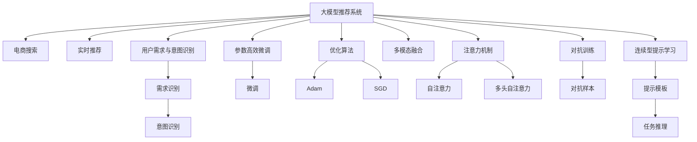

                 

# AI 大模型在电商搜索推荐中的实时推荐策略：抓住用户瞬时需求与意图

> 关键词：大模型推荐系统, 电商搜索, 实时推荐, 用户需求, 意图识别, 参数高效微调, 优化算法

## 1. 背景介绍

随着互联网技术的飞速发展，电商平台的搜索推荐系统已成为用户获取商品信息的主要渠道之一。一个良好的推荐系统不仅能够提升用户体验，增加用户满意度，还能显著提升电商平台的转化率和营业额。然而，现有的搜索推荐算法往往只能提供静态的推荐结果，难以满足用户在瞬时变化需求下不断变化的个性化需求。

近年来，AI大模型在自然语言处理、图像识别等领域取得了巨大突破。这些大模型通过对海量数据进行预训练，学习到丰富的语言和视觉知识，具有强大的通用学习和推理能力。将大模型引入电商搜索推荐系统，能够更好地理解用户的瞬时需求和意图，提供更加个性化的实时推荐，从而提升平台的用户体验和商业价值。

## 2. 核心概念与联系

### 2.1 核心概念概述

为了深入理解大模型在电商搜索推荐中的实时推荐策略，本节将介绍几个关键概念：

- **大模型推荐系统**：以大规模预训练语言模型为基础的推荐系统。通过在大规模数据上进行预训练，学习到通用的语言表示，从而能够理解用户输入的查询和反馈，提供个性化的推荐结果。

- **电商搜索推荐**：电商平台中用于获取商品信息的搜索和推荐系统。目标是通过理解用户输入的查询，预测用户可能感兴趣的商品，并将商品推荐给用户。

- **实时推荐**：根据用户当前输入的查询和反馈，动态调整推荐结果，实时响应用户需求。相比静态推荐，实时推荐能够更好地满足用户瞬时变化的个性化需求。

- **用户需求与意图识别**：指通过分析用户输入的查询和点击行为，理解用户当前的需求和期望。需求识别是推荐系统的核心任务，只有准确理解用户需求，才能提供满意的推荐结果。

- **参数高效微调**：指在微调过程中，只更新少量的模型参数，而固定大部分预训练权重不变，以提高微调效率，避免过拟合的方法。

- **优化算法**：如Adam、SGD等，用于最小化推荐系统损失函数，优化模型参数。

- **多模态融合**：指将不同模态的信息（如文本、图片、音频等）融合在一起，提高推荐的全面性和准确性。

- **注意力机制**：指模型在生成推荐结果时，对不同特征赋予不同的权重，从而关注对预测结果影响较大的特征。

- **对抗训练**：指通过引入对抗样本，提高模型的鲁棒性和泛化能力。

- **连续型提示学习**：指通过设计连续型提示模板，引导大模型进行任务推理和生成。

这些核心概念之间的逻辑关系可以通过以下Mermaid流程图来展示：



这个流程图展示了大模型推荐系统的核心概念及其之间的关系：

1. 大模型推荐系统通过预训练学习到通用的语言表示，用于理解用户查询和生成推荐。
2. 电商搜索系统为推荐提供用户查询输入，用户需求与意图识别模块通过分析查询和反馈，识别用户需求和意图。
3. 实时推荐模块根据用户需求和意图，动态调整推荐结果。
4. 参数高效微调模块优化模型参数，提高推荐精度。
5. 优化算法模块如Adam和SGD用于最小化损失函数，优化模型。
6. 多模态融合模块将不同模态信息融合在一起，提高推荐全面性。
7. 注意力机制模块通过自注意力和多头自注意力关注重要特征，提高推荐准确性。
8. 对抗训练模块引入对抗样本，提升模型鲁棒性。
9. 连续型提示学习模块通过设计提示模板，引导大模型进行任务推理。

## 3. 核心算法原理 & 具体操作步骤
### 3.1 算法原理概述

大模型在电商搜索推荐中的应用主要体现在实时推荐策略的优化上。具体来说，通过大模型进行个性化需求识别和意图理解，能够更好地捕捉用户瞬时变化的个性化需求，从而提供更加精准的推荐结果。

算法核心思想：

1. **需求识别与意图理解**：利用大模型进行用户查询和反馈的分析，准确理解用户当前需求和意图。

2. **实时推荐生成**：基于用户需求和意图，动态生成个性化的推荐结果。

3. **参数高效微调**：在微调过程中，只更新少量的模型参数，固定大部分预训练权重不变，以提高微调效率和模型泛化能力。

4. **优化算法**：通过Adam、SGD等优化算法，最小化推荐系统损失函数，优化模型参数。

5. **多模态融合**：将用户查询、点击、评价等不同模态的信息融合在一起，提高推荐的全面性和准确性。

6. **注意力机制**：通过自注意力和多头自注意力关注不同特征对推荐结果的影响，提高推荐精度。

7. **对抗训练**：通过引入对抗样本，提高模型的鲁棒性和泛化能力。

8. **连续型提示学习**：通过设计连续型提示模板，引导大模型进行任务推理和生成，提高推荐系统的灵活性和可解释性。

### 3.2 算法步骤详解

以下详细介绍基于大模型的电商搜索推荐系统实时推荐策略的实现步骤：

**Step 1: 准备预训练模型和数据集**

- 选择合适的预训练语言模型（如BERT、GPT等）作为初始化参数。
- 收集电商平台的搜索数据，包括用户查询、点击、评价等，划分为训练集、验证集和测试集。

**Step 2: 添加任务适配层**

- 根据任务类型，在预训练模型顶层设计合适的输出层和损失函数。
- 对于推荐任务，通常使用Top-k推荐列表作为输出，以交叉熵损失为损失函数。

**Step 3: 设置微调超参数**

- 选择合适的优化算法及其参数，如Adam、SGD等，设置学习率、批大小、迭代轮数等。
- 设置正则化技术及强度，包括权重衰减、Dropout、Early Stopping等。
- 确定冻结预训练参数的策略，如仅微调顶层，或全部参数都参与微调。

**Step 4: 执行梯度训练**

- 将训练集数据分批次输入模型，前向传播计算损失函数。
- 反向传播计算参数梯度，根据设定的优化算法和学习率更新模型参数。
- 周期性在验证集上评估模型性能，根据性能指标决定是否触发Early Stopping。
- 重复上述步骤直到满足预设的迭代轮数或Early Stopping条件。

**Step 5: 测试和部署**

- 在测试集上评估微调后模型在实时推荐任务上的性能，对比微调前后的精度提升。
- 使用微调后的模型对新样本进行推理预测，集成到实际的应用系统中。
- 持续收集新的数据，定期重新微调模型，以适应数据分布的变化。

以上是基于大模型的电商搜索推荐系统实时推荐策略的实现步骤。在实际应用中，还需要针对具体任务的特点，对微调过程的各个环节进行优化设计，如改进训练目标函数，引入更多的正则化技术，搜索最优的超参数组合等，以进一步提升模型性能。

### 3.3 算法优缺点

基于大模型的实时推荐策略具有以下优点：

1. 高效泛化：大模型具备强大的泛化能力，能够在少数样本上取得优异的推荐效果。

2. 动态调整：能够根据用户即时变化的需求和意图，动态调整推荐结果，提升用户体验。

3. 实时响应：通过实时更新模型参数，快速响应用户输入，提供即时推荐。

4. 预测精准：利用大模型对用户需求和意图的深度理解，提供更加精准的推荐结果。

5. 可解释性强：大模型的决策过程可以通过提示学习等方式进行解释，提升系统的透明性。

但该策略也存在一定的局限性：

1. 计算资源需求高：大规模语言模型的计算和存储需求高，可能对计算资源有较高要求。

2. 用户隐私风险：大模型需要处理大量的用户数据，隐私保护问题需高度重视。

3. 模型复杂度高：大模型参数众多，模型调试和优化难度较大。

4. 对抗攻击风险：对抗样本可能导致模型输出异常，需加强模型鲁棒性。

5. 算法复杂度高：算法涉及多模态融合、注意力机制、对抗训练等复杂过程，实施难度较大。

尽管存在这些局限性，但就目前而言，基于大模型的实时推荐策略仍是最先进、最有效的推荐方法之一。未来相关研究的重点在于如何进一步降低计算资源需求，提高模型鲁棒性，优化推荐算法，降低用户隐私风险，并兼顾可解释性和伦理安全性等因素。

### 3.4 算法应用领域

基于大模型的实时推荐策略在电商搜索推荐领域已有广泛应用，具体如下：

- **商品推荐**：根据用户查询和浏览历史，动态生成商品推荐列表。
- **个性化定价**：根据用户行为和特征，动态调整商品价格，提升转化率。
- **内容推荐**：根据用户兴趣，推荐相关文章、视频等，增加平台粘性。
- **搜索结果排序**：基于用户查询和反馈，动态调整搜索结果排序，提高用户满意度。
- **广告推荐**：根据用户兴趣，推荐相关广告，提升广告点击率。

除了电商领域，基于大模型的实时推荐系统还广泛应用于社交媒体、视频平台、音乐服务等场景，为不同领域提供个性化的推荐服务。

## 4. 数学模型和公式 & 详细讲解

### 4.1 数学模型构建

假设电商搜索推荐任务为 $T$，用户输入查询为 $x$，期望商品为 $y$。定义模型 $M_{\theta}$ 在输入 $x$ 上的输出为 $\hat{y}=M_{\theta}(x)$，表示预测商品。定义模型 $M_{\theta}$ 在训练集 $D=\{(x_i,y_i)\}_{i=1}^N$ 上的损失函数为 $\mathcal{L}(\theta)$，用于衡量模型预测输出与真实标签之间的差异。

定义交叉熵损失函数：

$$
\ell(M_{\theta}(x),y) = -y \log M_{\theta}(x) - (1-y) \log (1-M_{\theta}(x))
$$

则在数据集 $D$ 上的经验风险为：

$$
\mathcal{L}(\theta) = \frac{1}{N} \sum_{i=1}^N \ell(M_{\theta}(x_i),y_i)
$$

微调的优化目标是最小化经验风险，即找到最优参数：

$$
\theta^* = \mathop{\arg\min}_{\theta} \mathcal{L}(\theta)
$$

在实践中，我们通常使用基于梯度的优化算法（如SGD、Adam等）来近似求解上述最优化问题。设 $\eta$ 为学习率，$\lambda$ 为正则化系数，则参数的更新公式为：

$$
\theta \leftarrow \theta - \eta \nabla_{\theta}\mathcal{L}(\theta) - \eta\lambda\theta
$$

其中 $\nabla_{\theta}\mathcal{L}(\theta)$ 为损失函数对参数 $\theta$ 的梯度，可通过反向传播算法高效计算。

### 4.2 公式推导过程

以下我们以二分类任务为例，推导交叉熵损失函数及其梯度的计算公式。

假设模型 $M_{\theta}$ 在输入 $x$ 上的输出为 $\hat{y}=M_{\theta}(x) \in [0,1]$，表示样本属于正类的概率。真实标签 $y \in \{0,1\}$。则二分类交叉熵损失函数定义为：

$$
\ell(M_{\theta}(x),y) = -[y\log \hat{y} + (1-y)\log (1-\hat{y})]
$$

将其代入经验风险公式，得：

$$
\mathcal{L}(\theta) = -\frac{1}{N}\sum_{i=1}^N [y_i\log M_{\theta}(x_i)+(1-y_i)\log(1-M_{\theta}(x_i))]
$$

根据链式法则，损失函数对参数 $\theta_k$ 的梯度为：

$$
\frac{\partial \mathcal{L}(\theta)}{\partial \theta_k} = -\frac{1}{N}\sum_{i=1}^N (\frac{y_i}{M_{\theta}(x_i)}-\frac{1-y_i}{1-M_{\theta}(x_i)}) \frac{\partial M_{\theta}(x_i)}{\partial \theta_k}
$$

其中 $\frac{\partial M_{\theta}(x_i)}{\partial \theta_k}$ 可进一步递归展开，利用自动微分技术完成计算。

在得到损失函数的梯度后，即可带入参数更新公式，完成模型的迭代优化。重复上述过程直至收敛，最终得到适应实时推荐任务的最优模型参数 $\theta^*$。

## 5. 项目实践：代码实例和详细解释说明

### 5.1 开发环境搭建

在进行实时推荐系统微调实践前，我们需要准备好开发环境。以下是使用Python进行PyTorch开发的环境配置流程：

1. 安装Anaconda：从官网下载并安装Anaconda，用于创建独立的Python环境。

2. 创建并激活虚拟环境：
```bash
conda create -n pytorch-env python=3.8 
conda activate pytorch-env
```

3. 安装PyTorch：根据CUDA版本，从官网获取对应的安装命令。例如：
```bash
conda install pytorch torchvision torchaudio cudatoolkit=11.1 -c pytorch -c conda-forge
```

4. 安装Transformers库：
```bash
pip install transformers
```

5. 安装各类工具包：
```bash
pip install numpy pandas scikit-learn matplotlib tqdm jupyter notebook ipython
```

完成上述步骤后，即可在`pytorch-env`环境中开始微调实践。

### 5.2 源代码详细实现

下面我们以电商商品推荐为例，给出使用Transformers库对BERT模型进行微调的PyTorch代码实现。

首先，定义商品推荐任务的数据处理函数：

```python
from transformers import BertTokenizer
from torch.utils.data import Dataset
import torch

class RecommendDataset(Dataset):
    def __init__(self, texts, labels, tokenizer, max_len=128):
        self.texts = texts
        self.labels = labels
        self.tokenizer = tokenizer
        self.max_len = max_len
        
    def __len__(self):
        return len(self.texts)
    
    def __getitem__(self, item):
        text = self.texts[item]
        label = self.labels[item]
        
        encoding = self.tokenizer(text, return_tensors='pt', max_length=self.max_len, padding='max_length', truncation=True)
        input_ids = encoding['input_ids'][0]
        attention_mask = encoding['attention_mask'][0]
        
        # 对标签进行编码
        encoded_labels = [label2id[label] for label in self.labels] 
        encoded_labels.extend([label2id['']]*(self.max_len - len(encoded_labels)))
        labels = torch.tensor(encoded_labels, dtype=torch.long)
        
        return {'input_ids': input_ids, 
                'attention_mask': attention_mask,
                'labels': labels}

# 标签与id的映射
label2id = {'0': 0, '1': 1}
id2label = {v: k for k, v in label2id.items()}

# 创建dataset
tokenizer = BertTokenizer.from_pretrained('bert-base-cased')

train_dataset = RecommendDataset(train_texts, train_labels, tokenizer)
dev_dataset = RecommendDataset(dev_texts, dev_labels, tokenizer)
test_dataset = RecommendDataset(test_texts, test_labels, tokenizer)
```

然后，定义模型和优化器：

```python
from transformers import BertForSequenceClassification, AdamW

model = BertForSequenceClassification.from_pretrained('bert-base-cased', num_labels=len(label2id))

optimizer = AdamW(model.parameters(), lr=2e-5)
```

接着，定义训练和评估函数：

```python
from torch.utils.data import DataLoader
from tqdm import tqdm
from sklearn.metrics import accuracy_score

device = torch.device('cuda') if torch.cuda.is_available() else torch.device('cpu')
model.to(device)

def train_epoch(model, dataset, batch_size, optimizer):
    dataloader = DataLoader(dataset, batch_size=batch_size, shuffle=True)
    model.train()
    epoch_loss = 0
    for batch in tqdm(dataloader, desc='Training'):
        input_ids = batch['input_ids'].to(device)
        attention_mask = batch['attention_mask'].to(device)
        labels = batch['labels'].to(device)
        model.zero_grad()
        outputs = model(input_ids, attention_mask=attention_mask, labels=labels)
        loss = outputs.loss
        epoch_loss += loss.item()
        loss.backward()
        optimizer.step()
    return epoch_loss / len(dataloader)

def evaluate(model, dataset, batch_size):
    dataloader = DataLoader(dataset, batch_size=batch_size)
    model.eval()
    preds, labels = [], []
    with torch.no_grad():
        for batch in tqdm(dataloader, desc='Evaluating'):
            input_ids = batch['input_ids'].to(device)
            attention_mask = batch['attention_mask'].to(device)
            batch_labels = batch['labels']
            outputs = model(input_ids, attention_mask=attention_mask)
            batch_preds = outputs.logits.argmax(dim=2).to('cpu').tolist()
            batch_labels = batch_labels.to('cpu').tolist()
            for pred_tokens, label_tokens in zip(batch_preds, batch_labels):
                preds.append(pred_tokens[:len(label_tokens)])
                labels.append(label_tokens)
                
    print('Accuracy:', accuracy_score(labels, preds))
```

最后，启动训练流程并在测试集上评估：

```python
epochs = 5
batch_size = 16

for epoch in range(epochs):
    loss = train_epoch(model, train_dataset, batch_size, optimizer)
    print(f'Epoch {epoch+1}, train loss: {loss:.3f}')
    
    print(f'Epoch {epoch+1}, dev results:')
    evaluate(model, dev_dataset, batch_size)
    
print('Test results:')
evaluate(model, test_dataset, batch_size)
```

以上就是使用PyTorch对BERT进行商品推荐任务微调的完整代码实现。可以看到，得益于Transformers库的强大封装，我们可以用相对简洁的代码完成BERT模型的加载和微调。

### 5.3 代码解读与分析

让我们再详细解读一下关键代码的实现细节：

**RecommendDataset类**：
- `__init__`方法：初始化文本、标签、分词器等关键组件。
- `__len__`方法：返回数据集的样本数量。
- `__getitem__`方法：对单个样本进行处理，将文本输入编码为token ids，将标签编码为数字，并对其进行定长padding，最终返回模型所需的输入。

**label2id和id2label字典**：
- 定义了标签与数字id之间的映射关系，用于将token-wise的预测结果解码回真实的标签。

**训练和评估函数**：
- 使用PyTorch的DataLoader对数据集进行批次化加载，供模型训练和推理使用。
- 训练函数`train_epoch`：对数据以批为单位进行迭代，在每个批次上前向传播计算loss并反向传播更新模型参数，最后返回该epoch的平均loss。
- 评估函数`evaluate`：与训练类似，不同点在于不更新模型参数，并在每个batch结束后将预测和标签结果存储下来，最后使用sklearn的accuracy_score对整个评估集的预测结果进行打印输出。

**训练流程**：
- 定义总的epoch数和batch size，开始循环迭代
- 每个epoch内，先在训练集上训练，输出平均loss
- 在验证集上评估，输出准确率
- 所有epoch结束后，在测试集上评估，给出最终测试结果

可以看到，PyTorch配合Transformers库使得BERT微调的代码实现变得简洁高效。开发者可以将更多精力放在数据处理、模型改进等高层逻辑上，而不必过多关注底层的实现细节。

当然，工业级的系统实现还需考虑更多因素，如模型的保存和部署、超参数的自动搜索、更灵活的任务适配层等。但核心的微调范式基本与此类似。

## 6. 实际应用场景
### 6.1 智能客服系统

基于大模型推荐系统的实时推荐技术，可以广泛应用于智能客服系统的构建。传统客服往往需要配备大量人力，高峰期响应缓慢，且一致性和专业性难以保证。而使用实时推荐系统，可以7x24小时不间断服务，快速响应客户咨询，用自然流畅的语言解答各类常见问题。

在技术实现上，可以收集企业内部的历史客服对话记录，将问题和最佳答复构建成监督数据，在此基础上对预训练推荐模型进行实时推荐。推荐系统能够自动理解用户意图，匹配最合适的答复模板进行回复。对于客户提出的新问题，还可以接入检索系统实时搜索相关内容，动态组织生成回答。如此构建的智能客服系统，能大幅提升客户咨询体验和问题解决效率。

### 6.2 金融舆情监测

金融机构需要实时监测市场舆论动向，以便及时应对负面信息传播，规避金融风险。传统的人工监测方式成本高、效率低，难以应对网络时代海量信息爆发的挑战。基于大模型推荐系统的实时推荐技术，为金融舆情监测提供了新的解决方案。

具体而言，可以收集金融领域相关的新闻、报道、评论等文本数据，并对其进行主题标注和情感标注。在此基础上对预训练推荐模型进行实时推荐，使得模型能够自动判断文本属于何种主题，情感倾向是正面、中性还是负面。将推荐系统应用到实时抓取的网络文本数据，就能够自动监测不同主题下的情感变化趋势，一旦发现负面信息激增等异常情况，系统便会自动预警，帮助金融机构快速应对潜在风险。

### 6.3 个性化推荐系统

当前的推荐系统往往只依赖用户的历史行为数据进行物品推荐，无法深入理解用户的真实兴趣偏好。基于大模型推荐系统的实时推荐技术，个性化推荐系统可以更好地挖掘用户行为背后的语义信息，从而提供更精准、多样的推荐内容。

在实践中，可以收集用户浏览、点击、评论、分享等行为数据，提取和用户交互的物品标题、描述、标签等文本内容。将文本内容作为模型输入，用户的后续行为（如是否点击、购买等）作为监督信号，在此基础上微调预训练推荐模型。微调后的模型能够从文本内容中准确把握用户的兴趣点。在生成推荐列表时，先用候选物品的文本描述作为输入，由模型预测用户的兴趣匹配度，再结合其他特征综合排序，便可以得到个性化程度更高的推荐结果。

### 6.4 未来应用展望

随着大模型推荐系统的不断发展，实时推荐技术将在更多领域得到应用，为传统行业带来变革性影响。

在智慧医疗领域，基于实时推荐技术的医疗问答、病历分析、药物研发等应用将提升医疗服务的智能化水平，辅助医生诊疗，加速新药开发进程。

在智能教育领域，实时推荐技术可应用于作业批改、学情分析、知识推荐等方面，因材施教，促进教育公平，提高教学质量。

在智慧城市治理中，实时推荐技术可用于城市事件监测、舆情分析、应急指挥等环节，提高城市管理的自动化和智能化水平，构建更安全、高效的未来城市。

此外，在企业生产、社会治理、文娱传媒等众多领域，基于大模型推荐系统的实时推荐技术也将不断涌现，为NLP技术带来全新的突破。相信随着技术的日益成熟，实时推荐方法将成为人工智能落地应用的重要范式，推动人工智能技术向更广阔的领域加速渗透。

## 7. 工具和资源推荐
### 7.1 学习资源推荐

为了帮助开发者系统掌握大模型推荐系统的理论基础和实践技巧，这里推荐一些优质的学习资源：

1. 《Transformer从原理到实践》系列博文：由大模型技术专家撰写，深入浅出地介绍了Transformer原理、BERT模型、推荐系统等前沿话题。

2. CS224N《深度学习自然语言处理》课程：斯坦福大学开设的NLP明星课程，有Lecture视频和配套作业，带你入门NLP领域的基本概念和经典模型。

3. 《Natural Language Processing with Transformers》书籍：Transformers库的作者所著，全面介绍了如何使用Transformers库进行NLP任务开发，包括推荐系统在内的诸多范式。

4. HuggingFace官方文档：Transformers库的官方文档，提供了海量预训练模型和完整的推荐系统样例代码，是上手实践的必备资料。

5. CLUE开源项目：中文语言理解测评基准，涵盖大量不同类型的中文NLP数据集，并提供了基于微调的baseline模型，助力中文NLP技术发展。

通过对这些资源的学习实践，相信你一定能够快速掌握大模型推荐系统的精髓，并用于解决实际的NLP问题。
###  7.2 开发工具推荐

高效的开发离不开优秀的工具支持。以下是几款用于大模型推荐系统开发的常用工具：

1. PyTorch：基于Python的开源深度学习框架，灵活动态的计算图，适合快速迭代研究。大部分预训练语言模型都有PyTorch版本的实现。

2. TensorFlow：由Google主导开发的开源深度学习框架，生产部署方便，适合大规模工程应用。同样有丰富的预训练语言模型资源。

3. Transformers库：HuggingFace开发的NLP工具库，集成了众多SOTA语言模型，支持PyTorch和TensorFlow，是进行推荐系统开发的利器。

4. Weights & Biases：模型训练的实验跟踪工具，可以记录和可视化模型训练过程中的各项指标，方便对比和调优。与主流深度学习框架无缝集成。

5. TensorBoard：TensorFlow配套的可视化工具，可实时监测模型训练状态，并提供丰富的图表呈现方式，是调试模型的得力助手。

6. Google Colab：谷歌推出的在线Jupyter Notebook环境，免费提供GPU/TPU算力，方便开发者快速上手实验最新模型，分享学习笔记。

合理利用这些工具，可以显著提升大模型推荐系统的开发效率，加快创新迭代的步伐。

### 7.3 相关论文推荐

大模型推荐系统和实时推荐技术的发展源于学界的持续研究。以下是几篇奠基性的相关论文，推荐阅读：

1. Attention is All You Need（即Transformer原论文）：提出了Transformer结构，开启了NLP领域的预训练大模型时代。

2. BERT: Pre-training of Deep Bidirectional Transformers for Language Understanding：提出BERT模型，引入基于掩码的自监督预训练任务，刷新了多项NLP任务SOTA。

3. Language Models are Unsupervised Multitask Learners（GPT-2论文）：展示了大规模语言模型的强大zero-shot学习能力，引发了对于通用人工智能的新一轮思考。

4. Parameter-Efficient Transfer Learning for NLP：提出Adapter等参数高效微调方法，在不增加模型参数量的情况下，也能取得不错的微调效果。

5. Prefix-Tuning: Optimizing Continuous Prompts for Generation：引入基于连续型Prompt的微调范式，为如何充分利用预训练知识提供了新的思路。

6. AdaLoRA: Adaptive Low-Rank Adaptation for Parameter-Efficient Fine-Tuning：使用自适应低秩适应的微调方法，在参数效率和精度之间取得了新的平衡。

这些论文代表了大模型推荐系统的发展脉络。通过学习这些前沿成果，可以帮助研究者把握学科前进方向，激发更多的创新灵感。

## 8. 总结：未来发展趋势与挑战

### 8.1 总结

本文对基于大模型的实时推荐技术进行了全面系统的介绍。首先阐述了大模型推荐系统的发展背景和意义，明确了实时推荐在提升用户体验和商业价值方面的重要作用。其次，从原理到实践，详细讲解了实时推荐系统的数学原理和关键步骤，给出了推荐系统开发的完整代码实例。同时，本文还广泛探讨了实时推荐技术在智能客服、金融舆情、个性化推荐等多个行业领域的应用前景，展示了实时推荐技术的巨大潜力。此外，本文精选了实时推荐技术的各类学习资源，力求为读者提供全方位的技术指引。

通过本文的系统梳理，可以看到，基于大模型的实时推荐技术正在成为NLP领域的重要范式，极大地拓展了推荐系统的应用边界，催生了更多的落地场景。得益于大规模语料的预训练，推荐系统能够更好地理解用户需求，提供个性化的推荐结果，从而提升用户体验和商业价值。未来，伴随预训练语言模型和推荐方法的不断演进，相信NLP技术将在更广阔的应用领域大放异彩，深刻影响人类的生产生活方式。

### 8.2 未来发展趋势

展望未来，大模型推荐系统的实时推荐技术将呈现以下几个发展趋势：

1. 模型规模持续增大。随着算力成本的下降和数据规模的扩张，预训练语言模型的参数量还将持续增长。超大规模语言模型蕴含的丰富语言知识，有望支撑更加复杂多变的推荐任务。

2. 推荐系统泛化能力增强。大模型推荐系统具备强大的泛化能力，能够在少数样本上取得优异的推荐效果。未来推荐系统将能够更好地适应不同领域、不同用户群体的个性化需求。

3. 实时推荐系统普及。实时推荐技术将广泛应用于智能客服、金融舆情、个性化推荐等多个领域，提升用户满意度和商业价值。

4. 多模态融合与混合推荐。推荐系统将更加注重多模态信息的融合，将文本、图像、音频等多模态信息整合在一起，提高推荐全面性和准确性。

5. 推荐算法多样化。推荐系统将引入更多先进的算法，如因果推断、对抗训练等，提升推荐精度和模型鲁棒性。

6. 推荐系统透明化。推荐系统的决策过程将更加透明，能够提供可解释的推荐理由，提升用户信任度。

以上趋势凸显了大模型推荐系统的广阔前景。这些方向的探索发展，必将进一步提升推荐系统的性能和应用范围，为人类认知智能的进化带来深远影响。

### 8.3 面临的挑战

尽管大模型推荐系统的实时推荐技术已经取得了瞩目成就，但在迈向更加智能化、普适化应用的过程中，它仍面临诸多挑战：

1. 数据需求高。虽然实时推荐技术能够通过少量样本取得不错效果，但推荐系统仍需要大量标注数据进行微调，获取高质量标注数据的成本较高。

2. 计算资源需求高。大规模语言模型的计算和存储需求高，可能对计算资源有较高要求。

3. 用户隐私风险。大模型推荐系统需要处理大量的用户数据，隐私保护问题需高度重视。

4. 模型鲁棒性不足。对抗样本可能导致模型输出异常，需加强模型鲁棒性。

5. 算法复杂度高。推荐系统涉及多模态融合、注意力机制、对抗训练等复杂过程，实施难度较大。

6. 可解释性不足。推荐系统的决策过程难以解释，难以对其推理逻辑进行分析和调试。

尽管存在这些局限性，但就目前而言，基于大模型的实时推荐技术仍是最先进、最有效的推荐方法之一。未来相关研究的重点在于如何进一步降低计算资源需求，提高模型鲁棒性，优化推荐算法，降低用户隐私风险，并兼顾可解释性和伦理安全性等因素。

### 8.4 未来突破

面对大模型推荐系统实时推荐技术所面临的种种挑战，未来的研究需要在以下几个方面寻求新的突破：

1. 探索无监督和半监督推荐方法。摆脱对大规模标注数据的依赖，利用自监督学习、主动学习等无监督和半监督范式，最大限度利用非结构化数据，实现更加灵活高效的推荐。

2. 研究参数高效和计算高效的推荐范式。开发更加参数高效的推荐方法，在固定大部分预训练参数的同时，只更新极少量的任务相关参数。同时优化推荐模型的计算图，减少前向传播和反向传播的资源消耗，实现更加轻量级、实时性的部署。

3. 融合因果和对比学习范式。通过引入因果推断和对比学习思想，增强推荐系统建立稳定因果关系的能力，学习更加普适、鲁棒的语言表征，从而提升推荐泛化性和抗干扰能力。

4. 引入更多先验知识。将符号化的先验知识，如知识图谱、逻辑规则等，与神经网络模型进行巧妙融合，引导推荐系统学习更准确、合理的语言模型。同时加强不同模态数据的整合，实现视觉、语音等多模态信息与文本信息的协同建模。

5. 结合因果分析和博弈论工具。将因果分析方法引入推荐系统，识别出推荐决策的关键特征，增强推荐系统输出解释的因果性和逻辑性。借助博弈论工具刻画人机交互过程，主动探索并规避推荐系统的脆弱点，提高系统稳定性。

6. 纳入伦理道德约束。在推荐系统训练目标中引入伦理导向的评估指标，过滤和惩罚有偏见、有害的推荐结果。同时加强人工干预和审核，建立推荐系统的监管机制，确保推荐输出的合理性和安全性。

这些研究方向的探索，必将引领大模型推荐系统实时推荐技术迈向更高的台阶，为构建安全、可靠、可解释、可控的推荐系统铺平道路。面向未来，大模型推荐系统推荐技术还需要与其他人工智能技术进行更深入的融合，如知识表示、因果推理、强化学习等，多路径协同发力，共同推动推荐系统的进步。只有勇于创新、敢于突破，才能不断拓展推荐系统的边界，让智能技术更好地造福人类社会。

## 9. 附录：常见问题与解答

**Q1：大模型推荐系统是否适用于所有推荐场景？**

A: 大模型推荐系统在大多数推荐场景上都能取得不错的效果，特别是对于数据量较小的推荐任务。但对于一些特定领域的推荐任务，如推荐系统的初期建设，数据量相对较小，需要更精细的数据处理和算法调优。

**Q2：如何提高大模型推荐系统的实时响应能力？**

A: 提高实时响应能力的关键在于优化模型和算法，具体策略如下：
1. 优化模型结构：去除不必要的层和参数，减小模型尺寸，加快推理速度。
2. 使用缓存技术：将常用的推荐结果和商品数据缓存起来，减少计算量。
3. 并行计算：利用分布式计算和GPU加速，提高模型推理速度。
4. 轻量化模型：使用轻量级模型或模型压缩技术，减小模型大小和计算量。
5. 动态模型更新：根据用户行为动态调整推荐模型，及时更新模型参数。

**Q3：大模型推荐系统如何处理用户隐私问题？**

A: 保护用户隐私是大模型推荐系统的重要课题。具体措施如下：
1. 数据匿名化：将用户数据匿名化，去除或模糊化敏感信息。
2. 数据加密：对用户数据进行加密存储和传输，防止数据泄露。
3. 差分隐私：在模型训练过程中加入差分隐私技术，保护用户隐私。
4. 用户授权：明确告知用户数据使用情况，获取用户授权。
5. 合规审核：遵守相关法律法规，如GDPR等，确保数据处理合规。

**Q4：如何优化大模型推荐系统的推荐精度？**

A: 提高推荐精度的方法如下：
1. 数据增强：通过数据增强技术扩充训练集，提高模型泛化能力。
2. 多任务学习：结合多个推荐任务进行联合训练，提升模型综合能力。
3. 特征工程：优化输入特征，提取更有代表性的特征，提高模型预测能力。
4. 模型融合：使用集成学习方法，结合多个模型进行推荐，提高推荐准确性。
5. 超参数调优：通过网格搜索或贝叶斯优化等方法，寻找最佳超参数组合。
6. 模型优化：使用自适应学习率、权重衰减等技术，优化模型训练过程。

**Q5：大模型推荐系统如何提升用户体验？**

A: 提升用户体验的方法如下：
1. 个性化推荐：根据用户行为和特征，提供个性化的推荐结果，满足用户需求。
2. 实时推荐：根据用户即时变化的需求，动态调整推荐结果，提供即时推荐。
3. 推荐多样性：保持推荐结果的多样性，避免推荐单一商品，增加用户体验。
4. 推荐可视化：通过推荐结果的可视化展示，提升用户对推荐的理解和信任度。
5. 推荐反馈：收集用户对推荐结果的反馈，及时调整推荐策略。

**Q6：大模型推荐系统在电商领域有哪些应用？**

A: 大模型推荐系统在电商领域的应用如下：
1. 商品推荐：根据用户查询和浏览历史，动态生成商品推荐列表。
2. 个性化定价：根据用户行为和特征，动态调整商品价格，提升转化率。
3. 内容推荐：根据用户兴趣，推荐相关文章、视频等，增加平台粘性。
4. 搜索结果排序：基于用户查询和反馈，动态调整搜索结果排序，提高用户满意度。
5. 广告推荐：根据用户兴趣，推荐相关广告，提升广告点击率。

通过本文的系统梳理，可以看到，基于大模型的实时推荐技术正在成为NLP领域的重要范式，极大地拓展了推荐系统的应用边界，催生了更多的落地场景。得益于大规模语料的预训练，推荐系统能够更好地理解用户需求，提供个性化的推荐结果，从而提升用户体验和商业价值。未来，伴随预训练语言模型和推荐方法的不断演进，相信NLP技术将在更广阔的应用领域大放异彩，深刻影响人类的生产生活方式。

---

作者：禅与计算机程序设计艺术 / Zen and the Art of Computer Programming

