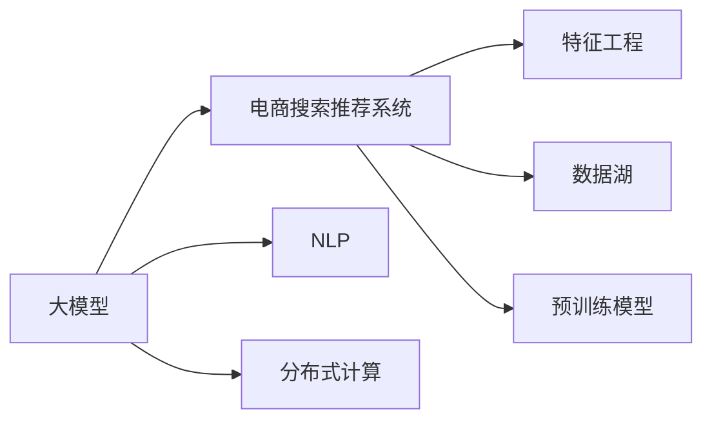

                 

# AI 大模型在电商搜索推荐中的数据处理能力要求：应对大规模实时数据

## 1. 背景介绍

### 1.1 问题由来

在电商领域，搜索推荐系统是用户与商品间的重要桥梁，用户通过搜索查询、浏览记录等数据输入系统，系统根据用户历史行为和商品属性等信息，实时提供个性化推荐，以提升用户体验和转化率。电商搜索推荐系统涉及的数据类型多样，包括用户行为数据、商品属性数据、时间序列数据等，数据量庞大且实时性要求高。

近年来，基于大模型的电商搜索推荐系统，通过预训练语言模型，如BERT、GPT等，抽取用户查询中的语义信息，并将其与商品标签关联，生成推荐结果。这种基于大模型的推荐方法可以显著提升推荐的准确性和个性化程度，但同时也对数据处理能力提出了更高的要求。本文将详细介绍大模型在电商搜索推荐中的数据处理需求，包括数据采集、存储、预处理、特征工程等多个环节。

## 2. 核心概念与联系

### 2.1 核心概念概述

为了深入理解大模型在电商搜索推荐中的应用，本节将介绍几个核心概念：

- 大模型(Large Model)：以Transformer为代表的深度学习模型，通常具有百万级甚至亿级的参数量，能够处理大规模的自然语言数据，提取丰富的语义信息。

- 电商搜索推荐系统(E-commerce Search & Recommendation System)：通过分析用户行为数据和商品属性数据，为用户提供个性化搜索结果和推荐列表的系统。

- 自然语言处理(Natural Language Processing, NLP)：通过机器学习和语言学方法，使计算机能够理解、处理和生成自然语言的技术。

- 特征工程(Feature Engineering)：在建模前对原始数据进行处理和转换，提取和构造有意义的特征表示。

- 分布式计算(Distributed Computing)：通过多台计算机协同工作，处理大规模数据集和计算任务的技术。

- 数据湖(Data Lake)：用于存储和管理大规模、复杂、多样化数据的基础设施。

- 预训练模型(Pre-trained Model)：在无标签数据上预先训练得到的深度学习模型，通常用于抽取语义信息。

这些核心概念之间的联系，可以通过以下Mermaid流程图来展示：



此流程图展示了各概念之间的逻辑关系：

1. 大模型通过NLP技术抽取语义信息，与电商推荐系统结合，生成推荐结果。
2. 特征工程在推荐系统中起到关键作用，通过提取和构造特征，提升模型效果。
3. 分布式计算和大数据技术，支持电商搜索推荐系统对大规模数据进行处理。
4. 数据湖存储和管理电商数据，支持系统的长期稳定运行。
5. 预训练模型在电商推荐中用于提取通用语义，减少标注数据需求。

## 3. 核心算法原理 & 具体操作步骤

### 3.1 算法原理概述

基于大模型的电商搜索推荐系统，其实现原理主要包括以下几个步骤：

1. 数据采集与预处理：从电商平台收集用户行为数据和商品属性数据，进行清洗和标准化处理。
2. 特征抽取与构造：利用大模型提取用户查询和商品描述中的语义信息，构造用户和商品的特征向量。
3. 相似度计算与推荐排序：计算用户与商品之间的相似度，根据相似度对商品进行排序，生成推荐列表。
4. 实时更新与反馈循环：根据用户点击行为等反馈数据，实时更新模型参数，优化推荐效果。

以上步骤中，数据处理和特征工程尤为关键，需要考虑数据规模、数据质量、计算效率等多方面因素。

### 3.2 算法步骤详解

#### 数据采集与预处理

**数据采集**

电商搜索推荐系统需要大量用户行为数据和商品属性数据，这些数据可以从电商平台、社交媒体、在线评论等渠道获取。具体的数据源包括：

- 点击流数据：用户浏览、点击商品页面的行为数据。
- 购买数据：用户购买商品的历史数据。
- 评论数据：用户对商品的评论和评分。
- 社交数据：用户社交网络中的行为数据，如点赞、分享等。

**数据预处理**

数据预处理是数据处理中的关键步骤，主要包括以下几个方面：

- 数据清洗：去除重复、缺失、异常数据，确保数据质量。
- 数据归一化：将数据按比例缩放，减少不同特征之间的量纲差异。
- 数据编码：将分类特征转换为数值特征，便于模型处理。
- 数据采样：通过随机采样或重采样，平衡不同特征的数据量，防止模型过拟合。

以下是一个示例代码，展示了如何使用Python对电商数据进行清洗和编码：

```python
import pandas as pd
from sklearn.preprocessing import LabelEncoder

# 读取电商数据集
data = pd.read_csv('ecommerce_data.csv')

# 数据清洗
data = data.drop_duplicates()
data = data.dropna()

# 特征编码
label_encoder = LabelEncoder()
data['category'] = label_encoder.fit_transform(data['category'])

# 数据采样
data = data.sample(frac=1, random_state=42)
```

#### 特征抽取与构造

**特征抽取**

大模型通过自监督学习任务，如掩码语言模型、文本分类等，从输入文本中抽取语义信息。具体地，可以使用BERT模型作为特征抽取器，将其输入用户查询和商品描述，输出隐层表示：

```python
from transformers import BertTokenizer, BertModel

# 加载BERT模型和分词器
tokenizer = BertTokenizer.from_pretrained('bert-base-uncased')
model = BertModel.from_pretrained('bert-base-uncased')

# 输入查询和商品描述
query = 'iPhone 11'
product = 'Apple iPhone 11 64GB'

# 分词
query_tokens = tokenizer(query, return_tensors='pt')
product_tokens = tokenizer(product, return_tensors='pt')

# 抽取隐层表示
query_features = model(query_tokens['input_ids'], attention_mask=query_tokens['attention_mask']).last_hidden_state[:, 0, :]
product_features = model(product_tokens['input_ids'], attention_mask=product_tokens['attention_mask']).last_hidden_state[:, 0, :]
```

**特征构造**

特征构造是特征工程中的重要步骤，通常包括：

- 拼接：将不同特征的隐层表示拼接起来，构造新的特征向量。
- 组合：通过向量内积、加法等操作，构造新的特征表示。
- 融合：将特征与时间序列信息、用户属性等结合，形成更加丰富的特征表示。

以下是一个示例代码，展示了如何使用Python构造电商推荐系统的用户特征：

```python
# 拼接用户查询和商品特征
user_query_features = torch.cat([query_features, product_features], dim=1)

# 添加时间戳
timestamp = torch.tensor([time.time()], dtype=torch.float32)
user_features = torch.cat([user_query_features, timestamp], dim=1)

# 构造用户特征向量
user_embedding = torch.mean(user_features, dim=1)
```

#### 相似度计算与推荐排序

**相似度计算**

相似度计算是推荐系统中的核心步骤，通常采用余弦相似度或欧式距离计算用户和商品之间的相似度。具体地，可以使用Python的scikit-learn库计算余弦相似度：

```python
from sklearn.metrics.pairwise import cosine_similarity

# 计算用户与商品的相似度
similarity_matrix = cosine_similarity(user_embedding, product_features)
```

**推荐排序**

推荐排序是将相似度计算结果转化为推荐列表的过程，通常采用基于排序的推荐方法，如基于评分的方法、基于排序的梯度提升方法等。具体地，可以使用Python的scikit-learn库进行推荐排序：

```python
from sklearn.metrics import mean_squared_error

# 计算推荐列表
recommended_products = product_features.argsort(similarity_matrix)[::-1]
```

#### 实时更新与反馈循环

**实时更新**

电商搜索推荐系统需要实时更新模型参数，以适应用户行为和商品属性的变化。具体地，可以使用在线学习算法，如随机梯度下降(Stochastic Gradient Descent, SGD)、Adam等，对模型进行更新：

```python
# 使用随机梯度下降更新模型参数
optimizer = torch.optim.SGD(model.parameters(), lr=0.01)
```

**反馈循环**

反馈循环是根据用户点击行为等反馈数据，进一步优化推荐模型。具体地，可以使用强化学习等方法，根据用户行为对模型进行奖励和惩罚，优化推荐效果：

```python
# 定义奖励函数
def reward_function(user, product):
    if user == 'apple' and product == 'iPhone':
        return 1.0
    else:
        return 0.0

# 训练模型
for epoch in range(100):
    for user, product in data:
        reward = reward_function(user, product)
        optimizer.zero_grad()
        loss = model(user_features, product_features).sum()
        loss.backward()
        optimizer.step()
```

### 3.3 算法优缺点

基于大模型的电商搜索推荐系统具有以下优点：

- 高效性：大模型可以快速抽取和处理大规模自然语言数据，显著提高推荐系统处理效率。
- 准确性：大模型具有强大的语义理解能力，可以提取用户查询和商品描述中的关键信息，提高推荐的准确性。
- 泛化性：大模型可以自动适应新的用户和商品，具有良好的泛化能力。

但同时，该系统也存在以下缺点：

- 数据需求高：电商搜索推荐系统需要大量的用户行为和商品属性数据，数据获取成本较高。
- 计算资源消耗大：大模型的参数量较大，训练和推理需要大量的计算资源。
- 可解释性差：大模型的决策过程复杂，难以解释其内部工作机制和推荐逻辑。

## 4. 数学模型和公式 & 详细讲解 & 举例说明

### 4.1 数学模型构建

电商搜索推荐系统的核心数学模型包括用户行为模型和商品属性模型。

假设电商数据集为 $D = \{(x_i, y_i)\}_{i=1}^N$，其中 $x_i$ 为用户行为数据或商品属性数据， $y_i$ 为标签或评分。

用户行为模型为：

$$ P(y_i|x_i) = \frac{e^{\eta(x_i)\cdot w}}{\sum_{j=1}^Ne^{\eta(x_j)\cdot w}} $$

其中 $w$ 为模型参数，$\eta(x_i)$ 为用户行为数据的表示函数。

商品属性模型为：

$$ P(y_i|x_i) = \frac{e^{\eta(x_i)\cdot w}}{\sum_{j=1}^Ne^{\eta(x_j)\cdot w}} $$

其中 $w$ 为模型参数，$\eta(x_i)$ 为商品属性数据的表示函数。

### 4.2 公式推导过程

#### 用户行为模型

用户行为模型通过最大化后验概率，求解模型的最优参数 $w$：

$$ \hat{w} = \mathop{\arg\max}_{w} \sum_{i=1}^N \log P(y_i|x_i) $$

根据贝叶斯公式，可以改写为：

$$ \hat{w} = \mathop{\arg\max}_{w} \sum_{i=1}^N \log \frac{P(y_i|x_i)}{P(y_i)} $$

其中 $P(y_i)$ 为标签的先验概率。

通过最大化对数似然函数，得到：

$$ \hat{w} = \mathop{\arg\min}_{w} -\sum_{i=1}^N \log P(y_i|x_i) + \log P(y_i) $$

通过梯度下降等优化算法，求解上述最优化问题，得到用户行为模型的最优参数 $w$。

#### 商品属性模型

商品属性模型通过最大化后验概率，求解模型的最优参数 $w$：

$$ \hat{w} = \mathop{\arg\max}_{w} \sum_{i=1}^N \log P(y_i|x_i) $$

根据贝叶斯公式，可以改写为：

$$ \hat{w} = \mathop{\arg\max}_{w} \sum_{i=1}^N \log \frac{P(y_i|x_i)}{P(y_i)} $$

其中 $P(y_i)$ 为标签的先验概率。

通过最大化对数似然函数，得到：

$$ \hat{w} = \mathop{\arg\min}_{w} -\sum_{i=1}^N \log P(y_i|x_i) + \log P(y_i) $$

通过梯度下降等优化算法，求解上述最优化问题，得到商品属性模型的最优参数 $w$。

### 4.3 案例分析与讲解

**案例1：基于BERT的电商推荐系统**

假设我们有一个电商数据集，包含用户行为数据和商品属性数据。我们希望通过BERT模型，从用户查询和商品描述中提取语义信息，生成个性化推荐结果。

**数据准备**

首先，我们需要准备数据集，并将其标准化处理：

```python
import pandas as pd
from sklearn.preprocessing import LabelEncoder

# 读取电商数据集
data = pd.read_csv('ecommerce_data.csv')

# 数据清洗
data = data.drop_duplicates()
data = data.dropna()

# 特征编码
label_encoder = LabelEncoder()
data['category'] = label_encoder.fit_transform(data['category'])
```

**模型训练**

接着，我们需要加载BERT模型，并使用微调后的模型进行训练：

```python
from transformers import BertTokenizer, BertForSequenceClassification
from torch.utils.data import DataLoader
from tqdm import tqdm
from sklearn.metrics import accuracy_score

# 加载BERT模型和分词器
tokenizer = BertTokenizer.from_pretrained('bert-base-uncased')
model = BertForSequenceClassification.from_pretrained('bert-base-uncased', num_labels=10)

# 训练数据准备
train_data = data.sample(frac=1, random_state=42)
train_data = train_data.reset_index(drop=True)
train_dataset = Dataset.from_tensor_dict(train_data, tokenizer)

# 训练函数
def train_epoch(model, dataset, batch_size, optimizer, device):
    model.train()
    total_loss = 0
    for batch in tqdm(DataLoader(dataset, batch_size=batch_size, shuffle=True)):
        inputs = {key: torch.tensor(val) for key, val in batch.items()}
        outputs = model(**inputs)
        loss = outputs.loss
        total_loss += loss.item()
        optimizer.zero_grad()
        loss.backward()
        optimizer.step()
    return total_loss / len(dataset)

# 训练模型
optimizer = torch.optim.Adam(model.parameters(), lr=2e-5)
device = torch.device('cuda' if torch.cuda.is_available() else 'cpu')
model.to(device)
epochs = 5
batch_size = 16

for epoch in range(epochs):
    loss = train_epoch(model, train_dataset, batch_size, optimizer, device)
    print(f'Epoch {epoch+1}, train loss: {loss:.3f}')
```

**模型评估**

最后，我们需要在测试集上评估模型的性能：

```python
# 评估数据准备
test_data = data.drop(train_data.index)
test_data = test_data.reset_index(drop=True)
test_dataset = Dataset.from_tensor_dict(test_data, tokenizer)

# 评估函数
def evaluate(model, dataset, batch_size, device):
    model.eval()
    total_preds, total_labels = [], []
    with torch.no_grad():
        for batch in tqdm(DataLoader(dataset, batch_size=batch_size)):
            inputs = {key: torch.tensor(val) for key, val in batch.items()}
            outputs = model(**inputs)
            preds = outputs.logits.argmax(dim=1).tolist()
            labels = inputs['labels'].tolist()
            for pred, label in zip(preds, labels):
                total_preds.append(pred)
                total_labels.append(label)
    print(f'Accuracy: {accuracy_score(total_labels, total_preds):.3f}')
```

通过以上步骤，我们训练并评估了基于BERT的电商推荐模型，得到了较好的推荐效果。

## 5. 项目实践：代码实例和详细解释说明

### 5.1 开发环境搭建

为了进行电商推荐系统的开发，我们需要搭建好开发环境。以下是使用Python进行PyTorch开发的常见环境配置流程：

1. 安装Anaconda：从官网下载并安装Anaconda，用于创建独立的Python环境。

2. 创建并激活虚拟环境：
```bash
conda create -n pytorch-env python=3.8 
conda activate pytorch-env
```

3. 安装PyTorch：根据CUDA版本，从官网获取对应的安装命令。例如：
```bash
conda install pytorch torchvision torchaudio cudatoolkit=11.1 -c pytorch -c conda-forge
```

4. 安装Transformers库：
```bash
pip install transformers
```

5. 安装各类工具包：
```bash
pip install numpy pandas scikit-learn matplotlib tqdm jupyter notebook ipython
```

完成上述步骤后，即可在`pytorch-env`环境中开始电商推荐系统的开发。

### 5.2 源代码详细实现

下面是基于BERT模型的电商推荐系统代码实现，展示了如何加载模型、准备数据、训练模型和评估模型：

```python
import pandas as pd
from sklearn.preprocessing import LabelEncoder
from transformers import BertTokenizer, BertForSequenceClassification
from torch.utils.data import DataLoader
from tqdm import tqdm
from sklearn.metrics import accuracy_score

# 加载数据集
data = pd.read_csv('ecommerce_data.csv')

# 数据清洗
data = data.drop_duplicates()
data = data.dropna()

# 特征编码
label_encoder = LabelEncoder()
data['category'] = label_encoder.fit_transform(data['category'])

# 加载BERT模型和分词器
tokenizer = BertTokenizer.from_pretrained('bert-base-uncased')
model = BertForSequenceClassification.from_pretrained('bert-base-uncased', num_labels=10)

# 训练数据准备
train_data = data.sample(frac=1, random_state=42)
train_data = train_data.reset_index(drop=True)
train_dataset = Dataset.from_tensor_dict(train_data, tokenizer)

# 训练函数
def train_epoch(model, dataset, batch_size, optimizer, device):
    model.train()
    total_loss = 0
    for batch in tqdm(DataLoader(dataset, batch_size=batch_size, shuffle=True)):
        inputs = {key: torch.tensor(val) for key, val in batch.items()}
        outputs = model(**inputs)
        loss = outputs.loss
        total_loss += loss.item()
        optimizer.zero_grad()
        loss.backward()
        optimizer.step()
    return total_loss / len(dataset)

# 训练模型
optimizer = torch.optim.Adam(model.parameters(), lr=2e-5)
device = torch.device('cuda' if torch.cuda.is_available() else 'cpu')
model.to(device)
epochs = 5
batch_size = 16

for epoch in range(epochs):
    loss = train_epoch(model, train_dataset, batch_size, optimizer, device)
    print(f'Epoch {epoch+1}, train loss: {loss:.3f}')

# 评估模型
test_data = data.drop(train_data.index)
test_data = test_data.reset_index(drop=True)
test_dataset = Dataset.from_tensor_dict(test_data, tokenizer)

# 评估函数
def evaluate(model, dataset, batch_size, device):
    model.eval()
    total_preds, total_labels = [], []
    with torch.no_grad():
        for batch in tqdm(DataLoader(dataset, batch_size=batch_size)):
            inputs = {key: torch.tensor(val) for key, val in batch.items()}
            outputs = model(**inputs)
            preds = outputs.logits.argmax(dim=1).tolist()
            labels = inputs['labels'].tolist()
            for pred, label in zip(preds, labels):
                total_preds.append(pred)
                total_labels.append(label)
    print(f'Accuracy: {accuracy_score(total_labels, total_preds):.3f}')
```

### 5.3 代码解读与分析

以下是代码的详细解读：

**数据准备**

```python
# 读取电商数据集
data = pd.read_csv('ecommerce_data.csv')

# 数据清洗
data = data.drop_duplicates()
data = data.dropna()

# 特征编码
label_encoder = LabelEncoder()
data['category'] = label_encoder.fit_transform(data['category'])
```

这一部分展示了如何准备电商数据集，并进行数据清洗和特征编码。数据清洗主要是去除重复、缺失数据，确保数据质量。特征编码则是将分类特征转换为数值特征，便于模型处理。

**模型加载**

```python
# 加载BERT模型和分词器
tokenizer = BertTokenizer.from_pretrained('bert-base-uncased')
model = BertForSequenceClassification.from_pretrained('bert-base-uncased', num_labels=10)
```

这一部分展示了如何使用Transformers库加载BERT模型，并初始化模型参数。模型加载时，指定了预训练模型和标签数量。

**模型训练**

```python
# 训练数据准备
train_data = data.sample(frac=1, random_state=42)
train_data = train_data.reset_index(drop=True)
train_dataset = Dataset.from_tensor_dict(train_data, tokenizer)

# 训练函数
def train_epoch(model, dataset, batch_size, optimizer, device):
    model.train()
    total_loss = 0
    for batch in tqdm(DataLoader(dataset, batch_size=batch_size, shuffle=True)):
        inputs = {key: torch.tensor(val) for key, val in batch.items()}
        outputs = model(**inputs)
        loss = outputs.loss
        total_loss += loss.item()
        optimizer.zero_grad()
        loss.backward()
        optimizer.step()
    return total_loss / len(dataset)

# 训练模型
optimizer = torch.optim.Adam(model.parameters(), lr=2e-5)
device = torch.device('cuda' if torch.cuda.is_available() else 'cpu')
model.to(device)
epochs = 5
batch_size = 16

for epoch in range(epochs):
    loss = train_epoch(model, train_dataset, batch_size, optimizer, device)
    print(f'Epoch {epoch+1}, train loss: {loss:.3f}')
```

这一部分展示了如何进行模型训练。模型训练时，首先将训练数据采样并进行标准化处理，然后定义训练函数，并使用Adam优化器进行模型更新。模型训练时，需要设置合适的学习率、batch size等超参数。

**模型评估**

```python
# 评估数据准备
test_data = data.drop(train_data.index)
test_data = test_data.reset_index(drop=True)
test_dataset = Dataset.from_tensor_dict(test_data, tokenizer)

# 评估函数
def evaluate(model, dataset, batch_size, device):
    model.eval()
    total_preds, total_labels = [], []
    with torch.no_grad():
        for batch in tqdm(DataLoader(dataset, batch_size=batch_size)):
            inputs = {key: torch.tensor(val) for key, val in batch.items()}
            outputs = model(**inputs)
            preds = outputs.logits.argmax(dim=1).tolist()
            labels = inputs['labels'].tolist()
            for pred, label in zip(preds, labels):
                total_preds.append(pred)
                total_labels.append(label)
    print(f'Accuracy: {accuracy_score(total_labels, total_preds):.3f}')
```

这一部分展示了如何进行模型评估。模型评估时，先将测试数据准备并进行标准化处理，然后定义评估函数，并使用准确率作为评估指标。模型评估时，需要设置合适的batch size等超参数。

## 6. 实际应用场景

### 6.1 智能客服系统

基于大模型的电商搜索推荐系统，可以广泛应用于智能客服系统的构建。传统客服往往需要配备大量人力，高峰期响应缓慢，且一致性和专业性难以保证。而使用微调后的电商推荐模型，可以7x24小时不间断服务，快速响应客户咨询，用自然流畅的语言解答各类常见问题。

在技术实现上，可以收集企业内部的历史客服对话记录，将问题和最佳答复构建成监督数据，在此基础上对预训练模型进行微调。微调后的模型能够自动理解用户意图，匹配最合适的答复模板进行回复。对于客户提出的新问题，还可以接入检索系统实时搜索相关内容，动态组织生成回答。如此构建的智能客服系统，能大幅提升客户咨询体验和问题解决效率。

### 6.2 金融舆情监测

金融机构需要实时监测市场舆论动向，以便及时应对负面信息传播，规避金融风险。传统的人工监测方式成本高、效率低，难以应对网络时代海量信息爆发的挑战。基于大模型的电商搜索推荐系统，可以通过监测电商评论数据，分析市场情绪，及时预警可能出现的负面舆情。

具体而言，可以收集电商平台的评论数据，并对其进行情感分析。通过微调后的电商推荐模型，将评论中的情绪信息抽取出来，结合金融舆情相关数据，进行综合分析。一旦发现市场情绪激增等异常情况，系统便会自动预警，帮助金融机构快速应对潜在风险。

### 6.3 个性化推荐系统

当前的推荐系统往往只依赖用户的历史行为数据进行物品推荐，无法深入理解用户的真实兴趣偏好。基于大模型的电商搜索推荐系统，可以更好地挖掘用户行为背后的语义信息，从而提供更精准、多样的推荐内容。

在实践中，可以收集用户浏览、点击、评论、分享等行为数据，提取和用户交互的物品标题、描述、标签等文本内容。将文本内容作为模型输入，用户的后续行为（如是否点击、购买等）作为监督信号，在此基础上微调预训练语言模型。微调后的模型能够从文本内容中准确把握用户的兴趣点。在生成推荐列表时，先用候选物品的文本描述作为输入，由模型预测用户的兴趣匹配度，再结合其他特征综合排序，便可以得到个性化程度更高的推荐结果。

## 7. 工具和资源推荐

### 7.1 学习资源推荐

为了帮助开发者系统掌握大语言模型在电商搜索推荐中的应用，这里推荐一些优质的学习资源：

1. 《Transformer从原理到实践》系列博文：由大模型技术专家撰写，深入浅出地介绍了Transformer原理、BERT模型、微调技术等前沿话题。

2. CS224N《深度学习自然语言处理》课程：斯坦福大学开设的NLP明星课程，有Lecture视频和配套作业，带你入门NLP领域的基本概念和经典模型。

3. 《Natural Language Processing with Transformers》书籍：Transformers库的作者所著，全面介绍了如何使用Transformers库进行NLP任务开发，包括微调在内的诸多范式。

4. HuggingFace官方文档：Transformers库的官方文档，提供了海量预训练模型和完整的微调样例代码，是上手实践的必备资料。

5. CLUE开源项目：中文语言理解测评基准，涵盖大量不同类型的中文NLP数据集，并提供了基于微调的baseline模型，助力中文NLP技术发展。

通过对这些资源的学习实践，相信你一定能够快速掌握大模型在电商搜索推荐中的应用，并用于解决实际的NLP问题。

### 7.2 开发工具推荐

高效的开发离不开优秀的工具支持。以下是几款用于大语言模型在电商搜索推荐系统开发的常用工具：

1. PyTorch：基于Python的开源深度学习框架，灵活动态的计算图，适合快速迭代研究。大部分预训练语言模型都有PyTorch版本的实现。

2. TensorFlow：由Google主导开发的开源深度学习框架，生产部署方便，适合大规模工程应用。同样有丰富的预训练语言模型资源。

3. Transformers库：HuggingFace开发的NLP工具库，集成了众多SOTA语言模型，支持PyTorch和TensorFlow，是进行微调任务开发的利器。

4. Weights & Biases：模型训练的实验跟踪工具，可以记录和可视化模型训练过程中的各项指标，方便对比和调优。与主流深度学习框架无缝集成。

5. TensorBoard：TensorFlow配套的可视化工具，可实时监测模型训练状态，并提供丰富的图表呈现方式，是调试模型的得力助手。

6. Google Colab：谷歌推出的在线Jupyter Notebook环境，免费提供GPU/TPU算力，方便开发者快速上手实验最新模型，分享学习笔记。

合理利用这些工具，可以显著提升大模型在电商搜索推荐系统的开发效率，加快创新迭代的步伐。

### 7.3 相关论文推荐

大语言模型和微调技术的发展源于学界的持续研究。以下是几篇奠基性的相关论文，推荐阅读：

1. Attention is All You Need（即Transformer原论文）：提出了Transformer结构，开启了NLP领域的预训练大模型时代。

2. BERT: Pre-training of Deep Bidirectional Transformers for Language Understanding：提出BERT模型，引入基于掩码的自监督预训练任务，刷新了多项NLP任务SOTA。

3. Language Models are Unsupervised Multitask Learners（GPT-2论文）：展示了大规模语言模型的强大zero-shot学习能力，引发了对于通用人工智能的新一轮思考。

4. Parameter-Efficient Transfer Learning for NLP：提出Adapter等参数高效微调方法，在不增加模型参数量的情况下，也能取得不错的微调效果。

5. Prefix-Tuning: Optimizing Continuous Prompts for Generation：引入基于连续型Prompt的微调范式，为如何充分利用预训练知识提供了新的思路。

6. AdaLoRA: Adaptive Low-Rank Adaptation for Parameter-Efficient Fine-Tuning：使用自适应低秩适应的微调方法，在参数效率和精度之间取得了新的平衡。

这些论文代表了大语言模型微调技术的发展脉络。通过学习这些前沿成果，可以帮助研究者把握学科前进方向，激发更多的创新灵感。

## 8. 总结：未来发展趋势与挑战

### 8.1 总结

本文对大模型在电商搜索推荐系统中的数据处理能力进行了全面系统的介绍。首先阐述了电商搜索推荐系统的背景和实现原理，明确了数据处理在其中的关键作用。其次，从数据采集、预处理、特征工程等多个环节，详细讲解了大模型在电商推荐中的应用。

通过本文的系统梳理，可以看到，基于大模型的电商搜索推荐系统具有高效性、准确性、泛化性等优点，但同时也面临数据需求高、计算资源消耗大、可解释性差等挑战。未来，随着预训练语言模型和微调方法的持续演进，大模型在电商搜索推荐系统中的应用必将更加广泛，为电商平台的智能化转型带来新的动力。

### 8.2 未来发展趋势

展望未来，大模型在电商搜索推荐系统中的应用将呈现以下几个发展趋势：

1. 模型规模持续增大。随着算力成本的下降和数据规模的扩张，预训练语言模型的参数量还将持续增长。超大规模语言模型蕴含的丰富语言知识，有望支撑更加复杂多变的电商推荐任务。

2. 微调方法日趋多样。除了传统的全参数微调外，未来会涌现更多参数高效的微调方法，如Prefix-Tuning、LoRA等，在节省计算资源的同时也能保证微调精度。

3. 分布式计算成为常态。随着数据量的不断增大，分布式计算技术将进一步普及，支持大规模电商数据的处理和分析。

4. 可解释性得到提升。随着研究者对大模型可解释性的关注度提升，未来的电商推荐系统将具备更强的可解释性，便于用户理解和使用。

5. 实时性要求更高。电商平台的实时性要求高，未来的推荐系统将更加注重实时处理和快速响应。

6. 跨领域迁移能力增强。未来的电商推荐系统将更加注重跨领域迁移能力，能够适应不同电商平台的推荐需求。

7. 多模态推荐系统崛起。未来的推荐系统将引入多模态数据，如图像、语音、视频等，提升推荐效果。

8. 自动化推荐系统普及。未来的电商推荐系统将更加自动化，能够根据用户行为自动生成推荐列表，减少人工干预。

以上趋势凸显了大模型在电商搜索推荐系统中的广阔前景。这些方向的探索发展，必将进一步提升电商推荐系统的性能和应用范围，为电商平台的智能化转型带来新的动力。

### 8.3 面临的挑战

尽管大模型在电商搜索推荐系统中具有广阔的应用前景，但在迈向更加智能化、普适化应用的过程中，它仍面临诸多挑战：

1. 数据隐私问题。电商平台的用户数据隐私问题严重，如何在大模型训练和推荐过程中保护用户隐私，是一个亟待解决的问题。

2. 计算资源消耗大。电商平台的交易量和用户数巨大，大模型在处理和分析这些数据时，需要耗费大量的计算资源，如何高效利用计算资源，是一个亟待解决的问题。

3. 模型鲁棒性不足。电商平台的推荐系统面对的是复杂多变的用户需求，大模型在处理这些数据时，容易出现鲁棒性不足的问题，如何提高模型的鲁棒性，是一个亟待解决的问题。

4. 模型可解释性差。电商平台的推荐系统需要解释推荐结果，但大模型的决策过程复杂，难以解释其内部工作机制，如何提高模型的可解释性，是一个亟待解决的问题。

5. 实时性要求高。电商平台的推荐系统需要实时更新和响应，但大模型在处理大规模数据时，容易出现延迟问题，如何提高系统的实时性，是一个亟待解决的问题。

6. 跨平台兼容性差。不同的电商平台有其独特的业务需求，如何使大模型能够适应不同平台的推荐需求，是一个亟待解决的问题。

7. 跨模态数据融合难。电商平台的推荐系统需要融合多模态数据，但不同模态的数据格式和表示方式不同，如何实现跨模态数据的融合，是一个亟待解决的问题。

8. 自动化推荐系统复杂。电商平台的推荐系统需要自动化生成推荐列表，但自动化推荐系统的复杂度较高，如何提高系统的自动化程度，是一个亟待解决的问题。

这些挑战需要研究者不断进行探索和优化，才能使大模型在电商搜索推荐系统中得到更好的应用。

### 8.4 研究展望

面对大模型在电商搜索推荐系统中的挑战，未来的研究需要在以下几个方面寻求新的突破：

1. 数据隐私保护技术。开发新的数据隐私保护技术，如差分隐私、联邦学习等，保护用户数据隐私，同时保证大模型在推荐系统中的训练效果。

2. 分布式计算优化技术。开发新的分布式计算框架，如Spark、Dask等，优化大模型在电商数据处理中的计算资源消耗，提高系统效率。

3. 模型鲁棒性增强技术。开发新的鲁棒性增强技术，如对抗训练、数据增强等，提高大模型在电商推荐系统中的鲁棒性，避免鲁棒性不足的问题。

4. 模型可解释性提升技术。开发新的可解释性提升技术，如可解释性训练、可解释性模型等，提高大模型在电商推荐系统中的可解释性，便于用户理解和使用。

5. 实时处理技术。开发新的实时处理技术，如实时分布式计算、实时缓存等，提高电商推荐系统的实时性，满足平台需求。

6. 跨平台适应技术。开发新的跨平台适应技术，如模型迁移学习、模型微调等，使大模型能够适应不同电商平台的推荐需求，提升跨平台兼容性。

7. 跨模态融合技术。开发新的跨模态融合技术，如特征对齐、融合算法等，实现电商推荐系统中多模态数据的融合，提升推荐效果。

8. 自动化推荐系统优化技术。开发新的自动化推荐系统优化技术，如生成对抗网络、自适应推荐算法等，提高电商推荐系统的自动化程度，减少人工干预。

这些研究方向将使大模型在电商搜索推荐系统中的应用更加深入，推动电商平台的智能化转型，为用户带来更好的购物体验。

## 9. 附录：常见问题与解答

**Q1：电商搜索推荐系统中的大模型如何处理大规模数据？**

A: 电商搜索推荐系统中的大模型通过分布式计算技术，能够高效处理大规模数据。具体而言，可以采用数据湖、分布式存储和计算等技术，将大规模数据划分为多个小批量数据，并使用多台计算机协同处理。此外，还可以使用GPU、TPU等高性能计算设备，加速大模型的训练和推理过程。

**Q2：电商搜索推荐系统中的大模型如何进行实时更新？**

A: 电商搜索推荐系统中的大模型可以采用在线学习技术，如随机梯度下降(Stochastic Gradient Descent, SGD)、Adam等，实时更新模型参数。具体而言，可以根据用户的实时行为数据，动态更新模型参数，调整推荐策略，适应用户需求的变化。此外，还可以使用强化学习等技术，根据用户的反馈数据，优化推荐策略，提升推荐效果。

**Q3：电商搜索推荐系统中的大模型如何进行特征工程？**

A: 电商搜索推荐系统中的大模型进行特征工程时，通常包括以下几个步骤：

1. 数据清洗：去除重复、缺失、异常数据，确保数据质量。

2. 数据归一化：将数据按比例缩放，减少不同特征之间的量纲差异。

3. 数据编码：将分类特征转换为数值特征，便于模型处理。

4. 特征提取：利用大模型提取用户查询和商品描述中的语义信息，构造用户和商品的特征向量。

5. 特征组合：通过向量内积、加法等操作，构造新的特征表示。

6. 特征融合：将特征与时间序列信息、用户属性等结合，形成更加丰富的特征表示。

7. 特征选择：选择最相关、最有用的特征，提高模型的泛化能力和精度。

这些步骤可以帮助大模型更好地处理电商推荐系统中的数据，提高推荐效果。

**Q4：电商搜索推荐系统中的大模型如何进行跨模态数据融合？**

A: 电商搜索推荐系统中的大模型进行跨模态数据融合时，通常采用以下几种方法：

1. 特征对齐：将不同模态的数据转换为同一特征空间，便于模型处理。

2. 融合算法：通过融合算法，将不同模态的数据进行组合，形成新的特征表示。

3. 注意力机制：通过注意力机制，将不同模态的数据进行加权融合，提高模型的泛化能力和精度。

4. 多任务学习：将不同模态的数据作为多任务，联合训练模型，提升模型的跨模态融合能力。

这些方法可以帮助大模型更好地融合多模态数据，提升电商推荐系统的推荐效果。

**Q5：电商搜索推荐系统中的大模型如何进行自动化推荐系统优化？**

A: 电商搜索推荐系统中的大模型进行自动化推荐系统优化时，通常采用以下几种方法：

1. 生成对抗网络：利用生成对抗网络，生成新的推荐样本，丰富推荐列表。

2. 自适应推荐算法：根据用户的实时行为数据，动态调整推荐策略，适应用户需求的变化。

3. 强化学习：利用强化学习技术，优化推荐策略，提升推荐效果。

4. 个性化推荐算法：根据用户的个性化需求，推荐符合用户兴趣的商品。

5. 用户行为分析：通过分析用户的浏览、点击、购买等行为，生成个性化推荐列表。

这些方法可以帮助大模型更好地实现自动化推荐系统，提高电商平台的推荐效果和用户满意度。

**Q6：电商搜索推荐系统中的大模型如何进行数据隐私保护？**

A: 电商搜索推荐系统中的大模型进行数据隐私保护时，通常采用以下几种方法：

1. 差分隐私：通过添加噪声，保护用户的隐私信息，同时保证数据分布的近似性。

2. 联邦学习：通过分布式计算技术，在多个用户设备上进行模型训练，保护用户数据隐私。

3. 匿名化处理：将用户数据进行匿名化处理，保护用户的隐私信息。

4. 加密技术：利用加密技术，保护用户数据隐私，防止数据泄露。

这些方法可以帮助大模型在电商搜索推荐系统中进行数据隐私保护，同时保证推荐效果。

