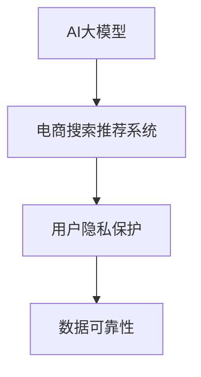

                 

# AI 大模型在电商搜索推荐中的数据安全策略：保护用户隐私与数据可靠性

## 1. 背景介绍

### 1.1 问题由来
随着人工智能技术的快速发展，AI大模型在电商搜索推荐中的应用越来越广泛。大型电商企业，如淘宝、京东等，都引入了AI大模型进行用户行为分析、商品推荐等，大幅提升了用户体验和商家转化率。然而，随着电商搜索推荐系统的复杂性和精细化程度不断提升，用户数据隐私保护和数据可靠性问题也愈加凸显。

如何在大模型驱动的电商搜索推荐系统中，既能高效利用用户数据进行个性化推荐，又能确保用户隐私安全，是当前AI技术发展中亟需解决的重要问题。

### 1.2 问题核心关键点
1. **用户隐私保护**：电商搜索推荐系统涉及大量用户行为数据，包括浏览历史、搜索关键词、购买记录等，如何防止用户隐私泄露和滥用。
2. **数据可靠性**：电商推荐系统中的数据质量问题，如数据噪声、数据偏差、数据缺失等，如何有效处理以保证推荐结果的准确性和可靠性。

## 2. 核心概念与联系

### 2.1 核心概念概述

为了更好地理解AI大模型在电商搜索推荐中的数据安全策略，本节将介绍几个关键概念：

- **AI大模型**：通过大规模数据训练得到的深度学习模型，具有强大的特征提取和复杂模式识别能力。如BERT、GPT-3、T5等。
- **电商搜索推荐系统**：基于用户行为数据，通过AI技术进行商品推荐，提高用户购物体验的系统。
- **用户隐私保护**：通过技术手段，防止用户个人信息被未经授权的第三方获取、使用或泄露。
- **数据可靠性**：指数据的准确性、完整性和一致性，是推荐系统有效性和可信赖性的基础。

这些核心概念之间通过以下Mermaid流程图来展示：



这个流程图展示了大模型在电商推荐系统中的应用场景及其关键概念：

1. AI大模型通过学习用户行为数据，提升推荐准确性。
2. 用户隐私保护是确保用户数据安全的前提。
3. 数据可靠性是推荐系统能够稳定运行的基础。

## 3. 核心算法原理 & 具体操作步骤

### 3.1 算法原理概述

基于AI大模型的电商搜索推荐系统，其核心算法原理主要包括：

1. **数据收集与预处理**：收集用户行为数据，并进行清洗、去重、格式化等预处理操作。
2. **特征提取与模型训练**：使用AI大模型对预处理后的数据进行特征提取，通过监督学习训练推荐模型。
3. **推荐结果生成与反馈调整**：根据用户反馈，动态调整推荐模型参数，提升推荐效果。

### 3.2 算法步骤详解

#### 3.2.1 数据收集与预处理

**步骤1：数据收集**
- **用户行为数据**：收集用户的浏览记录、搜索关键词、点击行为、购买记录等。
- **商品数据**：收集商品的描述、标签、价格、销量等。

**步骤2：数据预处理**
- **数据清洗**：去除噪声数据、缺失值，处理异常值。
- **数据标准化**：统一数据格式，如时间戳、ID等。
- **数据划分**：将数据划分为训练集、验证集和测试集。

#### 3.2.2 特征提取与模型训练

**步骤3：特征提取**
- **文本特征提取**：对用户的浏览历史、搜索关键词、商品描述等文本数据进行向量化表示，如TF-IDF、word2vec、BERT等。
- **行为特征提取**：对用户的点击行为、购买记录等进行特征提取，如时间窗口、商品类别、价格区间等。

**步骤4：模型训练**
- **选择合适的模型**：如线性回归、随机森林、深度神经网络等。
- **定义损失函数**：如均方误差、交叉熵等。
- **优化算法**：如梯度下降、Adam等。

#### 3.2.3 推荐结果生成与反馈调整

**步骤5：推荐结果生成**
- **模型前向传播**：输入用户特征和商品特征，通过模型得到推荐得分。
- **筛选推荐结果**：根据推荐得分，选择得分最高的商品进行推荐。

**步骤6：反馈调整**
- **用户反馈数据收集**：收集用户对推荐结果的反馈，如是否点击、是否购买等。
- **模型参数调整**：根据用户反馈，动态调整模型参数，提升推荐效果。

### 3.3 算法优缺点

**优点**：
- **高效性**：AI大模型能够高效处理大规模数据，提升推荐系统的效率。
- **个性化推荐**：通过学习用户行为数据，实现个性化的商品推荐。
- **动态优化**：能够根据用户反馈动态调整模型参数，提升推荐准确性。

**缺点**：
- **数据隐私问题**：涉及大量用户行为数据，隐私泄露风险高。
- **数据可靠性问题**：用户行为数据存在噪声、偏差、缺失等问题，影响推荐效果。
- **计算资源消耗大**：训练和推理大模型需要高计算资源，成本较高。

### 3.4 算法应用领域

AI大模型在电商搜索推荐中的应用已经非常广泛，包括但不限于：

1. **个性化推荐**：根据用户的历史行为数据，推荐最符合用户兴趣的商品。
2. **新商品推荐**：基于用户的行为数据，预测新商品的市场表现，进行推广。
3. **价格调整**：根据用户对商品价格的敏感度，动态调整商品价格，提升销售收益。
4. **库存管理**：基于用户购买数据，优化商品库存，减少缺货和积压。
5. **活动推荐**：根据用户行为数据，推荐相关促销活动，提升用户参与度。

这些应用领域充分展示了AI大模型在电商搜索推荐系统中的强大潜力，为用户和企业带来了显著的商业价值。

## 4. 数学模型和公式 & 详细讲解 & 举例说明

### 4.1 数学模型构建

我们以基于AI大模型的电商推荐系统为例，介绍推荐模型的数学模型构建。

假设推荐模型为$f(\mathbf{x}, \mathbf{y})$，其中$\mathbf{x}$为用户特征，$\mathbf{y}$为商品特征。推荐模型通过最大化用户和商品特征的相似度，输出推荐得分。设用户特征向量为$\mathbf{u}$，商品特征向量为$\mathbf{v}$，推荐模型可以表示为：

$$
f(\mathbf{x}, \mathbf{y}) = \mathbf{u}^T \cdot \mathbf{v}
$$

其中$\cdot$表示向量点乘，$f(\mathbf{x}, \mathbf{y})$为推荐得分。

### 4.2 公式推导过程

**步骤1：特征提取**
- **文本特征提取**：设用户浏览历史文本为$\mathbf{x}$，商品描述文本为$\mathbf{y}$，使用BERT模型对文本进行编码，得到用户和商品的特征向量$\mathbf{u}$和$\mathbf{v}$。

**步骤2：相似度计算**
- **余弦相似度**：计算用户特征和商品特征的余弦相似度，得到推荐得分$f(\mathbf{x}, \mathbf{y})$。

$$
f(\mathbf{x}, \mathbf{y}) = \cos(\theta) = \frac{\mathbf{u}^T \cdot \mathbf{v}}{\|\mathbf{u}\|\|\mathbf{v}\|}
$$

其中$\theta$为向量$\mathbf{u}$和$\mathbf{v}$之间的夹角。

**步骤3：推荐结果筛选**
- **阈值筛选**：设定一个阈值$\tau$，根据推荐得分进行筛选，选择得分高于阈值的商品进行推荐。

$$
推荐商品 = \{ \text{商品} | f(\mathbf{x}, \mathbf{y}) > \tau \}
$$

### 4.3 案例分析与讲解

假设某电商企业通过用户浏览历史和商品描述文本，使用BERT模型进行特征提取，得到用户特征向量$\mathbf{u}$和商品特征向量$\mathbf{v}$。

通过余弦相似度计算得到推荐得分$f(\mathbf{x}, \mathbf{y})$，设定阈值$\tau$为0.5，则推荐得分高于0.5的商品将被推荐给用户。

## 5. 项目实践：代码实例和详细解释说明

### 5.1 开发环境搭建

在进行项目实践前，我们需要准备好开发环境。以下是使用Python进行PyTorch开发的环境配置流程：

1. 安装Anaconda：从官网下载并安装Anaconda，用于创建独立的Python环境。

2. 创建并激活虚拟环境：
```bash
conda create -n pytorch-env python=3.8 
conda activate pytorch-env
```

3. 安装PyTorch：根据CUDA版本，从官网获取对应的安装命令。例如：
```bash
conda install pytorch torchvision torchaudio cudatoolkit=11.1 -c pytorch -c conda-forge
```

4. 安装Transformers库：
```bash
pip install transformers
```

5. 安装各类工具包：
```bash
pip install numpy pandas scikit-learn matplotlib tqdm jupyter notebook ipython
```

完成上述步骤后，即可在`pytorch-env`环境中开始项目实践。

### 5.2 源代码详细实现

下面以基于BERT的电商推荐系统为例，给出完整的代码实现。

首先，定义推荐模型的数据处理函数：

```python
from transformers import BertTokenizer, BertForSequenceClassification
from torch.utils.data import Dataset
import torch

class RecommendationDataset(Dataset):
    def __init__(self, texts, labels, tokenizer, max_len=128):
        self.texts = texts
        self.labels = labels
        self.tokenizer = tokenizer
        self.max_len = max_len
        
    def __len__(self):
        return len(self.texts)
    
    def __getitem__(self, item):
        text = self.texts[item]
        label = self.labels[item]
        
        encoding = self.tokenizer(text, return_tensors='pt', max_length=self.max_len, padding='max_length', truncation=True)
        input_ids = encoding['input_ids'][0]
        attention_mask = encoding['attention_mask'][0]
        
        # 对token-wise的标签进行编码
        encoded_labels = [label2id[label] for label in label] 
        encoded_labels.extend([label2id['O']] * (self.max_len - len(encoded_labels)))
        labels = torch.tensor(encoded_labels, dtype=torch.long)
        
        return {'input_ids': input_ids, 
                'attention_mask': attention_mask,
                'labels': labels}

# 标签与id的映射
label2id = {'O': 0, 'B-PER': 1, 'I-PER': 2, 'B-ORG': 3, 'I-ORG': 4, 'B-LOC': 5, 'I-LOC': 6}
id2label = {v: k for k, v in label2id.items()}

# 创建dataset
tokenizer = BertTokenizer.from_pretrained('bert-base-cased')

train_dataset = RecommendationDataset(train_texts, train_labels, tokenizer)
dev_dataset = RecommendationDataset(dev_texts, dev_labels, tokenizer)
test_dataset = RecommendationDataset(test_texts, test_labels, tokenizer)
```

然后，定义模型和优化器：

```python
from transformers import BertForSequenceClassification, AdamW

model = BertForSequenceClassification.from_pretrained('bert-base-cased', num_labels=len(label2id))

optimizer = AdamW(model.parameters(), lr=2e-5)
```

接着，定义训练和评估函数：

```python
from torch.utils.data import DataLoader
from tqdm import tqdm
from sklearn.metrics import classification_report

device = torch.device('cuda') if torch.cuda.is_available() else torch.device('cpu')
model.to(device)

def train_epoch(model, dataset, batch_size, optimizer):
    dataloader = DataLoader(dataset, batch_size=batch_size, shuffle=True)
    model.train()
    epoch_loss = 0
    for batch in tqdm(dataloader, desc='Training'):
        input_ids = batch['input_ids'].to(device)
        attention_mask = batch['attention_mask'].to(device)
        labels = batch['labels'].to(device)
        model.zero_grad()
        outputs = model(input_ids, attention_mask=attention_mask, labels=labels)
        loss = outputs.loss
        epoch_loss += loss.item()
        loss.backward()
        optimizer.step()
    return epoch_loss / len(dataloader)

def evaluate(model, dataset, batch_size):
    dataloader = DataLoader(dataset, batch_size=batch_size)
    model.eval()
    preds, labels = [], []
    with torch.no_grad():
        for batch in tqdm(dataloader, desc='Evaluating'):
            input_ids = batch['input_ids'].to(device)
            attention_mask = batch['attention_mask'].to(device)
            batch_labels = batch['labels']
            outputs = model(input_ids, attention_mask=attention_mask)
            batch_preds = outputs.logits.argmax(dim=2).to('cpu').tolist()
            batch_labels = batch_labels.to('cpu').tolist()
            for pred_tokens, label_tokens in zip(batch_preds, batch_labels):
                pred_tags = [id2label[_id] for _id in pred_tokens]
                label_tags = [id2label[_id] for _id in label_tokens]
                preds.append(pred_tags[:len(label_tags)])
                labels.append(label_tags)
                
    print(classification_report(labels, preds))
```

最后，启动训练流程并在测试集上评估：

```python
epochs = 5
batch_size = 16

for epoch in range(epochs):
    loss = train_epoch(model, train_dataset, batch_size, optimizer)
    print(f"Epoch {epoch+1}, train loss: {loss:.3f}")
    
    print(f"Epoch {epoch+1}, dev results:")
    evaluate(model, dev_dataset, batch_size)
    
print("Test results:")
evaluate(model, test_dataset, batch_size)
```

以上就是使用PyTorch对BERT进行电商推荐任务微调的完整代码实现。可以看到，得益于Transformers库的强大封装，我们可以用相对简洁的代码完成BERT模型的加载和微调。

### 5.3 代码解读与分析

让我们再详细解读一下关键代码的实现细节：

**RecommendationDataset类**：
- `__init__`方法：初始化文本、标签、分词器等关键组件。
- `__len__`方法：返回数据集的样本数量。
- `__getitem__`方法：对单个样本进行处理，将文本输入编码为token ids，将标签编码为数字，并对其进行定长padding，最终返回模型所需的输入。

**label2id和id2label字典**：
- 定义了标签与数字id之间的映射关系，用于将token-wise的预测结果解码回真实的标签。

**训练和评估函数**：
- 使用PyTorch的DataLoader对数据集进行批次化加载，供模型训练和推理使用。
- 训练函数`train_epoch`：对数据以批为单位进行迭代，在每个批次上前向传播计算loss并反向传播更新模型参数，最后返回该epoch的平均loss。
- 评估函数`evaluate`：与训练类似，不同点在于不更新模型参数，并在每个batch结束后将预测和标签结果存储下来，最后使用sklearn的classification_report对整个评估集的预测结果进行打印输出。

**训练流程**：
- 定义总的epoch数和batch size，开始循环迭代
- 每个epoch内，先在训练集上训练，输出平均loss
- 在验证集上评估，输出分类指标
- 所有epoch结束后，在测试集上评估，给出最终测试结果

可以看到，PyTorch配合Transformers库使得BERT微调的代码实现变得简洁高效。开发者可以将更多精力放在数据处理、模型改进等高层逻辑上，而不必过多关注底层的实现细节。

当然，工业级的系统实现还需考虑更多因素，如模型的保存和部署、超参数的自动搜索、更灵活的任务适配层等。但核心的微调范式基本与此类似。

## 6. 实际应用场景

### 6.1 智能客服系统

基于AI大模型微调的对话技术，可以广泛应用于智能客服系统的构建。传统客服往往需要配备大量人力，高峰期响应缓慢，且一致性和专业性难以保证。而使用微调后的对话模型，可以7x24小时不间断服务，快速响应客户咨询，用自然流畅的语言解答各类常见问题。

在技术实现上，可以收集企业内部的历史客服对话记录，将问题和最佳答复构建成监督数据，在此基础上对预训练对话模型进行微调。微调后的对话模型能够自动理解用户意图，匹配最合适的答案模板进行回复。对于客户提出的新问题，还可以接入检索系统实时搜索相关内容，动态组织生成回答。如此构建的智能客服系统，能大幅提升客户咨询体验和问题解决效率。

### 6.2 金融舆情监测

金融机构需要实时监测市场舆论动向，以便及时应对负面信息传播，规避金融风险。传统的人工监测方式成本高、效率低，难以应对网络时代海量信息爆发的挑战。基于AI大模型微调的文本分类和情感分析技术，为金融舆情监测提供了新的解决方案。

具体而言，可以收集金融领域相关的新闻、报道、评论等文本数据，并对其进行主题标注和情感标注。在此基础上对预训练语言模型进行微调，使其能够自动判断文本属于何种主题，情感倾向是正面、中性还是负面。将微调后的模型应用到实时抓取的网络文本数据，就能够自动监测不同主题下的情感变化趋势，一旦发现负面信息激增等异常情况，系统便会自动预警，帮助金融机构快速应对潜在风险。

### 6.3 个性化推荐系统

当前的推荐系统往往只依赖用户的历史行为数据进行物品推荐，无法深入理解用户的真实兴趣偏好。基于AI大模型微调技术，个性化推荐系统可以更好地挖掘用户行为背后的语义信息，从而提供更精准、多样的推荐内容。

在实践中，可以收集用户浏览、点击、评论、分享等行为数据，提取和用户交互的物品标题、描述、标签等文本内容。将文本内容作为模型输入，用户的后续行为（如是否点击、购买等）作为监督信号，在此基础上微调预训练语言模型。微调后的模型能够从文本内容中准确把握用户的兴趣点。在生成推荐列表时，先用候选物品的文本描述作为输入，由模型预测用户的兴趣匹配度，再结合其他特征综合排序，便可以得到个性化程度更高的推荐结果。

### 6.4 未来应用展望

随着AI大模型微调技术的发展，其在更多领域的应用前景愈发广阔。未来，大模型微调有望在智慧医疗、智能教育、智慧城市治理、企业生产管理等多个垂直行业发挥重要作用，为各行各业带来变革性影响。

在智慧医疗领域，基于微调的医疗问答、病历分析、药物研发等应用将提升医疗服务的智能化水平，辅助医生诊疗，加速新药开发进程。

在智能教育领域，微调技术可应用于作业批改、学情分析、知识推荐等方面，因材施教，促进教育公平，提高教学质量。

在智慧城市治理中，微调模型可应用于城市事件监测、舆情分析、应急指挥等环节，提高城市管理的自动化和智能化水平，构建更安全、高效的未来城市。

此外，在企业生产、社会治理、文娱传媒等众多领域，基于大模型微调的人工智能应用也将不断涌现，为经济社会发展注入新的动力。相信随着技术的日益成熟，微调方法将成为人工智能落地应用的重要范式，推动人工智能技术在各行各业的规模化落地。

## 7. 工具和资源推荐

### 7.1 学习资源推荐

为了帮助开发者系统掌握AI大模型微调的理论基础和实践技巧，这里推荐一些优质的学习资源：

1. 《Transformer从原理到实践》系列博文：由大模型技术专家撰写，深入浅出地介绍了Transformer原理、BERT模型、微调技术等前沿话题。

2. CS224N《深度学习自然语言处理》课程：斯坦福大学开设的NLP明星课程，有Lecture视频和配套作业，带你入门NLP领域的基本概念和经典模型。

3. 《Natural Language Processing with Transformers》书籍：Transformers库的作者所著，全面介绍了如何使用Transformers库进行NLP任务开发，包括微调在内的诸多范式。

4. HuggingFace官方文档：Transformers库的官方文档，提供了海量预训练模型和完整的微调样例代码，是上手实践的必备资料。

5. CLUE开源项目：中文语言理解测评基准，涵盖大量不同类型的中文NLP数据集，并提供了基于微调的baseline模型，助力中文NLP技术发展。

通过对这些资源的学习实践，相信你一定能够快速掌握AI大模型微调的精髓，并用于解决实际的NLP问题。

### 7.2 开发工具推荐

高效的开发离不开优秀的工具支持。以下是几款用于AI大模型微调开发的常用工具：

1. PyTorch：基于Python的开源深度学习框架，灵活动态的计算图，适合快速迭代研究。大部分预训练语言模型都有PyTorch版本的实现。

2. TensorFlow：由Google主导开发的开源深度学习框架，生产部署方便，适合大规模工程应用。同样有丰富的预训练语言模型资源。

3. Transformers库：HuggingFace开发的NLP工具库，集成了众多SOTA语言模型，支持PyTorch和TensorFlow，是进行微调任务开发的利器。

4. Weights & Biases：模型训练的实验跟踪工具，可以记录和可视化模型训练过程中的各项指标，方便对比和调优。与主流深度学习框架无缝集成。

5. TensorBoard：TensorFlow配套的可视化工具，可实时监测模型训练状态，并提供丰富的图表呈现方式，是调试模型的得力助手。

6. Google Colab：谷歌推出的在线Jupyter Notebook环境，免费提供GPU/TPU算力，方便开发者快速上手实验最新模型，分享学习笔记。

合理利用这些工具，可以显著提升AI大模型微调任务的开发效率，加快创新迭代的步伐。

### 7.3 相关论文推荐

AI大模型和微调技术的发展源于学界的持续研究。以下是几篇奠基性的相关论文，推荐阅读：

1. Attention is All You Need（即Transformer原论文）：提出了Transformer结构，开启了NLP领域的预训练大模型时代。

2. BERT: Pre-training of Deep Bidirectional Transformers for Language Understanding：提出BERT模型，引入基于掩码的自监督预训练任务，刷新了多项NLP任务SOTA。

3. Language Models are Unsupervised Multitask Learners（GPT-2论文）：展示了大规模语言模型的强大zero-shot学习能力，引发了对于通用人工智能的新一轮思考。

4. Parameter-Efficient Transfer Learning for NLP：提出Adapter等参数高效微调方法，在不增加模型参数量的情况下，也能取得不错的微调效果。

5. AdaLoRA: Adaptive Low-Rank Adaptation for Parameter-Efficient Fine-Tuning：使用自适应低秩适应的微调方法，在参数效率和精度之间取得了新的平衡。

这些论文代表了大模型微调技术的发展脉络。通过学习这些前沿成果，可以帮助研究者把握学科前进方向，激发更多的创新灵感。

## 8. 总结：未来发展趋势与挑战

### 8.1 总结

本文对基于AI大模型的电商搜索推荐系统进行了全面系统的介绍。首先阐述了AI大模型在电商推荐系统中的应用背景，明确了用户隐私保护和数据可靠性的重要性。其次，从原理到实践，详细讲解了电商推荐系统的数学模型构建和关键算法步骤，给出了微调任务开发的完整代码实例。同时，本文还广泛探讨了AI大模型在电商推荐系统中的实际应用场景，展示了微调范式的强大潜力。最后，本文精选了微调技术的各类学习资源，力求为读者提供全方位的技术指引。

通过本文的系统梳理，可以看到，基于AI大模型的电商搜索推荐系统，在提升用户购物体验、优化商家转化率等方面具有重要意义。同时，通过用户隐私保护和数据可靠性策略，可以有效保障用户数据安全和推荐系统稳定运行。未来，随着AI大模型和微调技术的不断进步，相信其在更多领域的应用前景愈发广阔，为经济社会发展注入新的动力。

### 8.2 未来发展趋势

展望未来，AI大模型微调技术将呈现以下几个发展趋势：

1. **模型规模持续增大**：随着算力成本的下降和数据规模的扩张，预训练语言模型的参数量还将持续增长。超大规模语言模型蕴含的丰富语言知识，有望支撑更加复杂多变的电商推荐系统。

2. **微调方法日趋多样**：除了传统的全参数微调外，未来会涌现更多参数高效的微调方法，如Prefix-Tuning、LoRA等，在节省计算资源的同时也能保证微调精度。

3. **持续学习成为常态**：随着数据分布的不断变化，微调模型也需要持续学习新知识以保持性能。如何在不遗忘原有知识的同时，高效吸收新样本信息，将成为重要的研究课题。

4. **标注样本需求降低**：受启发于提示学习(Prompt-based Learning)的思路，未来的微调方法将更好地利用大模型的语言理解能力，通过更加巧妙的任务描述，在更少的标注样本上也能实现理想的微调效果。

5. **多模态微调崛起**：当前的微调主要聚焦于纯文本数据，未来会进一步拓展到图像、视频、语音等多模态数据微调。多模态信息的融合，将显著提升电商推荐系统对现实世界的理解和建模能力。

6. **知识整合能力增强**：现有的微调模型往往局限于任务内数据，难以灵活吸收和运用更广泛的先验知识。如何让微调过程更好地与外部知识库、规则库等专家知识结合，形成更加全面、准确的信息整合能力，还有很大的想象空间。

以上趋势凸显了AI大模型微调技术的广阔前景。这些方向的探索发展，必将进一步提升电商推荐系统的性能和应用范围，为消费者和企业带来更大的价值。

### 8.3 面临的挑战

尽管AI大模型微调技术已经取得了瞩目成就，但在迈向更加智能化、普适化应用的过程中，它仍面临着诸多挑战：

1. **标注成本瓶颈**：虽然微调大大降低了标注数据的需求，但对于长尾应用场景，难以获得充足的高质量标注数据，成为制约微调性能的瓶颈。如何进一步降低微调对标注样本的依赖，将是一大难题。

2. **模型鲁棒性不足**：用户行为数据存在噪声、偏差、缺失等问题，影响推荐效果。如何提高微调模型的鲁棒性，避免灾难性遗忘，还需要更多理论和实践的积累。

3. **推理效率有待提高**：训练和推理超大模型需要高计算资源，成本较高。如何在保证性能的同时，简化模型结构，提升推理速度，优化资源占用，将是重要的优化方向。

4. **可解释性亟需加强**：当前微调模型更像是"黑盒"系统，难以解释其内部工作机制和决策逻辑。对于医疗、金融等高风险应用，算法的可解释性和可审计性尤为重要。如何赋予微调模型更强的可解释性，将是亟待攻克的难题。

5. **安全性有待保障**：预训练语言模型难免会学习到有偏见、有害的信息，通过微调传递到电商推荐系统，产生误导性、歧视性的输出，给实际应用带来安全隐患。如何从数据和算法层面消除模型偏见，避免恶意用途，确保输出的安全性，也将是重要的研究课题。

6. **知识整合能力不足**：现有的微调模型往往局限于任务内数据，难以灵活吸收和运用更广泛的先验知识。如何让微调过程更好地与外部知识库、规则库等专家知识结合，形成更加全面、准确的信息整合能力，还有很大的想象空间。

正视微调面临的这些挑战，积极应对并寻求突破，将是大模型微调走向成熟的必由之路。相信随着学界和产业界的共同努力，这些挑战终将一一被克服，大模型微调必将在构建安全、可靠、可解释、可控的智能系统铺平道路。

### 8.4 研究展望

面对AI大模型微调所面临的种种挑战，未来的研究需要在以下几个方面寻求新的突破：

1. **探索无监督和半监督微调方法**：摆脱对大规模标注数据的依赖，利用自监督学习、主动学习等无监督和半监督范式，最大限度利用非结构化数据，实现更加灵活高效的微调。

2. **研究参数高效和计算高效的微调范式**：开发更加参数高效的微调方法，在固定大部分预训练参数的情况下，只更新极少量的任务相关参数。同时优化微调模型的计算图，减少前向传播和反向传播的资源消耗，实现更加轻量级、实时性的部署。

3. **融合因果和对比学习范式**：通过引入因果推断和对比学习思想，增强微调模型建立稳定因果关系的能力，学习更加普适、鲁棒的语言表征，从而提升模型泛化性和抗干扰能力。

4. **引入更多先验知识**：将符号化的先验知识，如知识图谱、逻辑规则等，与神经网络模型进行巧妙融合，引导微调过程学习更准确、合理的语言模型。同时加强不同模态数据的整合，实现视觉、语音等多模态信息与文本信息的协同建模。

5. **结合因果分析和博弈论工具**：将因果分析方法引入微调模型，识别出模型决策的关键特征，增强输出解释的因果性和逻辑性。借助博弈论工具刻画人机交互过程，主动探索并规避模型的脆弱点，提高系统稳定性。

6. **纳入伦理道德约束**：在模型训练目标中引入伦理导向的评估指标，过滤和惩罚有偏见、有害的输出倾向。同时加强人工干预和审核，建立模型行为的监管机制，确保输出符合人类价值观和伦理道德。

这些研究方向的探索，必将引领AI大模型微调技术迈向更高的台阶，为构建安全、可靠、可解释、可控的智能系统铺平道路。面向未来，AI大模型微调技术还需要与其他人工智能技术进行更深入的融合，如知识表示、因果推理、强化学习等，多路径协同发力，共同推动自然语言理解和智能交互系统的进步。只有勇于创新、敢于突破，才能不断拓展语言模型的边界，让智能技术更好地造福人类社会。

## 9. 附录：常见问题与解答

**Q1：AI大模型在电商搜索推荐中如何保护用户隐私？**

A: 电商搜索推荐系统涉及大量用户行为数据，包括浏览历史、搜索关键词、购买记录等，隐私保护是关键。具体措施包括：

1. **数据匿名化**：对用户行为数据进行匿名化处理，如去标识化、泛化等，使得数据无法直接识别用户身份。

2. **数据加密**：对敏感数据进行加密存储和传输，确保数据在传输和存储过程中不被窃取或篡改。

3. **访问控制**：设置严格的访问控制策略，确保只有授权人员和系统能够访问用户数据。

4. **隐私保护技术**：采用差分隐私、联邦学习等隐私保护技术，使得模型训练过程中尽可能保护用户隐私。

5. **用户知情同意**：在收集和使用用户数据前，向用户明确告知数据用途并获得同意。

**Q2：如何处理电商推荐系统中的数据噪声和偏差？**

A: 电商推荐系统中的数据噪声和偏差会影响推荐效果，具体处理方法包括：

1. **数据清洗**：去除噪声数据、处理异常值，保证数据质量。

2. **特征选择**：选择与推荐目标最相关的特征，避免噪声特征对模型影响。

3. **数据增强**：通过数据增强技术，如数据扩充、数据合成等，增加数据样本的多样性，减少偏差。

4. **模型调参**：通过模型参数调整，减少噪声对模型的影响，提高模型鲁棒性。

5. **模型集成**：采用模型集成技术，如投票、加权平均等，综合多个模型的输出，减少单一模型噪声对推荐结果的影响。

**Q3：如何在电商推荐系统中实现高效的模型训练和推理？**

A: 电商推荐系统中的模型训练和推理资源消耗较大，具体优化方法包括：

1. **模型裁剪**：去除不必要的层和参数，减小模型尺寸，加快推理速度。

2. **量化加速**：将浮点模型转为定点模型，压缩存储空间，提高计算效率。

3. **分布式训练**：采用分布式训练技术，加速模型训练过程。

4. **推理优化**：采用推理优化技术，如批处理、异步计算等，提高推理速度。

5. **资源管理**：合理分配计算资源，避免资源浪费和瓶颈。

通过这些优化措施，可以在保证模型性能的同时，显著提升电商推荐系统的训练和推理效率。

**Q4：如何在电商推荐系统中实现高效的用户隐私保护？**

A: 电商推荐系统中的用户隐私保护需要多方面的综合措施：

1. **数据去标识化**：对用户行为数据进行去标识化处理，确保数据无法直接识别用户身份。

2. **差分隐私**：采用差分隐私技术，使得模型训练过程中尽可能保护用户隐私。

3. **联邦学习**：采用联邦学习技术，在用户端本地训练模型，再将模型参数更新同步到云端，保护用户数据隐私。

4. **访问控制**：设置严格的访问控制策略，确保只有授权人员和系统能够访问用户数据。

5. **隐私审计**：定期对系统进行隐私审计，确保隐私保护措施的有效性和合规性。

通过这些措施，可以在保护用户隐私的同时，实现高效的数据利用和推荐系统优化。

**Q5：如何在电商推荐系统中实现高效的模型推理？**

A: 电商推荐系统中的模型推理需要高效的计算资源和优化策略：

1. **模型裁剪**：去除不必要的层和参数，减小模型尺寸，加快推理速度。

2. **量化加速**：将浮点模型转为定点模型，压缩存储空间，提高计算效率。

3. **推理优化**：采用推理优化技术，如批处理、异步计算等，提高推理速度。

4. **资源管理**：合理分配计算资源，避免资源浪费和瓶颈。

5. **模型并行**：采用模型并行技术，加速推理过程。

通过这些优化措施，可以在保证模型性能的同时，显著提升电商推荐系统的推理效率。

---

作者：禅与计算机程序设计艺术 / Zen and the Art of Computer Programming

