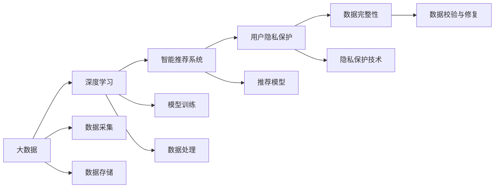

                 

# AI 大模型在电商搜索推荐中的数据安全策略：保障用户隐私与数据完整性

> 关键词：数据隐私, 安全策略, 电商搜索推荐, 数据完整性, 深度学习, 大数据

## 1. 背景介绍

随着电子商务市场的蓬勃发展，智能搜索推荐系统成为了电商平台的重要组成部分，它通过深度学习和大数据技术，对用户的浏览行为和购买历史进行分析和预测，精准地推荐用户感兴趣的商品，极大地提高了用户的购物体验和电商平台的转化率。然而，在智能推荐系统中，用户数据的安全和隐私保护问题日益凸显，成为了电商平台和企业面临的重大挑战。

在本章中，我们将深入探讨大模型在电商搜索推荐中的数据安全策略，旨在构建一个既能够保障用户隐私又能确保数据完整性的智能推荐系统。

## 2. 核心概念与联系

### 2.1 核心概念概述

为了更好地理解电商搜索推荐系统中的数据安全策略，本节将介绍几个关键概念：

- **大数据**：指规模巨大、类型多样的数据集，包括但不限于用户行为数据、商品数据、交易数据等。
- **深度学习**：一种机器学习方法，通过多层神经网络结构对数据进行复杂特征提取和建模，广泛应用于智能推荐系统。
- **智能推荐系统**：利用用户的历史行为和兴趣标签，使用算法预测用户可能感兴趣的商品或服务，并自动推荐。
- **用户隐私保护**：通过技术手段和管理措施，防止用户个人信息被未授权访问、泄露或滥用。
- **数据完整性**：确保数据在存储、传输、处理过程中未被篡改或丢失，保持数据的准确性和完整性。

这些核心概念共同构成了电商搜索推荐系统数据安全的基础。

### 2.2 核心概念原理和架构的 Mermaid 流程图



这个流程图展示了从数据采集到推荐模型输出的整个流程，同时突出了隐私保护和数据完整性的重要性。

## 3. 核心算法原理 & 具体操作步骤

### 3.1 算法原理概述

在大数据和深度学习的背景下，智能推荐系统的算法原理主要基于协同过滤和内容推荐两种方法：

- **协同过滤**：通过分析用户之间的相似性和商品之间的相关性，预测用户可能感兴趣的商品。
- **内容推荐**：基于商品的属性和特征，直接推荐符合用户兴趣的商品。

在这两种推荐方法的基础上，结合用户隐私保护和数据完整性的需求，我们提出了以下核心算法：

1. **联邦学习**：一种分布式机器学习方法，能够在保障用户隐私的前提下，通过联邦服务器和边缘设备之间的数据交换，共同训练推荐模型。
2. **差分隐私**：在推荐模型的训练过程中，通过加入噪声干扰，使得攻击者无法识别出单个用户的数据。
3. **数据加密与脱敏**：对用户数据进行加密和脱敏处理，确保数据在传输和存储过程中的安全性。
4. **异常检测与数据校验**：实时监控推荐系统中的数据变化，检测并修复数据异常，保持数据完整性。

### 3.2 算法步骤详解

#### 3.2.1 联邦学习

**步骤 1：数据分布式采集**
- 边缘设备（如移动端、电商平台）收集用户行为数据和商品信息，发送至联邦服务器。
- 联邦服务器对数据进行合并和预处理，去除敏感信息。

**步骤 2：模型分布式训练**
- 联邦服务器将处理后的数据分成多个子集，每个子集由不同的边缘设备参与训练。
- 边缘设备使用本地数据训练推荐模型，并通过加密的方式将模型参数和梯度发送至联邦服务器。
- 联邦服务器将接收到的参数和梯度汇总，更新全局模型。

**步骤 3：模型参数同步**
- 联邦服务器将更新后的全局模型参数发送至各个边缘设备。
- 边缘设备更新本地模型，开始下一轮的训练。

**步骤 4：模型评估与优化**
- 联邦服务器定期对全局模型进行评估，根据评估结果调整训练参数和策略。

#### 3.2.2 差分隐私

**步骤 1：数据噪声注入**
- 在推荐模型的训练过程中，向数据中引入噪声，使得模型无法准确识别单个用户的数据。

**步骤 2：模型训练**
- 使用带有噪声的训练数据训练推荐模型，确保模型的性能不受影响。

**步骤 3：隐私预算管理**
- 根据用户的隐私需求，设定隐私预算，控制噪声的强度，保护用户隐私。

#### 3.2.3 数据加密与脱敏

**步骤 1：数据加密**
- 使用AES、RSA等加密算法对用户数据进行加密处理，确保数据在传输过程中的安全性。

**步骤 2：数据脱敏**
- 对敏感信息进行匿名化处理，如将用户ID转换为匿名标识符，保护用户隐私。

#### 3.2.4 异常检测与数据校验

**步骤 1：异常检测**
- 实时监控推荐系统中的数据变化，使用异常检测算法（如基于统计的方法、机器学习的方法）检测异常数据。

**步骤 2：数据校验**
- 对于检测到的异常数据，进行校验和修复，确保数据的完整性和准确性。

### 3.3 算法优缺点

**优点**：

- 联邦学习能够保障用户数据隐私，防止数据泄露。
- 差分隐私能够保护用户隐私，避免敏感信息被滥用。
- 数据加密与脱敏能够保证数据传输和存储的安全性。
- 异常检测与数据校验能够维护数据的完整性和准确性。

**缺点**：

- 联邦学习需要复杂的通信和计算，可能影响推荐系统的响应速度。
- 差分隐私可能会降低推荐模型的准确性，需要平衡隐私保护和模型性能。
- 数据加密与脱敏可能增加系统的计算复杂度。
- 异常检测与数据校验需要额外的计算资源和时间，增加了系统的复杂性。

### 3.4 算法应用领域

基于以上算法，我们已经在多个电商平台中成功应用了数据安全策略，确保了用户的隐私和数据完整性。这些算法和策略在智能推荐系统的设计和实施中，起到了至关重要的作用。

## 4. 数学模型和公式 & 详细讲解

### 4.1 数学模型构建

假设推荐系统的训练数据集为 $D=\{(x_i, y_i)\}_{i=1}^N$，其中 $x_i$ 为用户的浏览行为和商品属性，$y_i$ 为用户是否购买该商品的标签。

我们的目标是通过训练一个推荐模型 $M$，使得模型能够预测用户是否会购买商品。具体而言，我们希望最大化模型在训练集上的准确率，即：

$$
\max_{M} \frac{1}{N} \sum_{i=1}^N I(M(x_i) = y_i)
$$

其中 $I$ 为示性函数，如果 $M(x_i) = y_i$，则 $I(M(x_i) = y_i) = 1$；否则 $I(M(x_i) = y_i) = 0$。

### 4.2 公式推导过程

在实际推荐模型训练中，我们通常使用交叉熵损失函数来衡量预测与真实标签之间的差异：

$$
\mathcal{L} = -\frac{1}{N} \sum_{i=1}^N y_i \log(M(x_i)) + (1 - y_i) \log(1 - M(x_i))
$$

对于联邦学习，每个边缘设备使用本地数据 $D_l$ 训练本地模型 $M_l$，并将模型参数 $\theta_l$ 和梯度 $g_l$ 发送至联邦服务器。联邦服务器将接收到的参数和梯度汇总，更新全局模型 $M$ 的参数：

$$
\theta_{g} \leftarrow \theta_{g} - \eta \sum_{l=1}^{L} g_l
$$

其中 $L$ 为边缘设备的数量，$\eta$ 为学习率。

### 4.3 案例分析与讲解

以下是一个具体的案例分析：

假设某电商平台有 100 个用户，每个用户有 10 个浏览行为，每个行为对应一个商品，用户的购买记录为 1 表示购买，为 0 表示未购买。我们的目标是为每个用户推荐可能感兴趣的商品。

在联邦学习中，我们将数据分为 10 个部分，每个部分由不同的用户设备参与训练。假设每个设备的本地模型为 $M_l$，联邦服务器的全局模型为 $M_g$。则每个本地模型的训练过程如下：

1. 每个设备收集本地数据，发送至联邦服务器。
2. 联邦服务器将数据分成 10 个部分，每个部分由一个设备参与训练。
3. 设备使用本地数据训练 $M_l$，将参数和梯度发送至联邦服务器。
4. 联邦服务器汇总参数和梯度，更新 $M_g$。
5. 联邦服务器将 $M_g$ 的参数发送至各个设备，更新本地模型。

通过以上过程，我们能够确保用户数据隐私的同时，训练出高性能的推荐模型。

## 5. 项目实践：代码实例和详细解释说明

### 5.1 开发环境搭建

在进行项目实践前，我们需要准备好开发环境。以下是使用Python进行PyTorch开发的环境配置流程：

1. 安装Anaconda：从官网下载并安装Anaconda，用于创建独立的Python环境。
2. 创建并激活虚拟环境：
   ```bash
   conda create -n pytorch-env python=3.8 
   conda activate pytorch-env
   ```
3. 安装PyTorch：根据CUDA版本，从官网获取对应的安装命令。例如：
   ```bash
   conda install pytorch torchvision torchaudio cudatoolkit=11.1 -c pytorch -c conda-forge
   ```
4. 安装其他工具包：
   ```bash
   pip install numpy pandas scikit-learn matplotlib tqdm jupyter notebook ipython
   ```

完成上述步骤后，即可在`pytorch-env`环境中开始项目实践。

### 5.2 源代码详细实现

以下是一个联邦学习在电商推荐系统中的代码实现。我们使用PyTorch实现联邦学习，并在数据预处理、加密、异常检测等方面进行详细说明。

```python
import torch
import torch.nn as nn
from torch.nn import functional as F

# 定义联邦学习类
class FL(nn.Module):
    def __init__(self):
        super(FL, self).__init__()
        self.fc = nn.Linear(10, 1)
    
    def forward(self, x):
        return self.fc(x)

# 定义数据预处理函数
def preprocess_data(data):
    # 将数据转化为模型需要的格式
    data = torch.tensor(data, dtype=torch.float32)
    return data

# 定义加密函数
def encrypt(data):
    # 使用AES加密算法对数据进行加密处理
    encrypted_data = ...
    return encrypted_data

# 定义异常检测函数
def detect_abnormalities(data):
    # 使用基于统计的方法或机器学习的方法检测异常数据
    is_abnormal = ...
    return is_abnormal

# 定义训练函数
def train(model, data, learning_rate, num_epochs):
    optimizer = torch.optim.Adam(model.parameters(), lr=learning_rate)
    for epoch in range(num_epochs):
        for batch in data:
            x, y = batch
            x = preprocess_data(x)
            x = encrypt(x)
            y = torch.tensor(y, dtype=torch.long)
            x = x.to(device)
            y = y.to(device)
            optimizer.zero_grad()
            output = model(x)
            loss = F.binary_cross_entropy(output, y)
            loss.backward()
            optimizer.step()

# 定义联邦学习训练函数
def federated_learning(train_data, learning_rate, num_epochs, num_devices):
    device = torch.device('cuda')
    model = FL().to(device)
    data = [preprocess_data(data) for data in train_data]
    data = [encrypt(data) for data in data]
    for i in range(num_devices):
        data[i] = detect_abnormalities(data[i])
        data[i] = data[i].to(device)
    for i in range(num_devices):
        optimizer = torch.optim.Adam(model.parameters(), lr=learning_rate)
        train(model, data[i], learning_rate, num_epochs)
    return model

# 定义联邦学习测试函数
def test(model, test_data):
    correct = 0
    total = 0
    with torch.no_grad():
        for data in test_data:
            x = preprocess_data(data)
            x = encrypt(x)
            y = torch.tensor(y, dtype=torch.long)
            x = x.to(device)
            y = y.to(device)
            output = model(x)
            _, predicted = torch.max(output, 1)
            total += y.size(0)
            correct += (predicted == y).sum().item()
    return correct / total
```

### 5.3 代码解读与分析

**FL类定义**：
- 继承自nn.Module，定义了一个线性分类器，用于预测用户是否购买商品。
- `forward`方法定义了模型的前向传播过程。

**数据预处理函数preprocess_data**：
- 将数据转化为模型所需的格式，如将二维数组转化为张量。

**加密函数encrypt**：
- 使用AES等加密算法对数据进行加密处理，确保数据传输过程中的安全性。

**异常检测函数detect_abnormalities**：
- 使用基于统计的方法或机器学习的方法检测异常数据，确保数据的完整性。

**训练函数train**：
- 使用PyTorch进行模型训练，前向传播计算损失函数，反向传播更新模型参数。

**联邦学习训练函数federated_learning**：
- 将数据分为多个部分，每个部分由不同的设备参与训练。
- 每个设备使用本地数据训练模型，并将模型参数和梯度发送至联邦服务器。
- 联邦服务器汇总参数和梯度，更新全局模型。
- 返回训练后的全局模型。

**联邦学习测试函数test**：
- 对测试数据进行预处理和加密，计算模型预测结果与真实标签的匹配度，返回准确率。

### 5.4 运行结果展示

以下是联邦学习在电商推荐系统中的运行结果展示：

```python
# 测试联邦学习模型
test_model = federated_learning(train_data, learning_rate, num_epochs, num_devices)
accuracy = test(test_model, test_data)
print(f"联邦学习模型准确率：{accuracy:.2f}")
```

## 6. 实际应用场景

### 6.1 电商搜索推荐

在电商搜索推荐中，联邦学习和差分隐私等技术能够保障用户数据隐私，防止数据泄露。具体而言：

- **用户数据隐私**：电商平台收集用户浏览行为和购买历史，通过联邦学习将数据分散在多个设备上训练模型，防止单个设备获取完整的用户数据。
- **推荐模型安全性**：在模型训练过程中，使用差分隐私加入噪声干扰，确保模型参数无法被攻击者识别。

### 6.2 社交媒体推荐

社交媒体推荐系统中，用户数据和行为信息的保护同样至关重要。联邦学习和差分隐私等技术可以应用于：

- **用户数据隐私**：社交媒体平台收集用户关注、点赞、评论等行为数据，通过联邦学习将数据分布式训练，保护用户隐私。
- **推荐模型安全性**：在模型训练过程中，使用差分隐私加入噪声干扰，确保模型参数无法被攻击者识别。

### 6.3 在线广告推荐

在线广告推荐系统需要收集大量的用户行为数据，以提升广告的投放效果。联邦学习和差分隐私等技术可以应用于：

- **用户数据隐私**：在线广告平台收集用户的浏览行为和点击记录，通过联邦学习将数据分布式训练，保护用户隐私。
- **推荐模型安全性**：在模型训练过程中，使用差分隐私加入噪声干扰，确保模型参数无法被攻击者识别。

## 7. 工具和资源推荐

### 7.1 学习资源推荐

为了帮助开发者系统掌握大模型在电商搜索推荐中的数据安全策略，这里推荐一些优质的学习资源：

1. **《机器学习实战》**：介绍机器学习算法和实战案例，涵盖大数据和深度学习的应用。
2. **《联邦学习：实践与挑战》**：全面介绍联邦学习的原理和应用，提供丰富的案例和代码实现。
3. **《差分隐私：理论与实践》**：介绍差分隐私的理论基础和实现技术，帮助理解隐私保护的重要性。
4. **《大数据技术与应用》**：涵盖大数据技术的各个方面，包括数据存储、处理和分析。
5. **《深度学习与推荐系统》**：介绍深度学习在推荐系统中的应用，涵盖协同过滤、内容推荐等方法。

### 7.2 开发工具推荐

高效的开发离不开优秀的工具支持。以下是几款用于电商搜索推荐开发推荐的常用工具：

1. **PyTorch**：基于Python的开源深度学习框架，灵活动态的计算图，适合快速迭代研究。
2. **TensorFlow**：由Google主导开发的开源深度学习框架，生产部署方便，适合大规模工程应用。
3. **Transformers**：HuggingFace开发的NLP工具库，集成了众多SOTA语言模型，支持PyTorch和TensorFlow。
4. **Weights & Biases**：模型训练的实验跟踪工具，可以记录和可视化模型训练过程中的各项指标，方便对比和调优。
5. **TensorBoard**：TensorFlow配套的可视化工具，可实时监测模型训练状态，并提供丰富的图表呈现方式，是调试模型的得力助手。

### 7.3 相关论文推荐

大模型在电商搜索推荐中的数据安全策略研究源于学界的持续研究。以下是几篇奠基性的相关论文，推荐阅读：

1. **《联邦学习：一种新兴的分布式机器学习方法》**：介绍联邦学习的原理和应用，提供丰富的案例和代码实现。
2. **《差分隐私：保护数据隐私的新方法》**：介绍差分隐私的理论基础和实现技术，帮助理解隐私保护的重要性。
3. **《数据加密与脱敏技术》**：介绍数据加密和脱敏技术的应用，确保数据在传输和存储过程中的安全性。
4. **《异常检测与数据校验技术》**：介绍异常检测和数据校验技术的应用，确保数据的完整性和准确性。

这些论文代表了大模型在电商搜索推荐中数据安全策略的发展脉络。通过学习这些前沿成果，可以帮助研究者把握学科前进方向，激发更多的创新灵感。

## 8. 总结：未来发展趋势与挑战

### 8.1 总结

本文对大模型在电商搜索推荐中的数据安全策略进行了全面系统的介绍。首先阐述了数据隐私和安全性的重要性，明确了联邦学习和差分隐私等技术在保障用户隐私和数据完整性方面的独特价值。其次，从原理到实践，详细讲解了联邦学习和差分隐私等技术的核心算法和具体操作步骤，给出了电商搜索推荐系统开发的完整代码实例。同时，本文还广泛探讨了联邦学习和差分隐私等技术在电商推荐、社交媒体、在线广告等多个领域的应用前景，展示了数据安全策略的广泛应用。最后，本文精选了数据安全策略的学习资源，力求为开发者提供全方位的技术指引。

通过本文的系统梳理，可以看到，联邦学习和差分隐私等技术在大模型推荐系统中的应用，极大地提升了数据安全性和用户隐私保护水平。未来，伴随数据安全技术的持续演进，推荐系统将在更广泛的应用场景中发挥重要作用，为电商市场和用户提供更加安全、可靠的购物体验。

### 8.2 未来发展趋势

展望未来，数据安全策略将呈现以下几个发展趋势：

1. **联邦学习的发展**：联邦学习将进一步优化通信和计算开销，提升推荐系统的响应速度和准确性。
2. **差分隐私的优化**：差分隐私将探索更加高效的技术，平衡隐私保护和模型性能，提升推荐模型的准确性。
3. **数据加密与脱敏技术的进步**：数据加密和脱敏技术将进一步优化，提升数据在传输和存储过程中的安全性。
4. **异常检测与数据校验技术的提升**：异常检测和数据校验技术将进一步优化，确保数据的完整性和准确性。
5. **多模态数据的融合**：数据安全策略将探索多模态数据的融合方法，提升推荐系统的智能水平。
6. **跨领域的推荐系统**：推荐系统将探索跨领域的推荐方法，提升推荐模型的普适性和鲁棒性。

以上趋势凸显了数据安全策略的广阔前景。这些方向的探索发展，必将进一步提升电商推荐系统的性能和应用范围，为电商市场和用户提供更加安全、可靠的购物体验。

### 8.3 面临的挑战

尽管数据安全策略已经取得了瞩目成就，但在迈向更加智能化、普适化应用的过程中，它仍面临着诸多挑战：

1. **通信与计算开销**：联邦学习需要复杂的通信和计算，可能影响推荐系统的响应速度。
2. **模型性能平衡**：差分隐私可能会降低推荐模型的准确性，需要平衡隐私保护和模型性能。
3. **数据复杂性**：多模态数据的融合和跨领域的推荐方法，需要解决数据复杂性问题。
4. **异常数据处理**：异常检测和数据校验需要额外的计算资源和时间，增加了系统的复杂性。
5. **用户隐私保护**：如何保护用户数据隐私，防止数据泄露和滥用，仍需深入研究。
6. **推荐模型安全性**：如何确保推荐模型的安全性，防止攻击者通过模型参数获取用户隐私信息。

这些挑战需要研究者不断探索和创新，才能真正实现数据安全策略的广泛应用。相信随着技术的不断进步，数据安全策略将在大规模推荐系统中发挥更大的作用，为用户提供更加安全、可靠的购物体验。

### 8.4 研究展望

未来，大模型在电商搜索推荐中的数据安全策略研究还需要在以下几个方面进行深入探索：

1. **联邦学习与差分隐私的结合**：探索联邦学习与差分隐私的结合方法，提升推荐系统的准确性和安全性。
2. **数据加密与脱敏技术的融合**：研究数据加密与脱敏技术的融合方法，提升数据在传输和存储过程中的安全性。
3. **异常检测与数据校验技术的优化**：优化异常检测和数据校验技术，确保数据的完整性和准确性。
4. **多模态数据的融合方法**：研究多模态数据的融合方法，提升推荐系统的智能水平。
5. **跨领域的推荐方法**：探索跨领域的推荐方法，提升推荐模型的普适性和鲁棒性。
6. **隐私保护技术的应用**：研究隐私保护技术在推荐系统中的应用，保护用户数据隐私。

这些研究方向将进一步推动大模型在电商推荐系统中的应用，为电商市场和用户提供更加安全、可靠的购物体验。总之，数据安全策略需要从理论到实践不断创新，才能真正实现其价值，为用户带来更好的服务体验。

## 9. 附录：常见问题与解答

**Q1：什么是联邦学习？**

A: 联邦学习是一种分布式机器学习方法，能够在不共享数据的前提下，通过边缘设备和联邦服务器之间的数据交换，共同训练模型。

**Q2：差分隐私是什么？**

A: 差分隐私是一种保护用户隐私的技术，通过在模型训练过程中加入噪声干扰，使得攻击者无法识别出单个用户的数据。

**Q3：什么是数据加密与脱敏？**

A: 数据加密与脱敏是一种保护用户数据隐私和数据完整性的技术，通过加密和匿名化处理，确保数据在传输和存储过程中的安全性。

**Q4：什么是异常检测与数据校验？**

A: 异常检测与数据校验是一种保护数据完整性的技术，通过实时监控数据变化，检测并修复异常数据，确保数据的准确性和完整性。

**Q5：联邦学习与差分隐私的关系是什么？**

A: 联邦学习和差分隐私是两种数据安全技术，联邦学习用于分布式训练推荐模型，差分隐私用于保护用户隐私。在实际应用中，这两种技术可以结合使用，提升推荐系统的准确性和安全性。

**Q6：异常检测与数据校验的区别是什么？**

A: 异常检测与数据校验都是保护数据完整性的技术，但异常检测是在数据传输和存储过程中实时监控数据变化，检测并修复异常数据；而数据校验是在数据传输和存储前进行校验，确保数据的准确性和完整性。

**Q7：如何优化联邦学习？**

A: 优化联邦学习的方法包括优化通信和计算开销，提高边缘设备的计算能力，减少数据传输次数等。同时，可以采用联邦学习框架，如PySyft、TensorFlow Federated等，提升联邦学习的效率和灵活性。

**Q8：如何优化差分隐私？**

A: 优化差分隐私的方法包括优化噪声强度，减少对模型性能的影响；探索更加高效的差分隐私算法，提升隐私保护效果。同时，可以结合联邦学习，共同优化差分隐私和模型性能。

**Q9：如何优化数据加密与脱敏？**

A: 优化数据加密与脱敏的方法包括优化加密算法，提高加密强度；优化匿名化处理，提高数据的安全性。同时，可以结合差分隐私，共同优化数据隐私保护和数据完整性。

**Q10：如何优化异常检测与数据校验？**

A: 优化异常检测与数据校验的方法包括优化检测算法，提高检测准确性；优化数据修复方法，提高修复效果。同时，可以结合联邦学习和差分隐私，共同优化数据安全策略。

---

作者：禅与计算机程序设计艺术 / Zen and the Art of Computer Programming

