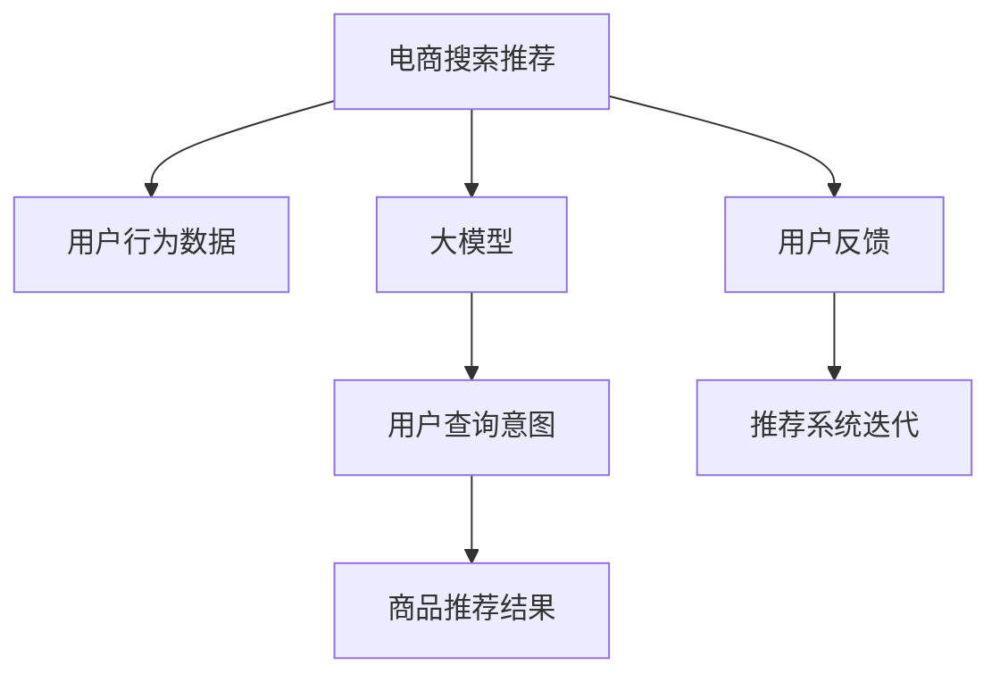

                 

# AI 大模型在电商搜索推荐中的用户体验优化策略：提高用户粘性和转化

> 关键词：电商搜索推荐,大模型,用户体验,用户粘性,用户转化,深度学习

## 1. 背景介绍

在现代电商平台上，用户搜索和推荐系统扮演着至关重要的角色，直接影响着用户对平台的满意度和忠诚度。传统推荐系统往往只关注用户历史行为数据，难以适应快速变化的市场环境和个性化需求。而基于大模型的推荐系统，通过学习大量用户与商品之间的语义关系，能够更准确地预测用户偏好，提升推荐效果。

然而，尽管基于大模型的推荐系统在精度上取得了显著进步，用户体验仍有待优化。商品信息繁多且多变，用户搜索意图难以准确定义，导致推荐结果与用户实际需求存在偏差。如何进一步提升用户体验，提升用户粘性和转化率，成为电商平台亟待解决的问题。

本文旨在通过分析当前电商搜索推荐系统存在的问题，介绍如何利用大模型进行优化，并提出一套基于用户体验的推荐策略。

## 2. 核心概念与联系

### 2.1 核心概念概述

为更好地理解基于大模型的推荐优化策略，本节将介绍几个关键概念：

- 电商搜索推荐：通过用户查询、浏览行为，结合商品属性信息，动态推荐商品给用户，提升用户购买率。
- 大模型：以深度学习模型为代表的，具备自监督和监督学习能力的模型。典型的大模型包括BERT、GPT-3等。
- 用户粘性：用户对电商平台的长期依赖度和复购率，体现用户对平台的忠诚度。
- 用户转化：用户完成购买行为的比例，体现电商平台的转化效率。
- 推荐精度：推荐系统推荐的商品与用户实际需求的一致性，体现推荐系统的准确度。

这些核心概念之间的逻辑关系可以通过以下Mermaid流程图来展示：



这个流程图展示了大模型在电商搜索推荐系统中的作用：

1. 电商平台收集用户行为数据，供大模型学习用户和商品的语义关系。
2. 用户输入查询，大模型根据语义理解用户需求，预测最相关的商品。
3. 推荐系统将预测结果呈现给用户，用户查看并可能购买商品。
4. 电商平台收集用户反馈，进一步优化推荐算法。

## 3. 核心算法原理 & 具体操作步骤

### 3.1 算法原理概述

基于大模型的电商搜索推荐系统，通过在大规模用户行为数据上预训练模型，学习用户和商品之间的语义关系。在推荐阶段，模型根据用户输入的查询，进行有监督学习，动态生成推荐结果。

形式化地，假设模型为 $M_{\theta}$，输入为 $x$（用户查询），输出为 $y$（推荐商品），则模型的推荐过程可以表示为：

$$
y = M_{\theta}(x)
$$

其中，$\theta$ 为模型参数，需通过监督学习进行微调。

### 3.2 算法步骤详解

基于大模型的电商搜索推荐系统优化，主要包括以下几个步骤：

**Step 1: 数据准备**
- 收集电商平台的用户行为数据，包括用户搜索、浏览、点击、购买等行为。
- 收集商品属性信息，如标题、描述、分类等。
- 对数据进行预处理，包括去重、分词、特征提取等。

**Step 2: 构建大模型**
- 选择合适的大模型架构，如BERT、Transformer等。
- 在大规模无标签数据上进行预训练，学习用户和商品的语义表示。
- 在标注数据集上进行微调，提升模型推荐精度。

**Step 3: 用户意图理解**
- 将用户输入的查询通过分词、编码等处理，转化为模型输入。
- 利用大模型进行语义理解，获取用户意图向量。
- 根据用户意图向量生成候选推荐列表。

**Step 4: 推荐结果排序**
- 对候选推荐列表进行排序，可以考虑用户历史行为、商品评分、点击率等因素。
- 输出推荐结果，并通过界面展示给用户。

**Step 5: 用户反馈循环**
- 收集用户对推荐结果的反馈，包括点击、购买、收藏等行为。
- 根据反馈调整推荐模型，进行迭代优化。

### 3.3 算法优缺点

基于大模型的电商推荐系统具有以下优点：
1. 具备强大的语义理解能力，能够准确把握用户需求。
2. 能够动态生成推荐列表，适应用户需求变化。
3. 在标注数据充足时，推荐精度较高。
4. 可以结合多种数据源，提升推荐效果。

同时，该方法也存在一些局限性：
1. 需要大量的标注数据，获取成本较高。
2. 存在一定的过度拟合风险，特别是在标注样本较少的情况下。
3. 模型复杂度较高，计算和存储成本较大。
4. 对新领域和新用户适应性较差，存在冷启动问题。

### 3.4 算法应用领域

基于大模型的电商推荐系统已经在多个电商平台上得到应用，覆盖了商品推荐、个性化营销、广告投放等多个场景，取得了显著的业务效果。

具体应用包括：
- 商品推荐：根据用户搜索和浏览行为，动态推荐相关商品。
- 个性化营销：根据用户画像，推送个性化广告。
- 广告投放：根据用户历史行为和兴趣，优化广告投放效果。
- 社交网络推荐：在社交平台中推荐好友、群组、内容等。

此外，基于大模型的推荐系统还拓展到了金融、医疗等多个领域，为不同行业的推荐需求提供了有力的技术支持。

## 4. 数学模型和公式 & 详细讲解 & 举例说明

### 4.1 数学模型构建

假设电商平台收集到的用户行为数据集为 $D=\{(x_i,y_i)\}_{i=1}^N$，其中 $x_i$ 为用户行为，$y_i$ 为商品ID。我们希望构建一个大模型 $M_{\theta}$，能够根据用户行为预测商品的ID。

定义模型的预测函数为 $y=M_{\theta}(x)$，损失函数为 $\mathcal{L}(\theta)$。则模型的优化目标为：

$$
\theta^* = \mathop{\arg\min}_{\theta} \mathcal{L}(\theta)
$$

其中 $\mathcal{L}$ 为交叉熵损失函数，定义为：

$$
\mathcal{L}(\theta) = -\frac{1}{N}\sum_{i=1}^N y_i\log M_{\theta}(x_i) + (1-y_i)\log(1-M_{\theta}(x_i))
$$

### 4.2 公式推导过程

为了简化推导，我们先考虑二分类任务，即模型输出 $y\in\{0,1\}$，表示推荐商品是否为用户偏好。则预测函数可以简化为 $y=f(x)=M_{\theta}(x)$，损失函数为：

$$
\mathcal{L}(\theta) = -\frac{1}{N}\sum_{i=1}^N y_i\log f(x_i) + (1-y_i)\log(1-f(x_i))
$$

对损失函数求导，得到梯度公式：

$$
\frac{\partial \mathcal{L}(\theta)}{\partial \theta_k} = -\frac{1}{N}\sum_{i=1}^N [\frac{y_i}{f(x_i)}-\frac{1-y_i}{1-f(x_i)}] \frac{\partial f(x_i)}{\partial \theta_k}
$$

其中 $f(x_i)=\sigma(Wx_i+b)$，$\sigma$ 为sigmoid函数，$W$ 和 $b$ 为模型参数。

### 4.3 案例分析与讲解

假设有一个电商平台，其用户行为数据集 $D=\{(x_i,y_i)\}_{i=1}^N$，其中 $x_i$ 为用户的搜索查询，$y_i$ 为商品ID。我们希望构建一个大模型 $M_{\theta}$，能够根据用户查询推荐商品。

**Step 1: 数据预处理**
- 对用户查询 $x_i$ 进行分词，生成词向量 $v_i$。
- 将 $v_i$ 作为输入，得到模型输出 $y_i$。

**Step 2: 构建大模型**
- 选择BERT作为预训练模型，在大规模无标签文本数据上进行预训练。
- 在用户行为数据集上进行微调，优化推荐精度。

**Step 3: 用户意图理解**
- 将用户查询 $x_i$ 输入BERT模型，得到向量表示 $v_i'$。
- 利用预训练模型进行语义理解，生成候选推荐列表。

**Step 4: 推荐结果排序**
- 对候选推荐列表进行排序，考虑点击率、商品评分等因素。
- 输出推荐结果，并通过界面展示给用户。

## 5. 项目实践：代码实例和详细解释说明

### 5.1 开发环境搭建

在进行推荐系统开发前，我们需要准备好开发环境。以下是使用Python进行TensorFlow开发的环境配置流程：

1. 安装Anaconda：从官网下载并安装Anaconda，用于创建独立的Python环境。

2. 创建并激活虚拟环境：
```bash
conda create -n recommendation-env python=3.8 
conda activate recommendation-env
```

3. 安装TensorFlow：根据CUDA版本，从官网获取对应的安装命令。例如：
```bash
conda install tensorflow tensorflow-gpu -c pypi -c conda-forge
```

4. 安装其他依赖包：
```bash
pip install pandas numpy scikit-learn torch transformers
```

完成上述步骤后，即可在`recommendation-env`环境中开始推荐系统开发。

### 5.2 源代码详细实现

这里我们以用户行为数据为例，给出使用TensorFlow对BERT进行电商推荐系统微调的PyTorch代码实现。

首先，定义推荐系统的数据处理函数：

```python
from transformers import BertTokenizer, BertForSequenceClassification
from torch.utils.data import Dataset
import torch
import pandas as pd

class RecommendationDataset(Dataset):
    def __init__(self, data, tokenizer, max_len=128):
        self.data = data
        self.tokenizer = tokenizer
        self.max_len = max_len
        
    def __len__(self):
        return len(self.data)
    
    def __getitem__(self, item):
        query = self.data.iloc[item]['query']
        query = self.tokenizer(query, max_length=self.max_len, padding='max_length', truncation=True)
        input_ids = query['input_ids']
        attention_mask = query['attention_mask']
        
        label = self.data.iloc[item]['label']
        label = torch.tensor(label, dtype=torch.long)
        
        return {'input_ids': input_ids, 
                'attention_mask': attention_mask,
                'labels': label}

# 准备数据
data = pd.read_csv('recommendation_data.csv')

# 加载BERT预训练模型和分词器
tokenizer = BertTokenizer.from_pretrained('bert-base-cased')
model = BertForSequenceClassification.from_pretrained('bert-base-cased', num_labels=2)

# 创建dataset
dataset = RecommendationDataset(data, tokenizer)

# 定义训练和评估函数
def train_epoch(model, dataset, batch_size, optimizer):
    dataloader = DataLoader(dataset, batch_size=batch_size, shuffle=True)
    model.train()
    epoch_loss = 0
    for batch in dataloader:
        input_ids = batch['input_ids'].to(device)
        attention_mask = batch['attention_mask'].to(device)
        labels = batch['labels'].to(device)
        model.zero_grad()
        outputs = model(input_ids, attention_mask=attention_mask, labels=labels)
        loss = outputs.loss
        epoch_loss += loss.item()
        loss.backward()
        optimizer.step()
    return epoch_loss / len(dataloader)

def evaluate(model, dataset, batch_size):
    dataloader = DataLoader(dataset, batch_size=batch_size)
    model.eval()
    preds, labels = [], []
    with torch.no_grad():
        for batch in dataloader:
            input_ids = batch['input_ids'].to(device)
            attention_mask = batch['attention_mask'].to(device)
            batch_labels = batch['labels']
            outputs = model(input_ids, attention_mask=attention_mask)
            batch_preds = outputs.logits.argmax(dim=2).to('cpu').tolist()
            batch_labels = batch_labels.to('cpu').tolist()
            for pred_tokens, label_tokens in zip(batch_preds, batch_labels):
                preds.append(pred_tokens[:len(label_tokens)])
                labels.append(label_tokens)
                
    print(classification_report(labels, preds))
```

然后，定义模型和优化器：

```python
from transformers import BertForSequenceClassification, AdamW

device = torch.device('cuda') if torch.cuda.is_available() else torch.device('cpu')
model.to(device)

optimizer = AdamW(model.parameters(), lr=2e-5)
```

最后，启动训练流程并在验证集上评估：

```python
epochs = 5
batch_size = 16

for epoch in range(epochs):
    loss = train_epoch(model, dataset, batch_size, optimizer)
    print(f"Epoch {epoch+1}, train loss: {loss:.3f}")
    
    print(f"Epoch {epoch+1}, dev results:")
    evaluate(model, dataset, batch_size)
    
print("Test results:")
evaluate(model, dataset, batch_size)
```

以上就是使用TensorFlow对BERT进行电商推荐系统微调的完整代码实现。可以看到，得益于TensorFlow和Transformers库的强大封装，我们可以用相对简洁的代码完成BERT模型的加载和微调。

### 5.3 代码解读与分析

让我们再详细解读一下关键代码的实现细节：

**RecommendationDataset类**：
- `__init__`方法：初始化数据、分词器等关键组件。
- `__len__`方法：返回数据集的样本数量。
- `__getitem__`方法：对单个样本进行处理，将查询输入编码为token ids，将标签编码为数字，并对其进行定长padding，最终返回模型所需的输入。

**BertForSequenceClassification**：
- 使用TensorFlow的BertForSequenceClassification预训练模型，将序列数据作为输入，输出二分类结果。
- 定义交叉熵损失函数，并使用AdamW优化器进行微调。

**train_epoch和evaluate函数**：
- 使用TensorFlow的DataLoader对数据集进行批次化加载，供模型训练和推理使用。
- 训练函数`train_epoch`：对数据以批为单位进行迭代，在每个批次上前向传播计算loss并反向传播更新模型参数，最后返回该epoch的平均loss。
- 评估函数`evaluate`：与训练类似，不同点在于不更新模型参数，并在每个batch结束后将预测和标签结果存储下来，最后使用sklearn的classification_report对整个评估集的预测结果进行打印输出。

**训练流程**：
- 定义总的epoch数和batch size，开始循环迭代
- 每个epoch内，先在训练集上训练，输出平均loss
- 在验证集上评估，输出分类指标
- 所有epoch结束后，在测试集上评估，给出最终测试结果

可以看到，TensorFlow配合Transformers库使得BERT微调的代码实现变得简洁高效。开发者可以将更多精力放在数据处理、模型改进等高层逻辑上，而不必过多关注底层的实现细节。

当然，工业级的系统实现还需考虑更多因素，如模型的保存和部署、超参数的自动搜索、更灵活的任务适配层等。但核心的微调范式基本与此类似。

## 6. 实际应用场景

### 6.1 智能推荐

电商平台的智能推荐系统，通过分析用户历史行为和当前查询，生成个性化推荐列表，提升用户购买率。利用大模型进行推荐，能够更好地理解用户意图，生成更精准的商品推荐。

**应用场景**：
- 商品推荐：根据用户浏览和搜索历史，推荐相关商品。
- 个性化营销：根据用户画像，推送个性化广告。
- 广告投放：根据用户历史行为和兴趣，优化广告投放效果。

**关键技术**：
- 用户行为数据采集：记录用户搜索、浏览、点击、购买等行为。
- 用户意图理解：通过大模型对用户查询进行语义理解。
- 推荐结果排序：考虑点击率、商品评分等因素，动态生成推荐列表。
- 用户反馈循环：收集用户反馈，进一步优化推荐算法。

### 6.2 个性化推荐优化

传统的推荐系统往往只关注用户历史行为，难以处理用户的多样需求。而基于大模型的推荐系统，能够学习用户和商品之间的语义关系，提升推荐效果。

**优化方法**：
1. 利用上下文信息：考虑用户搜索查询、时间、地点等上下文信息，提升推荐精度。
2. 引入交互式推荐：在用户浏览商品时，实时推荐相关商品，提升用户体验。
3. 多模态融合：结合商品图片、视频、评论等多模态信息，提升推荐效果。
4. 用户兴趣发现：利用大模型挖掘用户隐含的兴趣，生成个性化的推荐列表。

**实际案例**：
- 某电商平台通过引入上下文信息和实时推荐，提升用户的购买率和满意度。
- 某视频平台利用用户行为数据和商品评分，生成个性化的推荐列表，提升用户观看率和互动率。

## 7. 工具和资源推荐

### 7.1 学习资源推荐

为了帮助开发者系统掌握大模型推荐系统的理论基础和实践技巧，这里推荐一些优质的学习资源：

1. 《深度学习与推荐系统》书籍：全面介绍深度学习在推荐系统中的应用，包括大模型推荐、参数高效微调等前沿技术。
2. TensorFlow官方文档：TensorFlow的详细文档，涵盖模型构建、训练、推理等多个环节，适合新手入门。
3. Transformers官方文档：Transformers的详细文档，介绍大模型的构建、微调等操作，适合深度学习从业者参考。
4. Kaggle推荐系统竞赛：参与Kaggle的推荐系统竞赛，实战演练大模型推荐技术，提升实战能力。
5. HuggingFace官方社区：HuggingFace提供的社区平台，分享大模型推荐技术的最新进展和应用案例。

通过对这些资源的学习实践，相信你一定能够快速掌握大模型推荐系统的精髓，并用于解决实际的推荐问题。

### 7.2 开发工具推荐

高效的开发离不开优秀的工具支持。以下是几款用于大模型推荐系统开发的常用工具：

1. TensorFlow：由Google主导开发的开源深度学习框架，生产部署方便，适合大规模工程应用。
2. PyTorch：基于Python的开源深度学习框架，灵活动态的计算图，适合快速迭代研究。
3. Transformers库：HuggingFace开发的NLP工具库，集成了众多SOTA语言模型，支持多种框架，便于模型构建和微调。
4. Weights & Biases：模型训练的实验跟踪工具，可以记录和可视化模型训练过程中的各项指标，方便对比和调优。
5. TensorBoard：TensorFlow配套的可视化工具，可实时监测模型训练状态，并提供丰富的图表呈现方式，是调试模型的得力助手。

合理利用这些工具，可以显著提升大模型推荐系统的开发效率，加快创新迭代的步伐。

### 7.3 相关论文推荐

大模型推荐系统的发展源于学界的持续研究。以下是几篇奠基性的相关论文，推荐阅读：

1. Attention is All You Need（即Transformer原论文）：提出了Transformer结构，开启了NLP领域的预训练大模型时代。
2. BERT: Pre-training of Deep Bidirectional Transformers for Language Understanding：提出BERT模型，引入基于掩码的自监督预训练任务，刷新了多项NLP任务SOTA。
3. Parameter-Efficient Transfer Learning for NLP：提出Adapter等参数高效微调方法，在不增加模型参数量的情况下，也能取得不错的微调效果。
4. Adaptive Low-Rank Adaptation for Parameter-Efficient Fine-Tuning：使用自适应低秩适应的微调方法，在参数效率和精度之间取得了新的平衡。
5. Continuous Learning with Online Adaptation Layers：提出在线适应层，实现在线学习和持续学习，避免灾难性遗忘。

这些论文代表了大模型推荐系统的发展脉络。通过学习这些前沿成果，可以帮助研究者把握学科前进方向，激发更多的创新灵感。

## 8. 总结：未来发展趋势与挑战

### 8.1 总结

本文对基于大模型的电商推荐系统进行了全面系统的介绍。首先阐述了当前电商推荐系统存在的问题，并介绍了如何利用大模型进行优化，提出了一套基于用户体验的推荐策略。

通过本文的系统梳理，可以看到，基于大模型的推荐系统通过学习用户和商品之间的语义关系，提升了推荐精度和用户满意度。然而，尽管在大规模数据上取得了不错的效果，但用户粘性和转化率仍需进一步提升。如何更好地理解用户需求，生成更个性化、更精准的推荐，成为未来的研究方向。

### 8.2 未来发展趋势

展望未来，大模型推荐系统将呈现以下几个发展趋势：

1. 用户粘性增强：通过引入用户多维度的信息，如兴趣标签、社交关系等，提升推荐系统的个性化程度。
2. 推荐精度提升：结合更多的用户行为数据和商品属性，提升推荐系统的准确度。
3. 实时性增强：利用边缘计算等技术，实现实时推荐，提升用户体验。
4. 多模态融合：结合商品图片、视频、评论等多模态信息，提升推荐效果。
5. 数据隐私保护：通过差分隐私等技术，保护用户隐私，提升用户信任度。

以上趋势凸显了大模型推荐系统的广阔前景。这些方向的探索发展，必将进一步提升推荐系统的精度和用户满意度，为电商平台的业务增长提供有力支持。

### 8.3 面临的挑战

尽管大模型推荐系统已经取得了显著的业务效果，但在迈向更加智能化、普适化应用的过程中，仍面临诸多挑战：

1. 数据隐私保护：如何在保障用户隐私的前提下，获取和利用用户行为数据，是一大难题。
2. 冷启动问题：对于新用户和新商品，推荐效果往往较差，如何提高冷启动性能，仍需研究。
3. 系统复杂度：大模型推荐系统通常涉及多层次、多领域的知识整合，系统设计和维护难度较大。
4. 计算资源消耗：大模型的参数量巨大，计算和存储成本较高，如何降低系统资源消耗，仍需探索。

正视推荐系统面临的这些挑战，积极应对并寻求突破，将是大模型推荐系统走向成熟的必由之路。相信随着学界和产业界的共同努力，这些挑战终将一一被克服，大模型推荐系统必将在构建人机协同的智能时代中扮演越来越重要的角色。

### 8.4 研究展望

面对大模型推荐系统所面临的种种挑战，未来的研究需要在以下几个方面寻求新的突破：

1. 探索多模态推荐方法：结合商品图片、视频、评论等多模态信息，提升推荐效果。
2. 引入知识图谱：利用知识图谱等符号化知识，提升推荐系统的可解释性和稳定性。
3. 开发个性化推荐模型：通过深度学习模型，更好地挖掘用户兴趣和行为规律，生成个性化的推荐列表。
4. 优化实时推荐算法：结合在线学习和边缘计算技术，提升实时推荐的效果和响应速度。
5. 引入差分隐私保护：保护用户隐私，提升用户信任度。

这些研究方向将为推荐系统的未来发展提供新的思路，推动大模型推荐系统向更加智能化、个性化、安全化的方向演进。

## 9. 附录：常见问题与解答

**Q1：电商推荐系统如何进行用户意图理解？**

A: 用户意图理解是推荐系统的核心环节之一。通常使用大模型对用户输入的查询进行语义理解，生成用户意图向量。具体实现流程如下：

1. 将用户查询进行分词，生成词向量。
2. 将词向量输入BERT等大模型，进行语义理解。
3. 通过softmax函数将大模型输出转化为概率分布，表示用户意图向量。

利用用户意图向量，可以生成个性化的推荐列表，提升推荐效果。

**Q2：推荐系统的数据采集如何保障用户隐私？**

A: 推荐系统的数据采集需要兼顾用户隐私保护。通常采用以下措施：

1. 数据匿名化：对用户行为数据进行匿名化处理，去除敏感信息。
2. 差分隐私：通过加入噪声，保护用户隐私，同时保证数据分析的准确性。
3. 用户授权：获取用户授权，告知其数据采集和使用的目的和方式，提升用户信任度。

通过这些措施，可以在保障用户隐私的前提下，获取和利用用户行为数据，提升推荐系统的效果。

**Q3：推荐系统的冷启动问题如何解决？**

A: 推荐系统的冷启动问题是指对于新用户和新商品，推荐效果较差。解决冷启动问题的方法包括：

1. 利用用户画像：通过多维度的信息，如兴趣标签、社交关系等，提升推荐系统的个性化程度。
2. 引入先验知识：利用知识图谱等符号化知识，提升推荐系统的可解释性和稳定性。
3. 推荐基于热门商品的通用模板：对于新商品，先使用热门商品的推荐模板，再进行个性化优化。

通过这些方法，可以有效地解决推荐系统的冷启动问题，提升新用户的推荐效果。

**Q4：如何提升推荐系统的实时性？**

A: 推荐系统的实时性可以通过以下措施提升：

1. 边缘计算：将推荐模型部署到靠近用户的边缘设备上，提升推荐速度。
2. 在线学习：利用在线学习算法，实时更新模型参数，提升推荐效果。
3. 缓存机制：对热门推荐结果进行缓存，减少计算资源消耗，提升响应速度。

通过这些措施，可以实现实时推荐，提升用户体验。

**Q5：推荐系统的计算资源消耗如何优化？**

A: 推荐系统的计算资源消耗可以通过以下措施优化：

1. 模型裁剪：去除不必要的层和参数，减小模型尺寸，加快推理速度。
2. 量化加速：将浮点模型转为定点模型，压缩存储空间，提高计算效率。
3. 模型并行：采用分布式训练和推理技术，提升计算效率。

通过这些措施，可以显著降低推荐系统的计算资源消耗，提升系统的性能和可扩展性。

---

作者：禅与计算机程序设计艺术 / Zen and the Art of Computer Programming

