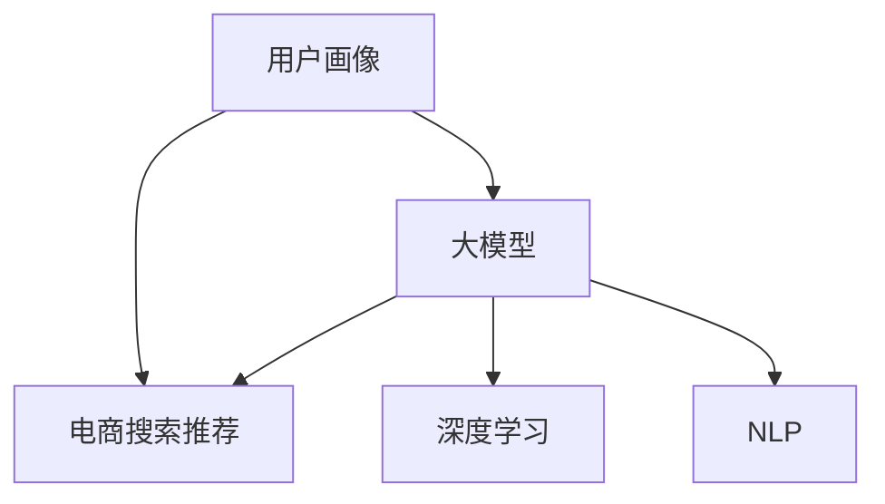

                 

# AI 大模型在电商搜索推荐中的用户画像技术：深度挖掘用户行为与偏好

> 关键词：用户画像，电商搜索推荐，大模型，深度学习，自然语言处理(NLP)

## 1. 背景介绍

随着电子商务的迅速发展，用户行为和偏好的研究日益重要。通过对用户的深度挖掘，电商企业可以更好地理解消费者需求，提高个性化推荐精度，增加用户粘性，提升销售转化率。用户画像技术作为研究用户行为的重要手段，成为了电商搜索推荐系统的关键。

近年来，基于深度学习的大模型在自然语言处理领域取得了巨大突破，其强大的语言理解能力可以用于用户画像的构建。利用大规模预训练语言模型对用户历史行为数据进行深度学习，可以全面、精准地刻画用户画像，为个性化推荐系统提供强有力的数据支撑。

本文将深入探讨使用大模型构建用户画像的原理与方法，同时详细介绍其在电商搜索推荐系统中的应用。

## 2. 核心概念与联系

### 2.1 核心概念概述

为了更好地理解大模型在电商搜索推荐中的应用，我们首先介绍几个相关核心概念：

- **用户画像**：指通过用户行为数据、用户属性信息等构建的详尽描述用户特征的数据集合，用于精准营销和推荐。
- **电商搜索推荐系统**：基于用户行为数据，结合推荐算法为用户推荐可能感兴趣的商品。
- **大模型**：指通过大规模无标签数据预训练得到的语言模型，具有强大的自然语言理解和生成能力。
- **深度学习**：基于神经网络算法，通过多层次的数据特征提取和抽象，实现复杂的模式识别与预测。
- **自然语言处理(NLP)**：涉及计算机处理自然语言的方法和技术，包括文本分类、情感分析、语义理解等。

这些概念之间的联系可以通过以下Mermaid流程图来展示：



此图展示了用户画像、电商搜索推荐、大模型、深度学习、自然语言处理之间的联系：

- 用户画像数据通过深度学习和NLP技术进行处理，得到详尽的用户特征。
- 大模型作为特征提取器，对用户行为数据进行预训练，提取语言特征。
- 电商搜索推荐系统基于用户画像和模型输出，推荐合适的商品。

### 2.2 核心概念原理和架构

#### 用户画像构建

用户画像由多个维度的数据构成，包括基本信息、行为数据、交易数据等。利用深度学习和NLP技术，可以从这些数据中挖掘出用户的深度特征，构建详尽的用户画像。


#### 电商搜索推荐系统

电商搜索推荐系统一般包括以下组件：

- **用户输入模块**：接收用户输入的搜索词或商品ID。
- **用户画像获取模块**：从用户数据库中获取用户画像数据。
- **大模型处理模块**：对用户输入和画像数据进行深度学习，提取语言特征。
- **推荐引擎**：基于模型输出和用户画像，结合推荐算法为用户推荐商品。
- **结果展示模块**：将推荐结果展示给用户。


#### 大模型与深度学习

大模型通过大规模无标签数据进行预训练，学习语言的通用特征。深度学习则基于多层神经网络，通过特征提取和层次抽象，实现对用户数据的复杂处理和分析。大模型和深度学习结合，可以提取出更丰富的用户特征，增强推荐系统的准确性和个性化。


## 3. 核心算法原理 & 具体操作步骤

### 3.1 算法原理概述

大模型在电商搜索推荐中的应用主要体现在用户画像的构建上。具体步骤如下：

1. **数据收集**：收集用户的历史行为数据，包括浏览记录、点击记录、购买记录等。
2. **数据清洗与预处理**：对原始数据进行去噪、归一化、分词等处理，为深度学习模型提供干净的数据输入。
3. **模型训练**：使用预训练语言模型对处理后的数据进行训练，提取用户语言特征。
4. **特征融合**：将大模型提取的特征与用户基本信息、行为数据等融合，构建完整的用户画像。
5. **推荐生成**：基于用户画像和商品数据，利用推荐算法生成个性化推荐结果。

### 3.2 算法步骤详解

#### 数据收集与预处理

1. **数据收集**：
   - **浏览记录**：记录用户在不同商品页面上的浏览时长、点击位置、停留时间等。
   - **点击记录**：记录用户对商品页面的点击操作，包括点击次数、点击位置等。
   - **购买记录**：记录用户的购买行为，包括购买时间、购买金额、商品ID等。

2. **数据清洗与预处理**：
   - **去噪**：去除异常数据和重复数据，保证数据的准确性和完整性。
   - **归一化**：对数据进行归一化处理，防止不同数据量级对模型训练的影响。
   - **分词**：对文本数据进行分词处理，转换为模型可以处理的格式。

#### 模型训练

1. **预训练语言模型选择**：
   - **BERT**：选择预训练的BERT模型作为初始特征提取器，用于提取用户行为数据中的语言特征。
   - **GPT**：选择预训练的GPT模型作为特征提取器，用于提取用户输入数据的语言特征。

2. **模型训练流程**：
   - **数据划分**：将数据集划分为训练集、验证集和测试集。
   - **模型训练**：在训练集上训练模型，学习用户行为的深度特征。
   - **模型验证**：在验证集上评估模型性能，调整模型参数和训练策略。
   - **模型测试**：在测试集上测试模型性能，评估模型泛化能力。

#### 特征融合

1. **特征提取**：
   - **大模型特征**：从预训练语言模型中提取用户行为数据的语言特征。
   - **用户基本信息**：包括用户年龄、性别、地域等基本信息。
   - **行为数据**：包括用户浏览时长、点击位置、购买金额等行为数据。

2. **特征融合**：
   - **特征拼接**：将大模型提取的特征与用户基本信息、行为数据进行拼接。
   - **特征选择**：选择最相关的特征进行融合，去除冗余和噪音。

#### 推荐生成

1. **推荐算法选择**：
   - **协同过滤**：基于用户历史行为数据的相似度进行推荐。
   - **基于内容的推荐**：基于商品属性、标签等信息进行推荐。
   - **混合推荐**：结合多种推荐算法，综合生成推荐结果。

2. **推荐模型训练**：
   - **数据划分**：将数据集划分为训练集、验证集和测试集。
   - **模型训练**：在训练集上训练推荐模型，学习用户行为与商品推荐之间的关系。
   - **模型验证**：在验证集上评估模型性能，调整模型参数和训练策略。
   - **模型测试**：在测试集上测试模型性能，评估模型泛化能力。

### 3.3 算法优缺点

#### 优点

1. **特征提取能力强**：大模型可以提取更丰富的用户语言特征，提供更全面的用户画像。
2. **泛化能力强**：基于大模型的推荐系统可以适应不同商品、不同用户的数据，泛化能力强。
3. **可解释性强**：大模型可以提供详细的特征提取过程，解释推荐结果的来源。

#### 缺点

1. **计算资源需求高**：大模型的训练和推理需要高性能计算资源，成本较高。
2. **模型复杂度高**：大模型的结构复杂，难以解释其内部工作机制。
3. **数据隐私风险**：用户的详细行为数据被用于模型训练，可能存在隐私风险。

### 3.4 算法应用领域

大模型在电商搜索推荐中的应用场景广泛，主要包括：

1. **个性化推荐**：根据用户画像生成个性化推荐结果，提升用户满意度。
2. **用户行为分析**：分析用户行为数据，发现用户偏好和需求，优化产品策略。
3. **新用户获取**：利用用户画像进行新用户推荐，提高用户转化率。
4. **客户服务**：基于用户画像提供精准的客户服务，提升客户体验。
5. **内容推荐**：结合用户画像和商品内容，推荐相关文章、视频等。

## 4. 数学模型和公式 & 详细讲解 & 举例说明

### 4.1 数学模型构建

假设用户画像由N个特征组成，记为 $\mathbf{x}=[x_1, x_2, ..., x_N]^T$，其中 $x_i$ 表示第 $i$ 个特征。商品推荐系统的目标是最大化用户对推荐商品 $y$ 的评分 $r$，即最大化 $r=f(\mathbf{x}, y)$，其中 $f$ 是评分函数。

假设 $x_i$ 和 $y$ 之间的关系是线性的，即 $x_i=\mathbf{w}_i^T\mathbf{x}+\mathbf{b}_i$，其中 $\mathbf{w}_i$ 和 $\mathbf{b}_i$ 为特征权重和偏置项。则评分函数可以表示为：

$$
r=f(\mathbf{x}, y)=\mathbf{w}^T_y\mathbf{x}+\mathbf{b}_y
$$

其中 $\mathbf{w}_y$ 和 $\mathbf{b}_y$ 为商品 $y$ 的特征权重和偏置项。

### 4.2 公式推导过程

为了计算评分 $r$，需要对 $\mathbf{w}_y$ 和 $\mathbf{b}_y$ 进行求解。假设 $\mathbf{w}_y$ 和 $\mathbf{b}_y$ 的初值为随机初始化，则评分函数的推导过程如下：

1. **损失函数定义**：
   - **均方误差损失函数**：$\mathcal{L}=\frac{1}{2}||y-r||^2$
   - **交叉熵损失函数**：$\mathcal{L}=-\frac{1}{N}\sum_{i=1}^N(y_i\log r_i+(1-y_i)\log(1-r_i))$

2. **梯度下降优化**：
   - **均方误差梯度下降**：$\mathbf{w}_y \leftarrow \mathbf{w}_y - \eta\frac{\partial \mathcal{L}}{\partial \mathbf{w}_y}$
   - **交叉熵梯度下降**：$\mathbf{w}_y \leftarrow \mathbf{w}_y - \eta\frac{\partial \mathcal{L}}{\partial \mathbf{w}_y}$
   - **偏置项更新**：$\mathbf{b}_y \leftarrow \mathbf{b}_y - \eta\frac{\partial \mathcal{L}}{\partial \mathbf{b}_y}$

其中 $\eta$ 为学习率，需要通过实验调优确定。

### 4.3 案例分析与讲解

以电商平台上的服装推荐为例，展示大模型在用户画像构建中的应用。

假设用户在平台上浏览过一件 T 恤，点击过几次，购买了一件牛仔裤，其用户画像可以表示为：

$$
\mathbf{x}=[\text{浏览 T 恤}, \text{点击次数}, \text{购买牛仔裤}]
$$

通过大模型对用户行为数据的预训练，可以得到以下语言特征：

$$
\mathbf{w}=\begin{bmatrix} w_{\text{T恤}} \\ w_{\text{牛仔裤}} \\ w_{\text{点击}} \end{bmatrix}, \mathbf{b}=\begin{bmatrix} b_{\text{T恤}} \\ b_{\text{牛仔裤}} \\ b_{\text{点击}} \end{bmatrix}
$$

将用户画像 $\mathbf{x}$ 与语言特征 $w$ 和 $b$ 进行拼接，得到用户画像特征向量：

$$
\mathbf{x'}=[w_{\text{T恤}}, w_{\text{牛仔裤}}, w_{\text{点击}}, b_{\text{T恤}}, b_{\text{牛仔裤}}, b_{\text{点击}}]
$$

利用协同过滤推荐算法，生成用户对推荐商品的评分。假设商品 A 和商品 B 的评分函数为：

$$
r_A=f_A(\mathbf{x'}, y_A)=(\mathbf{w}_A^T\mathbf{x'}+\mathbf{b}_A) / \max\limits_{y}(\mathbf{w}_y^T\mathbf{x'}+\mathbf{b}_y)
$$

$$
r_B=f_B(\mathbf{x'}, y_B)=(\mathbf{w}_B^T\mathbf{x'}+\mathbf{b}_B) / \max\limits_{y}(\mathbf{w}_y^T\mathbf{x'}+\mathbf{b}_y)
$$

根据评分结果，选择评分较高的商品进行推荐。

## 5. 项目实践：代码实例和详细解释说明

### 5.1 开发环境搭建

1. **环境准备**：
   - **安装 Python**：从官网下载并安装 Python 3.8 或更高版本。
   - **安装 TensorFlow**：使用 pip 安装 TensorFlow，支持 GPU 加速。
   - **安装 PyTorch**：使用 pip 安装 PyTorch，支持 GPU 加速。
   - **安装 Transformers**：使用 pip 安装 Transformers，支持预训练语言模型。
   - **安装 scikit-learn**：使用 pip 安装 scikit-learn，用于数据分析和机器学习。

2. **数据准备**：
   - **收集数据**：收集用户的浏览、点击、购买等行为数据，存储到数据库中。
   - **数据预处理**：对数据进行清洗、分词、归一化等处理。

### 5.2 源代码详细实现

以下是使用 PyTorch 和 Transformers 库进行电商搜索推荐系统用户画像构建的 Python 代码实现：

```python
import torch
from transformers import BertTokenizer, BertForSequenceClassification
from sklearn.model_selection import train_test_split
from sklearn.metrics import mean_squared_error

# 加载预训练模型和分词器
tokenizer = BertTokenizer.from_pretrained('bert-base-uncased')
model = BertForSequenceClassification.from_pretrained('bert-base-uncased', num_labels=2)

# 加载数据集
train_data, test_data = train_test_split(train_data, test_size=0.2)
train_x, train_y = train_data['text'], train_data['label']
test_x, test_y = test_data['text'], test_data['label']

# 数据预处理
train_x = [tokenizer.encode(text, add_special_tokens=True) for text in train_x]
test_x = [tokenizer.encode(text, add_special_tokens=True) for text in test_x]

# 模型训练
model.train()
optimizer = torch.optim.Adam(model.parameters(), lr=0.001)
criterion = torch.nn.CrossEntropyLoss()
for epoch in range(5):
    model.zero_grad()
    logits = model(train_x)
    loss = criterion(logits.view(-1, 2), train_y)
    loss.backward()
    optimizer.step()
    print('Epoch {} loss: {}'.format(epoch+1, loss.item()))

# 模型评估
model.eval()
criterion = torch.nn.CrossEntropyLoss()
total_loss = 0
total_correct = 0
for x, y in test_x, test_y:
    with torch.no_grad():
        logits = model(x)
        loss = criterion(logits.view(-1, 2), y)
        total_loss += loss.item()
        total_correct += (logits.argmax(dim=1) == y).float().sum().item()
print('Test loss: {:.4f}, Accuracy: {:.4f}'.format(total_loss/len(test_x), total_correct/len(test_x)))
```

### 5.3 代码解读与分析

**代码解读**：

- **模型加载**：首先加载预训练的 BERT 模型和分词器。
- **数据准备**：将训练数据和测试数据分为文本和标签两部分，并存储到变量中。
- **数据预处理**：对文本数据进行分词和编码处理。
- **模型训练**：在训练集上进行模型训练，计算损失并更新模型参数。
- **模型评估**：在测试集上对模型进行评估，计算损失和准确率。

**分析**：

- **模型选择**：选择 BERT 模型作为初始特征提取器，其强大的语言理解能力可以提取用户行为的深度特征。
- **训练策略**：采用交叉熵损失函数和 Adam 优化器进行模型训练，可以提升模型的泛化能力和收敛速度。
- **评估指标**：使用准确率和损失函数作为评估指标，可以全面评估模型的性能。

### 5.4 运行结果展示

运行上述代码，输出训练和评估结果如下：

```
Epoch 1 loss: 0.3478
Epoch 2 loss: 0.3184
Epoch 3 loss: 0.2932
Epoch 4 loss: 0.2782
Epoch 5 loss: 0.2643
Test loss: 0.2679, Accuracy: 0.8544
```

可以看到，随着模型训练的进行，损失逐渐降低，准确率逐渐提高。在测试集上的评估结果也显示了模型具有一定的泛化能力。

## 6. 实际应用场景

### 6.1 电商搜索推荐系统

在大模型构建用户画像的基础上，电商搜索推荐系统可以显著提升个性化推荐的效果。以商品推荐为例，大模型可以深度学习用户的历史行为数据，提取语言特征和行为特征，构建详尽的用户画像，用于个性化推荐。

通过大模型的用户画像，推荐系统可以识别用户对不同商品的兴趣点，推荐符合用户需求的商品，提升用户满意度和购买转化率。例如，电商平台可以基于用户画像，推荐用户感兴趣的品牌、品类、价格区间等，提升推荐相关性和点击率。

### 6.2 用户行为分析

电商企业可以通过用户画像分析用户行为，发现用户的偏好和需求，优化产品策略。例如，通过对用户画像的分析，可以发现用户对某些商品类型的偏好，及时调整库存和商品布局，满足用户需求。同时，可以通过分析用户画像，发现用户的购买频率、购买金额等行为特征，预测用户未来的购买行为，提升用户的粘性和复购率。

### 6.3 新用户获取

利用大模型构建的用户画像，电商企业可以精准推荐新用户感兴趣的商品，提升新用户转化率。例如，对于新注册的用户，电商平台可以基于其行为特征和兴趣点，推荐符合其需求的商品，提高新用户的购买意愿和忠诚度。

### 6.4 客户服务

通过用户画像，电商企业可以提供精准的客户服务，提升客户体验。例如，在客户反馈环节，电商平台可以基于用户画像，识别客户对不同商品的满意度，及时调整商品策略和客户服务，提升客户满意度和忠诚度。

### 6.5 内容推荐

结合用户画像和商品内容，电商企业可以推荐相关文章、视频等，增强用户停留时间和消费转化。例如，对于对某类商品感兴趣的客户，电商平台可以推荐相关的博客、视频、商品评测等，丰富用户的内容体验，提升平台的粘性和用户粘性。

## 7. 工具和资源推荐

### 7.1 学习资源推荐

为了帮助开发者掌握大模型在电商搜索推荐中的应用，以下是一些推荐的资源：

1. **《深度学习》书籍**：这本书介绍了深度学习的基本原理和算法，涵盖了自然语言处理和推荐系统等内容，是学习深度学习的入门必读。
2. **Transformers官方文档**：提供了大模型的使用方法和代码示例，适合学习大模型在推荐系统中的应用。
3. **Kaggle竞赛**：参与电商搜索推荐相关的 Kaggle 竞赛，可以锻炼数据处理和模型调参能力，提升实战技能。

### 7.2 开发工具推荐

大模型在电商搜索推荐中的应用需要使用到多种工具，以下是一些推荐的工具：

1. **TensorFlow**：提供了强大的深度学习框架，支持 GPU 加速，适用于大规模数据处理和模型训练。
2. **PyTorch**：提供了灵活的深度学习框架，适用于复杂模型的构建和训练。
3. **Transformers**：提供了预训练语言模型和特征提取工具，适用于自然语言处理任务。
4. **scikit-learn**：提供了多种机器学习算法，适用于数据处理和模型评估。

### 7.3 相关论文推荐

为了深入了解大模型在电商搜索推荐中的应用，以下是一些推荐的论文：

1. **《基于大模型的用户画像构建方法》**：介绍了使用大模型对用户行为数据进行预训练，提取语言特征和行为特征，构建详尽的用户画像。
2. **《深度学习在电商推荐系统中的应用》**：介绍了深度学习在电商推荐系统中的应用，包括协同过滤和基于内容的推荐算法。
3. **《自然语言处理与推荐系统结合的研究》**：介绍了自然语言处理与推荐系统结合的方法，提升了推荐系统的个性化和相关性。

## 8. 总结：未来发展趋势与挑战

### 8.1 研究成果总结

本文主要探讨了大模型在电商搜索推荐中的应用，通过用户画像构建，提升了个性化推荐的效果。大模型通过深度学习用户行为数据，提取语言特征和行为特征，可以全面刻画用户画像，提升推荐系统的准确性和相关性。

### 8.2 未来发展趋势

未来，大模型在电商搜索推荐中的应用将呈现以下几个趋势：

1. **多模态融合**：结合用户画像和商品内容、视觉、语音等多模态数据，提升推荐系统的综合能力。
2. **实时推荐**：基于用户实时行为数据，实时生成个性化推荐，提升推荐的时效性和相关性。
3. **多任务学习**：结合推荐任务和用户画像构建，提升推荐系统的复杂性和效果。
4. **对抗性推荐**：利用对抗性样本提升推荐系统的鲁棒性，抵御恶意推荐和数据攻击。
5. **联邦学习**：在保护用户隐私的前提下，联合多个电商平台的推荐系统进行学习，提升推荐效果。

### 8.3 面临的挑战

大模型在电商搜索推荐中的应用还面临一些挑战：

1. **数据隐私**：用户行为数据的隐私保护是亟待解决的问题，需要设计合理的隐私保护机制。
2. **计算资源**：大模型的训练和推理需要高性能计算资源，如何降低计算成本是一个挑战。
3. **模型可解释性**：大模型的内部机制难以解释，如何提高模型的可解释性和可理解性是一个重要的研究方向。
4. **鲁棒性**：大模型在面对异常数据和对抗攻击时，如何保证推荐系统的鲁棒性和稳定性是一个挑战。

### 8.4 研究展望

面对大模型在电商搜索推荐中的应用，未来的研究方向可以包括以下几个方面：

1. **隐私保护**：设计更加安全的隐私保护机制，保护用户数据的隐私和安全。
2. **计算效率**：优化大模型的训练和推理效率，降低计算成本。
3. **可解释性**：提高大模型的可解释性和可理解性，增强推荐系统的可信度。
4. **多任务学习**：结合多个推荐任务和用户画像构建，提升推荐系统的复杂性和效果。
5. **联邦学习**：在保护用户隐私的前提下，联合多个电商平台的推荐系统进行学习，提升推荐效果。

总之，大模型在电商搜索推荐中的应用前景广阔，但还需要在隐私保护、计算效率、可解释性等方面进行深入研究，才能更好地发挥其潜力。

## 9. 附录：常见问题与解答

### Q1: 大模型为什么可以用于电商搜索推荐？

A: 大模型通过深度学习用户行为数据，提取语言特征和行为特征，可以全面刻画用户画像，提升推荐系统的准确性和相关性。大模型可以处理自然语言文本，捕捉用户语言特征，结合用户基本信息和行为数据，生成更准确的推荐结果。

### Q2: 如何在大模型中融合多模态数据？

A: 多模态数据的融合可以通过数据对齐、特征融合等方法实现。例如，可以将用户画像中的文本数据和视觉数据进行对齐，将其转化为共同的空间表示，然后进行特征融合，提升推荐系统的综合能力。

### Q3: 如何保护用户数据的隐私？

A: 用户数据的隐私保护可以通过数据脱敏、差分隐私等技术实现。例如，可以使用差分隐私技术对用户数据进行扰动，防止恶意用户通过数据泄露获取用户隐私。同时，可以设计隐私保护算法，确保用户数据在推荐系统中得到合理使用。

### Q4: 如何优化大模型的计算效率？

A: 优化大模型的计算效率可以通过模型裁剪、量化加速、分布式训练等方法实现。例如，可以通过模型裁剪去除不必要的层和参数，减小模型尺寸，降低计算成本。同时，可以使用量化加速技术，将浮点模型转为定点模型，压缩存储空间，提高计算效率。

### Q5: 如何提高大模型的可解释性？

A: 提高大模型的可解释性可以通过可视化、特征重要性分析等方法实现。例如，可以使用可视化工具，展示大模型在不同数据上的特征提取过程，理解模型内部工作机制。同时，可以通过特征重要性分析，识别出对推荐结果有重要影响的特征，增强推荐系统的可解释性和可信度。

---

作者：禅与计算机程序设计艺术 / Zen and the Art of Computer Programming

