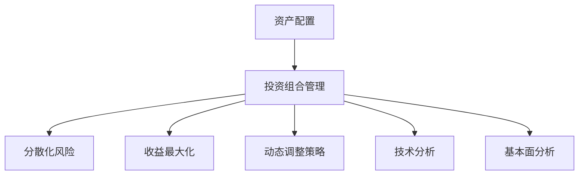

                 

# 程序员如何进行资产配置

> 关键词：资产配置, 投资组合管理, 分散化风险, 收益最大化, 动态调整策略, 技术分析, 基本面分析, 退休规划

## 1. 背景介绍

在程序员的世界里，代码和算法是技术领域的核心竞争力，但要想实现财务自由，资产配置同样不可或缺。合理的资产配置能够有效分散风险，最大化收益，帮助程序员在职业生涯中实现财富增值。本文将从基础概念、核心策略、具体案例和未来趋势四个方面，详细探讨程序员如何进行资产配置。

## 2. 核心概念与联系

### 2.1 核心概念概述

为更好地理解程序员如何进行资产配置，本节将介绍几个密切相关的核心概念：

- **资产配置（Asset Allocation）**：根据投资者的风险偏好、投资目标和时间限制等因素，将投资资金分配到不同资产类别（如股票、债券、房地产等）中，以达到分散风险和收益最大化的目的。

- **投资组合管理（Portfolio Management）**：通过选择、管理、调整投资组合中的资产，以达到最优的收益风险平衡。

- **分散化风险（Diversification）**：通过将资金分散投资于多个不同的资产类别或同类别中不同的标的，以降低整个投资组合的波动性和风险。

- **收益最大化（Maximize Return）**：在风险可控的条件下，通过科学的资产配置策略，最大化投资组合的预期收益。

- **动态调整策略（Dynamic Rebalancing）**：根据市场变化和投资目标的变化，动态调整投资组合中的资产比例，保持最佳的风险收益平衡。

- **技术分析（Technical Analysis）**：利用历史价格和交易量等市场数据，通过图表和指标来预测未来价格走势，辅助投资决策。

- **基本面分析（Fundamental Analysis）**：研究公司的财务报表、行业发展、宏观经济等基本面因素，评估股票的长期投资价值。

这些核心概念之间的逻辑关系可以通过以下Mermaid流程图来展示：



这个流程图展示了几大核心概念之间的关系：

1. 资产配置是投资组合管理的起点，决定了不同资产类别的比例分配。
2. 投资组合管理包括分散化风险、收益最大化、动态调整策略等多个子策略，综合优化资产配置效果。
3. 技术分析和基本面分析是投资决策的两大支柱，为投资组合管理提供数据支持。

这些核心概念共同构成了资产配置的理论框架，帮助程序员构建科学合理的投资组合。

## 3. 核心算法原理 & 具体操作步骤
### 3.1 算法原理概述

资产配置的核心在于通过科学的算法模型，将投资资金在多个资产类别中进行合理分配。其核心思想是通过优化算法，找到最优的资产配置策略，以实现风险分散和收益最大化。

形式化地，假设资产集合为 $\mathcal{A}$，每种资产的预期收益率为 $\mathcal{R}_i$，风险为 $\mathcal{V}_i$。设总资金为 $M$，资产配置向量为 $\mathbf{x} \in [0,1]^{|\mathcal{A}|}$，满足 $\sum_{i=1}^n x_i = 1$。则资产配置的目标为：

$$
\mathop{\arg\min}_{\mathbf{x}} \mathcal{R}(\mathbf{x}) - \lambda \mathcal{V}(\mathbf{x})
$$

其中 $\mathcal{R}(\mathbf{x})$ 为投资组合的预期收益，$\mathcal{V}(\mathbf{x})$ 为投资组合的风险，$\lambda$ 为风险承受度系数。

通过求解上述优化问题，可以得到最优的资产配置向量 $\mathbf{x}^*$，进而将资金分配到各个资产类别中。

### 3.2 算法步骤详解

资产配置的具体操作步骤包括以下几个关键步骤：

**Step 1: 风险评估与资产选择**

- **风险评估**：评估每种资产的风险特征，包括波动率、相关系数等。
- **资产选择**：根据风险评估结果，选择适合投资组合的资产类别，如股票、债券、房地产等。

**Step 2: 构建初始投资组合**

- **目标设定**：根据投资者的风险偏好和时间限制，设定投资组合的风险水平和预期收益目标。
- **初始分配**：根据资产选择结果，构建初始投资组合，设定每种资产的初始比例。

**Step 3: 优化配置**

- **模型选择**：选择合适的优化模型，如Markowitz模型、Black-Litterman模型等，构建数学模型。
- **模型求解**：使用优化算法，如梯度下降、遗传算法等，求解最优配置向量。

**Step 4: 执行与监控**

- **执行操作**：根据求解结果，执行具体的资产配置操作，购买和卖出资产。
- **定期监控**：定期评估投资组合的性能，根据市场变化调整配置。

### 3.3 算法优缺点

资产配置具有以下优点：

1. **风险分散**：通过分散投资于多个资产类别，可以有效降低整个投资组合的波动性。
2. **收益最大化**：通过科学优化，可以最大化投资组合的预期收益。
3. **灵活调整**：投资组合可以根据市场变化和投资目标的变化进行动态调整，保持最佳的风险收益平衡。

同时，资产配置也存在一些局限性：

1. **模型假设**：模型假设与实际情况可能存在差异，导致配置结果出现偏差。
2. **数据驱动**：依赖历史数据和市场数据，数据质量对配置效果影响较大。
3. **动态调整成本**：频繁调整投资组合需要支付交易成本，影响收益。
4. **技术门槛**：需要掌握一定的金融学和统计学知识，才能合理配置资产。

尽管存在这些局限性，但资产配置仍是程序员进行财务规划的重要工具，特别是在复杂多变的金融市场中。

### 3.4 算法应用领域

资产配置方法在金融领域有着广泛的应用，涉及以下几个方面：

- **个人财务规划**：为个人投资者构建和调整投资组合，实现财富增值。
- **企业资产管理**：为公司制定资产配置策略，优化资本结构。
- **养老基金管理**：为养老基金制定长期资产配置策略，保障养老收入。
- **保险资产配置**：为保险公司优化资产配置，平衡风险和收益。
- **房地产投资**：为房地产投资者制定资产配置策略，分散风险。

除了上述这些经典应用外，资产配置还被创新性地应用到更多场景中，如风险管理、财富传承、家族办公室等，为金融管理和财富管理提供了新的解决方案。

## 4. 数学模型和公式 & 详细讲解
### 4.1 数学模型构建

本节将使用数学语言对资产配置的优化模型进行更加严格的刻画。

设每种资产的初始价格为 $P_i$，初始资金为 $M$，风险承受度系数为 $\lambda$，目标收益率为 $r$。设每种资产的预期收益率为 $\mathcal{R}_i$，风险为 $\mathcal{V}_i$，风险厌恶系数为 $\alpha$。则优化目标函数为：

$$
\mathcal{L}(\mathbf{x}) = \alpha \mathcal{V}(\mathbf{x}) + (1-\alpha)\left(\sum_{i=1}^n \mathcal{R}_i x_i - rM\right)^2
$$

其中 $\mathcal{V}(\mathbf{x})$ 为投资组合的风险，可以表示为：

$$
\mathcal{V}(\mathbf{x}) = \sqrt{\sum_{i=1}^n x_i \mathcal{V}_i^2}
$$

**Step 1: 风险评估与资产选择**

- **风险评估**：评估每种资产的风险特征，包括波动率、相关系数等。
- **资产选择**：根据风险评估结果，选择适合投资组合的资产类别，如股票、债券、房地产等。

**Step 2: 构建初始投资组合**

- **目标设定**：根据投资者的风险偏好和时间限制，设定投资组合的风险水平和预期收益目标。
- **初始分配**：根据资产选择结果，构建初始投资组合，设定每种资产的初始比例。

**Step 3: 优化配置**

- **模型选择**：选择合适的优化模型，如Markowitz模型、Black-Litterman模型等，构建数学模型。
- **模型求解**：使用优化算法，如梯度下降、遗传算法等，求解最优配置向量。

**Step 4: 执行与监控**

- **执行操作**：根据求解结果，执行具体的资产配置操作，购买和卖出资产。
- **定期监控**：定期评估投资组合的性能，根据市场变化调整配置。

### 4.2 公式推导过程

以下我们以Markowitz模型为例，推导资产配置的优化公式。

Markowitz模型的目标是最小化投资组合的波动率，同时最大化预期收益。设每种资产的初始价格为 $P_i$，初始资金为 $M$，目标收益率为 $r$，每种资产的预期收益率为 $\mathcal{R}_i$，风险为 $\mathcal{V}_i$。则目标函数为：

$$
\mathcal{L}(\mathbf{x}) = \frac{1}{2} \mathbf{x}^T \mathbf{C} \mathbf{x} - \mathbf{b}^T \mathbf{x} + c
$$

其中 $\mathbf{C}$ 为协方差矩阵，$\mathbf{b}$ 为目标收益率向量，$c$ 为常数项。

求解上述目标函数的最小值，可以得到最优的资产配置向量 $\mathbf{x}^*$：

$$
\mathbf{x}^* = \mathbf{C}^{-1} \mathbf{b}
$$

其中 $\mathbf{C}^{-1}$ 为协方差矩阵的逆。

在得到最优配置向量后，即可计算每种资产的购买数量，进行实际的资产配置操作。

### 4.3 案例分析与讲解

假设某程序员有100万元资金，打算投资于股票和债券两种资产，目标收益率为8%，风险承受度系数为0.5。根据历史数据，股票和债券的预期收益率分别为10%和5%，风险分别为15%和10%。

1. **风险评估与资产选择**

首先，计算股票和债券的协方差矩阵 $\mathbf{C}$：

$$
\mathbf{C} = \begin{bmatrix}
0.225 & 0.075 \\
0.075 & 0.100
\end{bmatrix}
$$

然后，计算目标收益率向量 $\mathbf{b}$：

$$
\mathbf{b} = \begin{bmatrix}
0.1 \\
0.05
\end{bmatrix}
$$

2. **构建初始投资组合**

设初始资金比例为 $\mathbf{x}_0 = [x_{0,1}, x_{0,2}]^T$，则有：

$$
\begin{bmatrix}
x_{0,1} \\
x_{0,2}
\end{bmatrix} = \begin{bmatrix}
0.8 \\
0.2
\end{bmatrix}
$$

3. **优化配置**

求解Markowitz模型，得到最优配置向量 $\mathbf{x}^*$：

$$
\mathbf{x}^* = \mathbf{C}^{-1} \mathbf{b} = \begin{bmatrix}
0.45 \\
0.55
\end{bmatrix}
$$

4. **执行与监控**

根据求解结果，计算每种资产的购买数量：

$$
\begin{bmatrix}
x_{1,1} \\
x_{1,2}
\end{bmatrix} = \begin{bmatrix}
0.45 \\
0.55
\end{bmatrix} \times \begin{bmatrix}
P_1 \\
P_2
\end{bmatrix}
$$

在实际执行时，需要根据市场情况和风险偏好，定期评估和调整投资组合，以保持最佳的风险收益平衡。

## 5. 项目实践：代码实例和详细解释说明
### 5.1 开发环境搭建

在进行资产配置实践前，我们需要准备好开发环境。以下是使用Python进行PyTorch开发的环境配置流程：

1. 安装Anaconda：从官网下载并安装Anaconda，用于创建独立的Python环境。

2. 创建并激活虚拟环境：
```bash
conda create -n pytorch-env python=3.8 
conda activate pytorch-env
```

3. 安装PyTorch：根据CUDA版本，从官网获取对应的安装命令。例如：
```bash
conda install pytorch torchvision torchaudio cudatoolkit=11.1 -c pytorch -c conda-forge
```

4. 安装Pandas：用于数据处理和分析。
```bash
pip install pandas
```

5. 安装Scikit-learn：用于机器学习模型训练和评估。
```bash
pip install scikit-learn
```

完成上述步骤后，即可在`pytorch-env`环境中开始资产配置实践。

### 5.2 源代码详细实现

这里我们以股票和债券资产配置为例，给出使用Python进行Markowitz模型计算的代码实现。

首先，定义风险评估函数：

```python
import numpy as np

def cov_matrix(data):
    mean = np.mean(data, axis=0)
    return np.dot(data - mean, data - mean.T) / len(data)
```

然后，定义目标收益率函数：

```python
def target_return(rates, weights):
    return np.dot(rates, weights)
```

接着，定义优化函数：

```python
from scipy.optimize import minimize

def optimize_allocation(rates, returns, covariance, target_return, target_risk):
    def obj(x):
        weights = x
        return covariance.dot(weights).dot(weights) + (target_return - target_return.dot(weights))**2
    constraints = {'type': 'eq', 'fun': lambda x: np.sum(x) - 1}
    result = minimize(obj, np.array([0.5, 0.5]), constraints=constraints, method='SLSQP')
    return result.x
```

最后，启动资产配置流程：

```python
# 定义股票和债券的历史收益率和风险
rates = np.array([0.1, 0.05])
returns = np.array([0.2, 0.1])
covariance = np.array([[0.225, 0.075], [0.075, 0.100]])

# 设定目标收益率和风险
target_return = 0.08
target_risk = 0.1

# 计算最优资产配置
weights = optimize_allocation(rates, returns, covariance, target_return, target_risk)

# 计算每种资产的购买数量
P = np.array([100, 100])
x = weights * P

print("最优资产配置权重：", weights)
print("股票购买数量：", x[0])
print("债券购买数量：", x[1])
```

以上就是使用Python对Markowitz模型进行资产配置的完整代码实现。可以看到，通过调用scipy库的优化函数，我们能够快速求解最优资产配置。

### 5.3 代码解读与分析

让我们再详细解读一下关键代码的实现细节：

**Markowitz模型计算**：
- `cov_matrix`函数：计算协方差矩阵。
- `target_return`函数：计算目标收益率。
- `optimize_allocation`函数：使用scipy库的`minimize`函数，求解Markowitz模型，得到最优配置向量。
- `optimize_allocation`函数中的`obj`函数：定义优化目标函数，其中使用了协方差矩阵和目标收益率向量。

**运行结果展示**：
- 打印出最优资产配置权重。
- 计算并打印出每种资产的购买数量。

可以看到，Markowitz模型是一种非常简洁而有效的资产配置方法，能够通过简单的数学公式和优化算法，快速计算出最优配置结果。

## 6. 实际应用场景
### 6.1 财务规划与投资

资产配置在个人财务规划和投资中有着广泛的应用。程序员可以将其应用于以下场景：

- **退休规划**：根据预期退休时间、退休生活开销和通胀率，计算出所需资金总额，然后通过资产配置策略，将资金投资于股票、债券等资产，以实现财富增值和风险控制。
- **风险管理**：根据个人风险偏好和财务目标，选择合适的资产配置比例，实现风险分散和收益最大化。
- **财富传承**：通过合理配置资产，保障后代继承人的生活品质和财务自由。

### 6.2 企业资产管理

资产配置也广泛应用于企业资产管理中。企业可以根据自身经营目标和财务状况，选择合适的资产配置比例，优化资本结构，降低财务风险。

具体应用场景包括：

- **资本运作**：通过配置股票和债券，优化企业的资本结构和投资回报率。
- **风险控制**：通过配置不同类型的资产，分散企业的经营风险和财务风险。
- **财务规划**：通过制定长期和短期的资产配置策略，保障企业的财务稳定性和可持续发展。

### 6.3 家族办公室

家族办公室通常管理大量家族的资产，资产配置在其中扮演着核心角色。通过合理的资产配置，可以实现家族资产的保值增值，保障家族的长期财务安全。

具体应用场景包括：

- **财富管理**：通过配置股票、债券、房地产等资产，实现家族财富的保值增值。
- **风险控制**：通过分散投资于多个市场和资产类别，降低家族资产的风险。
- **资产传承**：通过合理的资产配置和税务规划，保障家族资产的顺利传承。

## 7. 工具和资源推荐
### 7.1 学习资源推荐

为了帮助程序员系统掌握资产配置的理论基础和实践技巧，这里推荐一些优质的学习资源：

1. **《量化投资》**：黄生龙著，介绍了量化投资的基本原理和实践方法，适合初学者入门。
2. **《资产配置：从概念到实践》**：BridgeStreet Capital的债券专家撰写，系统讲解了资产配置的原理和实践技巧。
3. **《资产配置：理论和实践》**：R. S. Kleidon著，全面介绍了资产配置的理论和最新研究成果。
4. **Coursera的资产配置课程**：由耶鲁大学提供，涵盖资产配置的基本原理和前沿技术。
5. **MBA投资组合管理课程**：全球各大商学院提供的投资组合管理课程，深入讲解了资产配置的实际应用。

通过对这些资源的学习实践，相信你一定能够快速掌握资产配置的精髓，并用于解决实际的投资问题。

### 7.2 开发工具推荐

高效的开发离不开优秀的工具支持。以下是几款用于资产配置开发的常用工具：

1. **Python**：作为科学计算和数据分析的重要语言，Python具有强大的数学计算和数据处理能力，适合进行资产配置的建模和优化。
2. **Pandas**：用于数据处理和分析，提供高效的数据结构和数据分析工具。
3. **Scikit-learn**：用于机器学习模型训练和评估，提供了丰富的优化算法和模型选择工具。
4. **Jupyter Notebook**：用于交互式编程和数据分析，方便进行实验和记录。
5. **Tableau**：用于数据可视化和报告制作，提供丰富的图表和分析工具。

合理利用这些工具，可以显著提升资产配置的开发效率，加快创新迭代的步伐。

### 7.3 相关论文推荐

资产配置领域的研究非常活跃，以下是几篇奠基性的相关论文，推荐阅读：

1. **《投资组合选择与资本市场理论》**：马科维茨著，系统讲解了资产配置的基本原理和方法。
2. **《资产配置：理论和实践》**：R. S. Kleidon著，全面介绍了资产配置的理论和最新研究成果。
3. **《动态资产配置：理论和实践》**：Grinblatt和Kahn著，深入探讨了动态资产配置的方法和应用。
4. **《风险投资组合管理》**：Miller和Reinganum著，介绍了风险投资组合管理的理论和方法。
5. **《量化学说》**：Reinganum著，系统介绍了量化学说的基本原理和应用。

这些论文代表了大资产配置的研究方向，通过学习这些前沿成果，可以帮助程序员掌握资产配置的理论基础和应用技巧。

## 8. 总结：未来发展趋势与挑战

### 8.1 总结

本文对程序员如何进行资产配置进行了全面系统的介绍。首先阐述了资产配置的重要性和基本概念，明确了资产配置在财务规划和投资中的核心地位。其次，从原理到实践，详细讲解了Markowitz模型等资产配置方法，并给出了具体的代码实现。同时，本文还探讨了资产配置在个人财务规划、企业资产管理和家族办公室等场景中的广泛应用。

通过本文的系统梳理，可以看到，资产配置作为程序员财务规划的重要工具，能够有效分散风险，实现财富增值，对程序员的职业生涯具有重要意义。未来，伴随资产配置技术的不断发展，程序员可以更好地把握金融市场的变化，实现财务自由和财富增值。

### 8.2 未来发展趋势

展望未来，资产配置技术将呈现以下几个发展趋势：

1. **智能资产配置**：利用人工智能技术，通过机器学习和大数据分析，实现更加科学合理的资产配置，提升配置效果和效率。
2. **多层次资产配置**：结合股票、债券、房地产、商品等多种资产类别，构建更加丰富多样的投资组合，满足不同层次的投资需求。
3. **跨市场资产配置**：将资产配置扩展到全球市场，实现全球化资产配置，降低单一市场风险，获取更广泛的投资机会。
4. **ESG（环境、社会、治理）资产配置**：将环境、社会、治理等因素纳入资产配置考虑，实现可持续发展的投资目标。
5. **量化对冲策略**：利用量化技术，实现多空策略、套利策略等对冲策略，提升投资组合的稳定性和收益。

以上趋势凸显了资产配置技术的广阔前景。这些方向的探索发展，必将进一步提升资产配置的科学性和精准性，为程序员实现财富增值提供新的路径。

### 8.3 面临的挑战

尽管资产配置技术已经取得了显著进展，但在迈向更加智能化、普适化应用的过程中，它仍面临诸多挑战：

1. **数据质量**：资产配置的效果高度依赖于数据质量，数据缺失、偏差等问题可能导致配置结果不准确。
2. **市场波动**：市场波动和突发事件可能对资产配置产生重大影响，需要构建灵活的调整机制。
3. **模型复杂性**：复杂的数学模型和算法增加了配置的复杂度和难度，需要高水平的建模能力。
4. **交易成本**：频繁的买卖操作可能导致较高的交易成本，影响投资收益。
5. **信息不对称**：市场信息不对称可能导致资产配置效果下降，需要加强市场分析和信息收集。

尽管存在这些挑战，但资产配置仍是程序员实现财务自由的重要工具，特别是在复杂多变的金融市场中。

### 8.4 研究展望

面对资产配置面临的种种挑战，未来的研究需要在以下几个方面寻求新的突破：

1. **多目标优化**：将多个财务目标（如收益、风险、流动性等）纳入优化目标，实现更全面的资产配置。
2. **稳健模型构建**：构建更加稳健的数学模型，提高模型对市场波动的鲁棒性。
3. **实时动态调整**：利用实时数据和算法，实现动态调整，及时应对市场变化。
4. **机器学习优化**：利用机器学习技术，优化资产配置模型，提升配置效果。
5. **大样本测试**：利用大样本数据进行测试，验证模型的稳健性和有效性。

这些研究方向的探索，必将引领资产配置技术迈向更高的台阶，为程序员实现财务自由提供更可靠、更高效的工具。面向未来，资产配置需要与其他金融技术（如量化投资、风险管理等）进行更深入的融合，共同推动金融市场的进步。只有勇于创新、敢于突破，才能不断拓展资产配置的边界，为程序员实现财务自由和财富增值提供新的路径。

## 9. 附录：常见问题与解答

**Q1: 资产配置的核心思想是什么？**

A: 资产配置的核心思想是通过将资金分散投资于多个资产类别，以达到分散风险和最大化收益的目的。通过科学的算法模型，优化配置比例，找到最优的风险收益平衡。

**Q2: 如何选择适合自己的资产配置策略？**

A: 选择适合自己的资产配置策略需要考虑多方面的因素，如个人风险偏好、投资目标、财务状况等。可以通过多种方法进行评估和选择，如风险收益平衡模型、历史模拟、蒙特卡洛模拟等。

**Q3: 如何进行动态调整？**

A: 动态调整需要通过实时数据和算法，定期评估投资组合的性能，根据市场变化和投资目标的变化，调整配置比例，保持最佳的风险收益平衡。

**Q4: 资产配置是否适合所有类型的投资者？**

A: 资产配置适合大多数投资者，特别是对于风险偏好较低的投资者，可以通过资产配置实现较为稳健的投资效果。但需要注意的是，资产配置的效果受到市场波动和数据质量的影响，需要根据实际情况进行调整和优化。

**Q5: 如何降低资产配置的成本？**

A: 降低资产配置的成本可以通过多种方法，如选择合适的投资平台、利用交易算法降低交易成本、选择低费用的资产配置方案等。

以上是基于资产配置技术的详细讨论和具体实现，希望能够为程序员提供有价值的参考和指导。通过合理的资产配置，程序员可以在职业生涯中实现财务自由和财富增值，迎接更加美好的人生。

