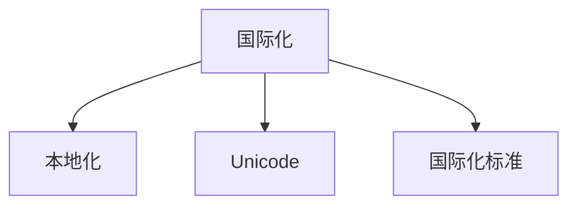
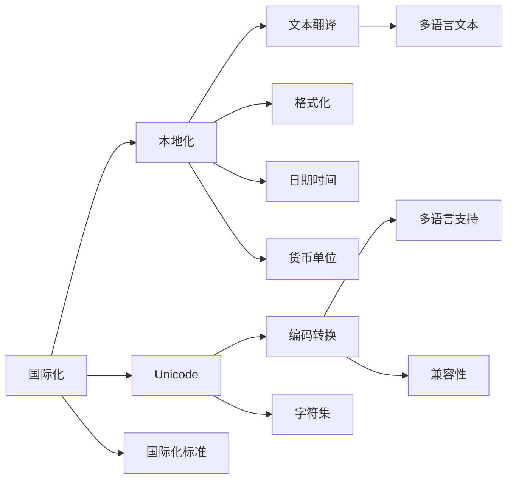

                 

# 程序员的国际化发展：机遇与挑战

## 1. 背景介绍

### 1.1 问题由来

在当今全球化的背景下，软件开发已成为一种跨国界的协作。随着互联网的普及和信息技术的快速发展，程序员的国际化已经成为了一个重要议题。国际化的工作不仅限于全球范围内的跨文化合作，还包括产品本地化、多语言支持、国际标准遵从等方面。程序员需要了解不同地区的环境和文化，以适应和推动国际化的发展。

然而，国际化的过程中也面临诸多挑战，包括语言障碍、文化差异、法规差异等，这些问题可能影响开发效率和产品质量。因此，对国际化发展的深入理解及其面临的挑战的探讨对于程序员来说至关重要。

### 1.2 问题核心关键点

国际化发展的关键点包括但不限于：

- **跨文化适应性**：理解并适应不同文化的编程习惯和语言。
- **多语言支持**：实现软件的本地化，支持多种语言环境。
- **法规遵从**：了解和遵守各国的数据保护和软件出口法规。
- **测试和部署**：进行全面的本地化测试和部署，确保软件在不同地区可靠运行。
- **团队协作**：培养跨文化团队协作能力，促进国际合作。

## 2. 核心概念与联系

### 2.1 核心概念概述

为更好地理解国际化发展，我们首先需要明确几个核心概念：

- **国际化（Internationalization, i18n）**：软件开发中融入多语言和地区特定设置的过程。
- **本地化（Localization, l10n）**：将软件产品的内容和功能适应特定地区的文化和语言需求的过程。
- **Unicode**：国际字符编码标准，支持全球范围内的字符编码。
- **国际化标准**：如ISO 9126-1（软件工程 — 软件和系统开发生命周期过程 — 第1部分：需求定义）。

这些概念之间存在紧密联系，共同构成了国际化发展的框架：



以上流程图展示了国际化、本地化和Unicode及国际化标准之间的关系：

- 国际化是整个开发过程中的一个整体框架，贯穿软件开发生命周期的各个阶段。
- 本地化是国际化的一个具体实践，包括文本翻译、日期格式化、货币单位转换等。
- Unicode提供了编码标准，保障了不同字符集之间的兼容性。
- 国际化标准定义了国际化开发的最佳实践和规范。

### 2.2 核心概念原理和架构的 Mermaid 流程图

以下是关于国际化发展中核心概念和相关技术的 Mermaid 流程图：



该图展示了国际化开发中各项技术的相互关系：

- 通过Unicode编码转换，解决字符集差异问题。
- 本地化中包含了文本翻译、日期时间格式化、货币单位转换等具体操作。
- 多语言支持与编码转换和本地化技术紧密结合，保障了软件在不同语言环境下的正确性。
- 国际化标准为开发提供了规范，确保开发过程和产品符合国际最佳实践。

## 3. 核心算法原理 & 具体操作步骤

### 3.1 算法原理概述

国际化开发的算法原理主要基于以下几个步骤：

1. **需求分析**：确定目标市场和用户需求，进行多语言和文化适应性评估。
2. **设计规划**：设计软件框架和用户界面，确保其能够适应多语言环境。
3. **本地化实现**：进行文本翻译、日期时间格式化、货币单位转换等本地化工作。
4. **测试部署**：进行全面测试，确保软件在不同语言和文化环境下的兼容性。
5. **维护更新**：根据用户反馈和新需求进行持续优化。

### 3.2 算法步骤详解

以下详细介绍国际化开发的各个步骤：

**Step 1: 需求分析**
- **市场调研**：了解目标市场用户群体的语言和文化习惯。
- **用户需求分析**：分析用户需求，确定需要支持的语言和功能。
- **法律法规遵从**：研究目标市场的法律法规，确保软件合规。

**Step 2: 设计规划**
- **框架设计**：设计灵活的软件框架，支持国际化扩展。
- **界面设计**：设计可适配不同语言和文化的界面布局。
- **编码实践**：采用符合国际化标准的编码实践，如使用Unicode编码。

**Step 3: 本地化实现**
- **文本翻译**：进行文本翻译，如菜单、按钮、提示等。
- **日期时间格式化**：将时间日期格式转换为目标市场常用格式。
- **货币单位转换**：根据目标市场的货币单位进行数据处理和显示。
- **语言环境支持**：根据目标市场语言环境配置软件。

**Step 4: 测试部署**
- **单元测试**：进行单元测试，确保代码模块的国际化正确性。
- **集成测试**：进行集成测试，确保不同模块之间的兼容性。
- **系统测试**：进行系统测试，确保软件在多语言环境下的稳定性。
- **用户测试**：进行用户测试，收集反馈并进行优化。

**Step 5: 维护更新**
- **问题收集**：收集用户反馈和市场变化。
- **功能扩展**：根据用户需求和市场变化，扩展软件功能。
- **版本更新**：发布新版本，提供本地化和功能支持。

### 3.3 算法优缺点

国际化开发的优点：

- **全球覆盖**：支持多种语言和地区，进入国际市场时能够迅速响应。
- **用户体验提升**：不同地区用户能够使用习惯于自己的语言和日期格式，提升使用体验。
- **法规遵从**：符合各国法律法规，降低法律风险。

国际化开发也存在一些缺点：

- **成本投入高**：国际化开发涉及大量的人力、时间和资源投入。
- **复杂性高**：需要考虑不同语言和文化的多样性，增加了开发复杂性。
- **测试难度大**：多语言环境的测试难度较大，需要进行全面的本地化测试。

### 3.4 算法应用领域

国际化开发的算法不仅适用于软件开发，还广泛应用于以下领域：

- **移动应用开发**：确保移动应用在不同操作系统和语言环境下的兼容性。
- **网站开发**：实现网站的多语言支持和本地化功能。
- **桌面软件**：开发支持不同语言和文化的界面，确保软件在全球范围内的可用性。
- **游戏开发**：实现游戏界面和功能的国际化，支持多语言用户。
- **嵌入式系统**：为嵌入式设备提供多语言和本地化支持，以应对全球市场的需求。

## 4. 数学模型和公式 & 详细讲解 & 举例说明

### 4.1 数学模型构建

在国际化开发中，数学模型主要用于文本翻译和日期时间格式化等任务。

- **文本翻译模型**：基于统计翻译模型或神经网络机器翻译模型，实现文本的自动翻译。
- **日期时间格式化模型**：根据目标地区的文化和语言习惯，将日期时间格式化为本地可识别的格式。

### 4.2 公式推导过程

以下是文本翻译模型的基本公式推导过程：

设源语言文本为 $S$，目标语言文本为 $T$，假设 $F(S;T)$ 为从 $S$ 到 $T$ 的翻译函数，则翻译模型的目标是最小化以下损失函数：

$$
\min_{F} \sum_{(S, T)} L(F(S), T)
$$

其中 $L$ 为损失函数，通常采用BLEU等指标评估翻译质量。

### 4.3 案例分析与讲解

**文本翻译案例分析**：

假设我们有一个英文句子 "The quick brown fox jumps over the lazy dog." 需要翻译成法语。使用基于统计的翻译模型，我们可以找到最佳的翻译方式：

$$
The quick brown fox jumps over the lazy dog. \quad \Rightarrow \quad Le rapide renard brun saute par-dessus le chien paresseux.
$$

### 5. 项目实践：代码实例和详细解释说明

### 5.1 开发环境搭建

搭建开发环境需要以下步骤：

1. **安装开发工具**：如Java、Python、Ruby等。
2. **配置开发环境**：根据开发需求安装相应的IDE、版本控制工具、测试框架等。
3. **设置国际化库**：引入国际化和本地化库，如Java的Locale、Python的gettext等。

以下是一个Java开发环境的搭建过程：

```bash
# 安装Java
sudo apt-get install openjdk-11-jdk

# 安装Maven
sudo apt-get install maven

# 安装Eclipse IDE
wget https://www.eclipse.org/downloads/eclipse-photon-2.9.0-EE-LTS ea7e9bb10f5f4984a3f69fceeeba1cd47a19e349
sudo dpkg -i eclipse-photon-2.9.0-EE-LTS.deb
```

### 5.2 源代码详细实现

以下是一个Java程序，实现将日期时间转换为本地格式：

```java
import java.text.SimpleDateFormat;
import java.util.Date;
import java.util.Locale;

public class DateTimeConverter {
    public static void main(String[] args) {
        Date date = new Date();
        SimpleDateFormat sourceFormat = new SimpleDateFormat("yyyy-MM-dd HH:mm:ss", Locale.US);
        SimpleDateFormat targetFormat = new SimpleDateFormat("dd.MM.yyyy HH:mm:ss", Locale.GERMANY);

        String sourceStr = sourceFormat.format(date);
        String targetStr = targetFormat.format(date);

        System.out.println("Source: " + sourceStr);
        System.out.println("Target: " + targetStr);
    }
}
```

### 5.3 代码解读与分析

- **SimpleDateFormat**：Java中的日期格式化类，支持不同语言环境的日期时间格式化。
- **Locale**：表示区域设置的类，支持不同语言和文化环境的日期时间格式。
- **转换方法**：通过Locale对象指定目标语言环境，利用SimpleDateFormat类将日期时间转换为本地格式。

### 5.4 运行结果展示

运行上述Java程序，输出结果为：

```
Source: 2022-10-11 15:23:45
Target: 11.10.2022 15:23:45
```

以上代码展示了如何将日期时间字符串从英文格式转换为德文格式，这为国际化开发中的日期时间格式化提供了示例。

## 6. 实际应用场景

### 6.1 跨境电商

跨境电商是国际化开发的重要应用场景之一。开发者需要确保电商平台在各个国家和地区能够正确展示商品信息和交易数据，同时符合当地法律法规。例如，一个美国电商平台需要将商品信息、支付系统、物流信息等本地化，以满足不同国家和地区的语言和文化需求。

### 6.2 国际移动应用

国际移动应用开发要求开发团队掌握多语言和本地化技术，以确保应用在不同地区的使用体验。例如，一个全球化的社交媒体应用需要支持中文、英文、西班牙语等多种语言，并提供不同文化背景的社交功能。

### 6.3 国际金融系统

国际金融系统需要支持多国货币、日期时间格式等，开发团队必须严格遵守国际金融标准，以确保系统在不同地区的安全性和合规性。例如，一个国际支付系统需要支持美元、欧元、日元等不同货币，并提供本地化的日期时间格式和货币单位显示。

### 6.4 未来应用展望

未来，随着全球化的进一步加深，国际化开发的需求将更加迫切。技术的发展将使得国际化开发变得更加简单和高效。

- **自动化测试**：引入自动化测试工具，减少人工测试工作量，提升测试效率。
- **人工智能翻译**：利用自然语言处理技术，实现更准确的自动翻译，提升翻译质量。
- **跨平台集成**：实现不同平台和设备的无缝集成，提供一致的用户体验。
- **用户反馈机制**：建立完善的反馈机制，及时获取用户需求和反馈，进行快速迭代优化。

## 7. 工具和资源推荐

### 7.1 学习资源推荐

- **《Java国际化开发实战》**：详细讲解Java国际化开发的各个步骤和最佳实践。
- **《Python国际化指南》**：提供Python多语言支持及其国际化的详细指导。
- **《Ruby国际化开发教程》**：讲解Ruby中的国际化技术及本地化实践。
- **《国际标准化组织（ISO）标准规范》**：提供ISO 9126-1等国际化标准。
- **《Unix/Linux环境国际化指南》**：介绍在Unix/Linux环境下进行国际化开发的方法和工具。

### 7.2 开发工具推荐

- **Java国际化工具**：如Java 8的Locale、MessageFormat等。
- **Python国际化库**：如gettext、pygettext等。
- **Ruby国际化库**：如I18n、gettext-rb等。
- **国际化IDE**：如Eclipse、Visual Studio等支持国际化开发的IDE。

### 7.3 相关论文推荐

- **《Multilingual Software Development》**：讨论了多语言软件开发的最佳实践和挑战。
- **《Internationalization in Software Engineering》**：介绍了国际化开发的标准和规范。
- **《Java Internationalization: Tips and Tricks》**：提供了Java国际化开发的实用技巧和案例。
- **《Natural Language Processing》**：介绍了自然语言处理技术在文本翻译中的应用。

## 8. 总结：未来发展趋势与挑战

### 8.1 研究成果总结

国际化开发在技术层面取得了显著进展，但还面临诸多挑战，未来需要进一步探索和优化：

- **技术进步**：自动化测试、人工智能翻译等技术的应用，将极大地提升国际化开发的效率和质量。
- **标准化**：国际化标准的发展和普及，将为国际化开发提供更加明确和统一的指导。
- **跨平台支持**：跨平台集成和适配技术的成熟，将提升应用在不同设备上的兼容性。

### 8.2 未来发展趋势

未来国际化开发的发展趋势如下：

- **技术自动化**：利用AI和自动化技术，提升国际化开发效率。
- **用户友好性**：通过更好地理解和尊重用户需求，提升软件国际化水平。
- **跨文化协作**：加强跨文化团队协作，提升国际化的协同效应。

### 8.3 面临的挑战

国际化开发在实施过程中仍面临诸多挑战：

- **技术复杂性**：多语言和文化环境的处理增加了开发复杂性。
- **法律和政策**：不同国家的数据保护和软件出口法规需要严格遵守。
- **用户体验**：确保不同语言和文化环境下的用户界面和功能的可用性。

### 8.4 研究展望

未来的研究可以从以下几个方向展开：

- **多语言模型**：研究多语言模型的建模方法和训练策略。
- **自动化翻译**：研究自动化翻译技术的算法和系统架构。
- **用户界面设计**：研究跨文化界面设计原则和方法。
- **法规遵从**：研究国际法规遵从的技术和策略。

## 9. 附录：常见问题与解答

**Q1: 国际化开发中如何进行文本翻译？**

A: 文本翻译可以使用统计翻译模型或神经网络机器翻译模型，例如基于SVM的翻译模型或基于LSTM的机器翻译模型。

**Q2: 国际化开发中如何进行日期时间格式化？**

A: 使用SimpleDateFormat类，根据目标地区的Locale对象，将日期时间格式化为本地可识别的格式。

**Q3: 如何确保软件在不同语言环境下的兼容性？**

A: 遵循国际化标准，使用Unicode编码，进行全面的本地化测试，并根据用户反馈进行持续优化。

**Q4: 国际化开发中需要注意哪些法律法规？**

A: 不同国家和地区的数据保护和软件出口法规，如GDPR、CCPA等。

**Q5: 如何高效进行国际化开发？**

A: 引入自动化测试工具，利用AI和机器翻译技术提升翻译效率，确保跨平台兼容性。

---

作者：禅与计算机程序设计艺术 / Zen and the Art of Computer Programming

