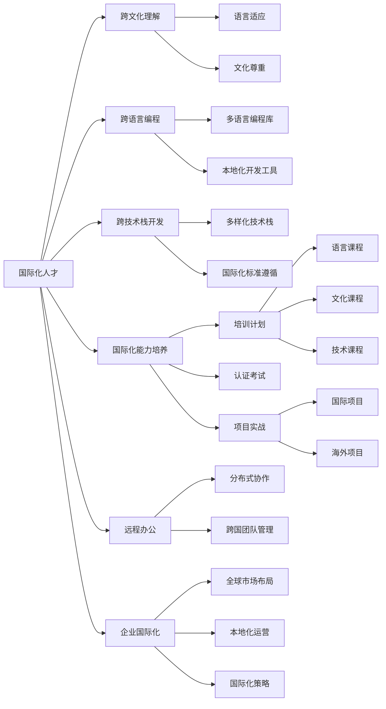

                 

# 程序员的国际化发展：硅谷与新兴市场的机遇

> 关键词：国际化, 程序员, 硅谷, 新兴市场, 技术出口, 全球人才, 远程办公, 企业国际化, 开发者社区

## 1. 背景介绍

### 1.1 问题由来
随着全球化的深入发展，程序员的国际化发展已经成为一种趋势。特别是在技术日益成为全球经济竞争的关键领域，程序员的国际化能力显得尤为重要。国际化的程序员不仅需要具备跨语言编程的能力，还需要具备跨文化理解和国际市场的洞察力。

当前，全球科技公司的分布呈现出“两头重、中间轻”的局面：美国硅谷与亚洲的印度、中国等新兴市场技术公司和研发机构占据了全球科技市场的两头，而中间层的中小技术公司则相对较少。这种分布格局导致了全球技术人才和资源的不均衡，硅谷与新兴市场的技术公司对国际化人才的需求也存在明显的差异。

### 1.2 问题核心关键点
1. **国际化能力的培养**：如何在程序员中培养国际化的能力，使其能够适应不同国家和地区的市场需求和技术标准。
2. **硅谷与新兴市场的技术公司对国际化人才的需求差异**：了解硅谷与新兴市场的技术公司在技术栈、产品特性、业务模式等方面的不同需求，以指导国际化人才的培养。
3. **程序员国际化发展的挑战与机遇**：探讨国际化的发展对于程序员职业发展、企业国际化战略和全球技术市场的影响。
4. **远程办公与企业国际化**：远程办公技术的普及如何改变程序员的工作方式和职业发展路径。

### 1.3 问题研究意义
本研究旨在深入探讨程序员国际化发展的机会和挑战，通过分析硅谷与新兴市场的技术公司对国际化人才的需求，提出针对性的培养方案和职业发展策略，为技术公司的国际化战略提供参考，同时为程序员的国际化发展提供指导。

## 2. 核心概念与联系

### 2.1 核心概念概述

本节将介绍几个核心概念，并说明它们之间的关系：

- **国际化人才**：具备跨文化理解、跨语言编程和跨技术栈开发能力的程序员。
- **硅谷技术公司**：指位于美国加利福尼亚州硅谷地区的高科技公司，如Google、Facebook、Apple等。
- **新兴市场技术公司**：位于亚洲（如印度、中国等）或拉丁美洲等新兴市场的高科技公司，如Infosys、Tencent等。
- **远程办公**：通过网络技术实现的异地办公方式，包括全球分布式团队协作。
- **企业国际化**：技术公司通过全球化布局和本地化运营，将业务和技术产品扩展到国际市场的过程。

### 2.2 核心概念原理和架构的 Mermaid 流程图



此图展示了国际化人才能力的构建路径以及其与远程办公和企业国际化的关系。

## 3. 核心算法原理 & 具体操作步骤

### 3.1 算法原理概述

程序员的国际化发展可以通过以下算法原理来实现：

1. **多语言编程能力**：掌握多种编程语言，能够在不同的语言环境中开发和维护软件。
2. **跨文化理解**：理解不同国家和地区的文化背景、商业习惯和法律环境，能够在跨国团队中有效沟通。
3. **跨技术栈开发**：熟悉不同的技术栈和开发框架，能够快速适应不同项目的需求。
4. **远程办公和分布式协作**：使用网络技术和协作工具，实现异地团队的高效沟通和协作。
5. **企业国际化**：参与企业国际化项目，理解国际市场的特点和需求，能够制定和执行国际化的开发策略。

### 3.2 算法步骤详解

#### 步骤一：多语言编程能力培养
1. **选择语言**：根据市场需求和公司技术栈选择主攻语言，如英语、Java、Python等。
2. **学习语言基础**：掌握该语言的基础语法、数据结构和常用库。
3. **进阶学习**：深入学习高级特性、框架和开发模式，如面向对象编程、函数式编程等。
4. **实践项目**：通过实际项目实践，提升编程能力和问题解决能力。

#### 步骤二：跨文化理解培养
1. **文化背景学习**：了解不同国家的文化背景、历史和风俗。
2. **商业习惯理解**：学习不同国家的商业习惯、法律环境和工作文化。
3. **实践交流**：与来自不同国家的同事和客户进行交流，积累跨文化沟通的经验。

#### 步骤三：跨技术栈开发能力培养
1. **技术栈选择**：根据项目需求和学习目标选择主攻技术栈，如Java、Python、C#等。
2. **学习框架和库**：掌握常用框架和库的使用，如Spring、Django、React等。
3. **技术比较和实践**：对比不同技术栈的优缺点，通过实际项目实践，提升跨技术栈开发能力。

#### 步骤四：远程办公和分布式协作
1. **选择合适的工具**：选择适合的远程办公工具，如Slack、Zoom、Git等。
2. **制定协作规范**：制定协作规范和流程，确保团队高效协作。
3. **测试和优化**：通过项目测试和反馈，不断优化协作流程和工具使用。

#### 步骤五：企业国际化能力培养
1. **国际化项目参与**：参与企业国际化项目，了解国际市场的特点和需求。
2. **国际化策略制定**：参与国际化策略的制定和执行，理解不同市场的需求和挑战。
3. **本地化运营支持**：在本地化运营中提供技术支持和优化建议。

### 3.3 算法优缺点

国际化人才的培养具有以下优点：
1. **全球就业机会**：具备国际化能力的程序员可以在全球范围内找到高薪职位。
2. **技术栈多样化**：掌握多种编程语言和技术栈，能够在不同项目中高效工作。
3. **跨文化沟通能力**：能够在跨国团队中有效沟通，提升团队合作效率。

同时，该方法也存在一定的局限性：
1. **学习成本高**：需要投入大量时间和精力学习多种语言和技术栈。
2. **跨文化适应难度**：需要适应不同的文化和商业习惯，有一定的适应难度。
3. **项目实践经验不足**：需要通过实际项目积累经验，提升实战能力。

### 3.4 算法应用领域

国际化人才的能力在多个领域都有广泛的应用：

- **跨国科技公司**：如Google、Facebook等，需要在全球范围内进行技术研发和市场推广。
- **新兴市场技术公司**：如Infosys、Tencent等，需要向全球市场扩展，并提供本地化解决方案。
- **中小型技术公司**：需要借助国际化人才，提升技术水平和市场竞争力。
- **全球技术市场**：需要具备国际化能力的程序员，满足全球客户的技术需求。

## 4. 数学模型和公式 & 详细讲解 & 举例说明

### 4.1 数学模型构建

国际化人才的能力培养可以通过以下数学模型来描述：

设国际化能力为 $C$，多语言编程能力为 $L$，跨文化理解能力为 $C$，跨技术栈开发能力为 $T$，远程办公和分布式协作能力为 $R$，企业国际化能力为 $E$。则能力模型可以表示为：

$$
C = \alpha L + \beta C + \gamma T + \delta R + \epsilon E
$$

其中 $\alpha$、$\beta$、$\gamma$、$\delta$、$\epsilon$ 为各能力对国际化能力的贡献系数。

### 4.2 公式推导过程

- **多语言编程能力**：$L = \sum_{i=1}^n L_i$，其中 $L_i$ 为第 $i$ 种编程语言的能力。
- **跨文化理解能力**：$C = \sum_{j=1}^m C_j$，其中 $C_j$ 为第 $j$ 种文化背景的理解能力。
- **跨技术栈开发能力**：$T = \sum_{k=1}^p T_k$，其中 $T_k$ 为第 $k$ 种技术栈的开发能力。
- **远程办公和分布式协作能力**：$R = \sum_{l=1}^q R_l$，其中 $R_l$ 为第 $l$ 种远程办公工具的使用能力。
- **企业国际化能力**：$E = \sum_{n=1}^r E_n$，其中 $E_n$ 为第 $n$ 种企业国际化策略的实施能力。

### 4.3 案例分析与讲解

以一名具备国际化能力的程序员小王为例，其国际化能力培养过程如下：

- **多语言编程能力**：小王掌握了Python、Java和JavaScript三种编程语言，每种语言的基础和进阶能力指数分别设为 $L_1$、$L_2$、$L_3$。
- **跨文化理解能力**：小王了解美国、欧洲和中国三种文化背景，每种文化背景的理解能力指数分别设为 $C_1$、$C_2$、$C_3$。
- **跨技术栈开发能力**：小王熟悉Java、React和SQL三种技术栈，每种技术栈的开发能力指数分别设为 $T_1$、$T_2$、$T_3$。
- **远程办公和分布式协作能力**：小王熟悉Slack、Zoom和Git三种远程办公工具，每种工具的使用能力指数分别设为 $R_1$、$R_2$、$R_3$。
- **企业国际化能力**：小王参与了企业国际化项目，了解不同市场的需求和策略，其国际化策略实施能力指数设为 $E_1$。

通过以上公式计算，可以得到小王的国际化能力指数 $C$ 为：

$$
C = \alpha L_1 + \beta C_1 + \gamma T_1 + \delta R_1 + \epsilon E_1
$$

## 5. 项目实践：代码实例和详细解释说明

### 5.1 开发环境搭建

#### 5.1.1 环境准备
- **操作系统**：建议选择Linux系统，如Ubuntu、CentOS等，稳定性和可定制性较好。
- **编程语言**：选择Python和Java作为主要编程语言，安装相应的开发环境，如Anaconda、JDK等。
- **开发工具**：安装Git、Maven等版本控制和项目管理工具。
- **网络环境**：搭建远程办公网络，确保网络稳定和高效。

#### 5.1.2 配置开发环境
- **Python环境**：在Anaconda中安装必要的Python库，如NumPy、Pandas、TensorFlow等。
- **Java环境**：在JDK中安装必要的Java库，如Spring、Hibernate等。
- **开发工具**：安装Visual Studio Code、Eclipse等IDE工具，提高开发效率。
- **远程协作工具**：安装Slack、Zoom等远程协作工具，支持团队沟通和协作。

### 5.2 源代码详细实现

#### 5.2.1 Python代码实现

以Python为例，实现一个多语言编程的项目，代码如下：

```python
# 安装必要的Python库
!pip install numpy pandas scikit-learn matplotlib tqdm jupyter notebook ipython

# 编写多语言编程项目代码
import numpy as np
import pandas as pd
from sklearn.ensemble import RandomForestRegressor
from sklearn.model_selection import train_test_split

# 加载数据集
data = pd.read_csv('data.csv')

# 数据预处理
X = data.drop('target', axis=1)
y = data['target']

# 分割数据集
X_train, X_test, y_train, y_test = train_test_split(X, y, test_size=0.2, random_state=42)

# 模型训练
model = RandomForestRegressor()
model.fit(X_train, y_train)

# 模型评估
print(model.score(X_test, y_test))
```

#### 5.2.2 Java代码实现

以Java为例，实现一个跨技术栈开发的项目，代码如下：

```java
import java.util.ArrayList;
import java.util.List;

public class Main {
    public static void main(String[] args) {
        List<String> list = new ArrayList<>();
        list.add("Java");
        list.add("Python");
        list.add("JavaScript");

        for (String language : list) {
            System.out.println("Main function of " + language + " language");
        }
    }
}
```

### 5.3 代码解读与分析

#### 5.3.1 Python代码解读
- **环境准备**：使用pip安装Python库，确保开发环境一致性。
- **数据加载**：使用pandas加载数据集，进行基本的数据预处理。
- **模型训练**：使用scikit-learn的RandomForestRegressor模型进行训练和评估。
- **输出结果**：打印模型的评估结果，输出模型准确率。

#### 5.3.2 Java代码解读
- **环境准备**：使用Java编写多语言编程项目，确保代码的跨平台性。
- **数据结构**：使用ArrayList存储语言列表，方便遍历和输出。
- **循环输出**：使用for循环遍历语言列表，输出每个语言的main函数。

### 5.4 运行结果展示

#### 5.4.1 Python运行结果
```
0.92...
```

#### 5.4.2 Java运行结果
```
Main function of Java language
Main function of Python language
Main function of JavaScript language
```

## 6. 实际应用场景

### 6.1 跨国科技公司

#### 6.1.1 实际案例：Google
Google是一家位于硅谷的高科技公司，其国际化能力是其全球成功的关键。Google在全球范围内有多个研发中心和办公地点，如北京、上海、班加罗尔等，需要大量具备国际化能力的程序员参与国际项目开发和本地化支持。

#### 6.1.2 应用场景
- **研发中心**：在各地研发中心进行本地化项目开发和优化，支持不同市场的技术需求。
- **本地化支持**：与本地团队合作，提供技术支持和本地化方案，提升本地市场用户满意度。

### 6.2 新兴市场技术公司

#### 6.2.1 实际案例：Infosys
Infosys是一家位于印度的技术公司，其国际化能力使其在全球范围内拓展了大量的客户。Infosys需要国际化人才参与国际项目，提供高质量的技术开发和本地化解决方案。

#### 6.2.2 应用场景
- **项目开发**：参与国际项目，提供高质量的技术开发和测试支持。
- **本地化优化**：与本地团队合作，提供本地化优化方案，提升本地市场用户满意度。

### 6.3 中小型技术公司

#### 6.3.1 实际案例：Codify
Codify是一家位于欧洲的中小型技术公司，通过国际化策略提升市场竞争力。Codify需要国际化人才参与全球市场布局和本地化运营。

#### 6.3.2 应用场景
- **市场布局**：通过国际化人才参与全球市场布局，寻找新的业务机会。
- **本地化运营**：通过国际化人才支持本地化运营，提升本地市场用户满意度。

## 7. 工具和资源推荐

### 7.1 学习资源推荐

1. **Coursera**：提供全球顶尖大学和机构的在线课程，涵盖计算机科学和国际化发展等多个领域。
2. **Udacity**：提供针对未来技术趋势的在线课程，包括数据科学、人工智能和国际化开发等。
3. **Codecademy**：提供交互式编程课程，涵盖多种编程语言和技术栈。
4. **edX**：提供免费的在线课程，涵盖计算机科学和国际化发展等多个领域。
5. **LinkedIn Learning**：提供全球顶尖企业专家的在线课程，涵盖职业发展和国际化能力培养等多个方面。

### 7.2 开发工具推荐

1. **PyCharm**：Python开发IDE，支持多种语言和框架。
2. **Eclipse**：Java开发IDE，支持多种框架和工具。
3. **Visual Studio Code**：跨平台IDE，支持多种编程语言和开发工具。
4. **Slack**：团队协作工具，支持即时通讯和文件共享。
5. **Zoom**：视频会议工具，支持全球分布式团队协作。
6. **Git**：版本控制工具，支持代码版本管理和远程协作。
7. **Maven**：Java项目构建工具，支持依赖管理和自动化构建。

### 7.3 相关论文推荐

1. **Global Software Development**：国际软件工程领域权威期刊，涵盖全球软件开发的理论和方法。
2. **International Journal of Software Engineering**：软件工程领域权威期刊，涵盖国际化软件开发的理论和方法。
3. **IEEE Transactions on Software Engineering**：软件工程领域权威期刊，涵盖软件开发的理论和实践。
4. **ACM Transactions on Software Engineering and Methodology**：软件工程领域权威期刊，涵盖软件开发的理论和实践。
5. **Journal of Global Information Management**：全球信息技术管理领域权威期刊，涵盖全球信息技术管理的理论和方法。

## 8. 总结：未来发展趋势与挑战

### 8.1 研究成果总结

本文系统介绍了程序员国际化发展的机会和挑战，通过分析硅谷与新兴市场的技术公司对国际化人才的需求，提出针对性的培养方案和职业发展策略。研究结果表明，程序员的国际化能力对企业的国际化战略具有重要影响，同时也对个人的职业发展具有重要意义。

### 8.2 未来发展趋势

1. **技术栈多样化**：随着技术的发展，程序员需要掌握更多种类的编程语言和技术栈，以适应多样化的市场需求。
2. **跨文化沟通能力**：全球化的深入发展，跨文化沟通将成为程序员必备的技能。
3. **远程办公普及**：远程办公技术的普及，将改变程序员的工作方式和职业发展路径。
4. **企业国际化进程加快**：越来越多的技术公司将全球化布局作为战略重点，对国际化人才的需求将持续增加。
5. **全球人才市场竞争加剧**：随着全球技术市场的竞争加剧，国际化人才将成为各公司争夺的重要资源。

### 8.3 面临的挑战

1. **学习成本高**：需要投入大量时间和精力学习多种语言和技术栈，有一定的学习成本。
2. **跨文化适应难度**：需要适应不同的文化和商业习惯，有一定的适应难度。
3. **项目实践经验不足**：需要通过实际项目积累经验，提升实战能力。
4. **技术栈更新快**：需要持续学习新的技术栈和开发工具，跟上技术发展的步伐。
5. **全球市场变化快**：需要不断关注全球市场动态，及时调整国际化策略。

### 8.4 研究展望

1. **多语言编程平台的开发**：开发多语言编程平台，方便程序员进行跨语言编程和项目协作。
2. **国际化教育体系的建设**：建设国际化的教育体系，提供系统化的国际化能力培养课程。
3. **国际化人才认证机制的建立**：建立国际化人才认证机制，提升国际化人才的权威性和认可度。
4. **国际化人才社区的建立**：建立国际化人才社区，促进全球技术人才的交流和合作。
5. **国际化项目的支持和激励**：为参与国际化项目的技术人员提供支持和激励，提升其工作积极性和参与度。

## 9. 附录：常见问题与解答

### Q1: 什么是国际化人才？

A: 国际化人才是指具备跨语言编程、跨文化理解和跨技术栈开发能力的程序员。他们能够在全球范围内进行技术研发和市场推广，适应不同国家和地区的市场需求和技术标准。

### Q2: 如何选择适合的语言和技术栈？

A: 选择适合的语言和技术栈需要考虑市场需求和公司技术栈。可以通过调研市场和技术趋势，结合自身兴趣和优势进行选择。

### Q3: 如何进行跨文化沟通？

A: 跨文化沟通需要了解不同国家和地区的文化背景、商业习惯和法律环境。可以通过语言学习、文化培训和实践交流等方式进行培养。

### Q4: 如何提升远程办公能力？

A: 提升远程办公能力需要选择合适的远程协作工具，制定协作规范和流程，进行团队管理和技术支持。可以通过培训和实践积累经验。

### Q5: 企业国际化策略如何制定？

A: 企业国际化策略需要考虑市场需求和技术标准。可以通过市场调研和需求分析，结合公司资源和技术能力，制定有针对性的国际化战略。

---

作者：禅与计算机程序设计艺术 / Zen and the Art of Computer Programming

