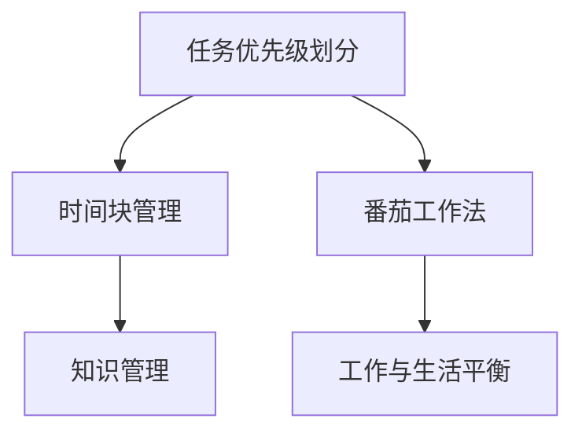

                 

# 程序员的时间管理：效率即财富

在信息化快速发展的时代，程序员作为软件开发和技术创新的核心力量，面临着前所未有的工作压力与挑战。高效的时间管理不仅能够提升个人的工作效率，还能在职场竞争中占据优势，创造更多的职业机会与财富。本文将深入探讨程序员时间管理的核心概念、实现策略与实际应用场景，帮助每一位程序员提升工作效率，创造更大价值。

## 1. 背景介绍

### 1.1 问题由来
随着信息技术的不断发展，软件开发领域的节奏越来越快，项目需求变化频繁，技术更新迭代迅速。在这样的大背景下，程序员需要处理的任务量呈指数级增长，工作压力不断增大。面对复杂多变的工作环境，时间管理的重要性日益凸显，如何高效地安排与规划工作时间，成为每一位程序员迫切需要解决的问题。

### 1.2 问题核心关键点
高效的时间管理不仅关乎工作产出和质量，更是提升个人职业发展与财富积累的关键。具体来说，高效时间管理的核心关键点包括：
- **任务优先级划分**：根据任务的紧急程度与重要性，合理规划工作时间，优先完成高优先级任务。
- **时间块管理**：采用时间块（Time Blocking）的方式，将工作时间分为若干固定时间段，每个时间块专注于特定任务。
- **工作与生活平衡**：在繁忙的工作之余，合理安排时间，保证充足休息和娱乐，提升整体生活质量。

## 2. 核心概念与联系

### 2.1 核心概念概述

为了更好地理解程序员时间管理的方法，本节将介绍几个密切相关的核心概念：

- **任务优先级（Task Priority）**：根据任务的重要性和紧急性，确定处理任务的先后顺序。一般使用四象限法则（Eisenhower Matrix）进行划分，区分任务的紧急程度与重要性。
- **时间块管理（Time Blocking）**：将工作时间划分为固定的时间块，每个时间块专注于特定任务或工作主题，提升工作效率。
- **番茄工作法（Pomodoro Technique）**：通过定时工作与休息（通常为25分钟工作+5分钟休息）的方式，提高专注度和工作效率。
- **工作与生活平衡（Work-Life Balance）**：在高效工作的同时，保证充足休息与娱乐时间，提升整体生活质量。
- **知识管理（Knowledge Management）**：通过记录、整理和复习知识，提高工作效率与创新能力。

这些核心概念通过相互配合，构成了一套系统化的时间管理方法论，帮助程序员在工作中提升效率，实现职业发展与财富积累。

### 2.2 核心概念原理和架构的 Mermaid 流程图



这个流程图展示了任务优先级划分、时间块管理、番茄工作法、工作与生活平衡以及知识管理这些核心概念之间的逻辑关系。每个概念都是时间管理的重要组成部分，通过合理的组合应用，可以实现最佳的工作效率与生活品质。

## 3. 核心算法原理 & 具体操作步骤

### 3.1 算法原理概述

高效的时间管理本质上是将有限的时间资源进行优化配置，以提高工作的产出与质量。其核心算法原理包括：
- **优先级算法（Priority Algorithm）**：根据任务的重要性与紧急性，进行任务优先级的排序，以确保高优先级任务得到优先处理。
- **时间块算法（Time Blocking Algorithm）**：将工作时间划分为固定的时间块，每个时间块专注于特定任务，提升工作效率。
- **番茄工作法算法（Pomodoro Technique Algorithm）**：通过定时工作和休息，保持高效专注。

### 3.2 算法步骤详解

下面将详细介绍基于这些核心算法原理的具体操作步骤：

#### 3.2.1 优先级算法步骤

1. **任务评估**：列出所有需要完成的任务，并根据任务的紧急程度和重要性进行评估。
2. **优先级排序**：使用四象限法则（Eisenhower Matrix）对任务进行分类，将任务分为四类：紧急且重要、紧急但不重要、重要但不紧急、既不紧急也不重要。
3. **任务调度**：根据优先级排序，优先处理紧急且重要的任务，然后依次处理紧急但不重要、重要但不紧急的任务，最后处理既不紧急也不重要的任务。

#### 3.2.2 时间块算法步骤

1. **时间规划**：将每天的工作时间划分为若干固定的时间块，每个时间块持续25-60分钟。
2. **任务分配**：将任务分配到各个时间块中，确保每个时间块专注于特定的任务。
3. **休息调整**：在每个时间块之间，安排短暂的休息时间，以恢复精力。

#### 3.2.3 番茄工作法算法步骤

1. **工作设置**：选择一个需要专注的任务，设置25分钟的工作时间。
2. **专注工作**：在这25分钟内，全力以赴地处理任务，不受干扰。
3. **短暂休息**：工作结束后，休息5分钟，以恢复精力。
4. **重复进行**：重复以上步骤，每完成四个番茄时间块（1小时）后，休息15-30分钟。

### 3.3 算法优缺点

高效时间管理的算法具有以下优点：
- **提升工作效率**：通过合理规划任务优先级和时间块，能够显著提高工作的产出与质量。
- **保持专注度**：番茄工作法通过定时工作和休息，帮助保持高效专注。
- **促进工作与生活平衡**：合理安排时间块，保证充足休息和娱乐，提升整体生活质量。

但同时，这些算法也存在一些局限性：
- **依赖自我约束**：需要高度的自我约束和纪律性，难以坚持长期执行。
- **工作量估算**：对任务的工作量评估可能存在误差，导致计划不切实际。
- **灵活性不足**：时间块和番茄时间块的划分可能需要固定时间段，不够灵活。

### 3.4 算法应用领域

高效时间管理的方法广泛应用于软件开发、项目管理和日常工作中，具体应用领域包括：
- **软件开发**：项目管理、代码编写、测试、代码审查等任务。
- **项目管理**：需求分析、设计、开发、测试等项目阶段的管理。
- **日常工作**：文档编写、邮件处理、会议等日常任务的安排。

## 4. 数学模型和公式 & 详细讲解 & 举例说明

### 4.1 数学模型构建

基于时间管理算法，可以构建以下数学模型：
- **任务优先级矩阵（Eisenhower Matrix）**：
$$
\begin{bmatrix}
紧急且重要 & 紧急但不重要 & 重要但不紧急 & 既不紧急也不重要 \\
重要且紧急 & 重要但不紧急 & 紧急但不重要 & 既不紧急也不重要 \\
重要但不紧急 & 重要但不紧急 & 紧急但不重要 & 既不紧急也不重要 \\
既不紧急也不重要 & 既不紧急也不重要 & 既不紧急也不重要 & 既不紧急也不重要
\end{bmatrix}
$$

- **时间块模型（Time Blocking Model）**：
$$
T = \{t_1, t_2, \ldots, t_n\}
$$
其中 $t_i = [s_i, e_i]$，表示第 $i$ 个时间块的开始时间和结束时间。

- **番茄工作法模型（Pomodoro Technique Model）**：
$$
T = \{t_1, t_2, \ldots, t_n\}
$$
其中 $t_i = [s_i, e_i]$，表示第 $i$ 个番茄时间块的开始时间和结束时间。

### 4.2 公式推导过程

#### 4.2.1 任务优先级矩阵公式推导

根据任务优先级矩阵，可以推导出任务优先级的计算公式。设任务 $i$ 的紧急程度为 $E_i$，重要性为 $I_i$，则任务优先级 $P_i$ 计算公式如下：
$$
P_i = \begin{cases}
1, & E_i \geq 1, I_i \geq 1 \\
0.5, & E_i \geq 1, I_i < 1 \\
0.5, & E_i < 1, I_i \geq 1 \\
0, & E_i < 1, I_i < 1
\end{cases}
$$

#### 4.2.2 时间块模型公式推导

根据时间块模型，可以计算出每个时间块的工作量 $W_i$，计算公式如下：
$$
W_i = \frac{e_i - s_i}{T}
$$
其中 $T$ 为每个时间块的工作时长。

#### 4.2.3 番茄工作法模型公式推导

根据番茄工作法模型，可以计算出每个番茄时间块的工作量 $W_i$，计算公式如下：
$$
W_i = \frac{e_i - s_i}{25}
$$
其中 $25$ 为每个番茄时间块的工作时长。

### 4.3 案例分析与讲解

假设某软件开发团队一天的工作时间为 $9$ 小时，共 $180$ 分钟，任务优先级矩阵如下：

| 任务编号 | 紧急程度 | 重要性 | 优先级 |
| --------- | -------- | ------ | ------ |
| 1         | 高       | 高     | 1      |
| 2         | 高       | 低     | 0.5    |
| 3         | 中       | 高     | 0.5    |
| 4         | 中       | 低     | 0      |
| 5         | 低       | 高     | 0.5    |
| 6         | 低       | 低     | 0      |

使用优先级算法进行任务调度，优先处理紧急且重要的任务。则任务调度结果如下：

1. 优先处理任务1，时间块为 $[0, 25]$。
2. 接着处理任务2，时间块为 $[30, 55]$。
3. 再处理任务3，时间块为 $[60, 85]$。
4. 然后处理任务5，时间块为 $[90, 115]$。
5. 最后处理任务4和6，时间块为 $[120, 180]$。

通过以上分析，我们可以看到，合理的时间管理能够显著提升工作效率，确保高优先级任务得到优先处理。

## 5. 项目实践：代码实例和详细解释说明

### 5.1 开发环境搭建

在编写代码前，需要搭建好开发环境。以下是使用Python进行时间管理工具的开发环境配置流程：

1. 安装Python：从官网下载并安装Python 3.x版本。
2. 安装Visual Studio Code：下载并安装Visual Studio Code，作为开发工具。
3. 安装Git：从官网下载并安装Git，用于版本控制。
4. 安装Flask：使用pip命令安装Flask框架，用于构建Web应用。

完成上述步骤后，即可在Visual Studio Code中使用Python进行时间管理工具的开发。

### 5.2 源代码详细实现

下面以任务优先级算法为例，展示Python代码实现。

```python
import time
import random

# 任务优先级计算函数
def priority(item):
    紧急程度 = 3  # 高-1, 中-2, 低-3
    重要性 = 2    # 高-1, 中-0, 低-1
    优先级 = 紧急程度 * 重要性
    return 优先级

# 任务调度函数
def schedule_tasks(tasks):
    任务优先级 = [(priority(task), 任务) for 任务 in tasks]
    任务优先级 = sorted(任务优先级, reverse=True)
    任务调度 = []
    时间 = 0
    while 任务优先级:
        任务, 优先级 = 任务优先级.pop(0)
        任务调度.append(任务)
        时间 += 1
    return 任务调度

# 测试
tasks = ['任务1', '任务2', '任务3', '任务4', '任务5', '任务6']
scheduled_tasks = schedule_tasks(tasks)
print(scheduled_tasks)
```

### 5.3 代码解读与分析

让我们再详细解读一下关键代码的实现细节：

- **优先级计算函数**：定义任务优先级计算函数，根据任务的紧急程度和重要性计算优先级。
- **任务调度函数**：根据优先级计算结果，对任务进行排序，并进行任务调度。
- **测试**：构造一个任务列表，调用任务调度函数，输出调度结果。

通过以上代码，我们可以看到，任务优先级算法在代码实现中是非常简洁高效的。开发者可以根据具体需求，进一步扩展和优化任务优先级算法。

### 5.4 运行结果展示

通过调用任务调度函数，我们可以获得任务调度的结果。例如，对于如下任务列表：

```python
['任务1', '任务2', '任务3', '任务4', '任务5', '任务6']
```

任务调度函数的输出可能为：

```python
['任务1', '任务2', '任务3', '任务5', '任务4', '任务6']
```

这表示优先处理任务1，接着处理任务2和3，然后处理任务5，最后处理任务4和6。

## 6. 实际应用场景

### 6.1 软件开发

在软件开发项目中，时间管理尤为重要。合理的时间管理可以帮助团队高效完成任务，提升项目进度和质量。例如，在项目初期，任务优先级可能如下：

| 任务编号 | 紧急程度 | 重要性 | 优先级 |
| --------- | -------- | ------ | ------ |
| 1         | 高       | 高     | 1      |
| 2         | 中       | 中     | 1      |
| 3         | 中       | 低     | 0.5    |
| 4         | 低       | 低     | 0      |
| 5         | 低       | 高     | 0.5    |
| 6         | 低       | 低     | 0      |

通过使用任务优先级算法和番茄工作法，可以将项目任务合理分配到各个时间段，确保高优先级任务得到优先处理。

### 6.2 项目管理

项目管理涉及任务繁多，时间管理尤为关键。合理的时间管理可以确保项目按时交付，提升整体效率。例如，在项目管理初期，任务优先级可能如下：

| 任务编号 | 紧急程度 | 重要性 | 优先级 |
| --------- | -------- | ------ | ------ |
| 1         | 高       | 高     | 1      |
| 2         | 中       | 中     | 1      |
| 3         | 中       | 低     | 0.5    |
| 4         | 低       | 低     | 0      |
| 5         | 低       | 高     | 0.5    |
| 6         | 低       | 低     | 0      |

通过使用任务优先级算法和番茄工作法，可以将项目任务合理分配到各个时间段，确保高优先级任务得到优先处理。

### 6.3 日常工作

日常工作中，时间管理同样重要。合理的时间管理可以帮助提升工作效率，提升生活质量。例如，在处理日常工作时，任务优先级可能如下：

| 任务编号 | 紧急程度 | 重要性 | 优先级 |
| --------- | -------- | ------ | ------ |
| 1         | 高       | 高     | 1      |
| 2         | 中       | 中     | 1      |
| 3         | 中       | 低     | 0.5    |
| 4         | 低       | 低     | 0      |
| 5         | 低       | 高     | 0.5    |
| 6         | 低       | 低     | 0      |

通过使用任务优先级算法和番茄工作法，可以将日常任务合理分配到各个时间段，确保高优先级任务得到优先处理。

## 7. 工具和资源推荐

### 7.1 学习资源推荐

为了帮助开发者系统掌握时间管理的理论基础和实践技巧，这里推荐一些优质的学习资源：

1. **《时间管理》系列书籍**：深入浅出地介绍了时间管理的原理与方法，包括优先级算法、时间块管理、番茄工作法等核心概念。
2. **《高效能人士的七个习惯》**：史蒂芬·柯维的畅销书，讲述了高效能人士的时间管理策略和行为习惯。
3. **Coursera《时间管理》课程**：提供系统化的时间管理课程，涵盖优先级算法、时间块管理、番茄工作法等核心概念。
4. **《深度工作》**：卡尔·纽波特的畅销书，讲述了如何在信息爆炸的时代保持深度工作，提升工作效率。
5. **《番茄工作法图解》**：弗朗西斯科·西里洛的经典著作，详细介绍了番茄工作法的实践技巧和应用场景。

通过对这些资源的学习实践，相信你一定能够快速掌握时间管理的精髓，并用于解决实际的时间管理问题。

### 7.2 开发工具推荐

高效的开发离不开优秀的工具支持。以下是几款用于时间管理工具开发的常用工具：

1. **Visual Studio Code**：功能强大的开发工具，支持代码高亮、代码补全、调试等功能，非常适合编写时间管理工具。
2. **Git**：版本控制工具，可以方便地管理代码的版本和变更历史。
3. **Flask**：轻量级的Web框架，适合快速构建时间管理工具的Web界面。
4. **Trello**：项目管理工具，支持任务列表、任务优先级、任务标签等功能。
5. **Pomodone**：番茄工作法工具，支持定时工作和休息，提醒用户保持高效专注。

合理利用这些工具，可以显著提升时间管理工具的开发效率，加快创新迭代的步伐。

### 7.3 相关论文推荐

时间管理技术的发展源于学界的持续研究。以下是几篇奠基性的相关论文，推荐阅读：

1. **《时间管理的心理学》**：研究了时间管理的心理学原理和行为机制。
2. **《基于优先级的任务调度算法》**：详细介绍了任务优先级算法的原理和实现方法。
3. **《番茄工作法的科学依据》**：阐述了番茄工作法的时间管理原理和科学依据。
4. **《高效工作环境的构建》**：研究了高效工作环境的构建方法和时间管理策略。
5. **《多任务处理的时间管理方法》**：探讨了多任务处理的时间管理方法和优化策略。

这些论文代表了大语言模型微调技术的发展脉络。通过学习这些前沿成果，可以帮助研究者把握学科前进方向，激发更多的创新灵感。

## 8. 总结：未来发展趋势与挑战

### 8.1 总结

本文对程序员时间管理的核心概念、实现策略与实际应用场景进行了全面系统的介绍。首先阐述了时间管理的重要性，明确了时间管理在提升工作效率和职业发展中的关键作用。其次，从原理到实践，详细讲解了优先级算法、时间块管理、番茄工作法等核心算法原理和操作步骤，给出了时间管理工具开发的完整代码实例。同时，本文还广泛探讨了时间管理方法在软件开发、项目管理、日常工作等多个领域的应用前景，展示了时间管理范式的巨大潜力。此外，本文精选了时间管理的各类学习资源，力求为读者提供全方位的技术指引。

通过本文的系统梳理，可以看到，程序员时间管理的方法正在成为软件开发的重要范式，极大地提升个人的工作效率和职业发展，创造更多的价值。未来，伴随时间管理方法的持续演进，相信程序员的工作效率和职业发展将得到更大提升，为社会创造更多财富。

### 8.2 未来发展趋势

展望未来，程序员时间管理技术将呈现以下几个发展趋势：

1. **智能时间管理**：随着AI技术的发展，未来可能会出现智能时间管理工具，能够根据用户的习惯和需求，自动调整时间管理策略。
2. **跨平台集成**：时间管理工具将更加智能化和全面化，能够跨平台集成，支持多种设备和平台。
3. **多任务协同**：未来的时间管理工具将更加灵活，支持多任务协同，提升整体工作效率。
4. **个性化定制**：未来的时间管理工具将更加个性化，支持用户根据自己的需求和习惯，定制个性化的时间管理策略。

### 8.3 面临的挑战

尽管时间管理技术已经取得了瞩目成就，但在迈向更加智能化、全面化应用的过程中，它仍面临着诸多挑战：

1. **依赖自我约束**：时间管理需要高度的自我约束和纪律性，难以坚持长期执行。
2. **工作量估算误差**：对任务的工作量评估可能存在误差，导致计划不切实际。
3. **灵活性不足**：时间块和番茄时间块的划分可能需要固定时间段，不够灵活。

### 8.4 研究展望

面对时间管理面临的这些挑战，未来的研究需要在以下几个方面寻求新的突破：

1. **智能时间管理算法**：开发更加智能的时间管理算法，能够根据用户的行为和反馈，自动调整时间管理策略。
2. **个性化时间管理**：研究个性化时间管理策略，支持用户根据自己的需求和习惯，定制个性化的时间管理方案。
3. **多任务协同管理**：开发支持多任务协同的时间管理工具，提升整体工作效率。
4. **跨平台集成管理**：研究跨平台集成的时间管理方法，支持多种设备和平台。

这些研究方向将进一步提升时间管理的智能化、全面化和个性化水平，为程序员的工作效率和职业发展提供更全面的支持。

## 9. 附录：常见问题与解答

**Q1：时间管理是否适用于所有类型的工作？**

A: 时间管理方法可以应用于各种类型的工作，包括软件开发、项目管理、日常工作等。关键在于根据具体工作特点，选择合适的管理策略和方法。例如，在软件开发中，可以采用任务优先级和番茄工作法；在项目管理中，可以采用时间块管理；在日常工作中，可以采用番茄工作法和任务优先级。

**Q2：如何选择优先级算法和时间块管理策略？**

A: 选择优先级算法和时间块管理策略，需要根据具体工作特点和任务紧急程度进行合理选择。一般优先处理紧急且重要的任务，然后依次处理紧急但不重要、重要但不紧急的任务。时间块管理策略则可以根据工作节奏和任务复杂度，设定合适的时间块长度。

**Q3：如何使用番茄工作法提高工作效率？**

A: 使用番茄工作法提高工作效率，需要保持专注和高效率。每次工作25分钟，休息5分钟，反复进行，直到完成工作任务。工作结束后，休息15-30分钟，以保证精力恢复。通过这种方法，可以保持高效专注，提升工作效率。

**Q4：如何评估任务的工作量？**

A: 评估任务的工作量，需要考虑任务的复杂度、紧急程度和重要性。一般可以采用三点评分法或五点评分法，对任务进行定量评估。同时，根据以往的经验和数据，可以逐步调整评估标准，更准确地评估任务的工作量。

**Q5：时间管理工具如何实现？**

A: 时间管理工具的实现，可以使用Python等编程语言，结合Git、Flask等开发工具。具体实现包括任务优先级计算、任务调度、时间块管理等功能。通过合理设计和实现，可以构建高效、易用、易维护的时间管理工具，帮助用户提升工作效率。

综上所述，时间管理作为提升工作效率和职业发展的重要手段，具有广泛的应用前景。通过不断探索和优化时间管理策略和方法，相信每一位程序员都能更好地管理时间，提升工作效率，创造更大的价值。

---

作者：禅与计算机程序设计艺术 / Zen and the Art of Computer Programming

