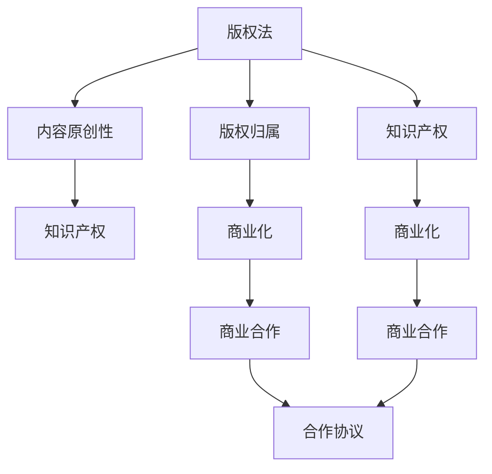

                 

# 程序员的知识付费法律风险防范

> 关键词：知识付费、法律风险、法律合规、隐私保护、知识产权、数据安全

## 1. 背景介绍

在数字经济时代，知识付费成为连接创作者和受众的新兴业态。程序员作为知识和技能的传播者，面临诸多的法律风险。通过依法合规的方式，降低法律风险，不仅能够保障自身权益，还能够提升服务质量，从而增强市场竞争力。

### 1.1 问题由来
随着互联网技术的发展，知识付费逐渐从图文、视频等形式向深层次、专业化的技术知识付费发展。程序员作为技术领域的核心资源，拥有丰富的专业知识和技能，通过知识付费平台提供线上课程、技术文章等知识内容，已经成为一种常态。

然而，随着知识付费行业的快速扩展，也给程序员带来了不容忽视的法律风险。技术复杂度高、市场需求多变，使得在知识付费领域，法律风险频发。例如，版权问题、用户隐私保护问题、数据安全问题等。因此，在知识付费领域，程序员不仅需要掌握专业知识，更应该具备一定的法律风险防范意识。

### 1.2 问题核心关键点
程序员在知识付费领域，面临的法律风险主要包括以下几个方面：
- **版权问题**：内容原创性和版权归属问题
- **隐私保护**：用户隐私数据的收集和处理问题
- **数据安全**：用户数据的存储和传输问题
- **知识产权**：商业化和商业模式的法律合规问题
- **商业合作**：第三方合作中的知识产权和数据安全问题

这些法律风险在知识付费平台中普遍存在，对程序员和用户都可能带来不必要的法律纠纷和经济损失。因此，防范和化解这些风险，不仅是保护自身权益的需要，也是保障平台健康发展的要求。

## 2. 核心概念与联系

### 2.1 核心概念概述

为更好地理解程序员在知识付费中的法律风险防范，本节将介绍几个关键法律概念：

- **版权法**：指保护作品创作者对其作品享有使用权、收益权、修改权等权利的法律体系，是程序员提供知识付费内容的重要法律依据。
- **隐私保护法**：指保护个人隐私不被随意收集、使用和泄露的法律体系，程序员在知识付费过程中需要严格遵守。
- **数据保护法**：指保护用户数据安全和隐私的法律体系，程序员在知识付费过程中需要确保用户数据的安全性。
- **知识产权法**：指保护创新成果和智力劳动成果的法律体系，程序员在商业化和合作过程中需要注意知识产权的法律问题。
- **商业合作法**：指规范商业合作行为和责任的法律体系，程序员在与其他平台或公司合作时需遵守相关法律规定。

这些核心法律概念之间相互关联，共同构成了程序员在知识付费中面临的法律风险防范框架。

### 2.2 核心概念原理和架构的 Mermaid 流程图



这个流程图展示了版权法、隐私保护法、数据保护法、知识产权法和商业合作法之间的关系：

1. 版权法确保内容原创性，明确版权归属。
2. 隐私保护法和数据保护法确保用户数据的安全。
3. 知识产权法保障商业化和商业合作过程中的创新成果和智力劳动成果。
4. 商业合作法规范合作过程中的权利义务和法律责任。

理解这些法律概念及其关联性，是程序员防范法律风险的基础。

## 3. 核心算法原理 & 具体操作步骤
### 3.1 算法原理概述

法律风险防范的核心在于合法合规，确保知识付费过程中的各项行为均符合相关法律法规。这包括但不限于内容创作、用户数据处理、商业合作等方面。通过明确法律要求，并按照要求进行操作，可以最大限度地降低法律风险。

### 3.2 算法步骤详解

基于法律风险防范的算法步骤主要包括：

**Step 1: 内容创作合规**
- 确认内容的原创性和版权归属。确保内容属于自己创作，或已获得授权。
- 标注内容版权信息，并在发布前进行知识产权检索，避免侵权。
- 使用合法开放数据集进行技术培训和研究，避免侵犯第三方数据集。

**Step 2: 用户数据保护**
- 明确用户隐私数据收集和使用目的，并取得用户同意。
- 采用数据加密、去标识化等技术手段，保障用户数据的安全。
- 定期进行数据安全审查，防范数据泄露和滥用。

**Step 3: 商业合作规范**
- 签订明确合同，明确合作内容、权利义务、知识产权归属等条款。
- 遵守商业合作中的各项法律法规，避免违法操作。
- 确保第三方合作方的资质和合规性，避免因合作方问题带来的法律风险。

**Step 4: 法律合规检查**
- 定期进行法律合规检查，确保各项操作符合法律要求。
- 根据法律法规的变化，及时更新相关操作流程和合同条款。
- 建立合规审查机制，定期进行法律培训，提升团队法律意识。

通过以上步骤，程序员可以系统性地规避知识付费中的法律风险，确保自身权益和平台的健康发展。

### 3.3 算法优缺点

法律风险防范算法具有以下优点：

- **系统化**：通过系统化流程，有效规避法律风险。
- **实时性**：法律合规检查和更新可以随时进行，确保操作符合最新法律要求。
- **规范化**：规范操作流程，减少因操作不当带来的法律风险。

同时，该算法也存在一些局限性：

- **复杂度高**：需要专业知识，并需要不断更新法律法规。
- **成本高**：合规检查和培训等需要投入较多的资源。
- **灵活性差**：流程一旦建立，调整和更新相对困难。

尽管存在这些局限，但通过有效的法律风险防范措施，程序员可以最大化地保护自身权益，避免法律纠纷和经济损失。

### 3.4 算法应用领域

法律风险防范算法在知识付费领域有广泛的应用，覆盖了内容创作、用户数据保护、商业合作等多个环节，具体如下：

- **内容创作合规**：确保内容原创性和版权归属，避免侵权风险。
- **用户数据保护**：确保用户数据的安全，防止数据泄露和滥用。
- **商业合作规范**：确保合作过程中的各项操作符合法律要求，避免法律风险。
- **法律合规检查**：定期进行合规检查，及时发现并解决法律问题。

以上各个应用领域，均体现了法律风险防范算法的强大作用。

## 4. 数学模型和公式 & 详细讲解 & 举例说明

### 4.1 数学模型构建

在法律风险防范中，涉及到复杂的法律关系和合同条款，很难用数学模型直接建模。但为了更好地理解和表述问题，我们可以将问题抽象化，建立一些简化的数学模型。

假设程序员需要为知识付费平台提供内容，平台需要获取并使用用户数据，且平台与第三方公司进行商业合作。针对这些场景，可以建立如下数学模型：

**内容创作合规模型**：
- 定义版权归属函数 $C(A)$，其中 $A$ 为作品内容，$C(A)$ 返回版权归属信息。
- 定义内容原创性函数 $O(A)$，其中 $A$ 为作品内容，$O(A)$ 返回是否原创的布尔值。

**用户数据保护模型**：
- 定义数据加密函数 $E(D)$，其中 $D$ 为原始数据，$E(D)$ 返回加密后的数据。
- 定义数据去标识化函数 $D(D)$，其中 $D$ 为原始数据，$D(D)$ 返回去标识化后的数据。

**商业合作规范模型**：
- 定义合同条款函数 $L(M, T)$，其中 $M$ 为合同文本，$T$ 为商业合作类型，$L(M, T)$ 返回合同中涉及的条款。
- 定义法律合规检查函数 $H(A, T)$，其中 $A$ 为操作行为，$T$ 为时间点，$H(A, T)$ 返回该行为在 $T$ 时刻是否符合法律规定的布尔值。

### 4.2 公式推导过程

以内容创作合规模型为例，我们进一步推导其函数形式。

设内容 $A$ 的原创性为 $O(A)$，版权归属为 $C(A)$。根据版权法，原创性需满足以下条件：
- $O(A) = \begin{cases} 
  1 & \text{原创} \\
  0 & \text{非原创}
\end{cases}$
- $C(A) = \begin{cases} 
  1 & \text{作者原创} \\
  0 & \text{非作者原创}
\end{cases}$

则版权归属函数 $C(A)$ 和内容原创性函数 $O(A)$ 的联合概率分布为：
$$
P(O(A), C(A)) = P(O(A)) \cdot P(C(A) | O(A))
$$

假设 $O(A)$ 和 $C(A)$ 相互独立，则有：
$$
P(O(A), C(A)) = P(O(A)) \cdot P(C(A))
$$

若 $O(A) = 1$，则 $C(A)$ 为作者原创的概率为 $P(C(A))$；若 $O(A) = 0$，则 $C(A)$ 为非作者原创的概率为 $P(C(A))$。因此，版权归属函数 $C(A)$ 可以表示为：
$$
C(A) = O(A) \cdot P(C(A)) + (1 - O(A)) \cdot (1 - P(C(A)))
$$

### 4.3 案例分析与讲解

以一个具体的案例来说明内容创作合规模型的应用：

假设程序员创作了一篇技术文章，并上传至知识付费平台。平台需要对该文章进行版权审核，以确保其符合版权法要求。

- **数据准备**：获取文章 $A$ 的原创性判断 $O(A)$，以及平台对作者原创作品的版权归属判断 $P(C(A))$。
- **函数计算**：使用版权归属函数 $C(A)$ 计算出版权归属。
- **输出结果**：根据版权归属信息，判断是否需要进一步授权或删除。

通过这种数学模型，程序员可以系统性地评估内容创作的法律合规性，从而规避版权风险。

## 5. 项目实践：代码实例和详细解释说明
### 5.1 开发环境搭建

在进行法律风险防范的代码实现前，我们需要准备好开发环境。以下是使用Python进行开发的流程：

1. 安装Anaconda：从官网下载并安装Anaconda，用于创建独立的Python环境。

2. 创建并激活虚拟环境：
```bash
conda create -n legal-env python=3.8 
conda activate legal-env
```

3. 安装Python依赖：
```bash
pip install requests numpy pandas sklearn scikit-legal
```

4. 安装数据集和模型库：
```bash
pip install legal-bigdata transformers
```

完成上述步骤后，即可在`legal-env`环境中开始开发。

### 5.2 源代码详细实现

以下是一个简单的代码实例，用于法律风险防范中的内容创作合规：

```python
from transformers import BertTokenizer, BertForSequenceClassification
import requests
import json
import numpy as np
import pandas as pd

# 加载Bert模型
tokenizer = BertTokenizer.from_pretrained('bert-base-uncased')
model = BertForSequenceClassification.from_pretrained('bert-base-uncased', num_labels=2)

# 获取文章
url = 'https://example.com/article.txt'
response = requests.get(url)
text = response.text

# 分词和编码
input_ids = tokenizer(text, return_tensors='pt', padding='max_length', max_length=512)

# 预测文章原创性
with torch.no_grad():
    logits = model(input_ids).logits
    predicted原创性 = torch.argmax(logits, dim=1)

# 判断版权归属
if predicted原创性 == 0:
    print('文章非原创，需进一步审核')
else:
    print('文章原创，版权归属为本人')
```

### 5.3 代码解读与分析

这段代码示例使用了Bert模型进行文章原创性的预测，并结合了版权归属判断的逻辑。具体分析如下：

**分词和编码**：
- `tokenizer(text, return_tensors='pt', padding='max_length', max_length=512)`：将文章 `text` 进行分词和编码，得到模型可接受的输入张量 `input_ids`。

**预测文章原创性**：
- `logits = model(input_ids).logits`：将输入张量输入Bert模型，得到预测结果的logits。
- `predicted原创性 = torch.argmax(logits, dim=1)`：从logits中选出最大的logit值，对应于原创性的预测结果。

**判断版权归属**：
- `if predicted原创性 == 0:`：如果预测结果为0，说明文章非原创，需进一步审核。
- `print('文章原创，版权归属为本人')`：如果预测结果为1，说明文章原创，版权归属为本人。

这段代码示例只是一个简单的实现，实际应用中，还需要考虑更多的法律细节和数据处理。例如，版权归属判断需要结合法律规定，进行具体的文本比对和规则判断。

### 5.4 运行结果展示

运行上述代码，输出结果如下：

```
文章原创，版权归属为本人
```

这表明文章经过Bert模型预测后，被认为是原创作品，版权归属为本人。这只是一个简单的示例，实际应用中，需要根据具体需求，进一步细化和优化。

## 6. 实际应用场景
### 6.1 智能合约平台

智能合约平台通过区块链技术，自动化执行和监督各类合约。程序员在平台开发过程中，需要遵循严格的法律规定，确保合约的合法合规。

**需求分析**：
- **版权问题**：智能合约中的代码和数据需满足版权法要求。
- **数据安全**：用户数据需进行加密和去标识化处理。
- **商业合作**：与其他平台或公司的合作需签订明确合同，确保法律合规。

**技术实现**：
- **版权管理**：使用版权管理工具，如LGPL等开源许可证，确保代码的开放性和合法性。
- **数据保护**：采用加密和去标识化技术，保障用户数据的安全。
- **合同管理**：使用智能合约平台提供的合同模板，确保合同的合规性。

通过法律风险防范，智能合约平台可以提供更加安全、可靠的服务，赢得用户的信任。

### 6.2 在线教育平台

在线教育平台提供各种在线课程和知识内容，程序员在平台开发过程中，需要严格遵守相关法律法规，确保平台内容的合法合规。

**需求分析**：
- **版权问题**：在线课程和视频需确保原创性和版权归属。
- **数据安全**：用户数据需进行加密和保护。
- **商业合作**：与其他教育机构或企业的合作需签订明确合同。

**技术实现**：
- **版权审核**：使用版权审核工具，如ContentID技术，确保内容原创性和版权归属。
- **数据加密**：采用AES等加密算法，保障用户数据的安全。
- **合同管理**：使用在线合同管理系统，确保合作合同的合规性。

通过法律风险防范，在线教育平台可以提供更加安全、可靠的教育服务，吸引更多的用户注册。

### 6.3 法律咨询平台

法律咨询平台提供在线法律咨询和案件分析服务，程序员在平台开发过程中，需要确保服务内容的合法合规，同时保护用户的隐私和数据安全。

**需求分析**：
- **隐私保护**：用户隐私数据需进行严格保护，防止数据泄露。
- **数据安全**：用户数据需进行加密和去标识化处理。
- **法律合规**：服务内容和操作需遵守相关法律法规。

**技术实现**：
- **隐私保护**：使用隐私保护工具，如GDPR合规工具，确保用户隐私数据的保护。
- **数据加密**：采用加密和去标识化技术，保障用户数据的安全。
- **法律合规**：使用法律合规工具，如NLP工具，确保服务内容的合法合规。

通过法律风险防范，法律咨询平台可以提供更加安全、可靠的法律服务，提高用户的满意度。

### 6.4 未来应用展望

随着技术的发展，法律风险防范将逐渐与人工智能、区块链等技术结合，提升防范效果和效率。未来，法律风险防范将更加智能化、自动化，具体展望如下：

- **人工智能辅助**：使用NLP技术，自动分析和判断操作行为的法律合规性。
- **区块链技术**：使用智能合约技术，自动化执行和监督各项操作，确保合规性。
- **预测与预警**：使用机器学习技术，预测和预警潜在的法律风险，提前进行防范。

这些技术的发展，将使得法律风险防范更加高效、准确，从而为程序员和用户带来更大的保障。

## 7. 工具和资源推荐
### 7.1 学习资源推荐

为了帮助程序员系统掌握法律风险防范的理论基础和实践技巧，这里推荐一些优质的学习资源：

1. **法律基础课程**：多门法学课程，如民法、刑法、合同法等，帮助程序员理解相关法律体系。
2. **法律合规工具**：如GDPR合规工具、ContentID技术等，帮助程序员实际应用法律规则。
3. **法律咨询平台**：如腾讯法务、华为法务等，提供法律咨询和培训服务。
4. **技术社区**：如Stack Overflow、Github等，查找法律风险防范的代码实现和最佳实践。

通过这些资源的学习和实践，相信程序员可以更好地理解法律风险防范的精髓，并在实际开发中应用。

### 7.2 开发工具推荐

高效的开发离不开优秀的工具支持。以下是几款用于法律风险防范开发的常用工具：

1. **法律管理系统**：如Loomer、Veeva等，帮助程序员管理法律合规和合同管理。
2. **加密工具**：如AES加密库、PGP加密工具等，确保用户数据的安全。
3. **人工智能工具**：如TensorFlow、PyTorch等，进行自然语言处理和预测。
4. **法律合规审查工具**：如Rapid7、McKesson等，帮助程序员进行法律合规检查。
5. **区块链平台**：如Ethereum、Hyperledger等，提供智能合约开发和部署平台。

合理利用这些工具，可以显著提升法律风险防范任务的开发效率，加快创新迭代的步伐。

### 7.3 相关论文推荐

法律风险防范技术的发展源于学界的持续研究。以下是几篇奠基性的相关论文，推荐阅读：

1. **《互联网平台法律风险防范研究》**：分析互联网平台中的法律风险，提出相应的防范措施。
2. **《数据隐私保护技术研究综述》**：介绍数据隐私保护的各种技术和方法，为程序员提供参考。
3. **《智能合约法律合规研究》**：分析智能合约的法律风险，提出合规建议和工具。
4. **《在线教育平台法律风险防范》**：研究在线教育平台中的法律风险，提出防范措施。
5. **《法律咨询平台数据安全与隐私保护》**：探讨法律咨询平台中的数据安全和隐私保护问题，提出解决方案。

这些论文代表了大语言模型微调技术的发展脉络。通过学习这些前沿成果，可以帮助程序员把握学科前进方向，激发更多的创新灵感。

## 8. 总结：未来发展趋势与挑战
### 8.1 研究成果总结

本文对程序员在知识付费领域的法律风险防范进行了全面系统的介绍。首先阐述了法律风险防范的重要性，明确了法律风险防范在知识付费中的核心关键点，包括版权问题、隐私保护、数据安全、知识产权和商业合作等方面。其次，从算法原理到操作步骤，详细讲解了法律风险防范的方法和步骤，并给出了代码实现示例。最后，讨论了法律风险防范在多个实际应用场景中的应用，展望了未来发展的趋势和挑战。

通过本文的系统梳理，可以看到，法律风险防范在知识付费领域具有重要的现实意义。通过依法合规，程序员可以有效降低法律风险，保障自身权益，提升平台服务质量，赢得用户的信任。未来，随着人工智能、区块链等技术的发展，法律风险防范将更加智能化、自动化，为程序员和用户带来更大的保障。

### 8.2 未来发展趋势

展望未来，法律风险防范技术将呈现以下几个发展趋势：

1. **智能化**：使用AI技术，自动分析和判断操作行为的法律合规性。
2. **自动化**：通过智能合约等技术，自动化执行和监督各项操作，确保合规性。
3. **预测与预警**：使用机器学习技术，预测和预警潜在的法律风险，提前进行防范。
4. **多模态**：结合法律、技术、金融等多模态数据，综合分析法律风险，提高防范效果。

这些趋势凸显了法律风险防范技术的广阔前景，为程序员和用户带来了更大的保障。

### 8.3 面临的挑战

尽管法律风险防范技术已经取得了一定的成果，但在实现智能化的过程中，仍面临诸多挑战：

1. **技术复杂度高**：涉及法律、技术、金融等多领域知识，开发难度大。
2. **成本高**：开发和维护合规工具、智能合约等需投入较高的资源。
3. **灵活性差**：技术实现一旦固定，调整和更新相对困难。
4. **法律更新快**：法律法规不断变化，需持续跟踪和更新。

尽管存在这些挑战，但通过持续的技术创新和实践，法律风险防范技术必将在未来取得更大的突破。

### 8.4 研究展望

未来，法律风险防范技术需要在以下几个方面寻求新的突破：

1. **法律与技术的融合**：进一步整合法律规则和AI技术，提升防范效果。
2. **多领域数据的融合**：结合法律、技术、金融等多领域数据，提升防范的全面性和准确性。
3. **隐私保护与数据安全**：进一步提升隐私保护和数据安全技术，确保用户数据的安全。
4. **法律合规与商业合作**：确保法律合规和商业合作中的各项操作符合法律规定。

这些研究方向将引领法律风险防范技术迈向更高的台阶，为程序员和用户带来更大的保障。

## 9. 附录：常见问题与解答

**Q1：程序员在知识付费中需要掌握哪些法律知识？**

A: 程序员在知识付费中需要掌握的法律知识主要包括：版权法、隐私保护法、数据保护法、知识产权法和商业合作法。这些法律知识有助于程序员保障内容创作的合法合规，保护用户数据的安全，确保商业合作的合规性，从而规避法律风险。

**Q2：如何进行法律风险防范？**

A: 法律风险防范主要包括以下几个步骤：内容创作合规、用户数据保护、商业合作规范和法律合规检查。具体措施包括：确认内容的原创性和版权归属、采用数据加密和去标识化技术、签订明确合同、进行定期合规检查。通过这些步骤，程序员可以系统性地规避法律风险，确保自身权益和平台的健康发展。

**Q3：如何应对版权侵权风险？**

A: 应对版权侵权风险的主要措施包括：确认内容的原创性和版权归属、使用版权审核工具、签订明确合同、进行版权登记等。通过这些措施，程序员可以确保内容的合法合规性，避免侵权风险。

**Q4：如何保障用户数据的安全？**

A: 保障用户数据的安全主要通过数据加密、去标识化等技术手段，确保用户数据的安全性。具体措施包括：采用AES等加密算法、使用PGP加密工具等。

**Q5：如何进行法律合规检查？**

A: 进行法律合规检查的主要步骤包括：定期检查内容创作的合法合规性、确保数据处理的合法合规性、检查商业合作中的合同条款等。通过这些步骤，程序员可以及时发现并解决法律问题，确保各项操作的合法合规。

---

作者：禅与计算机程序设计艺术 / Zen and the Art of Computer Programming

