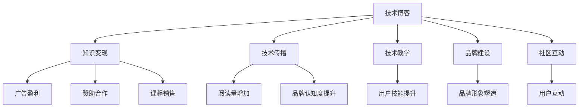

                 

# 程序员的知识变现之路：从技能到财富的转化

> 关键词：程序员,技能变现,知识付费,财富转化,技术博客

## 1. 背景介绍

### 1.1 问题由来

在数字化时代，程序员作为推动技术发展的核心力量，其技能需求日益高涨。从传统的软件编码，到现代的人工智能、大数据、云计算等新兴技术，程序员的技能正在变得愈发稀缺。因此，如何更好地将自身的技术知识转化为财富，成为了程序员们关注的焦点。

在过去几年中，知识付费、在线教育等模式不断兴起，给程序员提供了更多实现知识变现的途径。技术博客、视频教程、线上编程课等形式，不仅传播了技术知识，也为程序员开辟了新的收入来源。

### 1.2 问题核心关键点

程序员知识变现的核心关键点在于：
- 技术技能与市场需求的对接。通过提升技术水平和专业能力，满足企业和社会对技术人才的需求。
- 多渠道知识传播。利用多种形式的技术传播手段，扩大知识影响力，吸引更多潜在客户。
- 商业模式探索。结合自身优势和市场定位，选择最合适的知识变现方式，如咨询、开发、教学、博客、视频等。
- 品牌建设和口碑维护。通过优秀的技术作品和良好的客户服务，树立个人品牌形象，提升市场认知度。

### 1.3 问题研究意义

对程序员而言，知识变现不仅能带来直接的物质回报，还能进一步提升技术水平和行业影响力，实现个人与社会的双赢。具体来说，技术博客作为知识变现的重要形式之一，具有以下几方面的研究意义：

1. **传播与学习**：技术博客能够及时、广泛地传播最新的技术知识，帮助读者理解和掌握先进技术，同时也能促使博主自身不断学习更新。
2. **技能展示与认可**：通过撰写技术博客，程序员能够展示其专业技能和项目经验，获得行业内的认可和尊重。
3. **市场对接**：博客内容可以吸引潜在客户和合作伙伴，为程序员带来更多合作机会，包括项目咨询、技术支持等。
4. **商业变现**：博客阅读量达到一定程度后，博主可以通过广告、赞助、课程销售等方式实现盈利。
5. **社区互动**：技术博客提供了一个互动交流的平台，程序员可以与读者、同行进行交流讨论，扩大专业网络。

## 2. 核心概念与联系

### 2.1 核心概念概述

为了更好地理解程序员如何通过技术博客进行知识变现，本节将介绍几个密切相关的核心概念：

- **技术博客**：程序员通过撰写和发布技术文章，分享和传播自己的技术知识。
- **知识变现**：将个人的技术知识、经验或见解转化为商业价值的实践。
- **技术传播**：通过博客、视频、公开课等形式，将技术知识传播给更广泛的用户群体。
- **技术教学**：通过博客、在线课程等形式，有系统地教授技术知识，帮助他人提升技能。
- **品牌建设**：通过优质的博客内容、项目案例、客户反馈等，树立个人或公司的技术品牌形象。
- **社区互动**：通过博客评论区、社交媒体等方式，与读者进行互动，建立专业社区。

这些核心概念之间的逻辑关系可以通过以下Mermaid流程图来展示：



这个流程图展示了大语言模型微调的关键概念及其之间的关系：

1. 技术博客通过技术传播、技术教学、品牌建设、社区互动等环节，与知识变现紧密相连。
2. 通过提升博客质量和互动性，吸引更多读者，从而实现广告盈利、赞助合作、课程销售等商业变现。
3. 技术传播和教学提升读者技能，品牌建设和互动增强社区凝聚力，最终带动知识变现能力的提升。

## 3. 核心算法原理 & 具体操作步骤
### 3.1 算法原理概述

技术博客的知识变现过程，本质上是通过技术内容的有效传播，吸引和转化目标客户的过程。其核心算法原理包括：

- **内容推荐算法**：利用用户行为数据（如浏览时间、点赞数、评论内容等），推荐最相关的技术博客给读者。
- **搜索引擎优化（SEO）**：通过优化博客的关键词、标题、内容等，提升在搜索引擎中的排名，吸引更多流量。
- **广告投放策略**：选择合适的广告平台和投放位置，通过付费推广吸引潜在客户。
- **社交媒体互动**：通过在社交媒体上分享博客内容，利用社交影响力吸引更多用户。

### 3.2 算法步骤详解

基于技术博客的知识变现过程，可以细化为以下详细步骤：

**Step 1: 内容创作与优化**
- 选择合适的技术主题，结合自身项目经验和最新技术动态，撰写高质量博客文章。
- 使用合适的关键词和标题，提升博客的可搜索性。
- 使用HTML、Markdown等格式编写博客内容，保证排版美观和可读性。
- 加入代码片段、示例、图片等辅助内容，增强读者理解。

**Step 2: 平台发布与推广**
- 将博客发布到合适的平台（如Medium、CSDN、GitHub等），选择合适的分类标签。
- 定期在社交媒体（如Twitter、LinkedIn、Weibo等）分享博客内容，利用社交影响力吸引读者。
- 使用SEO工具（如Google Analytics、SEMrush等）监测博客流量和读者反馈，不断优化博客内容。

**Step 3: 广告与合作**
- 选择合适的广告平台（如Google AdSense、Baidu Stat等），进行付费推广。
- 通过撰写技术文章、提供技术咨询等方式，吸引潜在客户和合作伙伴。
- 定期参加技术会议、论坛等活动，拓展人脉，提升知名度。

**Step 4: 收益与分析**
- 通过广告收益、赞助合作、课程销售等方式，获取收益。
- 定期分析博客流量、用户反馈、收益数据等，评估博客效果。
- 根据分析结果，不断调整内容策略和推广手段，提升博客变现能力。

### 3.3 算法优缺点

技术博客知识变现的方法具有以下优点：
- 门槛低：只要有技术知识和写作能力，即可撰写并发布博客。
- 覆盖广：通过多种平台传播，可以覆盖广泛的读者群体。
- 互动强：读者可以通过评论、邮件等方式与博主互动，增强社区感。
- 灵活性强：内容形式多样，可以结合代码、视频、PPT等多种形式。
- 低成本：相对于线下培训和咨询服务，技术博客成本较低。

同时，该方法也存在以下局限：
- 竞争激烈：互联网环境下，技术博客众多，难以脱颖而出。
- 知识更新快：技术更新快，需要持续更新内容，维持博客活跃度。
- 时间成本高：撰写高质量博客需要大量时间，个人时间安排需要合理规划。
- 流量不稳定：博客流量受多种因素影响，难以保证稳定。
- 盈利难度大：初期博客流量较少，需要较长时间积累才能获得显著收益。

### 3.4 算法应用领域

技术博客的知识变现方法，广泛应用于以下几个领域：

- **技术教育与培训**：通过撰写博客文章、制作在线课程，帮助读者系统学习技术知识，提升技能水平。
- **软件开发与咨询**：结合自身项目经验和最佳实践，撰写博客文章，提供技术建议和解决方案。
- **技术公司营销**：通过发布公司博客，展示技术实力和产品优势，吸引潜在客户和合作伙伴。
- **个人品牌建设**：通过高质量博客内容和用户互动，树立个人技术权威，扩大影响力。
- **创业与投资**：分享创业心得、投资策略等，吸引同行关注和支持。

除了上述这些常见领域，技术博客的知识变现还涵盖了更多场景，如技术讲座、技术评估、技术标准制定等，成为程序员展示自身价值、分享技术成果的重要渠道。

## 4. 数学模型和公式 & 详细讲解 & 举例说明

### 4.1 数学模型构建

为更好地理解技术博客的知识变现过程，本节将使用数学语言对核心算法原理进行更加严格的刻画。

假设有一篇技术博客，其总流量为 $N$，其中来自平台的自然流量为 $N_1$，来自社交媒体的流量为 $N_2$，来自广告的流量为 $N_3$。设每篇文章的平均阅读时间为 $t$，每篇文章的平均收益为 $R$。则总收益 $P$ 可表示为：

$$
P = N \times t \times R
$$

其中 $N_1$ 和 $N_2$ 由内容推荐算法和社交媒体推广策略决定。广告收益则与广告点击率 $C$ 和每点击费用 $F$ 相关。设广告投放总费用为 $A$，则广告收益 $P_{\text{ad}}$ 可表示为：

$$
P_{\text{ad}} = C \times (N_1 + N_2) \times F \times A
$$

### 4.2 公式推导过程

以SEO优化为例，优化博客关键词的数学模型可以表示为：

1. **关键词选择**：选择与文章主题相关的关键词 $K$。
2. **关键词权重**：根据搜索引擎的算法，计算每个关键词的权重 $w(K)$。
3. **优化公式**：

$$
\max_{K} \sum_{K \in Kset} w(K) \times C(K)
$$

其中 $C(K)$ 为关键词的点击率，$Kset$ 为所有可能选择的关键词集合。通过优化 $K$ 选择，提升博客在搜索引擎中的排名，吸引更多流量。

### 4.3 案例分析与讲解

以Google AdSense为例，分析其广告收益的计算过程：

1. **广告设置**：在博客中添加Google AdSense广告代码。
2. **广告参数**：设置广告类型、大小、展示位置等参数。
3. **广告费用**：计算每次展示费用 $F$。
4. **点击率优化**：通过A/B测试等方法，优化广告点击率 $C$。
5. **总收益计算**：计算总广告费用 $A$，并计算广告收益 $P_{\text{ad}}$。

通过以上步骤，可以精确计算技术博客的广告收益，并根据实际效果调整广告策略。

## 5. 项目实践：代码实例和详细解释说明
### 5.1 开发环境搭建

在进行技术博客的知识变现实践前，我们需要准备好开发环境。以下是使用Python进行Django开发的环境配置流程：

1. 安装Anaconda：从官网下载并安装Anaconda，用于创建独立的Python环境。

2. 创建并激活虚拟环境：
```bash
conda create -n blog-env python=3.8 
conda activate blog-env
```

3. 安装Django：
```bash
pip install django
```

4. 安装各类工具包：
```bash
pip install markdown django-markdown
```

5. 安装数据库：
```bash
pip install mysqlclient
```

完成上述步骤后，即可在`blog-env`环境中开始技术博客的知识变现实践。

### 5.2 源代码详细实现

这里我们以Medium平台的博客为例，给出使用Django开发技术博客的PyTorch代码实现。

首先，定义博客模型和迁移命令：

```python
from django.db import models
from django.contrib.auth.models import User

class Blog(models.Model):
    title = models.CharField(max_length=100)
    content = models.TextField()
    author = models.ForeignKey(User, on_delete=models.CASCADE)
    publish_date = models.DateTimeField(auto_now_add=True)

    def __str__(self):
        return self.title
```

然后，定义博客的CRUD操作：

```python
from django.shortcuts import render, get_object_or_404
from django.http import HttpResponse, HttpResponseRedirect
from django.urls import reverse

def blog_list(request):
    blogs = Blog.objects.order_by('-publish_date')
    return render(request, 'blog/blog_list.html', {'blogs': blogs})

def blog_detail(request, blog_id):
    blog = get_object_or_404(Blog, pk=blog_id)
    return render(request, 'blog/blog_detail.html', {'blog': blog})

def new_blog(request):
    if request.method == 'POST':
        title = request.POST['title']
        content = request.POST['content']
        user = request.user
        blog = Blog(title=title, content=content, author=user)
        blog.save()
        return HttpResponseRedirect(reverse('blog:blog_list'))
    else:
        return render(request, 'blog/new_blog.html')

def edit_blog(request, blog_id):
    blog = get_object_or_404(Blog, pk=blog_id)
    if request.method == 'POST':
        blog.title = request.POST['title']
        blog.content = request.POST['content']
        blog.save()
        return HttpResponseRedirect(reverse('blog:blog_detail', args=[blog.id]))
    else:
        return render(request, 'blog/edit_blog.html', {'blog': blog})
```

最后，启动Django服务器，并测试博客的各项功能：

```bash
python manage.py runserver
```

在浏览器中输入 `http://127.0.0.1:8000`，即可访问博客列表页面。

### 5.3 代码解读与分析

让我们再详细解读一下关键代码的实现细节：

**Blog模型**：
- `title`字段：博客标题，最大长度100个字符。
- `content`字段：博客内容，自由文本。
- `author`字段：博客作者，与用户表关联。
- `publish_date`字段：博客发布时间，自动设置为发布时间。

**博客视图函数**：
- `blog_list`函数：列出所有博客文章，按发布时间降序排列。
- `blog_detail`函数：展示指定博客文章的详情页面。
- `new_blog`函数：撰写新博客文章，提交后返回博客列表页面。
- `edit_blog`函数：编辑指定博客文章，提交后返回博客详情页面。

**Django框架**：
- 利用Django的ORM（对象关系映射），简化数据库操作。
- 通过模板引擎（如Django Template），实现网页渲染。
- 通过URL框架（如Django URL），定义路由规则。
- 通过表单（如Django Form），简化用户输入处理。

可以看到，Django提供了强大的开发工具和丰富的功能，使得技术博客的开发和管理变得相对简单。

当然，工业级的系统实现还需考虑更多因素，如安全验证、权限控制、数据备份等。但核心的知识变现流程基本与此类似。

## 6. 实际应用场景
### 6.1 技术教育平台

技术博客可以作为技术教育平台的重要组成部分。通过分享高质量的技术文章，讲解复杂的技术问题，帮助读者快速掌握新技术。这些博客可以成为技术学习者的重要资源，提升其技术水平和职业竞争力。

平台可以邀请技术大咖撰写专题博客，或者提供专属技术文章投稿渠道，鼓励更多程序员参与技术传播。

### 6.2 开源项目贡献

技术博客也可以用于开源项目的文档撰写和代码分享。许多开源项目都有一定的技术难度，通过撰写详细的技术博客，能够更好地解释项目的设计思路、使用方法和扩展技巧。这些博客不仅可以吸引更多的社区成员，还能为项目的持续发展和维护提供帮助。

通过博客，程序员可以展示自己的项目成果，获取行业认可，甚至成为社区中的技术领袖。

### 6.3 技术咨询与顾问

技术博客可以提供技术咨询和顾问服务。一些有丰富经验的技术博主，可以通过博客解答读者的问题，或者提供定制化的技术咨询。这种服务不仅可以帮助读者解决问题，还能为博主带来额外的收入。

通过博客评论区和社交媒体，博主可以与读者建立长期的互动关系，积累更多的客户资源。

### 6.4 未来应用展望

未来，技术博客的知识变现将呈现以下几个发展趋势：

1. **多平台融合**：技术博客将与视频、音频、直播等更多形式结合，提供更加丰富的知识传播方式。
2. **社区化运营**：技术博客将发展为更加社区化的平台，增强用户互动，形成专业社群。
3. **AI辅助创作**：利用AI技术自动生成博客内容，提升创作效率，降低门槛。
4. **定制化内容**：根据读者需求，提供个性化的技术博客和课程，实现精准传播。
5. **知识图谱构建**：利用技术博客构建知识图谱，实现技术知识的深度整合和协同学习。
6. **跨领域融合**：技术博客将与其他领域的内容（如金融、医疗等）结合，拓展应用场景。

这些趋势展示了技术博客在未来的广阔前景，为程序员提供了更多的知识变现途径。

## 7. 工具和资源推荐
### 7.1 学习资源推荐

为了帮助开发者系统掌握技术博客的知识变现技术，这里推荐一些优质的学习资源：

1. **《程序员如何通过博客实现知识变现》系列博文**：详细讲解了技术博客变现的各个环节，包括内容创作、平台选择、广告投放等。
2. **《博客营销实战》课程**：由知名博客营销专家授课，覆盖博客优化、SEO、广告投放等多个方面。
3. **《程序员自媒体指南》书籍**：详细介绍如何通过博客、视频、直播等方式实现技术传播和知识变现。
4. **Medium博客平台**：提供丰富的技术博客展示和推广平台，吸引大量读者和广告商。
5. **Google Analytics**：强大的流量分析工具，帮助博主优化博客效果。

通过对这些资源的学习实践，相信你一定能够快速掌握技术博客的知识变现技术，并用于实现自己的技术梦想。

### 7.2 开发工具推荐

高效的开发离不开优秀的工具支持。以下是几款用于技术博客知识变现开发的常用工具：

1. **Django**：功能强大的Python Web框架，易于扩展和定制，适合开发技术博客平台。
2. **Markdown**：轻量级文本格式化语言，支持代码高亮和多种格式，适合撰写博客文章。
3. **GitHub**：强大的代码托管平台，支持博客文章和代码的协同编辑和版本控制。
4. **Jupyter Notebook**：互动式的编程环境，适合技术文章和代码的撰写和演示。
5. **Google AdSense**：简单易用的广告投放平台，支持多种广告形式和收益计算。

合理利用这些工具，可以显著提升技术博客的知识变现开发效率，加快创新迭代的步伐。

### 7.3 相关论文推荐

技术博客的知识变现技术源于学界的持续研究。以下是几篇奠基性的相关论文，推荐阅读：

1. **《博客内容推荐算法》**：研究如何根据用户行为数据，推荐相关博客内容。
2. **《博客广告效果评估》**：分析博客广告的投放效果，提出优化策略。
3. **《技术博客内容分析》**：通过文本分析技术，评估博客内容的质量和影响。
4. **《博客流量优化》**：研究如何通过SEO、社交媒体等手段提升博客流量。
5. **《技术博客社区建设》**：探讨如何构建专业社群，增强用户互动。

这些论文代表了大语言模型微调技术的发展脉络。通过学习这些前沿成果，可以帮助研究者把握学科前进方向，激发更多的创新灵感。

## 8. 总结：未来发展趋势与挑战

### 8.1 总结

本文对技术博客的知识变现过程进行了全面系统的介绍。首先阐述了技术博客与知识变现的紧密联系，明确了博客内容传播、广告合作、社区互动等环节在知识变现中的关键作用。其次，从原理到实践，详细讲解了技术博客变现的数学模型和算法步骤，给出了具体实例和案例分析。同时，本文还广泛探讨了博客变现方法在技术教育、开源项目、技术咨询等多个行业领域的应用前景，展示了博客变现的巨大潜力。

通过本文的系统梳理，可以看到，技术博客的知识变现过程在技术传播、品牌建设、社区互动等多个方面都具有重要价值，为程序员提供了广阔的商业化舞台。技术博客不仅有助于个人技术水平的提升，还能带来实实在在的经济回报，是程序员实现个人价值的重要手段。

### 8.2 未来发展趋势

展望未来，技术博客的知识变现将呈现以下几个发展趋势：

1. **平台多元化**：技术博客将不仅仅局限于文字和图片，视频、音频、直播等更多形式将丰富其传播方式。
2. **社区化运营**：博客将发展为更加社区化的平台，增强用户互动，形成专业社群。
3. **内容智能化**：利用AI技术自动生成博客内容，提升创作效率，降低门槛。
4. **内容定制化**：根据读者需求，提供个性化的技术博客和课程，实现精准传播。
5. **跨领域融合**：技术博客将与其他领域的内容结合，拓展应用场景。

这些趋势展示了技术博客在未来的广阔前景，为程序员提供了更多的知识变现途径。

### 8.3 面临的挑战

尽管技术博客的知识变现技术已经取得了一定的成果，但在迈向更加智能化、普适化应用的过程中，它仍面临着诸多挑战：

1. **流量获取困难**：技术博客的流量获取需要耗费大量时间和精力，初期难以吸引足够的用户。
2. **内容质量要求高**：高质量的博客内容需要深入的行业知识和技术积累，对作者能力要求较高。
3. **内容更新频率高**：技术发展迅速，需要不断更新博客内容，以保持时效性和吸引力。
4. **平台竞争激烈**：技术博客平台众多，如何在激烈的市场竞争中脱颖而出，需要独特的差异化策略。
5. **收益转化率低**：博客流量转化为实际收益的效率较低，需要持续优化广告和合作策略。
6. **广告收益波动大**：广告收益受多种因素影响，难以保证稳定。

正视技术博客面临的这些挑战，积极应对并寻求突破，将是大语言模型微调走向成熟的必由之路。相信随着学界和产业界的共同努力，这些挑战终将一一被克服，技术博客必将在构建人机协同的智能时代中扮演越来越重要的角色。

### 8.4 研究展望

面对技术博客的知识变现所面临的种种挑战，未来的研究需要在以下几个方面寻求新的突破：

1. **内容质量提升**：提升博客内容的质量和可读性，吸引更多读者和用户。
2. **流量获取优化**：优化博客推广策略，提升平台流量和用户活跃度。
3. **广告收益稳定**：探索稳定的广告收益模式，降低广告投放成本。
4. **跨平台整合**：整合多种平台资源，实现多渠道内容传播和收益。
5. **社区互动增强**：加强社区互动，提升用户粘性和品牌认知度。
6. **智能化运营**：引入AI技术，实现内容生成、流量分析、用户推荐等智能化运营。

这些研究方向的探索，必将引领技术博客知识变现技术迈向更高的台阶，为程序员提供更广阔的商业化舞台。总之，技术博客的知识变现需要不断优化内容和推广策略，同时引入AI等新技术，才能真正实现高质量、高效率的知识变现。

## 9. 附录：常见问题与解答

**Q1：技术博客的内容质量如何保证？**

A: 技术博客的内容质量可以通过以下方法保证：
- 作者需具备深厚的技术积累和行业经验。
- 博客内容应覆盖广泛的技术主题，避免重复和浅薄。
- 使用Django等框架，保证内容结构的合理性和可读性。
- 定期更新博客内容，保持时效性和趣味性。
- 引入社区互动，通过读者反馈持续改进博客内容。

**Q2：如何提高技术博客的流量和读者数？**

A: 提高技术博客流量和读者数可以通过以下策略：
- 优化博客SEO，提升在搜索引擎中的排名。
- 通过社交媒体推广，扩大曝光度。
- 在技术社区和平台（如GitHub、Stack Overflow等）分享博客。
- 参与技术会议、论坛等活动，增加博客曝光机会。
- 利用广告投放平台（如Google AdSense、Baidu Stat等）进行付费推广。

**Q3：如何提高技术博客的收益？**

A: 提高技术博客收益可以通过以下方法：
- 选择合适的广告平台和广告形式。
- 优化广告投放策略，提高广告点击率。
- 提供高质量的技术文章和定制化服务，吸引更多客户和合作伙伴。
- 开发在线课程、举办技术讲座等，提供额外的收入渠道。
- 定期分析博客流量和收益数据，优化推广策略。

**Q4：技术博客的未来发展方向有哪些？**

A: 技术博客的未来发展方向包括：
- 内容形式多样化，结合视频、音频、直播等更多形式。
- 社区化运营，增强用户互动和品牌认知度。
- 利用AI技术，提升创作效率和内容质量。
- 个性化推荐，实现精准传播。
- 跨领域融合，拓展应用场景。

通过不断探索和优化，技术博客将在技术传播、知识变现等领域发挥更大的作用，成为程序员展示技术水平、实现商业价值的强大平台。

---

作者：禅与计算机程序设计艺术 / Zen and the Art of Computer Programming

