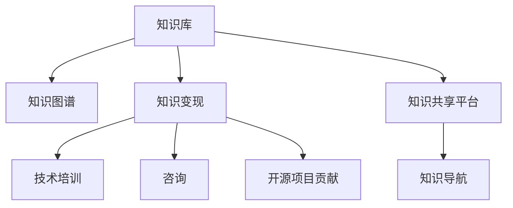

                 

# 程序员的知识管理与变现策略

在信息爆炸、知识泛滥的时代，程序员如何高效地管理知识，将个人知识转化为生产力，进而实现知识变现，成为了一个备受关注的话题。本文将从核心概念、算法原理、实践技巧、应用场景等多个维度，系统介绍程序员的知识管理与变现策略，为IT从业者提供全方位的技术指导。

## 1. 背景介绍

### 1.1 问题由来
随着技术迭代速度的加快，程序员面临的学习任务日益繁重。如何在浩瀚的知识海洋中，挑选、积累并应用关键知识，成为提升工作效率和职业发展的重要课题。知识管理与变现策略的探索，正是应运而生的产物。

### 1.2 问题核心关键点
知识管理与变现的核心在于如何将个人的知识系统化，并通过技术手段转化为可复用、可传播的知识资产。主要关注点包括：

- **知识整理**：如何高效组织和管理个人的技术知识。
- **知识共享**：如何方便他人获取和利用个人知识。
- **知识变现**：如何将知识转化为商业价值或职业竞争力。

### 1.3 问题研究意义
高效的知识管理与变现，对于提升个人工作效率、促进职业发展、增强企业竞争力具有重要意义：

- **提升效率**：系统化管理知识，可快速定位并应用所需技术，减少时间浪费。
- **促进成长**：积累和分享知识，促进自我提升，扩大职业视野。
- **增加收益**：通过知识变现，将个人技能转化为市场价值，获得经济回报。
- **助推企业**：构建知识分享平台，提升团队协作效率，加速技术创新。

## 2. 核心概念与联系

### 2.1 核心概念概述

为更好地理解知识管理与变现的策略，本节将介绍几个密切相关的核心概念：

- **知识库**：一种结构化的知识存储方式，用于保存和管理各类技术文档、代码片段、工具介绍等。
- **知识图谱**：一种图形化表示知识结构的方式，通过节点和边表示实体和关系，帮助理解复杂技术体系。
- **知识图谱**：一种图形化表示知识结构的方式，通过节点和边表示实体和关系，帮助理解复杂技术体系。
- **知识变现**：将知识转化为具有商业价值的商品或服务，如技术培训、咨询、开源项目贡献等。
- **知识共享平台**：一个集知识存储、共享、传播于一体的网络平台，促进知识流动和应用。
- **知识导航**：通过算法和机制，实现知识库中信息的自动推荐和关联，提升知识查找效率。

这些核心概念之间的逻辑关系可以通过以下Mermaid流程图来展示：



这个流程图展示的知识管理与变现的核心概念及其之间的关系：

1. 知识库是知识管理的核心，存储和组织各类技术资料。
2. 知识图谱通过图形化表示，帮助理解复杂的技术体系。
3. 知识变现将知识转化为经济价值，包括技术培训、咨询、开源贡献等形式。
4. 知识共享平台促进知识流动和应用，构建知识生态。
5. 知识导航提升知识查找效率，助力知识发现和应用。

## 3. 核心算法原理 & 具体操作步骤
### 3.1 算法原理概述

知识管理与变现的核心算法包括知识图谱构建、知识导航推荐、知识共享与变现等。其核心思想是：通过技术手段将个人的技术知识系统化，并通过平台、工具等手段进行传播和转化，实现知识变现。

### 3.2 算法步骤详解

#### 3.2.1 知识库构建
- **步骤1**：收集整理技术文档、代码片段、工具介绍等各类技术资料，形成初步的知识库。
- **步骤2**：使用自然语言处理(NLP)技术，对文档进行分词、关键词提取、实体识别等处理，提高知识库的可搜索性。
- **步骤3**：利用知识图谱工具，将知识库中的文档实体及其关系图形化，形成知识图谱。

#### 3.2.2 知识图谱构建
- **步骤1**：设计知识图谱的节点和边结构，如知识实体、技能、项目、技术栈等。
- **步骤2**：使用Python的Neo4j、TinkerPop等图数据库，创建和管理知识图谱。
- **步骤3**：通过数据导入工具，如Stanford NER、spaCy等，将知识库中的信息映射到知识图谱中。

#### 3.2.3 知识导航推荐
- **步骤1**：构建基于搜索引擎的知识导航系统，如Elasticsearch、Solr等。
- **步骤2**：使用自然语言处理技术，对用户查询进行分词、实体识别等处理。
- **步骤3**：通过匹配查询与知识库中的关键词、实体等，生成推荐结果。

#### 3.2.4 知识变现
- **步骤1**：选择合适的知识变现渠道，如技术博客、开源项目、在线课程、技术咨询等。
- **步骤2**：将知识库中的资料，转化为结构化、可传播的知识内容，如文章、课程视频等。
- **步骤3**：通过知识共享平台或社区，发布和推广知识内容，吸引用户关注和互动。

### 3.3 算法优缺点

知识管理与变现算法具有以下优点：
1. **系统化管理**：将零散的技术资料整理成系统化的知识库，便于查找和应用。
2. **高效共享**：通过知识图谱和导航推荐，快速定位所需知识，提高效率。
3. **经济收益**：通过知识变现渠道，将个人知识转化为经济收益，增强职业竞争力。
4. **提升影响力**：通过知识共享平台，提升个人在技术社区的影响力，扩大职业发展空间。

同时，该方法也存在一些局限性：
1. **初始成本高**：构建知识库和知识图谱需要耗费大量时间和精力。
2. **知识更新困难**：知识库需要持续更新，才能保持最新的技术状态。
3. **知识普适性差**：不同类型的知识可能适合不同的变现渠道，需要个性化定制。
4. **隐私安全问题**：知识共享过程中，涉及隐私保护和数据安全，需要谨慎处理。

尽管存在这些局限性，但就目前而言，知识管理与变现算法仍是IT知识管理的主流范式。未来相关研究的重点在于如何进一步降低知识管理成本，提高知识更新效率，同时兼顾隐私保护和知识变现效果。

### 3.4 算法应用领域

知识管理与变现方法在IT领域已经得到了广泛的应用，覆盖了从个人到团队、从企业到社区的多个层面，例如：

- **个人知识管理**：使用知识库和知识图谱管理个人技术文档、项目笔记等。
- **团队协作开发**：构建知识共享平台，促进团队成员间的技术交流和知识积累。
- **企业技术培训**：利用知识库和知识图谱，构建内部培训体系，提升员工技术水平。
- **开源项目贡献**：通过知识图谱和导航推荐，找到适合的开源项目和贡献方向，提高贡献效率。
- **技术咨询服务**：将个人的技术知识转化为咨询服务，帮助企业解决技术难题。

## 4. 数学模型和公式 & 详细讲解 & 举例说明
### 4.1 数学模型构建

知识管理与变现的数学模型主要涉及知识库构建、知识图谱表示、知识导航推荐等几个方面。

#### 4.1.1 知识库构建的数学模型

知识库可以表示为一个由文档和标签组成的集合。每个文档 $d$ 可以表示为 $d=(w_1, w_2, ..., w_n)$，其中 $w_i$ 为文档中的第 $i$ 个词汇。每个文档 $d$ 有一个标签集合 $l$，表示文档的主要内容。知识库的构建可以表示为：

$$
\text{KnowledgeBase} = \{(d_1, l_1), (d_2, l_2), ..., (d_m, l_m)\}
$$

其中，$m$ 为知识库中的文档数量。

#### 4.1.2 知识图谱表示的数学模型

知识图谱可以表示为一个由节点和边组成的图。每个节点 $n$ 表示一个知识实体，可以表示为 $n=(v_1, v_2, ..., v_k)$，其中 $v_i$ 为节点中的第 $i$ 个属性值。每条边 $e$ 表示两个实体之间的关系，可以表示为 $e=(n_1, n_2, r)$，其中 $n_1$ 和 $n_2$ 为边连接的节点，$r$ 为边所表示的关系。知识图谱的表示可以表示为：

$$
\text{KnowledgeGraph} = \{(n_1, n_2, r)\}
$$

#### 4.1.3 知识导航推荐的数学模型

知识导航推荐可以使用向量空间模型(Vector Space Model, VSM)和余弦相似度(Cosine Similarity)进行计算。假设用户查询 $q$ 和文档集合 $D$ 中的文档 $d$ 分别表示为向量 $q=(w_{q1}, w_{q2}, ..., w_{qn})$ 和 $d=(w_{d1}, w_{d2}, ..., w_{dn})$，则文档 $d$ 与查询 $q$ 的余弦相似度为：

$$
\text{similarity}(q, d) = \frac{q \cdot d}{\|q\| \cdot \|d\|}
$$

其中，$\cdot$ 表示向量点乘，$\|q\|$ 和 $\|d\|$ 分别表示向量的长度。

### 4.2 公式推导过程

#### 4.2.1 知识库构建的公式推导

假设有一个知识库，包含 $m$ 个文档，每个文档包含 $n$ 个词汇。知识库的构建公式可以表示为：

$$
\text{KnowledgeBase} = \{(w_{1,i}, l_i), (w_{2,i}, l_i), ..., (w_{n,i}, l_i)\}
$$

其中，$l_i$ 为第 $i$ 个文档的标签集合，$w_{j,i}$ 为文档 $i$ 中第 $j$ 个词汇。

#### 4.2.2 知识图谱表示的公式推导

知识图谱的表示公式可以表示为：

$$
\text{KnowledgeGraph} = \{(n_{i,j}, r_{i,j})\}
$$

其中，$n_{i,j}$ 表示文档 $i$ 中的第 $j$ 个词汇对应的节点，$r_{i,j}$ 表示词汇 $i$ 与词汇 $j$ 之间的关系。

#### 4.2.3 知识导航推荐的公式推导

知识导航推荐的公式可以表示为：

$$
\text{similarity}(q, d) = \frac{\sum_{i=1}^{n} w_{q,i} \cdot w_{d,i}}{\sqrt{\sum_{i=1}^{n} w_{q,i}^2} \cdot \sqrt{\sum_{i=1}^{n} w_{d,i}^2}}
$$

其中，$w_{q,i}$ 和 $w_{d,i}$ 分别为查询 $q$ 和文档 $d$ 中第 $i$ 个词汇的权重。

### 4.3 案例分析与讲解

#### 4.3.1 案例一：技术博客知识库构建

假设某程序员维护了一个技术博客，记录了多个编程项目的技术细节。可以使用Python编写代码，将博客文章转换为知识库，代码如下：

```python
from bs4 import BeautifulSoup
import requests

# 爬取技术博客文章
url = 'https://blog.example.com'
response = requests.get(url)
html = response.content
soup = BeautifulSoup(html, 'html.parser')

# 提取文章标题和正文
articles = soup.find_all('article')
for article in articles:
    title = article.find('h2').text
    content = article.find('div', class_='content').text
    # 将文章转换为知识库格式，存储到数据库中
```

#### 4.3.2 案例二：知识图谱构建

假设有一个技术项目库，包含多个项目，每个项目有多个技术标签。可以使用Python编写代码，将项目标签转换为知识图谱，代码如下：

```python
from py2neo import Graph

# 连接Neo4j数据库
graph = Graph('http://localhost:7474/db/data/', username='neo4j', password='password')

# 创建知识图谱节点和关系
with graph traversal.start('project:Project') as source:
    for project in projects:
        graph.create(
            ('project:Project', 'HAS_LABEL', 'project_label'),
            {'name': project.name, 'description': project.description}
        )
        for label in project.labels:
            graph.merge('project_label', {'name': label})
            graph.create((source, 'HAS_LABEL', 'project_label'), {'name': label})
```

#### 4.3.3 案例三：知识导航推荐

假设有一个用户查询 'Python 3 常用库', 希望推荐相关的文档。可以使用Python编写代码，进行查询推荐，代码如下：

```python
from sklearn.metrics.pairwise import cosine_similarity
from sklearn.feature_extraction.text import TfidfVectorizer

# 构建查询和文档向量
query = 'Python 3 常用库'
documents = ['Python 3 标准库', 'Python 3 第三方库', 'Python 3 框架']
tfidf = TfidfVectorizer()
query_vec = tfidf.fit_transform([query])
doc_vecs = tfidf.transform(documents)

# 计算余弦相似度
similarity = cosine_similarity(query_vec, doc_vecs).tolist()[0]
recommended_docs = [docs for docs, sim in zip(documents, similarity) if sim > 0.5]
print(recommended_docs)
```

## 5. 项目实践：代码实例和详细解释说明
### 5.1 开发环境搭建

在进行知识管理与变现的实践前，我们需要准备好开发环境。以下是使用Python进行开发的环境配置流程：

1. 安装Python：从官网下载并安装Python 3.x版本。
2. 安装相关的Python包：使用pip安装requests、BeautifulSoup、py2neo等Python包。
3. 配置开发环境：使用IDE或编辑器配置Python开发环境。

完成上述步骤后，即可在本地开发环境中开始知识管理与变现的实践。

### 5.2 源代码详细实现

以下是使用Python编写的知识库构建、知识图谱构建和知识导航推荐的代码实现：

#### 5.2.1 知识库构建

```python
import requests
from bs4 import BeautifulSoup
from sqlalchemy import create_engine

# 爬取技术博客文章
url = 'https://blog.example.com'
response = requests.get(url)
html = response.content
soup = BeautifulSoup(html, 'html.parser')

# 提取文章标题和正文
articles = soup.find_all('article')
for article in articles:
    title = article.find('h2').text
    content = article.find('div', class_='content').text
    # 将文章转换为知识库格式，存储到数据库中
    db_engine = create_engine('sqlite:///:memory:')
    db_conn = db_engine.connect()
    db_cursor = db_conn.cursor()
    db_cursor.execute('INSERT INTO articles (title, content) VALUES (?, ?)', (title, content))
    db_conn.commit()
```

#### 5.2.2 知识图谱构建

```python
from py2neo import Graph

# 连接Neo4j数据库
graph = Graph('http://localhost:7474/db/data/', username='neo4j', password='password')

# 创建知识图谱节点和关系
with graph traversal.start('project:Project') as source:
    for project in projects:
        graph.create(
            ('project:Project', 'HAS_LABEL', 'project_label'),
            {'name': project.name, 'description': project.description}
        )
        for label in project.labels:
            graph.merge('project_label', {'name': label})
            graph.create((source, 'HAS_LABEL', 'project_label'), {'name': label})
```

#### 5.2.3 知识导航推荐

```python
from sklearn.metrics.pairwise import cosine_similarity
from sklearn.feature_extraction.text import TfidfVectorizer

# 构建查询和文档向量
query = 'Python 3 常用库'
documents = ['Python 3 标准库', 'Python 3 第三方库', 'Python 3 框架']
tfidf = TfidfVectorizer()
query_vec = tfidf.fit_transform([query])
doc_vecs = tfidf.transform(documents)

# 计算余弦相似度
similarity = cosine_similarity(query_vec, doc_vecs).tolist()[0]
recommended_docs = [docs for docs, sim in zip(documents, similarity) if sim > 0.5]
print(recommended_docs)
```

### 5.3 代码解读与分析

#### 5.3.1 代码1：知识库构建

代码实现通过爬虫技术，从技术博客中提取文章标题和正文，并将它们存储到数据库中。这个代码片段展示了如何利用BeautifulSoup解析HTML文档，并使用SQLite数据库进行数据存储。

#### 5.3.2 代码2：知识图谱构建

代码实现利用Neo4j图数据库，创建知识图谱节点和关系。这个代码片段展示了如何使用Neo4j Python API，进行节点创建和关系建立。

#### 5.3.3 代码3：知识导航推荐

代码实现通过计算文档和查询之间的余弦相似度，进行知识推荐。这个代码片段展示了如何使用Scikit-learn和TfidfVectorizer进行文本向量化，以及计算余弦相似度的过程。

## 6. 实际应用场景
### 6.1 个人知识管理

个人知识管理是知识管理与变现的基础。程序员可以通过构建个人知识库，积累和管理技术文档、项目笔记等。例如，一个正在学习Python的开发者，可以将自己的学习笔记、编程练习和项目代码，整理成知识库，方便日后查找和复用。

#### 6.1.1 场景描述

假设某开发者A正在学习Python，他每天记录了自己的学习心得和技术笔记。A希望将这些笔记整理成一个知识库，方便日后复习和查找。他可以：

- **使用Python爬虫**：从个人博客或技术社区中，爬取相关的技术文章和笔记。
- **使用数据库存储**：将爬取到的文章和笔记存储到SQLite数据库中。
- **使用知识导航**：通过搜索引擎，快速查找和定位需要的技术文档。

#### 6.1.2 实现步骤

1. 使用Python爬虫，从博客和社区中爬取技术文章和笔记。
2. 使用SQLite数据库，存储和组织知识库中的文档。
3. 使用Elasticsearch等搜索引擎，进行知识导航和推荐。

### 6.2 团队协作开发

团队协作开发是知识管理与变现的重要应用场景之一。程序员可以通过构建知识库和知识图谱，促进团队成员间的技术交流和知识积累。例如，一个软件开发团队，可以使用知识库和知识图谱，记录和分享项目的开发过程和技术细节，提高团队的协作效率。

#### 6.2.1 场景描述

假设某软件开发团队正在开发一个新项目，团队成员需要共享和复用之前类似项目的技术文档和代码片段。团队希望建立一个知识共享平台，促进成员间的技术交流和知识积累。

#### 6.2.2 实现步骤

1. 使用GitHub等版本控制工具，记录项目的开发过程和代码变更。
2. 使用知识库和知识图谱工具，构建项目的知识图谱，记录技术文档和代码片段。
3. 使用知识导航推荐系统，快速查找和定位所需技术资料。

### 6.3 企业技术培训

企业技术培训是知识管理与变现的重要应用场景之一。企业可以通过构建知识库和知识图谱，构建内部培训体系，提升员工的技术水平。例如，某IT企业希望提升员工的Python技术水平，可以通过知识库和知识图谱，构建培训课程和案例库，帮助员工系统学习Python技术。

#### 6.3.1 场景描述

假设某IT企业希望提升员工的Python技术水平，他们可以：

- **使用知识库**：记录和存储Python相关的技术文档和代码片段。
- **使用知识图谱**：构建Python技术知识图谱，帮助员工理解技术体系。
- **使用知识导航**：推荐Python相关的培训课程和案例，帮助员工系统学习。

#### 6.3.2 实现步骤

1. 使用知识库，存储和组织Python相关的技术文档和代码片段。
2. 使用知识图谱工具，构建Python技术知识图谱。
3. 使用知识导航推荐系统，推荐Python相关的培训课程和案例。

### 6.4 未来应用展望

随着知识管理与变现技术的不断发展，未来的应用场景将更加丰富，以下是一些未来可能的趋势：

1. **智能知识管理**：利用AI技术，自动整理和管理知识库，提升知识管理的效率和准确性。
2. **多模态知识管理**：将文本、图片、视频等多种形式的知识融合，构建多模态知识库。
3. **实时知识更新**：利用在线协作和实时更新技术，保持知识库的时效性。
4. **知识变现新模式**：探索知识变现的新形式，如虚拟现实(VR)培训、增强现实(AR)应用等。

## 7. 工具和资源推荐
### 7.1 学习资源推荐

为了帮助开发者系统掌握知识管理与变现的理论基础和实践技巧，这里推荐一些优质的学习资源：

1. **《程序员如何高效管理知识》**：一本介绍知识管理与变现策略的书籍，详细讲解了知识库构建、知识图谱表示、知识导航推荐等核心技术。
2. **Coursera《数据科学与机器学习》课程**：斯坦福大学开设的数据科学课程，介绍了机器学习和数据挖掘技术，有助于理解知识推荐算法的原理。
3. **Kaggle数据科学竞赛平台**：一个在线数据科学竞赛平台，提供丰富的数据集和算法挑战，可以帮助开发者实践知识导航推荐等技术。
4. **GitHub开源项目**：GitHub上有很多优秀的开源项目，展示了知识库和知识图谱的应用实例，可以作为学习的参考。

通过对这些资源的学习实践，相信你一定能够快速掌握知识管理与变现的精髓，并用于解决实际的IT问题。

### 7.2 开发工具推荐

高效的开发离不开优秀的工具支持。以下是几款用于知识管理与变现开发的常用工具：

1. **BeautifulSoup**：Python的HTML解析库，用于从网页中提取数据。
2. **py2neo**：Python的Neo4j图数据库接口，用于创建和管理知识图谱。
3. **Scikit-learn**：Python的机器学习库，用于计算余弦相似度等知识导航推荐算法。
4. **Elasticsearch**：分布式搜索引擎，用于构建知识导航推荐系统。
5. **GitHub**：开源项目托管平台，用于记录和分享代码变更和技术文档。

合理利用这些工具，可以显著提升知识管理与变现任务的开发效率，加快创新迭代的步伐。

### 7.3 相关论文推荐

知识管理与变现技术的发展源于学界的持续研究。以下是几篇奠基性的相关论文，推荐阅读：

1. **《知识图谱构建与表示》**：介绍了知识图谱的基本概念和构建方法，为知识管理与变现提供了理论基础。
2. **《基于向量空间模型的知识推荐》**：探讨了向量空间模型在知识推荐中的应用，展示了知识导航推荐的算法原理。
3. **《开源知识库的构建与维护》**：介绍了开源知识库的构建和管理方法，展示了知识共享平台的应用实例。

这些论文代表了大数据和人工智能领域的研究热点，值得深入学习和实践。

## 8. 总结：未来发展趋势与挑战
### 8.1 总结

本文对知识管理与变现的策略进行了系统介绍。首先阐述了知识管理与变现的核心概念和应用意义，明确了知识管理与变现在提升个人工作效率、促进职业发展、增强企业竞争力等方面的重要性。其次，从原理到实践，详细讲解了知识库构建、知识图谱表示、知识导航推荐等核心算法，并给出了具体的代码实现。同时，本文还探讨了知识管理与变现在个人知识管理、团队协作开发、企业技术培训等多个场景中的应用，展示了知识管理与变现的强大潜力和广阔前景。

通过本文的系统梳理，可以看到，知识管理与变现技术正在成为IT知识管理的主流范式，极大地提升了IT从业者的工作效率和职业发展空间。未来，伴随知识管理与变现技术的不断演进，其在更多领域的应用也将日益丰富，为人工智能技术的创新和普及提供新的思路。

### 8.2 未来发展趋势

展望未来，知识管理与变现技术将呈现以下几个发展趋势：

1. **AI驱动知识管理**：利用AI技术，自动整理和管理知识库，提升知识管理的效率和准确性。
2. **多模态知识管理**：将文本、图片、视频等多种形式的知识融合，构建多模态知识库。
3. **实时知识更新**：利用在线协作和实时更新技术，保持知识库的时效性。
4. **知识变现新模式**：探索知识变现的新形式，如虚拟现实(VR)培训、增强现实(AR)应用等。

### 8.3 面临的挑战

尽管知识管理与变现技术已经取得了显著进展，但在迈向更加智能化、普适化应用的过程中，仍面临以下挑战：

1. **知识库构建成本高**：构建知识库和知识图谱需要耗费大量时间和精力。
2. **知识更新困难**：知识库需要持续更新，才能保持最新的技术状态。
3. **知识普适性差**：不同类型的知识可能适合不同的变现渠道，需要个性化定制。
4. **隐私安全问题**：知识共享过程中，涉及隐私保护和数据安全，需要谨慎处理。

尽管存在这些挑战，但随着知识管理与变现技术的不断演进，相关研究将在减少知识管理成本、提高知识更新效率、兼顾隐私保护和知识变现效果等方面取得新的突破。

### 8.4 研究展望

面向未来，知识管理与变现技术需要在以下几个方面寻求新的突破：

1. **AI驱动的知识整理**：利用AI技术，自动整理和管理知识库，提升知识管理的效率和准确性。
2. **多模态知识管理**：将文本、图片、视频等多种形式的知识融合，构建多模态知识库。
3. **实时知识更新**：利用在线协作和实时更新技术，保持知识库的时效性。
4. **知识变现新模式**：探索知识变现的新形式，如虚拟现实(VR)培训、增强现实(AR)应用等。
5. **知识导航推荐**：引入更多先进的推荐算法，如深度学习、图神经网络等，提升知识导航推荐的精度和效果。
6. **知识图谱表示**：引入更多先验知识，如知识图谱的因果推理、对抗训练等，提升知识图谱的鲁棒性和可解释性。

这些研究方向将进一步拓展知识管理与变现技术的应用边界，推动知识库和知识图谱技术的发展，为IT从业者提供更高效、更全面的知识管理与变现解决方案。

## 9. 附录：常见问题与解答

**Q1: 知识管理与变现技术的核心是什么？**

A: 知识管理与变现技术的核心在于将个人的技术知识系统化，并通过技术手段进行传播和转化，实现知识变现。主要包括以下几个方面：

1. **知识库构建**：通过爬虫技术，从各种来源获取技术文档、代码片段等知识资料，构建知识库。
2. **知识图谱表示**：将知识库中的文档和标签进行图形化表示，形成知识图谱，便于理解和检索。
3. **知识导航推荐**：利用搜索引擎和推荐算法，实现知识导航和推荐，提升知识查找效率。

**Q2: 知识库和知识图谱如何构建？**

A: 知识库和知识图谱的构建主要包括以下步骤：

1. **知识库构建**：使用Python爬虫技术，从各种来源获取技术文档、代码片段等知识资料，构建知识库。可以使用SQLite数据库进行存储和组织。
2. **知识图谱表示**：使用Neo4j等图数据库，创建知识图谱节点和关系。将知识库中的文档和标签进行图形化表示，形成知识图谱。

**Q3: 知识导航推荐的核心算法是什么？**

A: 知识导航推荐的核心算法包括余弦相似度、TF-IDF等向量空间模型算法。通过计算文档和查询之间的相似度，实现知识导航和推荐。

**Q4: 知识管理与变现技术有哪些应用场景？**

A: 知识管理与变现技术在多个场景中都有广泛应用，包括：

1. **个人知识管理**：通过知识库和知识图谱，积累和管理个人技术文档、代码片段等。
2. **团队协作开发**：构建知识共享平台，促进团队成员间的技术交流和知识积累。
3. **企业技术培训**：构建内部培训体系，提升员工的技术水平。
4. **开源项目贡献**：通过知识导航推荐，找到适合的开源项目和贡献方向，提高贡献效率。
5. **技术咨询服务**：将个人的技术知识转化为咨询服务，帮助企业解决技术难题。

**Q5: 知识管理与变现技术面临哪些挑战？**

A: 知识管理与变现技术面临以下挑战：

1. **知识库构建成本高**：构建知识库和知识图谱需要耗费大量时间和精力。
2. **知识更新困难**：知识库需要持续更新，才能保持最新的技术状态。
3. **知识普适性差**：不同类型的知识可能适合不同的变现渠道，需要个性化定制。
4. **隐私安全问题**：知识共享过程中，涉及隐私保护和数据安全，需要谨慎处理。

**Q6: 知识管理与变现技术的未来发展方向是什么？**

A: 知识管理与变现技术的未来发展方向包括：

1. **AI驱动知识管理**：利用AI技术，自动整理和管理知识库，提升知识管理的效率和准确性。
2. **多模态知识管理**：将文本、图片、视频等多种形式的知识融合，构建多模态知识库。
3. **实时知识更新**：利用在线协作和实时更新技术，保持知识库的时效性。
4. **知识变现新模式**：探索知识变现的新形式，如虚拟现实(VR)培训、增强现实(AR)应用等。

**Q7: 知识导航推荐的核心算法是什么？**

A: 知识导航推荐的核心算法包括余弦相似度、TF-IDF等向量空间模型算法。通过计算文档和查询之间的相似度，实现知识导航和推荐。

---

作者：禅与计算机程序设计艺术 / Zen and the Art of Computer Programming

