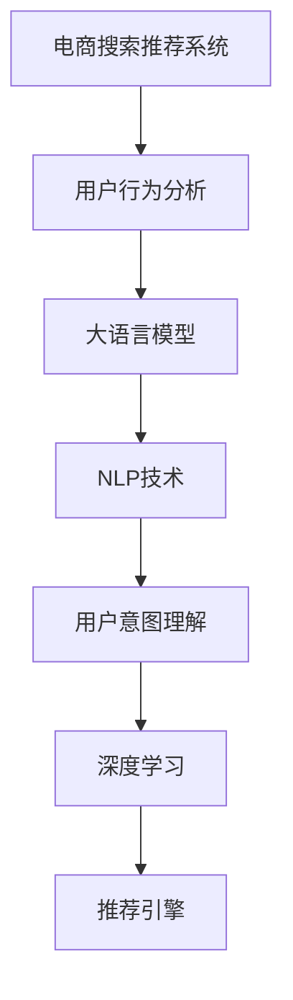

                 

# AI 大模型在电商搜索推荐中的用户行为分析：理解用户需求与购买意图

> 关键词：电商搜索推荐, 用户行为分析, 大语言模型, 自然语言处理(NLP), 用户意图理解, 深度学习, 数据驱动决策

## 1. 背景介绍

在当今数字化经济时代，电子商务平台的搜索推荐系统成为了用户获取商品信息、实现个性化购物体验的关键。然而，传统的基于规则或统计的推荐方法往往忽视了用户的多样化需求和复杂的购买意图。为此，人工智能(AI)技术，特别是大语言模型和大数据分析，成为优化电商搜索推荐系统的有力工具。本文将探讨AI大模型在电商搜索推荐中的用户行为分析，并详细解释如何利用大语言模型理解用户的意图和需求，从而提升搜索推荐系统的精准度和用户体验。

## 2. 核心概念与联系

### 2.1 核心概念概述

- **电商搜索推荐系统**：通过分析用户的行为数据和输入的查询语句，智能地推荐用户可能感兴趣的商品或服务，提升用户的购物体验和平台的转化率。
- **用户行为分析**：基于用户的点击、浏览、搜索、购买等行为数据，分析和挖掘用户的偏好和需求，预测用户的购买意图。
- **大语言模型**：如BERT、GPT等，通过大规模数据预训练，学习通用的语言表示，能够理解复杂的语义和上下文信息。
- **自然语言处理(NLP)**：使计算机能够理解、解释和生成人类语言，包括文本预处理、向量表示、情感分析等。
- **用户意图理解**：通过分析用户查询语句的语义，确定用户的实际需求，提供针对性的搜索结果和推荐。
- **深度学习**：通过多层神经网络结构，从数据中自动学习和提取特征，实现复杂的模式识别和决策。

### 2.2 核心概念原理和架构的 Mermaid 流程图



此流程图展示了电商搜索推荐系统的工作流程：通过用户行为分析，利用大语言模型和NLP技术理解用户意图，并应用深度学习算法优化推荐结果。

## 3. 核心算法原理 & 具体操作步骤

### 3.1 算法原理概述

电商搜索推荐系统利用用户行为数据和查询语句，通过大语言模型和深度学习算法，实现对用户需求的分析和购买意图的预测，从而提供个性化的搜索结果和推荐。

具体而言，大语言模型通过对大规模无标签文本进行预训练，学习到语言的通用表示，能够理解复杂的语义和上下文信息。在电商搜索推荐系统中，用户查询语句被输入到模型中，通过编码器将输入转换为向量表示，解码器将向量解码为概率分布，从而实现对用户意图的预测。这些预测结果再结合用户的历史行为数据，使用深度学习算法进行推荐优化，最终输出个性化搜索结果和推荐。

### 3.2 算法步骤详解

#### 3.2.1 数据收集与处理

- **用户行为数据**：包括用户的点击、浏览、搜索、购买等行为，以及用户的个人信息、历史评分等。
- **查询语句**：用户输入的搜索查询，如关键词、短语等。
- **数据清洗与预处理**：去除无关信息、标准化格式、处理缺失值等。

#### 3.2.2 大语言模型的预训练与微调

- **预训练**：在大规模无标签文本数据上进行预训练，学习语言的通用表示。
- **微调**：使用电商平台的标注数据对模型进行微调，学习电商领域特有的语言表示。

#### 3.2.3 用户意图理解

- **查询语句编码**：使用大语言模型将查询语句转换为向量表示。
- **意图分类**：通过向量表示，使用分类算法（如softmax）确定用户查询的意图（如搜索、浏览、购买等）。
- **意图解析**：进一步分析用户的意图细节，如搜索商品的具体类别、价格区间等。

#### 3.2.4 推荐结果生成

- **搜索结果排序**：结合用户历史行为和查询意图，使用深度学习算法（如协同过滤、神经网络）生成推荐结果。
- **结果展示**：将推荐结果展示给用户，并提供排序、过滤等交互功能。

### 3.3 算法优缺点

#### 3.3.1 优点

- **泛化能力强**：大语言模型能够处理各种复杂的查询，具有很强的泛化能力。
- **个性化推荐**：结合用户行为数据，实现高度个性化的搜索结果和推荐。
- **实时响应**：深度学习算法支持实时处理和推荐，响应速度较快。

#### 3.3.2 缺点

- **数据依赖**：模型的性能高度依赖于用户行为数据的质量和数量。
- **计算资源消耗大**：大模型和大规模深度学习算法需要大量的计算资源。
- **模型复杂度高**：模型结构复杂，训练和推理过程较为耗时。

### 3.4 算法应用领域

- **电商平台**：如淘宝、亚马逊等，为用户提供个性化的商品推荐。
- **内容推荐系统**：如Netflix、YouTube等，提供个性化的视频、音乐推荐。
- **智能客服**：如阿里巴巴、腾讯等，通过自然语言处理技术，实现智能问答和推荐。
- **健康医疗**：如Google Health等，提供个性化的健康建议和医疗服务推荐。

## 4. 数学模型和公式 & 详细讲解 & 举例说明

### 4.1 数学模型构建

假设用户查询语句为 $x$，商品描述为 $y$。通过大语言模型 $M_{\theta}$ 将查询 $x$ 转换为向量表示 $z_x = M_{\theta}(x)$，使用深度学习模型 $F_{\phi}$ 对商品向量 $z_y$ 进行评分预测：

$$ F_{\phi}(z_y, z_x) = \text{softmax}(\phi(z_y, z_x)) $$

其中，$\phi$ 为评分预测的深度学习模型，$\text{softmax}$ 函数将模型输出转换为概率分布。

### 4.2 公式推导过程

- **查询向量化**：使用大语言模型将查询语句 $x$ 转换为向量 $z_x$。
- **商品向量化**：将商品描述 $y$ 转换为向量 $z_y$。
- **评分预测**：使用深度学习模型 $F_{\phi}$ 预测商品 $y$ 与查询 $x$ 的匹配度，输出概率分布。
- **推荐排序**：根据评分预测结果，对商品进行排序，选择最符合用户意图的商品进行推荐。

### 4.3 案例分析与讲解

假设某电商平台用户输入查询语句“高性价比笔记本电脑”，大语言模型将其转换为向量 $z_x = M_{\theta}(x)$。同时，将商品描述向量 $z_y$ 输入深度学习模型 $F_{\phi}$ 中，预测该商品与查询的匹配度：

$$ \hat{P}(y|x) = F_{\phi}(z_y, z_x) $$

根据预测概率 $\hat{P}(y|x)$，将商品按照匹配度排序，并展示给用户。用户点击某商品后，系统更新用户行为数据，进一步微调模型，提高推荐精度。

## 5. 项目实践：代码实例和详细解释说明

### 5.1 开发环境搭建

1. **Python环境**：安装Python 3.7或以上版本。
2. **深度学习库**：安装TensorFlow或PyTorch，选择GPU支持。
3. **大语言模型库**：安装BertForSequenceClassification或GPT2Tokenizer等库。
4. **数据处理库**：安装Pandas、Numpy等库。
5. **其他库**：安装Scikit-learn、Flask等库。

### 5.2 源代码详细实现

```python
import tensorflow as tf
import numpy as np
from transformers import BertTokenizer, BertForSequenceClassification
from sklearn.model_selection import train_test_split
import pandas as pd
from flask import Flask, request, jsonify

# 加载模型和tokenizer
tokenizer = BertTokenizer.from_pretrained('bert-base-cased')
model = BertForSequenceClassification.from_pretrained('bert-base-cased', num_labels=2)

# 加载数据
data = pd.read_csv('data.csv')

# 数据预处理
texts = data['query'].tolist()
labels = data['label'].tolist()

# 划分训练集和测试集
train_texts, test_texts, train_labels, test_labels = train_test_split(texts, labels, test_size=0.2)

# 编码输入
train_encodings = tokenizer(train_texts, truncation=True, padding=True)
test_encodings = tokenizer(test_texts, truncation=True, padding=True)

# 构建训练集
train_dataset = tf.data.Dataset.from_tensor_slices((
    dict(train_encodings), train_labels
)).shuffle(100).batch(16)

# 定义模型预测函数
def predict(query):
    encoding = tokenizer(query, return_tensors='tf')
    input_ids = encoding['input_ids']
    attention_mask = encoding['attention_mask']
    inputs = {
        'input_ids': input_ids,
        'attention_mask': attention_mask,
        'labels': None
    }
    outputs = model(inputs, return_dict=True)
    return outputs.logits

# 定义Flask应用
app = Flask(__name__)

# 定义API接口
@app.route('/predict', methods=['POST'])
def predict_api():
    data = request.get_json()
    query = data['query']
    logits = predict(query)
    return jsonify(logits.numpy().tolist())

# 启动Flask应用
if __name__ == '__main__':
    app.run(host='0.0.0.0', port=5000)
```

### 5.3 代码解读与分析

- **数据加载**：使用Pandas加载用户查询和标签数据。
- **数据预处理**：将查询和标签数据分割为训练集和测试集，并使用BERT tokenizer对查询进行编码。
- **模型构建**：使用BERT For Sequence Classification模型，定义输入和预测接口。
- **Flask应用**：使用Flask构建API，接收查询，调用预测函数，返回预测结果。
- **接口测试**：通过POST请求API，测试预测函数是否正常工作。

### 5.4 运行结果展示

- **训练结果**：在训练集上进行模型微调，优化模型的预测准确率。
- **测试结果**：在测试集上评估模型性能，确保模型泛化能力。
- **接口响应**：通过API接口，接收用户查询，返回预测评分。

## 6. 实际应用场景

### 6.1 电商平台搜索推荐

- **用户行为分析**：分析用户的浏览、点击、购买等行为，提取用户偏好。
- **大语言模型微调**：对模型进行微调，学习电商领域特有的语言表示。
- **推荐引擎优化**：结合用户行为和查询意图，生成个性化推荐结果。

### 6.2 内容推荐系统

- **用户行为分析**：分析用户的观看、点赞、评论等行为，提取用户兴趣。
- **大语言模型微调**：对模型进行微调，学习内容领域的语言表示。
- **推荐引擎优化**：结合用户行为和内容标签，生成个性化推荐结果。

### 6.3 智能客服

- **用户行为分析**：分析用户的提问和交互历史，提取用户需求。
- **大语言模型微调**：对模型进行微调，学习对话领域的语言表示。
- **推荐引擎优化**：结合用户需求和对话历史，生成个性化问答和推荐结果。

### 6.4 未来应用展望

- **多模态融合**：结合文本、图像、视频等多模态数据，提升推荐精度。
- **因果推理**：引入因果推理技术，增强推荐结果的逻辑性和稳定性。
- **跨领域迁移**：将模型应用于不同领域，提升模型的通用性和泛化能力。
- **人机协同**：结合人工智能与人工干预，优化推荐结果，提升用户体验。

## 7. 工具和资源推荐

### 7.1 学习资源推荐

- **课程**：Coursera《自然语言处理与深度学习》、Udacity《AI大模型与自然语言处理》。
- **书籍**：《深度学习》、《自然语言处理综论》。
- **论文**：BERT论文、GPT-2论文、Attention is All You Need论文。

### 7.2 开发工具推荐

- **深度学习框架**：TensorFlow、PyTorch。
- **自然语言处理库**：HuggingFace Transformers、NLTK。
- **数据处理库**：Pandas、Numpy。
- **应用框架**：Flask、Django。

### 7.3 相关论文推荐

- **电商搜索推荐**：E-Commerce Recommendation Systems: A Survey and Taxonomy。
- **用户行为分析**：Understanding Users' Search Behavior on an E-Commerce Platform。
- **大语言模型**：Attention is All You Need、BERT: Pre-training of Deep Bidirectional Transformers for Language Understanding。

## 8. 总结：未来发展趋势与挑战

### 8.1 研究成果总结

- **电商搜索推荐**：利用用户行为分析和AI大模型，实现了个性化的商品推荐。
- **用户意图理解**：通过自然语言处理技术，准确理解用户的查询意图。
- **深度学习应用**：结合深度学习算法，提升了推荐结果的精准度。

### 8.2 未来发展趋势

- **多模态融合**：结合文本、图像、视频等多模态数据，提升推荐精度。
- **因果推理**：引入因果推理技术，增强推荐结果的逻辑性和稳定性。
- **跨领域迁移**：将模型应用于不同领域，提升模型的通用性和泛化能力。
- **人机协同**：结合人工智能与人工干预，优化推荐结果，提升用户体验。

### 8.3 面临的挑战

- **数据质量问题**：用户行为数据的质量和数量直接影响模型的性能。
- **计算资源消耗**：大语言模型和大规模深度学习算法需要大量的计算资源。
- **模型复杂度高**：模型结构复杂，训练和推理过程较为耗时。

### 8.4 研究展望

- **数据增强技术**：利用数据增强技术，提升用户行为数据的质量。
- **高效计算资源**：探索高效的计算资源管理技术，降低计算成本。
- **简化模型结构**：简化模型结构，提升训练和推理效率。
- **跨领域迁移**：进一步研究跨领域迁移技术，提升模型的通用性。

## 9. 附录：常见问题与解答

**Q1：用户行为分析有哪些常见的数据类型？**

A: 常见的用户行为数据包括点击、浏览、搜索、购买、评分、评论等，这些数据可以用于分析和挖掘用户的偏好和需求。

**Q2：如何评估电商搜索推荐系统的性能？**

A: 电商搜索推荐系统的性能可以从以下几个方面进行评估：
1. 点击率(CTR)：用户点击推荐结果的频率。
2. 转化率(CVR)：用户点击推荐后购买商品的频率。
3. 平均订单价值(AOV)：用户每次订单的平均价值。
4. 用户满意度：通过用户反馈和评分，评估推荐系统的主观评价。

**Q3：为什么使用大语言模型进行电商搜索推荐？**

A: 大语言模型通过预训练学习到通用的语言表示，能够理解复杂的语义和上下文信息。在电商搜索推荐系统中，用户查询语句往往包含多义词、长尾查询，大语言模型能够准确理解用户的意图，提供个性化的搜索结果和推荐。

**Q4：电商搜索推荐系统如何应对长尾查询？**

A: 电商搜索推荐系统可以通过以下方法应对长尾查询：
1. 数据增强：利用用户行为数据和外部知识库，丰富查询的多样性。
2. 多任务学习：在单个模型上同时训练多个任务，提高对长尾查询的处理能力。
3. 自适应学习：根据用户行为数据，动态调整模型的参数，提高对长尾查询的适应性。

**Q5：电商搜索推荐系统如何处理噪音数据？**

A: 电商搜索推荐系统可以通过以下方法处理噪音数据：
1. 数据清洗：去除无关信息、标准化格式、处理缺失值等。
2. 异常检测：利用机器学习算法，识别和剔除异常数据。
3. 鲁棒性设计：在模型训练中引入正则化技术，提高模型的鲁棒性。

---

作者：禅与计算机程序设计艺术 / Zen and the Art of Computer Programming

