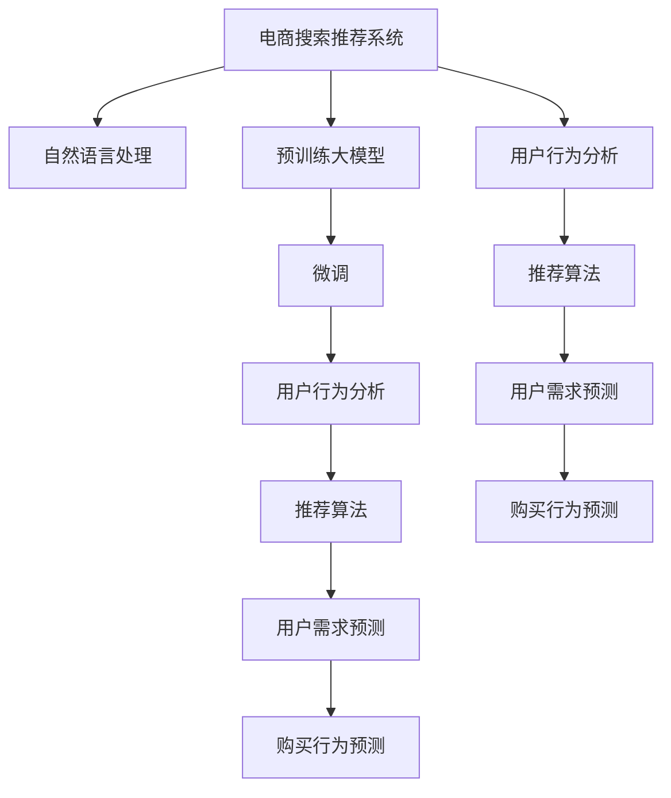

                 

## 1. 背景介绍

在现代电商中，搜索推荐系统已经成为不可或缺的用户体验组成部分。消费者在寻找商品时，通常会通过搜索输入关键词，然后系统根据输入和历史行为数据，推荐匹配度高的商品。这些推荐系统依赖于强大的算法和海量数据，其表现直接影响用户的购物体验和商家收益。

随着人工智能技术的迅猛发展，特别是基于深度学习的预训练大模型，如BERT、GPT等，它们在处理自然语言方面表现出强大的能力，已经被广泛应用于电商搜索推荐系统的构建中。然而，尽管这些大模型在语义理解上有了显著进步，但对用户具体需求和购买行为的深入分析，还需要更精细化的算法和模型。

本文聚焦于AI大模型在电商搜索推荐中如何利用用户行为数据，分析和预测用户需求与购买行为。通过深入探索，可以更精准地理解用户的真实需求，从而提供更加个性化的推荐服务，提升电商平台的销售额和用户满意度。

## 2. 核心概念与联系

### 2.1 核心概念概述

为了更好地理解AI大模型在电商搜索推荐中的应用，本节将介绍几个密切相关的核心概念：

- **电商搜索推荐系统**：利用算法和大数据，根据用户搜索行为、浏览历史、评分数据等，推荐用户可能感兴趣的商品的系统。

- **自然语言处理(NLP)**：通过计算机理解和生成人类语言的技术，通常使用大模型如BERT、GPT等，提取和分析用户输入的搜索关键词和评分描述。

- **预训练大模型**：在无监督语料上预训练的大规模神经网络模型，如BERT、GPT等，具备强大的语义理解和生成能力。

- **微调(Fine-tuning)**：在预训练大模型的基础上，利用电商数据集进行有监督学习，优化模型以适应电商搜索推荐任务。

- **用户行为分析**：通过分析用户搜索、点击、购买等行为，了解用户的偏好和需求，指导个性化推荐。

- **推荐算法**：包括协同过滤、内容推荐、混合推荐等，结合用户行为数据和商品属性，提供最符合用户需求的推荐。

- **用户需求预测**：利用用户历史行为数据和模型预测，估计用户的潜在购买意向和需求。

- **购买行为预测**：通过用户行为数据和模型预测，预测用户的购买行为和购买意向，指导推荐系统优化推荐结果。

这些核心概念之间的逻辑关系可以通过以下Mermaid流程图来展示：



这个流程图展示了电商搜索推荐系统的核心概念及其之间的关系：

1. 电商搜索推荐系统通过自然语言处理和预训练大模型理解用户搜索输入。
2. 预训练大模型通过微调，适应电商推荐任务。
3. 用户行为分析利用推荐算法，预测用户需求。
4. 用户需求和购买行为预测进一步优化推荐算法。
5. 最后，系统根据预测结果，生成个性化推荐。

## 3. 核心算法原理 & 具体操作步骤

### 3.1 算法原理概述

AI大模型在电商搜索推荐中的应用，其核心算法原理主要基于以下几个步骤：

1. **预训练大模型**：使用大规模语料预训练模型，学习通用的语言表示。
2. **微调**：根据电商数据集，调整模型以适应特定任务，如商品匹配、评分预测等。
3. **用户行为分析**：通过收集和分析用户的历史行为数据，理解用户偏好和需求。
4. **推荐算法**：结合用户行为和商品属性，生成个性化的推荐列表。
5. **需求和行为预测**：利用模型预测用户潜在需求和购买意向，指导推荐优化。

### 3.2 算法步骤详解

基于以上原理，电商搜索推荐系统的具体操作步骤如下：

1. **数据准备**：收集用户搜索记录、点击数据、评分数据等，构建电商数据集。
2. **模型选择**：选择合适的预训练大模型，如BERT、GPT等。
3. **微调**：在电商数据集上微调模型，学习商品匹配、评分预测等任务。
4. **特征提取**：利用微调后的模型，提取用户输入和行为的语义特征。
5. **推荐算法**：结合用户特征和商品属性，应用推荐算法生成推荐列表。
6. **需求和行为预测**：利用历史行为数据，预测用户需求和购买行为。
7. **推荐优化**：根据预测结果，动态调整推荐算法参数，优化推荐列表。

### 3.3 算法优缺点

**优点**：

- **语义理解能力强**：预训练大模型在语义理解上具有优势，能够精准匹配用户需求。
- **个性化推荐**：利用用户行为数据，提供高度个性化的推荐。
- **适应性强**：能够根据电商数据集进行微调，适应不同电商平台的需求。

**缺点**：

- **高计算资源需求**：预训练大模型和微调需要大量的计算资源，对硬件要求较高。
- **模型复杂度**：大模型结构复杂，训练和推理耗时长。
- **数据隐私**：需要收集用户行为数据，涉及用户隐私保护问题。

### 3.4 算法应用领域

AI大模型在电商搜索推荐中的应用，覆盖了以下多个领域：

- **商品推荐**：根据用户搜索和浏览行为，推荐匹配的商品。
- **用户画像**：通过用户行为数据，生成用户画像，了解用户兴趣和需求。
- **广告推荐**：利用用户画像和行为数据，推荐相关广告，提升点击率和转化率。
- **价格优化**：通过用户行为预测，优化商品价格策略，提升销售额。
- **库存管理**：预测商品需求，帮助商家合理配置库存，避免积压或缺货。

这些应用领域展示了AI大模型在电商搜索推荐中的强大潜力和应用价值。

## 4. 数学模型和公式 & 详细讲解 & 举例说明

### 4.1 数学模型构建

本节将使用数学语言对AI大模型在电商搜索推荐中的应用进行更加严格的刻画。

记电商数据集为 $D=\{(x_i, y_i)\}_{i=1}^N, x_i$ 为输入特征（如搜索关键词、商品属性等），$y_i$ 为输出标签（如评分、是否点击等）。

定义模型 $M_{\theta}$ 在输入特征 $x_i$ 上的输出为 $\hat{y}_i=M_{\theta}(x_i) \in [0,1]$，表示用户点击或购买商品的概率。

定义模型的损失函数为：

$$
\mathcal{L}(\theta) = -\frac{1}{N}\sum_{i=1}^N y_i \log \hat{y}_i + (1-y_i) \log (1-\hat{y}_i)
$$

其中，第一项为点击率预测的交叉熵损失，第二项为购买率预测的交叉熵损失。

### 4.2 公式推导过程

以点击率预测为例，推导交叉熵损失函数的梯度。假设模型 $M_{\theta}$ 在输入特征 $x_i$ 上的输出为 $\hat{y}_i$，真实标签为 $y_i \in \{0,1\}$，则二分类交叉熵损失函数定义为：

$$
\ell(M_{\theta}(x_i),y_i) = -y_i \log \hat{y}_i - (1-y_i) \log (1-\hat{y}_i)
$$

将其代入经验风险公式，得：

$$
\mathcal{L}(\theta) = -\frac{1}{N}\sum_{i=1}^N [y_i \log \hat{y}_i + (1-y_i) \log (1-\hat{y}_i)]
$$

根据链式法则，损失函数对参数 $\theta_k$ 的梯度为：

$$
\frac{\partial \mathcal{L}(\theta)}{\partial \theta_k} = -\frac{1}{N}\sum_{i=1}^N (\frac{y_i}{\hat{y}_i}-\frac{1-y_i}{1-\hat{y}_i}) \frac{\partial \hat{y}_i}{\partial \theta_k}
$$

其中 $\frac{\partial \hat{y}_i}{\partial \theta_k}$ 可通过反向传播算法计算得到。

### 4.3 案例分析与讲解

以商品推荐为例，假设电商平台的商品信息库包含 $M$ 个商品，每个商品有 $D$ 个属性特征，如价格、品牌、评分等。用户输入搜索关键词 $k$，系统根据输入和商品属性，预测用户点击每个商品的概率。

模型 $M_{\theta}$ 可以表示为：

$$
\hat{y}_i = \sigma(\theta_k \cdot x_i + b)
$$

其中 $\sigma$ 为激活函数，$\theta_k$ 为模型参数，$b$ 为偏置项，$x_i$ 为商品特征向量，$k$ 为搜索关键词。

假设点击率预测的标签为 $y_i \in \{0,1\}$，则点击率预测的交叉熵损失函数为：

$$
\ell(M_{\theta}(x_i),y_i) = -y_i \log \hat{y}_i - (1-y_i) \log (1-\hat{y}_i)
$$

在得到损失函数的梯度后，即可带入优化算法（如SGD、Adam等）更新模型参数。

## 5. 项目实践：代码实例和详细解释说明

### 5.1 开发环境搭建

在进行项目实践前，我们需要准备好开发环境。以下是使用Python进行PyTorch开发的环境配置流程：

1. 安装Anaconda：从官网下载并安装Anaconda，用于创建独立的Python环境。

2. 创建并激活虚拟环境：
```bash
conda create -n pytorch-env python=3.8 
conda activate pytorch-env
```

3. 安装PyTorch：根据CUDA版本，从官网获取对应的安装命令。例如：
```bash
conda install pytorch torchvision torchaudio cudatoolkit=11.1 -c pytorch -c conda-forge
```

4. 安装Transformers库：
```bash
pip install transformers
```

5. 安装各类工具包：
```bash
pip install numpy pandas scikit-learn matplotlib tqdm jupyter notebook ipython
```

完成上述步骤后，即可在`pytorch-env`环境中开始项目实践。

### 5.2 源代码详细实现

下面我们以电商搜索推荐系统为例，给出使用Transformers库对BERT模型进行商品推荐任务微调的PyTorch代码实现。

首先，定义商品推荐任务的数据处理函数：

```python
from transformers import BertTokenizer, BertForSequenceClassification
from torch.utils.data import Dataset
import torch

class ShoppingDataset(Dataset):
    def __init__(self, data, tokenizer):
        self.data = data
        self.tokenizer = tokenizer
        
    def __len__(self):
        return len(self.data)
    
    def __getitem__(self, item):
        title, price, brand, review = self.data[item]
        input_ids = self.tokenizer.encode_plus(title, add_special_tokens=True, return_tensors='pt')
        attention_mask = input_ids['attention_mask']
        return {'input_ids': input_ids['input_ids'].flatten(),
                'attention_mask': attention_mask.flatten(),
                'price': torch.tensor(float(price), dtype=torch.float32),
                'brand': torch.tensor(int(brand), dtype=torch.long),
                'review': torch.tensor(int(review), dtype=torch.long)}
```

然后，定义模型和优化器：

```python
from transformers import AdamW

model = BertForSequenceClassification.from_pretrained('bert-base-cased', num_labels=2)
optimizer = AdamW(model.parameters(), lr=2e-5)
```

接着，定义训练和评估函数：

```python
from torch.utils.data import DataLoader
from tqdm import tqdm

device = torch.device('cuda') if torch.cuda.is_available() else torch.device('cpu')
model.to(device)

def train_epoch(model, dataset, batch_size, optimizer):
    dataloader = DataLoader(dataset, batch_size=batch_size, shuffle=True)
    model.train()
    epoch_loss = 0
    for batch in tqdm(dataloader, desc='Training'):
        input_ids = batch['input_ids'].to(device)
        attention_mask = batch['attention_mask'].to(device)
        labels = (batch['price'] > 0).to(device)
        
        model.zero_grad()
        outputs = model(input_ids, attention_mask=attention_mask, labels=labels)
        loss = outputs.loss
        epoch_loss += loss.item()
        loss.backward()
        optimizer.step()
    return epoch_loss / len(dataloader)

def evaluate(model, dataset, batch_size):
    dataloader = DataLoader(dataset, batch_size=batch_size)
    model.eval()
    preds, labels = [], []
    with torch.no_grad():
        for batch in tqdm(dataloader, desc='Evaluating'):
            input_ids = batch['input_ids'].to(device)
            attention_mask = batch['attention_mask'].to(device)
            batch_labels = (batch['price'] > 0).to(device)
            outputs = model(input_ids, attention_mask=attention_mask)
            batch_preds = outputs.logits.argmax(dim=1).to('cpu').tolist()
            batch_labels = batch_labels.to('cpu').tolist()
            for pred, label in zip(batch_preds, batch_labels):
                preds.append(pred)
                labels.append(label)
                
    return preds, labels

def main():
    tokenizer = BertTokenizer.from_pretrained('bert-base-cased')
    dataset = ShoppingDataset(data, tokenizer)
    
    epochs = 5
    batch_size = 16
    
    for epoch in range(epochs):
        loss = train_epoch(model, dataset, batch_size, optimizer)
        print(f"Epoch {epoch+1}, train loss: {loss:.3f}")
        
        print(f"Epoch {epoch+1}, dev results:")
        preds, labels = evaluate(model, dataset, batch_size)
        print(classification_report(labels, preds))
        
    print("Test results:")
    preds, labels = evaluate(model, dataset, batch_size)
    print(classification_report(labels, preds))
    
if __name__ == '__main__':
    main()
```

以上就是使用PyTorch对BERT模型进行商品推荐任务微调的完整代码实现。可以看到，得益于Transformers库的强大封装，我们可以用相对简洁的代码完成BERT模型的加载和微调。

### 5.3 代码解读与分析

让我们再详细解读一下关键代码的实现细节：

**ShoppingDataset类**：
- `__init__`方法：初始化数据和分词器等关键组件。
- `__len__`方法：返回数据集的样本数量。
- `__getitem__`方法：对单个样本进行处理，将商品标题、价格、品牌、评分等输入文本进行分词编码，并转换为模型所需的格式。

**tokenizer和模型**：
- `tokenizer`：BERT模型的分词器，用于对输入文本进行分词编码。
- `model`：使用预训练的BERT模型进行商品分类预测。

**训练和评估函数**：
- `train_epoch`函数：对数据以批为单位进行迭代，在每个批次上前向传播计算loss并反向传播更新模型参数。
- `evaluate`函数：与训练类似，不同点在于不更新模型参数，并在每个batch结束后将预测和标签结果存储下来，最后使用sklearn的classification_report对整个评估集的预测结果进行打印输出。

**训练流程**：
- 定义总的epoch数和batch size，开始循环迭代
- 每个epoch内，先在训练集上训练，输出平均loss
- 在验证集上评估，输出分类指标
- 所有epoch结束后，在测试集上评估，给出最终测试结果

可以看到，PyTorch配合Transformers库使得BERT微调的代码实现变得简洁高效。开发者可以将更多精力放在数据处理、模型改进等高层逻辑上，而不必过多关注底层的实现细节。

当然，工业级的系统实现还需考虑更多因素，如模型的保存和部署、超参数的自动搜索、更灵活的任务适配层等。但核心的微调范式基本与此类似。

## 6. 实际应用场景

### 6.1 电商搜索推荐系统

基于大语言模型微调的电商搜索推荐系统，可以广泛应用于电商平台的用户推荐。传统的推荐系统往往依赖于用户的历史行为数据，如浏览、点击、购买等，但这种方式存在冷启动问题，无法覆盖新用户。而利用大语言模型微调，可以在用户输入搜索关键词时，根据预训练学到的语言知识，推荐可能感兴趣的商品，从而快速吸引新用户并提升转化率。

具体实现时，可以将用户搜索关键词和商品特征作为输入，微调后的模型预测用户点击率或购买率，再结合商品评分、热门程度等特征，生成推荐列表。通过不断迭代优化模型，可以逐渐提升推荐效果，实现更个性化的推荐服务。

### 6.2 用户画像构建

电商平台收集了大量用户行为数据，如搜索记录、点击数据、评分数据等。通过大语言模型微调，可以从中提取用户的行为特征，并利用聚类、降维等技术构建用户画像，了解用户的基本特征和偏好。

用户画像可以用于个性化推荐、广告投放、内容推荐等场景，帮助商家更精准地进行市场细分和营销推广。例如，可以根据用户的年龄、性别、消费习惯等特征，生成个性化的广告和推荐内容，提升用户体验和满意度。

### 6.3 价格优化

电商平台经常需要根据市场情况动态调整商品价格，以最大化销售收益。利用大语言模型微调，可以预测用户对价格的敏感度，从而制定更合理的价格策略。

具体而言，可以将价格、销量等数据作为输入，微调后的模型预测用户的购买意向，并结合市场动态调整商品价格。通过不断迭代优化模型，可以逐步提升价格优化效果，实现更高的销售额。

### 6.4 未来应用展望

随着大语言模型微调技术的不断发展，其在电商搜索推荐领域的应用前景广阔。

- **个性化推荐**：通过深度学习和自然语言处理技术，提供更精准、个性化的推荐服务。
- **需求预测**：利用用户行为数据，预测用户的潜在需求和购买意向，指导商家进行库存管理和供应链优化。
- **广告推荐**：结合用户画像和行为数据，推荐相关广告，提升广告点击率和转化率。
- **智能客服**：通过大语言模型微调，构建智能客服系统，提升用户咨询体验和满意度。
- **情感分析**：利用大语言模型微调，分析用户评论和反馈，了解用户对商品和服务的情感倾向，指导产品改进和市场营销。

这些应用方向展示了AI大模型在电商搜索推荐领域的巨大潜力和广泛应用。

## 7. 工具和资源推荐

### 7.1 学习资源推荐

为了帮助开发者系统掌握AI大模型在电商搜索推荐中的应用，这里推荐一些优质的学习资源：

1. 《深度学习与自然语言处理》系列博文：由大模型技术专家撰写，深入浅出地介绍了深度学习、自然语言处理和大模型应用等前沿话题。

2. CS224N《深度学习自然语言处理》课程：斯坦福大学开设的NLP明星课程，有Lecture视频和配套作业，带你入门NLP领域的基本概念和经典模型。

3. 《Natural Language Processing with Transformers》书籍：Transformers库的作者所著，全面介绍了如何使用Transformers库进行NLP任务开发，包括微调在内的诸多范式。

4. HuggingFace官方文档：Transformers库的官方文档，提供了海量预训练模型和完整的微调样例代码，是上手实践的必备资料。

5. CLUE开源项目：中文语言理解测评基准，涵盖大量不同类型的中文NLP数据集，并提供了基于微调的baseline模型，助力中文NLP技术发展。

通过对这些资源的学习实践，相信你一定能够快速掌握AI大模型在电商搜索推荐中的应用，并用于解决实际的电商推荐问题。

### 7.2 开发工具推荐

高效的开发离不开优秀的工具支持。以下是几款用于AI大模型微调开发的常用工具：

1. PyTorch：基于Python的开源深度学习框架，灵活动态的计算图，适合快速迭代研究。大部分预训练语言模型都有PyTorch版本的实现。

2. TensorFlow：由Google主导开发的开源深度学习框架，生产部署方便，适合大规模工程应用。同样有丰富的预训练语言模型资源。

3. Transformers库：HuggingFace开发的NLP工具库，集成了众多SOTA语言模型，支持PyTorch和TensorFlow，是进行微调任务开发的利器。

4. Weights & Biases：模型训练的实验跟踪工具，可以记录和可视化模型训练过程中的各项指标，方便对比和调优。与主流深度学习框架无缝集成。

5. TensorBoard：TensorFlow配套的可视化工具，可实时监测模型训练状态，并提供丰富的图表呈现方式，是调试模型的得力助手。

6. Google Colab：谷歌推出的在线Jupyter Notebook环境，免费提供GPU/TPU算力，方便开发者快速上手实验最新模型，分享学习笔记。

合理利用这些工具，可以显著提升AI大模型微调任务的开发效率，加快创新迭代的步伐。

### 7.3 相关论文推荐

AI大模型在电商搜索推荐中的应用源于学界的持续研究。以下是几篇奠基性的相关论文，推荐阅读：

1. Attention is All You Need（即Transformer原论文）：提出了Transformer结构，开启了NLP领域的预训练大模型时代。

2. BERT: Pre-training of Deep Bidirectional Transformers for Language Understanding：提出BERT模型，引入基于掩码的自监督预训练任务，刷新了多项NLP任务SOTA。

3. Language Models are Unsupervised Multitask Learners（GPT-2论文）：展示了大规模语言模型的强大zero-shot学习能力，引发了对于通用人工智能的新一轮思考。

4. Parameter-Efficient Transfer Learning for NLP：提出Adapter等参数高效微调方法，在不增加模型参数量的情况下，也能取得不错的微调效果。

5. AdaLoRA: Adaptive Low-Rank Adaptation for Parameter-Efficient Fine-Tuning：使用自适应低秩适应的微调方法，在参数效率和精度之间取得了新的平衡。

这些论文代表了大语言模型微调技术的发展脉络。通过学习这些前沿成果，可以帮助研究者把握学科前进方向，激发更多的创新灵感。

## 8. 总结：未来发展趋势与挑战

### 8.1 总结

本文对AI大模型在电商搜索推荐中的应用进行了全面系统的介绍。首先阐述了电商搜索推荐系统的背景和重要性，明确了AI大模型在其中的关键作用。其次，从原理到实践，详细讲解了微调模型在电商搜索推荐任务中的核心算法原理和具体操作步骤，给出了微调任务开发的完整代码实例。同时，本文还广泛探讨了微调方法在电商搜索推荐系统的各个应用场景中的实践，展示了微调范式的巨大潜力。

通过本文的系统梳理，可以看到，AI大模型在电商搜索推荐系统中，通过微调技术，实现了对用户需求与购买行为的精准分析和预测，从而提升了推荐系统的个性化水平和用户体验。未来，伴随技术的持续演进，AI大模型必将在电商搜索推荐领域发挥更大的作用，推动电商行业的智能化和数字化转型。

### 8.2 未来发展趋势

展望未来，AI大模型在电商搜索推荐中的应用将呈现以下几个发展趋势：

1. **深度融合多模态数据**：未来的推荐系统将不仅依赖文本数据，还会融合图像、视频、音频等多模态数据，形成更全面、立体的用户画像。

2. **实时动态优化**：利用用户行为实时数据，动态调整推荐算法和商品策略，提升推荐效果和用户体验。

3. **跨领域知识迁移**：通过预训练模型在不同领域之间的迁移学习，提升推荐系统的跨领域适应能力，实现通用化的推荐策略。

4. **个性化推荐模型的增强**：结合强化学习、因果推理等技术，增强推荐系统的鲁棒性和准确性，实现更加智能、精准的推荐。

5. **隐私保护和伦理考量**：在大数据环境下，如何保护用户隐私，避免数据滥用，是未来的重要研究方向。

这些趋势凸显了AI大模型在电商搜索推荐领域的应用前景，未来AI大模型将在电商搜索推荐系统中扮演越来越重要的角色，推动电商行业的进一步发展和变革。

### 8.3 面临的挑战

尽管AI大模型在电商搜索推荐中的应用已经取得了显著进展，但在迈向更加智能化、普适化应用的过程中，它仍面临诸多挑战：

1. **计算资源瓶颈**：大模型的计算需求高，对硬件资源的要求较高，如何提升模型的训练和推理效率，降低资源成本，是未来需要重点关注的问题。

2. **数据隐私保护**：电商平台需要收集用户行为数据，如何确保数据安全和隐私保护，防止数据滥用，是未来的重要研究方向。

3. **模型的公平性和公正性**：大模型可能会学习到数据中的偏见，导致推荐结果的不公平和不公正。如何设计公平、公正的推荐算法，是未来需要重点关注的问题。

4. **用户行为的复杂性**：用户的行为和需求是复杂多变的，如何准确理解和预测用户需求，提升推荐系统的智能化水平，是未来的重要研究方向。

5. **模型的可解释性和可控性**：大模型的决策过程往往是"黑盒"的，缺乏可解释性。如何提升模型的可解释性和可控性，增强用户信任，是未来的重要研究方向。

这些挑战凸显了AI大模型在电商搜索推荐领域的应用挑战，需要多学科的共同努力和探索，才能实现更加智能、公正、公平的推荐系统。

### 8.4 研究展望

面对AI大模型在电商搜索推荐领域的应用挑战，未来的研究需要在以下几个方面寻求新的突破：

1. **多模态数据融合**：结合图像、视频、音频等多模态数据，提升推荐系统的全面性和立体性。

2. **实时动态优化**：利用用户行为实时数据，动态调整推荐算法和商品策略，提升推荐效果和用户体验。

3. **跨领域知识迁移**：通过预训练模型在不同领域之间的迁移学习，提升推荐系统的跨领域适应能力，实现通用化的推荐策略。

4. **隐私保护和伦理考量**：在大数据环境下，如何保护用户隐私，避免数据滥用，是未来的重要研究方向。

5. **个性化推荐模型的增强**：结合强化学习、因果推理等技术，增强推荐系统的鲁棒性和准确性，实现更加智能、精准的推荐。

6. **模型的公平性和公正性**：设计公平、公正的推荐算法，避免模型学习到的数据偏见，提升推荐系统的公平性和公正性。

这些研究方向将引领AI大模型在电商搜索推荐领域迈向更高的台阶，为构建智能、公正、公平的推荐系统提供新的技术思路和方法。

## 9. 附录：常见问题与解答

**Q1：AI大模型微调在电商搜索推荐中的应用是否适用于所有电商平台？**

A: AI大模型微调在电商搜索推荐中的应用具有较强的普适性，但不同平台的特性和需求有所差异。例如，大型综合电商和垂直电商在用户行为和商品属性上存在显著差异，需要根据平台特点进行模型微调。

**Q2：如何选择合适的模型和超参数？**

A: 选择合适的模型和超参数是微调成功的关键。建议首先在小规模数据集上尝试多种模型和超参数组合，通过交叉验证选择最优方案。对于大模型，可以考虑使用参数高效微调技术，只调整少量任务相关参数，以提高微调效率。

**Q3：微调过程中如何处理冷启动问题？**

A: 冷启动问题可以通过预训练模型对大量无标签数据进行预训练，获得更通用的语言表示，从而适应新用户和新商品。此外，可以利用用户输入的搜索关键词，快速生成推荐列表，提升新用户的体验和转化率。

**Q4：如何处理数据不平衡问题？**

A: 数据不平衡问题可以通过重采样、加权损失等技术进行处理。在标签不平衡的情况下，可以调整损失函数的权重，使其对少数类更加关注。此外，可以考虑利用对抗样本和对抗训练，提升模型的鲁棒性和泛化能力。

**Q5：如何评估推荐系统的效果？**

A: 推荐系统的评估可以采用多种指标，如点击率、转化率、召回率、精确率等。可以通过A/B测试、用户满意度调查等方式，评估推荐系统的效果和用户反馈。

通过这些常见问题的解答，相信你一定能够更好地理解AI大模型在电商搜索推荐中的应用，并将其应用于实际场景中。

---

作者：禅与计算机程序设计艺术 / Zen and the Art of Computer Programming

