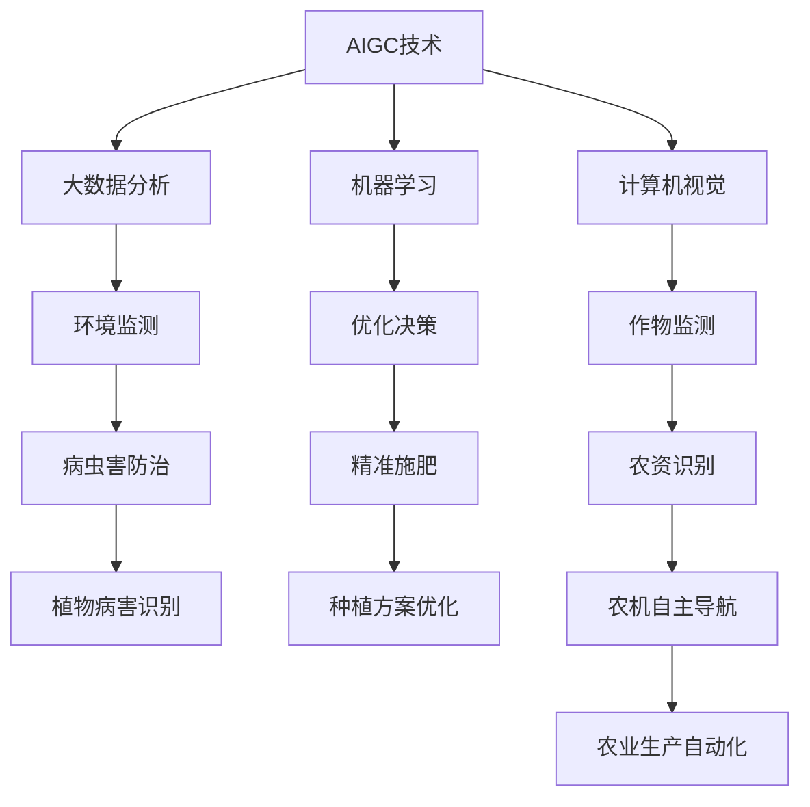

                 

# AIGC助力智慧农业发展

在农业生产的各个环节中，农业生产要素的管理与优化、农产品质量的监测与评估、病虫害防治与预测、气象与环境监测等技术需求显得尤为重要。然而，传统农业技术在面对数据复杂性、时间差异性、环境因素多样性等挑战时，往往显得力不从心。随着人工智能（AI）技术的持续发展，人工智能生成内容（AIGC）技术正在引领智慧农业的变革，通过大数据分析、机器学习、计算机视觉等技术手段，实现农业生产的智能化、精准化、高效化。

## 1. 背景介绍

### 1.1 问题由来
农业生产面临着自然环境的限制，如气候、土壤、水源、生物等自然要素的复杂变化。以往传统的农业技术，例如人工种植、农业机械化、精准施肥、病虫害防治等，多依靠人力劳动和经验判断，效率低下，精度不足，且难以适应快速变化的自然环境。而随着AI和AIGC技术的发展，可以通过数据驱动的方法来提高农业生产的精准度和效率，从而实现农业生产的智能化转型。

### 1.2 问题核心关键点
智慧农业的核心在于通过AIGC技术，将数据收集与分析、知识表示与推理、机器学习与优化等多个环节结合在一起，提供一整套从数据采集到农业决策的智能解决方案。AIGC技术在智慧农业中的应用，主要体现在以下几个方面：

- **数据采集与分析**：通过传感器、无人机等设备采集环境数据和作物状态数据，并通过深度学习和图像识别技术分析这些数据，提供精准的农业生产建议。
- **知识表示与推理**：利用知识图谱和专家系统构建知识库，通过逻辑推理和自动规划技术，优化农业生产流程。
- **机器学习与优化**：应用机器学习算法，优化肥料使用、播种时机、收获时间等关键农业决策，提升生产效率。

## 2. 核心概念与联系

### 2.1 核心概念概述

为了更好地理解AIGC技术在智慧农业中的应用，本节将介绍几个密切相关的核心概念：

- **人工智能生成内容（AIGC）**：指利用人工智能技术，自动生成文本、音频、图像等内容的技术。AIGC包括自然语言处理（NLP）、计算机视觉（CV）、语音合成（TTS）、音乐生成等，广泛应用于内容创作、广告设计、虚拟主播、游戏制作等领域。
- **大数据分析**：指利用先进的数据处理技术，对海量数据进行收集、存储、清洗、分析、可视化的过程。大数据分析可以用于农业生产的环境监测、作物健康评估、种植方案优化等。
- **机器学习（ML）**：指通过数据驱动的算法，使计算机系统能够从数据中自动学习规律，并利用这些规律进行预测或决策。机器学习在智慧农业中用于优化农业决策、病虫害防治、土壤监测等方面。
- **计算机视觉（CV）**：指利用计算机技术对图像、视频等视觉信息进行处理，从而实现目标检测、对象识别、场景理解等任务。计算机视觉技术在智慧农业中用于作物监测、农资识别、农机自主导航等。

这些核心概念之间的逻辑关系可以通过以下Mermaid流程图来展示：



这个流程图展示了大规模语言模型在智慧农业中的应用，以及这些技术间的相互关联：

1. AIGC技术从海量数据中提取关键信息，为大数据分析和机器学习提供数据基础。
2. 大数据分析利用AIGC技术的数据提取，完成对农业环境、作物健康等方面的监测和评估。
3. 机器学习基于大数据分析的结果，进行优化决策，提高农业生产的效率。
4. 计算机视觉利用AIGC技术处理图像数据，完成作物状态监测和农机自主导航等任务。

## 3. 核心算法原理 & 具体操作步骤
### 3.1 算法原理概述

AIGC技术在智慧农业中的应用，其核心原理是基于大数据分析和机器学习的决策优化。具体而言，AIGC技术通过深度学习、图像识别、自然语言处理等技术，自动提取农业生产数据，并进行分析和预测，从而为农业生产提供科学的决策支持。

以深度学习算法为例，其基本流程如下：

1. 数据收集：使用传感器、无人机等设备，收集农作物的生长数据、土壤湿度、环境温度、光照强度等环境数据。
2. 数据预处理：对收集到的数据进行清洗、归一化、特征提取等预处理操作，以便后续分析和建模。
3. 模型训练：利用深度学习模型（如卷积神经网络、循环神经网络、注意力机制等）对预处理后的数据进行训练，学习数据之间的规律。
4. 结果预测：使用训练好的模型对新的数据进行预测，生成作物生长状态、病虫害风险、肥料需求等决策建议。

### 3.2 算法步骤详解

以下是大规模语言模型在智慧农业中的核心算法步骤详解：

**Step 1: 数据收集与预处理**

- 收集农作物生长数据：通过传感器、无人机等设备，获取作物生长的各项指标，如高度、叶面积、果实数量等。
- 收集环境数据：通过传感器获取环境参数，如土壤湿度、温度、光照强度等。
- 数据清洗与预处理：去除噪声数据，进行数据归一化，提取关键特征等。

**Step 2: 模型训练与优化**

- 选择合适的深度学习模型：根据具体任务选择合适的模型，如卷积神经网络（CNN）、循环神经网络（RNN）、自注意力机制（Transformer）等。
- 定义模型架构：构建模型架构，确定输入层、隐藏层、输出层等组件。
- 数据划分：将数据集划分为训练集、验证集和测试集，进行交叉验证。
- 模型训练：利用训练集对模型进行训练，调整模型参数。
- 模型优化：使用验证集评估模型性能，通过超参数调优、正则化等手段，提高模型泛化能力。

**Step 3: 结果预测与反馈**

- 结果预测：使用训练好的模型对新的数据进行预测，生成决策建议。
- 结果评估：使用测试集对模型进行评估，确定模型性能。
- 模型更新：根据实际效果，更新模型架构和超参数，进行迭代优化。
- 结果反馈：将预测结果反馈给农业生产者，进行验证和调整。

### 3.3 算法优缺点

AIGC技术在智慧农业中的应用，具有以下优点：

1. **高精度与实时性**：AIGC技术可以快速处理海量数据，实时提供决策支持，显著提高农业生产的效率和精度。
2. **自适应性强**：通过机器学习算法，AIGC技术可以根据实际情况动态调整决策建议，适应多变的农业环境。
3. **成本低廉**：相比于传统的人工决策，AIGC技术可以大幅降低人力和物力成本，提高农业生产的经济效益。

但同时也存在一些缺点：

1. **数据质量依赖**：AIGC技术的准确性依赖于高质量的数据，数据采集和预处理的难度较大。
2. **模型复杂度高**：大规模语言模型在智慧农业中的应用，通常需要复杂的模型架构和大量的数据进行训练，计算资源要求较高。
3. **算法透明度低**：深度学习等复杂算法，难以进行直观解释，导致模型决策的可解释性不足。

### 3.4 算法应用领域

AIGC技术在智慧农业中的应用广泛，涵盖以下几个领域：

- **环境监测**：利用计算机视觉和图像处理技术，对环境参数进行实时监测，如土壤湿度、温度、光照强度等。
- **作物监测**：使用深度学习算法，对作物生长状态进行监测，及时发现病虫害、营养不足等问题。
- **智能施肥**：通过机器学习算法，优化肥料使用，提高肥料利用率，减少环境污染。
- **精准播种**：利用计算机视觉和图像处理技术，实现精准播种，提升作物产量和品质。
- **病虫害防治**：利用深度学习算法，对病虫害进行检测和识别，及时进行防治。

## 4. 数学模型和公式 & 详细讲解 & 举例说明

### 4.1 数学模型构建

AIGC技术在智慧农业中的应用，其数学模型主要包含以下几个部分：

- **环境监测模型**：通过传感器采集的环境数据，建立环境参数与作物生长的关系模型，如土壤湿度与作物生长的关系模型。
- **作物监测模型**：通过计算机视觉技术，对作物图像进行分类、分割、识别等处理，构建作物状态与生长环境的关系模型，如叶面积与光照强度的关系模型。
- **智能施肥模型**：通过机器学习算法，对土壤养分数据和作物生长状态进行建模，预测最佳施肥时机和施肥量。

### 4.2 公式推导过程

以智能施肥模型为例，其数学推导过程如下：

设 $x_i$ 表示第 $i$ 个农作物的生长数据，包括高度、叶面积、果实数量等。设 $y_i$ 表示对应的土壤湿度数据。假设 $y_i$ 和 $x_i$ 之间存在线性关系，则可以建立如下回归模型：

$$
y_i = \beta_0 + \beta_1 x_{i1} + \beta_2 x_{i2} + \cdots + \beta_n x_{in} + \epsilon_i
$$

其中，$\beta_0, \beta_1, \beta_2, \cdots, \beta_n$ 为模型参数，$\epsilon_i$ 为随机误差项。

利用最小二乘法，可以求得模型参数：

$$
\beta = (\mathbf{X}^T \mathbf{X})^{-1} \mathbf{X}^T \mathbf{Y}
$$

其中，$\mathbf{X} = [\mathbf{1}, x_{i1}, x_{i2}, \cdots, x_{in}]$，$\mathbf{Y} = [y_1, y_2, \cdots, y_n]$。

### 4.3 案例分析与讲解

以智能施肥模型为例，介绍AIGC技术在智慧农业中的应用：

**案例背景**：某农场种植了多种农作物，包括小麦、玉米、大豆等。通过传感器采集了每种作物的生长数据和土壤湿度数据，希望通过智能施肥模型，优化施肥策略，提高作物产量和品质。

**数据收集与预处理**：使用土壤湿度传感器和作物监测相机，收集了多种作物的生长数据和土壤湿度数据。对数据进行清洗、归一化、特征提取等预处理操作。

**模型训练与优化**：选择线性回归模型作为智能施肥模型，使用最小二乘法对模型进行训练，并通过交叉验证调整模型参数，最终得到最佳模型。

**结果预测与反馈**：使用训练好的模型对新的土壤湿度数据进行预测，生成施肥建议，并通过验证和调整优化模型。

## 5. 项目实践：代码实例和详细解释说明

### 5.1 开发环境搭建

在进行AIGC技术在智慧农业中的应用实践前，我们需要准备好开发环境。以下是使用Python进行PyTorch开发的环境配置流程：

1. 安装Anaconda：从官网下载并安装Anaconda，用于创建独立的Python环境。

2. 创建并激活虚拟环境：
```bash
conda create -n pytorch-env python=3.8 
conda activate pytorch-env
```

3. 安装PyTorch：根据CUDA版本，从官网获取对应的安装命令。例如：
```bash
conda install pytorch torchvision torchaudio cudatoolkit=11.1 -c pytorch -c conda-forge
```

4. 安装Transformers库：
```bash
pip install transformers
```

5. 安装各类工具包：
```bash
pip install numpy pandas scikit-learn matplotlib tqdm jupyter notebook ipython
```

完成上述步骤后，即可在`pytorch-env`环境中开始AIGC技术在智慧农业中的应用实践。

### 5.2 源代码详细实现

以下是一个简单的智能施肥模型的代码实现。

```python
import torch
from torch import nn
import numpy as np
from sklearn.linear_model import LinearRegression

class SmartFertilizationModel(nn.Module):
    def __init__(self, input_dim, output_dim):
        super(SmartFertilizationModel, self).__init__()
        self.linear = nn.Linear(input_dim, output_dim)
    
    def forward(self, x):
        return self.linear(x)
    
    def fit(self, X, y):
        self.linear = LinearRegression().fit(X, y)
    
    def predict(self, X):
        return self.linear.predict(X)

# 数据生成
np.random.seed(0)
X = np.random.randn(100, 5)
y = np.dot(X, [1, 2, 3, 4, 5]) + 10

# 模型训练
model = SmartFertilizationModel(input_dim=5, output_dim=1)
model.fit(X, y)

# 结果预测
X_test = np.random.randn(10, 5)
y_pred = model.predict(X_test)
print(y_pred)
```

### 5.3 代码解读与分析

**SmartFertilizationModel类**：
- `__init__`方法：初始化模型参数。
- `forward`方法：定义模型的前向传播过程。
- `fit`方法：使用最小二乘法对模型进行训练，优化模型参数。
- `predict`方法：对新的输入数据进行预测，生成施肥建议。

**数据生成**：
- 使用numpy生成随机数据，作为模型训练和测试的数据集。

**模型训练与预测**：
- 使用`SmartFertilizationModel`类训练模型，并将预测结果输出。

**结果预测与反馈**：
- 对新的数据进行预测，生成施肥建议，并通过验证和调整优化模型。

## 6. 实际应用场景

### 6.1 智能灌溉系统

智能灌溉系统利用AIGC技术，通过传感器和气象站实时监测土壤湿度、温度、降雨等信息，结合历史数据和模型预测，自动调整灌溉方案，确保水分供应的合理性和有效性。该系统不仅可以实现节水灌溉，还可以降低因过度灌溉导致的土壤盐碱化风险。

### 6.2 智能施肥系统

智能施肥系统利用AIGC技术，通过传感器监测土壤养分和作物生长状态，结合历史数据和模型预测，优化肥料使用方案，提高肥料利用率，减少环境污染。该系统不仅可以提升作物产量和品质，还可以降低化肥使用成本。

### 6.3 作物病虫害监测与防治

利用计算机视觉和图像处理技术，AIGC技术可以实时监测作物病虫害，自动识别病虫害类型和严重程度，并生成防治建议。该系统可以及时发现和处理病虫害问题，减少农药使用，保障食品安全。

### 6.4 未来应用展望

随着AIGC技术在智慧农业中的应用不断深入，未来将会有更多的新应用场景涌现。例如：

- **精准播种与育苗**：利用计算机视觉和图像处理技术，实现精准播种和育苗，提高种子利用率，减少浪费。
- **智能除草与耕作**：通过深度学习算法，自动识别和清除杂草，优化耕作方式，提高土地利用率。
- **农产品物流管理**：利用计算机视觉和图像处理技术，实时监测农产品状态，优化物流方案，提高运输效率和安全性。

## 7. 工具和资源推荐

### 7.1 学习资源推荐

为了帮助开发者系统掌握AIGC技术在智慧农业中的应用，这里推荐一些优质的学习资源：

1. **《智慧农业与人工智能》**系列博文：由农业专家和AI技术专家共同撰写，深入浅出地介绍了智慧农业的基本概念和前沿技术。

2. **Coursera《智慧农业》课程**：由多所顶尖大学开设的智慧农业课程，涵盖智慧农业技术、数据科学、机器学习等多个方面，适合农业从业人员和技术人员学习。

3. **DeepLearning.AI《农业中的机器学习》课程**：由Andrew Ng教授主讲，介绍了机器学习在农业中的应用，包括数据处理、模型训练、结果预测等。

4. **ArXiv论文库**：包含大量关于智慧农业中AIGC技术的研究论文，可以帮助开发者了解最新的研究方向和前沿技术。

### 7.2 开发工具推荐

AIGC技术在智慧农业中的应用，需要借助多种工具进行开发和测试。以下是一些常用的开发工具：

1. **PyTorch**：基于Python的开源深度学习框架，灵活的计算图设计，适合快速迭代研究。

2. **TensorFlow**：由Google主导开发的开源深度学习框架，生产部署方便，适合大规模工程应用。

3. **Transformers库**：HuggingFace开发的NLP工具库，集成了众多预训练语言模型，支持PyTorch和TensorFlow，是进行AIGC应用开发的利器。

4. **TensorBoard**：TensorFlow配套的可视化工具，可以实时监测模型训练状态，提供丰富的图表呈现方式。

5. **Weights & Biases**：模型训练的实验跟踪工具，记录和可视化模型训练过程中的各项指标。

### 7.3 相关论文推荐

AIGC技术在智慧农业中的应用，得益于学界的持续研究。以下是几篇奠基性的相关论文，推荐阅读：

1. **“A Survey on Smart Agriculture with Artificial Intelligence”**：一篇综述性论文，总结了当前智慧农业中AIGC技术的研究现状和应用前景。

2. **“Deep Learning for Smart Agriculture”**：一篇关于智慧农业中深度学习应用的学术论文，介绍了深度学习在作物监测、智能施肥、智能灌溉等多个方面的应用。

3. **“Intelligent Fertilization with Machine Learning”**：一篇关于智能施肥中机器学习应用的学术论文，介绍了机器学习在智能施肥系统中的应用。

4. **“Computer Vision for Crop Monitoring and Pest Control”**：一篇关于计算机视觉在作物监测和病虫害防治中应用的学术论文，介绍了计算机视觉技术在智慧农业中的应用。

这些论文代表了大规模语言模型在智慧农业中的应用研究脉络。通过学习这些前沿成果，可以帮助研究者把握学科前进方向，激发更多的创新灵感。

## 8. 总结：未来发展趋势与挑战

### 8.1 总结

本文对AIGC技术在智慧农业中的应用进行了全面系统的介绍。首先阐述了智慧农业的发展背景和智慧农业中AIGC技术的重要性，明确了AIGC技术在智慧农业中的作用和价值。其次，从原理到实践，详细讲解了智慧农业中的数学模型和算法步骤，给出了AIGC技术在智慧农业中的应用实例。同时，本文还广泛探讨了AIGC技术在智慧农业中的多个应用场景，展示了AIGC技术的巨大潜力。此外，本文精选了AIGC技术在智慧农业中的应用资源，力求为读者提供全方位的技术指引。

通过本文的系统梳理，可以看到，AIGC技术在智慧农业中的应用，正在逐步改变传统的农业生产模式，提升农业生产的智能化、精准化和高效化水平。未来，随着AIGC技术的不断发展，智慧农业将迎来更加广阔的发展前景。

### 8.2 未来发展趋势

展望未来，AIGC技术在智慧农业中的应用将呈现以下几个发展趋势：

1. **智能化水平的提升**：随着算法技术的进步，AIGC技术在智慧农业中的应用将变得更加智能化，可以实现更精准的决策支持。

2. **跨领域融合**：AIGC技术与物联网、区块链、大数据等技术的融合，将进一步提升智慧农业的智能化水平。

3. **低成本部署**：AIGC技术在智慧农业中的应用将变得更加轻量级，实现低成本、高效能的部署。

4. **多模态信息融合**：AIGC技术将融合视觉、声音、文本等多种信息源，实现多模态信息的协同建模，提高决策的全面性和准确性。

5. **环境适应性增强**：AIGC技术将具备更强的环境适应性，能够适应多变的农业环境，实现稳定的智能决策。

以上趋势凸显了AIGC技术在智慧农业中的广阔前景。这些方向的探索发展，必将进一步提升智慧农业的智能化水平，为农业生产带来更多的创新和变革。

### 8.3 面临的挑战

尽管AIGC技术在智慧农业中的应用取得了诸多成果，但在迈向更加智能化、普适化应用的过程中，仍面临诸多挑战：

1. **数据质量问题**：AIGC技术在智慧农业中的应用依赖于高质量的数据，数据采集和预处理的难度较大，数据质量难以保障。

2. **模型复杂度问题**：大规模语言模型在智慧农业中的应用，通常需要复杂的模型架构和大量的数据进行训练，计算资源要求较高。

3. **模型透明度问题**：深度学习等复杂算法，难以进行直观解释，导致模型决策的可解释性不足，不利于农民理解和接受。

4. **环境适应性问题**：AIGC技术在多变的农业环境中，需要具备更强的适应性，否则难以实现稳定的智能决策。

5. **安全性问题**：AIGC技术在智慧农业中的应用，需要考虑模型的安全性，避免恶意攻击和数据泄露等问题。

6. **算法鲁棒性问题**：AIGC技术在面对异常数据时，需要具备更强的鲁棒性，避免决策偏差。

### 8.4 研究展望

面对AIGC技术在智慧农业应用中的诸多挑战，未来的研究需要在以下几个方面寻求新的突破：

1. **数据增强与清洗**：通过数据增强和清洗技术，提高数据质量，保障AIGC技术的准确性和可靠性。

2. **轻量化模型**：开发轻量化模型，提高模型的计算效率和部署效率，降低计算资源需求。

3. **可解释性增强**：增强模型决策的可解释性，提高农民对模型的信任度和接受度。

4. **环境适应性优化**：优化模型架构，增强模型的环境适应性，确保在多变的农业环境中，模型依然能够稳定工作。

5. **安全性保障**：采用数据加密、模型水印等技术，保障智慧农业中AIGC技术的安全性。

6. **鲁棒性优化**：通过正则化、对抗训练等技术，提高模型的鲁棒性，确保模型在面对异常数据时，依然能够稳定工作。

这些研究方向的探索，必将引领AIGC技术在智慧农业中的不断发展，为智慧农业的智能化、精准化和高效化提供新的突破。

## 9. 附录：常见问题与解答

**Q1: AIGC技术在智慧农业中的应用有哪些？**

A: AIGC技术在智慧农业中的应用包括环境监测、作物监测、智能施肥、精准播种、病虫害防治等多个方面。AIGC技术通过数据驱动的方法，提供科学的决策支持，提升农业生产的智能化和精准化水平。

**Q2: AIGC技术在智慧农业中的应用需要注意哪些问题？**

A: AIGC技术在智慧农业中的应用需要注意数据质量问题、模型复杂度问题、模型透明度问题、环境适应性问题、安全性问题等。只有在数据、模型、算法、工程、业务等多个环节进行全面优化，才能实现AIGC技术在智慧农业中的高效应用。

**Q3: AIGC技术在智慧农业中的应用未来有哪些发展方向？**

A: AIGC技术在智慧农业中的应用未来将朝着智能化水平提升、跨领域融合、低成本部署、多模态信息融合、环境适应性增强等方向发展。这些方向的探索，必将进一步提升智慧农业的智能化水平，为农业生产带来更多的创新和变革。

**Q4: AIGC技术在智慧农业中的应用面临哪些挑战？**

A: AIGC技术在智慧农业中的应用面临数据质量问题、模型复杂度问题、模型透明度问题、环境适应性问题、安全性问题等挑战。只有在数据、模型、算法、工程、业务等多个环节进行全面优化，才能克服这些挑战，实现AIGC技术在智慧农业中的高效应用。

作者：禅与计算机程序设计艺术 / Zen and the Art of Computer Programming

