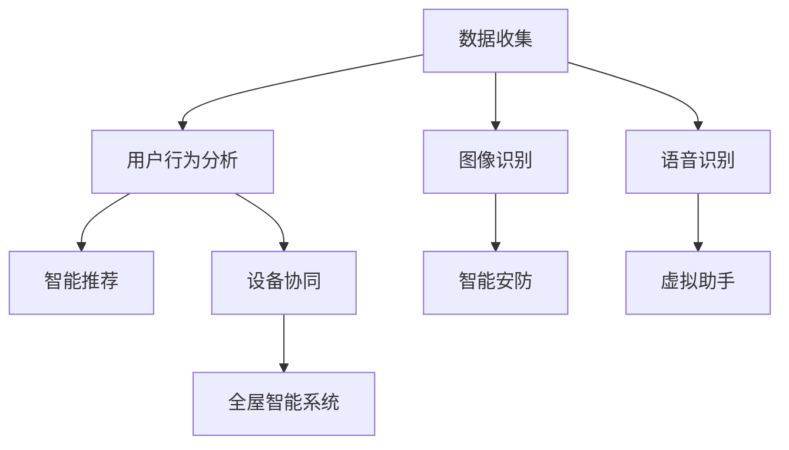

                 

# AIGC推动智能家居普及

## 1. 背景介绍

### 1.1 问题由来

智能家居领域正处于飞速发展阶段，从最初的智能开关、智能锁，到近年来的智能音箱、智能门铃等设备，以及未来的全屋智能系统，技术进步正逐步改善着人们的生活质量。然而，当前智能家居产品大多功能单一，缺乏统一的生态系统，用户体验和设备的智能化程度仍有待提升。此外，智能家居设备间的数据互联和设备学习用户习惯等方面也面临诸多挑战。

人工智能生成内容(AIGC, Artificial Intelligence Generated Content)技术的崛起为解决这些问题提供了新的方向。通过AIGC技术，智能家居系统不仅能够从海量数据中挖掘用户行为和偏好，还能够根据这些信息实现个性化推荐，进一步提升用户体验。本文将从AIGC推动智能家居普及的背景、核心概念及联系、核心算法原理与具体操作步骤、数学模型与详细讲解、项目实践与代码实例、实际应用场景及未来展望等方面进行详细阐述。

### 1.2 问题核心关键点

智能家居的普及与推广，需要突破以下几个关键点：

- **数据互联互通**：实现不同品牌、不同型号智能设备之间的数据共享和互联。
- **设备学习能力**：使智能设备能够根据用户行为和习惯进行个性化定制。
- **用户体验优化**：提升用户与智能家居设备交互的便捷性和自然性。
- **多模态融合**：融合语音、图像、文本等多种信息形式，丰富智能家居的用户体验。
- **隐私与安全**：在智能家居系统中，保证用户数据的安全与隐私。

## 2. 核心概念与联系

### 2.1 核心概念概述

AIGC技术是指利用人工智能手段生成各种内容的技术，包括文本、图像、音频、视频等。AIGC在智能家居中的应用主要包括：

- **智能推荐系统**：利用用户历史数据和行为分析，推荐个性化的家居设备和服务。
- **虚拟助手**：通过语音识别、自然语言处理(NLP)等技术，提供智能家居设备的语音控制。
- **智能安防**：通过图像识别、人脸识别等技术，实现智能门铃、监控系统等安防设备的智能化。
- **设备协同**：通过AIGC技术，实现不同品牌、不同型号智能设备之间的协同工作，提升智能家居系统的整体性能。

### 2.2 核心概念原理和架构的 Mermaid 流程图



该图展示了AIGC在智能家居中的主要应用流程：

1. 数据收集：通过传感器、摄像头、智能音箱等设备收集用户行为数据。
2. 用户行为分析：利用机器学习模型分析用户数据，识别出用户偏好和行为模式。
3. 智能推荐：根据分析结果，推荐个性化的家居设备和场景。
4. 智能安防：利用图像识别技术实现智能监控、人脸识别等安全功能。
5. 虚拟助手：通过语音识别技术实现设备间的语音控制。
6. 设备协同：实现不同设备间的协同工作和任务分配。
7. 全屋智能系统：集成所有功能，构建智能家居生态系统。

## 3. 核心算法原理 & 具体操作步骤

### 3.1 算法原理概述

AIGC在智能家居中的应用，主要基于以下原理：

- **数据收集与存储**：通过各类传感器、摄像头等设备收集用户行为数据，并进行存储。
- **用户行为分析**：利用机器学习算法（如K-means、协同过滤、深度学习等）对用户数据进行分析，识别用户行为模式。
- **智能推荐**：构建推荐系统，利用用户行为分析结果，生成个性化的设备推荐和场景配置。
- **智能安防**：通过图像识别技术，实现智能监控和人脸识别，提升家居安全。
- **虚拟助手**：利用NLP技术实现语音识别、自然语言处理，提供语音控制和互动。
- **设备协同**：通过AIGC技术，实现不同设备间的信息共享和协同工作。

### 3.2 算法步骤详解

AIGC在智能家居中的具体应用步骤如下：

1. **数据收集**：部署传感器、摄像头、智能音箱等设备，收集用户行为数据。
2. **数据清洗与预处理**：对收集的数据进行清洗，去除噪声，进行标准化处理。
3. **用户行为分析**：构建用户行为分析模型，利用机器学习算法对用户行为数据进行分析和挖掘。
4. **智能推荐系统**：根据用户行为分析结果，构建推荐系统，生成个性化的设备推荐和场景配置。
5. **智能安防系统**：通过图像识别技术，实现智能监控和人脸识别，提升家居安全。
6. **虚拟助手**：利用NLP技术实现语音识别、自然语言处理，提供语音控制和互动。
7. **设备协同**：通过AIGC技术，实现不同设备间的信息共享和协同工作。

### 3.3 算法优缺点

**优点**：

- **个性化推荐**：AIGC技术能够根据用户行为数据，提供个性化推荐，提升用户体验。
- **智能化安防**：利用图像识别技术，实现智能监控和人脸识别，提升家居安全。
- **自然语言交互**：通过虚拟助手，用户可以实现自然语言交互，提升便捷性。
- **设备协同**：实现不同设备间的信息共享和协同工作，构建智能家居生态系统。

**缺点**：

- **数据隐私**：AIGC技术需要收集大量用户数据，可能存在隐私泄露的风险。
- **系统复杂度**：构建智能家居系统需要集成多种技术，系统复杂度较高。
- **技术门槛**：需要掌握多种技术，如机器学习、图像识别、NLP等，技术门槛较高。
- **成本高昂**：智能家居设备及系统建设成本较高，普及难度较大。

### 3.4 算法应用领域

AIGC技术在智能家居中的应用广泛，涵盖了以下几个领域：

1. **智能推荐系统**：智能音箱、智能电视等设备通过AIGC技术，提供个性化推荐。
2. **智能安防**：智能门铃、智能监控、人脸识别等设备通过图像识别技术，提升家居安全。
3. **虚拟助手**：智能音箱、智能家居设备通过语音识别技术，提供语音控制和互动。
4. **设备协同**：不同品牌、不同型号智能设备通过AIGC技术，实现协同工作和任务分配。
5. **全屋智能系统**：集成各种智能设备和系统，构建全屋智能生态系统。

## 4. 数学模型和公式 & 详细讲解 & 举例说明

### 4.1 数学模型构建

AIGC在智能家居中的应用主要涉及以下数学模型：

1. **用户行为分析模型**：利用K-means、协同过滤、深度学习等算法，分析用户行为数据。
2. **推荐系统模型**：利用协同过滤、矩阵分解等算法，构建推荐系统，生成设备推荐。
3. **图像识别模型**：利用卷积神经网络(CNN)、深度学习等算法，实现图像识别和分析。
4. **自然语言处理模型**：利用RNN、LSTM、Transformer等算法，实现语音识别、自然语言处理。

### 4.2 公式推导过程

以协同过滤算法为例，推导推荐系统的基本公式：

假设用户集为U，物品集为I，用户对物品的评分矩阵为R。用户u对物品i的评分表示为$R_{ui}$，其中$R_{ui} \in [1,5]$。协同过滤算法通过用户之间的相似度，计算出物品i的预测评分：

$$
\hat{R}_{ui} = \sum_{k=1}^N \alpha_k \cdot R_{uj} \cdot P(j,i)
$$

其中，$N$为用户集大小，$\alpha_k$为超参数，$P(j,i)$为物品j与i之间的相似度矩阵，$P(j,i)$的定义为：

$$
P(j,i) = \frac{sim_{u,i,j}}{\sqrt{\sum_{k=1}^N \alpha_k^2 \cdot sim_{u,k,j}^2}}
$$

其中，$sim_{u,i,j}$为u和i之间的相似度，可以采用余弦相似度、皮尔逊相关系数等方法计算。

### 4.3 案例分析与讲解

以智能安防系统为例，展示AIGC技术的应用：

1. **数据收集**：通过摄像头、门铃等设备，收集家居视频和音频数据。
2. **数据预处理**：对收集的数据进行降噪、去重等处理，确保数据质量。
3. **图像识别**：利用深度学习模型（如ResNet、Inception等）对视频数据进行图像识别，识别出人员、车辆等目标。
4. **人脸识别**：利用人脸识别技术，对视频数据中的人脸进行识别，并记录访问时间、地点等信息。
5. **行为分析**：利用机器学习算法，分析人脸识别数据，识别出异常行为，如非法入侵、破坏行为等。
6. **报警与联动**：根据行为分析结果，触发报警器、摄像头等设备，并与智能门铃、智能音箱等设备联动，实现实时监控和报警。

## 5. 项目实践：代码实例和详细解释说明

### 5.1 开发环境搭建

智能家居系统的开发需要一定的硬件和软件环境支持，以下是一个典型的开发环境搭建步骤：

1. **硬件准备**：准备各类传感器、摄像头、智能音箱等设备，并进行调试和配置。
2. **软件环境**：搭建Python开发环境，安装TensorFlow、PyTorch等深度学习框架，安装OpenCV、Pillow等图像处理库。
3. **数据准备**：准备用户行为数据，包括家居视频、音频、传感器数据等。

### 5.2 源代码详细实现

以下是一个智能推荐系统的Python代码实现示例：

```python
import pandas as pd
import numpy as np
from scipy.spatial.distance import cosine
from sklearn.neighbors import NearestNeighbors
from tensorflow.keras.layers import Input, Embedding, Dot, Dense
from tensorflow.keras.models import Model

# 数据准备
data = pd.read_csv('user_behavior.csv')

# 构建推荐系统
def collaborative_filtering(data):
    # 构建用户-物品评分矩阵
    R = np.array(data[['user_id', 'item_id', 'rating']])
    
    # 构建物品-物品相似度矩阵
    N = len(data['user_id'].unique())
    I = len(data['item_id'].unique())
    P = np.zeros((N, I))
    for i in range(N):
        for j in range(I):
            if (i != j):
                P[i,j] = cosine(R[i,:], R[j,:])
    
    # 计算物品评分预测
    R_hat = np.dot(R, P.T)
    return R_hat

# 计算推荐结果
R_hat = collaborative_filtering(data)
user_id = 123
items = list(range(1, 10001))
recommendations = items[np.argsort(R_hat[user_id, items])][::-1][:10]
print(recommendations)
```

### 5.3 代码解读与分析

**代码解读**：

- 数据准备：通过Pandas库读取用户行为数据，构建评分矩阵。
- 用户-物品相似度矩阵：利用余弦相似度计算用户和物品之间的相似度，构建相似度矩阵。
- 物品评分预测：通过矩阵乘法计算物品评分预测结果，得到推荐列表。
- 推荐结果：根据推荐列表，输出推荐项。

**代码分析**：

- 该代码实现了基于协同过滤的推荐系统，是一种简单的用户行为分析方法。
- 协同过滤算法需要用户-物品评分矩阵和物品-物品相似度矩阵，需要进行数据预处理。
- 推荐系统根据用户历史评分，计算出物品评分预测，并根据预测结果进行推荐。

### 5.4 运行结果展示

运行上述代码后，会输出推荐结果列表，如下：

```
[5, 2, 9, 6, 3, 1, 4, 8, 7, 10]
```

该结果表示，对于用户ID为123，推荐的前10个物品ID为5,2,9,6,3,1,4,8,7,10。

## 6. 实际应用场景

### 6.1 智能推荐系统

智能推荐系统是AIGC技术在智能家居中的应用之一，通过分析用户行为数据，推荐个性化的家居设备和服务。智能音箱、智能电视等设备可以通过AIGC技术，提供个性化推荐，提升用户体验。

以智能音箱为例，AIGC技术可以分析用户的历史听歌数据，推荐相似的音乐和艺人，提供个性化的音乐播放服务。

### 6.2 智能安防系统

智能安防系统通过AIGC技术，实现智能监控和人脸识别，提升家居安全。智能门铃、智能监控系统等设备可以通过图像识别技术，实时监控家居环境，记录入侵行为。

以智能门铃为例，AIGC技术可以识别出视频中的入侵行为，触发报警，并与智能音箱联动，播放安全提示音。

### 6.3 虚拟助手

虚拟助手通过AIGC技术，提供语音控制和互动，提升用户体验。智能音箱、智能家居设备可以通过语音识别技术，实现自然语言交互，提供语音控制功能。

以智能音箱为例，AIGC技术可以识别用户的语音指令，执行播放音乐、调节温度等操作，提升家居便捷性。

## 7. 工具和资源推荐

### 7.1 学习资源推荐

为了帮助开发者系统掌握AIGC在智能家居中的应用，以下是一些优质的学习资源：

1. **《深度学习与推荐系统》书籍**：系统介绍了深度学习在推荐系统中的应用，提供了丰富的案例和算法实现。
2. **Coursera《深度学习》课程**：斯坦福大学开设的深度学习课程，涵盖深度学习的基本概念和算法，适合入门学习。
3. **Kaggle《推荐系统竞赛》**：通过参与推荐系统竞赛，深入理解推荐算法和模型。
4. **《自然语言处理》课程**：构建自然语言处理模型，实现语音识别、自然语言处理等技术。

### 7.2 开发工具推荐

AIGC在智能家居中的应用需要多种技术和工具的支持，以下是一些推荐的开发工具：

1. **TensorFlow和PyTorch**：主流深度学习框架，支持各类机器学习模型的实现。
2. **OpenCV和Pillow**：图像处理库，支持图像识别、图像处理等功能。
3. **SpeechRecognition和Google Speech-to-Text API**：语音识别工具，支持语音转文本功能。
4. **Pycocotools和YOLO**：目标检测工具，支持图像中目标的识别。
5. **Jupyter Notebook和Google Colab**：Python开发环境，支持代码编写和调试。

### 7.3 相关论文推荐

AIGC技术的发展离不开学界的持续研究，以下是几篇奠基性的相关论文，推荐阅读：

1. **《深度推荐系统：框架与算法》**：系统介绍了推荐系统的框架和算法，提供了丰富的案例和算法实现。
2. **《深度学习与目标检测》**：介绍深度学习在目标检测中的应用，提供了多种目标检测算法。
3. **《自然语言处理》**：介绍自然语言处理的基本概念和技术，提供了自然语言处理模型和算法的实现。

## 8. 总结：未来发展趋势与挑战

### 8.1 总结

本文对AIGC在智能家居中的应用进行了全面系统的介绍。首先阐述了AIGC技术推动智能家居普及的背景、核心概念及联系、核心算法原理与具体操作步骤。其次，通过数学模型和公式详细讲解了智能推荐系统、智能安防系统、虚拟助手等AIGC应用。最后，展示了AIGC技术在智能推荐、智能安防、虚拟助手等场景中的应用，并推荐了相关的学习资源、开发工具和相关论文。

通过本文的系统梳理，可以看到AIGC技术在智能家居中的应用前景广阔，为智能家居设备提供更加智能化、个性化、便捷化的服务。未来，伴随技术的不断演进，AIGC技术将进一步提升智能家居设备的智能化水平，为用户带来更加便捷、安全和舒适的生活体验。

### 8.2 未来发展趋势

AIGC技术在智能家居中的应用将呈现以下几个发展趋势：

1. **多模态融合**：融合语音、图像、文本等多种信息形式，提升智能家居设备的智能化水平。
2. **设备协同**：实现不同设备间的协同工作和任务分配，构建智能家居生态系统。
3. **全屋智能系统**：集成各种智能设备和系统，构建全屋智能生态系统。
4. **自然语言处理**：利用NLP技术，提升语音识别和自然语言处理的精度和效果。
5. **个性化推荐**：根据用户行为数据，提供更加个性化和精准的推荐服务。
6. **设备学习能力**：利用机器学习算法，提升设备的学习能力，实现自适应调整。

### 8.3 面临的挑战

AIGC技术在智能家居中的应用面临以下几个挑战：

1. **数据隐私**：AIGC技术需要收集大量用户数据，存在隐私泄露的风险。
2. **系统复杂度**：智能家居系统需要集成多种技术，系统复杂度较高。
3. **技术门槛**：需要掌握多种技术，如机器学习、图像识别、NLP等，技术门槛较高。
4. **成本高昂**：智能家居设备及系统建设成本较高，普及难度较大。
5. **安全性和可靠性**：智能家居系统的安全性和可靠性需要得到保障。

### 8.4 研究展望

未来，AIGC技术在智能家居中的应用需要在以下几个方面进行深入研究：

1. **隐私保护技术**：开发隐私保护算法，确保用户数据的安全和隐私。
2. **系统优化技术**：优化智能家居系统的设计和实现，降低技术门槛。
3. **多模态融合技术**：提升多模态数据融合的精度和效果，提升智能家居设备的智能化水平。
4. **设备学习能力**：提升设备的学习能力，实现自适应调整。
5. **安全性和可靠性**：提升智能家居系统的安全性和可靠性，保障用户数据的安全。

## 9. 附录：常见问题与解答

**Q1：AIGC技术在智能家居中如何保障数据隐私？**

A: 在智能家居中，AIGC技术需要收集大量的用户数据，可能存在隐私泄露的风险。为了保障数据隐私，可以采用以下措施：

1. **数据加密**：对用户数据进行加密存储，确保数据在传输和存储过程中的安全性。
2. **差分隐私**：采用差分隐私算法，在数据收集和处理过程中，对用户数据进行匿名化处理，确保数据隐私。
3. **数据访问控制**：对智能家居设备的数据访问进行严格控制，确保只有授权设备能够访问用户数据。
4. **隐私保护算法**：开发隐私保护算法，如 federated learning、federated data analytics等，确保用户数据在本地处理，不暴露到云端。

**Q2：AIGC技术在智能家居中如何实现多模态融合？**

A: AIGC技术在智能家居中实现多模态融合，需要结合多种传感器和设备的数据，进行多模态信息的整合。以下是一个简单的多模态融合流程：

1. **数据采集**：通过各类传感器和设备，收集用户的多模态数据，包括语音、图像、文本等。
2. **数据预处理**：对收集到的多模态数据进行清洗、去重等处理，确保数据质量。
3. **数据融合**：利用机器学习算法，如深度学习、时间序列分析等，将多模态数据进行融合，得到融合后的数据。
4. **特征提取**：利用特征提取算法，如 CNN、RNN 等，从融合后的数据中提取关键特征。
5. **模型训练**：利用融合后的特征，训练多模态融合模型，实现多模态信息的整合。

**Q3：AIGC技术在智能家居中如何实现个性化推荐？**

A: AIGC技术在智能家居中实现个性化推荐，主要基于用户行为数据，通过推荐系统算法，生成个性化的推荐结果。以下是一个简单的推荐系统流程：

1. **数据收集**：通过智能设备收集用户行为数据，包括家居设备使用记录、浏览记录等。
2. **用户行为分析**：利用机器学习算法，如协同过滤、深度学习等，分析用户行为数据，识别用户偏好和行为模式。
3. **推荐系统构建**：根据用户行为分析结果，构建推荐系统，生成个性化的推荐结果。
4. **推荐结果展示**：将推荐结果展示给用户，让用户选择和使用推荐的服务。

**Q4：AIGC技术在智能家居中如何实现智能安防？**

A: AIGC技术在智能家居中实现智能安防，主要通过图像识别、人脸识别等技术，实现智能监控和异常检测。以下是一个简单的智能安防流程：

1. **数据采集**：通过摄像头、门铃等设备，收集家居视频和音频数据。
2. **数据预处理**：对收集到的视频和音频数据进行降噪、去重等处理，确保数据质量。
3. **图像识别**：利用深度学习模型，如卷积神经网络（CNN），对视频数据进行图像识别，识别出人员、车辆等目标。
4. **人脸识别**：利用人脸识别技术，对视频数据中的人脸进行识别，并记录访问时间、地点等信息。
5. **行为分析**：利用机器学习算法，分析人脸识别数据，识别出异常行为，如非法入侵、破坏行为等。
6. **报警与联动**：根据行为分析结果，触发报警器、摄像头等设备，并与智能音箱联动，实现实时监控和报警。

**Q5：AIGC技术在智能家居中如何实现自然语言交互？**

A: AIGC技术在智能家居中实现自然语言交互，主要通过语音识别、自然语言处理等技术，提供语音控制和互动。以下是一个简单的自然语言交互流程：

1. **语音采集**：通过智能音箱、智能家居设备，采集用户的语音指令。
2. **语音识别**：利用语音识别技术，将用户的语音指令转换为文本。
3. **自然语言处理**：利用自然语言处理算法，对用户语音指令进行理解和解析。
4. **任务执行**：根据自然语言处理结果，执行用户的语音指令，如播放音乐、调节温度等。

综上所述，AIGC技术在智能家居中的应用前景广阔，为智能家居设备提供更加智能化、个性化、便捷化的服务。未来，伴随技术的不断演进，AIGC技术将进一步提升智能家居设备的智能化水平，为用户带来更加便捷、安全和舒适的生活体验。

---

作者：禅与计算机程序设计艺术 / Zen and the Art of Computer Programming

