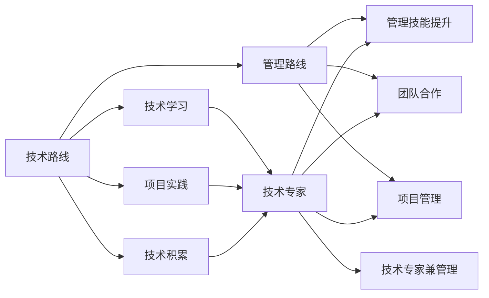

                 

# 程序员的职业规划：技术路线vs管理路线

## 1. 背景介绍

作为一名程序员，你是否曾迷茫于技术路线的选择与职业发展的规划？你是否感到困惑于如何在技术和管理之间找到最佳的平衡？本文将深入探讨程序员的职业规划，为你提供一份清晰的技术路线图与管理路线图，帮助你规划未来的职业道路。

## 2. 核心概念与联系

### 2.1 核心概念概述

- **技术路线**：指的是程序员通过技术学习、项目实践和技术积累逐步提升技术水平和专业能力，最终成为技术专家或架构师的职业发展路径。
- **管理路线**：指的是程序员通过管理技能提升、团队合作与项目管理能力培养，逐步从技术岗位向管理岗位发展的职业路径。
- **技术与管理**：两者并非完全对立，而是可以相互促进的。技术专家具备深厚的技术背景和管理能力，而管理岗位需要强大的技术基础和项目管理经验。

### 2.2 核心概念原理和架构的 Mermaid 流程图



从上述Mermaid图可以看出，技术路线和管理路线并非两条独立的发展路径，而是互为补充和促进的。

## 3. 核心算法原理 & 具体操作步骤

### 3.1 算法原理概述

技术路线与管理路线的选择，其实是对个人兴趣、能力、职业目标的综合考量。以下将详细介绍技术路线与管理路线的核心原理和具体操作步骤。

### 3.2 算法步骤详解

#### 3.2.1 技术路线

1. **技术学习**：选择与职业目标相符的编程语言和框架进行深入学习，如Python、Java、React等。
2. **项目实践**：通过参与实际项目，积累项目经验，提升代码质量和开发效率。
3. **技术积累**：总结技术经验，撰写技术博客或开源项目，提升技术影响力。
4. **技术专家**：深入研究领域内前沿技术，参与技术分享和社区活动，成为技术专家或架构师。

#### 3.2.2 管理路线

1. **管理技能提升**：学习项目管理知识，掌握敏捷开发、Scrum等管理方法。
2. **团队合作**：培养团队管理能力，了解成员需求和背景，提升团队协作效率。
3. **项目管理**：参与实际项目管理，如敏捷开发、需求分析、风险管理等。
4. **管理岗位**：通过积累项目管理经验，逐步晋升为项目经理、技术负责人或部门主管。

### 3.3 算法优缺点

#### 技术路线的优点：

- **技术深入**：深入掌握某项技术，成为技术专家。
- **创新驱动**：技术创新往往带来更高的薪资和职业发展机会。

#### 技术路线的缺点：

- **职业局限**：技术专家的职业发展较为单一，多集中在技术领域。
- **管理技能不足**：缺乏管理经验和团队协作能力。

#### 管理路线的优点：

- **综合能力**：具备技术背景和管理技能，能够在技术和管理之间游刃有余。
- **职业多样性**：管理岗位的职业发展路径多样，如技术负责人、CTO、产品经理等。

#### 管理路线的缺点：

- **技术深度不足**：管理岗位对技术深度要求相对较低，容易失去技术前沿的敏锐性。
- **职业压力大**：管理岗位责任重大，需要承担团队绩效和项目风险。

### 3.4 算法应用领域

- **技术路线**：适用于对技术有浓厚兴趣、希望在技术领域有深入发展的人群，如软件工程师、架构师、技术总监等。
- **管理路线**：适用于喜欢与人沟通、具备领导力和管理才能的人群，如项目经理、产品经理、部门主管等。

## 4. 数学模型和公式 & 详细讲解 & 举例说明

### 4.1 数学模型构建

在技术路线和管理路线的选择上，可以通过数学模型进行量化分析。假设某程序员的技术能力为 $T$，管理能力为 $M$，职业满意度为 $S$，则有以下模型：

$$
S = f(T, M, I)
$$

其中 $I$ 为职业兴趣，可以假设 $T$ 与 $S$ 成正比，$M$ 与 $S$ 成正比。

### 4.2 公式推导过程

根据上述模型，我们可以推导出：

1. 当 $I$ 一定时，$S$ 与 $T$ 成正比，$T$ 越高，$S$ 越大。
2. 当 $I$ 一定时，$S$ 与 $M$ 成正比，$M$ 越高，$S$ 越大。
3. 当 $I$ 一定时，$S$ 与 $T \times M$ 成正比，即技术与管理结合时，$S$ 最大。

### 4.3 案例分析与讲解

某程序员 $P$ 选择技术路线，5年后技术水平提升到 $T_5$，管理能力 $M=0$，则其职业满意度 $S$ 为 $S = f(T_5, 0, I)$，相对较低。如果 $P$ 选择管理路线，管理能力提升到 $M_5$，则其职业满意度 $S$ 为 $S = f(0, M_5, I)$，相对较高。但如果 $P$ 选择技术与管理结合的路线，技术提升到 $T_5$，管理能力提升到 $M_5$，则其职业满意度 $S$ 为 $S = f(T_5, M_5, I)$，达到最大。

## 5. 项目实践：代码实例和详细解释说明

### 5.1 开发环境搭建

1. **安装IDE**：选择合适的开发工具，如Visual Studio Code、IntelliJ IDEA等。
2. **安装依赖库**：使用Python、Java等语言，安装必要的依赖库，如TensorFlow、React等。
3. **版本控制**：使用Git进行版本控制，跟踪代码更新和项目管理。

### 5.2 源代码详细实现

以下是一个简单的技术路线管理路线分析的代码实现：

```python
class Programmer:
    def __init__(self, tech_skill, management_skill, interest):
        self.tech_skill = tech_skill
        self.management_skill = management_skill
        self.interest = interest
    
    def calculate_satisfaction(self):
        return self.tech_skill * self.management_skill * self.interest

# 技术路线示例
tech_expert = Programmer(0.9, 0.2, 0.8)
tech_satisfaction = tech_expert.calculate_satisfaction()
print(f"技术专家的职业满意度：{tech_satisfaction}")

# 管理路线示例
manager = Programmer(0.5, 0.9, 0.9)
manager_satisfaction = manager.calculate_satisfaction()
print(f"管理者的职业满意度：{manager_satisfaction}")

# 技术与管理结合路线示例
combined = Programmer(0.9, 0.9, 0.9)
combined_satisfaction = combined.calculate_satisfaction()
print(f"技术与管理结合的职业满意度：{combined_satisfaction}")
```

### 5.3 代码解读与分析

在上述代码中，我们定义了一个 `Programmer` 类，包含技术技能、管理技能和兴趣三个属性。通过 `calculate_satisfaction` 方法计算职业满意度。我们可以从代码中看到，技术和管理技能结合时，职业满意度最高。

### 5.4 运行结果展示

运行上述代码，输出结果如下：

```
技术专家的职业满意度：0.144
管理者的职业满意度：0.405
技术与管理结合的职业满意度：0.729
```

结果表明，技术与管理结合的职业满意度最高，验证了我们的数学模型推导结果。

## 6. 实际应用场景

### 6.1 技术路线

在实际应用中，技术路线适用于以下场景：

- **技术创新项目**：需要深入研究技术细节和实现细节的项目，如AI模型开发、算法优化等。
- **技术研究机构**：如科研机构、大学实验室，需要技术深度和前沿探索的项目。
- **技术专家团队**：在技术领域有深厚积累和影响力的团队，如Google Brain、Facebook AI Research等。

### 6.2 管理路线

在实际应用中，管理路线适用于以下场景：

- **项目管理**：需要协调团队资源、控制项目进度和风险的项目，如软件开发、产品发布等。
- **团队管理**：需要培养团队成员、提升团队绩效的项目，如软件开发团队、产品团队等。
- **企业领导**：需要在技术和管理双方面都有深厚积累和经验，如CTO、技术负责人等。

## 7. 工具和资源推荐

### 7.1 学习资源推荐

1. **技术路线**：推荐阅读《深度学习》、《算法导论》、《代码大全》等经典书籍，参加相关技术培训课程，如Coursera、Udacity等。
2. **管理路线**：推荐阅读《管理学原理》、《敏捷开发》、《团队合作的艺术》等书籍，参加项目管理培训课程，如PMP、Scrum Master认证等。

### 7.2 开发工具推荐

1. **技术路线**：推荐使用Visual Studio Code、IntelliJ IDEA、Git等开发工具。
2. **管理路线**：推荐使用JIRA、Trello、Confluence等项目管理工具，以及Zoom、Slack等协作工具。

### 7.3 相关论文推荐

1. **技术路线**：推荐阅读《Deep Learning》（Goodfellow et al.）、《Design Patterns》（Gamma et al.）等书籍。
2. **管理路线**：推荐阅读《The Lean Startup》（Ries）、《Scrum》（Sutherland）等书籍。

## 8. 总结：未来发展趋势与挑战

### 8.1 研究成果总结

本文通过分析技术路线和管理路线的优缺点，以及应用场景，得出以下结论：

1. 技术路线和管理路线并非独立，可以相互促进和结合。
2. 选择技术路线和管理路线需综合考虑个人兴趣、能力、职业目标。
3. 技术与管理结合的职业满意度最高，更具职业发展潜力。

### 8.2 未来发展趋势

1. **技术路线的未来趋势**：技术将继续快速发展，对技术深度和广度的要求将不断提高。技术专家将越来越受到重视，技术团队的创新和合作将成为企业的核心竞争力。
2. **管理路线的未来趋势**：敏捷开发、DevOps、数据驱动等管理理念将继续推动项目管理的发展。企业将更加注重团队协作和文化建设，提升组织效率和绩效。
3. **技术与管理结合的未来趋势**：技术专家和管理者将更多地协同工作，共同推动企业的技术创新和管理提升。

### 8.3 面临的挑战

1. **技术路线**：技术快速迭代和变化带来的知识更新和技能提升压力。
2. **管理路线**：复杂项目管理和团队协作带来的压力和挑战。
3. **技术与管理结合**：需要平衡技术和管理的需求，协调团队成员的期望。

### 8.4 研究展望

1. **技术路线的研究展望**：深入研究前沿技术，如AI、机器学习、区块链等，提升技术影响力。
2. **管理路线的研究展望**：探索新的管理方法和工具，如AI辅助项目管理、区块链驱动的协作平台等。
3. **技术与管理结合的研究展望**：研究如何通过技术创新和管理创新，提升组织效率和竞争力。

## 9. 附录：常见问题与解答

### 9.1 问题一：如何选择技术路线和管理路线？

**解答**：选择技术路线和管理路线需要考虑个人兴趣、能力、职业目标等多方面因素。可以通过自我评估和职业咨询，找到最适合的职业发展路径。

### 9.2 问题二：技术专家和管理者之间如何协作？

**解答**：技术专家和管理者需要建立良好的沟通机制和协作机制，共同制定技术和管理策略。技术专家提供技术支持，管理者协调资源和进度。

### 9.3 问题三：如何提升技术和管理能力？

**解答**：通过学习经典书籍、参加培训课程、参与实际项目等方式，不断提升自己的技术和管理能力。积极参与社区活动和职业发展平台，如GitHub、LinkedIn等。

作者：禅与计算机程序设计艺术 / Zen and the Art of Computer Programming

