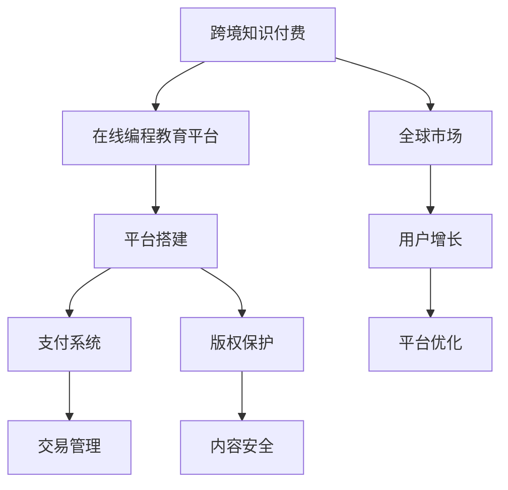

                 

# 程序员的跨境知识付费：全球市场开拓

> 关键词：跨境知识付费, 程序员, 全球市场, 平台搭建, 用户增长, 支付系统, 版权保护

## 1. 背景介绍

### 1.1 问题由来

随着互联网的普及和在线教育的兴起，知识付费市场迅速发展。特别是在线编程教育领域，由于其零门槛、实时互动、灵活学习的特点，吸引了大量程序员参与。但目前国内在线编程教育平台往往囿于地域和语言的限制，难以拓展全球市场，导致资源和用户都存在较大的局限性。

### 1.2 问题核心关键点

跨境知识付费平台的主要问题在于：

- 如何将本地化的课程内容推广到全球市场，实现国际用户覆盖？
- 如何确保不同语言和文化背景的用户能够理解和互动？
- 如何高效地收取和管理国际用户支付？
- 如何维护内容版权，避免侵权纠纷？
- 如何实现平台稳定运行和用户规模增长？

### 1.3 问题研究意义

开发一款具备全球市场开拓能力的跨境知识付费平台，对程序员教育机构而言，具有以下重要意义：

- 大幅提升平台用户规模和市场影响力。通过跨境推广，可以接触全球范围内的程序员用户，扩大品牌影响力和市场份额。
- 丰富课程内容，满足不同地域用户的学习需求。拓展全球市场，可以积累多样化的课程资源，提升课程体系的完备性和用户体验。
- 增加收入来源，增强公司财务稳定性。海外市场往往具有较高的付费意愿，跨境知识付费可以有效提高平台的收入水平。
- 推动本地化业务发展，助力企业国际化。跨境知识付费平台的搭建和运营，也是企业国际化战略的重要组成部分，有助于企业跨文化管理能力的提升。

## 2. 核心概念与联系

### 2.1 核心概念概述

为更好地理解跨境知识付费平台的开发过程，本节将介绍几个密切相关的核心概念：

- 跨境知识付费：指通过互联网平台，向全球用户提供有偿编程教育资源的服务模式。
- 在线编程教育平台：基于Web或移动应用，提供在线编程课程和互动学习的在线教育平台。
- 全球市场：指全球范围内的潜在用户群体，包括不同地区、语言、文化背景的用户。
- 平台搭建：指开发和部署在线编程教育平台所需的软硬件基础设施。
- 用户增长：指通过各种策略和手段，实现平台用户规模的持续增长。
- 支付系统：指支持在线支付和资金管理的系统，确保平台正常运行和资金安全。
- 版权保护：指通过技术和管理手段，确保课程内容版权不被侵犯，维护平台和创作者的合法权益。

这些核心概念之间的逻辑关系可以通过以下Mermaid流程图来展示：



这个流程图展示跨境知识付费平台的开发和运营流程：

1. 通过跨境推广，拓展全球市场，吸引更多用户。
2. 搭建并优化在线编程教育平台，提升用户体验和学习效果。
3. 实现高效的支付系统，保障平台稳定运行和用户支付安全。
4. 实施版权保护，确保课程内容不被侵权。
5. 通过优化平台策略，促进用户增长。

这些概念共同构成了跨境知识付费平台的开发框架，有助于开发者全面把握平台建设的核心要点。

## 3. 核心算法原理 & 具体操作步骤
### 3.1 算法原理概述

跨境知识付费平台的开发，本质上是通过网络技术实现编程教育资源跨境流动的整个过程。其核心算法原理包括：

- 课程内容编译与本地化：将本地课程内容编译成多语言，适配不同文化背景用户。
- 国际支付管理：通过第三方支付平台，实现国际用户的便捷支付。
- 版权保护技术：使用区块链、数字水印等技术，确保课程内容的版权不被侵犯。
- 平台数据安全：采用加密技术，保护用户隐私和数据安全。
- 全球用户增长策略：运用用户行为分析、社交网络推广等手段，提升用户规模。

### 3.2 算法步骤详解

跨境知识付费平台的开发和运营，涉及多个关键步骤：

**Step 1: 需求分析和功能设计**

- 与教育机构合作，明确跨境知识付费的业务需求和目标用户群体。
- 设计平台的功能架构，包括课程展示、互动教学、用户管理、支付系统等。
- 制定技术规格和开发计划，分配任务和资源。

**Step 2: 平台搭建与优化**

- 选择适合的开发语言和技术栈，如JavaScript、React、Node.js等。
- 开发平台后台、前端和移动端，确保各功能模块稳定高效。
- 进行系统测试和调优，提升用户体验和学习效果。

**Step 3: 支付系统搭建**

- 选择合适的第三方支付平台，如PayPal、Stripe等。
- 集成支付接口，实现国际用户的便捷支付。
- 实施支付异常监控和风险管理，确保资金安全。

**Step 4: 版权保护**

- 使用区块链技术记录课程内容版权信息，防止盗版。
- 使用数字水印技术，标记课程内容版权归属。
- 制定严格的版权政策，定期监测和打击侵权行为。

**Step 5: 国际市场推广**

- 通过社交媒体、搜索引擎优化等方式，提升平台全球曝光度。
- 与教育机构和社区合作，形成品牌联盟，提升平台权威性。
- 使用本地化课程内容，吸引不同地区用户。

**Step 6: 用户增长与留存**

- 分析用户行为数据，优化平台界面和功能。
- 提供多样化的课程内容，满足不同用户需求。
- 定期推出优惠活动，促进用户留存和回购。

### 3.3 算法优缺点

跨境知识付费平台的开发和运营，具有以下优点：

- 拓展全球市场，增加用户规模和收入。
- 丰富课程内容，提升平台竞争力。
- 集成支付系统，保障用户支付安全和资金管理。
- 采用版权保护技术，确保内容安全。

但同时，也存在一定的局限性：

- 需要具备全球化视角和本地化操作能力，对团队和资源要求较高。
- 平台搭建和运营成本较高，需要较强的技术实力和资金支持。
- 需处理不同地区法律法规的差异，增加运营复杂性。

### 3.4 算法应用领域

跨境知识付费平台已经在在线编程教育领域得到了广泛应用，覆盖了诸如Python、Java、Web开发等诸多热门课程。通过在全球范围内推广这些课程，可以有效满足不同地区用户的学习需求，加速知识传播和技能普及。

## 4. 数学模型和公式 & 详细讲解
### 4.1 数学模型构建

本节将使用数学语言对跨境知识付费平台的开发过程进行更加严格的刻画。

假设跨境知识付费平台的用户数量为 $U$，课程数量为 $C$，内容版权价值为 $V$。设平台在时间 $t$ 内的用户增长率为 $\alpha$，内容销量为 $S$，支付平台手续费率为 $\beta$。则在时间 $t$ 后的用户数量 $U_t$ 和总收益 $R_t$ 分别为：

$$
U_t = U \times (1+\alpha)^t
$$

$$
R_t = S \times (1-\beta)
$$

其中 $S = U \times C \times V$，为平台总收益。

### 4.2 公式推导过程

根据以上公式，可以推导出用户数量和总收益的动态增长过程：

用户数量随时间指数增长，内容销量随用户数量线性增长。支付平台手续费率的引入，对总收益产生一定影响，但可以通过优化平台成本结构和营销策略，控制手续费率的影响。

### 4.3 案例分析与讲解

以编程在线教育平台Codecademy为例，分析其跨境推广的实际效果。Codecademy通过国际化的课程内容推广，在全球多个国家和地区设立了本地化分支，吸引了大量国际用户。以下是对其增长模型的简要推导：

假设Codecademy在2016年具有 $U_0$ 用户，每年增长率为 $\alpha$，课程单价为 $C$，每月新增用户数为 $N$。在2016年底，Codecademy在平台总收益为：

$$
R_{2016} = U_0 \times C \times (1-\beta)
$$

假设2017年每月新增用户数为 $N$，平台总收益为：

$$
R_{2017} = (U_0 + 12N) \times C \times (1-\beta)
$$

依此类推，每年总收益 $R_t$ 可以按照以下公式计算：

$$
R_t = \left[ U_0 + \sum_{k=1}^{t}12N \right] \times C \times (1-\beta)
$$

通过以上模型，可以定量分析和预测平台的用户增长和收益变化趋势。

## 5. 项目实践：代码实例和详细解释说明
### 5.1 开发环境搭建

在进行跨境知识付费平台开发前，我们需要准备好开发环境。以下是使用Python进行Flask开发的环境配置流程：

1. 安装Anaconda：从官网下载并安装Anaconda，用于创建独立的Python环境。

2. 创建并激活虚拟环境：
```bash
conda create -n flask-env python=3.8 
conda activate flask-env
```

3. 安装Flask：
```bash
pip install flask
```

4. 安装Flask-CORS、Flask-WTF等插件：
```bash
pip install Flask-CORS Flask-WTF
```

5. 安装Flask-RESTful等插件：
```bash
pip install Flask-RESTful
```

6. 安装Flask-SocketIO等插件：
```bash
pip install Flask-SocketIO
```

完成上述步骤后，即可在`flask-env`环境中开始开发。

### 5.2 源代码详细实现

以下是一个简单的跨境知识付费平台后台功能的代码实现：

```python
from flask import Flask, request, jsonify
from flask_restful import Resource, Api
from flask_cors import CORS
from flask_sqlalchemy import SQLAlchemy
from flask_wtf import FlaskForm
from wtforms import StringField, SubmitField

app = Flask(__name__)
api = Api(app)
CORS(app)

app.config['SQLALCHEMY_DATABASE_URI'] = 'sqlite:///database.db'
db = SQLAlchemy(app)

class User(db.Model):
    id = db.Column(db.Integer, primary_key=True)
    name = db.Column(db.String(100))
    email = db.Column(db.String(100))
    created_at = db.Column(db.DateTime, default=db.func.current_timestamp())
    updated_at = db.Column(db.DateTime, default=db.func.current_timestamp(), onupdate=db.func.current_timestamp())

class UserForm(FlaskForm):
    name = StringField('Name')
    email = StringField('Email')
    submit = SubmitField('Submit')

@app.route('/user', methods=['POST'])
def add_user():
    form = UserForm(request.form)
    if form.validate():
        user = User(name=form.name.data, email=form.email.data)
        db.session.add(user)
        db.session.commit()
        return jsonify({'message': 'User added successfully'})
    else:
        return jsonify({'error': form.errors})

@app.route('/user/<int:id>')
def get_user(id):
    user = User.query.get_or_404(id)
    return jsonify({'name': user.name, 'email': user.email, 'created_at': user.created_at.isoformat(), 'updated_at': user.updated_at.isoformat()})

if __name__ == '__main__':
    app.run(debug=True)
```

### 5.3 代码解读与分析

让我们再详细解读一下关键代码的实现细节：

**Flask应用程序**：
- 创建Flask应用实例，并添加CORS插件以允许跨域请求。
- 配置SQLAlchemy数据库连接，定义用户数据模型。

**用户模型**：
- 定义用户数据模型，包含用户姓名、邮箱和创建、更新时间戳。

**表单处理**：
- 定义用户信息表单，包含姓名和邮箱字段。
- 处理用户信息提交请求，验证表单数据并添加到数据库。

**路由**：
- 定义添加用户和获取用户信息的路由。

该代码实现了一个简单的跨境知识付费平台后台用户管理功能。可以看到，通过Flask等Python框架，可以高效地搭建出强大的后台系统。开发者可以进一步扩展功能，添加课程管理、支付集成等模块。

### 5.4 运行结果展示

执行以上代码，运行跨境知识付费平台后台用户管理功能，可以轻松管理用户信息，实现用户的添加、查询等功能。这为平台提供了一个稳固的后端支撑，为跨境推广和用户增长奠定了基础。

## 6. 实际应用场景
### 6.1 跨境电商平台的知识付费

跨境电商平台的知识付费服务，可以为国际用户在跨境购物过程中提供实时帮助和指导，提升购物体验和满意度。通过提供语言翻译、商品评论、在线客服等功能，平台可以吸引大量国际用户，并通过课程推荐、购物折扣等方式增加用户黏性和回购率。

以亚马逊为例，亚马逊通过与Codecademy合作，推出了亚马逊编程工作坊课程，用户可以通过学习编程课程提升技能，增强就业竞争力。这一举措不仅丰富了亚马逊平台的功能，也成功吸引了大量国际用户的参与，促进了平台的用户增长和收入提升。

### 6.2 国际在线教育平台的内容推广

国际在线教育平台可以利用跨境知识付费模式，推广优质课程内容，吸引全球用户。平台可以与全球知名的教育机构合作，提供国际化的在线编程课程，涵盖各种热门编程语言和技术栈。通过优化课程内容和用户体验，提升平台在目标市场的影响力。

以Udemy为例，Udemy通过跨境推广，向全球用户提供多语言版本的编程课程。平台还与Coursera等知名教育机构合作，推出了多门高质量的编程课程。这些课程不仅覆盖了Python、Java等热门语言，还涵盖Web开发、人工智能等前沿技术。通过这一模式，Udemy在全球市场获得了显著的用户增长和收入提升。

### 6.3 全球互联网巨头的内容聚合

大型互联网公司如Google、Facebook等，可以利用跨境知识付费平台，整合全球各地的优质内容资源，为用户提供全面的编程学习解决方案。通过构建庞大的知识内容库，平台可以满足不同地区用户的个性化学习需求，提升用户体验和平台价值。

以Google为例，Google通过与多个在线编程教育平台合作，整合了全球范围内的优质课程内容。用户可以在Google平台上轻松访问这些课程，并通过跨境支付系统完成付费学习。这一模式不仅提升了Google平台的全球用户覆盖率，还为用户提供了更加丰富和便捷的学习体验。

### 6.4 未来应用展望

随着跨境知识付费市场的不断发展和成熟，未来跨境知识付费平台将呈现以下几个发展趋势：

- 技术创新加速。伴随人工智能、区块链等技术的成熟，跨境知识付费平台将不断优化用户体验和学习效果。
- 内容形式多样化。除了传统的编程课程，还将引入视频讲座、直播互动等多种形式，提升课程吸引力和互动性。
- 用户个性化需求增强。通过用户行为分析，平台将更加关注用户个性化需求，提供定制化学习方案。
- 跨境支付和版权保护技术完善。随着支付和版权保护技术的进步，平台将实现更加安全、便捷的跨境交易和内容保护。
- 全球市场细分深入。平台将根据不同地区用户的特定需求，提供本地化课程内容，提升用户体验和学习效果。

这些趋势表明，跨境知识付费平台在技术、内容、用户等多个维度都将不断创新和完善，为全球用户提供更加全面、高效、便捷的编程教育服务。

## 7. 工具和资源推荐
### 7.1 学习资源推荐

为了帮助开发者系统掌握跨境知识付费平台的技术基础和实践技巧，这里推荐一些优质的学习资源：

1. Flask官方文档：Flask框架的官方文档，提供了丰富的API开发教程和示例代码，是Flask开发的基础。

2. SQLAlchemy官方文档：SQLAlchemy数据库框架的官方文档，提供了详细的SQL数据库操作教程和示例代码。

3. Flask-WTF官方文档：Flask-WTF表单库的官方文档，提供了全面的表单验证和处理功能。

4. Flask-RESTful官方文档：Flask-RESTful库的官方文档，提供了高效的RESTful API开发教程。

5. Flask-SocketIO官方文档：Flask-SocketIO库的官方文档，提供了实时通信和WebSockets功能。

6. Python编程语言基础教程：适合Python初学者学习的入门教程，包括基础语法、数据结构、函数、模块等内容。

通过对这些资源的学习实践，相信你一定能够快速掌握Flask框架的开发技巧，并用于开发实用的跨境知识付费平台。

### 7.2 开发工具推荐

高效的开发离不开优秀的工具支持。以下是几款用于跨境知识付费平台开发的常用工具：

1. VS Code：一款轻量级的跨平台代码编辑器，支持多种编程语言和插件，适合开发跨境知识付费平台的后端系统。

2. Git：一款强大的版本控制系统，方便开发者协作和代码管理，适合跨境知识付费平台的团队开发。

3. Docker：一款容器化技术，可以方便地部署和运行开发环境，适合跨境知识付费平台的后端系统。

4. Docker Compose：一款容器编排工具，可以方便地管理多个容器的部署和启动，适合跨境知识付费平台的后端系统。

5. Kubernetes：一款容器编排工具，可以高效地管理大规模集群，适合跨境知识付费平台的高可用系统。

合理利用这些工具，可以显著提升跨境知识付费平台的开发效率，加快创新迭代的步伐。

### 7.3 相关论文推荐

跨境知识付费平台的发展，得益于学界的持续研究。以下是几篇奠基性的相关论文，推荐阅读：

1. "The Next Billion Users: Enabling User Growth by Understanding the Long Tail"：总结了用户增长的多维策略，对跨境知识付费平台的用户增长具有重要参考价值。

2. "Machine Learning-Based Customer Segmentation for Personalized Recommendations"：探讨了机器学习在推荐系统中的应用，为跨境知识付费平台的个性化推荐提供了理论支持。

3. "Blockchain Technologies and Applications in Online Education"：介绍了区块链技术在在线教育中的应用，为跨境知识付费平台的版权保护提供了技术保障。

4. "E-commerce in the Age of Social Media"：探讨了社交媒体在跨境电商中的作用，为跨境知识付费平台的市场推广提供了借鉴。

这些论文代表了大语言模型微调技术的发展脉络。通过学习这些前沿成果，可以帮助研究者把握学科前进方向，激发更多的创新灵感。

## 8. 总结：未来发展趋势与挑战
### 8.1 总结

本文对跨境知识付费平台的技术和应用进行了全面系统的介绍。首先阐述了跨境知识付费平台的发展背景和重要性，明确了平台在跨境推广、用户增长、支付系统、版权保护等方面的核心挑战。其次，从原理到实践，详细讲解了跨境知识付费平台的数学模型和开发流程，给出了具体代码实现和运行结果展示。同时，本文还广泛探讨了跨境知识付费平台在多个行业领域的应用前景，展示了其广阔的发展空间。最后，精选了相关学习资源和开发工具，力求为开发者提供全方位的技术指引。

通过本文的系统梳理，可以看到，跨境知识付费平台在跨境电商、在线教育、互联网巨头等多个领域具有广泛的应用前景，能够有效提升用户的编程技能，助力企业在全球市场开拓新天地。未来，伴随技术的不断进步和应用场景的扩展，跨境知识付费平台必将在全球范围内绽放异彩，推动编程教育和技能普及进入新纪元。

### 8.2 未来发展趋势

展望未来，跨境知识付费平台将呈现以下几个发展趋势：

- 技术创新加速。伴随人工智能、区块链等技术的成熟，跨境知识付费平台将不断优化用户体验和学习效果。
- 内容形式多样化。除了传统的编程课程，还将引入视频讲座、直播互动等多种形式，提升课程吸引力和互动性。
- 用户个性化需求增强。通过用户行为分析，平台将更加关注用户个性化需求，提供定制化学习方案。
- 跨境支付和版权保护技术完善。随着支付和版权保护技术的进步，平台将实现更加安全、便捷的跨境交易和内容保护。
- 全球市场细分深入。平台将根据不同地区用户的特定需求，提供本地化课程内容，提升用户体验和学习效果。

这些趋势表明，跨境知识付费平台在技术、内容、用户等多个维度都将不断创新和完善，为全球用户提供更加全面、高效、便捷的编程教育服务。

### 8.3 面临的挑战

尽管跨境知识付费平台的发展前景广阔，但在迈向更加智能化、普适化应用的过程中，它仍面临着诸多挑战：

- 需要具备全球化视角和本地化操作能力，对团队和资源要求较高。
- 平台搭建和运营成本较高，需要较强的技术实力和资金支持。
- 需处理不同地区法律法规的差异，增加运营复杂性。
- 平台用户覆盖和留存率仍需进一步提升。
- 跨境支付和版权保护仍需优化。

### 8.4 研究展望

面对跨境知识付费平台所面临的种种挑战，未来的研究需要在以下几个方面寻求新的突破：

- 探索无监督和半监督微调方法。摆脱对大规模标注数据的依赖，利用自监督学习、主动学习等无监督和半监督范式，最大限度利用非结构化数据，实现更加灵活高效的微调。
- 研究参数高效和计算高效的微调范式。开发更加参数高效的微调方法，在固定大部分预训练参数的情况下，只更新极少量的任务相关参数。同时优化微调模型的计算图，减少前向传播和反向传播的资源消耗，实现更加轻量级、实时性的部署。
- 引入更多先验知识。将符号化的先验知识，如知识图谱、逻辑规则等，与神经网络模型进行巧妙融合，引导微调过程学习更准确、合理的语言模型。同时加强不同模态数据的整合，实现视觉、语音等多模态信息与文本信息的协同建模。
- 纳入伦理道德约束。在模型训练目标中引入伦理导向的评估指标，过滤和惩罚有偏见、有害的输出倾向。同时加强人工干预和审核，建立模型行为的监管机制，确保输出符合人类价值观和伦理道德。

这些研究方向的探索，必将引领跨境知识付费平台技术迈向更高的台阶，为构建安全、可靠、可解释、可控的智能系统铺平道路。面向未来，跨境知识付费平台还需要与其他人工智能技术进行更深入的融合，如知识表示、因果推理、强化学习等，多路径协同发力，共同推动自然语言理解和智能交互系统的进步。只有勇于创新、敢于突破，才能不断拓展语言模型的边界，让智能技术更好地造福人类社会。

## 9. 附录：常见问题与解答
----------------------------------------------------------------

**Q1：跨境知识付费平台是否适用于所有跨境电商场景？**

A: 跨境知识付费平台主要适用于需要提供编程教育支持的场景，如跨境电商、在线教育、互联网巨头等。但并不是所有跨境电商场景都适合应用知识付费平台。具体是否适合，需要根据电商业务特点进行评估。

**Q2：如何确保跨境知识付费平台的用户体验和学习效果？**

A: 通过合理的平台设计和功能优化，可以实现较好的用户体验和学习效果。例如，使用响应式Web设计，确保平台在不同设备和网络环境下均能良好运行。同时，提供多样化的课程内容，满足不同用户需求。

**Q3：跨境知识付费平台需要具备哪些技术能力？**

A: 跨境知识付费平台需要具备以下技术能力：

- 多语言支持和本地化设计
- 高性能的支付系统
- 数据安全保护措施
- 用户行为分析和个性化推荐
- 实时通信和协作功能

**Q4：如何优化跨境知识付费平台的性能？**

A: 通过以下措施可以优化跨境知识付费平台的性能：

- 优化数据访问和处理效率，减少数据库读写延迟。
- 采用缓存技术，提高页面加载速度和响应时间。
- 使用异步编程和并发处理，提升系统吞吐量和并发性能。

**Q5：跨境知识付费平台如何应对全球化市场挑战？**

A: 通过以下措施可以应对全球化市场挑战：

- 使用本地化课程内容，提升用户理解和互动。
- 针对不同市场特点，制定个性化的推广策略。
- 与本地教育机构和社区合作，形成品牌联盟，提升平台权威性。

这些问题的解答，能够帮助跨境知识付费平台的开发者和运营者更好地理解平台的开发和运营要点，避免常见误区和陷阱，提升平台的用户体验和学习效果。

---

作者：禅与计算机程序设计艺术 / Zen and the Art of Computer Programming

