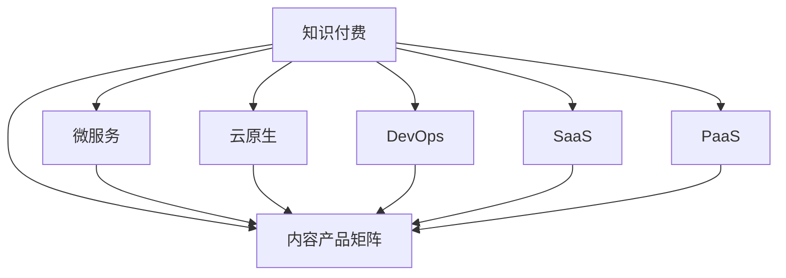

                 

## 1. 背景介绍

随着信息爆炸时代的到来，在线教育和知识付费领域正在快速崛起。程序员作为知识密集型行业，面临着持续学习的挑战，知识付费成为了他们获取最新技能和提升职业竞争力的重要手段。本文将探讨程序员知识付费的内容产品矩阵设计，帮助开发者理解和构建基于微服务和云原生架构的知识付费平台，以满足开发者社区多样化、个性化的知识需求。

## 2. 核心概念与联系

### 2.1 核心概念概述

为更好地理解知识付费的内容产品矩阵设计，本节将介绍几个密切相关的核心概念：

- **知识付费**：通过在线课程、电子书、视频教程、技术博客等形式，为用户提供专业的技术知识和经验分享，帮助其提升编程技能和学习效率。
- **内容产品矩阵**：针对不同用户需求和产品定位，构建包括课程、文章、问答、电子书等多种形式的内容产品，形成多样化的内容生态。
- **微服务**：将复杂的业务系统拆分为多个小型、自治的服务，每个服务独立部署、更新，实现系统灵活、可扩展的特性。
- **云原生**：基于容器化和微服务架构，结合云计算技术，构建高效的、弹性的、可扩展的应用系统，提升系统可靠性、可用性和性能。
- **DevOps**：将软件开发、测试、运维等过程自动化，提升软件交付效率和系统稳定性，缩短产品上市时间。
- **SaaS（软件即服务）**：通过云计算平台提供应用服务，用户只需按需支付使用费，无需搭建和维护复杂的软件环境。
- **PaaS（平台即服务）**：在SaaS基础上，提供更底层的服务平台，如数据库、消息队列、日志存储等，帮助开发者更方便地构建应用。

这些核心概念之间的逻辑关系可以通过以下Mermaid流程图来展示：



这个流程图展示了一系列构建知识付费内容产品的关键技术和概念，通过它们可以实现系统的高效、灵活和可靠。

## 3. 核心算法原理 & 具体操作步骤
### 3.1 算法原理概述

知识付费的内容产品矩阵设计，主要包括以下几个关键步骤：

1. **需求分析**：收集目标用户群体的知识需求和期望，制定详细的用户画像和市场分析。
2. **内容规划**：根据需求分析结果，设计多样化、高质量的内容产品，包括课程、文章、电子书、视频教程等。
3. **技术架构**：选择合适的微服务和云原生技术，构建可扩展、高可靠性的内容交付系统。
4. **开发部署**：使用DevOps工具链，实现内容的自动化开发、测试和部署，提高生产效率。
5. **服务化封装**：将知识内容封装为API服务，便于集成到其他系统和应用中。
6. **数据分析**：通过数据分析工具，实时监控用户行为和反馈，优化内容产品。

### 3.2 算法步骤详解

**Step 1: 需求分析**
- 调查目标用户群体的知识需求，包括技术栈、学习目标、时间投入等。
- 通过问卷调查、访谈等方式，收集用户反馈，确认需求和期望。
- 分析市场竞争环境，识别优势和劣势，制定差异化的内容策略。

**Step 2: 内容规划**
- 根据用户需求，设计内容产品矩阵，包括核心课程、专题文章、电子书、技术博客等。
- 确定各产品的定位、形式和交付方式。
- 制定内容的质量和更新标准，确保内容的可靠性和实用性。

**Step 3: 技术架构**
- 选择合适的微服务架构，将内容产品分为多个小型、自治的服务。
- 使用容器化技术，如Docker，封装内容服务。
- 利用云原生平台，如Kubernetes，实现服务的自动化部署和扩展。

**Step 4: 开发部署**
- 使用DevOps工具链，如Jenkins、GitLab CI，实现内容的自动化开发、测试和部署。
- 采用CI/CD流水线，确保内容的及时更新和发布。
- 使用监控工具，如Prometheus、Grafana，实时监控系统状态和性能。

**Step 5: 服务化封装**
- 将内容服务封装为RESTful API接口，便于第三方应用集成。
- 使用Swagger等工具，自动生成API文档，方便开发者使用。
- 提供API版本控制和访问鉴权，保证系统的安全和稳定。

**Step 6: 数据分析**
- 使用数据分析工具，如Google Analytics、Mixpanel，监控用户行为和反馈。
- 定期分析用户数据，识别热点内容和问题领域，优化内容产品。
- 结合用户反馈，及时调整内容策略，满足用户需求。

### 3.3 算法优缺点

知识付费的内容产品矩阵设计，具有以下优点：
1. 灵活扩展：微服务和云原生架构，使内容系统易于扩展和部署。
2. 高效运维：DevOps工具链，提高生产效率，缩短内容上线时间。
3. 稳定可靠：容器化和云原生技术，保证系统的高可靠性和可用性。
4. 个性化服务：根据用户行为和反馈，提供个性化推荐，提升用户体验。
5. 快速迭代：持续集成和持续交付，实现内容的快速迭代和更新。

同时，该方法也存在一定的局限性：
1. 初始投入高：初期建设内容产品矩阵，需要大量资金和技术投入。
2. 内容质量要求高：需要高质量的内容制作团队，确保内容的准确性和实用性。
3. 技术复杂度高：微服务和云原生架构，对开发和运维人员的技能要求较高。
4. 运营成本高：内容服务的持续运营，需要大量的运维和数据分析投入。

尽管存在这些局限性，但知识付费的内容产品矩阵设计仍然是大数据时代下，程序员知识获取的重要手段。未来相关研究的重点在于如何进一步降低技术门槛，提高运营效率，实现内容的低成本、高效益。

### 3.4 算法应用领域

知识付费的内容产品矩阵设计，广泛应用于各类程序员培训和技能提升平台。以下是几个典型应用场景：

- **在线课程平台**：如Udemy、Coursera，提供从基础到高级的编程课程，涵盖多种技术栈。
- **技术博客社区**：如Medium、CSDN，汇集程序员的技术文章和心得，帮助用户深入理解技术细节。
- **开源项目支持**：如GitHub、Stack Overflow，通过回答问题、提供代码示例等方式，帮助开发者解决实际问题。
- **虚拟技术沙龙**：如Meetup、Zoom，提供线上线下结合的编程交流和分享平台。
- **视频教程站点**：如YouTube、Bilibili，通过视频形式，直观展示编程技巧和开发流程。
- **知识付费订阅服务**：如Codecademy、Pluralsight，提供定制化的编程培训课程，提升用户技能。

## 4. 数学模型和公式 & 详细讲解
### 4.1 数学模型构建

知识付费的内容产品矩阵设计，涉及多个维度和参数的优化，可以通过数学模型进行建模和求解。

假设用户需求数量为 $N$，内容数量为 $M$，内容产品的用户覆盖率为 $C$，用户参与度为 $U$，内容更新频率为 $F$，内容质量为 $Q$，服务可用性为 $A$。则知识付费平台的目标函数可以表示为：

$$
\max_{C,U,F,Q,A} \sum_{i=1}^N \sum_{j=1}^M u_{ij} \times \min_{k=1}^K f_{ik} \times (C \times U \times F \times Q \times A)
$$

其中 $u_{ij}$ 为内容 $j$ 对用户 $i$ 的适用度，$f_{ik}$ 为内容 $j$ 的更新频率，$K$ 为用户的行为模式数。

目标函数表示，通过最大化用户参与度、内容更新频率、内容质量和服务可用性，来优化知识付费平台的效果。

### 4.2 公式推导过程

我们可以通过多目标优化模型，对上述目标函数进行求解。假设内容 $j$ 对用户 $i$ 的适用度 $u_{ij}$ 和更新频率 $f_{ik}$ 为变量，其他参数为常量，则目标函数可以表示为：

$$
\max_{u_{ij},f_{ik}} \sum_{i=1}^N \sum_{j=1}^M u_{ij} \times \min_{k=1}^K f_{ik}
$$

约束条件为：

$$
\begin{cases}
0 \leq u_{ij} \leq 1 \\
0 \leq f_{ik} \leq 1 \\
\sum_{j=1}^M u_{ij} = 1
\end{cases}
$$

其中第二个约束条件表示，内容产品只能被用户一次选择，第三个约束条件表示，内容产品的选择不超过用户的行为模式数 $K$。

求解上述模型，可以使用多目标优化算法，如NSGA-II、SPEA2等，同时使用线性规划算法，如Simplex、Dantzig等，对变量 $u_{ij}$ 和 $f_{ik}$ 进行优化求解。

### 4.3 案例分析与讲解

以一个在线编程课程为例，分析知识付费的内容产品矩阵设计过程。

- **需求分析**：目标用户群体为中高级Java开发者，期望学习Spring Boot、Spring Cloud、Docker等技术栈。
- **内容规划**：设计三门核心课程：《Spring Boot实战》、《Spring Cloud微服务架构》、《Docker与Kubernetes》，每门课程包括10个模块，每个模块1-2小时。
- **技术架构**：使用微服务架构，将课程内容分为视频、课件、习题、实验等小型服务，每个服务独立部署在Kubernetes集群中。
- **开发部署**：使用Jenkins CI/CD流水线，自动构建、测试和部署课程内容，每天自动更新课程资料。
- **服务化封装**：将课程内容封装为RESTful API接口，提供用户学习和访问。
- **数据分析**：使用Mixpanel分析用户行为，定期优化课程内容和结构。

## 5. 项目实践：代码实例和详细解释说明
### 5.1 开发环境搭建

在进行知识付费的内容产品矩阵设计前，我们需要准备好开发环境。以下是使用Python进行知识付费平台开发的环境配置流程：

1. 安装Anaconda：从官网下载并安装Anaconda，用于创建独立的Python环境。

2. 创建并激活虚拟环境：
```bash
conda create -n knowledge-env python=3.8 
conda activate knowledge-env
```

3. 安装Python工具包：
```bash
pip install flask restful google-auth google-auth-httplib2 google-auth-oauthlib
```

4. 安装RESTful框架：
```bash
pip install flask-restful
```

5. 安装数据分析工具：
```bash
pip install pandas matplotlib
```

6. 安装DevOps工具：
```bash
pip install jenkins-rest
```

完成上述步骤后，即可在`knowledge-env`环境中开始知识付费平台的开发。

### 5.2 源代码详细实现

下面我们以一个在线编程课程为例，给出使用Flask和RESTful框架构建知识付费平台的PyTorch代码实现。

首先，定义API路由和数据模型：

```python
from flask import Flask, request
from flask_restful import Resource, Api

app = Flask(__name__)
api = Api(app)

class Course(Resource):
    def get(self):
        courses = [
            {
                'id': 1,
                'name': 'Spring Boot实战',
                'modules': [
                    {'name': '基础入门', 'duration': '2小时'},
                    {'name': 'Spring MVC', 'duration': '3小时'},
                    {'name': 'Spring Data JPA', 'duration': '4小时'},
                    # ...
                ]
            },
            # ...
        ]
        return courses

class Module(Resource):
    def get(self, course_id):
        course = courses[course_id-1]
        modules = course['modules']
        return modules

api.add_resource(Course, '/courses')
api.add_resource(Module, '/courses/<int:course_id>/modules')
```

然后，定义用户行为和数据分析接口：

```python
from flask import jsonify
from google.oauth2 import service_account
from google.cloud import bigquery

def get_user_behavior(user_id):
    credentials = service_account.Credentials.from_service_account_file('path/to/credentials.json')
    client = bigquery.Client(credentials=credentials)
    query = """
        SELECT *
        FROM `project.dataset.table`
        WHERE user_id = {}
    """.format(user_id)
    df = client.query(query).to_dataframe()
    return df

@app.route('/users/<int:user_id>/behavior')
def get_user_behavior_data(user_id):
    df = get_user_behavior(user_id)
    return jsonify(df.to_dict(orient='records'))
```

最后，启动服务并部署到云平台：

```python
if __name__ == '__main__':
    app.run(host='0.0.0.0', port=5000)
```

以上是使用Flask和RESTful框架构建知识付费平台的完整代码实现。可以看到，通过Flask和RESTful框架，我们可以用相对简洁的代码实现API接口，同时利用Google BigQuery等数据分析工具，实时监控用户行为，优化课程内容和推荐。

### 5.3 代码解读与分析

让我们再详细解读一下关键代码的实现细节：

**Course类**：
- `get`方法：返回所有课程的信息，包括课程名称和模块。

**Module类**：
- `get`方法：根据课程ID获取课程的所有模块信息。

**get_user_behavior函数**：
- 通过Google Cloud BigQuery，查询用户的行为数据，返回用户的行为记录。

**get_user_behavior_data函数**：
- 获取用户ID后，调用`get_user_behavior`函数获取用户行为数据，并以JSON格式返回。

**app.run**：
- 启动Flask应用，监听5000端口。

通过Flask和RESTful框架，可以构建高效、灵活的知识付费内容服务，同时利用数据分析工具，实时优化内容产品和推荐策略。

当然，知识付费平台的实际应用中，还需要考虑更多因素，如用户权限管理、支付集成、内容版权保护等。但核心的API接口设计思路和数据分析逻辑基本与此类似。

## 6. 实际应用场景
### 6.1 在线教育平台

知识付费的内容产品矩阵设计，在在线教育平台中得到了广泛应用。传统的在线教育平台往往功能单一，用户体验较差，难以满足多样化的学习需求。知识付费平台通过设计多样化的内容产品和智能推荐算法，提升了用户的学习体验和参与度。

在技术实现上，可以收集用户的学习行为数据，结合内容矩阵和推荐算法，实时调整课程推荐，提供个性化的学习路径。同时，通过API接口和数据分析工具，帮助教师实时监控学习效果，优化课程内容。

### 6.2 企业内部培训

企业的技术培训体系，也需要通过知识付费平台进行优化。传统的培训方式往往依赖于内部讲师和文档，无法实现大规模、高效率的培训。知识付费平台可以通过构建课程矩阵和专家讲座，提供在线学习资源，帮助员工快速掌握新技能。

在技术实现上，可以构建企业内部的课程资源库，通过API接口提供课程资源，帮助员工随时随地进行学习。同时，通过数据分析工具，实时监控员工的学习进度和效果，优化培训方案。

### 6.3 开源社区支持

开源社区的知识共享，也受益于知识付费平台。开源项目往往缺乏详细的文档和教程，难以吸引更多的贡献者和用户。知识付费平台可以通过提供丰富的学习资源和技术支持，吸引更多的开发者参与项目开发和贡献。

在技术实现上，可以构建开源项目的学习资源库，通过API接口提供项目文档、代码示例和社区讨论，帮助开发者快速掌握开源项目的使用方法和开发技巧。同时，通过数据分析工具，实时监控开源项目的活跃度和贡献情况，优化资源提供策略。

### 6.4 未来应用展望

随着知识付费平台的不断发展，未来的应用场景将更加广泛，以下是几个可能的方向：

- **跨领域学习**：知识付费平台将跨越多个领域，提供跨学科的学习资源，帮助用户跨领域学习和协作。
- **社区知识分享**：通过构建社区平台，鼓励用户分享经验和知识，形成自组织的知识网络。
- **个性化推荐**：结合用户行为数据和内容矩阵，提供个性化的推荐，提升学习体验和效果。
- **实时学习体验**：利用AI和VR技术，提供实时的学习体验，增强用户的沉浸感和互动性。
- **知识图谱**：构建知识图谱，提供系统的知识结构，帮助用户快速理解复杂的概念和技术。
- **智能助教**：利用自然语言处理和机器学习技术，提供智能助教服务，帮助用户解决学习中的难题。

## 7. 工具和资源推荐
### 7.1 学习资源推荐

为了帮助开发者系统掌握知识付费的内容产品矩阵设计，这里推荐一些优质的学习资源：

1. **《知识付费：模式、技术、运营》**：一本详细介绍知识付费平台模式、技术架构和运营管理的书籍，适合各类开发者和产品经理阅读。
2. **《微服务设计》**：一本系统介绍微服务架构设计的经典书籍，适合希望深入理解微服务架构的开发者。
3. **《云原生系统设计》**：一本详细介绍云原生架构设计和应用的书籍，适合希望掌握云原生技术的开发者。
4. **《DevOps实践》**：一本详细介绍DevOps工具链和流程的书籍，适合希望提高开发效率和系统稳定性的开发者。
5. **《SaaS平台建设》**：一本详细介绍SaaS平台建设的书籍，适合希望构建云服务平台的开发者。
6. **《PaaS平台开发》**：一本详细介绍PaaS平台开发的书籍，适合希望构建高效平台的开发者。

通过对这些资源的学习实践，相信你一定能够快速掌握知识付费平台的技术实现，并用于解决实际的程序员知识获取问题。

### 7.2 开发工具推荐

高效的开发离不开优秀的工具支持。以下是几款用于知识付费内容产品矩阵开发的常用工具：

1. **Flask**：Python的开源框架，简单易用，适合快速开发API接口。
2. **RESTful**：Flask的扩展库，提供RESTful风格的API接口设计，适合构建API服务。
3. **Jenkins**：开源的持续集成和持续交付工具，适合自动化开发和部署。
4. **GitLab CI/CD**：基于GitLab的持续集成和持续交付平台，适合构建高效的DevOps流程。
5. **Prometheus**：开源的监控和告警系统，适合实时监控系统状态和性能。
6. **Grafana**：开源的数据可视化工具，适合监控和展示系统指标。
7. **Mixpanel**：数据追踪和分析工具，适合监控用户行为和优化推荐策略。

合理利用这些工具，可以显著提升知识付费内容产品的开发效率，加快创新迭代的步伐。

### 7.3 相关论文推荐

知识付费的内容产品矩阵设计，涉及多学科的知识，以下是几篇重要的相关论文，推荐阅读：

1. **《知识付费平台的可持续发展研究》**：探讨知识付费平台的发展模式和用户需求，提出可持续发展的策略。
2. **《基于微服务架构的在线教育系统设计》**：介绍微服务架构在在线教育系统中的应用，提升系统的灵活性和可扩展性。
3. **《云原生架构下的知识共享平台设计》**：介绍云原生架构在知识共享平台中的应用，提升系统的可靠性和性能。
4. **《DevOps在知识付费平台中的应用》**：探讨DevOps在知识付费平台中的应用，提升系统的生产效率和稳定性和。
5. **《SaaS平台的建设与管理》**：探讨SaaS平台的建设与管理方法，帮助开发者构建高效的服务平台。
6. **《PaaS平台的设计与实现》**：介绍PaaS平台的设计与实现方法，提升平台的开发效率和用户体验。

这些论文代表了知识付费平台技术的最新进展，通过学习这些前沿成果，可以帮助研究者把握学科前进方向，激发更多的创新灵感。

## 8. 总结：未来发展趋势与挑战
### 8.1 总结

本文对知识付费的内容产品矩阵设计进行了全面系统的介绍。首先阐述了知识付费平台的背景和意义，明确了内容产品矩阵设计的核心目标和方法。其次，从原理到实践，详细讲解了知识付费平台的数学模型、API接口设计和数据分析流程，给出了具体实现代码。同时，本文还广泛探讨了知识付费平台在在线教育、企业培训、开源社区等领域的实际应用，展示了知识付费平台的广阔前景。此外，本文精选了知识付费平台的学习资源、开发工具和相关论文，力求为读者提供全方位的技术指引。

通过本文的系统梳理，可以看到，知识付费平台的内容产品矩阵设计，正在成为程序员知识获取的重要手段，极大地提升了程序员的学习效率和技能水平。未来相关研究的重点在于如何进一步降低技术门槛，提高运营效率，实现内容的低成本、高效益。

### 8.2 未来发展趋势

展望未来，知识付费的内容产品矩阵设计将呈现以下几个发展趋势：

1. **跨领域学习**：知识付费平台将跨越多个领域，提供跨学科的学习资源，帮助用户跨领域学习和协作。
2. **社区知识分享**：通过构建社区平台，鼓励用户分享经验和知识，形成自组织的知识网络。
3. **个性化推荐**：结合用户行为数据和内容矩阵，提供个性化的推荐，提升学习体验和效果。
4. **实时学习体验**：利用AI和VR技术，提供实时的学习体验，增强用户的沉浸感和互动性。
5. **知识图谱**：构建知识图谱，提供系统的知识结构，帮助用户快速理解复杂的概念和技术。
6. **智能助教**：利用自然语言处理和机器学习技术，提供智能助教服务，帮助用户解决学习中的难题。

以上趋势凸显了知识付费平台技术的广阔前景。这些方向的探索发展，必将进一步提升知识付费平台的用户体验和效果，为程序员知识获取提供更全面、更高效的服务。

### 8.3 面临的挑战

尽管知识付费的内容产品矩阵设计已经取得了显著成就，但在迈向更加智能化、普适化应用的过程中，它仍面临着诸多挑战：

1. **技术门槛高**：知识付费平台的构建和运营，需要较强的技术能力和丰富的经验，初期建设成本较高。
2. **内容质量要求高**：需要高质量的内容制作团队，确保内容的准确性和实用性。
3. **用户获取难度大**：如何吸引更多的用户，提高平台的访问量和用户粘性，仍是较大的挑战。
4. **内容更新频繁**：需要持续更新和优化内容，保持平台内容的活力和新鲜度。
5. **数据隐私问题**：需要严格保护用户数据隐私，避免数据泄露和滥用。

尽管存在这些挑战，但知识付费的内容产品矩阵设计仍然是大数据时代下，程序员知识获取的重要手段。未来相关研究的重点在于如何进一步降低技术门槛，提高运营效率，实现内容的低成本、高效益。

### 8.4 研究展望

面向未来，知识付费的内容产品矩阵设计需要在以下几个方面寻求新的突破：

1. **跨领域学习**：通过构建跨领域的知识图谱，帮助用户跨领域学习和协作。
2. **社区知识分享**：通过构建社区平台，鼓励用户分享经验和知识，形成自组织的知识网络。
3. **个性化推荐**：结合用户行为数据和内容矩阵，提供个性化的推荐，提升学习体验和效果。
4. **实时学习体验**：利用AI和VR技术，提供实时的学习体验，增强用户的沉浸感和互动性。
5. **知识图谱**：构建知识图谱，提供系统的知识结构，帮助用户快速理解复杂的概念和技术。
6. **智能助教**：利用自然语言处理和机器学习技术，提供智能助教服务，帮助用户解决学习中的难题。

这些研究方向将引领知识付费平台技术的不断演进，为程序员知识获取提供更全面、更高效的服务。面向未来，知识付费平台的内容产品矩阵设计需要与其他人工智能技术进行更深入的融合，如自然语言处理、知识图谱、增强现实等，多路径协同发力，共同推动知识付费平台的发展。

## 9. 附录：常见问题与解答

**Q1：知识付费平台如何降低技术门槛？**

A: 通过采用微服务架构和云原生技术，知识付费平台的构建和运营将变得更加灵活和可扩展。同时，通过DevOps工具链的引入，实现内容的自动化开发、测试和部署，可以显著降低开发和运维的复杂度，提升生产效率。

**Q2：知识付费平台如何提高内容质量？**

A: 知识付费平台需要引入专业的内容制作团队，确保内容的准确性和实用性。同时，可以通过社区审核和用户评价机制，对内容进行严格筛选和推荐，提升平台内容的可信度和价值。

**Q3：知识付费平台如何吸引更多用户？**

A: 知识付费平台需要设计多样化的内容产品，提供丰富的学习资源和技术支持。同时，通过社区互动和用户推荐，吸引更多的开发者和用户参与，提升平台的活跃度和粘性。

**Q4：知识付费平台如何处理内容更新？**

A: 知识付费平台需要构建持续的内容更新机制，定期发布和更新课程内容，保持平台内容的活力和新鲜度。同时，通过社区反馈和用户建议，实时调整课程内容，提升用户的学习体验。

**Q5：知识付费平台如何保护用户隐私？**

A: 知识付费平台需要严格遵守数据隐私法律法规，保护用户数据的机密性、完整性和可用性。同时，通过加密技术、权限控制等手段，防止数据泄露和滥用，提升平台的安全性和可信度。

**Q6：知识付费平台如何构建跨领域学习？**

A: 知识付费平台可以通过构建跨领域的知识图谱，帮助用户跨领域学习和协作。通过知识图谱的链接关系，用户可以跨学科、跨技术栈地进行学习和研究，提升自身的综合素质和创新能力。

通过以上问题的解答，相信读者对知识付费平台的内容产品矩阵设计有了更深刻的理解。面向未来，知识付费平台需要在技术创新、用户体验和平台运营等方面不断突破，为用户提供更加全面、高效、可靠的知识服务。

---

作者：禅与计算机程序设计艺术 / Zen and the Art of Computer Programming

