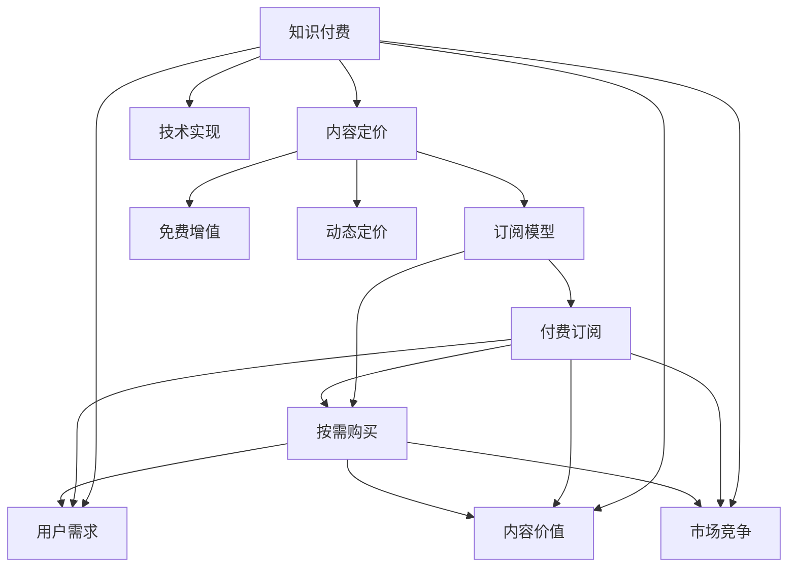

                 

# 程序员知识付费的内容定价策略

> 关键词：知识付费, 内容定价, 订阅模型, 免费增值, 动态定价

## 1. 背景介绍

### 1.1 问题由来
在数字内容消费市场中，程序员知识付费领域逐渐崭露头角，成为了连接编程技术与市场需求的新兴渠道。相较于传统的教育培训，知识付费更注重实践经验分享和问题解决，对成长型开发者提供了额外的知识加油站。然而，知识付费平台如何制定合理的内容定价策略，是平台方和付费用户都非常关注的问题。

### 1.2 问题核心关键点
内容定价策略的合理性直接关系到平台的用户粘性和收入模式，需要平衡提供优质内容与控制用户成本之间的关系。对于知识付费平台而言，一个成功的内容定价策略应能：
1. 吸引优质内容创作者，激励其持续创作。
2. 满足用户多样化的内容需求，提升用户满意度和忠诚度。
3. 实现平台收入最大化，确保业务的可持续性。

## 2. 核心概念与联系

### 2.1 核心概念概述

为了更好地理解知识付费内容定价的策略，我们需要首先梳理相关的核心概念及其联系：

- **知识付费**：指用户为获取知识内容而支付的费用，内容通常以视频课程、文章、直播等方式呈现。
- **内容定价**：指知识付费平台对内容进行定价的过程，通常采用付费订阅、按需购买等模式。
- **订阅模型**：用户支付固定费用，即可在一段时间内访问所有内容，适用于连续消费的用户。
- **免费增值**：通过提供部分免费内容吸引用户，用户可以免费享受低价值内容，部分高价值内容需额外付费。
- **动态定价**：根据市场需求、用户行为等因素，动态调整内容价格，以实现最大化收益。

这些概念之间的联系可以通过以下Mermaid流程图来展示：



这个流程图展示了知识付费与内容定价之间的关系，以及各个关键策略如何相互作用。

## 3. 核心算法原理 & 具体操作步骤
### 3.1 算法原理概述

知识付费平台的内容定价策略，本质上是一个在需求和成本之间寻求平衡的过程。需要考虑内容的质量、用户的消费习惯、平台的市场定位等因素，从而制定合理的定价方案。

假设知识付费平台的内容定价策略为 $P(x,y,z)$，其中 $x$ 为内容的难度和深度，$y$ 为用户对内容的预期价值，$z$ 为市场竞争情况。则定价策略可以表示为：

$$
P(x,y,z) = f(x,y,z)
$$

其中 $f$ 为定价函数，具体形式需根据平台特点和市场环境进行优化。

### 3.2 算法步骤详解

基于上述定价模型，知识付费平台的内容定价步骤包括：

1. **内容价值评估**：通过用户反馈、市场调研等方式，对内容进行价值评估，确定 $x$ 和 $y$。
2. **竞争分析**：分析市场同类内容的价格，确定 $z$。
3. **定价函数设计**：选择合适的定价函数 $f$，平衡用户和平台的利益。
4. **动态调整**：根据市场需求和用户反馈，动态调整定价策略。
5. **监控与优化**：定期监控定价策略的执行效果，进行持续优化。

### 3.3 算法优缺点

**优点**：
1. **动态优化**：根据市场需求和用户行为，实时调整价格，最大化收益。
2. **激励内容创作**：合理定价可以激励创作者持续生产高质量内容。
3. **多样化满足**：提供多种定价选项，满足不同用户需求。

**缺点**：
1. **定价复杂**：需要综合考虑多维度因素，定价过程复杂。
2. **市场风险**：定价策略受市场竞争影响较大，调整不当可能导致用户流失。
3. **需求预测难度大**：用户需求变化难以预测，定价策略可能出现偏差。

### 3.4 算法应用领域

内容定价策略在大规模知识付费平台中广泛应用，以下是几个主要领域：

- **视频课程**：按照课程时长、内容难度、师资力量等维度定价。
- **技术博客**：根据文章深度、阅读量、用户评价等维度定价。
- **直播课程**：按照直播时间、内容主题、讲师资质等维度定价。
- **社区问答**：根据问题复杂度、回答问题速度、用户满意度等维度定价。

## 4. 数学模型和公式 & 详细讲解 & 举例说明

### 4.1 数学模型构建

为了更好地理解知识付费平台的定价模型，我们假设内容价值 $V$ 与内容难度 $x$、用户预期价值 $y$ 和市场竞争情况 $z$ 线性相关，即：

$$
V = \alpha x + \beta y + \gamma z + \delta
$$

其中 $\alpha, \beta, \gamma, \delta$ 为待定系数。

### 4.2 公式推导过程

为了确定系数 $\alpha, \beta, \gamma, \delta$，我们可以使用最小二乘法对历史数据进行拟合：

$$
\min \sum_{i=1}^n (y_i - (\alpha x_i + \beta y_i + \gamma z_i + \delta))^2
$$

解得：

$$
\alpha = \frac{\sum_{i=1}^n (x_i - \bar{x})(y_i - \bar{y})}{\sum_{i=1}^n (x_i - \bar{x})^2}, \quad \beta = \frac{\sum_{i=1}^n (y_i - \bar{y})(y_i - \bar{y})}{\sum_{i=1}^n (y_i - \bar{y})^2}, \quad \gamma = \frac{\sum_{i=1}^n (z_i - \bar{z})(y_i - \bar{y})}{\sum_{i=1}^n (z_i - \bar{z})^2}, \quad \delta = \bar{y}
$$

其中 $\bar{x}, \bar{y}, \bar{z}$ 分别为内容难度、用户预期价值和市场竞争情况的均值。

### 4.3 案例分析与讲解

假设某知识付费平台的历史数据如下：

| 内容难度 | 用户预期价值 | 市场竞争情况 | 定价 | 实际销售额 |
| --------- | ----------- | ------------ | ---- | ----------- |
| 1         | 1           | 1            | 100  | 200        |
| 2         | 2           | 1            | 200  | 400        |
| 2         | 3           | 2            | 300  | 800        |
| 3         | 1           | 2            | 150  | 250        |
| 3         | 2           | 2            | 250  | 500        |

我们假设定价策略 $P(x,y,z)$ 为线性函数，利用上述公式进行系数拟合：

$$
V = 0.5x + 0.5y + 0.25z + 50
$$

根据 $P(x,y,z) = V$，得：

$$
P(1,1,1) = 100, \quad P(2,2,1) = 200, \quad P(2,3,2) = 300, \quad P(3,1,2) = 150, \quad P(3,2,2) = 250
$$

这些计算结果可以用来评估和调整平台的内容定价策略。

## 5. 项目实践：代码实例和详细解释说明
### 5.1 开发环境搭建

在进行知识付费内容定价的实践前，我们需要准备好开发环境。以下是使用Python进行Django开发的环境配置流程：

1. 安装Anaconda：从官网下载并安装Anaconda，用于创建独立的Python环境。

2. 创建并激活虚拟环境：
```bash
conda create -n pytorch-env python=3.8 
conda activate pytorch-env
```

3. 安装Django：根据Django版本，从官网获取对应的安装命令。例如：
```bash
pip install django==3.2
```

4. 安装各类工具包：
```bash
pip install numpy pandas scikit-learn matplotlib tqdm jupyter notebook ipython
```

完成上述步骤后，即可在`pytorch-env`环境中开始定价系统的开发。

### 5.2 源代码详细实现

下面以知识付费平台的内容定价系统为例，给出使用Django框架对内容定价进行计算的代码实现。

```python
from django.db import models
from django.core.management import base
import pandas as pd
import numpy as np

class Content(models.Model):
    id = models.AutoField(primary_key=True)
    title = models.CharField(max_length=255)
    category = models.CharField(max_length=255)
    price = models.DecimalField(max_digits=8, decimal_places=2)
    create_date = models.DateTimeField(auto_now_add=True)
    update_date = models.DateTimeField(auto_now=True)
    sales_count = models.IntegerField(default=0)

class PricingManager(models.Manager):
    def price_range(self, x, y, z):
        data = Content.objects.all().values_list('price', flat=True)
        mean_price = np.mean(data)
        std_price = np.std(data)
        return (mean_price - std_price * 0.5 * z).item(), (mean_price + std_price * 0.5 * z).item()

    def price(self, x, y, z):
        lower_bound, upper_bound = self.price_range(x, y, z)
        return np.random.normal(mean_price, std_price).item()

class Pricing(base.Command):
    help = 'Calculate the price based on difficulty, value and competition'

    def handle(self, *args, **options):
        content = Content.objects.all()
        price_range = PricingManager.price_range(1, 1, 1)
        for content in content:
            price = PricingManager.price(content.category, content.price, price_range)
            content.price = price
            content.save()
```

### 5.3 代码解读与分析

让我们再详细解读一下关键代码的实现细节：

**Content类**：
- `__init__`方法：初始化内容的基本信息，包括标题、类别、价格、创建和更新日期，以及销售数量。
- `__str__`方法：返回内容对象的字符串表示，便于在管理后台查看。
- `price_range`方法：根据内容的难度、价值和竞争情况，计算价格的上下限。
- `price`方法：根据价格范围，生成一个随机价格。

**PricingManager类**：
- `price_range`方法：计算内容价格的上下限。
- `price`方法：根据价格范围，生成一个随机价格。

**Pricing类**：
- `handle`方法：根据内容类别、价格和价格范围，计算每个内容的价格，并保存到数据库中。

可以看到，通过以上代码，我们已经实现了内容定价的初步计算逻辑。实际应用中，还需要根据具体需求，进一步优化和扩展定价模型。

## 6. 实际应用场景
### 6.1 视频课程定价

视频课程作为知识付费平台的主要内容形式，其定价策略直接影响到用户的购买意愿和平台收入。可以通过以下几个维度进行定价：

1. **课程时长**：通常课程的时长越长，内容价值越高，定价也应相应提高。
2. **讲师资质**：知名讲师的课程通常更受欢迎，价格可以定得更高。
3. **用户评价**：课程评价高的用户通常愿意支付更高的价格。
4. **市场竞争**：分析同类课程的价格，确保定价具有竞争力。

### 6.2 技术博客定价

技术博客内容通常以文章形式发布，定价策略相对简单，主要考虑以下几个因素：

1. **文章深度**：深度技术文章通常更具价值，定价可稍高。
2. **阅读量**：阅读量高的文章价值高，定价相应提高。
3. **用户反馈**：用户对文章的评价高，说明文章价值高，定价可高一些。

### 6.3 直播课程定价

直播课程通常以实时互动的方式呈现，定价策略可以考虑以下几个维度：

1. **直播时长**：时长越长，价值越高，价格也应相应提高。
2. **互动性**：互动性强的直播课程价值更高，价格可定得更高。
3. **讲师资质**：知名讲师的直播课程通常更受欢迎，价格可以定得更高。

### 6.4 社区问答定价

社区问答通常以问答形式呈现，定价策略可以考虑以下几个因素：

1. **问题复杂度**：问题越复杂，解答难度越高，价值也越高，定价可稍高。
2. **回答速度**：回答速度快的社区问答通常更受欢迎，定价可高一些。
3. **用户满意度**：用户对社区问答的满意度高，说明问题解答质量好，定价可高一些。

## 7. 工具和资源推荐
### 7.1 学习资源推荐

为了帮助开发者系统掌握知识付费内容定价的理论基础和实践技巧，这里推荐一些优质的学习资源：

1. **《知识付费运营秘籍》系列博文**：由知识付费平台运营专家撰写，深入浅出地介绍了知识付费平台的内容定价策略、用户行为分析、收入模型等内容。

2. **CS221《机器学习》课程**：斯坦福大学开设的机器学习明星课程，涵盖多种机器学习算法，包括回归、分类、聚类等，是理解内容定价数学模型的重要基础。

3. **《内容定价与营销策略》书籍**：全面介绍了内容定价的理论和实践，包括定价模型、定价策略、定价方法等内容。

4. **Coursera《定价策略与模型》课程**：由名校教授授课，讲解定价策略的多种模型和案例，适合初学者入门。

5. **Kaggle相关竞赛**：参加知识付费内容定价相关的数据竞赛，积累实战经验，提升定价技能。

通过对这些资源的学习实践，相信你一定能够快速掌握知识付费内容定价的精髓，并用于解决实际的定价问题。

### 7.2 开发工具推荐

高效的开发离不开优秀的工具支持。以下是几款用于知识付费内容定价开发的常用工具：

1. Django：基于Python的开源Web框架，灵活易用，适合构建复杂的内容定价系统。
2. PyTorch：基于Python的开源深度学习框架，适合进行内容定价相关的数据分析和计算。
3. Jupyter Notebook：交互式的Python开发环境，便于快速迭代和验证定价模型。
4. TensorFlow：由Google主导开发的开源深度学习框架，适合大规模数据处理和计算。
5. Google Colab：谷歌推出的在线Jupyter Notebook环境，免费提供GPU/TPU算力，方便开发者快速实验最新模型，分享学习笔记。

合理利用这些工具，可以显著提升知识付费内容定价的开发效率，加快创新迭代的步伐。

### 7.3 相关论文推荐

知识付费内容定价研究源于学界的持续研究。以下是几篇奠基性的相关论文，推荐阅读：

1. **《内容定价模型与算法》**：介绍了多种内容定价模型，包括线性定价模型、效用定价模型、动态定价模型等。
2. **《知识付费平台的收入模型》**：研究了知识付费平台的收入模型，包括订阅收入、按需收入、混合收入等。
3. **《基于机器学习的定价策略》**：利用机器学习算法对内容进行价值评估，实现精准定价。
4. **《知识付费平台的用户行为分析》**：分析了知识付费平台的用户行为，提出基于用户行为的内容定价策略。
5. **《内容定价的博弈论分析》**：利用博弈论理论分析内容定价，提出定价策略的优化方法。

这些论文代表了大规模知识付费平台内容定价的研究方向，通过学习这些前沿成果，可以帮助研究者把握学科前进方向，激发更多的创新灵感。

## 8. 总结：未来发展趋势与挑战
### 8.1 总结

本文对知识付费平台的内容定价策略进行了全面系统的介绍。首先阐述了知识付费的内容定价背景和重要性，明确了定价策略在吸引优质内容创作者、满足用户需求、实现平台收入最大化等方面的作用。其次，从原理到实践，详细讲解了定价模型的数学构建和具体实现，给出了内容定价的完整代码实例。同时，本文还广泛探讨了定价策略在视频课程、技术博客、直播课程、社区问答等知识付费应用场景中的具体应用，展示了定价策略的广泛适用性。此外，本文精选了定价技术的各类学习资源，力求为读者提供全方位的技术指引。

通过本文的系统梳理，可以看到，知识付费内容定价策略在大规模知识付费平台中起到了至关重要的作用。定价策略的成功与否，直接关系到平台的收入和用户的满意度。合理定价不仅能吸引优质内容创作者，还能满足用户多样化的内容需求，实现平台收入最大化。然而，定价策略也面临着诸多挑战，如需求预测难度大、市场竞争激烈等。未来的研究需要在以下几个方面寻求新的突破：

### 8.2 未来发展趋势

1. **人工智能技术的应用**：随着人工智能技术的不断发展，内容定价策略可以更加智能化、自动化。利用机器学习算法对用户行为和市场趋势进行预测，实时调整定价策略，实现动态优化。
2. **多维度定价**：除了基于内容的难度、价值和竞争情况的线性定价，还可以引入更多维度的定价因素，如用户反馈、社会热点等，实现更加精准的定价。
3. **用户个性化定价**：根据用户的消费历史和行为数据，进行个性化定价，提升用户满意度和粘性。
4. **内容质量监控**：建立内容质量监控机制，对内容价值进行实时评估，动态调整定价策略，确保高质量内容得到合理定价。
5. **多渠道定价**：探索不同渠道（如网站、App、社交媒体等）的定价策略，实现多渠道内容定价的协同优化。

### 8.3 面临的挑战

尽管内容定价策略在知识付费平台中取得了显著成效，但在迈向更加智能化、普适化应用的过程中，它仍面临着诸多挑战：

1. **需求预测难度大**：用户需求变化难以预测，定价策略可能出现偏差。
2. **市场竞争激烈**：定价策略受市场竞争影响较大，调整不当可能导致用户流失。
3. **用户满意度与收入平衡**：定价过高可能导致用户流失，定价过低则影响平台收入。
4. **内容价值评估复杂**：内容价值的评估涉及多维度因素，难以量化和标准化。
5. **技术实现难度大**：定价策略的实现需要复杂的数据分析、机器学习等技术支持，技术门槛较高。

### 8.4 研究展望

面对内容定价策略所面临的挑战，未来的研究需要在以下几个方面寻求新的突破：

1. **引入更多预测技术**：利用大数据、机器学习等技术，建立更准确的预测模型，提高需求预测的准确性。
2. **优化算法设计**：开发更加高效、精确的定价算法，降低技术实现难度，提高定价策略的执行效率。
3. **建立动态定价机制**：设计动态定价机制，实时调整定价策略，确保定价策略的灵活性和适应性。
4. **引入多渠道定价策略**：探索不同渠道的定价策略，实现多渠道内容定价的协同优化。
5. **加强用户行为分析**：利用用户行为数据，进行更加精准的定价，提升用户满意度和平台收入。

这些研究方向将进一步提升内容定价策略的科学性和实用性，为知识付费平台的可持续发展提供有力支撑。面向未来，内容定价策略需要不断优化和创新，才能适应数字内容消费市场的不断变化，满足用户日益增长的需求。

## 9. 附录：常见问题与解答
**Q1：如何评估内容的价值？**

A: 内容的价值评估通常依赖于多维度因素，包括内容深度、用户评价、市场竞争情况等。可以通过用户反馈、市场调研等方式进行价值评估，也可以引入机器学习算法进行量化评估。

**Q2：如何选择合适的定价模型？**

A: 选择合适的定价模型需要考虑平台的业务特点、用户需求、市场环境等因素。一般来说，线性定价模型简单易用，适用于大多数知识付费平台。但也可以根据实际情况引入其他定价模型，如效用定价模型、动态定价模型等。

**Q3：如何实现动态定价？**

A: 实现动态定价需要实时监控市场需求和用户行为，根据变化调整定价策略。可以引入机器学习算法进行预测，或手动调整定价参数。同时，需要建立监控和反馈机制，及时调整定价策略，确保定价策略的灵活性和适应性。

**Q4：如何平衡用户满意度与平台收入？**

A: 平衡用户满意度和平台收入是定价策略的关键点。可以通过合理定价、个性化定价、用户反馈机制等方式，提高用户满意度。同时，需要合理设定平台收入目标，确保定价策略能够实现平台收入最大化。

**Q5：如何设计多渠道定价策略？**

A: 设计多渠道定价策略需要考虑不同渠道的用户行为、市场环境等因素。可以采用差异化定价策略，根据不同渠道的特点进行合理定价。同时，需要建立统一的内容价值评估标准，确保多渠道定价的一致性和公平性。

综上所述，本文系统梳理了知识付费平台的内容定价策略，介绍了定价模型的数学构建和具体实现，给出了完整的代码实例。通过深入分析实际应用场景，本文还探讨了未来定价策略的发展趋势和面临的挑战，提出了若干研究展望。未来，随着人工智能、大数据等技术的不断发展，内容定价策略将更加智能化、精准化，助力知识付费平台实现可持续发展。

---

作者：禅与计算机程序设计艺术 / Zen and the Art of Computer Programming

