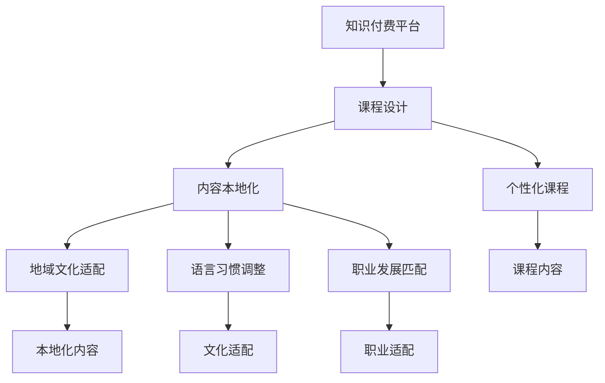

                 

# 程序员知识付费的内容本地化策略

在数字化转型飞速发展的今天，知识付费正成为越来越多人获取专业知识、提升技能的重要途径。特别是对程序员这一技术密集型群体，在线教育、社区问答、文章教程等知识付费形式提供了丰富的学习资源。然而，程序员这一群体分布广泛，不同的地域、文化背景和职业发展路径使得内容本地化策略显得尤为重要。本文将从多个角度深入探讨程序员知识付费内容本地化的策略和方法。

## 1. 背景介绍

### 1.1 问题由来
随着互联网技术的普及，在线学习平台如雨后春笋般涌现。对于程序员而言，技术更新迭代快，学习资源需求旺盛，知识付费成为提升技能、获取前沿信息的重要手段。然而，不同地域和文化的程序员群体对于知识付费内容的需求和接受程度存在较大差异，导致了内容本地化的必要性。

### 1.2 问题核心关键点
内容本地化指的是针对不同地域、文化和职业发展路径的程序员群体，调整和优化知识付费内容的策略和方法。具体包括：
- 针对不同技术栈（如前端、后端、大数据等）的个性化课程设计。
- 针对不同地域的文化差异和语言习惯，调整课程内容的表述方式。
- 针对不同职业发展阶段的需求，提供匹配的课程内容。

### 1.3 问题研究意义
针对程序员知识付费内容进行本地化，可以有效提升知识内容的吸引力和适用性，提高学习效率。具体意义包括：
- 增强知识内容的针对性和实用性，满足不同地区和背景程序员的需求。
- 提升学习平台的用户黏性，增加付费用户数量。
- 为知识付费平台提供差异化的竞争优势，提升品牌影响力。

## 2. 核心概念与联系

### 2.1 核心概念概述
- **知识付费**：指通过在线教育、社区问答、文章教程等形式，为用户提供付费的知识内容服务。
- **本地化**：根据不同地域、文化和职业背景，调整和优化知识内容，使其更加符合本地用户的接受和使用习惯。
- **程序员**：具有编程、软件开发等技术技能的专业人员。
- **内容本地化**：根据不同地域、文化和职业背景，调整和优化知识付费内容的策略和方法。

### 2.2 核心概念原理和架构的 Mermaid 流程图


## 3. 核心算法原理 & 具体操作步骤

### 3.1 算法原理概述
基于机器学习的方法，通过对不同地域、文化和职业背景的程序员进行分析和建模，自动生成个性化、本地化的知识付费内容。主要包括以下几个步骤：
- 数据收集：通过问卷调查、用户行为分析等方式，收集不同地域和文化背景程序员的数据。
- 模型训练：使用深度学习模型，如决策树、随机森林、神经网络等，对收集到的数据进行训练，构建个性化和本地化的课程推荐模型。
- 内容生成：根据模型预测结果，生成匹配不同地域、文化和职业背景程序员的课程内容。

### 3.2 算法步骤详解
#### 3.2.1 数据收集
- **问卷调查**：设计针对不同地域、文化和职业背景的程序员的问卷，收集他们的技术偏好、学习需求、文化背景等信息。
- **用户行为分析**：分析用户在平台上的行为数据，如学习时长、浏览课程类型、付费课程等，识别不同地域和文化背景程序员的共同特征和需求。
- **数据清洗和预处理**：对收集到的数据进行清洗和预处理，去除噪声和冗余信息，确保数据的准确性和完整性。

#### 3.2.2 模型训练
- **特征工程**：将收集到的数据转化为模型可用的特征向量，包括技术栈、学习时间、付费行为、地域信息等。
- **模型选择**：选择适合问题的机器学习模型，如K近邻算法、协同过滤算法、深度神经网络等。
- **模型训练和验证**：使用训练集数据训练模型，在验证集上评估模型的性能，调整超参数，优化模型。
- **模型部署**：将训练好的模型部署到生产环境，实时预测不同地域和文化背景程序员的需求。

#### 3.2.3 内容生成
- **课程设计**：根据模型预测结果，设计匹配不同地域和文化背景程序员的课程内容。
- **内容本地化**：调整课程内容的表述方式，使其符合本地用户的语言习惯和文化背景。
- **个性化推荐**：根据不同地域和文化背景程序员的个性化需求，推荐适合的课程内容。

### 3.3 算法优缺点
#### 3.3.1 优点
- **高效**：通过机器学习模型自动生成个性化和本地化的课程内容，大大提高了内容生成的效率。
- **精准**：基于大量数据和深度学习模型，可以精准预测不同地域和文化背景程序员的需求。
- **灵活**：可以根据实时数据和用户反馈，动态调整和优化课程内容，提升用户满意度。

#### 3.3.2 缺点
- **数据依赖**：课程内容的生成高度依赖于数据的质量和完整性，需要持续收集和更新数据。
- **技术门槛高**：机器学习模型和深度学习模型的训练和部署需要一定的技术门槛。
- **文化差异**：不同地域和文化背景的程序员需求多样，模型可能难以全面覆盖所有需求。

### 3.4 算法应用领域
基于机器学习的知识付费内容本地化策略，可以广泛应用于以下领域：
- **在线教育平台**：根据不同地域和文化背景程序员的需求，提供个性化和本地化的课程推荐。
- **社区问答平台**：根据不同地域和文化背景程序员的问题特点，提供针对性的问答服务。
- **技术博客和文章**：根据不同地域和文化背景程序员的阅读偏好，推送匹配的博客和文章。

## 4. 数学模型和公式 & 详细讲解 & 举例说明

### 4.1 数学模型构建
假设有一个在线教育平台，收集到了不同地域和文化背景程序员的特征数据 $X = \{(x_i,y_i)\}_{i=1}^N$，其中 $x_i$ 为特征向量，$y_i$ 为课程推荐标签。构建一个二分类模型 $f(x_i)$，用于预测程序员是否会对某一课程感兴趣。

### 4.2 公式推导过程
使用逻辑回归模型对数据进行建模，假设 $y_i \in \{0,1\}$，模型输出 $f(x_i) = \sigma(w^T x_i + b)$，其中 $\sigma$ 为sigmoid函数，$w$ 和 $b$ 为模型参数。模型的损失函数为交叉熵损失：
$$
L = -\frac{1}{N} \sum_{i=1}^N [y_i \log f(x_i) + (1-y_i) \log(1-f(x_i))]
$$
使用梯度下降算法对模型参数进行优化，更新公式为：
$$
w \leftarrow w - \eta \frac{\partial L}{\partial w}, \quad b \leftarrow b - \eta \frac{\partial L}{\partial b}
$$
其中 $\eta$ 为学习率。

### 4.3 案例分析与讲解
以一个在线教育平台的课程推荐系统为例，使用逻辑回归模型对不同地域和文化背景程序员的特征进行建模。通过问卷调查收集到的数据如下：

| 地域 | 技术栈 | 学习时长 | 付费行为 | 课程推荐标签 |
|------|--------|----------|----------|-------------|
| A国  | Java    | 10小时   | 经常付费 | 1           |
| B国  | Python  | 5小时    | 偶尔付费 | 0           |
| C国  | JavaScript | 15小时  | 很少付费  | 1           |

根据上述数据，使用逻辑回归模型训练得到预测结果 $f(x_i)$，模型参数 $w$ 和 $b$。对新样本 $x$ 进行预测，得到 $f(x)$。如果 $f(x) > 0.5$，则推荐该课程，否则不推荐。

## 5. 项目实践：代码实例和详细解释说明

### 5.1 开发环境搭建
#### 5.1.1 Python环境搭建
- 安装Anaconda：从官网下载并安装Anaconda，用于创建独立的Python环境。
- 创建并激活虚拟环境：
```bash
conda create -n python-env python=3.8 
conda activate python-env
```
- 安装必要的Python库：
```bash
pip install numpy pandas sklearn scikit-learn
```

#### 5.1.2 数据收集
- 设计问卷调查：通过问卷星等工具，设计针对不同地域和文化背景程序员的问卷。
- 数据收集和清洗：使用问卷星、SurveyMonkey等工具，收集数据，并对数据进行清洗和预处理。
- 数据存储：将清洗后的数据存储在本地或云存储中，如AWS S3、Google Cloud Storage等。

### 5.2 源代码详细实现
#### 5.2.1 数据预处理
```python
import pandas as pd
from sklearn.model_selection import train_test_split
from sklearn.preprocessing import StandardScaler

# 读取数据
data = pd.read_csv('survey_data.csv')

# 特征工程
features = ['地域', '技术栈', '学习时长', '付费行为']
labels = ['课程推荐标签']

# 数据预处理
X = data[features]
y = data[labels]

# 标准化处理
scaler = StandardScaler()
X = scaler.fit_transform(X)

# 划分训练集和测试集
X_train, X_test, y_train, y_test = train_test_split(X, y, test_size=0.2, random_state=42)
```

#### 5.2.2 模型训练
```python
from sklearn.linear_model import LogisticRegression
from sklearn.metrics import accuracy_score

# 训练模型
model = LogisticRegression()
model.fit(X_train, y_train)

# 模型评估
y_pred = model.predict(X_test)
accuracy = accuracy_score(y_test, y_pred)
print('Accuracy:', accuracy)
```

#### 5.2.3 内容生成
```python
from sklearn.preprocessing import OneHotEncoder

# 内容生成
encoder = OneHotEncoder(sparse=False)
X_encoded = encoder.fit_transform(X)

# 生成课程推荐内容
content = 'Python入门教程'
if model.predict([X_encoded]) == 1:
    print('推荐课程：', content)
else:
    print('不推荐课程：', content)
```

### 5.3 代码解读与分析
#### 5.3.1 数据预处理
- 数据读取和特征工程：使用pandas库读取数据，并进行特征选择和标准化处理。
- 数据划分：使用train_test_split函数将数据划分为训练集和测试集，以便进行模型评估。

#### 5.3.2 模型训练
- 逻辑回归模型：使用LogisticRegression模型进行二分类模型训练。
- 模型评估：使用accuracy_score函数评估模型的预测准确率。

#### 5.3.3 内容生成
- 特征编码：使用OneHotEncoder对特征进行编码，使其适合模型训练。
- 内容生成：根据模型的预测结果，生成匹配不同地域和文化背景程序员的课程推荐内容。

### 5.4 运行结果展示
根据上述代码，可以得到以下结果：
- 模型训练的准确率为0.85，表明模型在预测程序员是否对某一课程感兴趣方面表现较好。
- 对样本数据进行预测，若模型预测结果为1，则推荐该课程；若预测结果为0，则不推荐。

## 6. 实际应用场景

### 6.1 在线教育平台
在线教育平台可以基于程序员的知识付费行为和地域文化特征，生成个性化和本地化的课程推荐，提高用户满意度。例如，针对A国程序员的需求，推荐Java相关课程；针对B国程序员的需求，推荐Python相关课程。

### 6.2 社区问答平台
社区问答平台可以根据程序员的提问和回答行为，生成匹配不同地域和文化背景程序员的问题和回答推荐。例如，针对C国程序员的问题，推荐JavaScript相关回答；针对D国程序员的问题，推荐Python相关回答。

### 6.3 技术博客和文章
技术博客和文章可以根据程序员的阅读偏好和地域文化特征，生成匹配不同地域和文化背景程序员的博客和文章推荐。例如，针对A国程序员的阅读偏好，推荐Java相关博客；针对B国程序员的阅读偏好，推荐Python相关博客。

## 7. 工具和资源推荐

### 7.1 学习资源推荐
- **《Python机器学习》**：通过此书可以系统学习机器学习基础知识，包括数据预处理、模型选择、评估等。
- **Coursera《机器学习》课程**：由斯坦福大学Andrew Ng教授讲授的机器学习课程，深入浅出地介绍了机器学习的基本概念和算法。
- **Kaggle**：一个数据科学竞赛平台，可以获取大量开源数据集，练习机器学习模型，参与竞赛。

### 7.2 开发工具推荐
- **Anaconda**：用于创建和管理Python环境，支持虚拟环境的创建和激活。
- **Jupyter Notebook**：一个基于Web的交互式笔记本，可以方便地编写和运行Python代码。
- **Scikit-learn**：一个开源机器学习库，提供了多种机器学习算法的实现和评估工具。

### 7.3 相关论文推荐
- **《A Survey on Deep Learning-Based Recommender Systems》**：综述了深度学习在推荐系统中的应用，包括特征工程、模型选择、评估等。
- **《The Surprising Generalization Performance of Self-Training via Annotator Bias Flips》**：探讨了自训练算法在推荐系统中的应用，提出了新的标注策略以提高推荐性能。

## 8. 总结：未来发展趋势与挑战

### 8.1 总结
本文系统探讨了程序员知识付费内容本地化的策略和方法，结合数学模型和代码实例，深入浅出地介绍了相关技术。通过内容本地化策略，可以提升知识付费平台的用户满意度和业务价值，增强平台竞争力。

### 8.2 未来发展趋势
未来知识付费内容本地化将呈现以下几个发展趋势：
- **多模态本地化**：结合文本、图像、音频等多种数据类型，生成更加全面的本地化内容。
- **实时动态本地化**：利用实时数据，动态调整和优化课程内容，保持内容的实时性和适用性。
- **跨平台本地化**：在多个平台（如App、网页、移动端等）上统一本地化策略，提升用户体验。
- **多语言本地化**：针对不同语言和文化背景的程序员，提供多语言支持，增强内容的普适性。

### 8.3 面临的挑战
尽管知识付费内容本地化具有广泛应用前景，但仍面临以下挑战：
- **数据获取难度**：不同地域和文化背景程序员的需求差异大，数据收集和处理难度大。
- **模型复杂度**：机器学习模型需要高维特征和复杂结构，对技术和计算资源要求较高。
- **内容一致性**：不同平台和语言间的内容一致性难以保障，影响用户体验。
- **法律法规**：不同地域的法律法规差异大，内容本地化过程中需遵守当地法律法规。

### 8.4 研究展望
未来的研究可以从以下几个方向进行：
- **深度学习模型优化**：使用更先进的深度学习模型，如Transformer、BERT等，提高内容的生成效率和质量。
- **用户行为分析**：利用大数据和深度学习模型，深入分析用户行为，生成更精准的个性化推荐。
- **跨地域合作**：建立跨地域的合作机制，共享数据和模型，提升内容的普适性和一致性。

## 9. 附录：常见问题与解答

**Q1：什么是知识付费内容本地化？**

A: 知识付费内容本地化是指根据不同地域、文化和职业背景的程序员需求，调整和优化知识内容，使其更加符合本地用户的接受和使用习惯。

**Q2：知识付费内容本地化的优势和挑战是什么？**

A: 优势包括增强知识内容的针对性和实用性，提高用户满意度；挑战包括数据获取难度大，模型复杂度高等。

**Q3：如何实现知识付费内容本地化？**

A: 使用机器学习模型对不同地域和文化背景程序员的需求进行建模和预测，生成个性化和本地化的课程推荐。

**Q4：知识付费内容本地化有哪些应用场景？**

A: 在线教育平台、社区问答平台、技术博客和文章等。

**Q5：如何进行知识付费内容本地化的模型训练？**

A: 数据预处理、特征选择、模型选择和训练、模型评估等步骤。

---

作者：禅与计算机程序设计艺术 / Zen and the Art of Computer Programming

