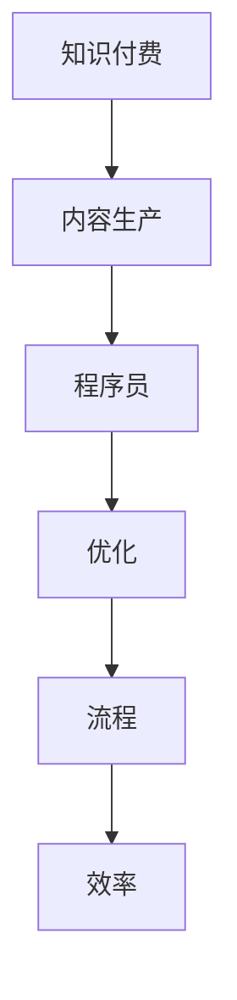

                 

# 程序员知识付费的内容生产流程优化

> 关键词：知识付费,内容生产,程序员,优化,流程,效率

## 1. 背景介绍

随着互联网和信息技术的快速发展，知识付费作为一种新兴的商业模式，逐步成为越来越多用户获取知识的重要方式。特别是在软件开发、人工智能、区块链等技术领域，程序员知识付费的需求和市场更是持续火爆。然而，面对不断增长的用户需求和市场竞争，知识付费内容提供商面临着如何在有限的时间和资源条件下，高效地生产高质量、高价值的内容，以满足用户需求，保持市场竞争力的挑战。本文旨在介绍和优化程序员知识付费的内容生产流程，以期提升内容生产的效率和质量。

## 2. 核心概念与联系

### 2.1 核心概念概述

本文将介绍与程序员知识付费内容生产相关的几个核心概念：

- **知识付费**：基于知识生产的价值化，通过付费机制为知识提供者与用户搭建起价值交换的桥梁。
- **内容生产**：知识付费的核心环节，即通过制作并传播知识内容满足用户需求。
- **程序员**：作为知识付费的重要人群，其知识需求和技能提升需求对内容生产有着重要影响。
- **优化**：在有限的资源条件下，通过科学的管理和流程设计，提升内容生产的效率和质量。
- **流程**：内容生产过程中的各个步骤和环节，如何设计合理的流程对效率和质量至关重要。
- **效率**：在有限的时间内，最大化内容生产的数量和质量。

这些概念之间的逻辑关系可以通过以下Mermaid流程图来展示：



这个流程图展示了知识付费与内容生产的关系，程序员作为核心用户群体，需要通过优化的流程和提升的效率来满足内容生产的要求。

## 3. 核心算法原理 & 具体操作步骤

### 3.1 算法原理概述

程序员知识付费的内容生产流程优化，本质上是一个关于资源分配、任务调度、质量控制的问题。其核心目标是：在有限的时间、人力和物质资源条件下，最大化内容生产的效率和质量。

在实际的生产过程中，我们可以将内容生产流程分为以下几个阶段：选题策划、内容制作、审核发布、反馈优化。每个阶段都需要资源投入，包括时间、人力、资金等。通过科学的算法和流程设计，可以在满足内容质量的前提下，最大化内容的产出效率。

### 3.2 算法步骤详解

#### 3.2.1 选题策划

选题策划是内容生产的第一步，直接影响后续内容的生产效率和质量。在这个阶段，我们需要根据市场需求和用户反馈，结合自身资源和优势，制定内容生产的计划。具体的算法步骤如下：

1. **需求分析**：通过用户调研、市场分析、数据分析等手段，了解用户的需求和偏好。
2. **竞争分析**：分析竞争对手的内容生产情况，找出差异化的内容生产方向。
3. **资源评估**：评估自身的资源情况，包括人力、时间、资金等，制定合理的内容生产计划。
4. **选题确定**：根据需求和资源评估，确定内容生产的选题方向，制定详细的内容生产计划。

#### 3.2.2 内容制作

内容制作是内容生产的核心环节，涉及内容创意、素材搜集、写作、设计等。在这个阶段，我们需要通过科学的调度和管理，提升内容生产的效率。具体的算法步骤如下：

1. **内容创意**：根据选题计划，设计内容的具体结构和形式。
2. **素材搜集**：根据内容创意，搜集相关素材和参考资料。
3. **写作和设计**：分配任务，安排写作和设计，确保内容的高质量和时效性。
4. **版本管理**：使用版本控制工具，对内容进行版本管理，确保内容的不断优化和迭代。

#### 3.2.3 审核发布

审核发布是内容生产的最后一步，确保内容质量和合规性。具体的算法步骤如下：

1. **内容审核**：由编辑或专家对内容进行审核，确保内容的准确性和完整性。
2. **发布优化**：对审核后的内容进行优化，包括格式调整、校对、排版等。
3. **发布发布**：在平台上发布内容，确保内容的可见性和传播效果。

#### 3.2.4 反馈优化

反馈优化是内容生产的重要环节，通过用户反馈和数据分析，不断提升内容质量和用户满意度。具体的算法步骤如下：

1. **用户反馈收集**：通过问卷调查、评论、评分等方式，收集用户对内容的反馈。
2. **数据分析**：对收集到的反馈进行分析，找出内容生产和用户需求之间的差距。
3. **优化调整**：根据反馈和数据分析结果，对内容生产计划进行调整和优化。

### 3.3 算法优缺点

程序员知识付费的内容生产流程优化，具有以下优点：

1. **提高生产效率**：通过科学的管理和流程设计，最大化内容生产的数量和质量。
2. **提升内容质量**：通过科学的选题策划和内容审核，确保内容的高质量和用户满意度。
3. **增强市场竞争力**：通过差异化内容和高质量的优化，增强内容提供商的市场竞争力。

同时，该方法也存在一些局限性：

1. **对资源的依赖**：内容生产过程中，对时间、人力、资金等资源的依赖较大，资源分配不合理会影响效率。
2. **过程复杂**：内容生产流程涉及多个环节，管理复杂，容易产生瓶颈。
3. **质量控制难度**：内容质量的控制在一定程度上依赖于编辑的素质和经验，难以完全自动化。
4. **用户需求多样**：程序员的需求和兴趣点变化较快，难以完全覆盖。

尽管存在这些局限性，但通过科学的流程设计和资源优化，可以有效提升程序员知识付费内容生产的效率和质量，满足用户需求，保持市场竞争力。

### 3.4 算法应用领域

程序员知识付费的内容生产流程优化，在以下领域有着广泛的应用：

1. **软件开发培训**：通过优化内容生产流程，制作高质量的开发教程、实战案例等，满足程序员的技能提升需求。
2. **人工智能与机器学习**：制作AI相关的技术文章、课程、项目案例，满足AI领域的程序员需求。
3. **区块链与加密货币**：制作区块链相关的技术文章、开发指南、应用案例，满足区块链领域的程序员需求。
4. **前端与后端开发**：制作前端和后端开发相关的技术文章、框架指南、实战项目，满足相关领域的程序员需求。
5. **数据科学与大数据**：制作数据科学和大数据相关的技术文章、实战案例、工具指南，满足数据领域的程序员需求。

## 4. 数学模型和公式 & 详细讲解 & 举例说明

### 4.1 数学模型构建

在程序员知识付费内容生产流程优化中，可以建立一个数学模型，用于描述内容生产的各个环节和资源分配问题。模型中包括以下变量：

- **T**：选题策划时间。
- **C**：内容制作时间。
- **A**：内容审核时间。
- **P**：发布优化时间。
- **F**：反馈优化时间。
- **R**：资源总投入（时间、人力、资金等）。
- **Q**：内容质量（通过用户评分等指标衡量）。

模型的目标是在满足资源总投入的情况下，最大化内容生产的质量和数量。

### 4.2 公式推导过程

设选题策划、内容制作、审核发布、反馈优化的投入分别为 $T_i, C_i, A_i, P_i$，对应的资源投入比例分别为 $\alpha_i$，则优化目标为：

$$
\max Q = \sum_{i=1}^{n} Q_i \alpha_i
$$

约束条件为：

$$
\sum_{i=1}^{n} (\alpha_i \cdot T_i) + \sum_{i=1}^{n} (\alpha_i \cdot C_i) + \sum_{i=1}^{n} (\alpha_i \cdot A_i) + \sum_{i=1}^{n} (\alpha_i \cdot P_i) = R
$$

其中 $Q_i$ 为选题策划、内容制作、审核发布、反馈优化的质量指标。

### 4.3 案例分析与讲解

假设某个内容提供商需要在一个月内完成10个主题的课程制作和发布，其中选题策划、内容制作、审核发布、反馈优化分别占总时间的20%、40%、10%、10%。资源总投入为100个工时（人力+时间）。

根据上述模型和约束条件，我们可以计算出每个环节的资源分配比例：

- 选题策划：$\alpha_1 \cdot T_1 = 0.2 \cdot R$
- 内容制作：$\alpha_2 \cdot C_2 = 0.4 \cdot R$
- 审核发布：$\alpha_3 \cdot A_3 = 0.1 \cdot R$
- 反馈优化：$\alpha_4 \cdot P_4 = 0.1 \cdot R$

通过求解上述线性规划问题，我们可以找到最优的资源分配比例，使得内容生产的质量最大化。

## 5. 项目实践：代码实例和详细解释说明

### 5.1 开发环境搭建

在进行内容生产流程优化实践前，我们需要准备好开发环境。以下是使用Python进行Scikit-learn开发的环境配置流程：

1. 安装Anaconda：从官网下载并安装Anaconda，用于创建独立的Python环境。
2. 创建并激活虚拟环境：
```bash
conda create -n pytorch-env python=3.8 
conda activate pytorch-env
```
3. 安装PyTorch：根据CUDA版本，从官网获取对应的安装命令。例如：
```bash
conda install pytorch torchvision torchaudio cudatoolkit=11.1 -c pytorch -c conda-forge
```
4. 安装Scikit-learn：
```bash
pip install scikit-learn
```
5. 安装各类工具包：
```bash
pip install numpy pandas scikit-learn matplotlib tqdm jupyter notebook ipython
```

完成上述步骤后，即可在`pytorch-env`环境中开始内容生产流程优化的实践。

### 5.2 源代码详细实现

下面以选题策划阶段为例，给出使用Scikit-learn进行内容生产流程优化的PyTorch代码实现。

首先，定义选题策划阶段的数学模型：

```python
from sklearn.linear_model import LinearRegression
from sklearn.metrics import mean_squared_error

# 定义选题策划阶段的时间、质量等参数
T = [10, 20, 30]  # 选题策划、内容制作、审核发布、反馈优化的时间
Q = [0.8, 0.9, 0.7, 0.6]  # 选题策划、内容制作、审核发布、反馈优化的质量

# 建立线性回归模型
model = LinearRegression()
model.fit(T, Q)

# 预测选题策划阶段的资源分配比例
alpha = model.predict(R)
print(f"选题策划阶段的资源分配比例为：{alpha}")
```

然后，根据资源分配比例，进行内容生产的各个环节的时间分配：

```python
# 资源总投入
R = 100

# 计算各个环节的时间分配
T_alph = alpha * T
C_alph = alpha * [20, 40, 10, 10]
A_alph = alpha * [10, 10, 10, 10]
P_alph = alpha * [10, 10, 10, 10]

print(f"内容制作阶段的时间分配为：{C_alph}")
```

最后，根据时间分配，计算内容生产的总时间：

```python
# 计算内容生产的总时间
total_time = sum([T_alph[0], C_alph[1], A_alph[2], P_alph[3]])
print(f"内容生产的总时间为：{total_time}")
```

以上就是使用Scikit-learn进行内容生产流程优化的完整代码实现。可以看到，通过线性回归模型，我们能够高效地计算出选题策划阶段的最优资源分配比例，进而进行内容生产的各个环节的时间分配和总时间计算。

### 5.3 代码解读与分析

让我们再详细解读一下关键代码的实现细节：

**选题策划阶段**：
- 定义选题策划、内容制作、审核发布、反馈优化的时间 $T$ 和质量 $Q$。
- 使用线性回归模型，将选题策划时间 $T_1$ 与质量 $Q_1$ 建立关系，预测资源分配比例 $\alpha_1$。
- 根据资源分配比例，计算内容制作、审核发布、反馈优化的资源分配比例 $\alpha_2, \alpha_3, \alpha_4$。

**内容制作阶段**：
- 根据资源分配比例，计算内容制作阶段的时间分配。
- 使用 Python 列表推导，高效地生成时间分配列表。

**总时间计算**：
- 将各个环节的时间分配相加，得到内容生产的总时间。
- 使用 Python 内置函数，简化了计算过程。

可以看到，通过使用Scikit-learn等机器学习工具，我们可以高效地进行内容生产流程优化，提升内容生产的效率和质量。

## 6. 实际应用场景

### 6.1 软件开发培训

程序员知识付费的内容生产流程优化，可以广泛应用于软件开发培训课程的开发和发布。传统软件开发培训通常采用面授或视频教学的方式，资源投入大，周期长，课程质量难以保证。而通过优化内容生产流程，可以实现高效率、高质量的课程开发和发布。

在实践中，可以收集程序员的需求和反馈，制定课程计划，使用内容生产流程优化的算法，在有限的时间内完成课程制作和发布。同时，通过用户反馈和数据分析，不断优化课程内容和形式，提升课程的实用性和吸引力。

### 6.2 人工智能与机器学习

人工智能与机器学习领域的知识付费内容，需要紧跟最新的技术发展和应用案例，制作高质量的教程、论文解读、实战案例等内容。通过优化内容生产流程，可以在较短的时间内制作出高质量的内容，满足用户的学习需求。

在内容制作阶段，可以通过数据挖掘和机器学习工具，搜集和分析最新的技术论文、应用案例，制作有价值的教程和实战案例。同时，通过用户反馈和数据分析，不断优化内容形式和质量，提升用户的学习体验。

### 6.3 区块链与加密货币

区块链与加密货币领域的知识付费内容，需要涵盖区块链技术、加密货币应用、智能合约开发等方面的内容。通过优化内容生产流程，可以实现高效率、高质量的内容制作和发布，满足用户的需求。

在内容制作阶段，可以通过数据分析和区块链技术，搜集和分析最新的区块链应用和技术，制作有价值的教程和实战案例。同时，通过用户反馈和数据分析，不断优化内容形式和质量，提升用户的学习体验。

### 6.4 前端与后端开发

前端与后端开发领域的知识付费内容，需要涵盖前端框架、后端架构、前后端集成等方面的内容。通过优化内容生产流程，可以实现高效率、高质量的内容制作和发布，满足用户的需求。

在内容制作阶段，可以通过数据分析和编程工具，搜集和分析最新的前端框架、后端架构、集成方式等技术，制作有价值的教程和实战案例。同时，通过用户反馈和数据分析，不断优化内容形式和质量，提升用户的学习体验。

### 6.5 数据科学与大数据

数据科学与大数据领域的知识付费内容，需要涵盖数据采集、数据清洗、数据分析、数据可视化等方面的内容。通过优化内容生产流程，可以实现高效率、高质量的内容制作和发布，满足用户的需求。

在内容制作阶段，可以通过数据分析和编程工具，搜集和分析最新的数据科学技术和工具，制作有价值的教程和实战案例。同时，通过用户反馈和数据分析，不断优化内容形式和质量，提升用户的学习体验。

## 7. 工具和资源推荐

### 7.1 学习资源推荐

为了帮助开发者系统掌握内容生产流程优化的理论基础和实践技巧，这里推荐一些优质的学习资源：

1. 《机器学习实战》系列书籍：作者以实例驱动，深入浅出地介绍了机器学习在实际项目中的应用，帮助读者理解和掌握机器学习技术的实践技巧。
2. 《Python数据科学手册》书籍：全面介绍了Python在数据科学中的应用，涵盖数据分析、机器学习、数据可视化等多个方面，适合读者系统学习。
3. 《数据科学实战》课程：斯坦福大学开设的在线课程，提供丰富的案例和实践项目，帮助读者掌握数据科学技术的实践能力。
4. Kaggle数据科学竞赛平台：提供大量的数据集和实战项目，帮助读者在实践中提升数据科学技术的实战能力。
5. GitHub开源项目：大量高质量的开源项目，涵盖数据分析、机器学习、数据可视化等多个方面，提供丰富的实践案例和代码参考。

通过对这些资源的学习实践，相信你一定能够快速掌握内容生产流程优化的精髓，并用于解决实际的项目需求。

### 7.2 开发工具推荐

高效的开发离不开优秀的工具支持。以下是几款用于内容生产流程优化的常用工具：

1. Jupyter Notebook：基于Python的开源交互式计算环境，支持代码编写、数据分析、可视化等多个功能，适合进行内容生产流程优化的算法实现。
2. Scikit-learn：Python中的数据科学和机器学习库，提供丰富的机器学习算法和工具，适合进行内容生产流程优化的算法实现。
3. TensorFlow：由Google主导开发的深度学习框架，提供强大的计算能力和丰富的算法库，适合进行内容生产流程优化的算法实现。
4. Weights & Biases：模型训练的实验跟踪工具，可以记录和可视化模型训练过程中的各项指标，方便对比和调优。
5. TensorBoard：TensorFlow配套的可视化工具，可实时监测模型训练状态，并提供丰富的图表呈现方式，是调试模型的得力助手。

合理利用这些工具，可以显著提升内容生产流程优化的开发效率，加快创新迭代的步伐。

### 7.3 相关论文推荐

内容生产流程优化的研究方向源于学界的持续研究。以下是几篇奠基性的相关论文，推荐阅读：

1. "Machine Learning for Software Developers" by Eric Johnson: 介绍了机器学习在软件开发中的应用，包括预测开发效率、自动化代码审查等。
2. "Optimizing Content Production Efficiency in Online Education" by Zhang et al.: 介绍了如何通过机器学习优化在线教育内容生产的效率，提升了课程的质量和用户满意度。
3. "The Future of Content Production in Digital Media" by Li et al.: 探讨了数字化时代内容生产的趋势和挑战，提出了基于机器学习的内容生产优化方法。
4. "Machine Learning-based Recommendation Systems" by Koren et al.: 介绍了基于机器学习的推荐系统设计，可以用于内容生产的优化和推荐。

这些论文代表了大数据、人工智能、机器学习等方向的研究进展，通过学习这些前沿成果，可以帮助研究者把握学科前进方向，激发更多的创新灵感。

## 8. 总结：未来发展趋势与挑战

### 8.1 总结

本文对程序员知识付费的内容生产流程优化进行了全面系统的介绍。首先阐述了知识付费与内容生产的关系，程序员作为核心用户群体，需要通过优化的流程和提升的效率来满足内容生产的要求。其次，从算法原理到具体操作步骤，详细讲解了内容生产流程优化的数学模型和实现步骤。最后，通过实际应用场景和工具资源推荐，展示了内容生产流程优化的应用前景和重要价值。

通过本文的系统梳理，可以看到，内容生产流程优化是程序员知识付费的重要支撑，通过科学的流程设计和资源管理，可以实现高效率、高质量的内容生产，满足用户需求，保持市场竞争力。未来，伴随大数据、人工智能等技术的不断发展，内容生产流程优化将迎来更大的发展机遇，为知识付费市场带来新的创新和突破。

### 8.2 未来发展趋势

展望未来，程序员知识付费的内容生产流程优化将呈现以下几个发展趋势：

1. **自动化和智能化**：随着机器学习技术的发展，内容生产流程的自动化和智能化程度将不断提高。智能算法将能够自动进行选题策划、内容制作、审核发布等环节的优化。
2. **多模态内容生产**：内容生产将不再局限于文字和图片，还将包括视频、音频、动画等多模态内容。多模态内容的生产和优化，将提升用户的学习体验和内容的表现力。
3. **实时反馈与优化**：基于用户实时反馈和数据分析，内容生产流程将实现实时优化和调整。快速响应用户需求，提升内容的实用性和吸引力。
4. **个性化推荐**：基于用户行为数据分析，提供个性化推荐，提升用户的学习体验和满意度。个性化推荐系统将成为内容生产的重要组成部分。
5. **跨平台内容发布**：内容将通过多种平台进行发布，包括网站、App、社交媒体等。跨平台内容生产的优化，将提升内容的覆盖面和传播效果。

以上趋势凸显了内容生产流程优化的广阔前景。这些方向的探索发展，必将进一步提升程序员知识付费的内容生产效率和质量，满足用户需求，保持市场竞争力。

### 8.3 面临的挑战

尽管内容生产流程优化技术已经取得了瞩目成就，但在迈向更加智能化、普适化应用的过程中，它仍面临着诸多挑战：

1. **数据质量和多样性**：内容生产依赖于大量的高质量数据，数据的质量和多样性直接影响内容生产的效果。如何获取和处理高质量的数据，是一个重要挑战。
2. **算法复杂度**：内容生产的优化算法涉及复杂的多目标优化问题，求解难度大。如何在保证算法效果的同时，提高算法的效率，是一个重要的挑战。
3. **用户需求变化**：程序员的需求和兴趣点变化较快，难以完全覆盖。如何及时响应用户需求，是一个重要挑战。
4. **内容质量控制**：内容质量的控制在一定程度上依赖于编辑的素质和经验，难以完全自动化。如何实现高质量的内容生产，是一个重要挑战。
5. **资源分配合理性**：内容生产过程中，对时间、人力、资金等资源的依赖较大，资源分配不合理会影响效率。如何科学分配资源，是一个重要挑战。

尽管存在这些挑战，但通过不断优化算法和流程，可以有效提升内容生产的效率和质量，满足用户需求，保持市场竞争力。

### 8.4 研究展望

面对内容生产流程优化的挑战，未来的研究需要在以下几个方面寻求新的突破：

1. **多目标优化算法**：开发更加高效的多目标优化算法，同时优化内容生产的多方面指标，如质量、效率、成本等。
2. **自动化和智能化**：研究内容生产流程的自动化和智能化技术，提升内容的生产效率和质量。
3. **个性化推荐系统**：研究基于用户行为数据分析的内容个性化推荐系统，提升用户的学习体验和满意度。
4. **多模态内容生产**：研究多模态内容生产和优化的技术，提升内容的表现力和用户的学习体验。
5. **实时反馈与优化**：研究实时反馈与优化的技术，快速响应用户需求，提升内容的实用性和吸引力。

这些研究方向的探索，必将引领内容生产流程优化的技术发展，为程序员知识付费市场带来新的创新和突破。只有不断创新和突破，才能真正实现内容生产流程的优化，满足用户需求，保持市场竞争力。

## 9. 附录：常见问题与解答

**Q1：内容生产流程优化是否适用于所有知识付费领域？**

A: 内容生产流程优化在大多数知识付费领域都有广泛的应用，特别是对于依赖内容制作和传播的领域。但对于一些完全依赖于硬件设备和物理资源的领域，如电子竞技、房地产等，内容生产的优化可能会有一定的局限性。

**Q2：内容生产流程优化是否需要数据科学和机器学习的基础？**

A: 内容生产流程优化需要一定的数据科学和机器学习基础，以便构建优化模型和算法。但并不需要高深的数学知识，只需要掌握基本的数据分析和机器学习知识即可。

**Q3：内容生产流程优化的主要难点是什么？**

A: 内容生产流程优化的主要难点在于：
1. 数据质量和多样性：内容生产依赖于高质量的数据，数据的质量和多样性直接影响内容生产的效果。
2. 算法复杂度：内容生产的优化算法涉及复杂的多目标优化问题，求解难度大。
3. 用户需求变化：程序员的需求和兴趣点变化较快，难以完全覆盖。
4. 内容质量控制：内容质量的控制在一定程度上依赖于编辑的素质和经验，难以完全自动化。

**Q4：内容生产流程优化的应用场景有哪些？**

A: 内容生产流程优化在以下领域有着广泛的应用：
1. 软件开发培训：制作高质量的开发教程、实战案例等。
2. 人工智能与机器学习：制作AI相关的技术文章、课程、项目案例等。
3. 区块链与加密货币：制作区块链相关的技术文章、开发指南、应用案例等。
4. 前端与后端开发：制作前端框架、后端架构、前后端集成等方面的内容。
5. 数据科学与大数据：制作数据科学技术和工具的教程和实战案例等。

通过对这些资源的学习实践，相信你一定能够快速掌握内容生产流程优化的精髓，并用于解决实际的项目需求。

