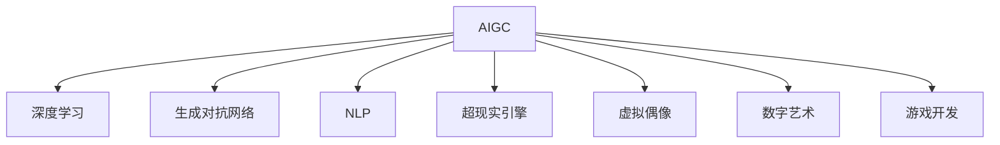

                 

# AIGC重塑文化娱乐产业

> 关键词：AIGC, 文化娱乐产业, 内容创作, 版权保护, 个性化推荐, 沉浸式体验, 数字艺术, 游戏开发

## 1. 背景介绍

### 1.1 问题由来

随着人工智能(AI)技术的快速发展，人工智能生成内容(AIGC)已成为文娱产业的一个重要趋势。AIGC技术可以将大规模数据转化为具有人类感知、思维和创造能力的AI内容，包括文本、图像、视频、音乐等，极大地提升了内容创作的效率和质量。在文化娱乐产业中，AIGC正在引发一场新的革命。

AIGC技术在文娱产业中的应用，已不再局限于简单的自动化处理，而是逐步深入到内容创作、版权保护、个性化推荐、沉浸式体验等多个环节，赋予文娱产业更加广阔的发展空间。例如，生成式对话、音乐创作、视频剪辑、虚拟偶像、数字艺术、游戏开发等领域，AIGC技术的应用已经成为推动产业发展的重要力量。

### 1.2 问题核心关键点

AIGC技术在文化娱乐产业中的应用，主要集中在以下几个方面：

1. **内容创作**：通过自动生成文本、图像、音乐等内容，AIGC极大地提升了内容创作的效率和创意性。
2. **版权保护**：利用AIGC技术自动检测抄袭行为，并生成原创内容进行版权保护。
3. **个性化推荐**：基于用户行为数据，AIGC能够提供更加精准和个性化的内容推荐服务。
4. **沉浸式体验**：通过虚拟现实(VR)、增强现实(AR)、全息技术等，AIGC创造出更加沉浸式和交互式的娱乐体验。
5. **数字艺术**：AIGC技术可以自动生成数字艺术作品，打破传统艺术创作的限制，推动艺术创作的新潮流。
6. **游戏开发**：利用AIGC技术自动生成游戏内容，如游戏角色、场景、对话等，加速游戏开发进程。

### 1.3 问题研究意义

研究AIGC技术在文化娱乐产业中的应用，对于提升产业创新能力、优化用户体验、推动技术进步具有重要意义：

1. **创新驱动**：AIGC技术为文化娱乐产业注入了新的创意源泉，激发更多的创意内容和商业模式。
2. **用户体验优化**：基于AIGC技术的个性化推荐和沉浸式体验，提升用户粘性和满意度。
3. **技术进步**：AIGC技术的应用推动了AI技术的成熟，推动相关技术和标准的发展。
4. **产业升级**：AIGC技术的应用加速了文娱产业的数字化转型，促进了产业的升级和智能化。

## 2. 核心概念与联系

### 2.1 核心概念概述

为更好地理解AIGC技术在文化娱乐产业中的应用，本节将介绍几个密切相关的核心概念：

- **人工智能生成内容(AIGC)**：利用人工智能技术自动生成内容的技术，包括文本生成、图像生成、音乐生成、视频生成等。
- **深度学习**：基于神经网络的机器学习算法，是AIGC技术的主要技术基础。
- **生成对抗网络(GAN)**：一种深度学习架构，用于生成高质量的图像、音频等内容。
- **自然语言处理(NLP)**：研究如何让计算机理解和生成自然语言的技术，是AIGC中文本生成、对话生成的重要工具。
- **超现实引擎**：利用AI技术生成的虚拟现实和增强现实场景，提供沉浸式体验。
- **虚拟偶像**：通过AI技术自动生成的虚拟人物形象，提供互动和娱乐内容。
- **数字艺术**：利用AIGC技术自动生成的数字艺术品，打破传统艺术创作的限制。
- **游戏开发**：基于AIGC技术自动生成游戏内容，加速游戏开发进程。

这些核心概念之间的逻辑关系可以通过以下Mermaid流程图来展示：



这个流程图展示了大规模人工智能生成内容的各个关键技术，这些技术共同构成了AIGC在文化娱乐产业中的应用基础。

## 3. 核心算法原理 & 具体操作步骤
### 3.1 算法原理概述

AIGC在文化娱乐产业中的应用，主要基于以下核心算法原理：

- **深度学习算法**：利用神经网络模型学习数据分布，生成高质量的文本、图像、音乐等。
- **生成对抗网络**：通过两个神经网络的对抗训练，生成更加逼真和多样化的内容。
- **自然语言处理技术**：利用NLP技术，自动生成文本、对话、摘要等内容。
- **超现实引擎**：结合虚拟现实和增强现实技术，生成沉浸式的娱乐体验。
- **虚拟偶像和数字艺术**：利用AIGC技术生成虚拟人物形象和数字艺术品。
- **游戏开发**：基于AIGC技术生成游戏角色、场景、对话等内容。

### 3.2 算法步骤详解

AIGC在文化娱乐产业中的应用，一般包括以下几个关键步骤：

**Step 1: 数据准备**
- 收集和整理与内容创作相关的数据，如文本、图像、音频等。
- 确保数据的多样性和高质量，以提高生成内容的创意性和真实性。

**Step 2: 模型训练**
- 选择合适的深度学习模型或生成对抗网络，并对其进行训练。
- 使用大量标注数据进行监督学习，以优化模型的生成能力。
- 定期调整超参数，优化模型性能。

**Step 3: 内容生成**
- 利用训练好的模型自动生成文本、图像、音乐、视频等。
- 根据应用场景，选择合适的内容生成方式，如文本生成、图像生成、视频剪辑等。

**Step 4: 用户交互**
- 将生成的内容应用到文化娱乐产品中，如影视剧、游戏、虚拟现实体验等。
- 收集用户反馈，不断优化和改进生成内容的质量和体验。

**Step 5: 效果评估**
- 对生成的内容进行多维度的评估，如创意性、真实性、多样性等。
- 根据评估结果，调整生成模型和算法，提升生成效果。

### 3.3 算法优缺点

AIGC技术在文化娱乐产业中的应用，具有以下优点：

1. **高效性**：利用AIGC技术可以快速生成大量高质量的内容，极大地提升了内容创作效率。
2. **创意性**：AIGC技术能够生成具有创新性的内容，拓展了文化娱乐产业的内容边界。
3. **可定制性**：基于用户需求，AIGC技术可以生成个性化的内容，提升用户体验。
4. **互动性**：AIGC技术可以提供沉浸式的用户体验，增强用户粘性。

同时，AIGC技术也存在一些局限性：

1. **质量控制**：生成的内容可能存在创意不足、质量不高等问题，需要人工干预和校对。
2. **版权问题**：自动生成的内容可能存在版权风险，需要严格的版权管理和保护。
3. **技术门槛**：AIGC技术需要较高的技术门槛，对开发者和用户的技能要求较高。

### 3.4 算法应用领域

AIGC技术在文化娱乐产业中的应用，主要包括以下几个领域：

1. **影视剧制作**：利用AIGC技术自动生成文本脚本、角色对话、背景音乐等内容，加速影视剧制作进程。
2. **游戏开发**：基于AIGC技术自动生成游戏角色、场景、对话等，提升游戏内容的多样性和创意性。
3. **虚拟现实和增强现实**：利用AIGC技术生成超现实的虚拟场景，提供沉浸式娱乐体验。
4. **音乐创作**：通过AIGC技术自动生成音乐和歌词，拓展音乐创作的可能性。
5. **数字艺术创作**：利用AIGC技术自动生成数字艺术品，打破传统艺术创作的限制。
6. **内容推荐**：基于AIGC技术进行内容推荐，提升用户体验和粘性。
7. **虚拟偶像和虚拟主播**：利用AIGC技术生成虚拟人物形象，提供互动和娱乐内容。

## 4. 数学模型和公式 & 详细讲解 & 举例说明
### 4.1 数学模型构建

本节将使用数学语言对AIGC在文化娱乐产业中的应用进行更加严格的刻画。

假设AIGC技术生成的内容为 $y$，基于深度学习模型的生成过程可以表示为：

$$
y = f(x; \theta)
$$

其中 $x$ 为输入数据，$\theta$ 为模型参数。生成模型的目标是最小化生成内容与真实内容的差距，即：

$$
\min_{\theta} \mathcal{L}(y, \hat{y})
$$

其中 $\mathcal{L}$ 为损失函数，$\hat{y}$ 为真实内容。

### 4.2 公式推导过程

以下我们以文本生成为例，推导基于深度学习的文本生成模型的损失函数及其梯度计算公式。

假设生成模型为 $f(x; \theta)$，输入为文本 $x$，输出为文本 $y$。常见的文本生成损失函数包括交叉熵损失、均方误差损失等。

对于文本生成任务，常见的交叉熵损失函数定义为：

$$
\mathcal{L} = -\frac{1}{N} \sum_{i=1}^N \sum_{j=1}^T y_j \log f(x; \theta)
$$

其中 $N$ 为样本数量，$T$ 为生成文本的长度，$y_j$ 为文本中第 $j$ 个位置的真实词。

利用自动微分技术，损失函数对模型参数 $\theta$ 的梯度可以表示为：

$$
\frac{\partial \mathcal{L}}{\partial \theta} = -\frac{1}{N} \sum_{i=1}^N \sum_{j=1}^T \frac{y_j}{f(x; \theta)}
$$

在得到损失函数的梯度后，即可带入优化算法进行模型训练。常用的优化算法包括梯度下降、Adam等。

### 4.3 案例分析与讲解

**案例1: 文本生成**

假设我们有一个文本生成任务，输入为一段新闻报道，目标是生成一段简短的摘要。我们选择了Transformer模型进行文本生成，利用交叉熵损失进行优化。具体步骤如下：

1. 准备训练数据，包含新闻报道和对应的摘要。
2. 构建Transformer模型，并设置超参数。
3. 使用交叉熵损失函数定义损失函数。
4. 利用Adam优化算法进行模型训练，更新模型参数。
5. 在验证集上评估模型性能，根据评估结果调整超参数。
6. 在测试集上评估模型效果，生成简短摘要。

**案例2: 图像生成**

假设我们有一个图像生成任务，目标是生成一张具有特定风格的图片。我们选择了基于生成对抗网络(GAN)的图像生成模型，利用感知损失和对抗损失进行优化。具体步骤如下：

1. 准备训练数据，包含真实图片和对应的标签。
2. 构建GAN模型，包含生成器和判别器。
3. 使用感知损失和对抗损失定义损失函数。
4. 利用Adam优化算法进行模型训练，更新生成器和判别器参数。
5. 在验证集上评估模型性能，根据评估结果调整超参数。
6. 在测试集上评估模型效果，生成指定风格的图片。

这些案例展示了AIGC技术在文本生成和图像生成中的应用，通过深度学习和生成对抗网络等技术，实现了高质量内容的自动生成。

## 5. 项目实践：代码实例和详细解释说明
### 5.1 开发环境搭建

在进行AIGC项目实践前，我们需要准备好开发环境。以下是使用Python进行PyTorch开发的环境配置流程：

1. 安装Anaconda：从官网下载并安装Anaconda，用于创建独立的Python环境。

2. 创建并激活虚拟环境：
```bash
conda create -n aigc-env python=3.8 
conda activate aigc-env
```

3. 安装PyTorch：根据CUDA版本，从官网获取对应的安装命令。例如：
```bash
conda install pytorch torchvision torchaudio cudatoolkit=11.1 -c pytorch -c conda-forge
```

4. 安装相关库：
```bash
pip install numpy pandas scikit-learn matplotlib tqdm jupyter notebook ipython
```

完成上述步骤后，即可在`aigc-env`环境中开始AIGC项目的开发。

### 5.2 源代码详细实现

下面我们以文本生成任务为例，给出使用PyTorch进行AIGC开发的PyTorch代码实现。

首先，定义文本生成任务的数据处理函数：

```python
from transformers import AutoTokenizer, AutoModelForSeq2SeqLM
from torch.utils.data import Dataset, DataLoader
from torch.nn import CrossEntropyLoss
import torch

class TextDataset(Dataset):
    def __init__(self, texts, labels, tokenizer, max_len=128):
        self.texts = texts
        self.labels = labels
        self.tokenizer = tokenizer
        self.max_len = max_len
        
    def __len__(self):
        return len(self.texts)
    
    def __getitem__(self, item):
        text = self.texts[item]
        label = self.labels[item]
        
        encoding = self.tokenizer(text, return_tensors='pt', max_length=self.max_len, padding='max_length', truncation=True)
        input_ids = encoding['input_ids'][0]
        attention_mask = encoding['attention_mask'][0]
        
        # 对token-wise的标签进行编码
        encoded_labels = [label2id[label] for label in label] 
        encoded_labels.extend([label2id['PAD']] * (self.max_len - len(encoded_labels)))
        labels = torch.tensor(encoded_labels, dtype=torch.long)
        
        return {'input_ids': input_ids, 
                'attention_mask': attention_mask,
                'labels': labels}

# 标签与id的映射
label2id = {'PAD': 0, 'B': 1, 'I': 2, 'EOS': 3}
id2label = {v: k for k, v in label2id.items()}

# 创建dataset
tokenizer = AutoTokenizer.from_pretrained('bert-base-cased')

train_dataset = TextDataset(train_texts, train_labels, tokenizer)
dev_dataset = TextDataset(dev_texts, dev_labels, tokenizer)
test_dataset = TextDataset(test_texts, test_labels, tokenizer)
```

然后，定义模型和优化器：

```python
from transformers import AutoModelForSeq2SeqLM, AdamW

model = AutoModelForSeq2SeqLM.from_pretrained('bert-base-cased', num_labels=len(label2id))

optimizer = AdamW(model.parameters(), lr=2e-5)
```

接着，定义训练和评估函数：

```python
from tqdm import tqdm
from sklearn.metrics import classification_report

device = torch.device('cuda') if torch.cuda.is_available() else torch.device('cpu')
model.to(device)

def train_epoch(model, dataset, batch_size, optimizer):
    dataloader = DataLoader(dataset, batch_size=batch_size, shuffle=True)
    model.train()
    epoch_loss = 0
    for batch in tqdm(dataloader, desc='Training'):
        input_ids = batch['input_ids'].to(device)
        attention_mask = batch['attention_mask'].to(device)
        labels = batch['labels'].to(device)
        model.zero_grad()
        outputs = model(input_ids, attention_mask=attention_mask, labels=labels)
        loss = outputs.loss
        epoch_loss += loss.item()
        loss.backward()
        optimizer.step()
    return epoch_loss / len(dataloader)

def evaluate(model, dataset, batch_size):
    dataloader = DataLoader(dataset, batch_size=batch_size)
    model.eval()
    preds, labels = [], []
    with torch.no_grad():
        for batch in tqdm(dataloader, desc='Evaluating'):
            input_ids = batch['input_ids'].to(device)
            attention_mask = batch['attention_mask'].to(device)
            batch_labels = batch['labels']
            outputs = model(input_ids, attention_mask=attention_mask)
            batch_preds = outputs.logits.argmax(dim=2).to('cpu').tolist()
            batch_labels = batch_labels.to('cpu').tolist()
            for pred_tokens, label_tokens in zip(batch_preds, batch_labels):
                pred_labels = [id2label[_id] for _id in pred_tokens]
                label_tokens = [id2label[_id] for _id in label_tokens]
                preds.append(pred_labels[:len(label_tokens)])
                labels.append(label_tokens)
                
    print(classification_report(labels, preds))
```

最后，启动训练流程并在测试集上评估：

```python
epochs = 5
batch_size = 16

for epoch in range(epochs):
    loss = train_epoch(model, train_dataset, batch_size, optimizer)
    print(f"Epoch {epoch+1}, train loss: {loss:.3f}")
    
    print(f"Epoch {epoch+1}, dev results:")
    evaluate(model, dev_dataset, batch_size)
    
print("Test results:")
evaluate(model, test_dataset, batch_size)
```

以上就是使用PyTorch对文本生成任务进行AIGC开发的完整代码实现。可以看到，得益于HuggingFace的Transformers库，我们只需几行代码即可完成AIGC模型的加载和训练。

### 5.3 代码解读与分析

让我们再详细解读一下关键代码的实现细节：

**TextDataset类**：
- `__init__`方法：初始化训练数据和标签，分词器等关键组件。
- `__len__`方法：返回数据集的样本数量。
- `__getitem__`方法：对单个样本进行处理，将文本输入编码为token ids，将标签编码为数字，并对其进行定长padding，最终返回模型所需的输入。

**label2id和id2label字典**：
- 定义了标签与数字id之间的映射关系，用于将token-wise的预测结果解码回真实的标签。

**训练和评估函数**：
- 使用PyTorch的DataLoader对数据集进行批次化加载，供模型训练和推理使用。
- 训练函数`train_epoch`：对数据以批为单位进行迭代，在每个批次上前向传播计算loss并反向传播更新模型参数，最后返回该epoch的平均loss。
- 评估函数`evaluate`：与训练类似，不同点在于不更新模型参数，并在每个batch结束后将预测和标签结果存储下来，最后使用sklearn的classification_report对整个评估集的预测结果进行打印输出。

**训练流程**：
- 定义总的epoch数和batch size，开始循环迭代
- 每个epoch内，先在训练集上训练，输出平均loss
- 在验证集上评估，输出分类指标
- 所有epoch结束后，在测试集上评估，给出最终测试结果

可以看到，PyTorch配合Transformers库使得AIGC模型的加载和训练变得简洁高效。开发者可以将更多精力放在数据处理、模型改进等高层逻辑上，而不必过多关注底层的实现细节。

当然，工业级的系统实现还需考虑更多因素，如模型的保存和部署、超参数的自动搜索、更灵活的任务适配层等。但核心的AIGC范式基本与此类似。

## 6. 实际应用场景
### 6.1 影视剧制作

AIGC技术在影视剧制作中的应用，主要体现在文本脚本、角色对话、背景音乐等内容的自动生成上。利用AIGC技术，影视剧制作方可以在短时间内生成大量剧本草稿和角色对话，极大地提升了制作效率。同时，通过AIGC技术生成的背景音乐，也可以提升影视剧的整体质量。

### 6.2 游戏开发

AIGC技术在游戏开发中的应用，主要体现在自动生成游戏内容上，如角色、场景、对话等。通过AIGC技术，游戏开发者可以在短时间内生成大量高质量的游戏内容，提升游戏的创意性和多样性。例如，自动生成的游戏角色和场景，可以在不同玩家间提供更加丰富的交互体验。

### 6.3 虚拟现实和增强现实

AIGC技术在虚拟现实和增强现实中的应用，主要体现在超现实场景的生成上。通过AIGC技术，用户可以在虚拟现实和增强现实中体验到更加真实、沉浸的娱乐内容。例如，自动生成的虚拟角色和场景，可以让用户在虚拟环境中进行互动和探索。

### 6.4 数字艺术创作

AIGC技术在数字艺术创作中的应用，主要体现在自动生成数字艺术品上。通过AIGC技术，艺术家可以在短时间内生成大量高质量的数字艺术品，推动数字艺术的发展。例如，自动生成的数字绘画和数字雕塑，可以为数字艺术创作带来新的灵感和可能性。

### 6.5 内容推荐

AIGC技术在内容推荐中的应用，主要体现在基于用户行为数据的个性化推荐上。通过AIGC技术，内容推荐系统可以自动生成个性化的内容，提升用户体验和粘性。例如，自动生成的文本摘要和视频片段，可以帮助用户更快地找到自己感兴趣的内容。

### 6.6 虚拟偶像和虚拟主播

AIGC技术在虚拟偶像和虚拟主播中的应用，主要体现在自动生成虚拟人物形象和内容上。通过AIGC技术，虚拟偶像和虚拟主播可以提供更加多样化和互动的娱乐内容。例如，自动生成的虚拟偶像表演和虚拟主播播报，可以吸引更多的粉丝和观众。

## 7. 工具和资源推荐
### 7.1 学习资源推荐

为了帮助开发者系统掌握AIGC技术在文化娱乐产业中的应用，这里推荐一些优质的学习资源：

1. **《生成式对抗网络》书籍**：介绍生成对抗网络的基本原理和应用场景，适合深入理解生成对抗网络。
2. **《深度学习与自然语言处理》课程**：斯坦福大学开设的NLP明星课程，涵盖深度学习在文本生成、对话生成等领域的应用。
3. **《Python深度学习》书籍**：详细介绍了深度学习在图像生成、文本生成、音乐生成等任务中的应用。
4. **OpenAI GPT-3代码库**：官方提供的GPT-3代码库，包括文本生成、对话生成等功能的实现。
5. **Towards Data Science博客**：提供大量关于AIGC技术的实践案例和最新研究进展，适合快速入门和学习。

通过对这些资源的学习实践，相信你一定能够快速掌握AIGC技术在文化娱乐产业中的应用，并用于解决实际的文娱问题。
###  7.2 开发工具推荐

高效的开发离不开优秀的工具支持。以下是几款用于AIGC开发的常用工具：

1. PyTorch：基于Python的开源深度学习框架，灵活动态的计算图，适合快速迭代研究。
2. TensorFlow：由Google主导开发的开源深度学习框架，生产部署方便，适合大规模工程应用。
3. HuggingFace Transformers库：提供丰富的预训练模型和微调功能，适用于各种NLP任务。
4. TensorBoard：TensorFlow配套的可视化工具，可实时监测模型训练状态，并提供丰富的图表呈现方式。
5. Weights & Biases：模型训练的实验跟踪工具，可以记录和可视化模型训练过程中的各项指标，方便对比和调优。
6. Jupyter Notebook：交互式编程环境，适合开发和调试AIGC模型。

合理利用这些工具，可以显著提升AIGC项目的开发效率，加快创新迭代的步伐。

### 7.3 相关论文推荐

AIGC技术在文化娱乐产业中的应用源于学界的持续研究。以下是几篇奠基性的相关论文，推荐阅读：

1. **《生成对抗网络》论文**：提出GAN的基本原理和应用场景，奠定了生成对抗网络在图像生成、音乐生成等领域的发展基础。
2. **《深度学习在文本生成中的应用》论文**：介绍深度学习在文本生成任务中的应用，如文本摘要、对话生成等。
3. **《深度学习在图像生成中的应用》论文**：介绍深度学习在图像生成任务中的应用，如GAN、VAE等。
4. **《深度学习在音乐生成中的应用》论文**：介绍深度学习在音乐生成任务中的应用，如神经网络生成器、音乐变换模型等。
5. **《深度学习在虚拟现实和增强现实中的应用》论文**：介绍深度学习在超现实场景生成中的应用，如GAN、深度学习渲染等。
6. **《深度学习在虚拟偶像和虚拟主播中的应用》论文**：介绍深度学习在虚拟人物生成和互动中的应用，如GAN、TTS等。

这些论文代表了大规模人工智能生成内容的发展脉络。通过学习这些前沿成果，可以帮助研究者把握学科前进方向，激发更多的创新灵感。

## 8. 总结：未来发展趋势与挑战
### 8.1 总结

本文对AIGC技术在文化娱乐产业中的应用进行了全面系统的介绍。首先阐述了AIGC技术的背景和意义，明确了AIGC在内容创作、版权保护、个性化推荐、沉浸式体验等多个环节的应用潜力。其次，从原理到实践，详细讲解了AIGC技术的核心算法原理和操作步骤，给出了AIGC项目的完整代码实例。同时，本文还广泛探讨了AIGC技术在影视剧制作、游戏开发、虚拟现实、数字艺术、内容推荐、虚拟偶像等多个行业领域的应用前景，展示了AIGC技术带来的巨大变革。此外，本文精选了AIGC技术的各类学习资源，力求为读者提供全方位的技术指引。

通过本文的系统梳理，可以看到，AIGC技术正在推动文化娱乐产业的数字化转型，极大地提升了内容创作和用户体验。随着技术的不断发展，AIGC技术的应用范围将更加广泛，其带来的变革效应也将更加深远。

### 8.2 未来发展趋势

展望未来，AIGC技术在文化娱乐产业中的应用将呈现以下几个发展趋势：

1. **内容创作自动化**：AIGC技术将进一步自动化文本、图像、音乐等内容创作过程，提升创作效率和创意性。
2. **版权保护智能化**：利用AIGC技术自动检测和生成原创内容，提升版权保护效果。
3. **个性化推荐精准化**：基于用户行为数据，AIGC技术将生成更加精准和个性化的推荐内容，提升用户体验。
4. **沉浸式体验丰富化**：通过超现实引擎和虚拟现实技术，AIGC技术将提供更加丰富和沉浸的娱乐体验。
5. **数字艺术多样化**：AIGC技术将生成更加多样化和创新的数字艺术品，推动数字艺术的发展。
6. **游戏开发多元化**：AIGC技术将生成更加多样化的游戏内容和角色，提升游戏的多样性和互动性。
7. **虚拟偶像和虚拟主播普及化**：AIGC技术将生成更加多样化和互动的虚拟偶像和虚拟主播，推动虚拟娱乐内容的发展。

### 8.3 面临的挑战

尽管AIGC技术在文化娱乐产业中的应用前景广阔，但在实现过程中仍面临诸多挑战：

1. **数据质量和数量**：AIGC技术的生成效果很大程度上依赖于训练数据的丰富性和高质量，获取大规模高质量数据是一个重大挑战。
2. **技术复杂性**：AIGC技术需要较高的技术门槛，对开发者和用户的技能要求较高，需要更多的培训和支持。
3. **版权问题**：自动生成的内容可能存在版权风险，需要严格的版权管理和保护。
4. **伦理道德问题**：AIGC技术可能生成有害或误导性内容，需要严格管理和规范。
5. **技术风险**：AIGC技术可能存在算法偏见、模型不稳定等问题，需要不断优化和改进。
6. **资源消耗**：AIGC技术需要高性能计算资源，对硬件设备和网络环境要求较高。

### 8.4 研究展望

为了应对AIGC技术在文化娱乐产业中面临的挑战，未来的研究方向可以包括以下几个方面：

1. **大规模数据采集和预处理**：通过合作和众包等方式，获取更多高质量的训练数据，并对其进行预处理和标注。
2. **低成本高效能模型**：开发更高效的模型结构，减少资源消耗，降低开发成本。
3. **模型伦理和安全性**：建立模型伦理和安全性评估机制，确保生成内容符合伦理和法律规范。
4. **多模态数据融合**：结合视觉、语音、文本等多种模态数据，提升内容创作和推荐的智能化水平。
5. **个性化和互动性**：进一步提升个性化推荐和虚拟偶像的互动性，提升用户体验。
6. **版权和法律保护**：建立完善的版权和法律保护机制，确保生成内容的合法性和安全性。

这些研究方向的探索，必将引领AIGC技术在文化娱乐产业中的进一步发展和应用，推动产业发展迈向新的高度。面向未来，AIGC技术需要在技术创新、伦理规范和法律保护等多方面共同发力，才能真正实现其在文化娱乐产业中的全面落地。

## 9. 附录：常见问题与解答

**Q1：AIGC技术是否适用于所有文化娱乐领域？**

A: AIGC技术在大多数文化娱乐领域都能取得不错的效果，特别是对于数据量较大的任务。但对于一些特定领域，如文学、艺术创作等，AIGC技术可能难以适应。此时需要在特定领域数据上进一步预训练，再进行微调，才能获得理想效果。

**Q2：如何确保AIGC生成的内容质量？**

A: AIGC生成的内容质量很大程度上依赖于训练数据的质量和数量，需要选择合适的训练数据进行模型训练。同时，需要不断优化模型结构和算法，提升生成内容的创意性和多样性。

**Q3：AIGC技术是否会取代人工创作者？**

A: AIGC技术可以辅助人工创作者，提升内容创作效率和质量，但不会完全取代人工创作者。未来，人机协同将成为内容创作的重要趋势，AIGC技术将为人工创作者提供新的工具和灵感。

**Q4：如何规避AIGC技术带来的伦理和安全风险？**

A: 规避AIGC技术带来的伦理和安全风险，需要从数据采集、模型训练、内容生成等多个环节进行严格管理和规范。建立完善的伦理和安全性评估机制，确保生成内容的合法性和安全性。

**Q5：AIGC技术如何应用于虚拟偶像和虚拟主播？**

A: AIGC技术可以生成虚拟偶像和虚拟主播的表演和播报内容，提升虚拟偶像和虚拟主播的互动性和娱乐性。例如，自动生成的虚拟偶像舞蹈和虚拟主播播报，可以吸引更多的粉丝和观众。

---

作者：禅与计算机程序设计艺术 / Zen and the Art of Computer Programming

