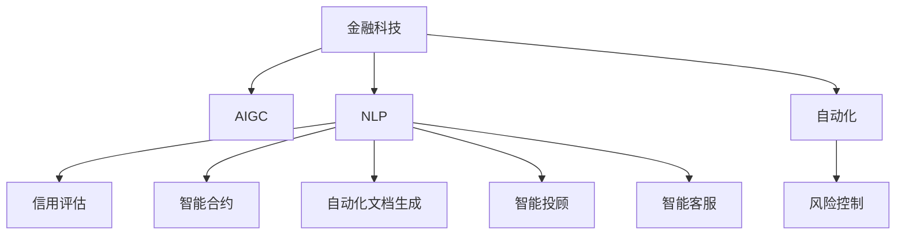

                 

# AIGC重塑金融服务业

> 关键词：金融服务,人工智能生成内容(AIGC),自然语言处理(NLP),深度学习,金融科技,自动化,算法交易,信用评估,智能合约,金融分析

## 1. 背景介绍

### 1.1 问题由来

金融服务业历来是一个高度依赖人工和规则驱动的行业，如信用评估、风险控制、投资决策等环节，都需要人工参与，效率低且容易出错。金融科技(FinTech)的发展，特别是在区块链、大数据、云计算等领域的应用，已经在逐步改变金融服务的模式。而近年来，人工智能生成内容(AIGC)技术，特别是基于深度学习和大规模预训练语言模型的自然语言处理(NLP)应用，正在为金融服务业带来革命性的变化。

AIGC技术通过生成高品质的文本、图像、视频等内容，显著提升了金融服务的自动化程度，降低了人力成本，提高了运营效率。例如，智能客服、智能投顾、财务报告生成等应用，已经在很多银行和投资机构得到广泛应用，取得了显著效果。

### 1.2 问题核心关键点

AIGC在金融服务业中的应用，主要体现在以下几个方面：

1. **智能客服与咨询**：利用自然语言理解和生成技术，构建智能客服系统，实现24小时不间断服务，快速响应客户咨询，提升用户体验。
2. **自动化文档生成**：通过AIGC技术生成合同、报告、客户信函等文档，大幅减少人工输入和校验工作，提高文档处理效率。
3. **智能投顾与投研**：利用NLP技术进行市场分析、新闻摘要、投资报告等生成，辅助投资决策，提升投研能力。
4. **信用评估与风险控制**：结合大数据和AIGC技术，生成风险评估报告，辅助信用决策。
5. **智能合约**：利用智能合约生成技术，自动执行和监测合同条款，提升合约管理的自动化水平。

这些应用展示了AIGC在金融服务中的巨大潜力，为金融行业的数字化转型提供了新的动力。

## 2. 核心概念与联系

### 2.1 核心概念概述

为更好地理解AIGC在金融服务中的应用，本节将介绍几个关键概念：

- **金融科技(FinTech)**：运用现代信息技术和区块链技术对传统金融行业进行改造，以提升金融服务的效率和透明度。
- **人工智能生成内容(AIGC)**：通过深度学习等技术，自动生成文本、图像、视频等内容的智能技术。
- **自然语言处理(NLP)**：利用深度学习技术，处理和理解人类语言的技术，包括文本分类、生成、情感分析等。
- **深度学习**：一种基于多层神经网络的机器学习算法，能够处理非线性、高维数据。
- **信用评估**：根据客户历史行为、资产状况等信息，通过模型评估客户的信用风险。
- **智能合约**：基于区块链技术，通过代码自动执行和监测合同条款的技术。

这些概念之间的联系和应用场景可以通过以下Mermaid流程图来展示：



这个流程图展示了金融科技、AIGC、NLP等概念之间的关系和应用场景：

1. 金融科技作为整体框架，通过AIGC和NLP等技术，提升金融服务的自动化水平。
2. AIGC技术提供了自动生成内容的能力，NLP技术提供了文本理解和生成能力，两者结合，可以实现多种金融服务。
3. 信用评估和智能合约等应用场景，展示了NLP和AIGC技术在金融具体领域的应用。

## 3. 核心算法原理 & 具体操作步骤

### 3.1 算法原理概述

AIGC技术在金融服务中的应用，主要依赖于深度学习和大规模预训练语言模型。这些模型通过在大规模无标签文本数据上进行预训练，学习到丰富的语言知识和常识，可以通过少量的有标签样本在下游任务上进行微调，生成高品质的文本、图像、视频等内容。

形式化地，假设预训练模型为 $M_{\theta}$，其中 $\theta$ 为预训练得到的模型参数。给定金融服务任务 $T$ 的标注数据集 $D=\{(x_i, y_i)\}_{i=1}^N$，AIGC技术的应用过程如下：

1. **预训练**：在大型无标签金融数据集上，使用深度学习模型进行自监督学习，学习到通用的语言表示。
2. **微调**：在标注数据集上进行有监督学习，微调模型参数，使其输出能够匹配特定金融服务任务的要求。
3. **内容生成**：利用微调后的模型，根据给定的输入，自动生成高品质的金融内容，如报告、合同、摘要等。

### 3.2 算法步骤详解

以下是AIGC技术在金融服务中的应用步骤：

**Step 1: 准备预训练模型和数据集**
- 选择合适的预训练语言模型 $M_{\theta}$，如GPT、BERT等。
- 准备金融服务任务 $T$ 的标注数据集 $D$，划分为训练集、验证集和测试集。一般要求标注数据与预训练数据的分布不要差异过大。

**Step 2: 微调模型**
- 在标注数据集上进行有监督微调，更新模型参数，使其能够生成符合金融服务任务要求的文本、图像、视频等内容。
- 使用正则化技术，如L2正则、Dropout等，防止模型过拟合。
- 设置合适的学习率、批大小、迭代轮数等超参数。

**Step 3: 内容生成**
- 使用微调后的模型，根据用户输入，自动生成金融服务相关的文本、图像、视频等内容。
- 将生成的内容进行后处理，如格式化、校验、纠错等，确保生成的内容的准确性和可读性。

**Step 4: 部署和监控**
- 将生成的内容部署到实际应用系统中，供金融服务人员使用。
- 实时监控生成内容的质量和性能，根据反馈进行优化。

### 3.3 算法优缺点

AIGC技术在金融服务中的应用，具有以下优点：

1. **效率提升**：AIGC技术可以自动生成大量金融内容，大幅提升文档处理、客户服务、投研分析等环节的效率。
2. **成本降低**：减少了人力输入和人工校验的环节，降低了人工成本。
3. **质量保证**：自动生成的内容经过严格的模型和后处理，确保了内容的准确性和一致性。
4. **灵活性**：模型可以根据不同的金融服务任务进行微调，适应性强。
5. **可扩展性**：AIGC技术可以与其他金融科技技术结合，形成完整的解决方案。

同时，该技术也存在一些缺点：

1. **依赖标注数据**：AIGC技术的效果很大程度上取决于标注数据的质量和数量，获取高质量标注数据的成本较高。
2. **数据隐私问题**：生成内容的训练数据和生成过程可能涉及用户隐私，需要采取措施进行保护。
3. **可解释性不足**：AIGC技术生成的内容往往缺乏可解释性，难以理解其生成逻辑。
4. **对抗样本问题**：生成的内容可能存在对抗样本，影响模型的鲁棒性。
5. **质量波动**：自动生成的内容可能存在质量波动，需要不断优化模型和后处理流程。

尽管存在这些局限性，但AIGC技术在金融服务中的应用仍然具有广阔前景，尤其是在提升服务效率和降低成本方面，具有显著优势。

### 3.4 算法应用领域

AIGC技术在金融服务中的应用非常广泛，涵盖了多个重要领域，例如：

- **智能客服与咨询**：利用自然语言处理技术，构建智能客服系统，实现24小时不间断服务，快速响应客户咨询，提升用户体验。
- **自动化文档生成**：通过AIGC技术生成合同、报告、客户信函等文档，大幅减少人工输入和校验工作，提高文档处理效率。
- **智能投顾与投研**：利用NLP技术进行市场分析、新闻摘要、投资报告等生成，辅助投资决策，提升投研能力。
- **信用评估与风险控制**：结合大数据和AIGC技术，生成风险评估报告，辅助信用决策。
- **智能合约**：利用智能合约生成技术，自动执行和监测合同条款，提升合约管理的自动化水平。
- **反洗钱与合规审查**：利用自然语言处理技术，分析金融交易文本，识别可疑行为，辅助合规审查。

这些领域展示了AIGC在金融服务中的巨大潜力，为金融行业的数字化转型提供了新的动力。

## 4. 数学模型和公式 & 详细讲解  
### 4.1 数学模型构建

本节将使用数学语言对AIGC在金融服务中的应用进行更加严格的刻画。

假设预训练语言模型为 $M_{\theta}$，其中 $\theta$ 为预训练得到的模型参数。给定金融服务任务 $T$ 的标注数据集 $D=\{(x_i, y_i)\}_{i=1}^N$，其中 $x_i$ 为输入文本，$y_i$ 为标注输出。

定义模型 $M_{\theta}$ 在输入 $x$ 上的输出为 $\hat{y}=M_{\theta}(x) \in [0,1]$，表示样本属于正类的概率。真实标签 $y \in \{0,1\}$。则二分类交叉熵损失函数定义为：

$$
\ell(M_{\theta}(x),y) = -[y\log \hat{y} + (1-y)\log (1-\hat{y})]
$$

将其代入经验风险公式，得：

$$
\mathcal{L}(\theta) = -\frac{1}{N}\sum_{i=1}^N [y_i\log M_{\theta}(x_i)+(1-y_i)\log(1-M_{\theta}(x_i))]
$$

根据链式法则，损失函数对参数 $\theta_k$ 的梯度为：

$$
\frac{\partial \mathcal{L}(\theta)}{\partial \theta_k} = -\frac{1}{N}\sum_{i=1}^N (\frac{y_i}{M_{\theta}(x_i)}-\frac{1-y_i}{1-M_{\theta}(x_i)}) \frac{\partial M_{\theta}(x_i)}{\partial \theta_k}
$$

其中 $\frac{\partial M_{\theta}(x_i)}{\partial \theta_k}$ 可进一步递归展开，利用自动微分技术完成计算。

### 4.2 公式推导过程

以下我们以智能投顾的应用为例，推导AIGC技术在金融服务中的应用公式。

假设智能投顾系统的输入为市场新闻和股票信息，输出为对某只股票的投资建议。新闻信息和股票信息作为模型输入，通过AIGC技术生成，然后作为模型训练的监督信号。设新闻信息为 $x_1$，股票信息为 $x_2$，市场新闻生成模型为 $G_1$，股票信息生成模型为 $G_2$，股票投资建议生成模型为 $M_{\theta}$。则微调过程如下：

1. 市场新闻生成模型 $G_1$ 和股票信息生成模型 $G_2$ 在市场数据上预训练。
2. 将生成的市场新闻和股票信息作为输入，微调股票投资建议生成模型 $M_{\theta}$，使其能够生成投资建议。
3. 将生成的投资建议与实际投资结果进行比较，计算损失函数，反向传播更新模型参数。

假设生成的投资建议为 $\hat{y}=M_{\theta}(x_1, x_2)$，实际投资结果为 $y \in \{0,1\}$，则交叉熵损失函数为：

$$
\ell(M_{\theta}(x_1, x_2),y) = -[y\log \hat{y} + (1-y)\log (1-\hat{y})]
$$

根据链式法则，损失函数对模型参数 $\theta$ 的梯度为：

$$
\frac{\partial \mathcal{L}(\theta)}{\partial \theta} = \frac{\partial \ell(M_{\theta}(x_1, x_2),y)}{\partial M_{\theta}(x_1, x_2)} \frac{\partial M_{\theta}(x_1, x_2)}{\partial \theta}
$$

其中 $\frac{\partial M_{\theta}(x_1, x_2)}{\partial \theta}$ 可进一步递归展开，利用自动微分技术完成计算。

## 5. 项目实践：代码实例和详细解释说明
### 5.1 开发环境搭建

在进行AIGC实践前，我们需要准备好开发环境。以下是使用Python进行PyTorch开发的环境配置流程：

1. 安装Anaconda：从官网下载并安装Anaconda，用于创建独立的Python环境。

2. 创建并激活虚拟环境：
```bash
conda create -n pytorch-env python=3.8 
conda activate pytorch-env
```

3. 安装PyTorch：根据CUDA版本，从官网获取对应的安装命令。例如：
```bash
conda install pytorch torchvision torchaudio cudatoolkit=11.1 -c pytorch -c conda-forge
```

4. 安装Transformers库：
```bash
pip install transformers
```

5. 安装各类工具包：
```bash
pip install numpy pandas scikit-learn matplotlib tqdm jupyter notebook ipython
```

完成上述步骤后，即可在`pytorch-env`环境中开始AIGC实践。

### 5.2 源代码详细实现

这里以智能投顾系统为例，给出使用Transformers库进行金融服务AIGC的PyTorch代码实现。

首先，定义金融服务任务的数据处理函数：

```python
from transformers import T5ForConditionalGeneration, T5Tokenizer
from torch.utils.data import Dataset
import torch

class FinanceDataset(Dataset):
    def __init__(self, texts, labels, tokenizer):
        self.texts = texts
        self.labels = labels
        self.tokenizer = tokenizer
        self.max_len = 256
        
    def __len__(self):
        return len(self.texts)
    
    def __getitem__(self, item):
        text = self.texts[item]
        label = self.labels[item]
        
        encoding = self.tokenizer(text, return_tensors='pt', max_length=self.max_len, padding='max_length', truncation=True)
        input_ids = encoding['input_ids'][0]
        attention_mask = encoding['attention_mask'][0]
        
        # 对token-wise的标签进行编码
        encoded_labels = [label] * len(encoded_labels) + [0] * (self.max_len - len(encoded_labels))
        labels = torch.tensor(encoded_labels, dtype=torch.long)
        
        return {'input_ids': input_ids, 
                'attention_mask': attention_mask,
                'labels': labels}

# 标签与id的映射
label2id = {'buy': 1, 'sell': 2, 'hold': 3, 'no_op': 0}
id2label = {v: k for k, v in label2id.items()}

# 创建dataset
tokenizer = T5Tokenizer.from_pretrained('t5-base')

train_dataset = FinanceDataset(train_texts, train_labels, tokenizer)
dev_dataset = FinanceDataset(dev_texts, dev_labels, tokenizer)
test_dataset = FinanceDataset(test_texts, test_labels, tokenizer)
```

然后，定义模型和优化器：

```python
from transformers import T5ForConditionalGeneration, AdamW

model = T5ForConditionalGeneration.from_pretrained('t5-base', num_labels=len(label2id))

optimizer = AdamW(model.parameters(), lr=2e-5)
```

接着，定义训练和评估函数：

```python
from torch.utils.data import DataLoader
from tqdm import tqdm
from sklearn.metrics import classification_report

device = torch.device('cuda') if torch.cuda.is_available() else torch.device('cpu')
model.to(device)

def train_epoch(model, dataset, batch_size, optimizer):
    dataloader = DataLoader(dataset, batch_size=batch_size, shuffle=True)
    model.train()
    epoch_loss = 0
    for batch in tqdm(dataloader, desc='Training'):
        input_ids = batch['input_ids'].to(device)
        attention_mask = batch['attention_mask'].to(device)
        labels = batch['labels'].to(device)
        model.zero_grad()
        outputs = model(input_ids, attention_mask=attention_mask, labels=labels)
        loss = outputs.loss
        epoch_loss += loss.item()
        loss.backward()
        optimizer.step()
    return epoch_loss / len(dataloader)

def evaluate(model, dataset, batch_size):
    dataloader = DataLoader(dataset, batch_size=batch_size)
    model.eval()
    preds, labels = [], []
    with torch.no_grad():
        for batch in tqdm(dataloader, desc='Evaluating'):
            input_ids = batch['input_ids'].to(device)
            attention_mask = batch['attention_mask'].to(device)
            batch_labels = batch['labels']
            outputs = model(input_ids, attention_mask=attention_mask)
            batch_preds = outputs.logits.argmax(dim=2).to('cpu').tolist()
            batch_labels = batch_labels.to('cpu').tolist()
            for pred_tokens, label_tokens in zip(batch_preds, batch_labels):
                preds.append(pred_tokens[:len(label_tokens)])
                labels.append(label_tokens)
                
    print(classification_report(labels, preds))
```

最后，启动训练流程并在测试集上评估：

```python
epochs = 5
batch_size = 16

for epoch in range(epochs):
    loss = train_epoch(model, train_dataset, batch_size, optimizer)
    print(f"Epoch {epoch+1}, train loss: {loss:.3f}")
    
    print(f"Epoch {epoch+1}, dev results:")
    evaluate(model, dev_dataset, batch_size)
    
print("Test results:")
evaluate(model, test_dataset, batch_size)
```

以上就是使用PyTorch对T5进行金融服务智能投顾应用的完整代码实现。可以看到，得益于Transformers库的强大封装，我们可以用相对简洁的代码完成T5模型的加载和微调。

### 5.3 代码解读与分析

让我们再详细解读一下关键代码的实现细节：

**FinanceDataset类**：
- `__init__`方法：初始化文本、标签、分词器等关键组件。
- `__len__`方法：返回数据集的样本数量。
- `__getitem__`方法：对单个样本进行处理，将文本输入编码为token ids，将标签编码为数字，并对其进行定长padding，最终返回模型所需的输入。

**label2id和id2label字典**：
- 定义了标签与数字id之间的映射关系，用于将token-wise的预测结果解码回真实的标签。

**训练和评估函数**：
- 使用PyTorch的DataLoader对数据集进行批次化加载，供模型训练和推理使用。
- 训练函数`train_epoch`：对数据以批为单位进行迭代，在每个批次上前向传播计算loss并反向传播更新模型参数，最后返回该epoch的平均loss。
- 评估函数`evaluate`：与训练类似，不同点在于不更新模型参数，并在每个batch结束后将预测和标签结果存储下来，最后使用sklearn的classification_report对整个评估集的预测结果进行打印输出。

**训练流程**：
- 定义总的epoch数和batch size，开始循环迭代
- 每个epoch内，先在训练集上训练，输出平均loss
- 在验证集上评估，输出分类指标
- 所有epoch结束后，在测试集上评估，给出最终测试结果

可以看到，PyTorch配合Transformers库使得T5微调的代码实现变得简洁高效。开发者可以将更多精力放在数据处理、模型改进等高层逻辑上，而不必过多关注底层的实现细节。

当然，工业级的系统实现还需考虑更多因素，如模型的保存和部署、超参数的自动搜索、更灵活的任务适配层等。但核心的微调范式基本与此类似。

## 6. 实际应用场景
### 6.1 智能客服与咨询

智能客服系统是AIGC技术在金融服务中最早也是最成功的应用之一。传统客服往往需要配备大量人力，高峰期响应缓慢，且一致性和专业性难以保证。而使用智能客服系统，能够7x24小时不间断服务，快速响应客户咨询，用自然流畅的语言解答各类常见问题。

在技术实现上，可以收集企业内部的历史客服对话记录，将问题和最佳答复构建成监督数据，在此基础上对预训练语言模型进行微调。微调后的语言模型能够自动理解用户意图，匹配最合适的答案模板进行回复。对于客户提出的新问题，还可以接入检索系统实时搜索相关内容，动态组织生成回答。如此构建的智能客服系统，能大幅提升客户咨询体验和问题解决效率。

### 6.2 自动化文档生成

当前的文档生成过程通常需要人工输入和反复校验，效率低且容易出错。利用AIGC技术，可以大幅提升文档处理的自动化程度，减少人工输入和校验的工作量。

例如，银行的财务报告生成、客户信函生成、合同生成等，都可以通过AIGC技术实现。将客户的财务数据、合同条款等作为输入，生成高质量的财务报告、客户信函、合同文本，显著提升文档处理效率。

### 6.3 智能投顾与投研

智能投顾系统利用NLP技术进行市场分析、新闻摘要、投资报告等生成，辅助投资决策，提升投研能力。

在市场新闻和股票信息的基础上，通过AIGC技术生成投资建议，然后对生成结果进行后处理，如去噪、格式化、校验等，确保输出的建议准确性和可读性。智能投顾系统可以实时监测市场变化，自动生成投资建议，辅助投资决策，提高投研效率和精度。

### 6.4 信用评估与风险控制

信用评估和风险控制是金融服务业的重要环节。利用AIGC技术，可以生成风险评估报告，辅助信用决策。

例如，根据客户的个人简历、历史行为、社交媒体信息等，通过AIGC技术生成风险评估报告，提供客户信用评分和风险等级。风险控制方面，可以利用AIGC技术分析金融交易文本，识别可疑行为，辅助合规审查，提升风险控制能力。

### 6.5 智能合约

智能合约是区块链技术的核心应用之一，通过代码自动执行和监测合同条款，提升合约管理的自动化水平。

利用AIGC技术，可以自动生成合同条款、执行条件、监测规则等，形成完整的智能合约。例如，利用自然语言处理技术分析合同文本，自动生成合同摘要和执行条件，然后通过智能合约代码实现自动执行和监测。智能合约系统可以实时监测合同执行情况，自动执行合同条款，提升合约管理的自动化水平。

## 7. 工具和资源推荐
### 7.1 学习资源推荐

为了帮助开发者系统掌握AIGC在金融服务中的应用理论基础和实践技巧，这里推荐一些优质的学习资源：

1. 《Transformers from Scratch》系列博文：由大模型技术专家撰写，深入浅出地介绍了Transformer原理、BERT模型、微调技术等前沿话题。

2. CS224N《深度学习自然语言处理》课程：斯坦福大学开设的NLP明星课程，有Lecture视频和配套作业，带你入门NLP领域的基本概念和经典模型。

3. 《Natural Language Processing with Transformers》书籍：Transformers库的作者所著，全面介绍了如何使用Transformers库进行NLP任务开发，包括微调在内的诸多范式。

4. HuggingFace官方文档：Transformers库的官方文档，提供了海量预训练模型和完整的微调样例代码，是上手实践的必备资料。

5. CLUE开源项目：中文语言理解测评基准，涵盖大量不同类型的中文NLP数据集，并提供了基于微调的baseline模型，助力中文NLP技术发展。

通过对这些资源的学习实践，相信你一定能够快速掌握AIGC在金融服务中的应用精髓，并用于解决实际的NLP问题。
###  7.2 开发工具推荐

高效的开发离不开优秀的工具支持。以下是几款用于AIGC开发常用的工具：

1. PyTorch：基于Python的开源深度学习框架，灵活动态的计算图，适合快速迭代研究。大部分预训练语言模型都有PyTorch版本的实现。

2. TensorFlow：由Google主导开发的开源深度学习框架，生产部署方便，适合大规模工程应用。同样有丰富的预训练语言模型资源。

3. Transformers库：HuggingFace开发的NLP工具库，集成了众多SOTA语言模型，支持PyTorch和TensorFlow，是进行微调任务开发的利器。

4. Weights & Biases：模型训练的实验跟踪工具，可以记录和可视化模型训练过程中的各项指标，方便对比和调优。与主流深度学习框架无缝集成。

5. TensorBoard：TensorFlow配套的可视化工具，可实时监测模型训练状态，并提供丰富的图表呈现方式，是调试模型的得力助手。

6. Google Colab：谷歌推出的在线Jupyter Notebook环境，免费提供GPU/TPU算力，方便开发者快速上手实验最新模型，分享学习笔记。

合理利用这些工具，可以显著提升AIGC任务的开发效率，加快创新迭代的步伐。

### 7.3 相关论文推荐

AIGC技术的发展源于学界的持续研究。以下是几篇奠基性的相关论文，推荐阅读：

1. Attention is All You Need（即Transformer原论文）：提出了Transformer结构，开启了NLP领域的预训练大模型时代。

2. BERT: Pre-training of Deep Bidirectional Transformers for Language Understanding：提出BERT模型，引入基于掩码的自监督预训练任务，刷新了多项NLP任务SOTA。

3. Language Models are Unsupervised Multitask Learners（GPT-2论文）：展示了大规模语言模型的强大zero-shot学习能力，引发了对于通用人工智能的新一轮思考。

4. Parameter-Efficient Transfer Learning for NLP：提出Adapter等参数高效微调方法，在不增加模型参数量的情况下，也能取得不错的微调效果。

5. Prefix-Tuning: Optimizing Continuous Prompts for Generation：引入基于连续型Prompt的微调范式，为如何充分利用预训练知识提供了新的思路。

6. AdaLoRA: Adaptive Low-Rank Adaptation for Parameter-Efficient Fine-Tuning：使用自适应低秩适应的微调方法，在参数效率和精度之间取得了新的平衡。

这些论文代表了大语言模型微调技术的发展脉络。通过学习这些前沿成果，可以帮助研究者把握学科前进方向，激发更多的创新灵感。

## 8. 总结：未来发展趋势与挑战

### 8.1 总结

本文对AIGC在金融服务业中的应用进行了全面系统的介绍。首先阐述了AIGC技术的研究背景和意义，明确了其在金融服务自动化、提高运营效率方面的独特价值。其次，从原理到实践，详细讲解了AIGC的数学原理和关键步骤，给出了AIGC任务开发的完整代码实例。同时，本文还广泛探讨了AIGC技术在智能客服、自动化文档生成、智能投顾、信用评估、智能合约等多个金融服务领域的应用前景，展示了AIGC技术的巨大潜力。

通过本文的系统梳理，可以看到，AIGC技术正在成为金融服务领域的重要范式，极大地拓展了金融服务的自动化程度，降低了人工成本，提升了运营效率。未来，伴随预训练语言模型和微调方法的持续演进，相信AIGC技术必将在更广阔的金融服务场景中大放异彩，深刻影响金融服务的模式和效率。

### 8.2 未来发展趋势

展望未来，AIGC技术在金融服务中的应用将呈现以下几个发展趋势：

1. **模型规模持续增大**：随着算力成本的下降和数据规模的扩张，预训练语言模型的参数量还将持续增长。超大规模语言模型蕴含的丰富语言知识，有望支撑更加复杂多变的金融服务需求。

2. **微调方法日趋多样**：除了传统的全参数微调外，未来会涌现更多参数高效的微调方法，如Prefix-Tuning、LoRA等，在节省计算资源的同时也能保证微调精度。

3. **持续学习成为常态**：随着数据分布的不断变化，微调模型也需要持续学习新知识以保持性能。如何在不遗忘原有知识的同时，高效吸收新样本信息，将成为重要的研究课题。

4. **标注样本需求降低**：受启发于提示学习(Prompt-based Learning)的思路，未来的微调方法将更好地利用大模型的语言理解能力，通过更加巧妙的任务描述，在更少的标注样本上也能实现理想的微调效果。

5. **少样本学习和跨领域迁移能力提升**：未来的AIGC技术将更好地利用大模型的语言理解能力，通过零样本和少样本学习，提升在特定领域和任务上的微调效果。

6. **跨模态生成能力增强**：当前的AIGC技术主要聚焦于文本生成，未来会进一步拓展到图像、视频、语音等多模态数据生成。多模态信息的融合，将显著提升语言模型对现实世界的理解和建模能力。

7. **多任务联合学习**：未来的AIGC技术将结合多个金融服务任务，进行联合学习，提升整体微调效果，满足复杂多变的金融需求。

以上趋势凸显了AIGC在金融服务中的广阔前景。这些方向的探索发展，必将进一步提升AIGC技术的应用范围和性能，为金融行业的数字化转型提供新的动力。

### 8.3 面临的挑战

尽管AIGC技术在金融服务中的应用取得了显著成效，但在迈向更加智能化、普适化应用的过程中，仍面临诸多挑战：

1. **标注成本瓶颈**：AIGC技术的效果很大程度上取决于标注数据的质量和数量，获取高质量标注数据的成本较高。如何进一步降低微调对标注样本的依赖，将是一大难题。

2. **数据隐私问题**：生成内容的训练数据和生成过程可能涉及用户隐私，需要采取措施进行保护。如何在保证数据隐私的同时，提升AIGC技术的效果，还需要更多技术创新。

3. **可解释性不足**：AIGC技术生成的内容往往缺乏可解释性，难以理解其生成逻辑。对于医疗、金融等高风险应用，算法的可解释性和可审计性尤为重要。如何赋予AIGC模型更强的可解释性，将是亟待攻克的难题。

4. **质量波动问题**：自动生成的内容可能存在质量波动，需要不断优化模型和后处理流程，确保生成的内容的高质量和一致性。

5. **对抗样本问题**：生成的内容可能存在对抗样本，影响模型的鲁棒性。如何在保证生成的内容高质量的同时，提升模型的鲁棒性，还需进一步探索。

尽管存在这些挑战，但AIGC技术在金融服务中的应用仍然具有广阔前景，尤其是在提升服务效率和降低成本方面，具有显著优势。

### 8.4 未来突破

面对AIGC技术在金融服务中面临的挑战，未来的研究需要在以下几个方面寻求新的突破：

1. **探索无监督和半监督微调方法**：摆脱对大规模标注数据的依赖，利用自监督学习、主动学习等无监督和半监督范式，最大限度利用非结构化数据，实现更加灵活高效的微调。

2. **研究参数高效和计算高效的微调范式**：开发更加参数高效的微调方法，在固定大部分预训练参数的同时，只更新极少量的任务相关参数。同时优化微调模型的计算图，减少前向传播和反向传播的资源消耗，实现更加轻量级、实时性的部署。

3. **引入因果推断和对比学习范式**：通过引入因果推断和对比学习思想，增强AIGC模型建立稳定因果关系的能力，学习更加普适、鲁棒的语言表征，从而提升模型泛化性和抗干扰能力。

4. **引入更多先验知识**：将符号化的先验知识，如知识图谱、逻辑规则等，与神经网络模型进行巧妙融合，引导AIGC过程学习更准确、合理的语言模型。同时加强不同模态数据的整合，实现视觉、语音等多模态信息与文本信息的协同建模。

5. **结合因果分析和博弈论工具**：将因果分析方法引入AIGC模型，识别出模型决策的关键特征，增强输出解释的因果性和逻辑性。借助博弈论工具刻画人机交互过程，主动探索并规避模型的脆弱点，提高系统稳定性。

6. **纳入伦理道德约束**：在模型训练目标中引入伦理导向的评估指标，过滤和惩罚有偏见、有害的输出倾向。同时加强人工干预和审核，建立模型行为的监管机制，确保输出符合人类价值观和伦理道德。

这些研究方向的探索，必将引领AIGC技术迈向更高的台阶，为构建安全、可靠、可解释、可控的智能系统铺平道路。面向未来，AIGC技术还需要与其他人工智能技术进行更深入的融合，如知识表示、因果推理、强化学习等，多路径协同发力，共同推动人工智能技术在金融服务中的应用。只有勇于创新、敢于突破，才能不断拓展AIGC技术的边界，让智能技术更好地造福金融服务业。

## 9. 附录：常见问题与解答

**Q1：AIGC技术在金融服务中如何保证数据隐私？**

A: AIGC技术在金融服务中保护数据隐私，可以采取以下措施：
1. 数据脱敏：对输入数据进行匿名化处理，去除敏感信息。
2. 加密存储：将生成的内容加密存储，防止泄露。
3. 访问控制：限制对生成内容的访问权限，确保只有授权人员能够查看和使用。
4. 安全传输：使用安全传输协议，确保生成内容的传输安全。

这些措施可以结合使用，构建完整的隐私保护方案，确保AIGC技术在金融服务中的应用安全可靠。

**Q2：AIGC技术在金融服务中如何提升模型的鲁棒性？**

A: AIGC技术在金融服务中提升模型的鲁棒性，可以采取以下措施：
1. 引入对抗样本：在训练过程中加入对抗样本，增强模型的鲁棒性。
2. 数据增强：通过对训练样本进行回译、改写等方式，丰富训练集多样性，提升模型的泛化能力。
3. 正则化技术：使用L2正则、Dropout等正则化技术，防止模型过拟合。
4. 集成学习：将多个模型集成，取平均输出，提高模型的鲁棒性。
5. 模型优化：使用深度可迁移的模型优化方法，如LoRA、Eli5等，提升模型的鲁棒性和可解释性。

这些措施可以结合使用，构建完整的鲁棒性提升方案，确保AIGC技术在金融服务中的应用稳定可靠。

**Q3：AIGC技术在金融服务中如何提升模型的可解释性？**

A: AIGC技术在金融服务中提升模型的可解释性，可以采取以下措施：
1. 引入因果分析方法：使用因果推断方法，分析模型决策的关键特征，增强输出解释的因果性和逻辑性。
2. 引入博弈论工具：使用博弈论方法，刻画人机交互过程，主动探索并规避模型的脆弱点，提高系统稳定性。
3. 引入解释性技术：使用可解释性技术，如Attention、Shapley值等，分析模型输出的依据和原因。
4. 结合先验知识：将符号化的先验知识，如知识图谱、逻辑规则等，与神经网络模型进行巧妙融合，引导AIGC过程学习更准确、合理的语言模型。

这些措施可以结合使用，构建完整的可解释性提升方案，确保AIGC技术在金融服务中的应用透明可靠。

**Q4：AIGC技术在金融服务中如何应对数据分布变化？**

A: AIGC技术在金融服务中应对数据分布变化，可以采取以下措施：
1. 持续学习：模型需要持续学习新数据，保持性能。
2. 数据增强：通过对训练样本进行回译、改写等方式，丰富训练集多样性，提升模型的泛化能力。
3. 动态更新：根据数据分布的变化，动态更新模型参数，确保模型适应新的数据分布。
4. 集成学习：将多个模型集成，取平均输出，提高模型的泛化能力和鲁棒性。
5. 动态调整超参数：根据数据分布的变化，动态调整模型超参数，优化模型性能。

这些措施可以结合使用，构建完整的应对数据分布变化的方案，确保AIGC技术在金融服务中的应用灵活可靠。

**Q5：AIGC技术在金融服务中如何降低标注成本？**

A: AIGC技术在金融服务中降低标注成本，可以采取以下措施：
1. 数据增强：通过对训练样本进行回译、改写等方式，丰富训练集多样性，减少对标注数据的依赖。
2. 少样本学习：利用大模型的预训练知识，通过精巧的任务描述，在更少的标注样本上也能实现理想的微调效果。
3. 提示学习：通过精心设计输入文本的格式，引导模型按期望方式输出，减少微调参数，降低标注成本。
4. 多任务联合学习：将多个金融服务任务联合学习，共享标注数据，提高标注数据的利用效率。
5. 无监督学习：利用自监督学习、主动学习等无监督学习范式，最大限度利用非结构化数据，降低标注数据的成本。

这些措施可以结合使用，构建完整的降低标注成本的方案，确保AIGC技术在金融服务中的应用高效可靠。

---

作者：禅与计算机程序设计艺术 / Zen and the Art of Computer Programming

