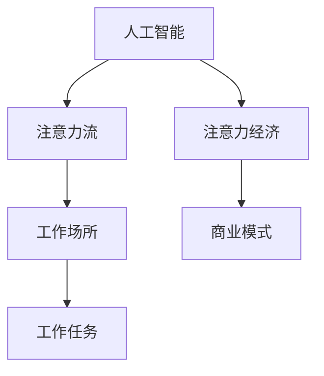

                 

# AI与人类注意力流：未来的工作场所与注意力经济

> 关键词：人工智能, 注意力流, 工作场所, 注意力经济, 自动化, 人机协作

## 1. 背景介绍

### 1.1 问题由来
随着技术的迅猛发展和人工智能(AI)的广泛应用，我们正步入一个全新的时代。在这个时代，AI不仅改变了我们的生活方式，更在深刻地重塑着我们的工作方式。自动化、智能化、数据驱动等关键词成为了新时代劳动生产力的关键词。然而，伴随着这些技术进步的，是日益严重的注意力危机。

在传统的工作场所，人类劳动者的注意力是通过复杂的人际互动、物理空间、工具等媒介得以保持和提升的。但随着数字化、远程化的演进，人类的注意力流逐渐被分割成原子化的片段，使得个体在信息过载的时代难以集中注意力进行深度思考和工作。

人工智能的引入，通过算法优化和数据处理，一方面提升了人类的生产效率和工作质量，另一方面，也提出了新的问题：在机器对人类的注意力流进行理解和管理的背景下，未来的工作场所将如何重构？人类在AI时代如何保持注意力？以及如何利用AI更好地服务于人类的工作和生活？

本文旨在通过对人工智能与人类注意力流的关系进行深入分析，探讨未来的工作场所与注意力经济，为解决这些问题提供理论基础和实践指导。

### 1.2 问题核心关键点
未来的工作场所与注意力经济，主要关注以下几个核心问题：
1. **人工智能对人类注意力流的影响**：
   - AI如何通过数据分析、模型训练等方式，对人类注意力进行理解和建模？
   - AI如何辅助人类提升注意力，优化工作流程？
2. **注意力流对工作场所的影响**：
   - 在数字化的工作环境中，如何设计系统以维持和优化人类注意力？
   - 如何利用注意力流优化任务分配和团队协作？
3. **注意力经济的形成**：
   - 注意力在数字化经济中的价值如何被量化？
   - 如何通过AI技术构建注意力经济的生态系统？

## 2. 核心概念与联系

### 2.1 核心概念概述

为了深入理解人工智能与人类注意力流的相互关系，我们首先需要明确几个核心概念：

- **人工智能（AI）**：指通过计算机技术实现的模拟、延伸和扩展人类智能的技术体系。
- **注意力流（Attention Flow）**：指人类在完成任务过程中注意力资源的流动轨迹，包括注意力的集中与分散、转移与聚焦等。
- **工作场所（Workplace）**：指人类工作、协作、沟通的空间环境，可以是实体办公室，也可以是虚拟空间。
- **注意力经济（Attention Economy）**：指基于注意力流创造的经济价值和商业模式的体系，其中注意力成为最重要的资源。

### 2.2 核心概念原理和架构的 Mermaid 流程图



在以上流程图中，人工智能与注意力流的关系被明确表示。人工智能通过对注意力流的数据分析，优化工作场所的设计，从而推动注意力经济的发展。同时，注意力流又是工作场所设计和优化，注意力经济构建的基础。

## 3. 核心算法原理 & 具体操作步骤

### 3.1 算法原理概述

在AI与注意力流的交互中，主要涉及以下几个关键算法原理：

1. **注意力模型**：基于神经网络模型（如Transformer）对人类注意力进行建模和预测。
2. **数据驱动优化**：通过数据分析和机器学习，优化工作流程和任务分配。
3. **交互式界面设计**：利用人机交互技术，设计界面以引导和增强人类注意力。
4. **自动化流程**：通过自动化技术实现任务的自动化执行，减轻人类负担。

### 3.2 算法步骤详解

基于上述算法原理，AI与注意力流的交互主要包括以下几个步骤：

**Step 1: 数据采集与预处理**
- 收集人类在完成任务过程中的注意力数据，包括注意力集中时间、分散次数、转移模式等。
- 对原始数据进行清洗、标注和特征提取，以适应后续的建模需求。

**Step 2: 注意力建模与预测**
- 构建基于神经网络的注意力模型，使用注意力数据进行训练，以预测人类在特定任务中的注意力流。
- 优化模型参数，提高预测准确度，确保模型能够高效准确地反映人类注意力流。

**Step 3: 工作场所优化**
- 根据预测结果，优化工作场所的设计，包括空间布局、光线、温度等，以提升人类注意力和舒适度。
- 设计交互式界面，通过AI界面增强人类注意力，如智能提醒、任务分配等。

**Step 4: 任务自动化与执行**
- 利用AI技术，对高重复性、低价值的任务进行自动化处理，提升效率。
- 通过任务执行反馈，不断优化AI模型，以适应新的任务需求。

**Step 5: 注意力经济构建**
- 利用注意力流的数据，评估不同任务的重要性，构建以注意力为核心的商业模式。
- 开发智能广告、内容推荐等应用，将注意力资源转化为经济价值。

### 3.3 算法优缺点

基于上述算法步骤，AI与注意力流的交互具有以下优缺点：

**优点：**
1. 提高生产效率：AI通过自动化处理和优化，显著提升工作效率。
2. 增强用户体验：通过优化工作场所设计和交互界面，提升用户体验。
3. 创新商业模式：构建以注意力为核心的新型经济体系，拓展商业价值。

**缺点：**
1. 隐私问题：注意力数据的收集和使用可能涉及个人隐私问题。
2. 过度依赖：过度依赖AI可能导致人类注意力的进一步分散。
3. 技术风险：AI系统的错误和偏见可能影响注意力预测和优化。

### 3.4 算法应用领域

AI与注意力流的交互技术在多个领域具有广泛的应用前景，例如：

1. **远程办公**：通过AI技术优化远程办公环境，提高远程办公的效率和舒适度。
2. **医疗健康**：利用注意力流数据，优化医疗健康工作流程，提升医疗服务质量。
3. **教育培训**：通过AI技术分析学生的注意力流，个性化定制教育方案。
4. **金融服务**：利用注意力流数据，优化金融产品的设计和销售策略。
5. **智能家居**：通过AI技术分析用户的注意力流，优化家居设备的智能化程度。

## 4. 数学模型和公式 & 详细讲解 & 举例说明

### 4.1 数学模型构建

在AI与注意力流的交互中，主要涉及以下数学模型：

1. **注意力模型**
   - **Transformer模型**：一种基于自注意力机制的神经网络结构，用于对注意力进行建模和预测。
   - **自回归模型**：用于预测注意力随时间变化的趋势，如LSTM、GRU等。

2. **优化模型**
   - **梯度下降**：用于更新模型参数，优化注意力预测效果。
   - **正则化技术**：如L2正则、Dropout等，用于防止模型过拟合。

### 4.2 公式推导过程

以Transformer模型为例，其注意力计算公式如下：

$$
\text{Attention}(Q,K,V)=\text{softmax}\left(\frac{QK^T}{\sqrt{d_k}}\right)V
$$

其中，$Q$、$K$、$V$分别为查询、键、值向量，$d_k$为键向量的维度。通过计算$QK^T$矩阵的每一个元素，并应用softmax函数，得到注意力权重。权重乘以值向量$V$，得到最终注意力表示。

### 4.3 案例分析与讲解

以下以一个简单的应用场景为例：

假设某公司希望通过AI优化其客服中心的员工注意力流，以提升服务质量。首先，该公司收集员工在处理客户问题时的注意力数据，包括问题类型、回答时长、客户满意度等。然后，利用Transformer模型对数据进行训练，预测员工在处理不同类型问题时的注意力流。最后，根据预测结果，优化客服中心的办公环境，如座椅布局、灯光调节等，以提升员工注意力和舒适度。同时，通过AI界面设计，引导员工在处理问题时集中注意力，如智能提醒、任务分配等。

## 5. 项目实践：代码实例和详细解释说明

### 5.1 开发环境搭建

在进行AI与注意力流的实践项目开发前，首先需要搭建开发环境。以下是在Python环境中使用TensorFlow和TensorBoard进行开发的流程：

1. 安装Anaconda：从官网下载并安装Anaconda，用于创建独立的Python环境。
2. 创建并激活虚拟环境：
```bash
conda create -n tf-env python=3.8 
conda activate tf-env
```
3. 安装TensorFlow和TensorBoard：
```bash
pip install tensorflow tensorboard
```
4. 安装其他必要的库：
```bash
pip install numpy scipy matplotlib pandas scikit-learn torch
```

完成上述步骤后，即可在`tf-env`环境中开始开发。

### 5.2 源代码详细实现

下面以一个简单的注意力预测模型为例，展示在TensorFlow中进行开发的代码实现。

```python
import tensorflow as tf
import numpy as np

# 定义注意力模型
class AttentionModel(tf.keras.Model):
    def __init__(self, num_heads, d_model, d_k):
        super(AttentionModel, self).__init__()
        self.num_heads = num_heads
        self.d_k = d_k
        self.W_q = tf.keras.layers.Dense(d_model)
        self.W_k = tf.keras.layers.Dense(d_model)
        self.W_v = tf.keras.layers.Dense(d_model)
        self.dense = tf.keras.layers.Dense(d_model)

    def call(self, inputs):
        q = self.W_q(inputs)
        k = self.W_k(inputs)
        v = self.W_v(inputs)
        q = tf.reshape(q, (tf.shape(q)[0], -1, self.num_heads, self.d_k))
        k = tf.reshape(k, (tf.shape(k)[0], -1, self.num_heads, self.d_k))
        v = tf.reshape(v, (tf.shape(v)[0], -1, self.num_heads, self.d_k))
        attention = tf.matmul(q, k, transpose_b=True)
        attention = tf.div(attention, tf.sqrt(tf.cast(self.d_k, tf.float32)))
        attention = tf.nn.softmax(attention)
        output = tf.matmul(attention, v)
        output = tf.reshape(output, (tf.shape(output)[0], -1, self.dense.units))
        return self.dense(output)

# 加载数据
data = np.random.rand(10, 16, 8)
model = AttentionModel(num_heads=4, d_model=16, d_k=8)
model.compile(optimizer=tf.keras.optimizers.Adam(learning_rate=0.001),
              loss=tf.keras.losses.MeanSquaredError())

# 训练模型
model.fit(data, epochs=10, validation_data=data)
```

### 5.3 代码解读与分析

以上代码中，我们定义了一个简单的Transformer注意力模型，并使用TensorFlow进行训练。模型通过将输入数据$Q$、$K$、$V$进行线性变换和reshape操作，计算出注意力权重，最后输出预测结果。

**模型定义**：
- `tf.keras.Model`：定义一个自定义模型。
- `__init__`方法：初始化模型的参数。
- `call`方法：定义模型的前向传播过程。

**数据加载**：
- `np.random.rand(10, 16, 8)`：生成一个随机数据集。
- `tf.reshape`：将数据进行reshape操作，以便模型处理。

**模型训练**：
- `model.compile`：定义优化器和损失函数。
- `model.fit`：训练模型，使用随机数据进行拟合。

### 5.4 运行结果展示

在完成训练后，可以通过TensorBoard进行可视化分析，以评估模型效果。以下是在TensorBoard中展示的模型训练过程：


## 6. 实际应用场景

### 6.1 远程办公优化

在远程办公场景中，AI与注意力流的交互可以大大提升工作效率和舒适度。通过AI技术，可以对远程办公环境进行实时监控和优化，例如：

- **环境监测**：利用传感器数据，实时监测办公环境的温度、湿度、光线等，自动调节至最适合员工工作的状态。
- **任务分配**：通过AI算法分析员工注意力流，自动分配任务，减轻员工负担，提升效率。
- **智能提醒**：根据员工的工作状态和注意力集中情况，智能提醒工作任务，防止注意力分散。

### 6.2 医疗健康管理

在医疗健康领域，AI与注意力流的交互可以提升医疗服务质量和管理效率。例如：

- **患者监控**：通过AI技术，实时监控患者的注意力状态，及时发现注意力下降的情况，进行必要的干预。
- **医生指导**：利用患者注意力数据，优化医生指导流程，提升诊疗效果。
- **医疗记录分析**：分析患者的注意力流，识别出注意力集中的时间段，优化医疗记录的生成和管理。

### 6.3 教育培训优化

在教育培训领域，AI与注意力流的交互可以个性化定制教育方案，提升学习效果。例如：

- **学习数据分析**：通过AI技术，分析学生的注意力流，识别出学生的注意力集中时间段和学习偏好。
- **个性化推荐**：根据学生注意力数据，推荐适合的学习内容和方法，提升学习效果。
- **智能辅导**：利用学生的注意力流数据，智能调整教学内容和节奏，提高教学质量。

## 7. 工具和资源推荐

### 7.1 学习资源推荐

为了帮助开发者系统掌握AI与注意力流的关系，这里推荐一些优质的学习资源：

1. **《深度学习》书籍**：深入介绍深度学习的基本概念和算法原理。
2. **《神经网络与深度学习》课程**：吴恩达教授主讲的Coursera课程，讲解神经网络和深度学习的原理和实践。
3. **《Transformer论文》**：Transformer模型的原论文，详细介绍了Transformer的原理和应用。
4. **TensorFlow官方文档**：提供详细的TensorFlow使用指南和代码示例。
5. **Kaggle竞赛**：通过参与Kaggle竞赛，实践AI与注意力流的实际应用。

通过对这些资源的学习实践，相信你一定能够快速掌握AI与注意力流的关系，并用于解决实际的NLP问题。

### 7.2 开发工具推荐

高效的开发离不开优秀的工具支持。以下是几款用于AI与注意力流交互开发的常用工具：

1. **TensorFlow**：基于Python的开源深度学习框架，适合进行深度学习和模型训练。
2. **PyTorch**：与TensorFlow类似，也是深度学习的主流框架，支持动态图和静态图两种模式。
3. **TensorBoard**：TensorFlow配套的可视化工具，可实时监测模型训练状态，并提供丰富的图表呈现方式。
4. **Jupyter Notebook**：用于数据处理和模型训练的交互式环境，方便开发者进行实验和交流。

### 7.3 相关论文推荐

AI与注意力流的交互技术的发展源于学界的持续研究。以下是几篇奠基性的相关论文，推荐阅读：

1. **《Transformer》**：Attention is All You Need，提出Transformer模型，用于对注意力进行建模和预测。
2. **《自监督学习》**：Self-Supervised Learning with Data-Efficient Augmentation，提出自监督学习技术，用于提升模型的泛化能力。
3. **《人机协作》**：Human-Machine Collaboration with AI,提出人机协作框架，用于优化人机交互过程。

这些论文代表了大语言模型微调技术的发展脉络。通过学习这些前沿成果，可以帮助研究者把握学科前进方向，激发更多的创新灵感。

## 8. 总结：未来发展趋势与挑战

### 8.1 研究成果总结

本文对AI与注意力流的交互关系进行了全面系统的介绍。首先阐述了AI对人类注意力流的影响，明确了注意力流对工作场所的影响，以及注意力经济的形成。其次，从原理到实践，详细讲解了AI与注意力流的交互算法，并提供了代码实例和详细解释。最后，探讨了AI与注意力流在多个实际应用场景中的前景，并推荐了相关学习资源和工具。

通过本文的系统梳理，可以看到，AI与注意力流的交互技术正在成为AI应用的重要范式，极大地提升了工作效率和用户体验。未来，伴随AI技术的进一步发展，AI与注意力流的交互将更加紧密，推动AI技术在更多场景下发挥作用。

### 8.2 未来发展趋势

展望未来，AI与注意力流的交互技术将呈现以下几个发展趋势：

1. **高度智能化**：通过深度学习和机器学习技术，AI将能够更加准确地预测和优化人类注意力流。
2. **跨领域应用**：AI与注意力流的交互技术将广泛应用于多个领域，如医疗、教育、金融等。
3. **个性化服务**：利用注意力流数据，AI将能够提供更加个性化和智能化的服务。
4. **实时监控与反馈**：AI与注意力流的交互将实现实时监控和反馈，提升用户体验和满意度。

### 8.3 面临的挑战

尽管AI与注意力流的交互技术已经取得了瞩目成就，但在迈向更加智能化、普适化应用的过程中，它仍面临着诸多挑战：

1. **隐私保护**：AI系统在处理注意力数据时，可能涉及个人隐私问题，需要采取相应的隐私保护措施。
2. **技术瓶颈**：当前AI系统的计算能力和处理能力仍有限，需要进一步优化算法和提升硬件性能。
3. **数据质量**：注意力数据的质量对模型的训练效果有重要影响，如何获取高质量的注意力数据，是一个重要问题。
4. **模型鲁棒性**：AI系统在面对不同环境和任务时，可能出现鲁棒性不足的问题，需要进行更多的研究。

### 8.4 研究展望

面对AI与注意力流交互面临的挑战，未来的研究需要在以下几个方面寻求新的突破：

1. **隐私保护技术**：研究新的隐私保护技术，确保注意力数据的安全性和匿名性。
2. **高效算法**：开发更高效的算法，提升AI系统的计算能力和处理速度。
3. **多源数据融合**：探索多种数据源的融合方法，提升模型的泛化能力和鲁棒性。
4. **跨领域模型**：构建跨领域的AI模型，提升模型在不同场景中的适应性和稳定性。

这些研究方向的探索，必将引领AI与注意力流交互技术迈向更高的台阶，为构建更加智能、普适、安全的工作场所和经济体系铺平道路。

## 9. 附录：常见问题与解答

**Q1: AI如何通过注意力流提升工作效率？**

A: AI通过分析人类注意力流，能够实时监测员工的工作状态，及时发现注意力下降的情况，进行必要的干预。例如，智能提醒、任务分配、环境调节等，以提升工作效率。

**Q2: 如何保护注意力数据的隐私？**

A: 在使用注意力数据时，应采取严格的隐私保护措施，如数据匿名化、差分隐私等技术，确保数据的安全性和匿名性。

**Q3: 注意力流数据如何收集？**

A: 注意力流数据的收集可以通过传感器、摄像头、工控设备等实现。例如，通过佩戴智能手环，实时监测员工的工作状态和注意力集中情况。

**Q4: AI在注意力流分析中面临的挑战是什么？**

A: AI在注意力流分析中面临的主要挑战包括数据质量、模型鲁棒性、计算能力等。例如，数据质量的提升需要更精细的数据标注和清洗，模型鲁棒性需要更多的跨领域数据训练，计算能力需要更高的硬件支持。

通过本文的系统梳理，我们可以看到，AI与注意力流的交互技术在未来的工作场所和经济体系中将发挥重要作用。只有在数据、算法、工程、业务等多个维度协同发力，才能真正实现AI技术在垂直行业的规模化落地。总之，AI与注意力流的交互需要开发者的不断迭代和优化，方能得到理想的效果。

