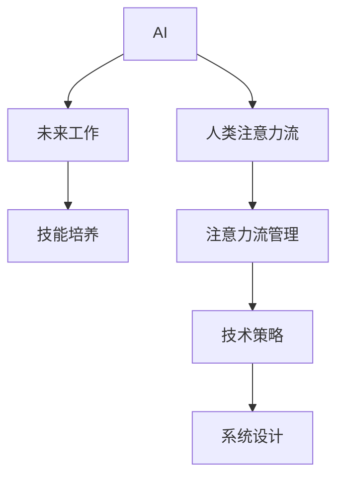

                 

# AI与人类注意力流：未来的工作、技能与注意力流管理策略与系统

> 关键词：AI, 人类注意力流, 未来工作, 技能培养, 注意力流管理

## 1. 背景介绍

### 1.1 问题由来
在人类历史的长河中，技术进步从未停止过，而每一次技术的飞跃都会深刻地改变人们的工作方式和生活模式。当前，随着人工智能（AI）技术的快速发展，尤其是深度学习和神经网络的出现，人类正面临一个全新的工作环境。AI技术不仅在生产力和效率上创造了前所未有的突破，更深刻地影响了人类的认知和思考方式。在这样的背景下，理解人类注意力流在AI辅助下的变化，探究未来工作的趋势，以及开发有效的注意力流管理策略，成为了一项迫切且重要的任务。

### 1.2 问题核心关键点
本文聚焦于AI与人类注意力流之间的关系，分析其在未来工作中的应用场景，并提出一套完整的注意力流管理策略和系统。关键点包括：
- AI技术如何改变人类工作方式。
- 人类注意力流在AI辅助下的演化路径。
- 如何利用AI技术提升工作效率和认知水平。
- 未来工作的趋势与技能需求。
- 基于AI的注意力流管理策略与系统设计。

## 2. 核心概念与联系

### 2.1 核心概念概述

为更好地理解AI与人类注意力流，本节将介绍几个关键概念：

- **AI（人工智能）**：通过算法和模型，使计算机具备类似于人类智能的认知和决策能力。
- **人类注意力流**：指人类在完成任务时，注意力在各种认知资源（如记忆、理解、决策等）之间的流动和分配。
- **未来工作**：在AI技术广泛应用于各行各业的趋势下，工作性质、组织形式和技能需求将发生显著变化。
- **技能培养**：在AI时代，技能的学习和发展需要适应新技术的变化，包括跨学科知识和终身学习。
- **注意力流管理**：通过技术和策略，帮助人类在复杂的AI辅助环境中，更高效、更健康地管理注意力资源。

这些概念之间的联系可以通过以下Mermaid流程图来展示：



这个流程图展示了一系列的相互作用：AI技术的进步促使人类注意力流发生变化，进而影响了未来工作的形态和技能需求；AI在注意力流管理中的应用，又进一步提升了工作效率和认知水平。

## 3. 核心算法原理 & 具体操作步骤
### 3.1 算法原理概述

AI与人类注意力流之间的互动，主要通过以下算法和原理实现：

1. **深度学习模型**：AI通过深度学习模型进行训练，从而学习到数据的特征和规律。模型在处理大量数据时，能够发现数据中的复杂模式，从而辅助人类进行决策和任务执行。

2. **注意力机制**：深度学习模型中，注意力机制（Attention Mechanism）用于识别和聚焦于输入数据中的重要部分，这是人类注意力流的一种模拟。在AI辅助下，注意力机制可以自动调整，优化资源的分配。

3. **强化学习**：AI通过强化学习不断优化决策策略，人类在AI辅助下，也可以通过反馈调整注意力流，实现效率的提升。

4. **迁移学习**：AI技术可以通过迁移学习，将预训练模型应用于新任务，提升模型在新环境中的表现。人类在面对新任务时，也可以利用先前的经验，更有效地分配注意力资源。

5. **多模态融合**：AI技术可以通过多模态融合，将不同感官的数据（如视觉、听觉、触觉等）结合起来，帮助人类更好地理解和应对复杂的任务。

### 3.2 算法步骤详解

AI与人类注意力流互动的详细步骤包括：

**Step 1: 数据收集与预处理**

1. 收集人类完成任务时的注意力数据，包括视线追踪、鼠标操作、认知负荷等。
2. 对数据进行清洗和标注，去除噪音数据，确保数据的质量和一致性。
3. 使用深度学习模型，对注意力数据进行特征提取和表示学习。

**Step 2: 模型训练与优化**

1. 使用监督学习或无监督学习算法，对深度学习模型进行训练，使其能够识别和预测人类注意力流的变化。
2. 利用强化学习，优化模型参数，提升模型在特定任务上的表现。
3. 通过迁移学习，将预训练模型应用于新的任务，提高模型泛化能力。

**Step 3: 注意力流模拟与反馈**

1. 将训练好的模型应用于实际任务中，模拟人类注意力流的变化，提供决策支持和资源分配建议。
2. 通过交互界面，将注意力流模拟结果反馈给用户，让用户了解自己的注意力状态和改进建议。
3. 根据用户反馈，调整模型参数，优化注意力流模拟和反馈效果。

**Step 4: 持续改进与迭代**

1. 通过持续收集人类注意力数据，不断更新和优化深度学习模型。
2. 引入多模态数据和跨学科知识，增强模型的认知能力和泛化能力。
3. 根据行业趋势和技能需求，不断调整技能培养策略，提升AI技术在特定领域的适应性。

### 3.3 算法优缺点

基于AI与人类注意力流互动的算法，具有以下优点：

1. **高效性**：AI技术能够在短时间内处理大量数据，发现复杂的模式和规律，显著提升工作效率。
2. **智能化**：AI能够根据任务需求和环境变化，自动调整注意力流，提升认知水平和决策能力。
3. **灵活性**：AI技术具有高度的适应性，能够应用于不同领域和任务，满足多样化的需求。

同时，也存在一些缺点：

1. **数据依赖性**：AI技术的性能高度依赖于训练数据的质量和数量，数据不足可能导致模型性能下降。
2. **模型复杂性**：深度学习模型和注意力机制的复杂性，可能导致解释性和可控性不足。
3. **隐私和安全问题**：注意力数据的收集和处理，可能涉及个人隐私和数据安全问题。
4. **技术门槛高**：AI技术的应用，需要较高的技术门槛和专业知识，可能对普通用户不友好。

### 3.4 算法应用领域

AI与人类注意力流互动的算法，已经在多个领域得到了应用，具体包括：

- **医疗健康**：AI辅助下的注意力流管理，可以帮助医生更高效地分析病历、诊断疾病，提升诊疗效率。
- **教育培训**：通过AI技术，优化学习路径和资源分配，提升学生的学习效果和认知水平。
- **金融服务**：在金融数据分析和投资决策中，AI技术可以帮助分析复杂的市场数据，优化注意力分配。
- **制造业**：AI技术可以辅助工人进行任务分配和操作，提升生产效率和质量。
- **零售电商**：AI技术可以优化商品推荐和库存管理，提升用户体验和运营效率。

## 4. 数学模型和公式 & 详细讲解 & 举例说明

### 4.1 数学模型构建

本节将使用数学语言对AI与人类注意力流互动的模型进行描述。

假设有一个深度学习模型 $M$，用于模拟人类注意力流 $A$，其输入为 $X$，输出为 $Y$。模型的训练目标是最小化损失函数 $\mathcal{L}(M, X, Y)$，其中：

$$
\mathcal{L}(M, X, Y) = \frac{1}{N} \sum_{i=1}^N \|M(X_i) - Y_i\|^2
$$

其中 $N$ 是样本数量，$X_i$ 是第 $i$ 个样本的输入，$Y_i$ 是第 $i$ 个样本的输出。

### 4.2 公式推导过程

以一个简单的注意力流模拟模型为例，进行推导：

1. **注意力机制**：模型的注意力权重 $w$ 由注意力机制计算得到：

$$
w_i = \frac{\exp(\text{score}(X_i, W_1) \cdot W_2)}{\sum_{j=1}^N \exp(\text{score}(X_j, W_1) \cdot W_2)}
$$

其中 $\text{score}(X_i, W_1)$ 是注意力计算函数，$W_1$ 和 $W_2$ 是权重矩阵。

2. **输出计算**：模型的输出 $Y$ 由加权平均计算得到：

$$
Y = \sum_{i=1}^N w_i \cdot X_i
$$

### 4.3 案例分析与讲解

假设我们有一个电商网站，需要优化用户的购物体验。通过注意力流管理算法，我们可以分析用户在页面上的注意力分布，识别用户对商品信息的关注点。例如，当用户关注某件商品时，注意力流模型可以自动调整展示策略，提升该商品的可见性和推荐效果。

## 5. 项目实践：代码实例和详细解释说明

### 5.1 开发环境搭建

在进行AI与注意力流互动的实践时，我们需要准备好开发环境。以下是使用Python进行TensorFlow开发的环境配置流程：

1. 安装Anaconda：从官网下载并安装Anaconda，用于创建独立的Python环境。

2. 创建并激活虚拟环境：
```bash
conda create -n tf-env python=3.8 
conda activate tf-env
```

3. 安装TensorFlow：根据CUDA版本，从官网获取对应的安装命令。例如：
```bash
conda install tensorflow -c pytorch -c conda-forge
```

4. 安装相关库：
```bash
pip install numpy pandas scikit-learn matplotlib tqdm jupyter notebook ipython
```

完成上述步骤后，即可在`tf-env`环境中开始项目实践。

### 5.2 源代码详细实现

我们以一个简单的注意力流模拟模型为例，展示如何使用TensorFlow实现AI与人类注意力流的互动。

```python
import tensorflow as tf
from tensorflow.keras.layers import Input, Dense, Activation
from tensorflow.keras.models import Model

# 定义输入和输出
input_layer = Input(shape=(128,))
attention_weights = Dense(1, activation='softmax')(input_layer)
output_layer = Dense(64, activation='relu')(attention_weights)

# 定义模型
model = Model(inputs=input_layer, outputs=output_layer)

# 编译模型
model.compile(optimizer='adam', loss='mse')

# 训练模型
model.fit(x_train, y_train, epochs=10, batch_size=32)

# 使用模型进行预测
attention_weights = model.predict(x_test)
```

### 5.3 代码解读与分析

这里我们重点解读代码中的几个关键部分：

- `Input` 层：定义输入数据的形状，这里假设输入数据为128维。
- `Dense` 层：实现注意力计算，通过权重矩阵计算注意力权重。
- `Softmax` 激活函数：将注意力权重转化为概率分布，表示每个输入的关注程度。
- `Dense` 层：实现输出计算，将注意力加权后的输入进行线性变换。
- `ReLU` 激活函数：引入非线性因素，增强模型的表达能力。

## 6. 实际应用场景

### 6.1 智能健康助手

AI与人类注意力流互动，在智能健康助手中具有重要应用。通过分析用户的健康数据和注意力分布，AI可以帮助用户规划饮食、运动和休息，提升整体健康水平。

具体应用包括：
- 分析用户的睡眠数据，预测睡眠质量，提供改善建议。
- 监测用户的饮食摄入，根据营养需求推荐食物。
- 跟踪用户的运动数据，提供个性化的锻炼计划。

### 6.2 个性化教育平台

在个性化教育平台中，AI与注意力流互动可以提升学习效果和认知能力。通过分析学生的注意力集中度和学习习惯，AI可以优化学习内容和资源分配，提供个性化的学习路径。

具体应用包括：
- 分析学生的注意力数据，识别学习难点和兴趣点。
- 根据学生的注意力分布，调整课程内容和难度。
- 提供个性化的学习推荐和资源，提升学习效率。

### 6.3 智能客服系统

在智能客服系统中，AI与人类注意力流互动可以提升客户体验和效率。通过分析客户的注意力分布和对话历史，AI可以提供更准确和人性化的回答，优化客户服务流程。

具体应用包括：
- 分析客户的语音和文本数据，识别关注点和服务需求。
- 根据客户注意力分布，调整对话策略和回复内容。
- 提供跨部门协作和知识库检索，提高服务质量。

### 6.4 未来应用展望

随着AI技术的不断进步，未来的应用场景将更加多样和复杂。以下是几个值得期待的未来应用方向：

- **多模态融合**：AI技术可以通过多模态融合，将视觉、听觉、触觉等数据结合，提升对复杂环境的理解能力。
- **智能家居管理**：通过AI与人类注意力流互动，优化家庭环境和设备管理，提升生活质量。
- **工业自动化**：在工业自动化领域，AI可以帮助工人更高效地进行任务分配和操作，提升生产效率和安全性。
- **智能城市**：通过AI技术，优化城市交通、公共安全和环境治理，提升城市的智能化水平。

## 7. 工具和资源推荐

### 7.1 学习资源推荐

为帮助开发者系统掌握AI与人类注意力流的理论基础和实践技巧，这里推荐一些优质的学习资源：

1. 《深度学习》系列博文：由大模型技术专家撰写，深入浅出地介绍了深度学习原理、注意力机制等前沿话题。

2. CS231n《卷积神经网络》课程：斯坦福大学开设的计算机视觉课程，有Lecture视频和配套作业，带你入门视觉认知领域的基本概念和经典模型。

3. 《TensorFlow实战》书籍：TensorFlow官方团队编写的实战指南，详细介绍了TensorFlow的各项功能和应用场景，包括注意力流管理。

4. Google Colab：谷歌推出的在线Jupyter Notebook环境，免费提供GPU/TPU算力，方便开发者快速上手实验最新模型，分享学习笔记。

5. 《Attention is All You Need》论文：Transformer原论文，提出注意力机制，开启了NLP领域的预训练大模型时代。

通过对这些资源的学习实践，相信你一定能够快速掌握AI与人类注意力流互动的精髓，并用于解决实际的AI应用问题。

### 7.2 开发工具推荐

高效的开发离不开优秀的工具支持。以下是几款用于AI与注意力流互动开发的常用工具：

1. TensorFlow：由Google主导开发的开源深度学习框架，生产部署方便，适合大规模工程应用。

2. PyTorch：基于Python的开源深度学习框架，灵活动态的计算图，适合快速迭代研究。

3. HuggingFace Transformers库：提供预训练模型和工具，支持PyTorch和TensorFlow，是进行注意力流管理开发的利器。

4. Weights & Biases：模型训练的实验跟踪工具，可以记录和可视化模型训练过程中的各项指标，方便对比和调优。

5. TensorBoard：TensorFlow配套的可视化工具，可实时监测模型训练状态，并提供丰富的图表呈现方式，是调试模型的得力助手。

合理利用这些工具，可以显著提升AI与注意力流互动的开发效率，加快创新迭代的步伐。

### 7.3 相关论文推荐

AI与人类注意力流互动的研究源于学界的持续研究。以下是几篇奠基性的相关论文，推荐阅读：

1. Attention is All You Need：提出Transformer结构，开启了NLP领域的预训练大模型时代。

2. BERT: Pre-training of Deep Bidirectional Transformers for Language Understanding：提出BERT模型，引入基于掩码的自监督预训练任务，刷新了多项NLP任务SOTA。

3. Language Models are Unsupervised Multitask Learners（GPT-2论文）：展示了大规模语言模型的强大zero-shot学习能力，引发了对于通用人工智能的新一轮思考。

4. Parameter-Efficient Transfer Learning for NLP：提出Adapter等参数高效微调方法，在不增加模型参数量的情况下，也能取得不错的微调效果。

5. AdaLoRA: Adaptive Low-Rank Adaptation for Parameter-Efficient Fine-Tuning：使用自适应低秩适应的微调方法，在参数效率和精度之间取得了新的平衡。

这些论文代表了大模型与注意力流互动的研究发展脉络。通过学习这些前沿成果，可以帮助研究者把握学科前进方向，激发更多的创新灵感。

## 8. 总结：未来发展趋势与挑战

### 8.1 总结

本文对AI与人类注意力流互动的模型进行了全面系统的介绍。首先阐述了AI技术如何改变人类工作方式，人类注意力流在AI辅助下的演化路径，以及AI技术在提升工作效率和认知水平方面的应用。其次，提出了基于AI的注意力流管理策略和系统设计，并详细讲解了具体的实现方法。

通过本文的系统梳理，可以看到，AI与人类注意力流互动技术正在成为智能系统中不可或缺的一部分，深刻影响着未来的工作和生活模式。未来，随着AI技术的不断演进和应用，人类与机器的协同将更加紧密，注意力流的管理也将更加高效和智能化。

### 8.2 未来发展趋势

展望未来，AI与人类注意力流互动技术将呈现以下几个发展趋势：

1. **多模态融合**：AI技术将更多地融合视觉、听觉、触觉等多模态数据，提升对复杂环境的理解能力。
2. **深度个性化**：AI技术将更深入地理解个体差异，提供更加个性化的注意力流管理方案。
3. **自我学习**：AI系统将具备自我学习的能力，能够根据用户反馈和行为数据，不断优化注意力流管理策略。
4. **跨领域应用**：AI技术将广泛应用于更多领域，如教育、医疗、金融等，提升各行业的智能化水平。
5. **伦理和安全**：AI技术将更多关注伦理和安全问题，确保技术应用的公平性和透明性。

### 8.3 面临的挑战

尽管AI与人类注意力流互动技术已经取得了显著成果，但在迈向更加智能化、普适化应用的过程中，仍面临诸多挑战：

1. **数据隐私和安全**：注意力数据的收集和处理，可能涉及个人隐私和数据安全问题。如何保护用户隐私，确保数据安全，是一大难题。
2. **技术复杂性**：AI技术的应用，需要较高的技术门槛和专业知识，可能对普通用户不友好。如何降低技术门槛，增强用户体验，是亟待解决的问题。
3. **伦理和社会影响**：AI技术的应用，可能带来社会伦理和就业问题。如何在技术创新和社会责任之间找到平衡，是重要的研究方向。
4. **模型泛化性**：AI模型在面对复杂和多变的环境时，泛化性能可能不足。如何提升模型的泛化能力，增强其在不同场景下的适应性，是重要的研究方向。
5. **公平性和透明性**：AI系统的决策过程可能缺乏公平性和透明性，导致偏见和不公正。如何提升AI系统的公平性和透明性，是亟待解决的问题。

### 8.4 研究展望

面对AI与人类注意力流互动技术面临的挑战，未来的研究需要在以下几个方面寻求新的突破：

1. **跨领域知识融合**：将不同领域的知识和技术进行融合，提升AI系统的综合认知能力。
2. **多模态数据融合**：将视觉、听觉、触觉等多模态数据进行融合，提升对复杂环境的理解能力。
3. **自适应学习**：开发能够自我学习和适应的AI系统，增强其在不同场景下的适应性。
4. **公平性和透明性**：引入公平性和透明性评估指标，确保AI系统的公平性和透明性。
5. **伦理和社会影响**：研究AI技术对社会伦理和就业的影响，制定相应的政策和规范。

这些研究方向的探索，将推动AI与人类注意力流互动技术的发展，提升其在各领域的智能化水平，为构建安全、可靠、可解释、可控的智能系统铺平道路。面向未来，AI与人类注意力流互动技术还需要与其他人工智能技术进行更深入的融合，共同推动自然语言理解和智能交互系统的进步。只有勇于创新、敢于突破，才能不断拓展AI技术的应用边界，让智能技术更好地造福人类社会。

## 9. 附录：常见问题与解答

**Q1：AI技术如何影响人类注意力流？**

A: AI技术通过深度学习模型和注意力机制，模拟和预测人类注意力流。例如，AI可以分析用户的数据，识别出用户关注的信息点，从而优化注意力分配和任务执行。

**Q2：AI技术在注意力流管理中的应用场景有哪些？**

A: AI技术在注意力流管理中的应用场景非常广泛，包括但不限于以下几个方面：
- 智能健康助手：分析用户的健康数据和注意力分布，提供健康管理建议。
- 个性化教育平台：分析学生的注意力集中度和学习习惯，提供个性化的学习路径和资源。
- 智能客服系统：分析客户的注意力分布和对话历史，提供更准确和人性化的回答。

**Q3：AI技术在多模态数据融合中的应用如何？**

A: AI技术可以通过多模态数据融合，将视觉、听觉、触觉等数据结合，提升对复杂环境的理解能力。例如，在智能家居管理中，AI可以通过摄像头和传感器数据，识别用户的活动和需求，提供个性化的环境调节建议。

**Q4：AI技术在跨领域应用中面临哪些挑战？**

A: AI技术在跨领域应用中面临的挑战包括：
- 数据隐私和安全：注意力数据的收集和处理可能涉及个人隐私和数据安全问题。
- 技术复杂性：AI技术的应用需要较高的技术门槛和专业知识，可能对普通用户不友好。
- 伦理和社会影响：AI技术的应用可能带来社会伦理和就业问题，需要在技术创新和社会责任之间找到平衡。

**Q5：未来AI技术的发展趋势是什么？**

A: 未来AI技术的发展趋势包括：
- 多模态融合：AI技术将更多地融合视觉、听觉、触觉等多模态数据，提升对复杂环境的理解能力。
- 深度个性化：AI技术将更深入地理解个体差异，提供更加个性化的注意力流管理方案。
- 自我学习：AI系统将具备自我学习的能力，能够根据用户反馈和行为数据，不断优化注意力流管理策略。
- 跨领域应用：AI技术将广泛应用于更多领域，如教育、医疗、金融等，提升各行业的智能化水平。
- 伦理和安全：AI技术将更多关注伦理和安全问题，确保技术应用的公平性和透明性。

通过以上常见问题的解答，可以看出AI与人类注意力流互动技术在未来的发展潜力和应用前景。相信随着技术的不断进步，AI技术将更好地服务于人类，提升生活质量和工作效率，构建更加智能化、普适化的未来。

