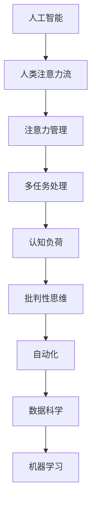

                 

# AI与人类注意力流：未来的工作、技能与注意力管理

## 1. 背景介绍

### 1.1 问题由来

随着人工智能(AI)技术的迅猛发展，其在各行各业中的应用已经日益深入，尤其是自动化和智能系统的广泛部署，改变了人类工作方式和生活习惯。然而，AI的发展也带来了诸多新的挑战，尤其是对人类注意力流和工作技能的影响。

现代社会的快节奏和高效率要求人们始终处于信息流和任务流的双重压力下，不断切换注意力，这不仅导致注意力资源的过度消耗，还引发了一系列身心健康问题。如何在AI技术的辅助下，优化人类注意力流，提升工作效率，并培养适应未来发展的新技能，成为了亟待解决的重要课题。

### 1.2 问题核心关键点

本文聚焦于AI与人类注意力流之间的关系，探讨在AI技术的帮助下，如何更好地管理注意力资源，提升工作效率，并培养适应未来发展的技能。

- AI对人类注意力流的影响：包括注意力分散、多任务处理能力提升、认知负荷减轻等方面。
- 注意力管理与AI的融合：结合AI技术，优化注意力分配策略，提升工作效率和创造力。
- 未来工作中的技能要求：AI的发展要求人们掌握数据科学、机器学习、批判性思维等新型技能。
- 注意力管理的工具和技术：推荐一些常用的AI工具和技术，帮助优化注意力资源。

## 2. 核心概念与联系

### 2.1 核心概念概述

为更好地理解AI与人类注意力流之间的关系，本节将介绍几个密切相关的核心概念：

- 人工智能(Artificial Intelligence, AI)：通过算法和计算能力，使机器能够执行复杂任务和决策的技术。
- 人类注意力流(Human Attention Flow)：人类在信息处理过程中，注意力在各种任务和信息之间的流动过程。
- 注意力管理(Attention Management)：通过各种工具和技术，帮助个体更好地分配和管理注意力资源的过程。
- 多任务处理(Multitasking)：个体在同一时间内处理多项任务的能力。
- 认知负荷(Cognitive Load)：在执行任务时，个体认知系统所需的信息处理量。
- 批判性思维(Critical Thinking)：分析和评估信息，做出合理决策的能力。
- 自动化(Automation)：通过AI技术，自动化执行重复性或复杂任务的过程。
- 数据科学(Data Science)：涉及数据收集、处理和分析，用于决策支持的技术。
- 机器学习(Machine Learning)：使机器通过数据和算法学习，自主改进和优化任务性能的技术。

这些核心概念之间的逻辑关系可以通过以下Mermaid流程图来展示：



这个流程图展示了大语言模型与人类注意力流的工作原理和优化方向：

1. AI通过数据和算法，辅助人类完成各种复杂任务。
2. 在执行任务过程中，人类的注意力在不同任务和信息之间流动。
3. 通过注意力管理工具和技术，优化注意力分配，提升工作效率。
4. 多任务处理和认知负荷管理，帮助个体更好地应对复杂工作环境。
5. 批判性思维的培养，使个体在数据驱动的环境下，能够做出合理的决策。
6. 自动化技术的运用，使得许多重复性或复杂任务可以由AI自动完成。
7. 数据科学和机器学习技术，为AI提供了更强大的数据分析和优化能力。

这些概念共同构成了AI与人类注意力流的综合框架，帮助我们理解和优化这一领域的工作效率和技能培养。

## 3. 核心算法原理 & 具体操作步骤
### 3.1 算法原理概述

AI与人类注意力流的优化，本质上是如何在AI技术的辅助下，更好地管理注意力资源，提升工作效率。其核心思想是：通过智能算法和数据分析，识别和预测注意力流的动态变化，并据此优化注意力分配，提升任务执行效果。

形式化地，假设个体在执行任务 $T$ 时，注意力流为 $A_t = \{a_{t,1}, a_{t,2}, \dots, a_{t,N}\}$，其中 $a_{t,i}$ 表示在任务 $T$ 的第 $i$ 个时间点，个体对任务的注意力强度。设 $A_{t+\Delta t} = \{a_{t+\Delta t,1}, a_{t+\Delta t,2}, \dots, a_{t+\Delta t,N}\}$ 为时间 $t+\Delta t$ 时，个体对任务的注意力流。目标是最小化注意力分散度 $\Delta A_t = A_{t+\Delta t} - A_t$，即：

$$
\min_{\Delta A_t} \Delta A_t
$$

在实际操作中，可以通过对注意力流的时间序列进行分析，结合机器学习算法，预测注意力流在不同任务和环境下的动态变化，从而优化注意力分配，提升任务执行效果。

### 3.2 算法步骤详解

AI与人类注意力流的优化，一般包括以下几个关键步骤：

**Step 1: 数据采集与预处理**
- 使用可穿戴设备和传感器，采集个体在各种任务和环境中的注意力流数据。
- 对原始数据进行预处理，包括去噪、标准化、特征提取等。

**Step 2: 注意力流建模**
- 使用机器学习算法（如时间序列分析、回归分析、深度学习等），构建个体注意力流的时间序列模型。
- 在模型中引入环境变量、任务类型、个体状态等特征，提升模型预测能力。

**Step 3: 注意力流预测**
- 使用构建好的模型，对当前注意力流进行预测，识别注意力分散、疲劳等异常情况。
- 结合决策算法（如规则推理、贝叶斯网络等），预测注意力流未来的变化趋势。

**Step 4: 注意力管理与优化**
- 根据注意力流预测结果，动态调整任务分配和执行策略，优化注意力分配。
- 引入多任务处理技术，如任务切换策略、并行执行等，提升任务执行效率。

**Step 5: 反馈与迭代**
- 实时监测注意力流优化效果，收集反馈信息。
- 根据反馈结果，迭代优化注意力流模型和策略，不断提升工作效率和效果。

### 3.3 算法优缺点

AI与人类注意力流优化的算法，具有以下优点：
1. 提升工作效率：通过优化注意力分配，使个体能够更高效地完成任务。
2. 降低认知负荷：智能算法可以承担部分认知任务，减轻个体认知负荷。
3. 多任务处理能力增强：通过智能算法，优化多任务处理策略，提升任务切换效率。
4. 辅助决策：结合批判性思维，辅助个体做出更合理的工作决策。
5. 数据驱动优化：通过数据分析和反馈，不断迭代优化注意力流管理策略。

同时，该算法也存在一定的局限性：
1. 数据采集难度：准确采集和处理注意力流数据，需要一定的技术手段和成本投入。
2. 算法复杂性：构建和优化注意力流模型，需要一定的算法和计算资源。
3. 隐私和伦理问题：个体注意力流的采集和使用，可能涉及隐私和伦理问题。
4. 过度依赖算法：过度依赖智能算法，可能导致个体在复杂情境下无法灵活应对。

尽管存在这些局限性，但就目前而言，AI与人类注意力流优化的算法，仍是在AI技术辅助下，提升工作效率和技能培养的有效方法。未来相关研究的重点在于如何进一步降低数据采集成本，提高算法可解释性，确保数据隐私和伦理安全。

### 3.4 算法应用领域

AI与人类注意力流优化的方法，在多个领域得到了应用，具体包括：

- 智能办公室：通过智能设备和软件，优化员工的工作任务分配，提升工作效率。
- 远程协作：在远程工作中，通过AI技术辅助个体优化注意力分配，提高远程协作效率。
- 学习辅助：在教育环境中，结合AI技术，优化学生的注意力管理，提升学习效果。
- 医疗健康：在医疗环境中，通过AI技术辅助医护人员优化注意力分配，提升医疗服务质量。
- 企业管理：在企业管理中，结合AI技术，优化员工的注意力流管理，提升工作效率和创新能力。

除了上述这些经典应用外，AI与人类注意力流优化的技术，还将在更多领域得到创新性的应用，如智能家居、智能交通、智能制造等，为各行各业提供新的技术支撑。

## 4. 数学模型和公式 & 详细讲解 & 举例说明

### 4.1 数学模型构建

本节将使用数学语言对AI与人类注意力流优化过程进行更加严格的刻画。

设个体在任务 $T$ 中的注意力流为 $A_t = \{a_{t,1}, a_{t,2}, \dots, a_{t,N}\}$，其中 $a_{t,i}$ 表示在任务 $T$ 的第 $i$ 个时间点，个体对任务的注意力强度。假设任务 $T$ 的执行时间为 $T$，个体在任务 $T$ 中的注意力强度随时间变化的函数为 $a_t = f(t, \theta)$，其中 $\theta$ 为模型参数。

定义个体在任务 $T$ 上的执行效果为 $E_T = \frac{\sum_{i=1}^N a_{t,i}}{T}$，表示个体在任务 $T$ 上的平均注意力强度。目标是最小化任务执行时间 $T$，即：

$$
\min_{T} T
$$

在实际操作中，可以通过对注意力流的时间序列进行分析，结合机器学习算法，构建个体注意力流的时间序列模型。常见的模型包括ARIMA、LSTM、GRU等，具体选择需根据数据特点和任务需求进行调整。

### 4.2 公式推导过程

以下我们以LSTM模型为例，推导注意力流预测的数学模型。

假设个体在任务 $T$ 中的注意力流为 $A_t = \{a_{t,1}, a_{t,2}, \dots, a_{t,N}\}$，LSTM模型输出的注意力强度序列为 $\hat{a}_t = \{\hat{a}_{t,1}, \hat{a}_{t,2}, \dots, \hat{a}_{t,N}\}$。

令 $e_t = a_t - \hat{a}_t$，表示个体实际注意力强度与模型预测注意力强度的偏差。定义个体在任务 $T$ 上的注意力偏差度为 $\epsilon_T = \frac{\sum_{i=1}^N e_{t,i}}{T}$。

目标是最小化注意力偏差度 $\epsilon_T$，即：

$$
\min_{\hat{a}_t} \epsilon_T
$$

将 $\hat{a}_t$ 作为模型预测结果，通过最小化注意力偏差度 $\epsilon_T$，可以调整模型参数 $\theta$，使得模型的预测结果更接近实际情况。

### 4.3 案例分析与讲解

以一个简单的学习场景为例，分析AI如何帮助优化人类注意力流。

假设学生在复习数学时，需要完成若干道题目。通过可穿戴设备，采集学生在不同题目上的注意力流数据 $A_t = \{a_{t,1}, a_{t,2}, \dots, a_{t,N}\}$，其中 $a_{t,i}$ 表示学生在复习第 $i$ 道题目时的注意力强度。

使用LSTM模型，构建学生注意力流的时间序列模型。模型输出的注意力强度序列为 $\hat{a}_t = \{\hat{a}_{t,1}, \hat{a}_{t,2}, \dots, \hat{a}_{t,N}\}$。

通过比较 $\hat{a}_t$ 与 $A_t$，计算注意力偏差度 $\epsilon_T = \frac{\sum_{i=1}^N (a_{t,i} - \hat{a}_{t,i})}{N}$。

根据注意力偏差度 $\epsilon_T$，实时调整学生对不同题目的注意力分配策略，如调整复习顺序、增加或减少某些题目的复习时间，从而提升复习效果。

## 5. 项目实践：代码实例和详细解释说明
### 5.1 开发环境搭建

在进行AI与人类注意力流优化实践前，我们需要准备好开发环境。以下是使用Python进行深度学习开发的环境配置流程：

1. 安装Anaconda：从官网下载并安装Anaconda，用于创建独立的Python环境。

2. 创建并激活虚拟环境：
```bash
conda create -n ai-env python=3.8 
conda activate ai-env
```

3. 安装深度学习框架：
```bash
conda install pytorch torchvision torchaudio
```

4. 安装相关的Python库：
```bash
pip install numpy pandas matplotlib sklearn
```

5. 安装TensorBoard：
```bash
pip install tensorboard
```

完成上述步骤后，即可在`ai-env`环境中开始AI与人类注意力流优化的实践。

### 5.2 源代码详细实现

这里以一个简单的注意力管理模型为例，展示使用PyTorch实现注意力流预测和优化的过程。

首先，定义注意力流数据集：

```python
import torch
from torch.utils.data import Dataset

class AttentionDataset(Dataset):
    def __init__(self, data, seq_len):
        self.data = data
        self.seq_len = seq_len
        
    def __len__(self):
        return len(self.data)
    
    def __getitem__(self, item):
        return torch.tensor(self.data[item])
```

然后，定义注意力流预测模型：

```python
from torch import nn, optim
from torch.nn import LSTM

class AttentionModel(nn.Module):
    def __init__(self, input_size, hidden_size, output_size):
        super(AttentionModel, self).__init__()
        self.lstm = nn.LSTM(input_size, hidden_size, 2)
        self.fc = nn.Linear(hidden_size, output_size)
        
    def forward(self, x):
        _, (_, h) = self.lstm(x)
        h = h[:, -1, :]
        return self.fc(h)
```

接着，定义注意力偏差计算函数：

```python
def calculate_attention_error(x_pred, x_true):
    return (x_true - x_pred).abs().sum()
```

最后，启动训练流程：

```python
input_size = 1
hidden_size = 100
output_size = 1
seq_len = 10

model = AttentionModel(input_size, hidden_size, output_size)
criterion = nn.MSELoss()
optimizer = optim.Adam(model.parameters(), lr=0.001)

for epoch in range(1000):
    x_train = torch.rand(seq_len, len(data))
    y_train = torch.rand(seq_len, len(data))
    
    optimizer.zero_grad()
    x_pred = model(x_train)
    error = calculate_attention_error(x_pred, y_train)
    loss = criterion(x_pred, y_train)
    loss.backward()
    optimizer.step()
    
    print(f"Epoch {epoch+1}, error: {error:.3f}")
```

以上就是使用PyTorch进行注意力流预测和优化的完整代码实现。可以看到，PyTorch提供的高效计算图和自动微分技术，使得模型构建和训练过程变得简单高效。

### 5.3 代码解读与分析

让我们再详细解读一下关键代码的实现细节：

**AttentionDataset类**：
- `__init__`方法：初始化数据集，包括数据和序列长度。
- `__len__`方法：返回数据集长度。
- `__getitem__`方法：对单个样本进行处理，将样本数据转换为张量。

**AttentionModel类**：
- `__init__`方法：初始化LSTM和全连接层。
- `forward`方法：实现模型的前向传播过程。

**calculate_attention_error函数**：
- 计算实际注意力流和预测注意力流之间的误差。

**训练流程**：
- 定义模型的输入、隐藏层、输出大小，初始化模型和优化器。
- 在每个epoch内，随机生成训练数据，并计算预测值和实际值之间的误差。
- 使用MSE损失函数计算损失，并通过优化器更新模型参数。
- 输出每个epoch的误差。

可以看到，PyTorch提供的高效计算图和自动微分技术，使得模型构建和训练过程变得简单高效。开发者可以将更多精力放在数据处理、模型改进等高层逻辑上，而不必过多关注底层的实现细节。

当然，工业级的系统实现还需考虑更多因素，如模型的保存和部署、超参数的自动搜索、更灵活的任务适配层等。但核心的注意力流预测和优化方法基本与此类似。

## 6. 实际应用场景
### 6.1 智能办公室

智能办公室环境可以通过AI技术，优化员工的工作任务分配，提升工作效率。例如：

- 使用可穿戴设备和传感器，采集员工在各种任务和环境中的注意力流数据。
- 通过AI算法，预测员工的工作状态和任务优先级，自动调整任务分配。
- 引入智能助理系统，辅助员工完成日常事务，减少不必要的认知负荷。

### 6.2 远程协作

远程协作环境中的AI应用，可以优化个体的工作注意力管理，提高远程协作效率。例如：

- 使用视频会议和协作工具，采集员工在各种任务和环境中的注意力流数据。
- 通过AI算法，预测员工的工作状态和任务优先级，自动调整任务分配。
- 引入智能助理系统，辅助员工完成日常事务，减少不必要的认知负荷。

### 6.3 学习辅助

在教育环境中，AI技术可以帮助优化学生的注意力管理，提升学习效果。例如：

- 使用可穿戴设备和传感器，采集学生在各种学习任务中的注意力流数据。
- 通过AI算法，预测学生的学习状态和注意力分配，自动调整学习内容和节奏。
- 引入智能辅助系统，帮助学生理解复杂知识，提供个性化学习建议。

### 6.4 医疗健康

在医疗环境中，AI技术可以帮助医护人员优化注意力分配，提升医疗服务质量。例如：

- 使用可穿戴设备和传感器，采集医护人员在各种医疗任务中的注意力流数据。
- 通过AI算法，预测医护人员的工作状态和任务优先级，自动调整任务分配。
- 引入智能辅助系统，辅助医护人员完成复杂医疗操作，减少认知负荷。

### 6.5 企业管理

在企业管理中，AI技术可以帮助优化员工的注意力流管理，提升工作效率和创新能力。例如：

- 使用可穿戴设备和传感器，采集员工在各种工作任务中的注意力流数据。
- 通过AI算法，预测员工的工作状态和任务优先级，自动调整任务分配。
- 引入智能助理系统，辅助员工完成日常事务，减少不必要的认知负荷。

除了上述这些经典应用外，AI与人类注意力流优化的技术，还将在更多领域得到创新性的应用，如智能家居、智能交通、智能制造等，为各行各业提供新的技术支撑。

## 7. 工具和资源推荐
### 7.1 学习资源推荐

为了帮助开发者系统掌握AI与人类注意力流优化理论基础和实践技巧，这里推荐一些优质的学习资源：

1. 《深度学习》（Goodfellow, Bengio & Courville 著）：全面介绍了深度学习的基本原理和应用场景，是理解AI与人类注意力流优化的基础读物。

2. 《TensorFlow实战Google深度学习》（Manning & Kmir 著）：详细介绍了TensorFlow的使用方法和经典案例，是学习AI工具和算法的实用教程。

3. 《数据科学导论》（Tan 著）：介绍了数据科学的基本概念和技术，是理解数据驱动决策的基础。

4. 《深度学习入门：基于Python的理论与实现》（Ian Goodfellow 著）：深入浅出地介绍了深度学习的基本原理和实践方法，适合初学者入门。

5. 《深度学习》（Ian Goodfellow 著）：经典教材，详细介绍了深度学习的基本原理和应用场景，是理解AI与人类注意力流优化的基础读物。

6. 《深度学习》（Ian Goodfellow, Yoshua Bengio & Aaron Courville 著）：全面介绍了深度学习的基本原理和应用场景，是理解AI与人类注意力流优化的基础读物。

通过对这些资源的学习实践，相信你一定能够快速掌握AI与人类注意力流优化的精髓，并用于解决实际的AI应用问题。

### 7.2 开发工具推荐

高效的开发离不开优秀的工具支持。以下是几款用于AI与人类注意力流优化开发的常用工具：

1. PyTorch：基于Python的开源深度学习框架，灵活动态的计算图，适合快速迭代研究。大部分预训练语言模型都有PyTorch版本的实现。

2. TensorFlow：由Google主导开发的开源深度学习框架，生产部署方便，适合大规模工程应用。同样有丰富的预训练语言模型资源。

3. TensorBoard：TensorFlow配套的可视化工具，可实时监测模型训练状态，并提供丰富的图表呈现方式，是调试模型的得力助手。

4. Weights & Biases：模型训练的实验跟踪工具，可以记录和可视化模型训练过程中的各项指标，方便对比和调优。

5. Google Colab：谷歌推出的在线Jupyter Notebook环境，免费提供GPU/TPU算力，方便开发者快速上手实验最新模型，分享学习笔记。

合理利用这些工具，可以显著提升AI与人类注意力流优化的开发效率，加快创新迭代的步伐。

### 7.3 相关论文推荐

AI与人类注意力流优化技术的发展源于学界的持续研究。以下是几篇奠基性的相关论文，推荐阅读：

1. "Attention is All You Need"：提出了Transformer结构，开启了NLP领域的预训练大模型时代。

2. "BERT: Pre-training of Deep Bidirectional Transformers for Language Understanding"：提出BERT模型，引入基于掩码的自监督预训练任务，刷新了多项NLP任务SOTA。

3. "Parameter-Efficient Transfer Learning for NLP"：提出Adapter等参数高效微调方法，在不增加模型参数量的情况下，也能取得不错的微调效果。

4. "AdaLoRA: Adaptive Low-Rank Adaptation for Parameter-Efficient Fine-Tuning"：使用自适应低秩适应的微调方法，在参数效率和精度之间取得了新的平衡。

5. "Adaptive Modeling via Zero-Shot Fine-Tuning"：研究零样本学习（Zero-shot Learning），即模型在未见过的数据上也能取得良好表现。

这些论文代表了大语言模型微调技术的发展脉络。通过学习这些前沿成果，可以帮助研究者把握学科前进方向，激发更多的创新灵感。

## 8. 总结：未来发展趋势与挑战

### 8.1 研究成果总结

本文对AI与人类注意力流优化方法进行了全面系统的介绍。首先阐述了AI技术对人类注意力流的影响，明确了注意力流优化在提升工作效率和培养新型技能方面的独特价值。其次，从原理到实践，详细讲解了AI与人类注意力流优化的数学模型和关键步骤，给出了AI与人类注意力流优化的完整代码实例。同时，本文还广泛探讨了AI与人类注意力流优化方法在智能办公室、远程协作、学习辅助、医疗健康等多个领域的应用前景，展示了AI技术的广阔应用空间。

通过本文的系统梳理，可以看到，AI与人类注意力流优化技术正在成为AI技术辅助下，提升工作效率和技能培养的重要手段。这些方法能够在AI技术的帮助下，更好地管理注意力资源，优化任务执行策略，从而提升工作效率和效果。未来，伴随AI技术的不断进步，AI与人类注意力流优化技术必将带来更多的创新和突破。

### 8.2 未来发展趋势

展望未来，AI与人类注意力流优化技术将呈现以下几个发展趋势：

1. 算法优化：基于深度学习和强化学习的AI算法，将不断优化注意力流管理策略，提升工作效率和效果。

2. 跨模态注意力管理：结合视觉、语音、文本等多种模态信息，实现更全面、更高效的多模态注意力管理。

3. 数据驱动优化：通过大数据分析，优化注意力流管理策略，提升优化效果和适用性。

4. 个性化优化：根据个体差异和任务特点，定制化优化注意力流管理策略，提升优化效果和个性化体验。

5. 集成学习：结合不同AI算法和工具，集成优化注意力流管理策略，提升优化效果和鲁棒性。

6. 持续学习：在不断变化的场景下，持续学习和优化注意力流管理策略，保持系统的高效性和适应性。

以上趋势凸显了AI与人类注意力流优化技术的广阔前景。这些方向的探索发展，必将进一步提升AI系统的工作效率和用户体验，为各行各业带来新的价值。

### 8.3 面临的挑战

尽管AI与人类注意力流优化技术已经取得了瞩目成就，但在迈向更加智能化、普适化应用的过程中，它仍面临着诸多挑战：

1. 数据采集难度：准确采集和处理注意力流数据，需要一定的技术手段和成本投入。

2. 算法复杂性：构建和优化注意力流模型，需要一定的算法和计算资源。

3. 隐私和伦理问题：个体注意力流的采集和使用，可能涉及隐私和伦理问题。

4. 过度依赖算法：过度依赖智能算法，可能导致个体在复杂情境下无法灵活应对。

尽管存在这些挑战，但AI与人类注意力流优化技术仍是在AI技术辅助下，提升工作效率和技能培养的有效方法。未来相关研究的重点在于如何进一步降低数据采集成本，提高算法可解释性，确保数据隐私和伦理安全。

### 8.4 研究展望

面对AI与人类注意力流优化所面临的种种挑战，未来的研究需要在以下几个方面寻求新的突破：

1. 探索无监督和半监督注意力流管理方法。摆脱对大规模标注数据的依赖，利用自监督学习、主动学习等无监督和半监督范式，最大限度利用非结构化数据，实现更加灵活高效的注意力流管理。

2. 研究多任务处理和认知负荷管理的融合方法。结合多任务处理技术，优化注意力流管理策略，提升多任务处理能力，减轻认知负荷。

3. 引入更多先验知识。将符号化的先验知识，如知识图谱、逻辑规则等，与神经网络模型进行巧妙融合，引导注意力流管理过程学习更准确、合理的注意力流分配策略。

4. 结合因果分析和博弈论工具。将因果分析方法引入注意力流管理模型，识别出模型决策的关键特征，增强输出解释的因果性和逻辑性。借助博弈论工具刻画人机交互过程，主动探索并规避模型的脆弱点，提高系统稳定性。

5. 纳入伦理道德约束。在模型训练目标中引入伦理导向的评估指标，过滤和惩罚有偏见、有害的输出倾向。同时加强人工干预和审核，建立模型行为的监管机制，确保输出符合人类价值观和伦理道德。

这些研究方向的探索，必将引领AI与人类注意力流优化技术迈向更高的台阶，为构建安全、可靠、可解释、可控的智能系统铺平道路。面向未来，AI与人类注意力流优化技术还需要与其他人工智能技术进行更深入的融合，如知识表示、因果推理、强化学习等，多路径协同发力，共同推动自然语言理解和智能交互系统的进步。只有勇于创新、敢于突破，才能不断拓展注意力流的边界，让智能技术更好地造福人类社会。

## 9. 附录：常见问题与解答

**Q1：AI与人类注意力流优化是否适用于所有任务？**

A: AI与人类注意力流优化在大多数任务上都能取得不错的效果，特别是对于数据量较小的任务。但对于一些特定领域的任务，如医学、法律等，仅仅依靠通用语料预训练的模型可能难以很好地适应。此时需要在特定领域语料上进一步预训练，再进行微调，才能获得理想效果。

**Q2：AI与人类注意力流优化如何减少注意力分散？**

A: 减少注意力分散的方法包括：
1. 通过智能算法，预测注意力流在未来任务中的变化趋势，提前调整任务分配。
2. 引入多任务处理技术，如任务切换策略、并行执行等，提升任务执行效率。
3. 优化工作环境，如减少干扰、优化工作流程等，降低注意力分散的风险。

**Q3：AI与人类注意力流优化如何提高多任务处理能力？**

A: 提高多任务处理能力的方法包括：
1. 通过智能算法，预测注意力流在未来任务中的变化趋势，提前调整任务分配。
2. 引入多任务处理技术，如任务切换策略、并行执行等，提升任务执行效率。
3. 优化工作环境，如减少干扰、优化工作流程等，降低注意力分散的风险。

**Q4：AI与人类注意力流优化如何减少认知负荷？**

A: 减少认知负荷的方法包括：
1. 引入智能助理系统，辅助员工完成日常事务，减少不必要的认知负荷。
2. 优化工作流程，减少重复性、复杂性任务，降低认知负荷。
3. 结合多任务处理技术，优化任务切换策略，提升任务执行效率，降低认知负荷。

**Q5：AI与人类注意力流优化如何提高工作效率？**

A: 提高工作效率的方法包括：
1. 通过智能算法，预测注意力流在未来任务中的变化趋势，提前调整任务分配。
2. 引入多任务处理技术，如任务切换策略、并行执行等，提升任务执行效率。
3. 优化工作环境，如减少干扰、优化工作流程等，降低注意力分散的风险。

总之，AI与人类注意力流优化需要在数据、算法、工程、业务等多个维度协同发力，才能真正实现人工智能技术在垂直行业的规模化落地。只有不断探索和创新，才能更好地应对未来工作中的新挑战，提升工作效率和技能水平。

---

作者：禅与计算机程序设计艺术 / Zen and the Art of Computer Programming

