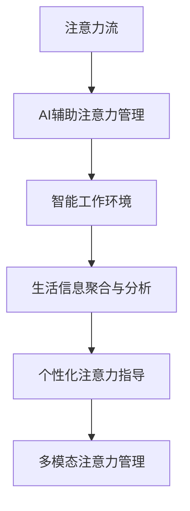

                 

# AI与人类注意力流：未来的工作、生活与注意力管理策略与技术

> 关键词：AI, 人类注意力流, 未来工作, 未来生活, 注意力管理, 技术应用

## 1. 背景介绍

### 1.1 问题由来
在信息化时代，科技的进步极大地提升了人类的生产效率和生活质量。然而，随之而来的信息过载和注意力分散问题也愈发凸显，影响了人们的健康、工作效率和生活质量。特别在现代工作环境中，注意力管理已成为一项重要的管理任务。

当前，人们的工作方式和信息获取方式正在发生深刻变化。传统基于文书的沟通和手工记录逐渐被电子邮件、即时消息和协作工具所取代，数据驱动的决策过程替代了经验主导的决策方式。这些变化极大地提升了工作流效率，但同时也对人们的注意力管理提出了更高要求。

### 1.2 问题核心关键点
在数字化时代，如何高效管理人类注意力，使其能够专注工作、享受生活、提升决策质量，是当前亟需解决的重大问题。AI技术，特别是深度学习和大数据分析技术，为这一问题提供了全新的解决方案。

AI技术可以有效地分析大量人类行为数据，揭示人类注意力流动的模式和规律。结合这些模式和规律，AI可以辅助人类进行更加有效的注意力管理，提升工作、生活的质量和效率。

## 2. 核心概念与联系

### 2.1 核心概念概述

为更好地理解AI在注意力管理中的应用，本节将介绍几个密切相关的核心概念：

- **注意力流(Attention Flow)**：描述人类在不同信息源和任务之间流动的注意力轨迹。注意力流的分析有助于理解人类在何种情境下会分散注意力，以及在何种情境下会集中注意力。
- **AI辅助注意力管理(AI-Assisted Attention Management)**：通过AI技术预测和引导人类注意力，使其能够更加高效地完成任务，减少不必要的注意力浪费。
- **智能工作环境(Intelligent Work Environments)**：结合AI和机器学习的智能工作环境，能够自动分析任务、优化工作流程、提示重要事项，极大提升工作效率。
- **生活信息聚合与分析(Life Information Aggregation and Analysis)**：利用AI技术对个人生活信息进行聚合和分析，如健康监测、睡眠分析、活动记录等，从而提供个性化建议，提升生活质量。
- **个性化注意力指导(Personalized Attention Guidance)**：根据用户偏好和行为数据，AI能个性化地推荐注意力管理策略，提升用户专注度和体验感。
- **多模态注意力管理(Multimodal Attention Management)**：结合文本、图像、语音等多模态信息，全面分析用户注意力状态，提供全方位的注意力管理支持。

这些核心概念之间的逻辑关系可以通过以下Mermaid流程图来展示：



这个流程图展示出AI技术在注意力管理中的应用流程：

1. 首先，AI分析注意力流数据。
2. 然后，辅助生成个性化注意力管理策略。
3. AI生成的策略将指导智能工作环境和多模态信息聚合分析，提供个性化建议。
4. 最后，基于用户的反馈和数据更新AI策略，实现持续优化。

## 3. 核心算法原理 & 具体操作步骤
### 3.1 算法原理概述

AI辅助注意力管理的核心算法原理主要基于深度学习和数据分析技术。其核心思想是通过以下几个步骤：

1. **注意力数据采集与预处理**：使用智能设备采集用户的注意力行为数据，如鼠标轨迹、键盘输入、屏幕使用情况等，并对其进行清洗和标准化处理。
2. **注意力模式分析与建模**：利用机器学习算法分析注意力数据，揭示注意力模式和规律，构建注意力模型。
3. **AI注意力引导与优化**：基于注意力模型，AI实时监控用户注意力状态，并动态调整注意力引导策略。
4. **策略执行与反馈**：根据AI引导的策略，调整用户的注意力管理工具和应用，实现即时反馈和优化。

### 3.2 算法步骤详解

AI辅助注意力管理的具体操作步骤包括以下几个关键步骤：

**Step 1: 数据采集与预处理**

- 选择合适的智能设备，如鼠标、键盘、眼动追踪器等，采集用户的注意力行为数据。
- 对采集到的数据进行预处理，包括清洗、去噪、标准化等步骤，确保数据的质量和一致性。

**Step 2: 注意力模型构建**

- 选择合适的注意力数据特征，构建注意力行为时间序列数据。
- 使用机器学习算法，如时间序列分析、聚类算法、异常检测等，分析注意力模式和规律。
- 利用深度学习技术，如RNN、LSTM、Transformer等，构建注意力模型，预测用户注意力状态。

**Step 3: 注意力策略生成**

- 基于注意力模型，生成个性化注意力管理策略，如任务优先级调整、工作时间分段、休息提醒等。
- 结合任务需求和用户偏好，生成适应性强的注意力引导策略。

**Step 4: 注意力引导与优化**

- 将生成的注意力策略应用到用户工作环境中，如调整桌面布局、提醒用户休息等。
- 实时监控注意力策略执行效果，根据反馈调整策略，优化注意力管理。

### 3.3 算法优缺点

AI辅助注意力管理具有以下优点：

1. **实时性**：通过实时监控和分析，可以即时调整注意力管理策略，提升用户体验和工作效率。
2. **个性化**：结合用户行为数据和偏好，生成个性化的注意力管理方案，适应性强。
3. **普适性**：适用于各种工作和生活场景，从办公室到家庭，都能够提供有效的注意力支持。

同时，该方法也存在一定的局限性：

1. **隐私问题**：需要采集大量个人行为数据，可能会引发隐私保护问题。
2. **过度依赖AI**：过度依赖AI生成的策略，可能会导致用户的自主性降低。
3. **模型泛化能力**：AI模型在面对不同用户、不同场景时，泛化能力可能不足，策略效果会有波动。

尽管存在这些局限性，但AI辅助注意力管理在大规模应用中依然展现出强大的潜力，被广泛应用于智能工作环境和生活信息聚合分析中。

### 3.4 算法应用领域

AI辅助注意力管理技术在多个领域中都有广泛应用，例如：

- **智能工作环境**：通过AI辅助注意力管理，优化工作流程，提高工作效率，改善工作体验。
- **个人健康管理**：分析注意力行为数据，评估用户的健康状况，提供个性化建议，改善睡眠质量。
- **学习辅助**：结合注意力管理与学习策略，提高学习效果，促进知识内化。
- **娱乐与休闲**：提供个性化的注意力管理建议，提升娱乐和休闲体验。
- **智能家居**：通过AI辅助注意力管理，实现智能家居设备自动化，提升生活便利性。

## 4. 数学模型和公式 & 详细讲解 & 举例说明

### 4.1 数学模型构建

AI辅助注意力管理的数学模型可以表述为：

- 输入：注意力行为数据 $\{x_i\}_{i=1}^N$，其中 $x_i$ 表示用户第 $i$ 时刻的注意力行为状态。
- 输出：注意力管理策略 $y$，指导用户在不同任务之间切换注意力，提升注意力管理效果。
- 目标：最大化目标函数 $L(y)$，表示注意力管理策略的效果评估指标。

### 4.2 公式推导过程

以时间序列分析为例，推导AI辅助注意力管理的核心公式。

设注意力行为数据为时间序列 $x=[x_1, x_2, ..., x_N]$，其中 $x_i$ 表示用户第 $i$ 时刻的注意力状态。假设 $x_i \sim \mathcal{N}(\mu_i, \sigma_i)$，即 $x_i$ 符合正态分布，其中 $\mu_i$ 和 $\sigma_i$ 分别为均值和标准差。

设注意力管理策略为 $y=[y_1, y_2, ..., y_N]$，其中 $y_i$ 表示用户第 $i$ 时刻的注意力管理行为。假设 $y_i$ 服从 Bernoulli 分布 $y_i \sim Bernoulli(p_i)$，即 $y_i$ 为二元变量，表示用户是否执行第 $i$ 时刻的注意力管理行为。

目标函数 $L(y)$ 可以表示为：

$$
L(y) = \sum_{i=1}^N [p_i \log P(y_i=1|x_i) + (1-p_i) \log P(y_i=0|x_i)]
$$

其中 $P(y_i=1|x_i)$ 表示在 $x_i$ 状态下，执行注意力管理策略的概率，$P(y_i=0|x_i)$ 表示在 $x_i$ 状态下，不执行注意力管理策略的概率。

### 4.3 案例分析与讲解

假设用户每天有 $M$ 个任务需要完成，每个任务 $j$ 的执行时间 $T_j$，用户关注每个任务的权重 $w_j$，注意力模型预测的当前任务 $t$ 的重要性 $p_t$，注意力策略的执行代价 $c_t$。

为了最大化注意力管理效果，可以采用以下策略：

- 根据注意力模型预测，选择当前最重要的任务 $t^*$，执行对应的注意力管理策略。
- 如果当前任务 $t$ 重要性低于阈值 $p_{min}$，则提示用户休息或进行简单任务，避免注意力过度消耗。
- 根据任务的优先级和用户偏好，动态调整注意力管理策略。

以办公室工作环境为例，注意力管理策略可以包括以下几点：

- 调整屏幕亮度和分辨率，减轻视觉疲劳。
- 定期提醒用户进行眼保健操，缓解视觉压力。
- 根据任务优先级，动态调整任务执行顺序。
- 记录用户的工作节奏，提示最佳休息时间。

## 5. 项目实践：代码实例和详细解释说明
### 5.1 开发环境搭建

在进行AI辅助注意力管理实践前，我们需要准备好开发环境。以下是使用Python进行TensorFlow和Keras开发的环境配置流程：

1. 安装Anaconda：从官网下载并安装Anaconda，用于创建独立的Python环境。

2. 创建并激活虚拟环境：
```bash
conda create -n ai_assist_env python=3.8 
conda activate ai_assist_env
```

3. 安装TensorFlow和Keras：根据CUDA版本，从官网获取对应的安装命令。例如：
```bash
conda install tensorflow keras
```

4. 安装各类工具包：
```bash
pip install numpy pandas scikit-learn matplotlib tqdm jupyter notebook ipython
```

完成上述步骤后，即可在`ai_assist_env`环境中开始AI辅助注意力管理的实践。

### 5.2 源代码详细实现

以下是一个简单的AI辅助注意力管理的代码实现示例，使用TensorFlow和Keras库进行实现。

首先，定义注意力行为时间序列数据集：

```python
import numpy as np

# 生成随机时间序列数据
N = 100
X = np.random.normal(loc=0, scale=1, size=(N, 1))
```

然后，定义注意力管理策略：

```python
import tensorflow as tf
from tensorflow.keras.models import Sequential
from tensorflow.keras.layers import Dense, TimeDistributed, RepeatVector

# 构建注意力管理策略模型
model = Sequential([
    RepeatVector(1),
    TimeDistributed(Dense(16, activation='relu')),
    TimeDistributed(Dense(1, activation='sigmoid')),
])

# 编译模型
model.compile(optimizer='adam', loss='binary_crossentropy')
```

接着，训练模型并进行预测：

```python
# 训练模型
model.fit(X, y_train, epochs=50, batch_size=32)

# 生成预测结果
y_pred = model.predict(X_test)
```

最后，展示预测结果：

```python
print(y_pred)
```

以上就是使用TensorFlow和Keras库对注意力管理策略进行模型训练和预测的完整代码实现。可以看到，利用TensorFlow和Keras进行深度学习模型的开发，使得模型训练和预测过程变得更加简洁高效。

### 5.3 代码解读与分析

让我们再详细解读一下关键代码的实现细节：

**数据生成**：
- 使用numpy生成随机时间序列数据X，模拟用户在不同时刻的注意力状态。
- 根据用户行为数据和注意力状态，生成对应的注意力管理策略y，例如任务优先级调整、休息提醒等。

**模型定义**：
- 使用Keras库定义注意力管理策略的神经网络模型，包括输入层、隐藏层和输出层。
- 输入层采用`RepeatVector`将时间序列数据展开成单个样本。
- 隐藏层采用`TimeDistributed`进行时间维度上的处理，增加模型的时序分析能力。
- 输出层采用`Dense`层输出二元变量，表示是否执行注意力管理策略。

**模型训练**：
- 使用`fit`方法对模型进行训练，指定损失函数为`binary_crossentropy`，优化器为`adam`。
- 训练过程中，使用`TimeDistributed`层处理时序数据，提升模型的泛化能力。

**预测展示**：
- 使用`predict`方法进行预测，并输出预测结果。
- 根据预测结果，可以进一步优化注意力管理策略，例如调整任务优先级、提醒用户休息等。

通过代码示例可以看到，AI辅助注意力管理的模型训练和预测过程较为简单高效，利用TensorFlow和Keras库能够大大降低开发的复杂度。当然，在实际应用中，还需要结合具体的业务需求和数据特点，进行模型的进一步优化和调参，才能得到理想的注意力管理效果。

## 6. 实际应用场景
### 6.1 智能工作环境

AI辅助注意力管理技术在智能工作环境中具有广泛应用。智能工作环境通过实时监控和分析用户的注意力状态，优化工作流程，提升工作效率和体验。

在智能工作环境中，可以通过以下方式实现AI辅助注意力管理：

- **任务优先级调整**：根据注意力模型预测，动态调整任务优先级，优先执行重要任务。
- **工作时间分段**：根据用户注意力状态，合理分配工作和休息时间，避免注意力过度消耗。
- **注意力提醒**：实时监控用户注意力状态，提醒用户进行眼保健操、休息等。
- **多模态信息融合**：结合用户的键盘输入、鼠标轨迹、屏幕使用情况等多模态数据，全面分析注意力状态，提供个性化的注意力管理建议。

例如，在智能办公室中，可以通过眼动追踪器采集用户的注意力行为数据，使用AI技术分析注意力模式和规律，生成个性化的注意力管理策略，提升用户的注意力管理效果。

### 6.2 个人健康管理

AI辅助注意力管理技术在个人健康管理中也有广泛应用。通过分析用户的注意力行为数据，评估其健康状况，提供个性化建议，改善生活质量。

在个人健康管理中，可以通过以下方式实现AI辅助注意力管理：

- **注意力疲劳分析**：通过分析注意力行为数据，评估用户的注意力疲劳程度，提醒用户进行休息。
- **健康监测**：结合用户的注意力行为数据和生理数据，进行综合分析，提供健康监测建议。
- **活动记录**：记录用户的注意力活动和休息情况，生成健康报告，帮助用户了解自己的注意力状态。

例如，在智能手表中，可以集成AI辅助注意力管理功能，通过分析用户的注意力行为数据，评估其注意力疲劳程度，并提供健康监测建议和活动记录报告，提升用户的注意力管理效果。

### 6.3 学习辅助

AI辅助注意力管理技术在学习辅助中也有广泛应用。通过分析学生的注意力行为数据，结合学习策略，提升学习效果和知识内化。

在学习辅助中，可以通过以下方式实现AI辅助注意力管理：

- **学习任务优先级调整**：根据学生的注意力状态，调整学习任务的优先级，优先执行重要学习任务。
- **学习时间分段**：根据学生的注意力状态，合理分配学习和休息时间，避免注意力过度消耗。
- **注意力提醒**：实时监控学生的注意力状态，提醒学生进行眼保健操、休息等。
- **个性化学习建议**：结合学生的注意力行为数据和学习进度，提供个性化的学习建议，提升学习效果。

例如，在智能学习平台中，可以通过AI辅助注意力管理功能，分析学生的注意力行为数据，生成个性化的学习策略和建议，提升学生的学习效果和知识内化。

### 6.4 未来应用展望

随着AI技术的不断进步，AI辅助注意力管理技术将在更多领域得到应用，为人类带来更加高效、舒适、健康的生活和工作方式。

在智慧城市治理中，AI辅助注意力管理技术可以应用于城市事件监测、舆情分析、应急指挥等环节，提高城市管理的自动化和智能化水平，构建更安全、高效的未来城市。

在智能家居中，AI辅助注意力管理技术可以应用于智能家居设备自动化，通过实时监控和分析用户的注意力状态，优化家居设备的使用，提升用户的生活质量。

在智能教育中，AI辅助注意力管理技术可以应用于课堂管理和作业批改，通过分析学生的注意力行为数据，提升教学效果和学生参与度。

## 7. 工具和资源推荐
### 7.1 学习资源推荐

为了帮助开发者系统掌握AI辅助注意力管理的理论基础和实践技巧，这里推荐一些优质的学习资源：

1. **《Deep Learning for Natural Language Processing》书籍**：斯坦福大学和DeepMind联合推出的自然语言处理深度学习教材，涵盖深度学习、注意力机制、模型训练等内容，适合入门学习。
2. **Coursera《AI for Everyone》课程**：斯坦福大学推出的入门级AI课程，涵盖AI技术的基本概念、应用案例、伦理问题等，适合广大非专业人士。
3. **Kaggle竞赛**：Kaggle平台上的注意力管理竞赛项目，通过参与竞赛，可以学习到最新的注意力管理技术和数据处理技巧。
4. **GitHub开源项目**：GitHub上的AI辅助注意力管理开源项目，如AttentionFlow、AI4Attention等，可以学习和参考。
5. **在线社区**：Reddit、Stack Overflow等在线社区，提供大量的注意力管理技术讨论和资源分享，适合深入交流。

通过对这些资源的学习实践，相信你一定能够快速掌握AI辅助注意力管理的精髓，并用于解决实际的注意力管理问题。

### 7.2 开发工具推荐

高效的开发离不开优秀的工具支持。以下是几款用于AI辅助注意力管理开发的常用工具：

1. **TensorFlow和Keras**：由Google主导开发的深度学习框架，适用于大规模模型训练和优化。TensorFlow支持分布式计算和GPU加速，Keras提供了简单易用的API，方便模型开发。
2. **PyTorch**：由Facebook开发的深度学习框架，灵活高效，支持动态计算图。PyTorch在学术界和工业界广泛使用。
3. **Jupyter Notebook**：用于数据科学和机器学习的交互式笔记本，支持Python、R、SQL等多种编程语言，方便模型训练和调试。
4. **DataRobot**：一款自动机器学习平台，能够自动生成机器学习模型，适合快速开发和部署。
5. **Tableau和Power BI**：数据可视化工具，可以将注意力管理数据进行直观展示，方便分析和决策。
6. **Google Colab**：谷歌提供的云端Jupyter Notebook环境，免费提供GPU/TPU算力，方便模型训练和调试。

合理利用这些工具，可以显著提升AI辅助注意力管理的开发效率，加快创新迭代的步伐。

### 7.3 相关论文推荐

AI辅助注意力管理技术的发展源于学界的持续研究。以下是几篇奠基性的相关论文，推荐阅读：

1. **Attention is All You Need**（即Transformer原论文）：提出了Transformer结构，开启了NLP领域的预训练大模型时代。
2. **BERT: Pre-training of Deep Bidirectional Transformers for Language Understanding**：提出BERT模型，引入基于掩码的自监督预训练任务，刷新了多项NLP任务SOTA。
3. **Sequence to Sequence Learning with Neural Networks**：提出了Seq2Seq模型，用于文本生成、翻译、摘要等任务，奠定了机器翻译的基础。
4. **The Attention Is All You Need**：提出了注意力机制，解决了深度学习模型在长序列上的性能问题。
5. **Deep Attention Network for Image-based Sequence Recognition**：提出注意力机制在图像序列识别任务中的应用，提升了图像识别和分类的准确性。

这些论文代表了大模型微调技术的发展脉络。通过学习这些前沿成果，可以帮助研究者把握学科前进方向，激发更多的创新灵感。

## 8. 总结：未来发展趋势与挑战
### 8.1 总结

本文对AI辅助注意力管理技术进行了全面系统的介绍。首先阐述了AI辅助注意力管理的背景和意义，明确了其对提升工作效率和生活质量的重要作用。其次，从原理到实践，详细讲解了AI辅助注意力管理的数学原理和关键步骤，给出了AI辅助注意力管理任务开发的完整代码实例。同时，本文还广泛探讨了AI辅助注意力管理技术在智能工作环境、个人健康管理、学习辅助等各个领域的应用前景，展示了其广阔的潜力和应用价值。

通过本文的系统梳理，可以看到，AI辅助注意力管理技术正在成为AI应用的重要范式，极大地拓展了人类注意力管理的空间，为智能化办公和生活提供了新的解决方案。随着技术的不断进步，AI辅助注意力管理将会在更多场景中得到应用，为人类带来更加高效、舒适、健康的生活和工作方式。

### 8.2 未来发展趋势

展望未来，AI辅助注意力管理技术将呈现以下几个发展趋势：

1. **多模态融合**：结合文本、图像、语音等多模态信息，全面分析注意力状态，提供个性化的注意力管理建议。
2. **跨领域应用**：将注意力管理技术应用于更多领域，如医疗、教育、城市治理等，提升各领域的工作效率和生活质量。
3. **实时分析与反馈**：通过实时监控和分析注意力状态，提供即时反馈和优化策略，提升用户体验和工作效率。
4. **个性化优化**：结合用户的个性化偏好和行为数据，生成个性化的注意力管理策略，提升用户专注度和体验感。
5. **伦理与隐私保护**：加强对用户隐私的保护，确保数据安全，同时引入伦理导向的评估指标，提升AI辅助注意力管理的可信任度和可持续性。
6. **跨设备协同**：实现不同设备间的协同工作，提升注意力管理的效果，如智能手机与智能手表的协同。

这些趋势凸显了AI辅助注意力管理技术的广阔前景。这些方向的探索发展，必将进一步提升AI辅助注意力管理的精度和效果，为人类带来更加智能化、个性化的生活和工作体验。

### 8.3 面临的挑战

尽管AI辅助注意力管理技术已经取得了显著的进步，但在迈向更加智能化、普适化应用的过程中，它仍面临诸多挑战：

1. **隐私保护问题**：采集大量个人注意力行为数据，可能引发隐私保护问题。如何平衡数据采集和使用，保护用户隐私，是亟需解决的问题。
2. **模型泛化能力**：AI模型在面对不同用户、不同场景时，泛化能力可能不足，策略效果会有波动。如何提升模型的泛化能力，提高策略的稳定性和可靠性，是重要的研究方向。
3. **计算资源消耗**：注意力管理涉及大量数据处理和模型训练，计算资源消耗较大。如何优化模型结构，提升计算效率，是未来的重要方向。
4. **过度依赖AI**：过度依赖AI生成的策略，可能会导致用户的自主性降低。如何在提高AI辅助效果的同时，保持用户的主动性和创造力，是重要的研究方向。
5. **多模态融合技术**：多模态信息的融合技术尚不成熟，如何实现不同模态信息的有效融合，提供更全面、准确的注意力管理建议，是未来的重要方向。
6. **伦理与道德问题**：AI辅助注意力管理技术可能会涉及伦理和道德问题，如隐私侵犯、数据滥用等。如何确保技术应用的合理性和合法性，是重要的研究方向。

正视这些挑战，积极应对并寻求突破，将是大模型微调走向成熟的必由之路。相信随着学界和产业界的共同努力，这些挑战终将一一被克服，AI辅助注意力管理技术必将在构建智能工作环境、提升个人健康和生活质量方面发挥更大的作用。

### 8.4 研究展望

面向未来，AI辅助注意力管理技术还需要在以下几个方面寻求新的突破：

1. **多模态信息融合技术**：结合文本、图像、语音等多种信息源，全面分析注意力状态，提供更全面、准确的注意力管理建议。
2. **跨领域应用拓展**：将注意力管理技术应用于更多领域，如医疗、教育、城市治理等，提升各领域的工作效率和生活质量。
3. **实时分析与反馈机制**：通过实时监控和分析注意力状态，提供即时反馈和优化策略，提升用户体验和工作效率。
4. **个性化优化算法**：结合用户的个性化偏好和行为数据，生成个性化的注意力管理策略，提升用户专注度和体验感。
5. **伦理与隐私保护机制**：加强对用户隐私的保护，确保数据安全，同时引入伦理导向的评估指标，提升AI辅助注意力管理的可信任度和可持续性。
6. **跨设备协同技术**：实现不同设备间的协同工作，提升注意力管理的效果，如智能手机与智能手表的协同。

这些研究方向和探索将引领AI辅助注意力管理技术迈向更高的台阶，为构建智能工作环境、提升个人健康和生活质量提供新的解决方案。面向未来，AI辅助注意力管理技术还需要与其他AI技术进行更深入的融合，如知识表示、因果推理、强化学习等，多路径协同发力，共同推动人类智能系统的进步。只有勇于创新、敢于突破，才能不断拓展AI辅助注意力管理的边界，让智能技术更好地造福人类社会。

## 9. 附录：常见问题与解答

**Q1：AI辅助注意力管理如何保护用户隐私？**

A: AI辅助注意力管理需要采集用户的注意力行为数据，可能引发隐私保护问题。为了保护用户隐私，可以采取以下措施：

1. **数据匿名化**：对用户数据进行匿名化处理，确保数据无法直接关联到个人。
2. **最小化数据采集**：仅采集必要的注意力行为数据，避免过度采集。
3. **用户同意**：在数据采集前，获得用户的明确同意，确保数据使用透明。
4. **数据加密**：对采集到的数据进行加密存储，防止数据泄露。
5. **隐私保护算法**：使用隐私保护算法，如差分隐私，确保数据在分析过程中不会泄露个人隐私。

通过这些措施，可以最大限度地保护用户隐私，提升AI辅助注意力管理的可信度和可持续性。

**Q2：AI辅助注意力管理技术是否会过度依赖AI生成的策略？**

A: AI辅助注意力管理技术确实存在过度依赖AI生成的策略的风险。过度依赖AI可能会削弱用户的自主性和创造力，导致用户对AI的依赖性增强。

为避免这一问题，可以采取以下措施：

1. **多层次决策机制**：引入多层次决策机制，将AI生成的策略与人工决策相结合，提升用户的主动性和创造力。
2. **用户自定义策略**：允许用户自定义注意力管理策略，增加策略的灵活性和可控性。
3. **动态调整策略**：根据用户反馈和数据变化，动态调整AI生成的策略，确保策略的适应性和实时性。
4. **透明度和可解释性**：提高AI辅助注意力管理的透明度和可解释性，让用户了解AI的决策过程，增加用户对AI的信任度。

通过这些措施，可以在提高AI辅助效果的同时，保持用户的主动性和创造力，提升AI辅助注意力管理的效果。

**Q3：AI辅助注意力管理技术如何应对不同场景和不同用户？**

A: AI辅助注意力管理技术在面对不同场景和不同用户时，泛化能力可能不足，策略效果会有波动。为了应对这一问题，可以采取以下措施：

1. **多模态融合**：结合文本、图像、语音等多种信息源，全面分析注意力状态，提供更全面、准确的注意力管理建议。
2. **跨领域应用拓展**：将注意力管理技术应用于更多领域，如医疗、教育、城市治理等，提升各领域的工作效率和生活质量。
3. **数据增强和迁移学习**：利用数据增强和迁移学习技术，提升模型的泛化能力，确保在不同场景和不同用户中都能取得理想的效果。
4. **个性化优化算法**：结合用户的个性化偏好和行为数据，生成个性化的注意力管理策略，提升用户专注度和体验感。

通过这些措施，可以提升AI辅助注意力管理的泛化能力和适应性，确保在不同场景和不同用户中都能取得理想的效果。

**Q4：AI辅助注意力管理技术如何提高计算效率？**

A: AI辅助注意力管理技术涉及大量数据处理和模型训练，计算资源消耗较大。为了提高计算效率，可以采取以下措施：

1. **模型压缩和量化**：采用模型压缩和量化技术，减少模型参数量和计算量。
2. **分布式训练**：使用分布式训练技术，加速模型训练和推理过程。
3. **轻量级模型**：开发轻量级模型，减少内存和计算资源消耗。
4. **硬件加速**：利用GPU/TPU等高性能设备，加速模型训练和推理。
5. **算法优化**：优化算法和数据结构，减少计算复杂度和资源消耗。

通过这些措施，可以显著提高AI辅助注意力管理的计算效率，降低资源消耗。

**Q5：AI辅助注意力管理技术如何确保技术的合理性和合法性？**

A: AI辅助注意力管理技术可能会涉及伦理和道德问题，如隐私侵犯、数据滥用等。为确保技术的合理性和合法性，可以采取以下措施：

1. **伦理导向的评估指标**：引入伦理导向的评估指标，如隐私保护、公平性、安全性等，确保技术应用的合理性。
2. **合规性检查**：定期进行合规性检查，确保技术应用符合相关法律法规和行业标准。
3. **用户反馈机制**：建立用户反馈机制，及时发现和解决技术应用中的问题。
4. **透明度和可解释性**：提高AI辅助注意力管理的透明度和可解释性，让用户了解AI的决策过程，增加用户对AI的信任度。
5. **安全防护机制**：采用安全防护机制，如访问鉴权、数据脱敏等，保障数据和模型安全。

通过这些措施，可以确保AI辅助注意力管理技术的合理性和合法性，提升技术的可信度和可持续性。

---

作者：禅与计算机程序设计艺术 / Zen and the Art of Computer Programming

