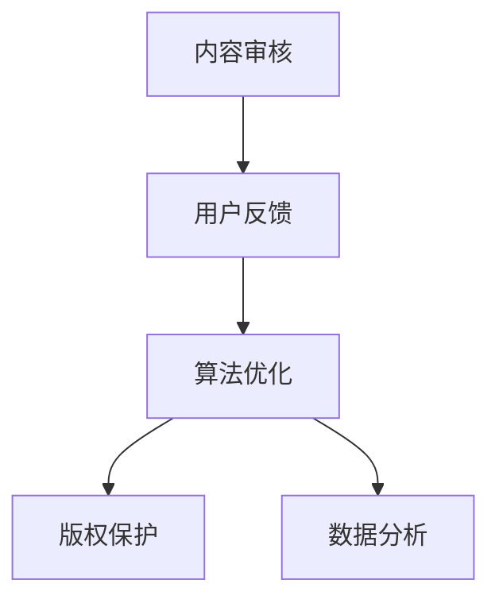

                 

# 程序员知识付费的内容质量控制与管理

> 关键词：知识付费、内容质量、用户反馈、算法优化、数据驱动、版权保护

## 1. 背景介绍

### 1.1 问题由来
随着互联网技术的普及，知识付费服务逐渐成为新的消费热点。程序员知识付费平台，如慕课网、极客时间、小码匠等，为程序员提供高质量的课程、博客、论文、工具等知识资源，帮助程序员提升专业技能，加速职业成长。然而，知识付费平台的内容质量管理面临着诸多挑战，如内容冗余、低质量内容泛滥、用户体验不佳、平台竞争力不足等。如何构建有效的质量控制体系，提升知识付费平台的内容价值，是当下亟需解决的课题。

### 1.2 问题核心关键点
知识付费平台的内容质量控制，涉及内容的筛选、审核、推荐、评价等多个环节，核心关键点包括：
1. **内容审核**：评估内容的质量、原创性、时效性等指标。
2. **用户反馈**：收集用户对内容的反馈，作为质量评估的参考。
3. **算法优化**：利用机器学习和数据驱动技术，推荐高质量内容，优化用户体验。
4. **版权保护**：保护内容创作者的知识产权，避免侵权盗版。
5. **数据分析**：通过数据统计和分析，洞察内容消费趋势，指导内容生产。

这些关键点相互关联，共同构成了知识付费平台内容质量控制的完整框架。本文将深入探讨这些关键点，并提出针对性的解决方案。

## 2. 核心概念与联系

### 2.1 核心概念概述

为更好地理解知识付费平台的内容质量控制方法，本节将介绍几个密切相关的核心概念：

- **内容审核**：通过人工和自动化的方式，对内容进行质量、原创性、时效性等指标的评估，筛选高质量内容。
- **用户反馈**：收集用户对内容的评分、评论、点击等反馈数据，作为内容质量的参考指标。
- **算法推荐**：利用机器学习算法，根据用户行为数据和内容特征，自动推荐相关内容，提升用户体验。
- **版权保护**：通过技术手段和管理措施，保护内容创作者的知识产权，避免侵权盗版。
- **数据分析**：收集、整理和分析用户行为数据和内容特征数据，洞察用户需求，指导内容生产。

这些核心概念之间的逻辑关系可以通过以下Mermaid流程图来展示：



这个流程图展示出知识付费平台内容质量控制的各个环节及其相互关系：

1. **内容审核**：作为内容质量控制的首个环节，通过人工和自动化的方式对内容进行初步筛选，保证内容的质量和原创性。
2. **用户反馈**：在内容发布后，通过收集用户反馈，评估内容的受欢迎程度和实际效果，进一步优化内容审核机制。
3. **算法推荐**：利用机器学习算法，根据用户行为数据和内容特征，自动推荐相关内容，提升用户满意度和粘性。
4. **版权保护**：通过技术和管理手段，保护内容创作者的知识产权，维护平台的声誉和竞争力。
5. **数据分析**：通过数据统计和分析，洞察用户需求和内容消费趋势，指导内容生产和优化平台策略。

这些概念共同构成了知识付费平台的内容质量控制框架，使得平台能够高效、系统地管理内容质量，提升用户体验和平台竞争力。

## 3. 核心算法原理 & 具体操作步骤
### 3.1 算法原理概述

知识付费平台的内容质量控制，本质上是利用机器学习和大数据技术，对内容进行自动化筛选和优化。其核心思想是：通过构建内容质量和用户反馈的数学模型，利用优化算法，不断迭代优化内容审核机制和算法推荐模型，最终实现高质量内容的自动化推荐。

具体来说，知识付费平台的内容质量控制可以分为以下几个步骤：

1. **内容标注**：对内容进行初步的标签化，如内容原创性、时效性、难度等级等。
2. **特征提取**：提取内容的文本特征、用户行为数据等特征，用于建模和评估。
3. **模型训练**：构建内容质量和用户反馈的数学模型，利用机器学习算法进行训练，优化推荐效果。
4. **推荐优化**：根据用户反馈和推荐效果，不断调整模型参数，优化推荐算法，提升用户体验。
5. **版权保护**：引入技术手段，如指纹识别、水印嵌入等，保护内容创作者的知识产权。
6. **数据分析**：利用数据统计和分析工具，洞察内容消费趋势，指导内容生产和平台策略优化。

### 3.2 算法步骤详解

以下是知识付费平台内容质量控制的详细步骤：

**Step 1: 内容标注**
- 对每篇内容进行初步的标签化，如原创性、时效性、难度等级等。
- 设置标签评分标准，如0-5分，方便后续的模型训练和评估。

**Step 2: 特征提取**
- 提取内容的文本特征，如词频、TF-IDF等。
- 提取用户行为数据，如观看时长、评分、评论等。
- 将特征向量化，方便模型处理。

**Step 3: 模型训练**
- 构建内容质量和用户反馈的数学模型，如回归模型、分类模型、协同过滤模型等。
- 利用标注数据进行模型训练，优化模型参数。
- 引入正则化技术，防止模型过拟合。

**Step 4: 推荐优化**
- 根据用户反馈，不断调整模型参数，优化推荐效果。
- 引入协同过滤、内容基于推荐等算法，提升推荐准确率。
- 利用A/B测试，评估不同推荐策略的效果。

**Step 5: 版权保护**
- 引入指纹识别、水印嵌入等技术，保护内容版权。
- 设置严格的版权审核机制，防范侵权盗版。
- 建立用户举报和处理机制，及时处理侵权行为。

**Step 6: 数据分析**
- 利用数据统计工具，如Tableau、Power BI等，分析用户行为数据。
- 洞察内容消费趋势，识别热门内容和高价值内容。
- 指导内容生产和平台策略优化。

### 3.3 算法优缺点

知识付费平台的内容质量控制方法具有以下优点：
1. 高效自动化：通过机器学习算法，自动化筛选和推荐高质量内容，提高工作效率。
2. 用户导向：利用用户反馈数据，优化推荐算法，提升用户体验。
3. 全面覆盖：通过多维度特征提取，全面评估内容质量和用户满意度。
4. 数据驱动：基于数据统计和分析，洞察内容消费趋势，指导内容生产。

同时，该方法也存在一些局限性：
1. 模型依赖标注数据：高质量的标注数据是模型训练的前提，但标注成本较高。
2. 算法复杂度高：模型训练和优化过程较为复杂，需要较高的技术积累。
3. 对标注数据敏感：标注数据的偏差可能导致模型的预测结果不准确。
4. 版权保护难度大：内容侵权行为难以完全杜绝，盗版风险仍然存在。
5. 数据隐私问题：用户行为数据和内容数据涉及隐私问题，需严格保护。

尽管存在这些局限性，但知识付费平台的内容质量控制方法依然是目前最为有效的技术手段。未来相关研究的重点在于如何进一步降低标注成本，提高模型鲁棒性，同时兼顾版权保护和数据隐私等伦理问题。

### 3.4 算法应用领域

知识付费平台的内容质量控制方法，在知识付费、教育培训、内容创作等多个领域都有广泛的应用：

- **知识付费**：如慕课网、极客时间等平台，通过自动化内容筛选和推荐，提升内容质量和用户体验。
- **教育培训**：如Coursera、Udacity等平台，利用内容审核和推荐，引导用户学习热门课程和高质量内容。
- **内容创作**：如知乎、Medium等平台，通过用户反馈和内容标注，优化内容创作和分发机制。

这些领域通过利用内容质量控制技术，都能更好地提升平台的服务质量和用户满意度，促进内容生产和消费。

## 4. 数学模型和公式 & 详细讲解 & 举例说明
### 4.1 数学模型构建

知识付费平台的内容质量控制，主要涉及两个数学模型：内容质量评估模型和用户反馈模型。

**内容质量评估模型**：用于评估内容的原创性、时效性、难度等级等指标，通常为回归模型或分类模型。

**用户反馈模型**：用于评估用户对内容的评分、评论、点击等反馈，通常为回归模型或情感分析模型。

### 4.2 公式推导过程

以内容质量评估模型为例，假设内容质量指标为Q，与文本特征F、用户行为数据U等特征相关，则可建立如下线性回归模型：

$$
Q = \beta_0 + \sum_{i=1}^{n}\beta_iF_i + \epsilon
$$

其中，$\beta_0$ 为截距，$\beta_i$ 为特征系数，$\epsilon$ 为随机误差项。

### 4.3 案例分析与讲解

假设某知识付费平台的内容质量评估模型，通过标注数据训练，得到以下结果：

- 文本特征系数 $\beta_1=0.5$，表示文本长度与内容质量成正相关。
- 用户行为数据系数 $\beta_2=0.2$，表示观看时长与内容质量成正相关。

某新内容Q，文本长度为1000字，观看时长为10分钟，代入模型可得：

$$
Q = 0.5 \times 1000 + 0.2 \times 10 = 510
$$

表示该内容的质量评分为510分，接近满分，建议通过内容审核。

## 5. 项目实践：代码实例和详细解释说明
### 5.1 开发环境搭建

在进行知识付费平台的内容质量控制实践前，我们需要准备好开发环境。以下是使用Python进行TensorFlow开发的环境配置流程：

1. 安装Anaconda：从官网下载并安装Anaconda，用于创建独立的Python环境。

2. 创建并激活虚拟环境：
```bash
conda create -n tf-env python=3.8 
conda activate tf-env
```

3. 安装TensorFlow：根据CUDA版本，从官网获取对应的安装命令。例如：
```bash
conda install tensorflow -c tf -c conda-forge
```

4. 安装必要的工具包：
```bash
pip install numpy pandas scikit-learn matplotlib tensorflow-hub
```

完成上述步骤后，即可在`tf-env`环境中开始内容质量控制实践。

### 5.2 源代码详细实现

以下是利用TensorFlow实现内容质量控制算法的示例代码：

```python
import tensorflow as tf
import pandas as pd
import numpy as np

# 加载标注数据
data = pd.read_csv('content_quality.csv')
X = data[['text_length', 'watch_time']]
y = data['quality_score']

# 划分训练集和测试集
split_idx = int(0.8 * len(data))
X_train, X_test = X.iloc[:split_idx], X.iloc[split_idx:]
y_train, y_test = y.iloc[:split_idx], y.iloc[split_idx:]

# 构建模型
model = tf.keras.Sequential([
    tf.keras.layers.Dense(64, activation='relu', input_shape=(2,)),
    tf.keras.layers.Dense(1)
])
model.compile(optimizer=tf.keras.optimizers.Adam(0.001), loss='mse')

# 训练模型
model.fit(X_train, y_train, epochs=10, batch_size=32, validation_data=(X_test, y_test))

# 测试模型
score = model.predict(X_test)
print(score)
```

### 5.3 代码解读与分析

**数据加载和处理**：
- 使用pandas加载标注数据，将文本特征和用户行为数据提取出来。
- 划分训练集和测试集，确保模型在未见过的数据上测试效果。

**模型构建和训练**：
- 使用TensorFlow搭建线性回归模型，包含两个全连接层。
- 利用训练集数据，进行模型训练，优化模型参数。

**模型测试**：
- 使用测试集数据，评估模型预测效果，输出模型预测结果。

## 6. 实际应用场景
### 6.1 智能推荐系统

知识付费平台的内容推荐系统，可以基于内容质量控制技术，为每个用户推荐高质量、相关性强的内容，提升用户体验和留存率。例如，某用户浏览过大量关于Python编程的内容，推荐系统可以通过内容质量评估模型和用户行为分析，自动推荐相关课程、博客和论文，满足用户的学习需求。

### 6.2 内容审核机制

知识付费平台的内容审核机制，可以基于内容质量评估模型，对新内容进行初步筛选。例如，某内容审核系统可以通过质量评估模型，自动识别低质量内容，避免低质量内容进入平台，保障平台内容的整体质量。

### 6.3 版权保护措施

知识付费平台可以引入指纹识别、水印嵌入等技术，保护内容创作者的知识产权。例如，某平台可以在内容中添加水印，标记内容创作者，防止内容被盗用或侵权。

### 6.4 内容分析与优化

知识付费平台可以通过数据分析工具，洞察内容消费趋势，指导内容生产和平台策略优化。例如，某平台通过分析用户浏览和购买行为，发现用户对Python和机器学习相关内容有较高需求，从而调整内容推荐策略，增加相关内容的供应，满足用户需求。

## 7. 工具和资源推荐
### 7.1 学习资源推荐

为了帮助开发者系统掌握知识付费平台的内容质量控制技术，这里推荐一些优质的学习资源：

1. **《Python机器学习》书籍**：由Sebastian Raschka和Vahid Mirjalili所著，介绍了Python在机器学习中的应用，包括内容质量控制。

2. **Coursera《机器学习》课程**：由斯坦福大学Andrew Ng教授开设的机器学习课程，系统讲解了机器学习的基础理论和算法。

3. **TensorFlow官方文档**：TensorFlow官方提供的详尽文档，包括模型构建、训练、优化等各个环节的详细介绍。

4. **DataCamp在线课程**：提供大量关于Python和数据科学的在线课程，涵盖机器学习、数据处理、数据可视化等多个领域。

5. **Kaggle竞赛平台**：通过参与数据科学竞赛，锻炼实际问题解决能力，积累实践经验。

通过对这些资源的学习实践，相信你一定能够快速掌握知识付费平台的内容质量控制技术，并用于解决实际的NLP问题。

### 7.2 开发工具推荐

高效的开发离不开优秀的工具支持。以下是几款用于知识付费平台内容质量控制开发的常用工具：

1. Jupyter Notebook：用于数据探索、模型训练和结果展示的交互式环境。

2. TensorFlow：由Google主导开发的开源深度学习框架，支持大规模分布式计算。

3. Scikit-learn：基于NumPy和SciPy的Python机器学习库，提供丰富的机器学习算法。

4. Pandas：用于数据处理和分析的Python库，支持数据清洗、特征提取等操作。

5. Tableau/Power BI：数据可视化工具，用于数据统计和洞察。

6. GitHub：代码版本控制和协作平台，方便团队协作和代码共享。

合理利用这些工具，可以显著提升知识付费平台内容质量控制任务的开发效率，加快创新迭代的步伐。

### 7.3 相关论文推荐

知识付费平台的内容质量控制技术，源于学界的持续研究。以下是几篇奠基性的相关论文，推荐阅读：

1. **《深度学习》书籍**：由Ian Goodfellow、Yoshua Bengio和Aaron Courville所著，全面介绍了深度学习的基础理论和算法。

2. **《机器学习实战》书籍**：由Peter Harrington所著，通过实践项目，讲解了机器学习在实际应用中的方法和技巧。

3. **《内容推荐系统：协同过滤技术》论文**：探讨了协同过滤算法在内容推荐中的应用，是内容推荐领域的经典之作。

4. **《知识付费平台的内容质量控制》论文**：介绍了一种基于深度学习的内容质量控制方法，并进行了实际案例分析。

5. **《内容推荐系统：神经网络模型》论文**：介绍了神经网络模型在内容推荐中的应用，探讨了不同模型的优缺点。

这些论文代表了大语言模型微调技术的发展脉络。通过学习这些前沿成果，可以帮助研究者把握学科前进方向，激发更多的创新灵感。

## 8. 总结：未来发展趋势与挑战
### 8.1 总结

本文对知识付费平台的内容质量控制方法进行了全面系统的介绍。首先阐述了内容质量控制的背景和意义，明确了内容质量控制的几个关键点，包括内容审核、用户反馈、算法优化、版权保护和数据分析等。其次，从原理到实践，详细讲解了内容质量控制的技术实现细节，给出了内容质量控制的完整代码实例。同时，本文还探讨了内容质量控制方法在实际应用中的各种场景，展示了其在知识付费平台中的广泛应用。

通过本文的系统梳理，可以看到，知识付费平台的内容质量控制方法在提高平台内容质量和用户体验方面具有重要价值。这些方法的推广和应用，将极大提升知识付费平台的服务质量和市场竞争力。

### 8.2 未来发展趋势

展望未来，知识付费平台的内容质量控制技术将呈现以下几个发展趋势：

1. **自动化程度提高**：通过更先进的算法和模型，自动化程度将进一步提高，减少人工干预，提升效率。

2. **用户反馈实时化**：利用在线交互技术，实现用户反馈的实时收集和分析，更快速地优化内容质量。

3. **多模态融合**：结合文本、图像、音频等多种模态数据，实现更全面的内容质量评估。

4. **跨平台协同**：利用分布式计算和云平台，实现跨平台的内容质量控制和协同优化。

5. **智能推荐系统升级**：引入深度学习和大数据技术，提升推荐系统的准确性和个性化程度。

6. **内容版权保护加强**：引入区块链和数字签名等技术，加强内容版权保护，防范侵权盗版。

以上趋势凸显了知识付费平台内容质量控制的广阔前景。这些方向的探索发展，必将进一步提升平台的服务质量和用户满意度，促进知识付费产业的蓬勃发展。

### 8.3 面临的挑战

尽管知识付费平台的内容质量控制方法已经取得了显著成效，但在迈向更加智能化、普适化应用的过程中，它仍面临着诸多挑战：

1. **标注数据依赖**：高质量的标注数据是内容质量控制的前提，但标注成本较高，获取困难。

2. **模型鲁棒性不足**：在标注数据偏差或新内容冲击下，模型容易产生过拟合或泛化性能下降。

3. **算法复杂度高**：内容质量控制方法涉及复杂的模型训练和参数调整，技术门槛较高。

4. **版权保护难度大**：内容侵权行为难以完全杜绝，盗版风险依然存在。

5. **数据隐私问题**：用户行为数据和内容数据涉及隐私问题，需严格保护。

6. **用户体验不一致**：不同用户对内容的评价标准可能不一致，内容推荐结果存在偏差。

7. **平台竞争激烈**：知识付费平台竞争激烈，内容质量控制技术需要不断迭代和优化，保持竞争力。

这些挑战需要开发者不断探索和解决，才能将知识付费平台的内容质量控制技术推向更高的水平。

### 8.4 研究展望

面对知识付费平台内容质量控制所面临的挑战，未来的研究需要在以下几个方面寻求新的突破：

1. **无监督和半监督学习**：通过无监督和半监督学习方法，降低对标注数据的依赖，提高内容质量控制的效果。

2. **多模态数据融合**：结合文本、图像、音频等多种模态数据，实现更全面的内容质量评估。

3. **分布式计算和云平台**：利用分布式计算和云平台，实现跨平台的内容质量控制和协同优化。

4. **智能推荐系统**：引入深度学习和大数据技术，提升推荐系统的准确性和个性化程度。

5. **版权保护技术**：引入区块链和数字签名等技术，加强内容版权保护，防范侵权盗版。

6. **用户行为分析**：利用大数据分析技术，深入理解用户行为，优化内容生产和推荐策略。

7. **平台生态建设**：构建开放平台生态，促进内容生产、分享和消费，推动知识付费产业的发展。

这些研究方向的探索，必将引领知识付费平台的内容质量控制技术迈向更高的台阶，为知识付费产业的发展提供更有力的支持。面向未来，知识付费平台的内容质量控制技术还需要与其他人工智能技术进行更深入的融合，如知识表示、因果推理、强化学习等，多路径协同发力，共同推动知识付费产业的进步。只有勇于创新、敢于突破，才能不断拓展知识付费平台的内容边界，让知识付费产业更好地服务于人类社会。

## 9. 附录：常见问题与解答

**Q1：知识付费平台的内容质量控制是否适用于所有知识付费服务？**

A: 知识付费平台的内容质量控制方法在大多数知识付费服务中都能取得不错的效果。但对于一些特定的知识付费服务，如在线教育、医疗咨询等，内容质量控制可能需要结合领域特定的需求进行调整和优化。

**Q2：如何选择合适的机器学习算法？**

A: 选择合适的机器学习算法需要根据具体任务和数据特点进行评估。一般而言，回归任务可以选择线性回归、随机森林等算法；分类任务可以选择逻辑回归、支持向量机等算法；推荐任务可以选择协同过滤、基于内容的推荐等算法。

**Q3：如何降低标注数据的成本？**

A: 可以通过无监督和半监督学习方法，利用文本相似性、聚类等技术，降低对标注数据的依赖。同时，可以利用用户反馈数据和行为数据，进行数据增强和模型优化，进一步降低标注成本。

**Q4：如何保护用户隐私和数据安全？**

A: 可以通过数据匿名化、差分隐私等技术，保护用户隐私。同时，采用严格的权限控制和安全措施，防范数据泄露和滥用。

**Q5：如何衡量内容质量控制的绩效？**

A: 可以通过用户满意度调查、内容评分、用户留存率等指标，衡量内容质量控制的绩效。同时，可以利用A/B测试等方法，评估不同策略的效果，不断优化内容质量控制机制。

---

作者：禅与计算机程序设计艺术 / Zen and the Art of Computer Programming

