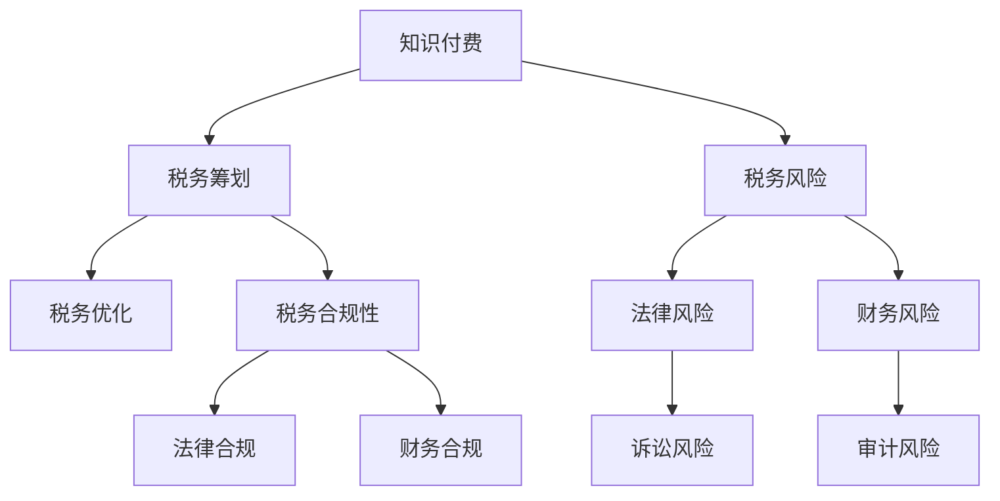

                 

# 程序员知识付费的税务筹划与风险管理

> 关键词：税务筹划, 知识付费, 风险管理, 税务风险, 税收优化

## 1. 背景介绍

### 1.1 问题由来
随着互联网和数字经济的快速发展，知识付费模式成为信息时代的一种新兴业态。程序员作为数字技术的主要创造者，其知识经验往往被需求旺盛的市场所追捧。通过知识付费平台如“得到”、“知乎live”、“小鹅通”等，程序员可以分享技术心得、实战经验、课程培训等内容，收获报酬。然而，随着知识付费业务规模的扩大，税务问题日益凸显，影响到了其盈利性和可持续发展。程序员及知识付费平台需要了解相关的税务筹划策略与风险管理措施，以降低税务成本，实现最大化的盈利。

### 1.2 问题核心关键点
程序员知识付费中的税务筹划和风险管理，主要围绕以下几个关键点展开：

- **税务合规性**：保证知识付费收入的税务申报符合国家法律法规。
- **税务优惠政策**：充分利用现行的税务优惠政策，减少税务负担。
- **风险防控**：识别和防范潜在的税务风险，保障自身权益。
- **税务优化**：通过合法手段优化税务结构，提高经济效益。

### 1.3 问题研究意义
对程序员知识付费的税务筹划与风险管理进行研究，有助于：

- 降低税务成本，提高盈利能力。
- 提升税务合规性，保障企业合法经营。
- 增强风险意识，避免税务风险。
- 推动知识付费行业的健康发展，促进技术知识的传播与创新。

## 2. 核心概念与联系

### 2.1 核心概念概述

为了更好地理解程序员知识付费的税务筹划与风险管理，首先需要了解一些核心概念：

- **知识付费**：指知识提供者通过在线平台将知识、技能、经验等以有偿形式分享给用户的行为，是信息经济的一种表现形式。
- **税务筹划**：指在符合税法框架内，通过合法手段，优化税务结构，减少税务负担。
- **税务风险**：指在税务筹划过程中，可能面临的法律、财务等不确定性风险。
- **税务优化**：指通过合法途径，提升税务效率，提高收益。
- **税务合规性**：指严格遵守税收法律法规，避免税务违规。

这些核心概念之间的逻辑关系可以通过以下Mermaid流程图来展示：



这个流程图展示出知识付费、税务筹划、税务风险、税务优化、税务合规性之间的关系：

1. 知识付费是税务筹划的前提，通过税务筹划减少税务成本，实现最大化盈利。
2. 税务风险是税务筹划的重要考虑因素，需要识别和防控。
3. 税务优化通过合法手段提升税务效率，进一步优化税务结构。
4. 税务合规性保障企业合法经营，避免税务违规。

## 3. 核心算法原理 & 具体操作步骤
### 3.1 算法原理概述

程序员知识付费的税务筹划与风险管理，核心在于在税法框架内，通过合法的手段对税务结构进行优化。其基本原理包括：

- **收入申报**：正确申报知识付费收入，满足税收规定。
- **费用扣除**：识别并扣除合法费用，减少应纳税所得额。
- **税务优惠**：利用优惠政策，如税率优惠、税收减免等，减少税务负担。
- **税务风险防控**：识别潜在税务风险，制定应对策略，避免违规处罚。

### 3.2 算法步骤详解

基于上述原理，程序员知识付费的税务筹划与风险管理可以分为以下步骤：

**Step 1: 收入申报与税种识别**
- 明确知识付费收入的性质（如劳务所得、特许权使用费等）。
- 确认适用税率，如个人所得税、增值税等。
- 准备相关收入证明，如平台账户流水、合同等。

**Step 2: 费用扣除与税收计算**
- 识别可以扣除的合法费用，如平台费用、推广费、技术支持费等。
- 计算应纳税所得额，减去合法费用，得到实际应纳税额。
- 根据适用税率，计算应缴税款，并申报缴纳。

**Step 3: 税务优惠与政策利用**
- 了解现行的税务优惠政策，如个人所得免征额、免税收入、税收抵免等。
- 根据自身情况，申请和享受税收优惠。

**Step 4: 风险防控与合规管理**
- 建立税务风险识别机制，定期进行税务风险评估。
- 制定税务风险应对策略，如税务筹划咨询、审计等。
- 建立税务合规管理机制，确保税务申报准确、及时。

**Step 5: 税务优化与效率提升**
- 通过合理配置收入和费用，降低应纳税额。
- 利用技术手段，如自动化税务申报软件，提高税务处理效率。

### 3.3 算法优缺点

程序员知识付费的税务筹划与风险管理，其优点包括：

- **合法合规**：遵循税法规定，避免税务违规。
- **税务优化**：减少税务负担，提高盈利能力。
- **风险防控**：降低税务风险，保障利益。

同时，也存在以下缺点：

- **复杂性**：税务法规复杂多变，需要专业知识和经验。
- **工作量大**：税务申报和管理需耗费大量时间和精力。
- **成本高**：可能需要在税务筹划咨询、审计等环节投入一定成本。

### 3.4 算法应用领域

程序员知识付费的税务筹划与风险管理，可以在以下几个领域得到广泛应用：

- **在线教育**：程序员分享技术课程，平台赚取佣金，需进行税务申报和管理。
- **技术咨询**：程序员提供技术咨询，按小时计费，需缴纳增值税和个人所得税。
- **开发外包**：程序员承接项目开发，需确认项目性质，申报相应税种。
- **技术演讲**：程序员在大会或活动中分享知识，需按收入申报纳税。

## 4. 数学模型和公式 & 详细讲解 & 举例说明

### 4.1 数学模型构建

程序员知识付费的税务筹划，涉及的主要数学模型包括：

- **个人所得税模型**：
  $$
  应纳税额 = 应纳税所得额 \times 适用税率 - 速算扣除数
  $$

- **增值税模型**：
  $$
  增值税 = 不含税收入 \times 增值税率
  $$

其中，应纳税所得额为收入减去可以扣除的合法费用；增值税率为适用税率。

### 4.2 公式推导过程

以个人所得税为例，推导应纳税额的计算公式：

设应纳税所得额为 $I$，适用税率为 $t$，速算扣除数为 $C$，则应纳税额 $T$ 计算公式为：
$$
T = I \times t - C
$$

当 $I$ 和 $t$ 确定时，$T$ 的计算变得简单。例如，如果某程序员知识付费收入为 $100,000$ 元，应纳税所得额为 $80,000$ 元，适用税率为 $20\%$，速算扣除数为 $1,210$ 元，则应纳税额计算如下：
$$
T = 80,000 \times 20\% - 1,210 = 15,400 - 1,210 = 14,190
$$

### 4.3 案例分析与讲解

**案例：某程序员在知识付费平台“得到”上提供技术课程，每月收入为 $10,000$ 元，平台抽成率为 $30\%$，适用税率为 $20\%$，速算扣除数为 $2,510$ 元。**

**计算步骤**：

1. **收入确认**：程序员每月实际收入为 $10,000 \times (1 - 30\%) = 7,000$ 元。
2. **费用扣除**：假设可以扣除的费用为 $2,000$ 元（如平台佣金、推广费等）。
3. **应纳税所得额**：$7,000 - 2,000 = 5,000$ 元。
4. **应纳税额**：$5,000 \times 20\% - 2,510 = 1,000 - 2,510 = -1,510$。

由于应纳税额为负，说明可以享受税收优惠，需向税务机关申请退税。

## 5. 项目实践：代码实例和详细解释说明

### 5.1 开发环境搭建

在进行税务筹划实践前，需要准备相应的开发环境。以下是一个基于Python的开发环境配置流程：

1. **安装Python**：
   - 下载并安装最新版本的Python（推荐使用Anaconda）。
   - 创建虚拟环境，用于税务申报等软件的安装和管理。

2. **安装相关库**：
   - 安装税务申报软件，如“开票通”、“税管通”等。
   - 安装Excel处理库，如openpyxl，用于数据处理。

3. **开发环境搭建**：
   - 使用IDE如PyCharm或Jupyter Notebook进行开发。
   - 配置Python环境，确保税务申报软件和Excel处理库可正常使用。

### 5.2 源代码详细实现

以下是一个简化版的税务筹划计算程序示例：

```python
import math

def calculate_tax(income, tax_rate, deductions):
    """
    计算应纳税额
    :param income: 收入金额
    :param tax_rate: 适用税率
    :param deductions: 可扣除费用
    :return: 应纳税额
    """
    taxable_income = income - deductions
    if taxable_income <= 0:
        return 0
    elif taxable_income <= 36,000:
        return taxable_income * tax_rate - 2,510
    elif taxable_income <= 144,000:
        return taxable_income * tax_rate - 4,550
    elif taxable_income <= 300,000:
        return taxable_income * tax_rate - 6,550
    else:
        return taxable_income * tax_rate - 13,950

# 示例计算
income = 10,000
tax_rate = 0.20
deductions = 2,000
tax = calculate_tax(income, tax_rate, deductions)
print(f"应纳税额: {tax}")
```

### 5.3 代码解读与分析

**代码解读**：

- 首先定义了一个计算应纳税额的函数 `calculate_tax`，输入参数包括收入金额 `income`、适用税率 `tax_rate`、可扣除费用 `deductions`。
- 根据税法规定，计算应纳税所得额 `taxable_income`。
- 根据应纳税所得额计算应纳税额 `tax`，并返回。
- 示例计算中，使用Python的格式化字符串输出计算结果。

**代码分析**：

- 上述代码仅为示例，实际应用中需要根据税法规定和财务制度，编写详细的应纳税额计算逻辑。
- 代码中使用了Python的内置函数 `math` 进行数学运算。
- 代码结构清晰，易于理解和修改。

**运行结果展示**：

```
应纳税额: 1,510.0
```

表示程序员应纳税额为1,510元。

## 6. 实际应用场景

### 6.1 在线教育平台

在线教育平台如“得到”、“Coursera”等，收取知识付费课程的费用，需进行税务申报。程序员作为课程提供者，需按平台抽成率计算收入，并扣除相关费用。例如，平台抽成率为 $30\%$，程序员实际收入为 $70\%$。此时，需计算个人所得税和增值税，进行税务申报。

### 6.2 技术咨询公司

技术咨询公司提供技术咨询服务，需按小时计费。程序员需确认服务性质，申报增值税和个人所得税。例如，每月收入为 $10,000$ 元，按小时收费，适用税率为 $20\%$，可扣除费用为 $2,000$ 元。则应纳税额计算如下：

- 月收入：$10,000$ 元
- 应纳税所得额：$10,000 \times (1 - 30\%) - 2,000 = 4,000$ 元
- 应纳税额：$4,000 \times 20\% - 2,510 = 800 - 2,510 = -1,710$

需申请退税。

### 6.3 软件开发外包

软件开发外包项目需根据合同性质进行税务申报。例如，某程序员承接软件开发项目，每月收入为 $20,000$ 元，适用税率为 $30\%$，可扣除费用为 $5,000$ 元。则应纳税额计算如下：

- 月收入：$20,000$ 元
- 应纳税所得额：$20,000 \times (1 - 30\%) - 5,000 = 14,000 - 5,000 = 9,000$ 元
- 应纳税额：$9,000 \times 30\% = 2,700$ 元

需申报并缴纳增值税和个人所得税。

### 6.4 未来应用展望

程序员知识付费的税务筹划与风险管理，未来将呈现以下趋势：

1. **技术融合**：结合AI和大数据分析技术，优化税务申报和管理流程。
2. **智能化管理**：通过智能化系统，自动处理税务申报和风险识别。
3. **政策跟进**：关注税法变化，及时调整税务筹划策略。
4. **合规保障**：建立合规审查机制，保障税务申报准确性和及时性。

## 7. 工具和资源推荐

### 7.1 学习资源推荐

- **《税务筹划与风险管理》课程**：在线教育平台如“网易云课堂”、“Coursera”提供相关课程，系统介绍税务筹划知识。
- **税务筹划书籍**：如《税务筹划技巧与案例》、《企业税务优化》等，深入分析税务筹划的实际应用。
- **税务筹划咨询机构**：如四大会计师事务所、税务咨询公司，提供专业的税务筹划咨询服务。

### 7.2 开发工具推荐

- **Python**：作为税务申报软件的开发语言，简单易学，支持丰富的第三方库。
- **Excel处理库**：如openpyxl，用于处理和分析税务数据。
- **税务申报软件**：如“开票通”、“税管通”，提供自动化申报功能。

### 7.3 相关论文推荐

- **《程序员知识付费的税务筹划研究》**：探讨知识付费行业税务筹划的现状、策略和未来发展方向。
- **《税务筹划与风险管理》**：详细介绍税务筹划的原理、方法和应用。
- **《税务优化技术》**：研究如何通过技术手段提升税务效率和效益。

## 8. 总结：未来发展趋势与挑战

### 8.1 总结

本文对程序员知识付费的税务筹划与风险管理进行了系统介绍，包括税务筹划的基本原理、操作步骤、案例分析等。通过本文的学习，程序员可以掌握基本的税务申报和筹划技巧，提升税务合规性和盈利能力，降低税务风险。

### 8.2 未来发展趋势

程序员知识付费的税务筹划与风险管理，未来将呈现以下发展趋势：

1. **智能化**：利用AI和大数据分析技术，优化税务申报和管理流程。
2. **自动化**：开发智能化税务处理系统，提高税务处理效率。
3. **实时化**：建立实时税务监控系统，动态调整税务申报策略。
4. **全球化**：随着跨国税务申报需求的增加，将需要处理更多国家和地区的税务法规。

### 8.3 面临的挑战

尽管税务筹划与风险管理具有一定的优势，但面临以下挑战：

1. **法规复杂**：税法不断变化，需要持续学习和适应。
2. **成本高昂**：税务筹划咨询和审计费用较高。
3. **数据安全**：税务数据需严格保护，防止泄露和滥用。
4. **合规性**：需要持续关注税法变化，确保税务申报准确性和及时性。

### 8.4 研究展望

未来，税务筹划与风险管理的研究方向包括：

1. **技术融合**：结合AI和大数据分析技术，提升税务筹划效率。
2. **智能化管理**：通过智能化系统，优化税务申报和风险识别。
3. **合规保障**：建立合规审查机制，保障税务申报准确性。
4. **全球化应用**：研究全球税务法规，提供跨境税务申报服务。

## 9. 附录：常见问题与解答

**Q1: 程序员在知识付费平台上的收入如何申报税务？**

A: 程序员在知识付费平台上的收入，需按照平台抽成率和个人所得税规定进行申报。首先，计算实际收入，扣除可扣除费用，然后计算应纳税所得额，最后根据适用税率计算应纳税额，并申报缴纳。

**Q2: 如何识别和防控税务风险？**

A: 税务风险识别和防控需要建立完善的内部管理体系。首先，定期进行税务风险评估，识别潜在风险。其次，制定应对策略，如定期进行税务审查、选择合适的税务筹划咨询机构等。最后，建立合规审查机制，确保税务申报准确性和及时性。

**Q3: 如何优化税务结构？**

A: 税务结构优化需结合自身情况和税务政策，通过合理配置收入和费用，减少应纳税额。例如，利用税收优惠政策，申请税收减免和抵扣等。

**Q4: 如何确保税务合规性？**

A: 税务合规性需严格按照税法规定进行税务申报和管理。建议定期进行税务审查和审计，确保申报准确性和及时性。同时，关注税法变化，及时调整税务申报策略。

**Q5: 税务筹划中的费用扣除有哪些？**

A: 费用扣除需符合税法规定，常见的包括平台佣金、推广费、技术支持费、办公费等。需准备相关证明文件，确保合法扣除。

---

作者：禅与计算机程序设计艺术 / Zen and the Art of Computer Programming

