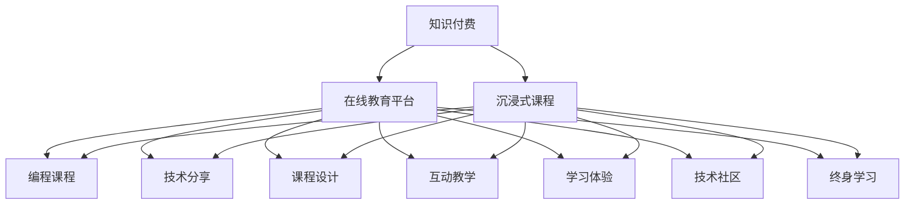

                 

# 程序员知识付费：打造沉浸式课程

> 关键词：知识付费, 沉浸式课程, 在线教育, 编程课程, 技术分享, 课程设计, 互动教学, 学习体验, 技术社区, 终身学习

## 1. 背景介绍

随着互联网的普及和技术的进步，知识付费模式迅速崛起，在线教育市场呈现爆发式增长。特别是在程序员和技术开发者群体中，知识付费成为一种新型的学习方式，帮助他们以更高效、更系统的方式提升自我。传统的教科书、博客和开源社区难以满足广大开发者的学习需求，沉浸式在线课程以其互动性、实践性、实用性，成为程序员获取新知的最佳渠道。

### 1.1 问题由来

随着云计算、人工智能、区块链等新兴技术的崛起，软件开发领域呈现出快速变化的特点，新工具、新框架、新理念层出不穷。这要求开发者不断学习、实践和创新，以保持竞争力。然而，现有的教育资源往往分散、碎片化，缺乏系统性和深度，难以满足开发者快速成长的实际需求。

### 1.2 问题核心关键点

- **知识付费**：用户通过付费获得高质量的课程资源，提高学习效率。
- **沉浸式课程**：利用视频、动画、模拟环境等手段，增强用户体验，加深记忆和理解。
- **在线教育平台**：提供交互式学习环境，方便开发者随时随地获取知识。
- **编程课程**：聚焦于实战项目，提高开发者的编程能力和问题解决能力。
- **技术分享**：通过讲师的讲解，分享最新的技术进展和经验，加速技术传播。
- **课程设计**：根据学习者的水平和需求，设计层次分明、循序渐进的课程结构。
- **互动教学**：通过在线提问、作业提交、社区讨论等形式，提升互动性和参与感。
- **学习体验**：从课程制作到技术实现，从知识获取到实践操作，提升学习者的整体体验。
- **技术社区**：构建开发者交流、分享、协作的技术社区，推动共同进步。
- **终身学习**：强调持续学习和自我提升，适应技术发展的不确定性。

## 2. 核心概念与联系

### 2.1 核心概念概述

要打造沉浸式课程，需要深入理解以下几个核心概念：

- **知识付费**：指用户为获取知识、技能或信息而支付费用的模式，在线教育平台是知识付费的重要形式。
- **沉浸式课程**：利用先进技术手段，如VR/AR、动态化视频、交互式动画等，提升课程的沉浸感和互动性。
- **在线教育平台**：提供在线课程学习、互动交流、作业提交等功能的互联网平台，支持在线学习模式的普及。
- **编程课程**：围绕编程语言、框架、工具等技术内容设计的课程，强调实战和项目导向。
- **技术分享**：通过讲师的分享和技术研讨，传递最新的技术动态和开发经验。
- **课程设计**：基于学习者的认知水平和需求，合理设计课程的难度、深度、广度，以及知识结构。
- **互动教学**：通过提问、讨论、项目实践等形式，增强课程的互动性，提升学习效果。
- **学习体验**：从课程的视觉设计、交互设计到技术的实施，提升学习者的整体体验。
- **技术社区**：通过在线论坛、交流群等形式，构建开发者交流、协作、分享的社区。
- **终身学习**：鼓励学习者持续学习、自我提升，以应对技术环境的快速变化。

### 2.2 核心概念原理和架构的 Mermaid 流程图



这个流程图展示了知识付费、沉浸式课程与在线教育平台之间的逻辑关系。沉浸式课程是知识付费的重要组成部分，通过在线教育平台进行推广和实施。课程设计、技术分享、互动教学、学习体验、技术社区、终身学习等元素，共同构成了沉浸式课程的核心内容。

## 3. 核心算法原理 & 具体操作步骤

### 3.1 算法原理概述

沉浸式课程的核心算法原理主要围绕课程设计、互动教学、学习体验和技术社区构建展开。以下是主要原理和操作步骤的详细说明。

### 3.2 算法步骤详解

#### 3.2.1 课程设计

课程设计是沉浸式课程的基础，需要遵循以下步骤：

1. **需求分析**：通过调研和学习者的反馈，确定课程的目标、内容和难度。
2. **知识点划分**：将课程内容划分为多个知识点，每个知识点包含理论和实践两个部分。
3. **任务设置**：为每个知识点设置具体的学习任务，如编程实践、项目案例、技术研讨等。
4. **难度分级**：根据学习者的不同水平，设计不同难度的任务，以适应不同的学习需求。
5. **评估机制**：设置课程评估机制，包括作业提交、项目评审、互动问答等，以衡量学习效果。

#### 3.2.2 互动教学

互动教学是提升沉浸式课程体验的关键，主要包括以下步骤：

1. **实时提问**：在学习过程中，学生可以通过在线提问功能向讲师或社区成员请教问题，获得即时的解答。
2. **协作学习**：通过小组讨论、在线论坛等方式，促进学生之间的协作学习，增强学习效果。
3. **项目实践**：结合课程内容，设置具体的编程项目或任务，让学生在实践中掌握新技能。
4. **课程反馈**：定期收集学生的反馈，改进课程设计和教学方法，提升学习体验。

#### 3.2.3 学习体验

学习体验是沉浸式课程的重要组成部分，包括以下几个方面：

1. **视觉设计**：通过高清晰度的视频、动画、模拟环境等，提升课程的视觉吸引力。
2. **交互设计**：利用交互式元素，如点击、拖拽、模拟操作等，增强学习的互动性。
3. **技术实现**：采用先进的编程技术，如Web技术、AR技术等，提高课程的可用性和易用性。
4. **资源整合**：整合丰富的学习资源，如文档、代码、工具等，方便学生进行自主学习。

#### 3.2.4 技术社区

技术社区是沉浸式课程的补充，主要包括以下几个方面：

1. **交流平台**：搭建在线论坛、社交媒体等平台，方便学生交流和分享学习心得。
2. **协作工具**：提供协作开发工具和版本控制服务，支持学生进行团队合作。
3. **资源共享**：构建知识库和资源库，提供丰富的学习资源和工具，支持学生的自主学习。
4. **专家交流**：邀请行业专家和学者，进行技术分享和讲座，提升学生的视野和能力。

### 3.3 算法优缺点

沉浸式课程具有以下优点：

1. **互动性强**：通过实时互动、协作学习等方式，提升学习效果。
2. **实践性强**：结合具体的编程项目和任务，强化学生的实践能力。
3. **资源丰富**：提供丰富的学习资源和工具，支持学生的自主学习。
4. **体验性好**：通过视觉和交互设计，提升学生的学习体验。

但沉浸式课程也存在以下缺点：

1. **技术门槛高**：需要先进的编程技术和交互设计能力，开发和维护成本较高。
2. **资源依赖大**：依赖高品质的学习资源和工具，资源建设难度较大。
3. **学习节奏快**：课程内容紧凑，需要学生具备一定的基础知识。

### 3.4 算法应用领域

沉浸式课程的应用领域非常广泛，主要包括以下几个方面：

1. **在线编程课程**：如Python、Java、C++等编程语言的学习和实践。
2. **技术框架课程**：如Spring、Django、React等框架的学习和应用。
3. **软件开发课程**：如DevOps、敏捷开发、测试驱动开发等技术的应用。
4. **数据分析课程**：如数据挖掘、机器学习、大数据等技术的学习和实践。
5. **新兴技术课程**：如区块链、人工智能、物联网等前沿技术的学习和应用。

## 4. 数学模型和公式 & 详细讲解 & 举例说明

### 4.1 数学模型构建

沉浸式课程的数学模型主要围绕课程设计、互动教学、学习体验和技术社区构建展开。以下是主要数学模型的详细构建过程。

#### 4.1.1 课程设计模型

课程设计模型主要包括以下几个变量：

- **目标**：课程的目标（例如掌握某种编程语言或技术框架）
- **内容**：课程的主要内容（例如语言基础、高级特性、项目实践）
- **难度**：课程的难度（例如初级、中级、高级）
- **评估**：课程的评估方式（例如作业提交、项目评审、互动问答）

设课程设计模型为 $M$，其数学表达式为：

$$
M = (O, C, D, A)
$$

其中 $O$ 为目标，$C$ 为内容，$D$ 为难度，$A$ 为评估。

#### 4.1.2 互动教学模型

互动教学模型主要包括以下几个变量：

- **提问**：实时提问的方式和频率
- **协作**：协作学习的方式和频率
- **实践**：编程项目或任务的设置和难度
- **反馈**：课程反馈的频率和形式

设互动教学模型为 $I$，其数学表达式为：

$$
I = (Q, C, P, F)
$$

其中 $Q$ 为提问，$C$ 为协作，$P$ 为实践，$F$ 为反馈。

#### 4.1.3 学习体验模型

学习体验模型主要包括以下几个变量：

- **视觉设计**：视频、动画等视觉元素的复杂度
- **交互设计**：交互元素的种类和频率
- **技术实现**：编程技术的应用程度
- **资源整合**：学习资源的丰富度

设学习体验模型为 $L$，其数学表达式为：

$$
L = (V, I, T, R)
$$

其中 $V$ 为视觉设计，$I$ 为交互设计，$T$ 为技术实现，$R$ 为资源整合。

#### 4.1.4 技术社区模型

技术社区模型主要包括以下几个变量：

- **交流平台**：在线论坛、社交媒体等平台的数量和质量
- **协作工具**：协作开发工具和版本控制服务的可用性
- **资源共享**：知识库和资源库的丰富度
- **专家交流**：专家讲座和分享的次数和质量

设技术社区模型为 $C$，其数学表达式为：

$$
C = (F, T, R, E)
$$

其中 $F$ 为交流平台，$T$ 为协作工具，$R$ 为资源共享，$E$ 为专家交流。

### 4.2 公式推导过程

#### 4.2.1 课程设计模型公式推导

假设课程设计模型的目标为 $O$，内容为 $C$，难度为 $D$，评估为 $A$，则课程设计模型 $M$ 的损失函数可以表示为：

$$
L_M = \lambda_O \cdot O + \lambda_C \cdot C + \lambda_D \cdot D + \lambda_A \cdot A
$$

其中 $\lambda$ 为各个变量的权重，通过优化算法（如梯度下降）最小化损失函数 $L_M$，即可得到最优的课程设计方案。

#### 4.2.2 互动教学模型公式推导

假设互动教学模型的提问为 $Q$，协作为 $C$，实践为 $P$，反馈为 $F$，则互动教学模型 $I$ 的损失函数可以表示为：

$$
L_I = \lambda_Q \cdot Q + \lambda_C \cdot C + \lambda_P \cdot P + \lambda_F \cdot F
$$

通过优化算法最小化损失函数 $L_I$，可以得到最优的互动教学方案。

#### 4.2.3 学习体验模型公式推导

假设学习体验模型的视觉设计为 $V$，交互设计为 $I$，技术实现为 $T$，资源整合为 $R$，则学习体验模型 $L$ 的损失函数可以表示为：

$$
L_L = \lambda_V \cdot V + \lambda_I \cdot I + \lambda_T \cdot T + \lambda_R \cdot R
$$

通过优化算法最小化损失函数 $L_L$，可以得到最优的学习体验方案。

#### 4.2.4 技术社区模型公式推导

假设技术社区模型的交流平台为 $F$，协作工具为 $T$，资源共享为 $R$，专家交流为 $E$，则技术社区模型 $C$ 的损失函数可以表示为：

$$
L_C = \lambda_F \cdot F + \lambda_T \cdot T + \lambda_R \cdot R + \lambda_E \cdot E
$$

通过优化算法最小化损失函数 $L_C$，可以得到最优的技术社区方案。

### 4.3 案例分析与讲解

以构建一个Python编程课程为例，具体分析其课程设计、互动教学、学习体验和技术社区的设计和实现。

#### 4.3.1 课程设计

课程目标：掌握Python语言基础和高级特性，能够独立完成数据处理和机器学习项目。

课程内容：
- 语言基础：Python语法、基本数据结构、函数等
- 高级特性：面向对象编程、异常处理、文件操作等
- 项目实践：数据处理项目、机器学习项目等

课程难度：初级、中级、高级

评估方式：作业提交、项目评审、互动问答

#### 4.3.2 互动教学

实时提问：在学习过程中，学生可以通过在线提问功能向讲师请教问题，获得即时的解答。

协作学习：通过小组讨论、在线论坛等方式，促进学生之间的协作学习，增强学习效果。

项目实践：结合课程内容，设置具体的编程项目或任务，让学生在实践中掌握新技能。

课程反馈：定期收集学生的反馈，改进课程设计和教学方法，提升学习体验。

#### 4.3.3 学习体验

视觉设计：采用高清晰度的视频和动画，提升课程的视觉吸引力。

交互设计：利用交互式元素，如点击、拖拽、模拟操作等，增强学习的互动性。

技术实现：采用Web技术、AR技术等，提高课程的可用性和易用性。

资源整合：整合丰富的学习资源，如文档、代码、工具等，方便学生进行自主学习。

#### 4.3.4 技术社区

交流平台：搭建在线论坛、社交媒体等平台，方便学生交流和分享学习心得。

协作工具：提供协作开发工具和版本控制服务，支持学生进行团队合作。

资源共享：构建知识库和资源库，提供丰富的学习资源和工具，支持学生的自主学习。

专家交流：邀请行业专家和学者，进行技术分享和讲座，提升学生的视野和能力。

## 5. 项目实践：代码实例和详细解释说明

### 5.1 开发环境搭建

在进行沉浸式课程开发前，我们需要准备好开发环境。以下是使用Python进行Django开发的环境配置流程：

1. 安装Anaconda：从官网下载并安装Anaconda，用于创建独立的Python环境。

2. 创建并激活虚拟环境：
```bash
conda create -n django-env python=3.8 
conda activate django-env
```

3. 安装Django：根据Django版本，从官网获取对应的安装命令。例如：
```bash
pip install django
```

4. 安装各类工具包：
```bash
pip install numpy pandas scikit-learn matplotlib tqdm jupyter notebook ipython
```

完成上述步骤后，即可在`django-env`环境中开始沉浸式课程的开发。

### 5.2 源代码详细实现

这里我们以一个简单的Python编程课程为例，使用Django框架实现互动教学和课程管理。

首先，定义课程模型和学生模型：

```python
from django.db import models
from django.contrib.auth.models import User

class Course(models.Model):
    name = models.CharField(max_length=100)
    description = models.TextField()
    start_date = models.DateTimeField()
    end_date = models.DateTimeField()
    enrollment_count = models.IntegerField(default=0)
    lecturer = models.ForeignKey(User, on_delete=models.CASCADE)

class Student(models.Model):
    user = models.OneToOneField(User, on_delete=models.CASCADE)
    enrolled_courses = models.ManyToManyField(Course)
```

然后，定义视图和模板：

```python
from django.shortcuts import render, redirect
from django.http import HttpResponse

def course_list(request):
    courses = Course.objects.all()
    return render(request, 'course_list.html', {'courses': courses})

def course_detail(request, pk):
    course = get_object_or_404(Course, pk=pk)
    return render(request, 'course_detail.html', {'course': course})

def course_signup(request, pk):
    course = get_object_or_404(Course, pk=pk)
    if request.method == 'POST':
        requested_by = User.objects.get(username=request.POST['username'])
        course.enrollment_count += 1
        requested_by.enrolled_courses.add(course)
        return redirect('course_detail', pk=course.pk)
    return render(request, 'course_signup.html', {'course': course})

def course_assignment(request, pk):
    course = get_object_or_404(Course, pk=pk)
    assignments = course.assignment_set.all()
    return render(request, 'course_assignment.html', {'course': course, 'assignments': assignments})
```

最后，定义模板和样式：

```html
<!-- course_list.html -->


  <h1>All Courses</h1>
  <ul>
    
      <li><a href="">{{ course.name }}</a></li>
    
  </ul>

```

```html
<!-- course_detail.html -->


  <h1>{{ course.name }}</h1>
  <p>{{ course.description }}</p>
  <a href="">Sign Up</a>
  
    <h2>{{ assignment.title }}</h2>
    <p>{{ assignment.description }}</p>
    <a href="">View</a>
  

```

```html
<!-- course_signup.html -->


  <h1>Sign Up for {{ course.name }}</h1>
  <form method="post">
    
    <label for="username">Username:</label>
    <input type="text" name="username" required>
    <button type="submit">Sign Up</button>
  </form>

```

完成上述步骤后，即可在`django-env`环境中启动Django服务器，开始开发沉浸式课程的互动教学和课程管理功能。

### 5.3 代码解读与分析

这里我们解读一下关键代码的实现细节：

**Course和Student模型**：
- `Course`模型表示课程信息，包括课程名称、描述、讲师等。
- `Student`模型表示学生信息，与`Course`模型进行多对多关联，用于记录学生所修课程。

**视图函数**：
- `course_list`函数返回所有课程列表，并通过模板渲染显示。
- `course_detail`函数返回指定课程的详细信息，包括讲师、课程描述、课程任务等。
- `course_signup`函数处理学生报名课程的逻辑，完成课程报名后的重定向。
- `course_assignment`函数返回课程任务的列表，并展示每个任务的详细信息。

**模板**：
- `course_list.html`模板渲染课程列表。
- `course_detail.html`模板渲染课程详情。
- `course_signup.html`模板处理课程报名表单。

通过上述代码实现，我们可以看到Django框架提供了丰富的工具和库，方便我们快速开发互动教学和课程管理功能。

## 6. 实际应用场景

### 6.1 在线编程课程

在线编程课程通过沉浸式课程设计，结合互动教学、学习体验和技术社区，帮助学生系统掌握编程语言和框架，提升实战能力。

在技术实现上，可以将课程内容划分为多个模块，每个模块包含理论讲解和实践练习。学生可以通过在线提问、小组讨论等方式，与讲师和其他学生互动，提升学习效果。同时，课程平台可以提供丰富的学习资源和工具，如在线IDE、项目库等，方便学生自主学习和项目实践。

### 6.2 技术研讨会

技术研讨会通过沉浸式课程设计，邀请行业专家分享最新技术动态和经验，提升学生的视野和能力。

在技术实现上，可以设计多场主题研讨会，每个研讨会包含视频讲解、互动问答、实践练习等环节。学生可以通过在线提问、评论、点赞等方式，与讲师和其他学生互动，提升学习效果。同时，课程平台可以提供丰富的学习资源和工具，如讲师讲义、实践案例等，方便学生自主学习和项目实践。

### 6.3 社区协作项目

社区协作项目通过沉浸式课程设计，促进学生之间的协作学习，提升团队合作能力。

在技术实现上，可以设计多个协作项目，每个项目包含任务分配、进度跟踪、成果展示等环节。学生可以通过在线讨论、代码评审、项目提交等方式，与团队成员协作，提升项目管理和团队合作能力。同时，课程平台可以提供协作开发工具和版本控制服务，支持学生进行团队合作。

### 6.4 未来应用展望

随着技术的不断进步，沉浸式课程的应用前景将更加广阔。

- **多模态学习**：结合视频、音频、文本等多种模态，提升学习效果。
- **个性化推荐**：利用机器学习算法，推荐适合学生的课程和任务，提升学习效率。
- **虚拟现实**：利用虚拟现实技术，模拟真实的编程环境，提升学习体验。
- **实时反馈**：利用实时反馈技术，及时纠正学生的错误，提升学习效果。
- **全球合作**：通过全球协作项目，促进国际学生之间的交流和学习，提升全球视野。

## 7. 工具和资源推荐

### 7.1 学习资源推荐

为了帮助开发者系统掌握沉浸式课程的理论基础和实践技巧，这里推荐一些优质的学习资源：

1. **《深入浅出Django》**：一本深入浅出介绍Django框架的书籍，涵盖从环境搭建到项目开发的全过程。
2. **Coursera在线课程**：提供大量优质的在线课程，涵盖编程、数据科学、人工智能等多个领域。
3. **edX在线课程**：提供大量优质的在线课程，涵盖计算机科学、工程、人文学科等多个领域。
4. **Udemy在线课程**：提供大量实用的在线课程，涵盖编程、数据分析、项目开发等多个领域。
5. **Django官方文档**：提供详细的Django框架文档和教程，方便开发者快速上手。

通过这些资源的学习实践，相信你一定能够快速掌握沉浸式课程的理论基础和实践技巧，并用于解决实际的开发问题。

### 7.2 开发工具推荐

高效的开发离不开优秀的工具支持。以下是几款用于沉浸式课程开发的常用工具：

1. **Django框架**：提供完整的Web开发框架，方便开发者快速构建互动教学和课程管理功能。
2. **React框架**：提供丰富的UI组件和状态管理工具，提升课程平台的交互性和用户体验。
3. **PyTorch框架**：提供先进的深度学习工具，支持课程平台中的互动教学和学习体验。
4. **Jupyter Notebook**：提供交互式编程环境，方便开发者进行实时编程和代码演示。
5. **Git版本控制**：提供协作开发和版本管理工具，支持课程平台中的团队协作和代码提交。

合理利用这些工具，可以显著提升沉浸式课程的开发效率，加快创新迭代的步伐。

### 7.3 相关论文推荐

沉浸式课程的研究源于学界的持续研究。以下是几篇奠基性的相关论文，推荐阅读：

1. **《深度学习框架的实际应用》**：介绍多个深度学习框架的实际应用案例，涵盖编程课程、技术分享等多个领域。
2. **《在线教育的未来》**：探讨在线教育的未来发展趋势，提出沉浸式课程的构想和实现方法。
3. **《交互式学习环境的设计与实现》**：探讨互动教学和沉浸式学习环境的设计和实现方法，提升学习效果。
4. **《编程课程的评估和反馈机制》**：探讨编程课程的评估和反馈机制，提升课程设计和教学效果。
5. **《在线协作项目的组织与管理》**：探讨社区协作项目的组织与管理方法，提升团队协作和项目管理能力。

这些论文代表了大语言模型微调技术的发展脉络。通过学习这些前沿成果，可以帮助研究者把握学科前进方向，激发更多的创新灵感。

## 8. 总结：未来发展趋势与挑战

### 8.1 总结

本文对沉浸式课程的开发和实践进行了全面系统的介绍。首先阐述了知识付费、沉浸式课程和在线教育平台的背景和意义，明确了沉浸式课程的核心概念和应用场景。其次，从课程设计、互动教学、学习体验和技术社区构建，详细讲解了沉浸式课程的算法原理和操作步骤。最后，通过实际案例和开发工具推荐，展示了沉浸式课程的实现方法和应用前景。

通过本文的系统梳理，可以看到，沉浸式课程在提升开发者学习效果、推动知识传播和技能提升方面具有重要价值。课程设计、互动教学、学习体验和技术社区的结合，为开发者提供了系统、全面、灵活的学习平台，帮助他们在快速变化的技术环境中保持竞争力。未来，随着技术的不断进步和应用场景的不断拓展，沉浸式课程必将成为程序员技术学习的重要途径。

### 8.2 未来发展趋势

沉浸式课程的未来发展趋势主要包括以下几个方面：

1. **多模态学习**：结合视频、音频、文本等多种模态，提升学习效果。
2. **个性化推荐**：利用机器学习算法，推荐适合学生的课程和任务，提升学习效率。
3. **虚拟现实**：利用虚拟现实技术，模拟真实的编程环境，提升学习体验。
4. **实时反馈**：利用实时反馈技术，及时纠正学生的错误，提升学习效果。
5. **全球合作**：通过全球协作项目，促进国际学生之间的交流和学习，提升全球视野。

### 8.3 面临的挑战

尽管沉浸式课程具有诸多优势，但在实际应用中也面临一些挑战：

1. **技术门槛高**：需要开发者具备较高的技术水平和实践经验，开发和维护成本较高。
2. **资源依赖大**：依赖高品质的学习资源和工具，资源建设难度较大。
3. **互动性不足**：部分课程互动性不足，无法满足学生的学习需求。
4. **学习节奏快**：课程内容紧凑，需要学生具备一定的基础知识。
5. **平台稳定性和安全性**：需要确保课程平台的稳定性和安全性，避免数据泄露和系统崩溃。

### 8.4 研究展望

面向未来，沉浸式课程的研究需要在以下几个方面寻求新的突破：

1. **多模态学习**：结合视频、音频、文本等多种模态，提升学习效果。
2. **个性化推荐**：利用机器学习算法，推荐适合学生的课程和任务，提升学习效率。
3. **虚拟现实**：利用虚拟现实技术，模拟真实的编程环境，提升学习体验。
4. **实时反馈**：利用实时反馈技术，及时纠正学生的错误，提升学习效果。
5. **全球合作**：通过全球协作项目，促进国际学生之间的交流和学习，提升全球视野。

## 9. 附录：常见问题与解答

**Q1：如何选择合适的沉浸式课程平台？**

A: 选择合适的沉浸式课程平台需要考虑以下因素：
1. 平台的稳定性：选择稳定、可靠的平台，避免系统崩溃和数据丢失。
2. 课程的丰富性：选择课程内容丰富、覆盖面广的平台，满足多方面的学习需求。
3. 学习的灵活性：选择支持在线提问、互动讨论、项目实践的平台，提升学习效果。
4. 资源的丰富性：选择提供丰富学习资源和工具的平台，方便学生自主学习和项目实践。

**Q2：如何提升课程的互动性？**

A: 提升课程的互动性需要以下几种方法：
1. 实时提问：在学习过程中，学生可以通过在线提问功能向讲师请教问题，获得即时的解答。
2. 小组讨论：通过小组讨论、在线论坛等方式，促进学生之间的协作学习，增强学习效果。
3. 项目实践：结合课程内容，设置具体的编程项目或任务，让学生在实践中掌握新技能。
4. 课程反馈：定期收集学生的反馈，改进课程设计和教学方法，提升学习体验。

**Q3：如何设计合理的课程难度？**

A: 设计合理的课程难度需要考虑以下因素：
1. 学生的水平：根据学生的水平，设计不同难度的任务，以适应不同的学习需求。
2. 课程目标：根据课程目标，确定课程的深度和广度，确保学生能够掌握所需的知识和技能。
3. 反馈机制：通过作业提交、项目评审、互动问答等方式，及时评估学生的学习效果，调整课程难度。

**Q4：如何构建技术社区？**

A: 构建技术社区需要以下几种方法：
1. 交流平台：搭建在线论坛、社交媒体等平台，方便学生交流和分享学习心得。
2. 协作工具：提供协作开发工具和版本控制服务，支持学生进行团队合作。
3. 资源共享：构建知识库和资源库，提供丰富的学习资源和工具，支持学生的自主学习。
4. 专家交流：邀请行业专家和学者，进行技术分享和讲座，提升学生的视野和能力。

通过这些方法，可以构建一个活跃、互动、支持的学习社区，提升学生的学习效果和综合能力。

**Q5：如何衡量课程的效果？**

A: 衡量课程的效果需要以下几种方法：
1. 评估机制：通过作业提交、项目评审、互动问答等方式，及时评估学生的学习效果，调整课程难度和教学方法。
2. 学习数据：收集学生的学习数据，如课程完成率、互动次数、作业成绩等，分析学习效果和课程设计。
3. 反馈反馈：定期收集学生的反馈，改进课程设计和教学方法，提升学习体验。

通过这些方法，可以全面评估课程的效果，确保课程设计的科学性和教学方法的合理性。

---

作者：禅与计算机程序设计艺术 / Zen and the Art of Computer Programming

