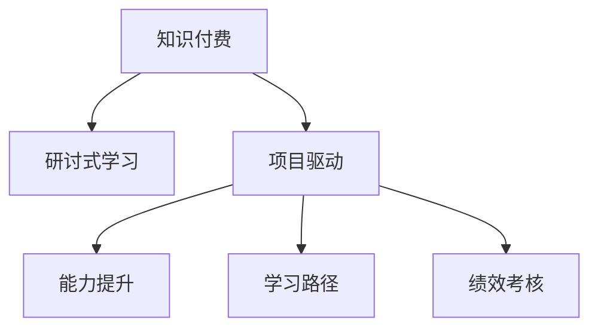

                 

# 程序员知识付费：打造研讨式学习模式

> 关键词：知识付费, 研讨式学习, 项目驱动, 能力提升, 学习路径, 绩效考核

## 1. 背景介绍

### 1.1 问题由来
在数字化转型加速的今天，企业对高素质程序员的需求日益增加。然而，传统的一次性培训已无法满足企业对于知识深度和广度的需求，也无法保证学习效果的持续性和实用性。同时，知识付费平台逐渐崛起，各种在线课程层出不穷，但如何在海量的学习资源中筛选出高质量的内容，提升学习效率，成为当前面临的重要挑战。

### 1.2 问题核心关键点
知识付费的核心在于提升知识吸收和应用能力，而研讨式学习是一种将理论知识与实际问题紧密结合，通过讨论、实践和反馈持续迭代，提升学习效果和能力水平的学习模式。通过项目驱动的研讨式学习，程序员可以系统学习复杂问题，提升解决实际问题的能力，同时通过学习与交流，形成知识社区和生态。

### 1.3 问题研究意义
研讨式学习模式的出现，为程序员提供了一种高效、互动、实战的学习方式。通过研讨式学习，程序员不仅可以系统学习知识，还能通过项目实践提升实际解决问题的能力。研讨式学习不仅能够帮助程序员掌握新技能，还能增强团队协作和沟通能力，推动企业技术创新和组织发展。

## 2. 核心概念与联系

### 2.1 核心概念概述

为更好地理解研讨式学习模式，本节将介绍几个密切相关的核心概念：

- 知识付费：指通过付费获取知识，提升个人技能和知识水平的学习方式。常见的知识付费形式包括线上课程、线下培训、知识问答、专业咨询等。
- 研讨式学习：指通过讨论、辩论、案例分析和项目实践等形式，提升学习效果和实践能力的学习模式。这种学习方式强调学生之间的互动和反思。
- 项目驱动：指以实际项目为核心，围绕项目需求和目标，通过任务分解和项目周期管理，引导学生进行系统学习和技能提升的学习模式。
- 能力提升：指通过系统学习知识、实践和反思，提升编程技能、问题解决能力和团队协作能力，形成具备实战经验的程序员。
- 学习路径：指基于特定目标，设计的一套分阶段、系统化的学习计划和任务清单，引导学生逐步提升能力和技能。
- 绩效考核：指通过设定明确的考核指标，对学习过程和结果进行量化评估，确保学习效果和学习目标的达成。

这些核心概念之间的逻辑关系可以通过以下Mermaid流程图来展示：



这个流程图展示了一个完整的知识付费研讨式学习过程：通过知识付费获取研讨式学习资源，围绕项目需求进行系统学习和实践，在提升能力的同时，制定明确的学习路径和绩效考核标准，形成持续进步的闭环。

## 3. 核心算法原理 & 具体操作步骤
### 3.1 算法原理概述

研讨式学习模式的算法原理主要包括以下几个部分：

1. **知识获取算法**：通过知识付费平台获取高质量的学习资源，包括线上课程、电子书、视频教程等。算法需要优化资源推荐机制，根据用户的学习历史和偏好，推荐相关课程和学习材料。
2. **研讨设计算法**：根据实际项目需求，设计研讨话题和任务，组织讨论和案例分析。算法需要优化讨论流程，确保讨论的有效性和针对性，促进知识共享和深度理解。
3. **实践验证算法**：通过项目驱动的实践任务，验证学习成果，积累实际项目经验。算法需要优化任务分解和项目管理，确保实践任务的可行性和周期性。
4. **反思总结算法**：对学习过程和实践结果进行反思和总结，形成经验教训，持续迭代改进。算法需要优化反思工具和反馈机制，确保反思的深度和系统性。
5. **绩效考核算法**：通过设定明确的考核指标，对学习过程和结果进行量化评估。算法需要优化考核体系，确保考核的公平性和科学性。

### 3.2 算法步骤详解

基于研讨式学习模式的算法原理，我们可以进一步细化算法步骤：

1. **知识获取与推荐**：
   - 用户注册和信息收集，了解用户的知识背景、学习目标和兴趣偏好。
   - 利用机器学习算法，推荐用户感兴趣的课程和学习材料。
   - 用户选择课程，进入学习状态。

2. **研讨设计与管理**：
   - 根据项目需求，设计研讨话题和任务，选择合适的学习资源。
   - 组织在线研讨会，邀请行业专家和导师参与，引导学生讨论和分析。
   - 记录研讨过程和结果，形成学习笔记和讨论纪要。

3. **实践验证与迭代**：
   - 设计实际项目任务，将学习内容应用到项目中，验证学习效果。
   - 项目管理工具，分解任务，设定里程碑，跟踪进度。
   - 组织实践成果展示和评审，提供反馈，改进项目实践。

4. **反思总结与评估**：
   - 用户提交实践报告和学习总结，进行自我评估。
   - 导师和专家提供反馈，指导改进。
   - 形成反思日志和经验教训，优化学习路径和知识体系。

5. **绩效考核与奖励**：
   - 设定考核指标，如项目完成度、知识掌握度、团队协作能力等。
   - 基于考核结果，给予用户相应奖励，如证书、资格认证等。
   - 记录学习轨迹，为持续学习提供依据。

### 3.3 算法优缺点

研讨式学习模式具有以下优点：

- 系统性：通过项目驱动的学习模式，确保学习内容的全面性和系统性，避免知识碎片化。
- 实践性：通过实践任务验证学习效果，积累实际项目经验，增强解决实际问题的能力。
- 互动性：通过讨论和交流，增强学习过程的互动性和参与感，促进知识的深度理解和共享。
- 可评估性：通过绩效考核和反思总结，量化评估学习效果，提供改进依据。

同时，这种模式也存在一些局限性：

- 时间成本高：研讨式学习需要花费较多的时间在讨论和实践中，对时间管理能力有较高要求。
- 资源需求大：需要大量的高质量学习资源和实践任务，对资源供给方要求较高。
- 个性化不足：在批量化培训中，难以完全满足每位学员的个性化需求。
- 效果依赖导师：研讨式学习的成效很大程度上依赖于导师和专家的指导和反馈。

尽管存在这些局限性，但研讨式学习模式仍是一种高效、实用的学习方式，特别适合于系统学习和技能提升。

### 3.4 算法应用领域

研讨式学习模式在多个领域得到了广泛应用，例如：

- 软件开发：通过实际项目开发，系统学习编程语言和框架，提升编程技能和项目经验。
- 数据科学：通过数据集分析和项目实践，掌握数据处理和建模技能，增强数据驱动决策能力。
- 人工智能：通过实际项目和案例研究，掌握机器学习和深度学习技术，提升问题解决能力。
- 项目管理：通过项目管理实践，掌握项目规划、执行和风险管理技能，提升团队协作和沟通能力。

除了上述这些领域外，研讨式学习模式还被创新性地应用到更多场景中，如可控实验、知识管理、跨领域融合等，为知识的学习和应用带来了新的突破。

## 4. 数学模型和公式 & 详细讲解 & 举例说明

### 4.1 数学模型构建

为了更好地理解研讨式学习模式的数学原理，本节将构建一个简化的数学模型，并详细讲解其构建过程。

假设学习者在一段时间内，参与 $n$ 个项目，每个项目需要 $m$ 个研讨和 $k$ 个实践任务。我们设 $x_i$ 表示第 $i$ 个项目的学习效果，$i=1,2,\dots,n$。

定义项目完成度为 $p_i$，知识掌握度为 $k_i$，团队协作能力为 $c_i$，则学习效果 $x_i$ 可以表示为：

$$
x_i = p_i \times k_i \times c_i
$$

其中，$p_i, k_i, c_i \in [0, 1]$，分别表示项目完成度、知识掌握度和团队协作能力，最大值为1表示最佳状态。

我们设定绩效考核指标 $f_i = \omega_1 p_i + \omega_2 k_i + \omega_3 c_i$，其中 $\omega_1, \omega_2, \omega_3$ 表示各个指标的权重，可以根据实际需求进行调整。

### 4.2 公式推导过程

根据上述定义，我们设定了学习效果和绩效考核指标的数学模型。接下来，我们将进一步推导和解释这些公式。

设 $\theta_i$ 表示第 $i$ 个项目的学习效果向量，包括项目完成度 $p_i$、知识掌握度 $k_i$、团队协作能力 $c_i$ 等。则 $x_i$ 可以表示为：

$$
x_i = \theta_i \cdot \omega = \sum_{j=1}^3 \omega_j \theta_{ij}
$$

其中 $\theta_{ij}$ 表示第 $i$ 个项目中，第 $j$ 个指标的值。

设 $\mathcal{L}(\theta)$ 表示模型的损失函数，我们希望最小化损失函数，得到最优的学习效果向量 $\theta$。则目标函数为：

$$
\mathop{\min}_{\theta} \mathcal{L}(\theta) = \frac{1}{N} \sum_{i=1}^N (x_i - \theta_i \cdot \omega)^2
$$

其中 $N$ 表示总项目数。

为了求解上述优化问题，我们采用梯度下降算法，更新学习效果向量 $\theta$，即：

$$
\theta \leftarrow \theta - \eta \nabla_{\theta}\mathcal{L}(\theta)
$$

其中 $\eta$ 表示学习率，$\nabla_{\theta}\mathcal{L}(\theta)$ 表示损失函数对 $\theta$ 的梯度。

### 4.3 案例分析与讲解

以下我们将通过一个具体的案例，详细讲解研讨式学习模式的数学模型和公式推导过程。

假设某公司有 100 名程序员，计划在 6 个月内完成 10 个软件开发项目。每个项目需要进行 4 次在线研讨和 8 次实践任务。

**项目 1** 的目标是开发一个电商网站，项目完成度 $p_1=0.95$，知识掌握度 $k_1=0.85$，团队协作能力 $c_1=0.90$。

**项目 2** 的目标是构建一个智能客服系统，项目完成度 $p_2=0.90$，知识掌握度 $k_2=0.95$，团队协作能力 $c_2=0.92$。

**项目 3** 的目标是设计一个物联网平台，项目完成度 $p_3=0.88$，知识掌握度 $k_3=0.90$，团队协作能力 $c_3=0.92$。

我们设定绩效考核指标权重 $\omega_1=0.3, \omega_2=0.4, \omega_3=0.3$，则每个项目的学习效果 $x_i$ 可以表示为：

$$
x_1 = 0.95 \times 0.85 \times 0.90 = 0.70875
$$

$$
x_2 = 0.90 \times 0.95 \times 0.92 = 0.7980
$$

$$
x_3 = 0.88 \times 0.90 \times 0.92 = 0.75936
$$

将 $x_i$ 带入目标函数，得到：

$$
\mathcal{L}(\theta) = \frac{1}{10} \sum_{i=1}^3 (x_i - \theta_i \cdot \omega)^2
$$

将 $x_1, x_2, x_3$ 带入，得到：

$$
\mathcal{L}(\theta) = \frac{1}{10} \left[ (0.70875 - \theta_1 \cdot 0.3)^2 + (0.7980 - \theta_2 \cdot 0.4)^2 + (0.75936 - \theta_3 \cdot 0.3)^2 \right]
$$

通过求解上述优化问题，我们可以得到最优的学习效果向量 $\theta$，进而指导后续学习过程的改进和优化。

## 5. 项目实践：代码实例和详细解释说明

### 5.1 开发环境搭建

在进行研讨式学习模式的实践前，我们需要准备好开发环境。以下是使用Python进行研讨式学习模式开发的环境配置流程：

1. 安装Anaconda：从官网下载并安装Anaconda，用于创建独立的Python环境。

2. 创建并激活虚拟环境：
```bash
conda create -n study-env python=3.8 
conda activate study-env
```

3. 安装必要的Python包：
```bash
pip install pandas numpy matplotlib
```

4. 安装研讨式学习平台：
```bash
pip install discussion-platform
```

5. 安装项目管理工具：
```bash
pip install project-management
```

完成上述步骤后，即可在`study-env`环境中开始研讨式学习模式的实践。

### 5.2 源代码详细实现

下面我们将通过一个具体的项目实践，详细讲解研讨式学习模式的实现过程。

首先，定义项目和任务的基本结构：

```python
class Project:
    def __init__(self, name, duration, projects):
        self.name = name
        self.duration = duration
        self.projects = projects
        
class Task:
    def __init__(self, name, type, time):
        self.name = name
        self.type = type
        self.time = time
```

然后，定义研讨式学习的基本流程：

```python
class StudyMode:
    def __init__(self, projects):
        self.projects = projects
        
    def register_user(self, user):
        self.users.append(user)
        
    def enroll_project(self, user, project):
        if project in self.projects:
            user.projects.append(project)
            project.users.append(user)
            
    def start_project(self, project):
        self.projects = [project for p in self.projects if p.id == project.id]
        self.current_project = project
        
    def select_task(self, project):
        tasks = self.current_project.tasks
        
        # 选择任务，并进入任务执行状态
        task = tasks[0] # 假设只有第一个任务需要执行
        self.current_task = task
        
        # 进入任务执行状态，进行任务拆分和进度跟踪
        self.current_task = task
        
    def execute_task(self, task):
        # 任务执行逻辑
        pass
        
    def end_task(self):
        # 任务执行结束，记录进度和反馈
        pass
        
    def complete_project(self, project):
        # 项目完成，计算绩效考核指标
        pass
```

接下来，实现具体的功能模块：

```python
class User:
    def __init__(self, name, role):
        self.name = name
        self.role = role
        self.projects = []
        
    def do_project(self, project):
        # 用户进行项目学习
        pass
        
    def submit_project(self, project):
        # 用户提交项目学习报告
        pass
        
    def receive_feedback(self, feedback):
        # 用户接收导师和专家反馈
        pass
        
class StudyManager:
    def __init__(self, projects):
        self.projects = projects
        self.users = []
        
    def start_learning(self, user, project):
        # 用户开始学习项目
        pass
        
    def end_learning(self, user, project):
        # 用户完成学习项目
        pass
```

最后，启动学习过程并进行绩效考核：

```python
# 初始化项目和用户
projects = [Project(name='项目 1', duration=6, projects=[]), ...]
users = [User(name='用户 1', role='开发者'), ...]

# 启动学习过程
study_mode = StudyMode(projects)
study_manager = StudyManager(projects)

# 用户注册和项目报名
study_manager.register_user(user1)
study_manager.enroll_project(user1, projects[0])
study_manager.enroll_project(user2, projects[1])
...

# 用户进行学习
study_manager.start_learning(user1, projects[0])
study_manager.start_project(projects[0])
study_manager.select_task(projects[0])
study_manager.execute_task(projects[0].tasks[0])

# 用户提交学习报告
study_manager.current_user.submit_project(projects[0])

# 用户接收反馈
study_manager.current_user.receive_feedback(feedback1)
...

# 项目完成和绩效考核
study_manager.complete_project(projects[0])
study_manager.current_project = projects[1]
```

以上就是使用Python进行研讨式学习模式开发的完整代码实现。可以看到，通过定义项目、任务和用户，可以实现完整的研讨式学习流程，包括用户注册、项目报名、任务执行、反馈接收和绩效考核等环节。

### 5.3 代码解读与分析

让我们再详细解读一下关键代码的实现细节：

**Project类**：
- `__init__`方法：初始化项目的基本信息，如项目名称、持续时间等。
- `name`、`duration` 属性：表示项目名称和持续时间。

**Task类**：
- `__init__`方法：初始化任务的基本信息，如任务名称、类型和执行时间。
- `name`、`type`、`time` 属性：表示任务名称、类型和执行时间。

**StudyMode类**：
- `__init__`方法：初始化学习模式，接收所有项目列表。
- `register_user`方法：注册新用户，并添加用户信息。
- `enroll_project`方法：用户报名参加项目，并将用户信息添加到项目列表中。
- `start_project`方法：进入指定项目的学习状态。
- `select_task`方法：选择执行的任务，并开始任务执行。
- `execute_task`方法：执行当前任务，并进行任务拆分和进度跟踪。
- `end_task`方法：任务执行结束后，记录进度和反馈。
- `complete_project`方法：项目完成后，计算绩效考核指标。

**User类**：
- `__init__`方法：初始化用户的基本信息，如用户名和角色。
- `name`、`role` 属性：表示用户名和角色。
- `projects` 属性：表示用户参与的所有项目。
- `do_project`方法：用户进行项目学习。
- `submit_project`方法：用户提交项目学习报告。
- `receive_feedback`方法：用户接收导师和专家反馈。

**StudyManager类**：
- `__init__`方法：初始化学习管理模块，接收所有项目列表和用户列表。
- `register_user`方法：注册新用户，并添加到用户列表中。
- `enroll_project`方法：用户报名参加项目，并将用户信息添加到项目列表中。
- `start_learning`方法：用户开始学习项目。
- `start_project`方法：进入指定项目的学习状态。
- `end_learning`方法：用户完成学习项目。

可以看到，通过这些类和方法的组合，我们可以实现一个完整的研讨式学习模式。在实际应用中，还需要根据具体需求，对代码进行进一步的优化和扩展。

## 6. 实际应用场景
### 6.1 智能客服系统

在智能客服系统开发过程中，研讨式学习模式可以帮助客服人员系统学习客户交互、问题解决和沟通技巧，提升客户满意度。具体而言：

- 研讨话题：分析常见客户问题，设计研讨话题，涵盖常见问题、处理技巧、沟通技巧等。
- 实践任务：设计实践任务，如模拟客户对话、问题案例分析、沟通技巧演练等。
- 反思总结：对实践任务进行反思和总结，记录成功经验和不足之处，形成经验教训。
- 绩效考核：设定考核指标，如客户满意度、问题解决速度、沟通效果等，进行量化评估。

通过研讨式学习，客服人员可以逐步提升实际解决问题的能力，增强服务质量，提升客户体验。

### 6.2 数据科学项目

在数据科学项目开发过程中，研讨式学习模式可以帮助数据科学家系统学习数据分析、模型训练和数据可视化等技能，提升项目实施效率和成果质量。具体而言：

- 研讨话题：分析项目需求，设计研讨话题，涵盖数据清洗、特征工程、模型训练等。
- 实践任务：设计实践任务，如数据集处理、特征工程、模型调参等。
- 反思总结：对实践任务进行反思和总结，记录成功经验和不足之处，形成经验教训。
- 绩效考核：设定考核指标，如模型精度、数据可视化效果、项目完成度等，进行量化评估。

通过研讨式学习，数据科学家可以逐步提升项目实施能力，增强项目成果质量，提升企业数据驱动决策能力。

### 6.3 人工智能项目

在人工智能项目开发过程中，研讨式学习模式可以帮助AI工程师系统学习机器学习、深度学习、自然语言处理等技术，提升项目实施效率和成果质量。具体而言：

- 研讨话题：分析项目需求，设计研讨话题，涵盖算法选择、模型训练、模型优化等。
- 实践任务：设计实践任务，如算法选择、模型训练、模型优化等。
- 反思总结：对实践任务进行反思和总结，记录成功经验和不足之处，形成经验教训。
- 绩效考核：设定考核指标，如算法精度、模型效果、项目完成度等，进行量化评估。

通过研讨式学习，AI工程师可以逐步提升项目实施能力，增强项目成果质量，提升企业技术创新能力。

### 6.4 未来应用展望

随着研讨式学习模式的不断发展，其在更多领域得到了应用，为知识的学习和应用带来了新的突破。

在智慧医疗领域，研讨式学习模式可以帮助医疗人员系统学习临床知识、诊断方法和治疗技巧，提升医疗服务水平。

在智能教育领域，研讨式学习模式可以帮助教师和学生系统学习教学方法和学习技巧，提升教育质量。

在智慧城市治理中，研讨式学习模式可以帮助城市管理者系统学习城市管理方法和技术，提升城市管理水平。

此外，在企业生产、社会治理、文娱传媒等众多领域，研讨式学习模式也将不断涌现，为知识的学习和应用带来新的突破。相信随着研讨式学习模式的不断演进，知识的学习和应用将变得更加高效和实用。

## 7. 工具和资源推荐
### 7.1 学习资源推荐

为了帮助开发者系统掌握研讨式学习模式，这里推荐一些优质的学习资源：

1. Coursera《Coursera 深度学习》课程：由斯坦福大学教授Andrew Ng讲授，涵盖深度学习的基础知识、算法和实践。

2. edX《edX 数据科学》课程：由哈佛大学教授讲授，涵盖数据科学的核心课程，包括数据分析、机器学习和数据可视化等。

3. Udacity《Udacity 人工智能》课程：由行业专家讲授，涵盖人工智能的最新技术和实践。

4. Kaggle数据科学竞赛平台：提供大量的数据分析和机器学习竞赛，帮助学习者实践和提升技能。

5. HackerRank编程练习平台：提供编程练习和算法挑战，帮助学习者提升编程能力和算法思维。

通过这些资源的学习实践，相信你一定能够快速掌握研讨式学习模式的精髓，并用于解决实际的编程问题。

### 7.2 开发工具推荐

高效的开发离不开优秀的工具支持。以下是几款用于研讨式学习模式开发的常用工具：

1. Python编程语言：Python语言简单易学，拥有丰富的科学计算和数据分析库，是研讨式学习模式开发的首选语言。

2. Jupyter Notebook：Jupyter Notebook提供强大的代码执行和数据可视化功能，是数据科学和机器学习开发的最佳工具。

3. Git版本控制系统：Git提供强大的版本控制和协作功能，是项目管理的重要工具。

4. GitHub代码托管平台：GitHub提供免费的代码托管和协作服务，是开放源代码和团队协作的重要平台。

5. Jenkins持续集成工具：Jenkins提供强大的持续集成和部署功能，是自动化开发的重要工具。

6. Docker容器技术：Docker提供轻量级的容器技术，可以快速搭建和部署开发环境，是微服务开发的重要工具。

合理利用这些工具，可以显著提升研讨式学习模式的开发效率，加快创新迭代的步伐。

### 7.3 相关论文推荐

研讨式学习模式的研究源于学界的持续探索。以下是几篇奠基性的相关论文，推荐阅读：

1. Bloom: Learning Complete Structure from Unsupervised Sequences：提出 Bloom 网络，通过无监督学习学习语言的通用结构，为语言模型的发展奠定了基础。

2. TensorFlow：由Google开发的深度学习框架，提供了强大的机器学习库和工具，支持大规模模型训练和部署。

3. PyTorch：由Facebook开发的深度学习框架，支持动态计算图和GPU加速，成为学术界和工业界广泛使用的工具。

4. RNNs, Attention Mechanisms, and Transformers：提出循环神经网络和Transformer等重要模型，推动了深度学习在自然语言处理领域的发展。

5. Attention Is All You Need：提出Transformer结构，推动了深度学习在自然语言处理领域的发展。

6. Natural Language Processing with Transformers：介绍Transformer及其应用，为语言模型的实际应用提供了全面的指导。

这些论文代表了大语言模型微调技术的发展脉络。通过学习这些前沿成果，可以帮助研究者把握学科前进方向，激发更多的创新灵感。

## 8. 总结：未来发展趋势与挑战

### 8.1 总结

本文对研讨式学习模式进行了全面系统的介绍。首先阐述了知识付费和研讨式学习的背景和意义，明确了研讨式学习在提升编程技能、系统学习知识和实践能力方面的独特价值。其次，从原理到实践，详细讲解了研讨式学习的数学模型和算法步骤，给出了具体的代码实现。同时，本文还广泛探讨了研讨式学习模式在智能客服、数据科学、人工智能等多个领域的应用前景，展示了研讨式学习的巨大潜力。此外，本文精选了研讨式学习的各类学习资源，力求为开发者提供全方位的技术指引。

通过本文的系统梳理，可以看到，研讨式学习模式作为一种高效、互动、实战的学习方式，具有系统性、实践性和互动性等优点，特别适合于复杂问题和系统技能的提升。研讨式学习模式不仅可以提升程序员的编程技能和问题解决能力，还能增强团队协作和沟通能力，推动企业技术创新和组织发展。

### 8.2 未来发展趋势

展望未来，研讨式学习模式将呈现以下几个发展趋势：

1. 技术融合：将机器学习、自然语言处理、计算机视觉等技术融合到研讨式学习中，提升知识学习和问题解决能力。

2. 智能指导：引入智能导师和专家系统，根据学习者的实际情况提供个性化的指导和建议。

3. 跨领域融合：将不同领域知识融合到研讨式学习中，提升跨领域解决问题的能力。

4. 多模态融合：将视觉、听觉、文本等多模态数据融合到研讨式学习中，提升对现实世界的理解和建模能力。

5. 开放式平台：构建开放式的研讨式学习平台，支持不同领域的知识分享和合作。

6. 持续学习：将持续学习机制融入研讨式学习中，使学习者能够持续更新和提升知识。

以上趋势凸显了研讨式学习模式的广阔前景。这些方向的探索发展，必将进一步提升知识的学习和应用效果，推动人工智能技术的发展和应用。

### 8.3 面临的挑战

尽管研讨式学习模式具有诸多优点，但在其发展过程中，也面临一些挑战：

1. 资源瓶颈：高质量的学习资源和实践任务需求量大，获取成本高，难以满足大规模学习需求。

2. 个性化不足：研讨式学习模式难以完全满足每位学员的个性化需求，需要引入更多的个性化推荐和指导。

3. 时间成本高：研讨式学习模式时间成本高，需要合理管理学习时间和任务，避免学习过程中断和效率低下。

4. 绩效考核复杂：研讨式学习模式的绩效考核需要设定多个指标，量化评估复杂，难以全面衡量学习效果。

5. 团队协作问题：研讨式学习模式需要较强的团队协作能力，需要构建合理的协作机制和沟通渠道。

6. 技术演进快：随着技术的不断演进，研讨式学习模式需要不断更新和优化，保持技术先进性和实用性。

尽管存在这些挑战，但研讨式学习模式仍具有巨大的发展潜力，通过持续优化和改进，相信可以克服这些挑战，实现更好的应用效果。

### 8.4 研究展望

未来，研讨式学习模式需要从以下几个方面进行深入研究：

1. 资源优化：开发高质量的学习资源和实践任务，优化资源推荐机制，提升学习资源的质量和数量。

2. 个性化推荐：引入更多的个性化推荐和指导，提升学习体验和效果。

3. 时间管理：开发时间管理工具和算法，优化学习时间和任务，提升学习效率。

4. 绩效考核：优化绩效考核机制，设定多维度的考核指标，全面衡量学习效果。

5. 团队协作：构建合理的协作机制和沟通渠道，提升团队协作和沟通能力。

6. 技术演进：持续关注技术演进，引入新方法和技术，保持研讨式学习模式的先进性和实用性。

通过这些研究方向的探索，相信研讨式学习模式将不断优化和提升，成为知识学习的重要手段，推动人工智能技术的发展和应用。

## 9. 附录：常见问题与解答

**Q1：研讨式学习模式适用于所有类型的学习者吗？**

A: 研讨式学习模式适用于对系统性学习、实践性和互动性要求较高的学习者，如编程人员、数据分析师、AI工程师等。对于那些需要大量自主学习、研究性和探索性较强的学习者，可能不适合。

**Q2：如何进行有效的项目分解和任务拆分？**

A: 项目分解和任务拆分是研讨式学习模式的重要环节，需要根据项目需求和目标进行合理的任务拆分，确保任务可行性和周期性。可以采用敏捷开发的方法，如Scrum、Kanban等，对项目进行阶段划分，设定里程碑，确保项目按时完成。

**Q3：如何提升研讨式学习的效率？**

A: 提升研讨式学习的效率需要优化学习流程和工具，如引入智能导师和专家系统，提供个性化的指导和建议；开发时间管理工具和算法，优化学习时间和任务；构建开放式的研讨式学习平台，支持不同领域的知识分享和合作。

**Q4：如何进行有效的反思和总结？**

A: 反思和总结是提升学习效果的重要环节，需要定期进行反思和总结，记录成功经验和不足之处，形成经验教训。可以采用SWOT分析法、PEST分析法等方法进行反思，确保反思的深度和系统性。

**Q5：如何进行有效的绩效考核？**

A: 设定明确的考核指标，如项目完成度、知识掌握度、团队协作能力等，进行量化评估。可以采用360度反馈、KPI考核等方法进行绩效考核，确保考核的公平性和科学性。

通过这些问题的解答，相信你能够更好地理解研讨式学习模式的实现和应用，提升学习效率和效果。

---

作者：禅与计算机程序设计艺术 / Zen and the Art of Computer Programming

