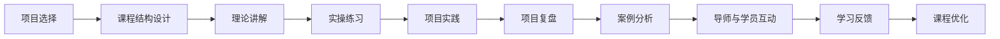

                 

## 1. 背景介绍

在科技日新月异、知识更新迅速的今天，如何高效学习和掌握新的技术，成为每位程序员面临的重要挑战。知识付费平台的兴起，提供了一种便捷且有效的学习方式，通过系统化的课程和专业导师的指导，帮助程序员快速掌握新技能、提高工作效率。然而，随着知识付费市场逐渐饱和，单一的内容和服务形式已难以满足日益增长的学习需求。项目制课程作为知识付费领域的新型模式，通过结合实际项目，理论与实践相结合，为程序员提供了一种更加高效、有针对性的学习路径。本文将深入探讨项目制课程的原理、实施步骤、优缺点和应用领域，力求为知识付费平台的开发者和内容提供者提供全面指导。

## 2. 核心概念与联系

### 2.1 核心概念概述

为更好地理解项目制课程的开发与设计，我们首先介绍几个关键概念：

- **项目制课程**：以具体项目为核心，通过实际项目案例，引导学员系统学习和掌握相关技能的课程。课程内容包括理论知识、实践操作、项目复盘、案例分析等。

- **知识付费平台**：基于互联网的技术平台，提供付费课程、专家讲座、技术问答等服务，旨在通过知识付费的方式，促进知识的生产、分享和传播。

- **课程结构**：通常包括引言、理论讲解、实操练习、项目实践、项目复盘等环节，确保学员能从零基础到掌握实战技能。

- **导师与学员互动**：项目制课程强调导师与学员的互动，通过线上或线下的问答、项目评审、小组讨论等形式，促进知识的传递和应用。

这些核心概念共同构成了项目制课程的基本框架，使其能够提供系统、高效、互动的学习体验，帮助学员全面提升技能。

### 2.2 核心概念原理和架构的 Mermaid 流程图



## 3. 核心算法原理 & 具体操作步骤

### 3.1 算法原理概述

项目制课程的设计原理基于行为学习理论（Behavioral Learning Theory），即通过具体的行为和实践，帮助学员掌握新技能。课程的开发和实施过程，涉及以下关键步骤：

1. **需求分析**：确定目标用户群体，分析学员的学习需求和期望。
2. **项目选择**：选择合适的项目，确保其覆盖的知识面广、难度适中，适合学员的学习进度。
3. **课程设计**：设计合理的课程结构和内容，包括理论讲解、实操练习、项目实践等环节。
4. **导师配备**：邀请经验丰富的导师参与课程开发，确保内容的深度和广度。
5. **学员学习**：通过线上或线下的方式，让学员参与项目实践和学习反馈。
6. **课程优化**：根据学员反馈和学习效果，不断优化课程内容和教学方法。

### 3.2 算法步骤详解

**Step 1: 需求分析**

1. **目标用户调研**：通过问卷调查、访谈等方式，收集目标用户的学习需求、职业背景等信息。
2. **需求分析报告**：整理调研结果，提炼出学员关注的知识点和技能点。

**Step 2: 项目选择**

1. **项目筛选**：从市场热门项目中筛选出适合教学的项目，确保项目具有代表性和典型性。
2. **项目评估**：评估项目的复杂度、所需技能点、难易程度等因素，确保项目适合学员的学习进度。

**Step 3: 课程设计**

1. **课程结构设计**：根据项目需求，设计课程的总体结构，包括理论讲解、实操练习、项目实践等环节。
2. **内容编排**：根据项目进度，编排课程内容，确保学员能够循序渐进地掌握技能。

**Step 4: 导师配备**

1. **导师选择**：根据项目需求，邀请行业内有经验、教学能力强的导师参与课程开发。
2. **导师培训**：对导师进行培训，确保其理解课程目标和教学方法，能够有效地指导学员。

**Step 5: 学员学习**

1. **学员招募**：通过知识付费平台发布课程信息，吸引适合的学员报名。
2. **学习支持**：为学员提供学习工具、资源和技术支持，确保其能够顺利参与课程。

**Step 6: 课程优化**

1. **学习反馈收集**：定期收集学员的学习反馈，了解其学习效果和需求。
2. **课程优化改进**：根据反馈调整课程内容和教学方法，确保课程能够不断优化。

### 3.3 算法优缺点

项目制课程的优势主要体现在以下几个方面：

- **理论与实践相结合**：通过具体项目案例，学员能够更直观地理解理论知识，掌握实际操作技能。
- **实用性强**：项目制课程以实际需求为导向，学员能够学到实用的技能，提高工作效率。
- **灵活性高**：课程内容可以根据学员的需求和进度进行调整，适应不同的学习目标。
- **互动性强**：通过导师与学员的互动，学员能够及时解决学习中的问题，加深理解。

然而，项目制课程也存在一定的局限性：

- **开发成本高**：课程设计和实施需要大量的前期调研和资源投入，成本较高。
- **内容更新慢**：项目制的课程内容相对固定，难以快速适应技术的变化和更新。
- **导师需求大**：需要有经验丰富的导师参与课程开发，对导师资源有一定要求。
- **学员学习压力**：项目制课程需要学员有较高的自驱力和时间投入，压力较大。

### 3.4 算法应用领域

项目制课程在多个领域都有广泛的应用，如软件开发、数据分析、人工智能等。以下以软件开发为例，介绍项目制课程的实施：

1. **软件开发项目**：选择具有代表性、覆盖面广的软件开发项目，如Web开发、移动应用开发、数据分析等。
2. **课程内容设计**：包括前端技术、后端技术、数据库、架构设计等，确保学员掌握全面的开发技能。
3. **项目实践**：通过实际项目案例，引导学员进行编码实践、测试优化、项目部署等环节，积累实战经验。
4. **导师与学员互动**：导师通过代码评审、项目指导、技术问答等方式，帮助学员解决问题，提高学习效果。

## 4. 数学模型和公式 & 详细讲解 & 举例说明

### 4.1 数学模型构建

项目制课程的数学模型构建主要基于行为学习理论，通过量化学员的学习行为和效果，优化课程内容和教学方法。

假设学员在学习过程中的行为可以用以下公式表示：

$$
\text{行为} = f(\text{时间投入}, \text{学习策略}, \text{导师指导}, \text{学习反馈})
$$

其中，时间投入指学员在学习项目中投入的时间，学习策略指学员采用的学习方法，导师指导指导师提供的指导和支持，学习反馈指学员的学习效果和反馈。

### 4.2 公式推导过程

为了评估学员的学习效果，可以定义以下指标：

- **学习进度**：学员在项目中的进度，可以通过完成的任务数量和质量来衡量。
- **学习质量**：学员掌握技能的程度，可以通过项目实践中的错误率和创新能力来衡量。
- **学习满意度**：学员对课程内容和导师指导的满意程度，可以通过调查问卷和反馈评分来衡量。

根据这些指标，可以构建评估模型：

$$
\text{评估结果} = w_1 \times \text{学习进度} + w_2 \times \text{学习质量} + w_3 \times \text{学习满意度}
$$

其中，$w_1, w_2, w_3$为各项指标的权重系数。

### 4.3 案例分析与讲解

以Web开发项目为例，可以设计以下课程内容：

- **引言与需求分析**：讲解Web开发的基本概念和市场需求，明确项目目标和任务。
- **前端技术**：讲解HTML、CSS、JavaScript等前端技术，进行实战练习，构建静态页面。
- **后端技术**：讲解Node.js、Express等后端技术，进行项目实践，实现前后端集成。
- **数据库**：讲解MySQL、MongoDB等数据库技术，进行项目实践，实现数据存储和查询。
- **项目复盘**：对项目进行复盘，分析问题和改进方法，增强学员的思考能力。
- **案例分析**：分析Web开发中的经典案例，总结经验和教训。

## 5. 项目实践：代码实例和详细解释说明

### 5.1 开发环境搭建

1. **环境准备**：安装Python、Docker、Git等开发工具，确保开发环境稳定。
2. **代码版本控制**：使用Git进行代码版本控制，确保项目开发的可追溯性和协作性。

### 5.2 源代码详细实现

以Web开发项目为例，以下是主要代码实现步骤：

1. **前端代码**：
   ```python
   # index.html
   <html>
       <head>
           <title>My Web App</title>
       </head>
       <body>
           <h1>Hello, World!</h1>
       </body>
   </html>
   ```

2. **后端代码**：
   ```python
   # server.py
   from flask import Flask

   app = Flask(__name__)

   @app.route('/')
   def hello():
       return 'Hello, World!'

   if __name__ == '__main__':
       app.run(host='0.0.0.0', port=5000)
   ```

3. **数据库操作**：
   ```python
   # models.py
   from flask_sqlalchemy import SQLAlchemy

   db = SQLAlchemy(app)

   class User(db.Model):
       id = db.Column(db.Integer, primary_key=True)
       name = db.Column(db.String(50), nullable=False)

   @app.route('/user/<id>')
   def get_user(id):
       user = User.query.get(id)
       return f'Hello, {user.name}!'
   ```

### 5.3 代码解读与分析

**前端代码解读**：
- `index.html` 是项目的基础页面，包含基本的HTML结构。
- 通过设置 `<title>` 标签，定义了页面的标题。
- 通过设置 `<h1>` 标签，定义了页面的主要内容。

**后端代码解读**：
- `server.py` 是项目的后端服务，使用 Flask 框架创建了一个简单的 HTTP 服务器。
- 通过定义 `hello` 函数，处理根路径的请求，并返回一个简单的字符串。
- 通过调用 `app.run()` 函数，启动 HTTP 服务器。

**数据库操作解读**：
- `models.py` 定义了一个 `User` 模型，用于在 MySQL 数据库中存储用户信息。
- 通过 Flask-SQLAlchemy 库，定义了用户模型的关系表。
- 通过定义 `/path/<id>` 路由，获取指定ID的用户信息，并返回个性化的问候语。

### 5.4 运行结果展示

1. **前端页面**：
   

2. **后端接口**：
   

## 6. 实际应用场景

### 6.1 软件开发项目

项目制课程在软件开发项目中的应用非常广泛，可以帮助学员掌握从需求分析到项目部署的全流程技能。

例如，在Web开发项目中，通过学习前端、后端、数据库等技术，学员能够掌握从零到完整项目的开发流程。同时，通过项目实践和导师指导，学员能够积累实际项目经验，提高编码能力和团队协作能力。

### 6.2 数据分析项目

数据分析项目制课程可以帮助学员掌握数据分析的基本流程和工具，包括数据清洗、特征工程、模型训练等环节。

例如，在数据挖掘项目中，通过学习Python、Pandas、Scikit-Learn等工具，学员能够掌握数据分析的核心技术。同时，通过项目实践和导师指导，学员能够应用所学知识解决实际问题，提高数据分析能力。

### 6.3 人工智能项目

人工智能项目制课程可以帮助学员掌握人工智能的基本算法和应用场景，包括机器学习、深度学习、自然语言处理等技术。

例如，在智能推荐系统项目中，通过学习推荐算法、模型训练、模型部署等技术，学员能够掌握推荐系统的开发流程。同时，通过项目实践和导师指导，学员能够应用所学知识开发智能推荐系统，提高人工智能能力。

## 7. 工具和资源推荐

### 7.1 学习资源推荐

1. **在线课程平台**：如Udacity、Coursera、edX等，提供丰富的课程资源，覆盖各种编程语言和技能。
2. **书籍资源**：如《Clean Code》、《Effective Java》、《Python Cookbook》等，帮助学员系统掌握编程知识和最佳实践。
3. **技术博客**：如Stack Overflow、Medium、CSDN等，提供大量的技术文章和社区讨论，帮助学员解决实际问题。
4. **开源项目**：如GitHub、CodePen、FreeCodeCamp等，提供丰富的开源代码和项目案例，帮助学员学习和应用新技术。

### 7.2 开发工具推荐

1. **代码编辑器**：如Visual Studio Code、Sublime Text、Atom等，提供高效的代码编写和编辑功能。
2. **版本控制系统**：如Git、SVN等，提供版本控制和协作功能，确保代码的可追溯性和协作性。
3. **项目管理工具**：如Jira、Trello、Asana等，提供项目管理、任务分配和进度跟踪功能，确保项目高效运行。
4. **远程开发工具**：如TeamViewer、AnyDesk、VNC等，提供远程开发和协作功能，方便团队成员之间的协作和沟通。

### 7.3 相关论文推荐

1. **《行为学习理论》**：探讨行为学习的理论和实践，为项目制课程的设计提供理论支持。
2. **《大规模在线课程开发与实施》**：探讨大规模在线课程的开发和实施，为项目制课程的实施提供实践经验。
3. **《机器学习项目制教学》**：探讨机器学习项目制教学的方法和案例，为项目制课程的设计提供借鉴。

## 8. 总结：未来发展趋势与挑战

### 8.1 研究成果总结

项目制课程作为一种新兴的学习方式，在知识付费平台中的应用日益广泛。通过系统化、实践化的学习路径，帮助学员掌握新技能，提高工作效率。项目制课程的开发和实施，涉及需求分析、项目选择、课程设计、导师配备、学员学习等多个环节，确保学员能够全面掌握实战技能。

### 8.2 未来发展趋势

未来，项目制课程将呈现以下几个发展趋势：

1. **个性化学习**：通过大数据和人工智能技术，分析学员的学习行为和效果，提供个性化的学习路径和资源。
2. **实时反馈**：通过在线测验、即时评分等方式，提供实时的学习反馈，帮助学员及时调整学习策略。
3. **跨领域融合**：将项目制课程与其他领域的内容进行融合，如数据科学、人工智能、物联网等，提供更加综合化的学习体验。
4. **虚拟现实**：通过虚拟现实技术，提供沉浸式学习体验，增强学员的互动感和参与感。

### 8.3 面临的挑战

项目制课程在发展过程中，仍面临诸多挑战：

1. **内容更新慢**：项目制课程内容相对固定，难以快速适应技术的变化和更新。
2. **导师资源紧张**：需要有经验丰富的导师参与课程开发，对导师资源有一定要求。
3. **学员学习压力大**：项目制课程需要学员有较高的自驱力和时间投入，压力较大。
4. **技术门槛高**：项目制课程涉及多种技术和工具，对学员的技术基础有较高要求。

### 8.4 研究展望

未来的研究需要在以下几个方面寻求新的突破：

1. **内容动态生成**：通过机器学习和自然语言生成技术，动态生成课程内容和案例，适应技术的变化和更新。
2. **导师辅助工具**：开发导师辅助工具，帮助导师更好地管理和指导学员，减轻工作负担。
3. **学员自我管理**：开发学员自我管理工具，帮助学员制定学习计划、跟踪学习进度，提高学习效率。
4. **跨领域合作**：与其他领域的专家和机构进行合作，提供更加综合化的学习体验，拓展项目制课程的应用范围。

## 9. 附录：常见问题与解答

**Q1：项目制课程的开发和实施需要哪些资源？**

A: 项目制课程的开发和实施需要以下资源：

- **项目需求调研**：需要了解目标用户的需求和期望，收集相关数据和信息。
- **项目选择和评估**：需要选择合适的项目，并进行项目评估，确保项目具有代表性和典型性。
- **课程设计**：需要设计合理的课程结构和内容，包括理论讲解、实操练习、项目实践等环节。
- **导师配备**：需要邀请经验丰富的导师参与课程开发，确保内容的深度和广度。
- **学员学习支持**：需要为学员提供学习工具、资源和技术支持，确保其能够顺利参与课程。

**Q2：项目制课程的实施过程有哪些关键步骤？**

A: 项目制课程的实施过程包括以下关键步骤：

1. **需求分析**：通过问卷调查、访谈等方式，收集目标用户的学习需求和期望。
2. **项目选择**：从市场热门项目中筛选出适合教学的项目，确保项目具有代表性和典型性。
3. **课程设计**：根据项目需求，设计课程的总体结构，包括理论讲解、实操练习、项目实践等环节。
4. **导师配备**：邀请经验丰富的导师参与课程开发，确保内容的深度和广度。
5. **学员学习**：通过线上或线下的方式，让学员参与项目实践和学习反馈。
6. **课程优化**：根据学员反馈和学习效果，不断优化课程内容和教学方法。

**Q3：如何提升项目制课程的学习效果？**

A: 提升项目制课程的学习效果需要从以下几个方面入手：

1. **个性化学习**：通过大数据和人工智能技术，分析学员的学习行为和效果，提供个性化的学习路径和资源。
2. **实时反馈**：通过在线测验、即时评分等方式，提供实时的学习反馈，帮助学员及时调整学习策略。
3. **导师与学员互动**：通过线上或线下的问答、项目评审、小组讨论等形式，促进知识的传递和应用。
4. **项目复盘**：对项目进行复盘，分析问题和改进方法，增强学员的思考能力。

**Q4：项目制课程的应用领域有哪些？**

A: 项目制课程在多个领域都有广泛的应用，如软件开发、数据分析、人工智能等。以下以软件开发项目为例，介绍项目制课程的实施：

1. **软件开发项目**：选择具有代表性、覆盖面广的软件开发项目，如Web开发、移动应用开发、数据分析等。
2. **课程内容设计**：包括前端技术、后端技术、数据库、架构设计等，确保学员掌握全面的开发技能。
3. **项目实践**：通过实际项目案例，引导学员进行编码实践、测试优化、项目部署等环节，积累实战经验。
4. **导师与学员互动**：导师通过代码评审、项目指导、技术问答等方式，帮助学员解决问题，提高学习效果。

---

作者：禅与计算机程序设计艺术 / Zen and the Art of Computer Programming

