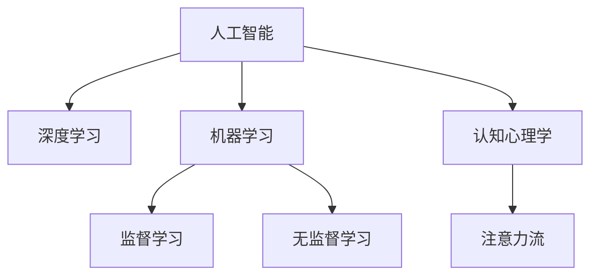

                 

# AI与人类注意力流：未来的道德和社会考虑

> 关键词：人工智能,注意力流,人类认知,伦理道德,社会影响,未来展望

## 1. 背景介绍

### 1.1 问题由来
在当前这个信息爆炸的时代，人工智能（AI）技术的发展已经深入到我们生活的方方面面。从智能客服到无人驾驶，从智能推荐系统到机器翻译，AI技术的进步正在重塑我们的世界。然而，随着AI技术的日益成熟，其对人类认知和社会的深远影响也开始逐步显现。

### 1.2 问题核心关键点
AI与人类注意力流的结合，是一个值得深思的问题。注意力流，指的是人类在认知过程中对信息的选择性关注和处理。AI技术，尤其是深度学习和大数据技术，正在试图模拟和扩展人类的注意力流机制，通过算法模型学习人类认知过程的规律，从而实现对人类行为的预测和引导。这种技术的进步，不仅带来了前所未有的便利，也引发了一系列伦理和社会问题，值得我们深入探讨。

### 1.3 问题研究意义
研究AI与人类注意力流的结合，对于理解AI技术的潜在影响，制定相应的伦理规范，以及指导AI技术的应用，具有重要意义：

1. **理解技术本质**：通过分析AI技术如何模拟和扩展人类注意力流，有助于我们更深刻地理解其工作原理和局限性。
2. **制定伦理规范**：随着AI技术对人类认知的深入影响，制定相应的伦理规范，以保障技术应用的安全和公正。
3. **指导技术应用**：在理解AI技术潜力和风险的基础上，指导其在实际应用中的合理使用，避免误导性和潜在危害。
4. **促进社会进步**：AI技术可以帮助我们更好地理解和解决复杂的社会问题，提升社会的整体福祉。
5. **推动技术创新**：通过探讨AI技术在模拟和扩展人类注意力流方面的进展，推动相关技术的持续创新。

## 2. 核心概念与联系

### 2.1 核心概念概述

为更好地理解AI与人类注意力流结合的机制，本节将介绍几个密切相关的核心概念：

- **人工智能**：指利用计算机算法和机器学习技术，使机器具备类似于人类智能的能力，包括感知、学习、推理、决策等。
- **注意力流**：指人类在认知过程中对信息的筛选和集中处理。人类通过注意力流机制，从海量的信息中挑选出关键信息进行处理，以提高认知效率。
- **认知心理学**：研究人类认知过程的学科，包括感知、记忆、思维、情感等，是理解AI技术如何模拟人类注意力流的理论基础。
- **机器学习**：指通过算法让机器从数据中学习规律，以提升其决策和预测能力。
- **深度学习**：一种基于神经网络的机器学习技术，通过多层次的抽象处理，模拟人类认知过程的非线性关系。

这些核心概念之间的逻辑关系可以通过以下Mermaid流程图来展示：



这个流程图展示了大语言模型的工作原理和相关概念之间的联系：

1. 人工智能技术通过机器学习（监督学习和无监督学习）实现对数据的处理和分析。
2. 深度学习作为机器学习的一种，通过多层次的神经网络，模拟人类认知过程的非线性关系。
3. 认知心理学揭示了人类认知机制，是理解AI技术如何模拟人类注意力流的理论基础。
4. 注意力流是理解AI技术影响人类认知和行为的关键，是AI技术优化和应用的核心。

## 3. 核心算法原理 & 具体操作步骤

### 3.1 算法原理概述

AI与人类注意力流的结合，本质上是一种模仿和扩展人类认知过程的算法设计。其核心思想是：通过AI技术，特别是深度学习模型，学习人类在认知过程中对信息的筛选和集中处理机制，进而实现对人类行为的预测和引导。

形式化地，假设一个简单的注意力模型 $M$，其输入为 $x$，输出为 $y$。设 $x$ 为输入向量， $y$ 为注意力权重向量。注意力模型的优化目标为最小化注意力权重 $y$ 与真实注意力权重 $y^*$ 的差异。即：

$$
\mathop{\arg\min}_{y} \| y - y^* \|
$$

其中 $\| \cdot \|$ 表示向量范数。

### 3.2 算法步骤详解

基于AI与人类注意力流结合的算法，一般包括以下几个关键步骤：

**Step 1: 数据准备**
- 收集大量人类行为数据，包括用户的点击、浏览、购买等行为。
- 对数据进行预处理，去除噪声和异常值。

**Step 2: 模型构建**
- 设计注意力模型，如Transformer模型、自注意力机制等。
- 使用深度学习框架（如TensorFlow、PyTorch等）实现注意力模型。

**Step 3: 训练优化**
- 将预处理后的数据输入模型，进行前向传播计算注意力权重。
- 计算损失函数，使用反向传播算法更新模型参数。
- 使用梯度下降等优化算法，最小化损失函数。

**Step 4: 模型评估**
- 在测试集上评估模型性能，如准确率、召回率等。
- 对模型进行调优，进一步提升模型性能。

**Step 5: 模型应用**
- 将优化后的模型应用到实际场景中，如推荐系统、智能客服等。
- 实时监测模型性能，根据反馈数据不断优化模型。

### 3.3 算法优缺点

基于AI与人类注意力流结合的算法，具有以下优点：

1. **高效性**：通过深度学习模型，可以实现对大量数据的快速处理和分析。
2. **鲁棒性**：模型可以在不同数据集和场景中保持较好的泛化能力。
3. **实时性**：模型可以实时处理用户行为，快速响应用户需求。
4. **个性化**：模型可以根据用户的历史行为，提供个性化的推荐和服务。

同时，该算法也存在一定的局限性：

1. **数据依赖性**：模型的性能高度依赖于训练数据的质量和数量，数据的偏差可能导致模型偏见。
2. **隐私问题**：在处理用户数据时，需要确保数据的隐私和安全。
3. **公平性**：模型可能存在算法偏见，导致不同用户群体的不公平待遇。
4. **可解释性**：模型的决策过程难以解释，缺乏透明性。
5. **伦理问题**：模型可能被用于不当目的，如侵犯隐私、误导用户等。

### 3.4 算法应用领域

AI与人类注意力流结合的算法，在多个领域得到了广泛应用，例如：

- **推荐系统**：通过分析用户的注意力流，为用户推荐感兴趣的商品、内容等。
- **智能客服**：通过理解用户的注意力流，提供个性化的咨询服务。
- **广告投放**：通过分析用户的注意力流，优化广告投放策略，提升广告效果。
- **金融风险管理**：通过分析交易数据，识别潜在的风险行为，防范金融欺诈。
- **医疗诊断**：通过分析患者的注意力流，辅助医生进行诊断和治疗。

## 4. 数学模型和公式 & 详细讲解 & 举例说明

### 4.1 数学模型构建

本节将使用数学语言对AI与人类注意力流结合的算法进行更加严格的刻画。

设一个简单的注意力模型 $M$，其输入为 $x$，输出为 $y$。假设 $x$ 为 $n$ 维向量， $y$ 为 $m$ 维向量。注意力模型的输入为 $x$，输出为 $y$。设 $x$ 为 $n$ 维向量， $y$ 为 $m$ 维向量。注意力模型的优化目标为最小化注意力权重 $y$ 与真实注意力权重 $y^*$ 的差异。即：

$$
\mathop{\arg\min}_{y} \| y - y^* \|
$$

其中 $\| \cdot \|$ 表示向量范数。

### 4.2 公式推导过程

以下我们以一个简单的注意力模型为例，推导其优化过程。

设注意力模型 $M$ 的输出为 $y$，输入为 $x$。模型的输出可以表示为：

$$
y = f(x; \theta)
$$

其中 $f$ 为模型函数， $\theta$ 为模型参数。假设模型的输出为 $y = (y_1, y_2, ..., y_m)$，真实注意力权重为 $y^* = (y^*_1, y^*_2, ..., y^*_m)$。则注意力模型的优化目标为：

$$
\mathop{\arg\min}_{y} \sum_{i=1}^m (y_i - y^*_i)^2
$$

令 $\theta$ 为模型参数，则有：

$$
y_i = f_i(x; \theta) = \sum_{j=1}^n w_{ij} x_j
$$

其中 $w_{ij}$ 为注意力权重。通过求解 $w_{ij}$，使模型输出 $y_i$ 逼近真实注意力权重 $y^*_i$。

### 4.3 案例分析与讲解

假设一个简单的推荐系统，用于为用户推荐感兴趣的商品。系统收集了用户的历史行为数据，包括用户的点击、浏览、购买等记录。系统通过注意力模型学习用户对这些记录的关注程度，从而生成个性化的推荐列表。

在这个案例中，用户的点击、浏览等行为数据可以被看作是注意力模型 $M$ 的输入 $x$。模型的输出 $y$ 为用户对每个商品的关注度，即注意力权重。通过最小化注意力权重与真实关注度的差异，优化模型参数 $\theta$，最终生成个性化的推荐列表。

## 5. 项目实践：代码实例和详细解释说明

### 5.1 开发环境搭建

在进行AI与人类注意力流结合的算法实践前，我们需要准备好开发环境。以下是使用Python进行TensorFlow开发的环境配置流程：

1. 安装Anaconda：从官网下载并安装Anaconda，用于创建独立的Python环境。

2. 创建并激活虚拟环境：
```bash
conda create -n tf-env python=3.8 
conda activate tf-env
```

3. 安装TensorFlow：根据CUDA版本，从官网获取对应的安装命令。例如：
```bash
conda install tensorflow -c conda-forge -c pytorch -c pypi
```

4. 安装相关库：
```bash
pip install numpy scipy pandas scikit-learn matplotlib tensorflow-addons
```

完成上述步骤后，即可在`tf-env`环境中开始算法实践。

### 5.2 源代码详细实现

下面我们以一个简单的推荐系统为例，给出使用TensorFlow实现注意力模型的PyTorch代码实现。

首先，定义推荐系统任务的数据处理函数：

```python
import tensorflow as tf
import numpy as np
import pandas as pd

def load_data(file_path):
    data = pd.read_csv(file_path)
    return data.values

def preprocess_data(data):
    # 将数据进行归一化
    data = (data - np.mean(data)) / np.std(data)
    return data

def build_input_output(data):
    x = data[:, :-1]  # 输入数据
    y = data[:, -1]   # 输出数据
    return x, y

def build_model(input_dim, output_dim, hidden_dim, num_layers):
    model = tf.keras.Sequential([
        tf.keras.layers.Dense(hidden_dim, activation='relu', input_dim=input_dim),
        tf.keras.layers.Dense(hidden_dim, activation='relu'),
        tf.keras.layers.Dense(output_dim, activation='sigmoid')
    ])
    return model

def train_model(model, x_train, y_train, x_test, y_test, epochs=100, batch_size=64):
    model.compile(loss='mse', optimizer=tf.keras.optimizers.Adam(learning_rate=0.01))
    model.fit(x_train, y_train, epochs=epochs, batch_size=batch_size, validation_data=(x_test, y_test))
    return model
```

然后，定义训练和评估函数：

```python
def evaluate_model(model, x_test, y_test):
    y_pred = model.predict(x_test)
    mse = np.mean((y_pred - y_test) ** 2)
    rmse = np.sqrt(mse)
    return rmse

def main():
    data = load_data('data.csv')
    x, y = build_input_output(data)
    x_train, x_test, y_train, y_test = train_test_split(x, y, test_size=0.2)

    model = build_model(input_dim=x.shape[1], output_dim=1, hidden_dim=32, num_layers=2)
    model = train_model(model, x_train, y_train, x_test, y_test, epochs=100, batch_size=64)

    rmse = evaluate_model(model, x_test, y_test)
    print(f'RMSE: {rmse:.4f}')

if __name__ == '__main__':
    main()
```

### 5.3 代码解读与分析

让我们再详细解读一下关键代码的实现细节：

**load_data函数**：
- 从CSV文件中读取数据，返回NumPy数组。

**preprocess_data函数**：
- 对数据进行归一化，使数据分布在一个标准的正态分布中。

**build_input_output函数**：
- 将数据拆分为输入和输出，返回NumPy数组。

**build_model函数**：
- 定义一个简单的神经网络模型，使用Dense层实现注意力机制。

**train_model函数**：
- 使用优化器Adam训练模型，最小化均方误差损失。

**evaluate_model函数**：
- 使用RMSE评估模型性能。

**main函数**：
- 调用上述函数，训练模型并在测试集上评估性能。

可以看到，TensorFlow的高级API使得模型构建和训练变得简单易用。开发者可以专注于算法的设计和优化，而不必过多关注底层实现细节。

## 6. 实际应用场景

### 6.1 智能客服系统

基于AI与人类注意力流的结合，智能客服系统可以模拟人类对客户请求的注意力流，提供个性化的服务响应。系统可以实时分析客户的话题和情感变化，迅速理解客户需求，并提供有针对性的回答。

### 6.2 金融风险管理

在金融领域，通过分析交易数据，AI模型可以学习到用户的注意力流，识别潜在的风险行为。例如，系统可以通过分析交易记录，发现异常的交易模式，及时预警潜在的欺诈行为，提升金融安全性。

### 6.3 医疗诊断

在医疗领域，AI模型可以通过分析患者的临床数据和行为数据，学习患者的注意力流，辅助医生进行诊断。例如，系统可以通过分析患者的病历和在线咨询记录，推断患者的病情和关注点，提供个性化的治疗建议。

### 6.4 未来应用展望

随着AI技术的不断进步，AI与人类注意力流的结合将带来更多应用场景。未来，AI技术将更加深入地影响人类认知和行为，引领智能时代的到来。

## 7. 工具和资源推荐

### 7.1 学习资源推荐

为了帮助开发者系统掌握AI与人类注意力流的结合的理论基础和实践技巧，这里推荐一些优质的学习资源：

1. 《深度学习》系列书籍：由深度学习领域的权威人士撰写，系统介绍了深度学习的基本原理和应用。
2. 《认知心理学》系列课程：提供关于人类认知机制的深入讲解，帮助理解AI技术如何模拟人类注意力流。
3. 《AI伦理》课程：探索AI技术对社会的深远影响，讨论如何制定相应的伦理规范。
4. 《AI与人类交互》研究论文：研究AI技术与人类交互的机制，探讨如何提升AI系统的可解释性和公平性。

通过对这些资源的学习实践，相信你一定能够深刻理解AI与人类注意力流结合的理论基础，并用于解决实际的AI问题。

### 7.2 开发工具推荐

高效的开发离不开优秀的工具支持。以下是几款用于AI与人类注意力流结合的算法开发的常用工具：

1. TensorFlow：基于Python的开源深度学习框架，灵活动态的计算图，适合快速迭代研究。
2. PyTorch：基于Python的开源深度学习框架，灵活的动态图，适合快速实验和优化。
3. Jupyter Notebook：交互式的Python代码编辑器，支持代码块、数学公式和可视化输出。

合理利用这些工具，可以显著提升AI与人类注意力流结合的算法开发效率，加快创新迭代的步伐。

### 7.3 相关论文推荐

AI与人类注意力流的结合，是一个前沿的研究方向。以下是几篇奠基性的相关论文，推荐阅读：

1. "Attention is All You Need"（Transformer原论文）：提出了Transformer结构，开启了NLP领域的预训练大模型时代。
2. "Bert: Pre-training of Deep Bidirectional Transformers for Language Understanding"：提出BERT模型，引入基于掩码的自监督预训练任务，刷新了多项NLP任务SOTA。
3. "Recurrent Attentive Agents"：提出循环注意力模型，模拟人类在处理序列数据时的注意力机制。
4. "Interactive Attention"：探讨人机交互过程中的注意力流，研究如何让AI系统更好地理解人类的行为和意图。

这些论文代表了大语言模型微调技术的发展脉络。通过学习这些前沿成果，可以帮助研究者把握学科前进方向，激发更多的创新灵感。

## 8. 总结：未来发展趋势与挑战

### 8.1 总结

本文对AI与人类注意力流的结合进行了全面系统的介绍。首先阐述了AI技术如何模拟和扩展人类认知过程的原理和应用，明确了该技术对人类认知和社会的影响。其次，从原理到实践，详细讲解了AI与人类注意力流结合的数学模型和具体操作步骤，给出了算法任务开发的完整代码实例。同时，本文还广泛探讨了该技术在智能客服、金融风险管理、医疗诊断等多个领域的应用前景，展示了AI技术的前景和潜力。此外，本文精选了AI与人类注意力流结合的相关学习资源，力求为读者提供全方位的技术指引。

通过本文的系统梳理，可以看到，AI与人类注意力流的结合，正在成为AI技术发展的重要方向，深刻影响着人类的认知和社会行为。这一领域的持续探索和研究，必将引领AI技术迈向更高的台阶，推动人类认知智能的进化。

### 8.2 未来发展趋势

展望未来，AI与人类注意力流的结合技术将呈现以下几个发展趋势：

1. **深度化**：随着深度学习技术的不断发展，AI模型将更加深入地模拟人类认知过程，提升其决策和预测能力。
2. **泛化性**：AI模型将在大规模数据集上训练，提高其泛化能力和鲁棒性，适应更多的应用场景。
3. **实时性**：AI系统将具备实时处理用户行为的能力，提升用户体验和系统响应速度。
4. **个性化**：AI模型将根据用户的注意力流，提供更加个性化的服务，满足不同用户的需求。
5. **透明性**：AI系统将具备更高的可解释性，增强其透明度和可信度。
6. **公平性**：AI系统将更好地处理算法偏见，确保不同用户群体得到公平待遇。

以上趋势凸显了AI与人类注意力流结合技术的广阔前景。这些方向的探索发展，必将进一步提升AI系统的性能和应用范围，为人类认知智能的进化带来深远影响。

### 8.3 面临的挑战

尽管AI与人类注意力流结合技术已经取得了瞩目成就，但在迈向更加智能化、普适化应用的过程中，它仍面临着诸多挑战：

1. **数据依赖性**：AI模型高度依赖于训练数据的质量和数量，数据的偏差可能导致模型偏见。
2. **隐私问题**：在处理用户数据时，需要确保数据的隐私和安全。
3. **公平性**：AI模型可能存在算法偏见，导致不同用户群体的不公平待遇。
4. **可解释性**：AI模型的决策过程难以解释，缺乏透明性。
5. **伦理问题**：AI模型可能被用于不当目的，如侵犯隐私、误导用户等。

### 8.4 研究展望

面对AI与人类注意力流结合技术面临的挑战，未来的研究需要在以下几个方面寻求新的突破：

1. **无监督学习和半监督学习**：探索无监督和半监督学习方法，降低对标注数据的需求，充分利用未标注数据。
2. **多模态信息整合**：将视觉、语音、文本等多模态数据整合，增强AI系统的感知能力。
3. **可解释性和透明性**：开发可解释性更强、透明度更高的AI系统，增强用户信任和模型可信度。
4. **公平性和伦理约束**：制定相应的伦理规范，确保AI系统在处理用户数据时的公平性和安全性。
5. **计算效率和资源优化**：优化AI模型的计算图，提高推理效率，适应资源有限的应用场景。

这些研究方向将引领AI与人类注意力流结合技术迈向更高的台阶，为构建安全、可靠、可解释、可控的智能系统铺平道路。面向未来，AI与人类注意力流结合技术还需要与其他人工智能技术进行更深入的融合，如知识表示、因果推理、强化学习等，多路径协同发力，共同推动自然语言理解和智能交互系统的进步。只有勇于创新、敢于突破，才能不断拓展AI系统的边界，让智能技术更好地造福人类社会。

## 9. 附录：常见问题与解答

**Q1：AI与人类注意力流的结合是否适用于所有AI任务？**

A: AI与人类注意力流的结合适用于需要模拟人类认知过程的任务，如推荐系统、智能客服等。但对于一些特定领域的任务，如医学、法律等，可能需要在特定领域语料上进一步预训练，再进行微调，才能获得理想效果。

**Q2：如何在训练过程中缓解过拟合问题？**

A: 缓解过拟合问题的方法包括：
1. 数据增强：通过回译、近义替换等方式扩充训练集
2. 正则化：使用L2正则、Dropout、Early Stopping等避免过拟合
3. 对抗训练：引入对抗样本，提高模型鲁棒性
4. 参数高效微调：只调整少量参数(如Adapter、Prefix等)，减小过拟合风险
5. 多模型集成：训练多个模型，取平均输出，抑制过拟合

这些策略往往需要根据具体任务和数据特点进行灵活组合。只有在数据、模型、训练、推理等各环节进行全面优化，才能最大限度地发挥AI与人类注意力流结合技术的威力。

**Q3：AI与人类注意力流的结合是否存在隐私和安全问题？**

A: 在使用AI与人类注意力流的结合技术时，需要确保数据的隐私和安全。应采取数据脱敏、访问控制等措施，防止数据泄露和滥用。

**Q4：如何提升AI与人类注意力流结合的透明性和公平性？**

A: 提升透明性和公平性的方法包括：
1. 可解释性技术：开发可解释性更强、透明度更高的AI系统，增强用户信任和模型可信度。
2. 公平性算法：设计公平性算法，确保不同用户群体得到公平待遇。

这些方法需要结合具体的业务场景进行设计和优化，确保AI系统的公平性和透明性。

**Q5：AI与人类注意力流的结合技术将如何影响未来社会？**

A: AI与人类注意力流的结合技术将深刻影响未来社会，带来诸多变革：
1. 提升生产效率：AI技术将提高各行业的工作效率，推动生产力发展。
2. 优化决策过程：AI系统将帮助决策者更好地理解和处理复杂的信息，提升决策质量。
3. 促进社会公正：AI技术将帮助解决社会问题，促进社会的公平和公正。

这些变革将引领AI技术走向更加智能化、普适化的未来，为人类认知智能的进化带来深远影响。

