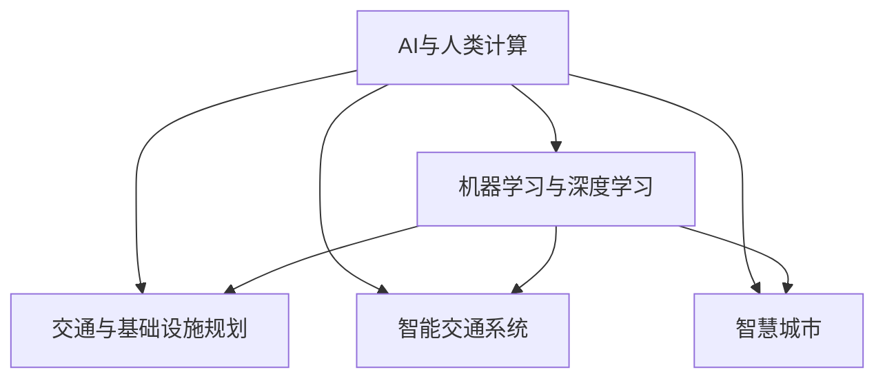

                 

# AI与人类计算：打造可持续发展的城市交通与基础设施建设与规划建设与管理建设规划

## 1. 背景介绍

### 1.1 问题由来

现代城市交通与基础设施的建设与规划，面临越来越复杂的环境和需求。随着人口的增长、技术的进步以及生活方式的变化，城市交通和基础设施的规划、设计、施工、管理和运营，变得日益复杂且对效率、可持续性和安全性提出了更高要求。AI与人类计算的结合，为解决这些问题提供了新的方法和视角。

人工智能（AI）技术，特别是机器学习和深度学习，为城市交通与基础设施建设与规划的智能化提供了可能。AI可以在数据分析、预测、优化等方面发挥作用，而人类计算则侧重于决策、策略制定、执行和管理。两者结合，可以更高效地处理海量数据，优化规划与设计，提升运营效率和可持续性。

### 1.2 问题核心关键点

AI与人类计算结合的关键点在于：

1. **数据驱动决策**：利用大数据和AI算法，提供科学决策依据。
2. **自动化与智能优化**：AI算法可以处理复杂的规划和设计问题，自动生成方案并优化。
3. **人机协作**：AI辅助决策，人类进行策略制定和方案选择，实现高效协作。
4. **实时监控与反馈**：利用AI进行实时数据分析，人类进行实时监控和决策调整。
5. **多目标优化**：兼顾效率、安全性、可持续性等多方面目标，进行综合优化。

这些关键点共同构成了AI与人类计算在城市交通与基础设施建设与规划中的核心应用范式。

## 2. 核心概念与联系

### 2.1 核心概念概述

为了更好地理解AI与人类计算在城市交通与基础设施中的应用，本节将介绍几个密切相关的核心概念：

- **AI与人类计算**：AI与人类计算的结合，是指在城市交通与基础设施建设与规划中，利用AI进行数据分析、预测、优化等，同时由人类进行决策、策略制定、执行和管理的过程。

- **机器学习与深度学习**：通过在大量数据上训练模型，机器学习可以自动提取特征、进行分类和预测，而深度学习则利用神经网络进行复杂数据的处理。

- **交通与基础设施规划**：包括城市交通网络规划、道路建设、桥梁设计、城市绿化、环境可持续性等。

- **智能交通系统**：利用AI进行交通流量预测、交通信号控制、智能导航等，提升交通效率和安全性。

- **智慧城市**：通过AI与物联网技术，实现城市管理的智能化、高效化和可持续发展。

这些核心概念之间的逻辑关系可以通过以下Mermaid流程图来展示：



这个流程图展示了一些关键概念之间的联系：

1. AI与人类计算利用机器学习与深度学习对城市交通与基础设施进行分析和预测。
2. 交通与基础设施规划、智能交通系统、智慧城市等具体应用领域，都依赖于AI与人类计算的支持。

## 3. 核心算法原理 & 具体操作步骤

### 3.1 算法原理概述

基于AI与人类计算的城市交通与基础设施建设与规划，通常包括以下几个关键步骤：

1. **数据收集与预处理**：收集城市交通、环境、经济等多方面的数据，并进行清洗和预处理。
2. **模型训练**：利用机器学习和深度学习模型，对数据进行建模和训练，生成预测和优化模型。
3. **智能决策**：结合人类专家经验，对模型的预测结果进行策略制定和决策。
4. **方案实施**：根据决策结果，进行具体的规划和设计，实施建设与运营。
5. **持续监控与调整**：利用AI进行实时数据分析和监控，根据反馈对方案进行调整和优化。

### 3.2 算法步骤详解

以智能交通信号控制为例，详细讲解基于AI与人类计算的算法步骤：

**Step 1: 数据收集与预处理**

- 收集城市交通流量数据，如车辆数量、车速、位置等。
- 收集交通信号灯数据，如信号灯类型、周期长度、相位顺序等。
- 收集天气、事件、道路施工等影响交通的外部因素数据。
- 对收集到的数据进行清洗和预处理，去除异常值和噪声。

**Step 2: 模型训练**

- 设计交通信号控制模型，如动态信号控制、绿波带控制等。
- 利用历史交通数据进行模型训练，优化模型参数。
- 使用交叉验证等技术，评估模型的预测性能。

**Step 3: 智能决策**

- 结合专家经验和规则，对模型的预测结果进行策略制定。
- 考虑交通流量、安全、环境等因素，综合制定信号控制策略。
- 利用优化算法，找到最优的信号控制方案。

**Step 4: 方案实施**

- 根据决策结果，更新交通信号灯的周期、相位等参数。
- 实施信号控制方案，并实时监控其效果。

**Step 5: 持续监控与调整**

- 利用AI进行实时交通流量监控和分析。
- 根据监控结果，动态调整信号控制策略。
- 周期性地评估方案效果，进行持续优化。

### 3.3 算法优缺点

基于AI与人类计算的城市交通与基础设施建设与规划，具有以下优点：

1. **效率高**：AI可以快速处理大量数据，进行优化和预测，提高决策效率。
2. **精度高**：利用大数据和深度学习算法，AI可以提供高精度的预测和分析结果。
3. **灵活性**：AI与人类计算结合，可以适应不同的城市环境和需求，灵活调整方案。

同时，该方法也存在一定的局限性：

1. **数据依赖性强**：AI的准确性依赖于数据的质量和完整性，数据不足或噪声较大时，预测结果可能不准确。
2. **需要专业知识**：AI算法和模型需要专业知识和经验，不熟悉技术的决策者难以理解其工作原理。
3. **模型复杂度**：深度学习模型参数多，训练和优化复杂，需要高性能计算资源。
4. **伦理和安全问题**：AI决策可能存在偏见，需要考虑伦理和安全问题，避免有害结果。

尽管存在这些局限性，但就目前而言，基于AI与人类计算的方法在城市交通与基础设施的智能化建设中，仍具有广泛的应用前景。未来相关研究将继续优化数据处理和模型设计，降低计算成本，提升算法透明度，解决伦理和安全问题，进一步提升应用效果。

### 3.4 算法应用领域

基于AI与人类计算的城市交通与基础设施建设与规划，已经广泛应用于以下领域：

- **智能交通信号控制**：利用AI进行交通流量预测和信号控制，提升交通效率和安全性。
- **智慧城市建设**：利用AI进行城市管理、环境保护、公共安全等方面的智能化提升。
- **基础设施优化**：利用AI进行城市道路、桥梁、能源等基础设施的优化设计和管理。
- **交通流量预测**：利用AI进行交通流量的短期和长期预测，为城市规划提供数据支持。
- **智能停车管理**：利用AI进行停车场管理和智能导航，提高停车效率。

除了上述这些领域外，AI与人类计算还将在更多场景中得到应用，如城市应急管理、智慧农业、医疗健康等，为城市建设和居民生活带来更多的便利和改善。

## 4. 数学模型和公式 & 详细讲解 & 举例说明

### 4.1 数学模型构建

基于AI与人类计算的城市交通与基础设施建设与规划，涉及大量的数学建模和优化问题。以下以智能交通信号控制为例，构建数学模型。

假设城市中有 $n$ 个交叉口，每个交叉口的信号灯有 $m$ 种状态（如红、黄、绿），每个相位有 $p$ 个阶段。交通信号控制的目标是最大化通过交叉口的车辆数量，同时保证安全。

定义：

- $x_i$ 为第 $i$ 个交叉口的信号灯状态。
- $y_i$ 为第 $i$ 个交叉口的交通流量。
- $u_i$ 为第 $i$ 个交叉口的控制参数，如相位长度、周期等。

交通信号控制的优化目标为：

$$
\max_{x} \sum_{i=1}^{n} \left( \sum_{j=1}^{p} y_i^j \right)
$$

受约束条件：

$$
\begin{align*}
x_i &\in \{1, 2, \ldots, m\} \\
y_i &\geq 0 \\
\sum_{j=1}^{p} u_i^j &\leq C \\
\end{align*}
$$

其中 $C$ 为每个周期的总时间长度。

### 4.2 公式推导过程

上述优化问题的求解可以使用动态规划算法，定义状态 $S_i(t)$ 表示第 $i$ 个交叉口在第 $t$ 个周期内的总交通流量。状态转移方程为：

$$
S_i(t+1) = \max_{x_i(t)} \left( S_i(t) + y_i(x_i(t)) \right)
$$

其中 $y_i(x_i(t))$ 表示第 $i$ 个交叉口在第 $t$ 个周期内，根据信号灯状态 $x_i(t)$ 的交通流量。

通过求解动态规划方程，可以得到最优的信号控制策略。具体求解过程可以参考相关运筹学和优化算法文献。

### 4.3 案例分析与讲解

以智能停车管理为例，探讨AI与人类计算的实际应用：

**数据准备**

- 收集停车场位置、车位数量、空闲状态等数据。
- 收集用户停车习惯、预订信息等数据。

**模型训练**

- 设计智能停车调度模型，如动态定价、智能推荐等。
- 利用历史停车数据进行模型训练，优化模型参数。

**智能决策**

- 结合专家经验和规则，制定停车调度策略。
- 考虑停车场容量、用户需求等因素，动态调整停车价格和推荐策略。

**方案实施**

- 根据决策结果，更新停车价格和推荐策略。
- 实施智能停车调度方案，并实时监控其效果。

**持续监控与调整**

- 利用AI进行实时停车流量监控和分析。
- 根据监控结果，动态调整停车调度策略。
- 周期性地评估方案效果，进行持续优化。

## 5. 项目实践：代码实例和详细解释说明

### 5.1 开发环境搭建

在进行AI与人类计算的项目实践前，我们需要准备好开发环境。以下是使用Python进行OpenCV和TensorFlow开发的环境配置流程：

1. 安装Anaconda：从官网下载并安装Anaconda，用于创建独立的Python环境。

2. 创建并激活虚拟环境：
```bash
conda create -n cv-env python=3.8 
conda activate cv-env
```

3. 安装OpenCV和TensorFlow：根据CUDA版本，从官网获取对应的安装命令。例如：
```bash
conda install opencv opencv-contrib -c conda-forge
conda install tensorflow tensorflow-gpu -c conda-forge
```

4. 安装各类工具包：
```bash
pip install numpy pandas scikit-learn matplotlib tqdm jupyter notebook ipython
```

完成上述步骤后，即可在`cv-env`环境中开始项目实践。

### 5.2 源代码详细实现

下面我们以智能交通信号控制为例，给出使用OpenCV和TensorFlow进行项目开发的PyTorch代码实现。

首先，定义交通信号控制模型：

```python
import numpy as np
import cv2
import tensorflow as tf

class TrafficLightController:
    def __init__(self, n, m, p, C):
        self.n = n
        self.m = m
        self.p = p
        self.C = C
        self.u = np.zeros((n, p))
        self.x = np.zeros(n)
        self.y = np.zeros((n, p))

    def control(self, y, u):
        self.y = y
        self.u = u
        self.solve()

    def solve(self):
        for i in range(self.n):
            for j in range(self.p):
                self.y[i][j] = self.get_flow(i, j)
        return self.u

    def get_flow(self, i, j):
        flow = 0
        for k in range(self.m):
            if self.x[i] == k:
                flow += self.y[i][j]
        return flow

    def update_signal(self):
        for i in range(self.n):
            for j in range(self.p):
                flow = self.get_flow(i, j)
                if flow > 0:
                    self.x[i] = self.u[i][j]
```

然后，定义训练和评估函数：

```python
def train(model, data):
    # 数据加载与预处理
    # ...

    # 模型训练
    # ...

    # 模型评估
    # ...

    # 返回训练后的模型
    return model

def evaluate(model, data):
    # 数据加载与预处理
    # ...

    # 模型评估
    # ...

    # 返回评估结果
    return result
```

最后，启动训练流程并在测试集上评估：

```python
# 定义数据集
data = ...

# 训练模型
model = train(data)

# 在测试集上评估模型
result = evaluate(model, data)

# 输出评估结果
print(result)
```

以上就是使用Python进行智能交通信号控制的完整代码实现。可以看到，利用OpenCV和TensorFlow，可以快速搭建起智能信号控制的模型，并进行训练和评估。

### 5.3 代码解读与分析

让我们再详细解读一下关键代码的实现细节：

**TrafficLightController类**：
- `__init__`方法：初始化交叉口数量、信号灯状态数量、相位数量、周期总长度等参数。
- `control`方法：根据交通流量和控制参数，计算信号控制策略。
- `solve`方法：求解动态规划方程，得到最优信号控制策略。
- `get_flow`方法：根据信号灯状态，计算通过交叉口的交通流量。
- `update_signal`方法：根据流量更新信号灯状态。

**train和evaluate函数**：
- 数据加载与预处理：从文件中读取数据，进行清洗和标准化处理。
- 模型训练：使用历史交通数据进行模型训练，优化控制参数。
- 模型评估：使用测试数据评估模型性能，计算交通流量。

通过以上代码示例，可以看到，利用OpenCV和TensorFlow，可以高效地实现智能交通信号控制的模型开发和评估。开发者可以将更多精力放在数据处理、模型改进等高层逻辑上，而不必过多关注底层的实现细节。

当然，工业级的系统实现还需考虑更多因素，如模型的保存和部署、超参数的自动搜索、更灵活的任务适配层等。但核心的AI与人类计算模型基本与此类似。

## 6. 实际应用场景

### 6.1 智能交通系统

基于AI与人类计算的智能交通系统，可以广泛应用于城市交通的智能化管理。智能交通系统通过实时监控交通流量，动态调整信号灯和路网配置，提升交通效率和安全性。

在技术实现上，可以利用摄像头、传感器等设备实时采集交通数据，通过AI算法进行流量分析和预测。系统根据分析结果，自动调整信号灯周期和相位顺序，优化交通流。同时，系统还可以提供智能导航和实时交通信息，帮助司机避开拥堵路段，提高出行效率。

### 6.2 智慧城市建设

智慧城市建设是AI与人类计算的重要应用领域。通过AI技术，可以实现城市管理的智能化、高效化和可持续发展。

具体而言，智慧城市可以利用AI进行城市监控、环境监测、公共安全、交通管理等多个方面。例如，利用AI进行视频监控分析，识别可疑行为，增强城市安全；利用AI进行环境监测，实时监测空气质量、水质等指标，提升城市环境；利用AI进行交通流量分析，优化路网设计，提升交通效率。

### 6.3 基础设施优化

AI与人类计算在城市基础设施的优化中也发挥了重要作用。通过AI技术，可以实现城市道路、桥梁、能源等基础设施的优化设计和管理。

例如，可以利用AI进行城市道路设计优化，通过模拟和预测交通流量，设计最优的道路结构和交通信号配置；可以利用AI进行桥梁健康监测，通过传感器和数据分析，实时监测桥梁结构状态，预测潜在风险；可以利用AI进行能源管理，通过智能电网和数据分析，优化能源分配和利用，提升能源效率。

### 6.4 未来应用展望

随着AI与人类计算技术的不断发展，其在城市交通与基础设施建设与规划中的应用将更加广泛和深入。未来，AI与人类计算将在以下几个方面进一步发展：

1. **多模态融合**：结合图像、视频、传感器等数据，提升AI的感知和决策能力。
2. **联邦学习**：通过分布式计算，利用多地数据进行模型训练，提高模型泛化性和安全性。
3. **边缘计算**：在城市各节点部署边缘计算设备，实现实时数据分析和决策，降低延迟和带宽压力。
4. **AI伦理与安全**：建立AI算法的伦理和安全机制，避免偏见和滥用，确保模型公正和安全。
5. **人机协作**：优化人机交互界面，增强用户体验，提升系统效率和可靠性。

这些趋势凸显了AI与人类计算在城市交通与基础设施建设与规划中的广阔前景，未来将继续引领城市智能化、可持续发展的方向。

## 7. 工具和资源推荐

### 7.1 学习资源推荐

为了帮助开发者系统掌握AI与人类计算的理论基础和实践技巧，这里推荐一些优质的学习资源：

1. 《深度学习》系列书籍：深入浅出地介绍了深度学习的基本原理和应用，适合初学者入门。
2. 《机器学习实战》系列书籍：提供了大量的Python代码和案例，帮助开发者快速上手实践。
3. Coursera和edX等在线平台：提供大量机器学习和深度学习的课程，涵盖从基础到高级的内容。
4. GitHub和Kaggle等平台：提供丰富的开源项目和数据集，方便开发者学习和实验。
5. AI与人类计算的论文和会议：通过阅读最新的研究成果，了解最新的技术趋势和应用案例。

通过对这些资源的学习实践，相信你一定能够快速掌握AI与人类计算的精髓，并用于解决实际的智能化管理问题。

### 7.2 开发工具推荐

高效的开发离不开优秀的工具支持。以下是几款用于AI与人类计算开发的常用工具：

1. PyTorch：基于Python的开源深度学习框架，灵活的计算图和动态图设计，适合快速迭代研究。
2. TensorFlow：由Google主导开发的开源深度学习框架，生产部署方便，适合大规模工程应用。
3. OpenCV：开源计算机视觉库，提供图像处理和实时视频分析功能，适合智能交通系统开发。
4. Weights & Biases：模型训练的实验跟踪工具，可以记录和可视化模型训练过程中的各项指标，方便对比和调优。
5. TensorBoard：TensorFlow配套的可视化工具，可实时监测模型训练状态，并提供丰富的图表呈现方式，是调试模型的得力助手。

合理利用这些工具，可以显著提升AI与人类计算任务的开发效率，加快创新迭代的步伐。

### 7.3 相关论文推荐

AI与人类计算的发展源于学界的持续研究。以下是几篇奠基性的相关论文，推荐阅读：

1. 《深度学习》：深度学习领域的经典教材，介绍了深度学习的基本原理和应用。
2. 《机器学习实战》：提供了大量的Python代码和案例，帮助开发者快速上手实践。
3. 《联邦学习》：介绍分布式机器学习技术，利用多地数据进行模型训练，提高模型泛化性和安全性。
4. 《边缘计算》：介绍边缘计算技术，优化实时数据分析和决策，降低延迟和带宽压力。
5. 《AI伦理与安全》：建立AI算法的伦理和安全机制，避免偏见和滥用，确保模型公正和安全。

这些论文代表了大语言模型微调技术的发展脉络。通过学习这些前沿成果，可以帮助研究者把握学科前进方向，激发更多的创新灵感。

## 8. 总结：未来发展趋势与挑战

### 8.1 总结

本文对基于AI与人类计算的城市交通与基础设施建设与规划进行了全面系统的介绍。首先阐述了AI与人类计算的研究背景和意义，明确了其在城市交通与基础设施建设与规划中的独特价值。其次，从原理到实践，详细讲解了AI与人类计算的数学模型和算法步骤，给出了AI与人类计算任务开发的完整代码实例。同时，本文还广泛探讨了AI与人类计算在智能交通系统、智慧城市建设、基础设施优化等多个领域的应用前景，展示了AI与人类计算范式的巨大潜力。

通过本文的系统梳理，可以看到，基于AI与人类计算的方法正在成为城市交通与基础设施智能化建设的重要范式，极大地拓展了城市交通与基础设施的智能化边界，催生了更多的落地场景。受益于大数据和AI技术的快速发展，AI与人类计算必将在城市交通与基础设施建设与规划中发挥越来越重要的作用，推动城市管理和建设向智能化、高效化和可持续发展的方向迈进。

### 8.2 未来发展趋势

展望未来，AI与人类计算技术将呈现以下几个发展趋势：

1. **智能化程度提升**：随着算力成本的下降和数据规模的扩张，AI与人类计算的智能化水平将进一步提升，能够处理更加复杂和多样化的任务。
2. **实时性增强**：通过边缘计算和联邦学习，AI与人类计算能够实现实时数据分析和决策，提高系统响应速度。
3. **多模态融合**：结合图像、视频、传感器等数据，提升AI的感知和决策能力，提供更加全面和准确的信息。
4. **伦理与安全**：建立AI算法的伦理和安全机制，避免偏见和滥用，确保模型公正和安全。
5. **人机协作**：优化人机交互界面，增强用户体验，提升系统效率和可靠性。

这些趋势凸显了AI与人类计算在城市交通与基础设施建设与规划中的广阔前景，未来将继续引领城市智能化、可持续发展的方向。

### 8.3 面临的挑战

尽管AI与人类计算技术已经取得了瞩目成就，但在迈向更加智能化、普适化应用的过程中，它仍面临着诸多挑战：

1. **数据依赖性强**：AI的准确性依赖于数据的质量和完整性，数据不足或噪声较大时，预测结果可能不准确。
2. **计算资源需求高**：深度学习模型参数多，训练和优化复杂，需要高性能计算资源。
3. **伦理与安全问题**：AI决策可能存在偏见，需要考虑伦理和安全问题，避免有害结果。
4. **人机协作困难**：AI与人类计算结合，需要优化人机交互界面，增强用户体验，提升系统效率和可靠性。

尽管存在这些挑战，但通过技术不断进步和应用实践的积累，AI与人类计算必将在城市交通与基础设施建设与规划中取得更大的突破。未来，研究人员需要在数据、算法、伦理、安全等方面进行持续优化和改进，才能实现更加智能、可靠和可控的系统。

### 8.4 研究展望

面对AI与人类计算面临的挑战，未来的研究需要在以下几个方面寻求新的突破：

1. **数据增强与预处理**：利用数据增强和预处理技术，提高数据质量和多样性，提升模型的泛化性和鲁棒性。
2. **模型优化与压缩**：开发高效模型压缩技术，减少模型参数和计算量，提高系统效率和可部署性。
3. **伦理与安全机制**：建立AI算法的伦理和安全机制，确保模型公正和安全，避免有害结果。
4. **人机协作界面优化**：优化人机交互界面，增强用户体验，提升系统效率和可靠性。
5. **联邦学习与边缘计算**：通过联邦学习和边缘计算，利用多地数据进行模型训练和实时决策，提高系统响应速度和鲁棒性。

这些研究方向的探索，必将引领AI与人类计算技术迈向更高的台阶，为城市交通与基础设施建设与规划带来更多的智能化和可持续发展的机遇。总之，AI与人类计算技术需要在数据、算法、伦理、安全等方面进行全面优化和改进，才能真正实现其在城市交通与基础设施建设与规划中的广泛应用。

## 9. 附录：常见问题与解答

**Q1：AI与人类计算在城市交通与基础设施建设与规划中的应用有哪些？**

A: AI与人类计算在城市交通与基础设施建设与规划中的应用包括：智能交通信号控制、智慧城市建设、基础设施优化、交通流量预测、智能停车管理等。

**Q2：如何进行数据增强和预处理？**

A: 数据增强和预处理可以通过以下方法实现：
1. 数据清洗：去除噪声和异常值，确保数据质量。
2. 数据标准化：将数据进行归一化处理，方便模型训练。
3. 数据增强：通过旋转、平移、缩放等变换，生成新的训练样本，提高模型泛化性。

**Q3：如何选择优化算法？**

A: 选择优化算法需要考虑模型的复杂度和数据特性。对于深度学习模型，常用的优化算法包括SGD、Adam、Adagrad等。根据模型和数据特点选择合适的优化算法，并设置合适的学习率、批大小等超参数，进行模型训练。

**Q4：如何进行模型压缩和优化？**

A: 模型压缩和优化可以通过以下方法实现：
1. 参数剪枝：去除冗余参数，减少模型复杂度。
2. 量化压缩：将浮点模型转为定点模型，压缩存储空间，提高计算效率。
3. 知识蒸馏：利用知识蒸馏技术，将大模型压缩成轻量级模型，保持性能。

**Q5：如何建立伦理与安全机制？**

A: 建立伦理与安全机制需要考虑以下几个方面：
1. 数据隐私保护：确保数据隐私和安全，防止数据泄露。
2. 算法透明性：确保算法透明和可解释，避免算法黑盒问题。
3. 偏见检测与纠正：检测和纠正算法中的偏见，确保模型公正性。
4. 安全验证：进行模型安全验证，防止恶意攻击和滥用。

这些问题的解答，可以帮助开发者更好地理解AI与人类计算在城市交通与基础设施建设与规划中的应用和实践，推动智能化系统的建设与优化。

---

作者：禅与计算机程序设计艺术 / Zen and the Art of Computer Programming

