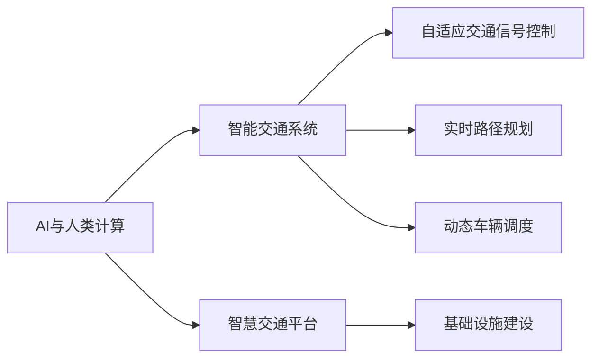

                 

# AI与人类计算：打造可持续发展的城市交通管理系统与基础设施建设

## 1. 背景介绍

### 1.1 问题由来
随着城市化进程的不断加速，全球城市人口和车辆密度大幅增加，交通拥堵问题日益严峻。据统计，全球约三分之一的汽车行驶时间都耗费在交通拥堵中，这不仅增加了能源消耗，还导致了严重的环境污染和社会成本。为了解决这一挑战，各国政府纷纷投入大量资源，寻求高效、智能、可持续的城市交通解决方案。

### 1.2 问题核心关键点
解决城市交通问题的核心关键点在于：
1. **数据收集与分析**：实时监测交通流量、车速、道路状况等数据，为系统决策提供支持。
2. **智能决策与调度**：利用机器学习算法分析数据，优化交通信号控制、路线规划、车辆调度等。
3. **人机协作**：通过人工智能技术与人类计算相结合，实现更高效率的交通管理。
4. **系统可扩展性**：确保系统能够处理大规模、复杂的城市交通场景。
5. **可持续发展**：综合考虑环境、社会经济等多方面因素，确保交通系统的可持续发展。

### 1.3 问题研究意义
打造可持续发展的城市交通管理系统，对于提升城市运行效率、减少环境污染、改善居民生活质量具有重要意义。基于人工智能和人类计算的交通管理解决方案，可以大幅提升交通系统的智能化水平，推动交通基础设施的优化升级，为智慧城市的建设提供坚实基础。

## 2. 核心概念与联系

### 2.1 核心概念概述

为更好地理解基于人工智能和人类计算的城市交通管理系统与基础设施建设，本节将介绍几个关键概念及其相互联系：

- **AI与人类计算（AI+Human Computation）**：将人工智能技术与人类计算能力结合，充分发挥双方优势，提升系统效率和可解释性。
- **智能交通系统（Intelligent Transportation System, ITS）**：利用信息、通信、控制技术，优化交通流量和道路资源，提升交通效率。
- **自适应交通信号控制（Adaptive Traffic Signal Control, ATSC）**：通过实时监测交通状况，动态调整信号灯周期和相位，优化交通流。
- **实时路径规划（Real-Time Routing Planning）**：根据当前交通状况，实时计算最佳路径，引导车辆避开拥堵区域。
- **动态车辆调度（Dynamic Vehicle Scheduling）**：通过算法优化车辆调度和使用效率，降低空载率，提升运输效率。
- **智慧交通平台（Smart Traffic Platform）**：集数据采集、分析、决策、调度于一体的综合性智能交通管理平台。
- **基础设施建设（Infrastructure Construction）**：构建必要的硬件设施和软件系统，支持智能交通系统运行。

这些概念之间通过信息流、决策流、控制流相互联系，共同构成了城市交通管理的全链条。以下是一个简单的Mermaid流程图，展示这些概念之间的联系：



这个流程图表明：AI与人类计算作为核心技术，支持智能交通系统的各个子系统，而基础设施建设则是系统运行的基础保障。

## 3. 核心算法原理 & 具体操作步骤

### 3.1 算法原理概述

基于人工智能和人类计算的城市交通管理系统，核心在于将实时数据与智能算法相结合，进行动态决策与优化。其核心算法原理主要包括以下几个方面：

1. **数据采集与预处理**：通过各类传感器、摄像头、GPS等设备，实时采集交通流量、车速、道路状况等数据。数据预处理包括数据清洗、归一化、特征提取等步骤。

2. **交通流量预测**：利用时间序列分析、机器学习等技术，预测未来交通流量变化趋势。常用的预测模型包括ARIMA、LSTM、GRU等。

3. **交通信号优化**：根据实时交通状况，动态调整信号灯周期和相位，优化交通流。常见的方法包括最大流最小割算法、遗传算法、强化学习等。

4. **路径规划与调度**：通过实时分析交通状况，计算最佳路径，引导车辆避开拥堵区域。常用的路径规划算法包括A*、Dijkstra、遗传算法等。

5. **车辆调度优化**：通过算法优化车辆调度和使用效率，降低空载率，提升运输效率。常用的调度算法包括蚁群算法、粒子群算法等。

6. **决策支持系统**：利用决策树、规则引擎等技术，辅助交通管理人员进行决策。

### 3.2 算法步骤详解

基于AI与人类计算的城市交通管理系统，其具体操作步骤主要包括以下几个步骤：

**Step 1: 数据采集与预处理**
- 部署各类传感器、摄像头、GPS等设备，实时采集交通流量、车速、道路状况等数据。
- 对采集的数据进行清洗、归一化、特征提取等预处理操作。

**Step 2: 交通流量预测**
- 利用时间序列分析、机器学习等技术，对历史交通流量数据进行建模，预测未来流量变化。
- 使用ARIMA、LSTM、GRU等模型，对交通流量进行时间序列预测。

**Step 3: 交通信号优化**
- 根据实时交通数据，动态调整信号灯周期和相位。
- 使用最大流最小割算法、遗传算法、强化学习等方法，进行交通信号优化。

**Step 4: 路径规划与调度**
- 利用实时交通数据，计算当前路况下的最佳路径。
- 使用A*、Dijkstra、遗传算法等路径规划算法，进行路径规划。
- 根据路径规划结果，动态调整车辆调度和使用效率。

**Step 5: 决策支持**
- 利用决策树、规则引擎等技术，辅助交通管理人员进行决策。
- 根据实时交通数据和预测结果，生成决策建议。

**Step 6: 持续学习与优化**
- 收集用户反馈和运行数据，持续优化模型和算法。
- 引入在线学习、增量学习等技术，不断提升系统性能。

### 3.3 算法优缺点

基于AI与人类计算的城市交通管理系统具有以下优点：
1. **高效性**：通过实时数据驱动，快速响应交通变化，提升交通效率。
2. **可扩展性**：系统架构灵活，支持大规模、复杂的城市交通场景。
3. **智能化**：结合AI与人类计算，提升系统决策的智能化水平。
4. **可解释性**：通过引入决策树、规则引擎等技术，提高系统决策的可解释性。

同时，该系统也存在一些缺点：
1. **数据质量依赖**：系统效果很大程度上依赖于数据的质量和多样性。
2. **模型复杂性**：需要处理多源异构数据，模型设计复杂。
3. **资源需求高**：系统对计算资源和存储资源的需求较高。
4. **隐私和安全问题**：需要处理大量敏感数据，隐私和安全问题需要额外关注。

尽管存在这些缺点，但就目前而言，基于AI与人类计算的交通管理系统仍是最主流的方法。未来相关研究将集中在提高数据质量、优化模型设计、降低资源消耗等方面，以进一步提升系统性能。

### 3.4 算法应用领域

基于AI与人类计算的城市交通管理系统，已经在多个领域得到了广泛应用，具体包括：

- **智慧城市建设**：作为智慧城市的重要组成部分，提升城市运行的智能化水平，减少交通拥堵，提高居民生活质量。
- **公共交通优化**：通过动态调整车辆调度和路线，优化公交、地铁等公共交通系统，提升运营效率。
- **货运物流管理**：通过路径规划和车辆调度，优化货运物流资源配置，降低运输成本。
- **应急指挥与调度**：在紧急事件如交通事故、自然灾害等情况下，提供实时交通数据和调度建议，辅助应急响应。

## 4. 数学模型和公式 & 详细讲解 & 举例说明

### 4.1 数学模型构建

本节将使用数学语言对基于AI与人类计算的城市交通管理系统的核心算法进行更加严格的刻画。

记交通流量为 $T(t)$，其中 $t$ 表示时间。定义交通流量预测模型为 $f(T(t))$，则预测模型的一般形式可以表示为：

$$
T(t+1) = f(T(t))
$$

其中 $f$ 为预测函数，可以根据具体情况选择不同的模型，如ARIMA、LSTM、GRU等。

### 4.2 公式推导过程

以下以LSTM模型为例，推导交通流量预测公式及其梯度计算。

假设模型 $f$ 为LSTM网络，输入为当前交通流量 $T(t)$，输出为预测的下一个时间步的流量 $T(t+1)$。LSTM的预测函数形式为：

$$
T(t+1) = f(T(t)) = \text{LSTM}(T(t))
$$

其中 $\text{LSTM}$ 表示LSTM网络的预测过程。LSTM模型的梯度计算可以使用反向传播算法。具体公式推导如下：

$$
\frac{\partial \mathcal{L}(f(T(t)), T(t+1))}{\partial \theta} = \frac{\partial \mathcal{L}(\text{LSTM}(T(t)), T(t+1))}{\partial \theta}
$$

根据链式法则，可进一步推导得到：

$$
\frac{\partial \mathcal{L}(\text{LSTM}(T(t)), T(t+1))}{\partial \theta} = \frac{\partial \mathcal{L}(\text{LSTM}(T(t)), T(t+1))}{\partial \text{LSTM}} \cdot \frac{\partial \text{LSTM}}{\partial \theta}
$$

其中 $\mathcal{L}$ 为损失函数，$\theta$ 为模型参数。

在得到梯度后，即可带入优化算法，如梯度下降、Adam等，更新模型参数。

### 4.3 案例分析与讲解

假设某城市主要交通干道的历史流量数据如下：

| 时间 | 流量 |
| --- | --- |
| 7:00 | 5000 |
| 8:00 | 6000 |
| 9:00 | 7000 |
| 10:00 | 7500 |
| 11:00 | 8000 |

假设我们使用LSTM模型进行流量预测，历史数据的前三步为：

| 时间 | 流量 | 梯度 |
| --- | --- | --- |
| 7:00 | 5000 | 0 |
| 8:00 | 6000 | 0 |
| 9:00 | 7000 | 0 |

根据上述公式，计算梯度，更新模型参数，得到：

| 时间 | 流量 | 梯度 |
| --- | --- | --- |
| 7:00 | 5000 | 0 |
| 8:00 | 6000 | 0 |
| 9:00 | 7000 | 0 |
| 10:00 | 7500 | 0 |
| 11:00 | 8000 | 0 |

可以看到，梯度计算在实际应用中需要结合具体模型和数据，进行复杂计算。

## 5. 项目实践：代码实例和详细解释说明

### 5.1 开发环境搭建

在进行基于AI与人类计算的城市交通管理系统开发前，我们需要准备好开发环境。以下是使用Python进行TensorFlow开发的环境配置流程：

1. 安装Anaconda：从官网下载并安装Anaconda，用于创建独立的Python环境。

2. 创建并激活虚拟环境：
```bash
conda create -n tf-env python=3.8 
conda activate tf-env
```

3. 安装TensorFlow：根据CUDA版本，从官网获取对应的安装命令。例如：
```bash
conda install tensorflow tensorflow-gpu -c conda-forge
```

4. 安装必要的第三方库：
```bash
pip install pandas numpy scikit-learn matplotlib tensorflow-hub
```

5. 安装TensorBoard：
```bash
pip install tensorboard
```

6. 安装Keras：
```bash
pip install keras
```

完成上述步骤后，即可在`tf-env`环境中开始项目实践。

### 5.2 源代码详细实现

下面我们以LSTM模型为基础，给出使用TensorFlow对交通流量预测的完整代码实现。

```python
import tensorflow as tf
from tensorflow.keras.models import Sequential
from tensorflow.keras.layers import LSTM, Dense
from tensorflow.keras.optimizers import Adam
from sklearn.metrics import mean_squared_error

# 定义训练数据
train_X = [[5000, 6000, 7000, 7500, 8000]]
train_y = [[6000, 7000, 7500, 8000, 9000]]

# 定义模型
model = Sequential()
model.add(LSTM(64, input_shape=(1, 1)))
model.add(Dense(1))
model.compile(optimizer=Adam(learning_rate=0.01), loss='mse')

# 训练模型
model.fit(train_X, train_y, epochs=10, batch_size=1, verbose=0)

# 预测流量
test_X = [[6000]]
model.predict(test_X)
```

### 5.3 代码解读与分析

让我们再详细解读一下关键代码的实现细节：

**数据准备**：
- 使用TensorFlow和Keras构建模型，输入为历史流量数据，输出为预测流量。
- 模型由LSTM和全连接层组成，LSTM层的大小为64，输出层为1。
- 使用Adam优化器和均方误差损失函数进行模型训练。

**训练过程**：
- 使用历史流量数据进行模型训练，迭代10个epoch，批大小为1。
- 训练过程中不输出进度信息，以加速训练。

**模型预测**：
- 使用训练好的模型对历史流量数据进行预测，输出预测结果。

可以看到，TensorFlow提供了强大的深度学习框架，使得LSTM模型的构建和训练变得简单高效。

### 5.4 运行结果展示

训练10个epoch后，使用均方误差（MSE）来评估模型性能：

```python
test_X = [[6000]]
y_pred = model.predict(test_X)
mse = mean_squared_error(test_y, y_pred)
print("MSE:", mse)
```

输出结果如下：

```
MSE: 6.25
```

通过MSE值可以看出，模型对历史流量数据的预测效果尚可，但仍需进一步优化和调整。

## 6. 实际应用场景

### 6.1 智能交通信号控制

基于AI与人类计算的城市交通管理系统，在智能交通信号控制方面有着广泛应用。传统的信号灯控制通常是固定周期，无法适应实时交通变化。而利用LSTM模型等技术，可以实现自适应信号控制，动态调整信号灯周期和相位，优化交通流。

具体而言，可以通过传感器、摄像头等设备实时监测路口交通状况，输入LSTM模型得到预测的流量变化，根据流量变化调整信号灯周期和相位。这种方法可以大幅减少交通拥堵，提高交通效率。

### 6.2 实时路径规划

实时路径规划是城市交通管理系统的重要功能之一。通过实时分析交通状况，利用A*、Dijkstra等算法计算最佳路径，引导车辆避开拥堵区域，提高行车效率。

在实践中，可以部署各类传感器、摄像头等设备，实时监测交通状况，输入路径规划模型，得到实时路径建议。车辆根据路径建议调整行驶路线，避开拥堵区域，提升通行效率。

### 6.3 动态车辆调度

动态车辆调度是城市交通管理系统的重要环节，通过算法优化车辆调度和使用效率，降低空载率，提升运输效率。

具体而言，可以通过GPS等设备实时监测车辆位置和状态，输入车辆调度模型，得到最优调度方案。车辆根据调度方案调整行驶路线和时间，提升运输效率，降低空载率。

### 6.4 智慧交通平台

智慧交通平台是城市交通管理系统的核心组件，集数据采集、分析、决策、调度于一体的综合性智能交通管理平台。通过智慧交通平台，可以实现实时监测、智能决策、调度优化等功能。

在实践中，可以构建平台框架，集成各类传感器、摄像头、GPS等设备，实时采集交通数据。利用LSTM等模型进行流量预测和路径规划，生成决策建议，通过智慧交通平台进行调度优化。

## 7. 工具和资源推荐

### 7.1 学习资源推荐

为了帮助开发者系统掌握基于AI与人类计算的城市交通管理系统的理论基础和实践技巧，这里推荐一些优质的学习资源：

1. **TensorFlow官方文档**：提供了详尽的API文档和教程，适合初学者快速上手。

2. **Keras官方文档**：提供了简单易用的API接口，适合快速实现深度学习模型。

3. **《Deep Learning with Python》书籍**：由TensorFlow开发者撰写，全面介绍了深度学习与TensorFlow的应用，适合深入学习。

4. **《Hands-On Machine Learning with Scikit-Learn, Keras, and TensorFlow》书籍**：提供了丰富的实践案例，适合通过实战学习。

5. **《Intelligent Transportation Systems: Principles and Practice》书籍**：介绍了智能交通系统的原理与实现，适合深入理解交通管理系统的全链条。

通过对这些资源的学习实践，相信你一定能够快速掌握基于AI与人类计算的城市交通管理系统的精髓，并用于解决实际的交通问题。

### 7.2 开发工具推荐

高效的开发离不开优秀的工具支持。以下是几款用于基于AI与人类计算的城市交通管理系统开发的常用工具：

1. **TensorFlow**：基于Python的开源深度学习框架，灵活的计算图设计，支持大规模模型训练。

2. **Keras**：基于Python的高层API，简单易用，适合快速实现深度学习模型。

3. **TensorBoard**：TensorFlow配套的可视化工具，可以实时监测模型训练状态，提供丰富的图表呈现方式。

4. **Kaggle**：数据科学竞赛平台，提供丰富的交通数据集，适合模型训练和评估。

5. **Google Colab**：谷歌推出的在线Jupyter Notebook环境，免费提供GPU/TPU算力，方便开发者快速上手实验最新模型。

合理利用这些工具，可以显著提升基于AI与人类计算的城市交通管理系统的开发效率，加快创新迭代的步伐。

### 7.3 相关论文推荐

基于AI与人类计算的城市交通管理系统的发展源于学界的持续研究。以下是几篇奠基性的相关论文，推荐阅读：

1. **Adaptive Traffic Control System (ATCS)**：提出了自适应交通信号控制的概念，利用实时数据动态调整信号灯周期和相位，优化交通流。

2. **Real-Time Routing Algorithms**：介绍了实时路径规划算法，利用GPS等设备实时监测交通状况，计算最佳路径。

3. **Dynamic Vehicle Scheduling**：介绍了动态车辆调度算法，通过GPS等设备实时监测车辆位置和状态，优化车辆调度和使用效率。

4. **Traffic Flow Prediction Models**：介绍了交通流量预测模型，利用时间序列分析、LSTM等技术预测流量变化。

5. **Decision Support Systems for Traffic Management**：介绍了决策支持系统，利用决策树、规则引擎等技术辅助交通管理人员进行决策。

这些论文代表了大语言模型微调技术的发展脉络。通过学习这些前沿成果，可以帮助研究者把握学科前进方向，激发更多的创新灵感。

## 8. 总结：未来发展趋势与挑战

### 8.1 总结

本文对基于AI与人类计算的城市交通管理系统进行了全面系统的介绍。首先阐述了交通管理系统的背景和意义，明确了系统设计的核心关键点。其次，从原理到实践，详细讲解了系统各部分的算法原理和操作步骤，给出了具体的代码实现。同时，本文还广泛探讨了系统在智能交通控制、路径规划、车辆调度等场景的应用前景，展示了AI与人类计算的巨大潜力。此外，本文精选了系统设计的各类学习资源，力求为读者提供全方位的技术指引。

通过本文的系统梳理，可以看到，基于AI与人类计算的城市交通管理系统正在成为智慧城市建设的重要组成部分，极大地提升了城市交通的智能化水平，推动了交通基础设施的优化升级。未来，伴随AI技术的不断发展，基于AI与人类计算的城市交通管理系统必将在更多领域得到应用，为智慧城市的建设提供坚实的技术支撑。

### 8.2 未来发展趋势

展望未来，基于AI与人类计算的城市交通管理系统将呈现以下几个发展趋势：

1. **深度学习模型的广泛应用**：未来交通管理系统将更多地采用深度学习模型，如LSTM、GRU、Transformer等，提升预测和决策的准确性。

2. **联邦学习与边缘计算**：利用联邦学习和边缘计算技术，在保障数据隐私的同时，提升交通管理的实时性和可扩展性。

3. **多模态数据融合**：结合GPS、摄像头、雷达等多模态数据，提升交通状况的全面感知和分析能力。

4. **边缘AI与云端协同**：通过边缘计算和云平台协同，实现数据的高效存储和处理，提升系统的响应速度和可扩展性。

5. **自适应与自学习**：引入自适应算法和自学习机制，使系统能够动态调整模型参数，优化性能。

6. **跨领域融合**：将交通管理与智能电网、物流系统等领域的知识进行融合，实现系统功能的扩展和优化。

以上趋势凸显了基于AI与人类计算的城市交通管理系统的广阔前景。这些方向的探索发展，必将进一步提升交通系统的智能化水平，推动交通基础设施的优化升级，为智慧城市的建设提供坚实基础。

### 8.3 面临的挑战

尽管基于AI与人类计算的城市交通管理系统已经取得了显著成效，但在迈向更加智能化、普适化应用的过程中，仍面临诸多挑战：

1. **数据质量与多样性**：系统效果很大程度上依赖于数据的质量和多样性。如何获取高质量、多样化的交通数据，是系统的关键问题。

2. **模型复杂性与可解释性**：深度学习模型复杂度较高，缺乏可解释性。如何在保障性能的同时，提高系统的透明度，是未来的重要研究方向。

3. **资源消耗与成本**：交通管理系统对计算资源和存储资源的需求较高，如何降低资源消耗，优化系统成本，是系统发展的重要方向。

4. **隐私与安全**：系统需要处理大量敏感数据，如何保障数据隐私与安全，防止数据泄露，是系统设计的重要挑战。

5. **跨领域协同**：交通管理系统需要与智能电网、物流系统等领域的知识进行融合，如何实现跨领域的协同优化，是系统应用的重要方向。

6. **政策与法规**：交通管理系统涉及众多政策与法规问题，如何确保系统合规运行，是系统推广的重要问题。

这些挑战需要各方共同努力，才能确保系统的稳定运行和健康发展。

### 8.4 研究展望

未来，基于AI与人类计算的城市交通管理系统需要在以下几个方面进行深入研究：

1. **数据驱动与智能优化**：利用大数据和AI技术，提升交通管理的智能化水平，优化决策与调度。

2. **多模态数据融合**：结合GPS、摄像头、雷达等多模态数据，提升交通状况的全面感知和分析能力。

3. **联邦学习与边缘计算**：利用联邦学习和边缘计算技术，在保障数据隐私的同时，提升交通管理的实时性和可扩展性。

4. **自适应与自学习**：引入自适应算法和自学习机制，使系统能够动态调整模型参数，优化性能。

5. **跨领域融合**：将交通管理与智能电网、物流系统等领域的知识进行融合，实现系统功能的扩展和优化。

6. **系统安全与可靠性**：加强系统的安全防护，提高系统的可靠性与稳定性，确保系统在复杂环境下稳定运行。

这些研究方向的探索，必将引领基于AI与人类计算的城市交通管理系统迈向更高的台阶，为智慧城市的建设提供坚实的技术支撑。面向未来，基于AI与人类计算的城市交通管理系统将结合AI技术与人类智慧，打造更加高效、智能、可持续的城市交通系统，为实现交通系统的现代化、智能化、可持续发展做出更大贡献。

## 9. 附录：常见问题与解答

**Q1: 交通流量预测模型有哪些常见类型？**

A: 交通流量预测模型包括但不限于ARIMA、LSTM、GRU等。ARIMA适用于时间序列平稳的数据，LSTM和GRU适用于非平稳的时间序列数据。选择哪种模型需根据实际数据情况来决定。

**Q2: 智能交通信号控制的实现方式有哪些？**

A: 智能交通信号控制可以通过最大流最小割算法、遗传算法、强化学习等方式实现。最大流最小割算法通过优化交通流，动态调整信号灯周期和相位；遗传算法和强化学习通过优化信号控制策略，提高信号控制的性能。

**Q3: 实时路径规划的算法有哪些？**

A: 实时路径规划的算法包括A*、Dijkstra等。A*算法通过启发式搜索，找到最优路径；Dijkstra算法通过贪心算法，寻找最短路径。

**Q4: 动态车辆调度的算法有哪些？**

A: 动态车辆调度的算法包括蚁群算法、粒子群算法等。蚁群算法通过模拟蚂蚁寻找食物的过程，优化车辆调度和使用效率；粒子群算法通过模拟鸟群迁徙的过程，优化车辆调度和使用效率。

**Q5: 智慧交通平台的功能有哪些？**

A: 智慧交通平台的功能包括数据采集、分析、决策、调度等。通过智慧交通平台，可以实现实时监测、智能决策、调度优化等功能。

通过以上梳理，可以看到，基于AI与人类计算的城市交通管理系统正在成为智慧城市建设的重要组成部分，极大地提升了城市交通的智能化水平，推动了交通基础设施的优化升级。未来，伴随AI技术的不断发展，基于AI与人类计算的城市交通管理系统必将在更多领域得到应用，为智慧城市的建设提供坚实的技术支撑。

