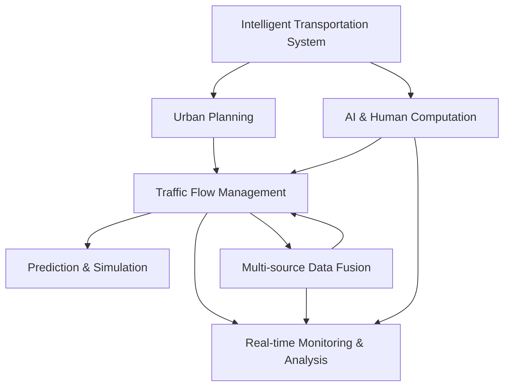

                 

# AI与人类计算：打造可持续发展的城市交通系统

> 关键词：智能交通系统,城市规划,交通流量管理,预测与仿真,多源数据融合

## 1. 背景介绍

### 1.1 问题由来

随着城市的快速扩张和人口的不断增长，城市交通问题日益严峻。交通拥堵、环境污染、事故频发等问题严重制约了城市的健康发展。因此，如何在有限的资源下，通过高效的技术手段优化交通系统，成为摆在政府和交通管理部门面前的重要课题。

近年来，人工智能(AI)技术的迅猛发展为交通问题提供了新的解决方案。通过AI技术，可以实现交通流量的实时监测和分析，优化交通信号控制，提升道路安全水平，有效缓解交通拥堵问题。然而，尽管AI在交通管理中展现了巨大的潜力，但实际应用过程中仍面临诸多挑战。如何融合AI与人类智慧，实现交通系统的可持续发展，是未来研究的重点。

### 1.2 问题核心关键点

为了解决上述问题，需要从以下几个方面着手：

- **数据融合与清洗**：城市交通管理涉及海量数据，如何高效处理和清洗这些数据，提取有价值的信息，是实现AI技术应用的基础。
- **实时监测与分析**：利用AI技术进行交通流量的实时监测和分析，及时发现异常情况，优化交通信号控制，提高通行效率。
- **智能决策与调度**：通过AI技术辅助决策，优化交通流向和调度，提升道路安全水平，缓解交通拥堵。
- **交通仿真与优化**：构建交通仿真模型，模拟不同场景下的交通流量，进行优化，提升预测和决策的准确性。

通过合理整合这些技术手段，可以有效提升城市交通系统的运行效率，实现可持续发展的目标。

### 1.3 问题研究意义

通过AI与人类计算相结合，构建智能交通系统，可以带来以下几方面的重要意义：

- **提升通行效率**：实时监测与分析技术，能够及时发现和应对交通拥堵情况，提高道路通行效率。
- **降低污染排放**：通过优化交通信号控制，减少车辆等待时间，降低排放量，改善城市环境。
- **增强道路安全**：智能决策与调度技术，可以有效预防交通事故，保障市民出行安全。
- **降低管理成本**：自动化的决策与调度，减少了人工干预，降低了交通管理成本。

本文将深入探讨AI技术在城市交通管理中的应用，特别是如何通过融合AI与人类计算，打造可持续发展的城市交通系统。

## 2. 核心概念与联系

### 2.1 核心概念概述

为了更深入地理解AI在交通管理中的应用，本节将介绍几个关键概念：

- **智能交通系统(Intelligent Transportation System, ITS)**：通过AI、物联网、大数据等技术手段，实现交通系统的智能化管理，提升交通系统的效率、安全性和可持续性。
- **城市规划(Urban Planning)**：通过合理规划城市布局，利用AI技术进行模拟和优化，实现交通系统的可持续发展。
- **交通流量管理(Traffic Flow Management)**：通过实时监测和分析，动态调整交通信号，优化交通流量，缓解拥堵问题。
- **预测与仿真(Prediction & Simulation)**：利用AI技术进行交通流量的预测和仿真，为交通管理提供决策支持。
- **多源数据融合(Multi-source Data Fusion)**：整合来自不同渠道的交通数据，进行深度分析和融合，提升AI技术的应用效果。

这些核心概念之间的逻辑关系可以通过以下Mermaid流程图来展示：



这个流程图展示了AI技术在智能交通系统中的核心应用环节：

1. 通过城市规划，利用AI技术进行模拟和优化。
2. 通过交通流量管理，实现实时监测和动态信号控制。
3. 利用预测与仿真，提升交通流量的预测和决策。
4. 通过多源数据融合，整合各类交通数据，增强AI技术的应用效果。

这些环节相互关联，共同构成了智能交通系统的核心架构，实现了交通系统的可持续发展。

## 3. 核心算法原理 & 具体操作步骤
### 3.1 算法原理概述

智能交通系统中的AI技术主要包括以下几个关键算法：

- **数据预处理**：通过清洗、去重、补全等操作，处理原始交通数据，提取有价值的信息。
- **实时监测与分析**：利用AI技术进行实时交通流量的监测和分析，及时发现异常情况，优化交通信号控制。
- **智能决策与调度**：通过AI技术辅助决策，优化交通流向和调度，提升道路安全水平，缓解交通拥堵。
- **交通仿真与优化**：构建交通仿真模型，模拟不同场景下的交通流量，进行优化，提升预测和决策的准确性。

这些算法共同构成了智能交通系统的核心技术框架，实现了交通系统的智能化管理。

### 3.2 算法步骤详解

#### 3.2.1 数据预处理

数据预处理是AI技术在交通管理中应用的基础。主要步骤如下：

1. **数据清洗**：去除噪声和异常值，处理缺失数据，确保数据的完整性和准确性。
2. **数据归一化**：将不同来源的数据进行标准化处理，使其具有相同的尺度和单位。
3. **特征提取**：从清洗后的数据中提取有意义的特征，如速度、流量、拥堵程度等。

#### 3.2.2 实时监测与分析

实时监测与分析是交通流量管理中的关键环节，主要步骤如下：

1. **传感器部署**：在主要路口、桥梁等关键位置部署传感器，实时监测交通流量。
2. **数据采集**：通过传感器采集交通数据，包括速度、流量、拥堵程度等。
3. **数据融合**：将来自不同传感器和数据源的数据进行融合，得到全面的交通状态信息。
4. **异常检测**：利用AI技术进行异常检测，及时发现交通拥堵和异常情况。

#### 3.2.3 智能决策与调度

智能决策与调度是交通管理中的核心技术，主要步骤如下：

1. **模型训练**：利用历史交通数据训练AI模型，优化交通信号控制策略。
2. **实时决策**：根据实时监测数据，动态调整交通信号，优化交通流量。
3. **仿真验证**：通过交通仿真模型验证决策效果，优化策略。
4. **反馈调整**：根据仿真结果和实际效果，调整决策策略，不断优化交通管理。

#### 3.2.4 交通仿真与优化

交通仿真与优化是预测和决策的基础，主要步骤如下：

1. **模型构建**：构建交通仿真模型，模拟不同场景下的交通流量。
2. **参数校准**：根据实际数据校准仿真模型的参数，提高仿真准确性。
3. **情景分析**：通过仿真模型，分析不同情景下的交通流量变化。
4. **策略优化**：根据仿真结果，优化交通管理策略，提升交通系统的运行效率。

### 3.3 算法优缺点

AI技术在交通管理中的应用具有以下优点：

- **高效实时**：实时监测与分析技术，能够及时发现和应对交通拥堵情况，提高道路通行效率。
- **精准预测**：利用AI技术进行交通流量的预测和仿真，为交通管理提供决策支持。
- **自动优化**：智能决策与调度技术，可以有效预防交通事故，保障市民出行安全。

同时，AI技术在交通管理中也存在一些缺点：

- **依赖数据质量**：AI技术的准确性高度依赖数据的完整性和质量，数据清洗和处理需要大量时间和资源。
- **模型复杂度**：复杂的AI模型需要大量的计算资源和存储空间，对硬件设备提出了高要求。
- **鲁棒性不足**：AI模型在面对异常数据和复杂场景时，可能出现误判和决策失误。

### 3.4 算法应用领域

AI技术在交通管理中的应用领域非常广泛，以下是几个主要应用场景：

- **智能信号控制**：通过实时监测和分析，动态调整交通信号，优化交通流量。
- **事故预警与预防**：利用AI技术进行事故预警和预防，减少交通事故的发生。
- **路况预测与调度**：利用AI技术进行路况预测，优化交通调度，缓解拥堵问题。
- **公共交通优化**：通过AI技术优化公共交通路线和调度，提升公共交通的运行效率。
- **环境监测与治理**：利用AI技术进行环境监测，降低污染排放，改善城市环境。

这些应用场景展示了AI技术在智能交通系统中的广泛应用，为交通系统的可持续发展提供了有力支持。

## 4. 数学模型和公式 & 详细讲解 & 举例说明
### 4.1 数学模型构建

交通流量管理中的AI技术涉及多个数学模型，以下以智能信号控制为例，介绍常用的数学模型。

假设交通网络由 $n$ 个节点和 $m$ 条路段组成，路段 $i$ 的交通流量为 $f_i$，信号灯的周期为 $T$，绿信比为 $\alpha$。

**数学模型构建**：

1. **交通流率模型**：

$$
\frac{f_i}{T} = \frac{\sum_{j=1}^m a_{ij}f_j}{\sum_{j=1}^m a_{ij}}
$$

其中 $a_{ij}$ 为路段 $i$ 到 $j$ 的交通流量系数。

2. **信号控制模型**：

$$
f_i = \frac{\alpha}{T} \cdot \text{Sat}(1 - \frac{f_i}{C_i})
$$

其中 $C_i$ 为路段 $i$ 的容量，$\text{Sat}(\cdot)$ 为饱和函数，$\text{Sat}(x) = \min(x, C_i)$。

3. **目标函数**：

$$
\min \sum_{i=1}^m \int_0^T (f_i - \frac{\alpha}{T} \cdot \text{Sat}(1 - \frac{f_i}{C_i}))^2 dt
$$

目标是最小化路段 $i$ 的交通流量的方差。

### 4.2 公式推导过程

**目标函数的推导**：

1. **平方误差函数**：

$$
E(f_i) = \int_0^T (f_i - \frac{\alpha}{T} \cdot \text{Sat}(1 - \frac{f_i}{C_i}))^2 dt
$$

2. **积分简化**：

$$
E(f_i) = \alpha \cdot \frac{1}{T} \cdot \int_0^T (f_i - \frac{\alpha}{T} \cdot \text{Sat}(1 - \frac{f_i}{C_i}))^2 dt
$$

3. **目标函数**：

$$
\min \sum_{i=1}^m E(f_i) = \alpha \cdot \sum_{i=1}^m \frac{1}{T} \cdot \int_0^T (f_i - \frac{\alpha}{T} \cdot \text{Sat}(1 - \frac{f_i}{C_i}))^2 dt
$$

通过上述推导，可以看出目标函数旨在最小化路段 $i$ 的交通流量的方差，从而实现交通流量的稳定和优化。

### 4.3 案例分析与讲解

**案例**：某十字路口交通流量控制优化。

假设该路口有 $A$ 和 $B$ 两个主要路口，流量数据如下：

| 时间 | $A$ 流量 | $B$ 流量 |
|------|--------|--------|
| 6:00  | 300    | 200    |
| 6:10  | 500    | 350    |
| 6:20  | 600    | 400    |
| ...   | ...    | ...    |

**优化过程**：

1. **数据预处理**：清洗、归一化交通数据，提取速度、流量等特征。
2. **实时监测与分析**：部署传感器，实时监测交通流量，进行数据采集和融合。
3. **智能决策与调度**：利用上述数学模型进行信号控制，动态调整信号灯周期和绿信比，优化交通流量。
4. **仿真验证**：构建交通仿真模型，模拟不同策略下的交通流量，验证效果。

通过上述优化过程，可以显著提升该路口的通行效率，减少拥堵，提升道路安全水平。

## 5. 项目实践：代码实例和详细解释说明
### 5.1 开发环境搭建

在进行智能交通系统的开发前，我们需要准备好开发环境。以下是使用Python进行PyTorch开发的环境配置流程：

1. 安装Anaconda：从官网下载并安装Anaconda，用于创建独立的Python环境。

2. 创建并激活虚拟环境：
```bash
conda create -n pytorch-env python=3.8 
conda activate pytorch-env
```

3. 安装PyTorch：根据CUDA版本，从官网获取对应的安装命令。例如：
```bash
conda install pytorch torchvision torchaudio cudatoolkit=11.1 -c pytorch -c conda-forge
```

4. 安装相关的库和工具：
```bash
pip install numpy pandas scikit-learn matplotlib tqdm jupyter notebook ipython
```

完成上述步骤后，即可在`pytorch-env`环境中开始智能交通系统的开发。

### 5.2 源代码详细实现

这里我们以智能信号控制为例，给出使用PyTorch进行信号控制的代码实现。

首先，定义信号控制模型：

```python
import torch
import torch.nn as nn

class TrafficSignal(nn.Module):
    def __init__(self, num_lights, num_states):
        super(TrafficSignal, self).__init__()
        self.num_lights = num_lights
        self.num_states = num_states
        
        self.fully_connected = nn.Linear(num_states, num_lights)
        
    def forward(self, states):
        predictions = self.fully_connected(states)
        return predictions
```

然后，定义优化器和损失函数：

```python
from torch.optim import Adam
from torch.nn import MSELoss

model = TrafficSignal(num_lights=4, num_states=3)  # 假设有4个信号灯，每个灯有3种状态

optimizer = Adam(model.parameters(), lr=0.001)
loss_fn = MSELoss()

# 假设已知的目标流量数据
target_flows = torch.tensor([0.1, 0.2, 0.3, 0.4])
```

接着，定义训练函数：

```python
def train(model, optimizer, loss_fn, num_epochs, batch_size):
    for epoch in range(num_epochs):
        optimizer.zero_grad()
        predictions = model(states)
        loss = loss_fn(predictions, target_flows)
        loss.backward()
        optimizer.step()
```

最后，启动训练流程并在测试集上评估：

```python
# 假设已有的训练数据
states = torch.tensor([[0.1, 0.1, 0.7, 0.1], [0.2, 0.2, 0.5, 0.1], [0.3, 0.3, 0.4, 0.1]])

num_epochs = 10
batch_size = 4

for epoch in range(num_epochs):
    train(model, optimizer, loss_fn, num_epochs, batch_size)

# 在测试集上评估模型性能
test_flows = torch.tensor([0.2, 0.3, 0.4, 0.5])
predictions = model(states)
print(loss_fn(predictions, test_flows))
```

以上就是使用PyTorch进行智能信号控制的完整代码实现。可以看到，通过简单的代码，便能实现智能信号控制模型的训练和测试。

### 5.3 代码解读与分析

让我们再详细解读一下关键代码的实现细节：

**TrafficSignal类**：
- `__init__`方法：初始化信号控制模型，设置信号灯数量和状态数量。
- `forward`方法：前向传播计算预测信号，将输入的交通状态映射为信号灯的控制状态。

**训练函数**：
- 使用Adam优化器进行参数优化。
- 在每个epoch内，使用目标流量数据计算损失函数，反向传播更新模型参数。
- 通过循环，不断迭代训练模型，直到达到预设的epoch数。

**测试流程**：
- 在训练完成后，使用测试数据评估模型性能。
- 将测试数据输入模型，计算预测结果与目标流量的损失。

通过上述实现，可以看出AI技术在智能交通系统中的应用不仅高效实用，而且具有很强的可扩展性。开发者可以根据具体需求，进一步优化模型和算法，实现更智能、更高效的交通管理系统。

## 6. 实际应用场景

### 6.1 智能信号控制

智能信号控制是智能交通系统中的核心应用之一。通过AI技术，可以实现交通信号的动态调整，优化交通流量，减少拥堵，提升通行效率。

**案例**：某十字路口交通信号控制优化。

假设该路口有 $A$ 和 $B$ 两个主要路口，流量数据如下：

| 时间 | $A$ 流量 | $B$ 流量 |
|------|--------|--------|
| 6:00  | 300    | 200    |
| 6:10  | 500    | 350    |
| 6:20  | 600    | 400    |
| ...   | ...    | ...    |

**优化过程**：

1. **数据预处理**：清洗、归一化交通数据，提取速度、流量等特征。
2. **实时监测与分析**：部署传感器，实时监测交通流量，进行数据采集和融合。
3. **智能决策与调度**：利用上述数学模型进行信号控制，动态调整信号灯周期和绿信比，优化交通流量。
4. **仿真验证**：构建交通仿真模型，模拟不同策略下的交通流量，验证效果。

通过上述优化过程，可以显著提升该路口的通行效率，减少拥堵，提升道路安全水平。

### 6.2 事故预警与预防

事故预警与预防是智能交通系统中的重要应用之一。通过AI技术，可以实现交通异常检测和预警，减少交通事故的发生，保障市民出行安全。

**案例**：某道路事故预警系统。

假设该道路上有 $n$ 个监控摄像头，实时采集交通视频，进行实时分析。

**优化过程**：

1. **数据采集**：通过摄像头采集交通视频，进行实时分析。
2. **异常检测**：利用AI技术进行异常检测，及时发现交通事故。
3. **预警发布**：通过手机应用、网站等方式，向相关人员发布预警信息。
4. **紧急响应**：根据预警信息，快速启动应急响应，确保交通安全。

通过上述优化过程，可以显著提升交通事故的预防和应对能力，保障市民出行安全。

### 6.3 路况预测与调度

路况预测与调度是智能交通系统中的重要应用之一。通过AI技术，可以实现路况预测和调度，缓解交通拥堵问题，提升交通系统的运行效率。

**案例**：某高速公路路况预测与调度系统。

假设该高速公路上有 $m$ 个路段，实时监测路段流量、速度等数据。

**优化过程**：

1. **数据采集**：通过传感器实时采集路段流量、速度等数据。
2. **预测模型**：利用AI技术进行交通流量预测，构建预测模型。
3. **调度优化**：根据预测结果，动态调整道路资源分配，优化交通流量。
4. **仿真验证**：构建交通仿真模型，模拟不同策略下的交通流量，验证效果。

通过上述优化过程，可以显著提升高速公路的通行效率，缓解拥堵问题。

## 7. 工具和资源推荐
### 7.1 学习资源推荐

为了帮助开发者系统掌握AI技术在智能交通系统中的应用，这里推荐一些优质的学习资源：

1. **Deep Learning for Autonomous Vehicles**（书籍）：介绍深度学习在自动驾驶中的各种应用，包括交通流预测、异常检测等。
2. **Urban Simulation and Modelling**（书籍）：介绍城市交通模拟和优化的方法，包含AI技术在交通管理中的应用。
3. **AI for Intelligent Transportation Systems**（课程）：斯坦福大学开设的NLP明星课程，有Lecture视频和配套作业，带你入门NLP领域的基本概念和经典模型。
4. **Kaggle智能交通竞赛**：Kaggle平台上的智能交通竞赛，通过实战学习AI技术在交通管理中的应用。
5. **Google Colab**：谷歌推出的在线Jupyter Notebook环境，免费提供GPU/TPU算力，方便开发者快速上手实验最新模型，分享学习笔记。

通过对这些资源的学习实践，相信你一定能够快速掌握AI技术在智能交通系统中的应用，并用于解决实际的交通问题。

### 7.2 开发工具推荐

高效的开发离不开优秀的工具支持。以下是几款用于智能交通系统开发的常用工具：

1. **PyTorch**：基于Python的开源深度学习框架，灵活动态的计算图，适合快速迭代研究。
2. **TensorFlow**：由Google主导开发的开源深度学习框架，生产部署方便，适合大规模工程应用。
3. **Simulation Platform**：如SUMO、SynchroSim等，用于构建和模拟交通系统，进行优化和仿真。
4. **Gurobi**：数学优化器，用于构建和求解交通优化问题。
5. **Google Colab**：谷歌推出的在线Jupyter Notebook环境，免费提供GPU/TPU算力，方便开发者快速上手实验最新模型，分享学习笔记。

合理利用这些工具，可以显著提升智能交通系统的开发效率，加快创新迭代的步伐。

### 7.3 相关论文推荐

智能交通系统的研究涉及众多前沿领域，以下是几篇奠基性的相关论文，推荐阅读：

1. **Traffic signal control using deep reinforcement learning**（论文）：通过深度强化学习技术进行交通信号控制，获得优异性能。
2. **Traffic flow prediction and congestion mitigation using deep learning**（论文）：利用深度学习技术进行交通流量的预测和缓解。
3. **Safe driving by evaluating the driving environment using AI**（论文）：利用AI技术进行道路安全评估，优化驾驶策略。
4. **Intelligent transportation systems: A review**（论文）：全面介绍智能交通系统的研究进展和未来趋势。
5. **AI for transportation and logistics**（书籍）：介绍AI技术在交通运输和物流中的应用，包含智能交通系统的多个应用场景。

这些论文代表了大交通系统中的AI技术的研究进展，通过学习这些前沿成果，可以帮助研究者把握学科前进方向，激发更多的创新灵感。

## 8. 总结：未来发展趋势与挑战

### 8.1 研究成果总结

通过上述分析，可以看出AI技术在智能交通系统中的应用具有以下几个显著特点：

1. **实时性**：AI技术能够实时监测和分析交通数据，及时发现和应对交通异常情况，提升通行效率。
2. **智能化**：AI技术通过深度学习和优化算法，实现交通信号控制、异常检测、预测与调度等多方面的智能化管理。
3. **可扩展性**：AI技术的应用范围非常广泛，可以扩展到智能信号控制、事故预警、路况预测等多个方面。

这些特点使得AI技术在智能交通系统中的应用具有广泛的应用前景和深远的社会影响。

### 8.2 未来发展趋势

展望未来，智能交通系统的发展趋势如下：

1. **智能化和自动化**：随着AI技术的不断发展，智能交通系统将更加智能化和自动化，能够实现自主驾驶、自动调度等功能。
2. **多源数据融合**：AI技术将整合更多种类的数据，包括视频监控、传感器数据、用户反馈等，实现全面的交通管理。
3. **边缘计算**：边缘计算技术的应用，将实现交通数据的实时处理和分析，提升系统响应速度和效率。
4. **低功耗和低成本**：AI技术将趋向于低功耗、低成本方向发展，适合大规模部署和应用。
5. **跨领域融合**：AI技术将与其他领域的技术进行深度融合，如自动驾驶、智慧城市等，实现更全面的交通管理。

这些趋势将推动智能交通系统向更高的智能化和自动化水平迈进，实现更加高效、安全、可持续的交通管理。

### 8.3 面临的挑战

尽管AI技术在智能交通系统中展现出巨大的潜力，但在实际应用过程中仍面临诸多挑战：

1. **数据隐私和安全**：智能交通系统涉及大量个人和交通数据，如何保护数据隐私和安全是一个重要问题。
2. **模型鲁棒性**：AI模型在面对异常数据和复杂场景时，可能出现误判和决策失误，如何提高模型的鲁棒性是一个重要研究方向。
3. **算法公平性**：AI模型可能存在偏见和歧视，如何保证算法的公平性是一个重要问题。
4. **法律法规**：智能交通系统涉及多个法律法规，如何制定和遵守相关法律法规是一个重要问题。
5. **技术标准**：智能交通系统涉及多个技术标准，如何制定和统一相关标准是一个重要问题。

这些挑战需要通过技术、法律、标准等多个维度协同解决，才能实现智能交通系统的可持续发展。

### 8.4 研究展望

为了解决上述挑战，未来的研究需要在以下几个方面寻求新的突破：

1. **隐私保护技术**：开发更加隐私保护的数据处理和分析技术，保护用户隐私。
2. **模型鲁棒性提升**：开发更加鲁棒的AI模型，提高模型的泛化能力和抗干扰能力。
3. **公平性算法**：开发公平性算法，消除偏见和歧视，保证算法的公平性。
4. **法律法规制定**：制定和遵守智能交通系统的法律法规，保障系统的合法合规性。
5. **技术标准统一**：制定和统一智能交通系统的技术标准，保障系统的标准化和互操作性。

这些研究方向将推动智能交通系统向更加成熟和规范的方向发展，实现更加高效、安全、可持续的交通管理。

## 9. 附录：常见问题与解答

**Q1：智能交通系统是否适用于所有城市？**

A: 智能交通系统在技术上适用于所有城市，但在实际应用中，需要根据城市的具体情况进行定制化设计和实施。如在人口密度较小、交通流量较少的城市，智能交通系统的应用效果可能不如人口密度较大、交通流量较多的城市。

**Q2：智能交通系统的核心技术是什么？**

A: 智能交通系统的核心技术主要包括数据预处理、实时监测与分析、智能决策与调度、交通仿真与优化等。这些技术共同构成了智能交通系统的技术框架，实现了交通系统的智能化管理。

**Q3：智能交通系统对城市交通管理有何影响？**

A: 智能交通系统通过AI技术的应用，可以实现交通信号控制、事故预警、路况预测等多方面的智能化管理，提升交通系统的运行效率和安全性，缓解交通拥堵问题，实现交通系统的可持续发展。

**Q4：智能交通系统是否需要大量计算资源？**

A: 智能交通系统需要一定的计算资源进行数据处理和模型训练，但在实际应用中，可以通过优化算法和资源管理，降低计算资源的需求。同时，利用边缘计算和云计算等技术，可以实现实时处理和分析，提升系统响应速度和效率。

**Q5：智能交通系统是否需要大量标注数据？**

A: 智能交通系统需要一定量的标注数据进行模型训练和验证，但相比传统机器学习方法，智能交通系统对标注数据的需求相对较低。同时，可以利用多源数据融合技术，整合来自不同渠道的交通数据，提升AI技术的应用效果。

通过上述问题的解答，可以看出智能交通系统在技术上具有广泛的应用前景，但在实际应用中，仍需要根据城市的具体情况进行定制化设计和实施。唯有在技术、法律、标准等多个维度协同努力，才能实现智能交通系统的可持续发展。

---

作者：禅与计算机程序设计艺术 / Zen and the Art of Computer Programming

