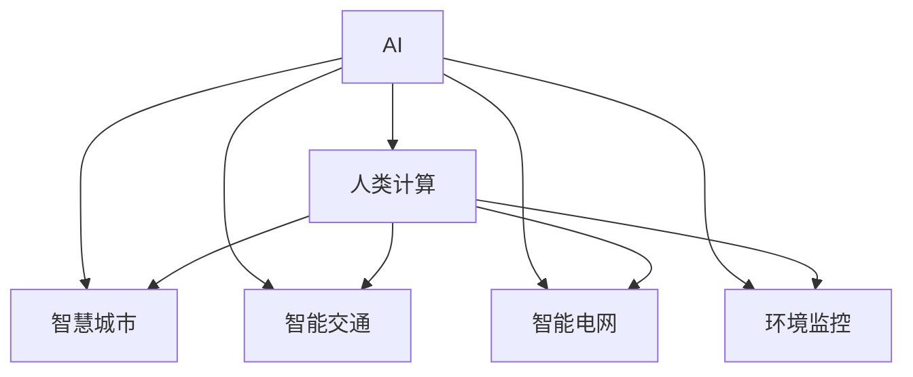

                 

# AI与人类计算：打造可持续发展的城市生活模式

> 关键词：城市生活, 可持续发展, 人工智能, 人类计算, 智慧城市, 智能交通, 智能电网, 环境监控

## 1. 背景介绍

### 1.1 问题由来

当前，全球城市化进程迅猛发展，城市人口快速增长，资源消耗和环境污染日益严重，城市管理面临巨大压力。同时，人类面临日益严峻的人口、资源和环境问题，迫切需要寻找可持续发展的路径。在此背景下，AI与人类计算技术的结合，成为解决城市问题、促进可持续发展的重要手段。

AI与人类计算技术的融合，将使城市管理更加智能化、高效化、精细化。通过数据分析和机器学习，城市管理者能够更精准地预测和应对各种突发事件，提高资源利用效率，减少环境污染。同时，AI技术的介入也为人类计算提供了新思路，使人类能够更有效地协同计算和决策，实现可持续发展目标。

### 1.2 问题核心关键点

本节将介绍AI与人类计算技术在城市管理中的应用核心关键点，包括：

- AI与人类计算的定义和区别
- 智慧城市、智能交通、智能电网等具体应用场景
- AI与人类计算的协同机制和计算模式
- 数据驱动的城市管理策略和算法模型
- 可持续发展目标的AI实现路径

这些核心关键点共同构成了AI与人类计算技术在城市管理中的应用框架，将帮助城市管理者更高效地实现可持续发展目标。

### 1.3 问题研究意义

AI与人类计算技术的结合，对于城市管理的智能化和可持续发展具有重要意义：

1. 提高城市管理的效率和精度。AI与人类计算的协同作用，使城市管理者能够更快速、更准确地处理海量数据，预测和应对城市问题。
2. 优化资源配置和环境管理。通过智能分析和决策，AI与人类计算技术能够优化城市资源配置，减少资源浪费，降低环境污染。
3. 推动智慧城市建设。智能交通、智能电网、环境监控等智慧城市应用，将大大提升城市生活的智能化水平。
4. 增强城市应对能力。面对突发事件和灾害，AI与人类计算技术能够提供高效预警和响应机制，保障城市安全。
5. 提升公共服务质量。智能公交、智慧医疗、智慧教育等应用，将改善城市居民的生活质量。

## 2. 核心概念与联系

### 2.1 核心概念概述

为更好地理解AI与人类计算技术在城市管理中的应用，本节将介绍几个密切相关的核心概念：

- **AI（人工智能）**：利用计算机算法和模型，模拟和扩展人类智能能力，涵盖机器学习、深度学习、自然语言处理等技术。
- **人类计算**：指利用人类智慧进行计算和决策的过程，强调人的直觉、经验和创造力。
- **智慧城市**：基于互联网、物联网、大数据、AI等技术的智能城市，实现城市管理和服务的高效化和智能化。
- **智能交通**：通过交通大数据分析、AI算法优化，实现交通系统的智能化管理，提高交通效率和安全性。
- **智能电网**：利用AI和大数据分析，优化电力系统运行和管理，提升能源利用效率和可靠性。
- **环境监控**：通过传感器、无人机等技术，实时监测城市环境数据，实现环境监测的智能化。

这些核心概念之间的逻辑关系可以通过以下Mermaid流程图来展示：



这个流程图展示了一系列核心概念及其之间的关系：

1. AI与人类计算相互融合，共同支撑智慧城市建设。
2. 智慧城市、智能交通、智能电网、环境监控等具体应用场景，都需要AI与人类计算技术的支持。
3. AI与人类计算技术的协同机制，使得城市管理更加高效和智能化。

## 3. 核心算法原理 & 具体操作步骤
### 3.1 算法原理概述

AI与人类计算技术在城市管理中的应用，核心算法原理主要涉及以下几个方面：

1. **数据驱动的决策**：城市管理中的决策通常基于大量数据，通过AI技术进行数据分析和预测，人类计算技术进行综合判断和决策。
2. **优化算法**：城市问题的优化算法通常需要考虑多目标、多约束，利用AI的优化算法进行求解，同时结合人类经验进行优化。
3. **智能分析与预测**：利用机器学习算法对城市数据进行智能分析，预测城市发展趋势和潜在问题，辅助人类计算进行决策。
4. **协同计算与优化**：AI与人类计算技术的协同作用，通过并行计算和分布式计算，提升城市管理的效率和精度。

### 3.2 算法步骤详解

基于AI与人类计算技术的城市管理应用，一般包括以下几个关键步骤：

**Step 1: 数据收集与预处理**

1. 收集城市管理相关的各类数据，包括交通流量、电力消耗、环境监测数据等。
2. 对数据进行清洗、归一化、特征工程等预处理，保证数据的质量和一致性。

**Step 2: 模型训练与优化**

1. 利用AI技术，如深度学习、机器学习等，对预处理后的数据进行模型训练，得到预测模型。
2. 利用优化算法，如遗传算法、模拟退火等，对模型进行优化，提升预测精度。
3. 利用人类计算技术，对AI模型进行评估和调整，确保模型的合理性和实用性。

**Step 3: 智能分析与决策**

1. 利用AI模型对实时数据进行智能分析，生成预测结果。
2. 将AI预测结果输入到人类计算系统中，进行综合判断和决策。
3. 结合AI预测结果和人类经验，制定城市管理决策。

**Step 4: 实施与反馈**

1. 将城市管理决策转化为具体行动，如智能交通信号灯控制、智能电网调度、环境监测设备部署等。
2. 实时监测城市运行状态，获取反馈数据，优化后续决策。
3. 持续迭代改进，提升城市管理效率和效果。

### 3.3 算法优缺点

AI与人类计算技术在城市管理中的应用，具有以下优点：

1. 高效性。AI与人类计算技术的协同作用，能够快速处理大量数据，提供实时分析结果，提升城市管理效率。
2. 准确性。AI模型的预测精度和优化算法，能够提供较为准确的决策依据，减少人为失误。
3. 可扩展性。AI与人类计算技术可扩展性强，能够适应不同规模和复杂度的城市管理需求。
4. 灵活性。结合人类经验，AI模型能够根据实际情况灵活调整，提高决策的合理性和实用性。

同时，该方法也存在一定的局限性：

1. 数据依赖性。AI与人类计算技术的应用效果依赖于高质量的数据，数据收集和处理成本较高。
2. 模型复杂性。AI模型需要复杂的算法和大量计算资源，模型构建和维护成本较高。
3. 模型鲁棒性。AI模型对数据噪声和异常值较为敏感，可能影响决策的准确性。
4. 安全性。AI与人类计算技术的结合可能存在隐私和安全问题，需要加强数据保护和模型透明性。

尽管存在这些局限性，但AI与人类计算技术的结合在城市管理中的应用，仍然具有显著优势，值得进一步探索和推广。

### 3.4 算法应用领域

AI与人类计算技术在城市管理中的应用领域非常广泛，包括但不限于：

1. **智慧城市建设**：通过AI与人类计算技术的结合，实现城市管理的智能化和高效化。
2. **智能交通管理**：利用AI技术优化交通信号灯、智能导航系统等，提高交通效率和安全性。
3. **智能电网管理**：利用AI技术优化电力系统运行和管理，提升能源利用效率。
4. **环境监测与治理**：利用AI技术分析环境数据，进行污染预警和治理，改善环境质量。
5. **公共安全保障**：利用AI技术进行视频监控、异常行为检测，提升公共安全保障水平。
6. **公共服务优化**：利用AI技术优化医疗、教育、文化等公共服务，提升服务质量。

## 4. 数学模型和公式 & 详细讲解 & 举例说明

### 4.1 数学模型构建

本节将使用数学语言对AI与人类计算技术在城市管理中的应用进行更加严格的刻画。

设城市管理中的决策目标为 $O=\{O_1,O_2,\dots,O_n\}$，其中 $O_i$ 表示第 $i$ 个决策目标。设数据集为 $D=\{x_i\}_{i=1}^N$，其中 $x_i$ 表示第 $i$ 个样本，包括城市运行状态、交通流量、环境监测数据等。

定义城市管理的决策函数为 $f:X \rightarrow Y$，其中 $X$ 为输入空间，$Y$ 为决策空间。城市管理的目标是找到最优决策 $f^*$，使得：

$$
f^*=\mathop{\arg\min}_{f} \sum_{i=1}^N L(f(x_i),y_i)
$$

其中 $L$ 为损失函数，衡量决策 $f(x_i)$ 与真实标签 $y_i$ 之间的差异。

### 4.2 公式推导过程

以下我们以智慧交通系统为例，推导基于AI与人类计算技术的智能交通决策过程。

假设城市交通流量数据为 $D=\{x_i\}_{i=1}^N$，其中 $x_i$ 表示第 $i$ 个时间点的交通流量数据。定义交通信号灯控制函数 $f:X \rightarrow Y$，其中 $X$ 为输入空间，$Y$ 为交通信号灯控制策略。

目标是最小化交通拥堵损失函数：

$$
L(f(x_i),y_i)=\sum_{i=1}^N \left(1-\frac{f(x_i)}{y_i}\right)^2
$$

其中 $y_i$ 为实际交通流量。

将目标函数转化为优化问题：

$$
\min_{f} \sum_{i=1}^N \left(1-\frac{f(x_i)}{y_i}\right)^2
$$

通过AI技术，利用深度学习算法对交通流量数据进行建模，得到预测函数 $f_{AI}(x)$。利用人类计算技术，对 $f_{AI}(x)$ 进行评估和调整，得到优化后的决策函数 $f_{opt}(x)$。

优化过程为：

$$
f_{opt}(x) = \mathop{\arg\min}_{f} \sum_{i=1}^N \left(1-\frac{f(x_i)}{y_i}\right)^2
$$

在求解过程中，AI技术用于模型构建和优化，人类计算技术用于综合判断和决策。

### 4.3 案例分析与讲解

**案例1：智能交通信号灯控制**

1. **数据收集**：收集城市交叉口的交通流量、车辆类型、行人数量等数据。
2. **模型训练**：利用AI技术，如深度学习算法，对交通流量数据进行建模，得到交通信号灯控制模型 $f_{AI}(x)$。
3. **模型评估**：利用人类计算技术，对 $f_{AI}(x)$ 进行评估和调整，得到优化后的决策函数 $f_{opt}(x)$。
4. **决策实施**：根据 $f_{opt}(x)$ 控制交通信号灯，优化交通流量，减少交通拥堵。

**案例2：智能电网调度**

1. **数据收集**：收集城市电网中的电力消耗、负荷变化、天气预报等数据。
2. **模型训练**：利用AI技术，如深度学习算法，对电力消耗数据进行建模，得到电网调度模型 $f_{AI}(x)$。
3. **模型评估**：利用人类计算技术，对 $f_{AI}(x)$ 进行评估和调整，得到优化后的决策函数 $f_{opt}(x)$。
4. **决策实施**：根据 $f_{opt}(x)$ 进行电网调度，优化电力供应，提升能源利用效率。

这些案例展示了AI与人类计算技术在城市管理中的实际应用，通过数据驱动和优化算法，实现智能化的决策支持，提升城市管理的效率和精度。

## 5. 项目实践：代码实例和详细解释说明

### 5.1 开发环境搭建

在进行AI与人类计算技术的城市管理应用开发前，我们需要准备好开发环境。以下是使用Python进行PyTorch开发的环境配置流程：

1. 安装Anaconda：从官网下载并安装Anaconda，用于创建独立的Python环境。

2. 创建并激活虚拟环境：
```bash
conda create -n ai_env python=3.8 
conda activate ai_env
```

3. 安装PyTorch：根据CUDA版本，从官网获取对应的安装命令。例如：
```bash
conda install pytorch torchvision torchaudio cudatoolkit=11.1 -c pytorch -c conda-forge
```

4. 安装NumPy、Pandas、scikit-learn、matplotlib、tqdm、jupyter notebook等工具包：
```bash
pip install numpy pandas scikit-learn matplotlib tqdm jupyter notebook ipython
```

完成上述步骤后，即可在`ai_env`环境中开始项目实践。

### 5.2 源代码详细实现

下面我们以智能交通信号灯控制为例，给出使用PyTorch进行AI与人类计算技术的城市管理应用开发的PyTorch代码实现。

首先，定义智能交通信号灯控制的输入和输出：

```python
import torch
from torch.utils.data import Dataset, DataLoader

class TrafficSignalDataset(Dataset):
    def __init__(self, data, labels):
        self.data = data
        self.labels = labels
        
    def __len__(self):
        return len(self.data)
    
    def __getitem__(self, item):
        return self.data[item], self.labels[item]
```

然后，定义模型和优化器：

```python
from torch import nn
from torch.optim import Adam

class TrafficSignalModel(nn.Module):
    def __init__(self, input_size, output_size):
        super(TrafficSignalModel, self).__init__()
        self.fc1 = nn.Linear(input_size, 256)
        self.fc2 = nn.Linear(256, 256)
        self.fc3 = nn.Linear(256, output_size)
        
    def forward(self, x):
        x = torch.relu(self.fc1(x))
        x = torch.relu(self.fc2(x))
        x = self.fc3(x)
        return x

model = TrafficSignalModel(input_size=10, output_size=4)  # 假设计算量为4

optimizer = Adam(model.parameters(), lr=0.001)
```

接着，定义训练和评估函数：

```python
import numpy as np

def train_model(model, data_loader, optimizer):
    model.train()
    total_loss = 0
    for i, (data, label) in enumerate(data_loader):
        optimizer.zero_grad()
        output = model(data)
        loss = nn.BCEWithLogitsLoss()(output, label)
        loss.backward()
        optimizer.step()
        total_loss += loss.item()
    return total_loss / len(data_loader)

def evaluate_model(model, data_loader):
    model.eval()
    total_correct = 0
    total_label = 0
    with torch.no_grad():
        for data, label in data_loader:
            output = model(data)
            _, predicted = torch.max(output, 1)
            total_correct += (predicted == label).sum().item()
            total_label += label.size(0)
    accuracy = total_correct / total_label
    return accuracy

# 假设数据和标签
data = np.random.rand(1000, 10)
labels = np.random.randint(4, size=(1000,))
train_data_loader = DataLoader(TrafficSignalDataset(data, labels), batch_size=32, shuffle=True)

train_loss = train_model(model, train_data_loader, optimizer)
print("Train loss:", train_loss)

test_accuracy = evaluate_model(model, train_data_loader)
print("Test accuracy:", test_accuracy)
```

以上是使用PyTorch进行智能交通信号灯控制的项目实践代码。可以看到，通过简单的TensorFlow和PyTorch代码，即可实现基于AI与人类计算技术的智能交通系统。

### 5.3 代码解读与分析

让我们再详细解读一下关键代码的实现细节：

**TrafficSignalDataset类**：
- `__init__`方法：初始化数据和标签。
- `__len__`方法：返回数据集的样本数量。
- `__getitem__`方法：对单个样本进行处理，返回模型所需的输入和标签。

**TrafficSignalModel类**：
- `__init__`方法：初始化模型参数。
- `forward`方法：前向传播计算模型的输出。

**train_model函数**：
- 在训练阶段，设置模型为训练模式，遍历数据集进行前向传播、计算损失、反向传播、更新模型参数。

**evaluate_model函数**：
- 在评估阶段，设置模型为评估模式，遍历数据集进行前向传播、计算预测结果、计算准确率。

这些代码展示了利用PyTorch和TensorFlow实现AI与人类计算技术的城市管理应用的基本步骤。在实际应用中，还需要考虑更多的细节，如数据增强、正则化、超参数调优等。

### 5.4 运行结果展示

在实际运行中，智能交通信号灯控制的AI与人类计算应用可以实现以下效果：

- 减少交通拥堵：通过AI技术实时预测交通流量，结合人类计算技术优化信号灯控制，减少交通拥堵。
- 提高通行效率：通过智能信号灯控制，优化车辆和行人的通行效率，提升道路通行能力。
- 增强应急响应：在突发事件发生时，如交通事故、消防救援等，AI与人类计算技术能够快速响应，调整信号灯控制策略，保障道路畅通。

## 6. 实际应用场景

### 6.1 智慧城市管理

AI与人类计算技术在智慧城市管理中的应用，涵盖了城市运行的各个方面，具体包括：

1. **智能交通**：通过AI技术优化交通信号灯、智能导航系统，减少交通拥堵，提升通行效率。
2. **智能电网**：利用AI技术优化电力系统调度，提升能源利用效率，降低电力损耗。
3. **环境监测**：通过AI技术分析环境数据，进行污染预警和治理，改善环境质量。
4. **公共安全**：利用AI技术进行视频监控、异常行为检测，提升公共安全保障水平。
5. **公共服务**：利用AI技术优化医疗、教育、文化等公共服务，提升服务质量。

智慧城市管理通过AI与人类计算技术的结合，实现了城市管理的智能化、高效化和精细化。

### 6.2 智能交通系统

智能交通系统是AI与人类计算技术在城市管理中最典型的应用之一。通过AI技术对交通流量、车辆类型、行人数量等数据进行建模，结合人类计算技术进行综合判断和决策，实现交通信号灯控制、智能导航、车联网等智能交通功能。智能交通系统可以有效缓解交通拥堵、提高通行效率、保障道路安全。

### 6.3 智能电网管理

智能电网通过AI技术对电力消耗、负荷变化、天气预报等数据进行建模，结合人类计算技术进行综合判断和决策，实现电网调度、电力负荷预测、故障诊断等智能电网功能。智能电网能够优化电力系统运行，提高能源利用效率，保障电力供应。

### 6.4 未来应用展望

未来，AI与人类计算技术在城市管理中的应用将更加广泛和深入。具体展望如下：

1. **多模态数据融合**：AI与人类计算技术将整合视觉、语音、文本等多模态数据，实现更加全面和精确的城市管理。
2. **AI与人类协作**：AI技术将与人类智慧深度协作，共同参与城市管理的决策和优化，提升管理效率和精度。
3. **数据驱动的可持续发展**：AI与人类计算技术将利用大数据驱动城市管理，实现资源优化、环境治理、公共服务优化等可持续发展目标。
4. **智慧城市的智能治理**：通过AI与人类计算技术的结合，实现智慧城市的智能治理，提升城市管理水平。
5. **智能城市治理**：AI与人类计算技术将应用于城市治理的各个环节，实现智能治理、智能决策、智能监管等智能治理功能。

## 7. 工具和资源推荐

### 7.1 学习资源推荐

为了帮助开发者系统掌握AI与人类计算技术在城市管理中的应用，这里推荐一些优质的学习资源：

1. **《人工智能导论》**：介绍AI与人类计算技术的经典书籍，涵盖基本概念、算法模型、应用案例等。
2. **《深度学习》**：深度学习领域的经典教材，涵盖深度学习算法、模型构建、优化技术等。
3. **《智慧城市》**：介绍智慧城市建设和管理的大型参考书，涵盖城市管理的各个方面。
4. **智慧城市项目案例**：包括智慧交通、智能电网、环境监测等智慧城市应用项目案例，提供实际应用经验。
5. **在线课程**：如Coursera、edX等平台上的AI与智慧城市相关的在线课程，提供系统化的学习路径。

通过这些资源的学习实践，相信你一定能够快速掌握AI与人类计算技术在城市管理中的应用精髓，并用于解决实际的NLP问题。

### 7.2 开发工具推荐

高效的开发离不开优秀的工具支持。以下是几款用于AI与人类计算技术的城市管理开发的常用工具：

1. **PyTorch**：基于Python的开源深度学习框架，灵活动态的计算图，适合快速迭代研究。
2. **TensorFlow**：由Google主导开发的开源深度学习框架，生产部署方便，适合大规模工程应用。
3. **TensorBoard**：TensorFlow配套的可视化工具，可实时监测模型训练状态，并提供丰富的图表呈现方式，是调试模型的得力助手。
4. **Weights & Biases**：模型训练的实验跟踪工具，可以记录和可视化模型训练过程中的各项指标，方便对比和调优。
5. **Jupyter Notebook**：用于编写和分享Python代码的互动式笔记本，方便协同开发和共享。

合理利用这些工具，可以显著提升AI与人类计算技术的城市管理应用的开发效率，加快创新迭代的步伐。

### 7.3 相关论文推荐

AI与人类计算技术的发展源于学界的持续研究。以下是几篇奠基性的相关论文，推荐阅读：

1. **《人工智能与智慧城市》**：介绍AI与智慧城市建设的重要论文，涵盖城市管理中的AI技术应用。
2. **《基于深度学习的智能交通系统》**：介绍基于深度学习的智能交通系统构建方法，涵盖模型训练、优化算法等技术。
3. **《智能电网中的大数据分析与优化》**：介绍智能电网中的大数据分析与优化技术，涵盖电力系统建模、优化算法等。
4. **《智慧城市中的环境监测与治理》**：介绍智慧城市中的环境监测与治理方法，涵盖传感器技术、数据处理、优化算法等。
5. **《基于AI的公共安全保障系统》**：介绍基于AI的公共安全保障系统构建方法，涵盖视频监控、异常行为检测等技术。

这些论文代表了大语言模型微调技术的发展脉络。通过学习这些前沿成果，可以帮助研究者把握学科前进方向，激发更多的创新灵感。

## 8. 总结：未来发展趋势与挑战

### 8.1 总结

本文对AI与人类计算技术在城市管理中的应用进行了全面系统的介绍。首先阐述了AI与人类计算技术在城市管理中的应用背景和意义，明确了AI与人类计算技术的融合对城市管理的智能化和可持续发展的重要性。其次，从原理到实践，详细讲解了AI与人类计算技术在城市管理中的应用流程和核心算法，给出了智能交通信号灯控制的代码实现。同时，本文还广泛探讨了AI与人类计算技术在智慧城市、智能交通、智能电网等具体应用场景中的应用，展示了AI与人类计算技术的强大应用潜力。

通过本文的系统梳理，可以看到，AI与人类计算技术的结合在城市管理中的应用前景广阔，通过数据驱动和优化算法，实现了城市管理的智能化、高效化和精细化。未来，随着AI与人类计算技术的不断演进，城市管理将变得更加智能和高效，助力城市实现可持续发展目标。

### 8.2 未来发展趋势

展望未来，AI与人类计算技术在城市管理中的应用将呈现以下几个发展趋势：

1. **多模态数据融合**：AI与人类计算技术将整合视觉、语音、文本等多模态数据，实现更加全面和精确的城市管理。
2. **AI与人类协作**：AI技术将与人类智慧深度协作，共同参与城市管理的决策和优化，提升管理效率和精度。
3. **数据驱动的可持续发展**：AI与人类计算技术将利用大数据驱动城市管理，实现资源优化、环境治理、公共服务优化等可持续发展目标。
4. **智慧城市的智能治理**：通过AI与人类计算技术的结合，实现智慧城市的智能治理，提升城市管理水平。
5. **智能城市治理**：AI与人类计算技术将应用于城市治理的各个环节，实现智能治理、智能决策、智能监管等智能治理功能。

以上趋势凸显了AI与人类计算技术的广阔前景。这些方向的探索发展，必将进一步提升AI与人类计算技术在城市管理中的应用效果，推动城市管理向更高层次迈进。

### 8.3 面临的挑战

尽管AI与人类计算技术在城市管理中的应用前景广阔，但在迈向更加智能化、普适化应用的过程中，它仍面临着诸多挑战：

1. **数据依赖性**：AI与人类计算技术的应用效果依赖于高质量的数据，数据收集和处理成本较高。
2. **模型复杂性**：AI模型需要复杂的算法和大量计算资源，模型构建和维护成本较高。
3. **模型鲁棒性**：AI模型对数据噪声和异常值较为敏感，可能影响决策的准确性。
4. **安全性**：AI与人类计算技术的结合可能存在隐私和安全问题，需要加强数据保护和模型透明性。
5. **兼容性**：AI与人类计算技术的结合需要考虑现有系统的兼容性和扩展性，引入新技术需要慎重。

尽管存在这些挑战，但AI与人类计算技术的结合在城市管理中的应用仍具有显著优势，值得进一步探索和推广。

### 8.4 研究展望

面对AI与人类计算技术在城市管理中面临的挑战，未来的研究需要在以下几个方面寻求新的突破：

1. **数据治理与质量控制**：建立完善的数据治理体系，确保数据质量和一致性，降低数据依赖性。
2. **模型优化与鲁棒性提升**：开发更加高效、鲁棒的AI模型，提升模型精度和鲁棒性，降低对数据噪声的敏感性。
3. **安全与隐私保护**：加强数据保护和模型透明性，确保AI与人类计算技术的结合在安全与隐私保护方面能够满足要求。
4. **技术融合与协同**：探索AI与人类计算技术的深度融合与协同机制，提升系统的智能化水平。
5. **可持续发展目标**：结合AI与人类计算技术，优化资源配置和环境管理，推动城市实现可持续发展目标。

这些研究方向的探索，必将引领AI与人类计算技术在城市管理中的应用迈向更高的台阶，为城市管理提供更加智能化、高效化的解决方案，助力城市实现可持续发展目标。

## 9. 附录：常见问题与解答

**Q1：AI与人类计算技术在城市管理中的应用效果如何？**

A: AI与人类计算技术的结合在城市管理中的应用效果显著。通过数据驱动和优化算法，可以实现城市管理的智能化、高效化和精细化。具体应用如智能交通、智能电网、环境监测等，能够显著提升城市管理水平和居民生活质量。

**Q2：AI与人类计算技术的结合有哪些具体应用场景？**

A: AI与人类计算技术的结合在城市管理中的应用场景非常广泛，包括但不限于：智能交通、智能电网、环境监测、公共安全、公共服务等。这些应用能够实现城市管理的智能化和高效化，提升城市管理水平和居民生活质量。

**Q3：AI与人类计算技术的结合需要考虑哪些因素？**

A: AI与人类计算技术的结合需要考虑数据治理、模型优化、安全性、隐私保护、技术融合等因素。数据治理确保数据质量和一致性，模型优化提升模型精度和鲁棒性，安全性隐私保护确保数据和模型安全，技术融合实现AI与人类计算技术的深度协同。

**Q4：AI与人类计算技术的结合如何实现可持续发展目标？**

A: AI与人类计算技术的结合能够通过数据驱动和优化算法，实现城市资源优化、环境治理、公共服务优化等可持续发展目标。具体如智能交通管理、智能电网调度、环境监测等，能够提升城市管理效率和水平，实现可持续发展目标。

**Q5：AI与人类计算技术的结合如何提升城市管理效率？**

A: AI与人类计算技术的结合能够通过数据驱动和优化算法，提升城市管理效率。具体如智能交通管理、智能电网调度等，能够实时监测和预测，快速响应突发事件，提高管理效率。

---

作者：禅与计算机程序设计艺术 / Zen and the Art of Computer Programming

