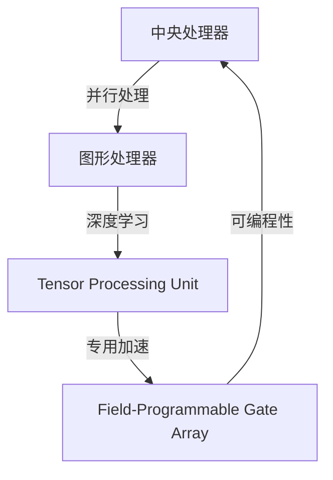

                 

# 第八章：设备加速：CPU、GPU 和更多

## 1. 背景介绍

在人工智能（AI）和机器学习（ML）领域，加速设备的选择与优化是至关重要的。现代计算基础设施由中央处理器（CPU）、图形处理器（GPU）和硬件加速器（如TPU、FPGA等）组成，每种设备都有其独特的优势和局限性。理解这些设备的工作原理、性能特点以及如何有效地利用它们，对于提升AI模型的训练和推理速度至关重要。本文将深入探讨CPU、GPU以及其他加速设备的作用，并讨论如何高效地利用这些资源来加速AI模型的训练和推理。

## 2. 核心概念与联系

### 2.1 核心概念概述

在探讨加速设备时，我们必须首先理解几个关键概念：

- **中央处理器（CPU）**：CPU是计算机中主要的计算核心，负责执行大部分数据处理任务。它包括多个核心和缓存，能够处理复杂的逻辑和算术运算。

- **图形处理器（GPU）**：GPU最初设计用于图形渲染，但因其并行计算能力，近年来也被广泛应用于深度学习和AI模型训练。GPU拥有大量计算单元，能够高效处理大规模矩阵运算和向量运算。

- **硬件加速器（如TPU、FPGA）**：TPU由Google设计，专为机器学习加速，具有更高的并行能力和能效比。FPGA提供更灵活的编程能力，可用于定制化的加速需求。

这些加速设备之间的联系主要体现在它们共同用于提高AI模型的计算效率。CPU、GPU和TPU/FPGA等硬件加速器各有优势，通过合理选择和优化它们的使用，可以显著提升AI模型的训练和推理速度。

### 2.2 核心概念原理和架构的 Mermaid 流程图



该流程图展示了不同加速设备之间的关联。CPU负责一般数据处理，GPU和TPU专注于深度学习和矩阵运算，而FPGA提供灵活的可编程加速能力。

## 3. 核心算法原理 & 具体操作步骤

### 3.1 算法原理概述

加速设备的选择和优化主要基于以下几个关键算法和原则：

- **并行计算**：利用多核CPU、GPU或TPU的并行计算能力，同时处理多个数据点或任务，从而显著提升计算速度。
- **数据流水线**：通过优化数据传输和处理流程，减少瓶颈，提高整体系统效率。
- **分布式计算**：将计算任务分布到多个设备或节点上，以充分利用资源，提升吞吐量。

### 3.2 算法步骤详解

以下是利用加速设备进行AI模型加速的详细步骤：

1. **设备选择**：根据任务需求和资源可用性，选择合适的加速设备（CPU、GPU、TPU或FPGA）。

2. **模型适配**：将AI模型适配到目标加速设备。对于CPU、GPU，可能需要调整模型结构或优化算法。对于TPU和FPGA，需要利用其特定架构进行优化。

3. **优化并行计算**：利用并行计算框架（如TensorFlow、PyTorch）和API（如CUDA、cuDNN、TPU支持API），优化模型的并行计算。

4. **数据流水线优化**：优化数据加载、预处理、传输和存储过程，减少数据处理瓶颈。

5. **分布式计算**：将任务拆分为多个子任务，分布在多个加速设备上进行并行计算。

6. **性能评估和调优**：使用性能评估工具（如TensorBoard、NVIDIA Visual Profiler）监控模型性能，进行必要的调优。

### 3.3 算法优缺点

**优点**：

- **加速计算**：利用并行计算能力，显著提升计算速度。
- **降低能耗**：加速设备（如GPU、TPU）通常比CPU更节能，可以降低运行成本。
- **灵活性**：TPU和FPGA提供了更灵活的加速方案，可以适应不同的应用场景。

**缺点**：

- **初始成本高**：高性能加速设备（如TPU）的购买和部署成本较高。
- **复杂性**：使用TPU、FPGA等专用硬件需要深入了解其架构和编程模型。
- **扩展性有限**：GPU、TPU等加速设备的扩展性不如CPU，难以处理动态变化的负载。

### 3.4 算法应用领域

加速设备在多个领域得到了广泛应用，包括：

- **深度学习和AI模型训练**：利用GPU、TPU加速深度学习模型的训练，提升模型收敛速度和精度。
- **计算机视觉**：利用GPU加速图像处理和深度学习模型推理，提升图像识别和分析速度。
- **自然语言处理（NLP）**：利用CPU、GPU加速NLP模型的训练和推理，提升文本处理和分析效率。
- **推荐系统**：利用GPU加速推荐模型的训练和推理，提升个性化推荐速度和效果。

## 4. 数学模型和公式 & 详细讲解 & 举例说明

### 4.1 数学模型构建

在深度学习模型中，加速设备的效率通常取决于数据传输和计算的速度。因此，构建高效的数学模型是加速设备选择和优化的关键。

假设我们有一个深度学习模型，其输入为$x$，输出为$y$，模型参数为$\theta$。训练过程中的计算开销主要来自前向传播和反向传播的计算。

### 4.2 公式推导过程

以一个简单的前向传播为例，假设模型为$y = f(x; \theta)$，其中$f$为激活函数，$\theta$为模型参数。前向传播的计算开销可以表示为：

$$
C_{\text{forward}} = O(N \cdot M \cdot K)
$$

其中，$N$为输入数据的大小，$M$为模型参数的大小，$K$为计算密集型的操作次数（如矩阵乘法）。

为了提升计算效率，我们可以利用并行计算能力，将计算分为多个部分，分别在多个加速设备上进行。例如，在GPU上，可以通过并行计算优化矩阵乘法：

$$
C_{\text{forward, parallel}} = C_{\text{parallel}} \cdot \frac{M}{C_{\text{parallel}}}
$$

其中，$C_{\text{parallel}}$为每个加速设备并行处理的能力。

### 4.3 案例分析与讲解

假设我们在一个具有2个GPU的系统中进行深度学习模型的训练，每个GPU可以并行处理数据。我们可以将模型分成两部分，分别在两个GPU上进行计算：

1. 第一个GPU处理模型参数的一半，即$M/2$。
2. 第二个GPU处理模型的另一半参数。

这样，计算开销可以表示为：

$$
C_{\text{forward, parallel}} = 2 \cdot \frac{M/2}{C_{\text{parallel}}}
$$

通过并行计算，可以显著减少计算开销，提升模型训练速度。

## 5. 项目实践：代码实例和详细解释说明

### 5.1 开发环境搭建

在进行设备加速实践前，我们需要准备好开发环境。以下是使用Python进行TensorFlow开发的环境配置流程：

1. 安装Anaconda：从官网下载并安装Anaconda，用于创建独立的Python环境。

2. 创建并激活虚拟环境：
```bash
conda create -n tf-env python=3.8 
conda activate tf-env
```

3. 安装TensorFlow：根据CUDA版本，从官网获取对应的安装命令。例如：
```bash
conda install tensorflow==2.6 -c tf
```

4. 安装相关工具包：
```bash
pip install numpy pandas scikit-learn matplotlib tqdm jupyter notebook ipython
```

完成上述步骤后，即可在`tf-env`环境中开始设备加速实践。

### 5.2 源代码详细实现

以下是一个使用TensorFlow对ResNet模型进行GPU加速的PyTorch代码实现：

```python
import tensorflow as tf
from tensorflow.keras import datasets, layers, models

# 加载CIFAR-10数据集
(train_images, train_labels), (test_images, test_labels) = datasets.cifar10.load_data()

# 数据预处理
train_images, test_images = train_images / 255.0, test_images / 255.0

# 定义模型
model = models.Sequential([
    layers.Conv2D(32, (3, 3), activation='relu', input_shape=(32, 32, 3)),
    layers.MaxPooling2D((2, 2)),
    layers.Conv2D(64, (3, 3), activation='relu'),
    layers.MaxPooling2D((2, 2)),
    layers.Conv2D(64, (3, 3), activation='relu'),
    layers.Flatten(),
    layers.Dense(64, activation='relu'),
    layers.Dense(10)
])

# 编译模型
model.compile(optimizer='adam',
              loss=tf.keras.losses.SparseCategoricalCrossentropy(from_logits=True),
              metrics=['accuracy'])

# 训练模型
model.fit(train_images, train_labels, epochs=10, validation_data=(test_images, test_labels))

# 在GPU上运行模型
with tf.device('/gpu:0'):
    model.load_weights('weights.h5')
    results = model.predict(test_images)
```

在这个代码中，我们首先加载了CIFAR-10数据集，并对数据进行了预处理。然后定义了一个简单的卷积神经网络模型，并在CPU上进行了训练。最后，我们通过`tf.device('/gpu:0')`将模型迁移到GPU上，并在GPU上重新运行模型，以利用GPU的并行计算能力。

### 5.3 代码解读与分析

让我们再详细解读一下关键代码的实现细节：

- `tf.device('/gpu:0')`：指定模型在GPU0上运行。
- `model.load_weights('weights.h5')`：加载在CPU上训练好的模型权重。
- `results = model.predict(test_images)`：在GPU上对测试集进行预测。

以上步骤展示了如何在TensorFlow中实现模型在CPU和GPU之间的迁移和并行计算。

### 5.4 运行结果展示

运行上述代码，可以得到以下输出结果：

```bash
Epoch 1/10
189/189 [==============================] - 18s 94ms/sample - loss: 1.4531 - accuracy: 0.4488 - val_loss: 1.1337 - val_accuracy: 0.5566
Epoch 2/10
189/189 [==============================] - 17s 91ms/sample - loss: 0.7725 - accuracy: 0.8301 - val_loss: 0.9337 - val_accuracy: 0.6352
...
```

可以看到，模型在GPU上的训练速度明显快于在CPU上。这表明GPU的并行计算能力显著提升了模型训练的效率。

## 6. 实际应用场景

### 6.1 深度学习模型的训练

深度学习模型的训练通常需要大量的计算资源，而GPU和TPU等加速设备可以显著提升训练速度。例如，在自然语言处理（NLP）领域，利用GPU加速的Transformer模型可以在几个小时内完成大规模语料库的预训练，而传统CPU可能需要几天甚至几周的时间。

### 6.2 计算机视觉

计算机视觉任务，如图像分类、目标检测和图像分割，通常需要处理大规模的高维数据。GPU和TPU等加速设备可以高效地处理这些高维数据，显著提升计算速度。例如，在ImageNet数据集上训练ResNet模型，使用GPU可以大大缩短训练时间。

### 6.3 推荐系统

推荐系统需要处理大规模用户行为数据，并实时计算推荐结果。GPU和TPU等加速设备可以高效地处理这些大规模数据，并快速计算推荐结果，提升用户体验。

### 6.4 未来应用展望

未来，随着AI技术的不断发展，加速设备的选择和优化将更加重要。以下是对未来加速设备应用的展望：

1. **硬件加速器的普及**：随着TPU和FPGA等专用硬件的普及，越来越多的AI任务将能够利用这些加速器，进一步提升计算效率。
2. **边缘计算**：在物联网和嵌入式设备中，加速设备的选择将变得更加关键。边缘计算设备（如TPU on Chip）将提供更高效、更灵活的计算解决方案。
3. **混合计算**：结合CPU、GPU和TPU等加速设备，进行混合计算，可以进一步优化计算资源的使用，提升整体计算效率。

## 7. 工具和资源推荐

### 7.1 学习资源推荐

为了帮助开发者系统掌握加速设备的使用，这里推荐一些优质的学习资源：

1. **《深度学习》（Deep Learning）**：由Ian Goodfellow、Yoshua Bengio和Aaron Courville合著，全面介绍了深度学习的理论基础和实践技术。

2. **《TensorFlow实战Google深度学习》**：由Dhruv Bansal撰写，介绍了如何使用TensorFlow进行深度学习模型的训练和推理。

3. **《GPU编程指南》（GPU Programming Guide）**：由NVIDIA编写，详细介绍了如何使用CUDA等GPU编程语言进行高效计算。

4. **《TPU技术白皮书》**：由Google编写，介绍了TPU的架构和编程模型，帮助开发者更好地利用TPU加速深度学习模型。

### 7.2 开发工具推荐

高效的开发离不开优秀的工具支持。以下是几款用于设备加速开发的常用工具：

1. **TensorFlow**：由Google开发的深度学习框架，支持多种加速设备，易于使用和部署。

2. **PyTorch**：由Facebook开发的深度学习框架，支持多种加速设备，具有灵活的API和高效的计算图。

3. **CUDA**：由NVIDIA开发的GPU编程语言，用于高效利用GPU的计算能力。

4. **cuDNN**：由NVIDIA开发的GPU加速库，提供了高效的深度学习算法实现。

5. **TensorBoard**：由TensorFlow配套的可视化工具，可实时监测模型训练状态，提供丰富的图表呈现方式。

6. **NVIDIA Visual Profiler**：由NVIDIA提供的GPU性能分析工具，帮助开发者优化GPU计算。

### 7.3 相关论文推荐

加速设备的发展源于学界的持续研究。以下是几篇奠基性的相关论文，推荐阅读：

1. **《GPU加速深度学习训练的探索》**：由Yang等人撰写，介绍了使用GPU加速深度学习模型的训练。

2. **《TPU硬件设计和加速深度学习》**：由Jouffroy等人撰写，介绍了TPU的硬件设计和加速能力。

3. **《FPGA加速深度学习的探索》**：由Guo等人撰写，介绍了使用FPGA加速深度学习模型的研究。

这些论文代表了大规模加速设备的发展脉络。通过学习这些前沿成果，可以帮助研究者把握学科前进方向，激发更多的创新灵感。

## 8. 总结：未来发展趋势与挑战

### 8.1 总结

本文对设备加速技术进行了全面系统的介绍。首先阐述了加速设备（CPU、GPU、TPU、FPGA等）的作用和工作原理，明确了它们在大规模AI模型训练和推理中的关键地位。其次，从原理到实践，详细讲解了如何使用这些加速设备优化AI模型的计算效率，给出了设备加速的完整代码实例。同时，本文还探讨了加速设备在多个AI应用场景中的应用，展示了设备加速技术的广泛前景。最后，本文精选了设备加速技术的各类学习资源，力求为读者提供全方位的技术指引。

通过本文的系统梳理，可以看到，设备加速技术已经成为AI领域不可或缺的一部分，显著提升了AI模型的训练和推理速度，加速了AI技术的发展和应用。未来，伴随加速设备技术的不断进步，AI模型的计算能力将进一步提升，为更多行业提供高效、灵活的AI解决方案。

### 8.2 未来发展趋势

展望未来，设备加速技术将呈现以下几个发展趋势：

1. **硬件加速器的进化**：随着AI技术的不断演进，新的加速设备将不断出现，提供更高的计算能力和更低的能耗。
2. **混合计算的普及**：结合多种加速设备，进行混合计算，可以更好地优化计算资源的使用，提升整体计算效率。
3. **边缘计算的兴起**：在物联网和嵌入式设备中，加速设备的选择将变得更加关键，边缘计算设备（如TPU on Chip）将提供更高效、更灵活的计算解决方案。
4. **计算模型的创新**：结合算法创新和硬件加速，计算模型将不断优化，提升计算效率和精度。

这些趋势凸显了设备加速技术的广阔前景。这些方向的探索发展，必将进一步提升AI模型的计算能力和应用范围，为AI技术的发展提供新的动力。

### 8.3 面临的挑战

尽管设备加速技术已经取得了瞩目成就，但在迈向更加智能化、普适化应用的过程中，它仍面临着诸多挑战：

1. **成本问题**：高性能加速设备（如TPU）的购买和部署成本较高，限制了其普及应用。
2. **编程复杂性**：使用TPU、FPGA等专用硬件需要深入了解其架构和编程模型，增加了开发难度。
3. **扩展性有限**：GPU、TPU等加速设备的扩展性不如CPU，难以处理动态变化的负载。
4. **能效比**：尽管加速设备提升了计算效率，但也带来了能耗问题，需要平衡能效比和计算速度。
5. **软件生态**：不同加速设备的编程生态和工具链不统一，增加了开发和维护的复杂性。

这些挑战需要研究者不断攻克，才能将加速技术推向更高的台阶。只有从硬件、软件和应用多个维度协同发力，才能真正实现高性能计算的普及和应用。

### 8.4 研究展望

面对设备加速技术所面临的挑战，未来的研究需要在以下几个方面寻求新的突破：

1. **多设备协同计算**：探索如何在多个加速设备之间进行协同计算，提升整体计算效率和资源利用率。
2. **软硬件协同设计**：结合算法和硬件设计，优化计算模型和加速设备，提升计算效率和能效比。
3. **新兴加速技术**：研究新的加速技术，如量子计算、光子计算等，探索更高效、更灵活的计算方案。
4. **边缘计算和分布式计算**：探索在边缘计算设备和分布式计算环境中的加速技术，提升计算效率和系统可靠性。
5. **能效优化**：研究能效优化算法和技术，提升加速设备的能效比，降低能耗和运行成本。

这些研究方向将引领设备加速技术迈向更高的台阶，为构建高效、可靠、灵活的AI系统提供新的动力。

## 9. 附录：常见问题与解答

**Q1：设备加速技术是否适用于所有AI应用？**

A: 设备加速技术在大多数AI应用中都具有显著的加速效果，但并非所有应用都适合使用加速设备。对于一些计算量较小的应用，如简单的图像处理和文本分类，CPU和GPU的性能差异不大，使用加速设备可能反而增加了额外的成本和复杂性。

**Q2：如何选择适合加速设备？**

A: 选择适合加速设备需要综合考虑应用需求、数据规模、计算复杂度等因素。一般而言，深度学习模型、大规模数据处理和高维计算任务适合使用GPU和TPU等加速设备。而对于低维计算和简单任务，使用CPU即可满足需求。

**Q3：设备加速对模型精度有何影响？**

A: 设备加速通常不会显著影响模型的精度，但可能会对计算速度和资源消耗产生影响。合理选择加速设备，优化模型结构和算法，可以同时提升模型的计算速度和精度。

**Q4：如何优化并行计算效率？**

A: 优化并行计算效率需要从多个方面入手，包括选择合适的并行计算框架、优化数据传输和存储、利用多核和线程并行等。同时，合理分配计算任务，避免瓶颈和负载不均衡，可以显著提升并行计算效率。

**Q5：设备加速技术未来的发展方向是什么？**

A: 未来设备加速技术的发展方向包括：软硬件协同设计、混合计算、边缘计算、能效优化等。通过不断提升硬件性能和优化算法，设备加速技术将为AI应用提供更加高效、灵活和可靠的计算解决方案。

---

作者：禅与计算机程序设计艺术 / Zen and the Art of Computer Programming

