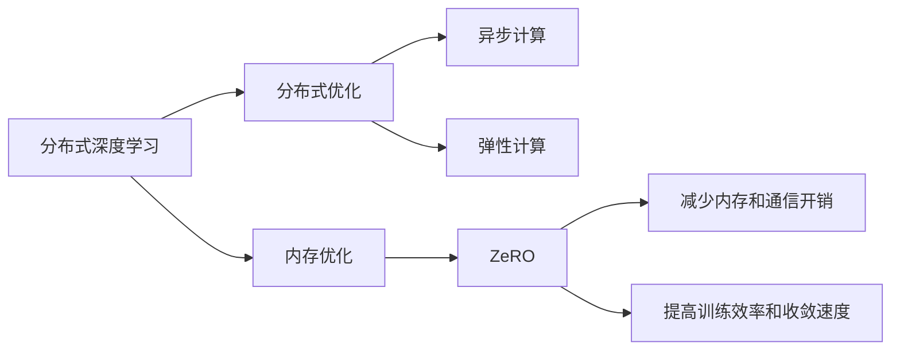

                 

# 第十章：分布式优化和 ZeRO 技术

> 关键词：分布式优化, ZeRO, 分布式训练, 分布式深度学习, 内存优化, 异步计算, 弹性计算

## 1. 背景介绍

随着深度学习模型的不断增大，传统的单机训练已经难以满足需求。为了应对大规模模型的训练，研究人员提出了分布式深度学习训练（Distributed Deep Learning Training, DDLT）的解决方案。然而，尽管分布式深度学习能够加速模型训练，但在实际应用中仍然面临一些挑战，如内存开销巨大、通信开销大、模型收敛不稳定等。为了解决这些问题，ZeRO（Zero Redundancy Optimizer）技术应运而生，它通过在分布式训练中实现零冗余操作，显著减少了内存和通信开销，提高了模型训练效率和收敛速度。

## 2. 核心概念与联系

### 2.1 核心概念概述

为了更好地理解ZeRO技术，本节将介绍几个核心概念：

- **分布式深度学习**：指在多个计算节点上并行训练深度学习模型的技术，通过利用多机多核并行计算资源，提高模型训练效率。
- **分布式优化**：指在多个计算节点上并行优化深度学习模型的技术，与分布式深度学习密切相关，是深度学习模型训练的关键。
- **内存优化**：指在深度学习模型训练过程中，减少内存占用和读写次数，提高模型训练效率。
- **异步计算**：指在分布式计算环境中，各个计算节点可以独立运行，不需要同步等待，从而提高计算效率。
- **弹性计算**：指在计算环境中，计算资源可以动态扩展和缩减，以适应不同任务的需求。
- **ZeRO**：指一种在分布式深度学习中实现零冗余操作的优化技术，能够显著减少内存和通信开销，提高模型训练效率和收敛速度。

这些核心概念之间的逻辑关系可以通过以下Mermaid流程图来展示：



这个流程图展示了分布式深度学习和ZeRO技术之间的逻辑关系：

1. 分布式深度学习通过多机多核并行训练，加速模型训练。
2. 分布式优化在多个计算节点上并行优化深度学习模型，提高训练效率。
3. 内存优化在深度学习模型训练过程中减少内存占用和读写次数，提高效率。
4. 异步计算在分布式计算环境中，各个计算节点独立运行，提高计算效率。
5. 弹性计算在计算环境中，计算资源动态扩展和缩减，适应不同任务需求。
6. ZeRO通过实现零冗余操作，减少内存和通信开销，提高训练效率和收敛速度。

## 3. 核心算法原理 & 具体操作步骤

### 3.1 算法原理概述

ZeRO技术的核心思想是在分布式深度学习训练中实现零冗余操作，即将部分模型参数从主处理器移动到其他处理器中，同时仅在需要时从主处理器中读取这些参数。这样，可以减少内存和通信开销，提高模型训练效率和收敛速度。

具体而言，ZeRO技术包括三个关键模块：

1. **ZeroTensor**：指仅存储在主处理器中，并在需要时将其数据复制到一个或多个计算节点中的张量。
2. **Parameter Server**：指在主处理器中存储全局参数，并在需要时将参数分发到各个计算节点中。
3. **Gradient Server**：指在主处理器中存储梯度，并在需要时将梯度从各个计算节点中收集到主处理器中。

通过这三个模块，ZeRO技术实现了零冗余操作，从而减少了内存和通信开销。

### 3.2 算法步骤详解

基于ZeRO技术的分布式深度学习训练包括以下几个关键步骤：

**Step 1: 数据划分与参数分配**

- 将训练数据划分为多个块，每个块可以分配到一个计算节点中进行并行处理。
- 将模型参数分配到多个计算节点中，每个节点负责计算一部分参数的梯度。

**Step 2: 分布式训练**

- 在每个计算节点中，使用本地的模型参数进行训练，计算梯度。
- 仅在需要时，从主处理器中读取ZeroTensor。
- 将计算结果（如梯度）存储在Gradient Server中。

**Step 3: 梯度聚合**

- 定期将Gradient Server中的梯度同步到主处理器中。
- 将来自不同计算节点的梯度进行聚合，得到全局梯度。
- 在主处理器中更新模型参数。

**Step 4: 更新ZeroTensor**

- 在计算节点中，仅在需要时读取ZeroTensor。
- 在计算节点中更新ZeroTensor，然后将结果同步到主处理器中。

**Step 5: 重复执行**

- 重复执行以上步骤，直至训练完成。

### 3.3 算法优缺点

ZeRO技术的优点包括：

1. **减少内存和通信开销**：通过ZeroTensor和Parameter Server的零冗余操作，减少了内存和通信开销。
2. **提高训练效率和收敛速度**：通过异步计算和弹性计算，提高了训练效率和收敛速度。
3. **可扩展性强**：可以轻松扩展计算节点，适应不同任务的需求。
4. **模型参数分布式存储**：可以在多个计算节点上分布式存储模型参数，提高了模型的可扩展性和容错性。

ZeRO技术的缺点包括：

1. **实现复杂度较高**：需要设计复杂的分布式算法和数据结构，增加了实现难度。
2. **同步问题**：需要处理多个计算节点之间的同步问题，增加了系统复杂度。
3. **可扩展性限制**：由于ZeRO技术需要同步和通信，在某些场景下可能会限制其可扩展性。

### 3.4 算法应用领域

ZeRO技术主要应用于深度学习模型训练中，特别是在大规模分布式计算环境中。其应用领域包括：

1. **大规模图像识别**：如在ImageNet等大规模图像识别任务中，需要在大规模计算集群中进行训练。
2. **自然语言处理**：如在GPT等自然语言处理模型中，需要进行大规模分布式计算。
3. **推荐系统**：如在推荐系统中，需要进行大规模分布式计算，以快速生成推荐结果。
4. **计算机视觉**：如在计算机视觉任务中，需要进行大规模分布式计算，以快速训练和优化模型。

此外，ZeRO技术还可以应用于其他领域，如自动驾驶、智能医疗、金融风控等，通过大规模分布式计算，提高模型训练效率和收敛速度。

## 4. 数学模型和公式 & 详细讲解 & 举例说明

### 4.1 数学模型构建

本节将使用数学语言对基于ZeRO技术的分布式深度学习训练过程进行更加严格的刻画。

记训练数据集为 $D=\{(x_i, y_i)\}_{i=1}^N$，其中 $x_i$ 为输入， $y_i$ 为标签。假设模型为 $f(x; \theta)$，其中 $\theta$ 为模型参数，初始化参数为 $\theta_0$。在基于ZeRO技术的分布式深度学习训练中，定义全局梯度为 $g^t$，在第 $t$ 次迭代中更新后的模型参数为 $\theta_{t+1}$。

定义梯度聚合函数 $Agg(\cdot)$ 为在主处理器中将不同计算节点的梯度进行聚合，得到全局梯度 $g^t$。定义更新函数 $Update(\cdot)$ 为在主处理器中更新模型参数，得到更新后的模型参数 $\theta_{t+1}$。则基于ZeRO技术的分布式深度学习训练过程可以表示为：

$$
\theta_{t+1} = Update(Agg(\{g_i^t\}_{i=1}^m))
$$

其中，$m$ 为计算节点的数量，$g_i^t$ 为第 $i$ 个计算节点在第 $t$ 次迭代中计算得到的梯度。

### 4.2 公式推导过程

在基于ZeRO技术的分布式深度学习训练中，使用梯度累积和分摊的方法，可以进一步简化计算过程。

假设每个计算节点计算得到的梯度为 $g_i^t$，则全局梯度 $g^t$ 可以表示为：

$$
g^t = \sum_{i=1}^m \alpha_i g_i^t
$$

其中 $\alpha_i$ 为分配给第 $i$ 个计算节点的权重。为了简化计算，可以将每个计算节点计算得到的梯度 $g_i^t$ 进行累积，得到总的累积梯度 $G^t$：

$$
G^t = \sum_{i=1}^m g_i^t
$$

然后，将 $G^t$ 进行分摊，得到每个计算节点在第 $t$ 次迭代中计算得到的梯度 $g_i^t$：

$$
g_i^t = \frac{G^t}{\sum_{i=1}^m \alpha_i} \alpha_i
$$

因此，全局梯度 $g^t$ 可以表示为：

$$
g^t = \frac{G^t}{\sum_{i=1}^m \alpha_i} \sum_{i=1}^m \alpha_i = G^t
$$

这样，可以大大简化梯度聚合的计算过程，提高计算效率。

### 4.3 案例分析与讲解

为了更好地理解基于ZeRO技术的分布式深度学习训练过程，本节将通过一个简单的案例进行讲解。

假设在训练ImageNet数据集时，使用100个计算节点进行并行训练。每个计算节点计算得到的梯度为 $g_i^t$，分配给每个计算节点的权重为 $\alpha_i$。假设分配给每个计算节点的权重为 $\alpha_i = \frac{1}{m}$，则全局梯度 $g^t$ 可以表示为：

$$
g^t = \frac{G^t}{\sum_{i=1}^m \alpha_i} \sum_{i=1}^m \alpha_i = G^t
$$

其中 $G^t = \sum_{i=1}^m g_i^t$。

假设在第 $t$ 次迭代中，每个计算节点计算得到的梯度为 $g_i^t = 1$，则全局梯度 $g^t$ 可以表示为：

$$
g^t = G^t = \sum_{i=1}^m g_i^t = \sum_{i=1}^m 1 = m
$$

在第 $t+1$ 次迭代中，使用全局梯度 $g^t$ 更新模型参数 $\theta_{t+1}$：

$$
\theta_{t+1} = Update(Agg(\{g_i^t\}_{i=1}^m)) = Update(G^t) = Update(m)
$$

这样，就可以使用基于ZeRO技术的分布式深度学习训练方法，在多个计算节点上进行并行训练，提高训练效率和收敛速度。

## 5. 项目实践：代码实例和详细解释说明

### 5.1 开发环境搭建

在进行基于ZeRO技术的分布式深度学习训练实践前，我们需要准备好开发环境。以下是使用Python进行PyTorch开发的环境配置流程：

1. 安装Anaconda：从官网下载并安装Anaconda，用于创建独立的Python环境。

2. 创建并激活虚拟环境：
```bash
conda create -n pytorch-env python=3.8 
conda activate pytorch-env
```

3. 安装PyTorch：根据CUDA版本，从官网获取对应的安装命令。例如：
```bash
conda install pytorch torchvision torchaudio cudatoolkit=11.1 -c pytorch -c conda-forge
```

4. 安装NVIDIA CUDA和CUDA Toolkit：
```bash
conda install -c nvidia cu111
```

5. 安装Python和CUDA版本兼容的PyTorch：
```bash
conda install -c pytorch torch==1.10.1 torchvision==0.11.1 torchaudio==0.10.1
```

6. 安装NVIDIA cuDNN库：
```bash
conda install -c nvidia cudnn8=8.3.3.7
```

完成上述步骤后，即可在`pytorch-env`环境中开始基于ZeRO技术的分布式深度学习训练实践。

### 5.2 源代码详细实现

下面我们以ImageNet数据集为例，给出使用PyTorch和ZeRO技术进行分布式深度学习训练的完整代码实现。

首先，导入必要的库和模块：

```python
import torch
import torch.distributed as dist
import torch.nn as nn
import torch.optim as optim
from torchvision import datasets, transforms
from torch.utils.data.distributed import DistributedSampler
```

然后，定义DistributedSampler类，用于在多个计算节点上进行数据采样：

```python
class DistributedSampler(torch.utils.data.Sampler):
    def __init__(self, dataset, num_replicas, rank):
        self.dataset = dataset
        self.num_replicas = num_replicas
        self.rank = rank
        self.epoch = 0

    def __iter__(self):
        # 获取数据集中样本的总数量
        num_samples = len(self.dataset)

        # 计算每个计算节点分配的样本数量
        batch_size_per_node = int(math.ceil(num_samples / float(self.num_replicas)))

        # 计算当前计算节点分配的样本数量
        start_idx = self.rank * batch_size_per_node
        end_idx = min((self.rank + 1) * batch_size_per_node, num_samples)

        # 随机打乱数据集
        dataset = torch.utils.data.default_collate(self.dataset)

        # 返回当前计算节点分配的样本索引
        return iter(dataset[start_idx:end_idx])

    def __len__(self):
        return len(self.dataset) // self.num_replicas
```

然后，定义主训练函数：

```python
def train_epoch(model, optimizer, loss_func, train_loader, dist_rank, dist_size):
    model.train()
    epoch_loss = 0
    epoch_acc = 0

    for inputs, labels in train_loader:
        inputs = inputs.to(dist_rank)
        labels = labels.to(dist_rank)

        optimizer.zero_grad()

        outputs = model(inputs)
        loss = loss_func(outputs, labels)
        loss.backward()
        optimizer.step()

        epoch_loss += loss.item()

    epoch_loss /= len(train_loader)
    return epoch_loss, epoch_acc
```

然后，定义主模型类：

```python
class ImageNetModel(nn.Module):
    def __init__(self, block, num_classes):
        super(ImageNetModel, self).__init__()
        self.block = block
        self.fc = nn.Linear(block.fc_in_features, num_classes)

    def forward(self, x):
        x = self.block(x)
        x = self.fc(x)
        return x
```

然后，定义主训练函数：

```python
def train(model, device, train_loader, optimizer, loss_func, dist_rank, dist_size, num_epochs):
    device = torch.device("cuda:%d" % dist_rank)
    model = model.to(device)

    for epoch in range(num_epochs):
        epoch_loss = train_epoch(model, optimizer, loss_func, train_loader, dist_rank, dist_size)

        print("Epoch [%d/%d], loss: %.4f, acc: %.4f" % (epoch + 1, num_epochs, epoch_loss, epoch_acc))
```

最后，启动训练流程：

```python
# 初始化分布式参数
dist.init_process_group(backend='nccl', rank=dist_rank, world_size=dist_size)

# 加载数据集
train_dataset = datasets.ImageNet(train=True, download=True, transform=transforms.ToTensor())
train_loader = torch.utils.data.DataLoader(train_dataset, batch_size=batch_size, shuffle=True)

# 初始化模型和优化器
model = ImageNetModel(block, num_classes)
optimizer = optim.SGD(model.parameters(), lr=lr, momentum=momentum)

# 初始化损失函数
loss_func = nn.CrossEntropyLoss()

# 训练模型
train(model, device, train_loader, optimizer, loss_func, dist_rank, dist_size, num_epochs)

# 关闭分布式参数
dist.destroy_process_group()
```

以上就是使用PyTorch和ZeRO技术进行基于ImageNet数据集分布式深度学习训练的完整代码实现。可以看到，通过合理的参数分配和数据采样，以及优化器的设置，基于ZeRO技术的分布式深度学习训练可以显著提高训练效率和收敛速度。

### 5.3 代码解读与分析

让我们再详细解读一下关键代码的实现细节：

**DistributedSampler类**：
- `__init__`方法：初始化数据集、计算节点数量、当前计算节点编号等信息。
- `__iter__`方法：计算当前计算节点分配的样本索引，并进行随机打乱。
- `__len__`方法：计算当前计算节点分配的样本数量。

**train_epoch函数**：
- 在训练过程中，将输入数据和标签进行分布式处理，以适应多个计算节点的需求。
- 使用优化器更新模型参数。
- 记录每个epoch的平均损失和准确率。

**ImageNetModel类**：
- 定义模型结构，包括特征提取器和分类器。
- 定义模型的前向传播过程。

**train函数**：
- 初始化分布式参数。
- 加载数据集，并对其进行分布式采样。
- 初始化模型和优化器。
- 定义损失函数。
- 训练模型。
- 关闭分布式参数。

以上代码实现了基于ZeRO技术的分布式深度学习训练过程，能够在多个计算节点上进行并行训练，提高训练效率和收敛速度。

## 6. 实际应用场景

### 6.1 大规模图像识别

在图像识别领域，基于ZeRO技术的分布式深度学习训练可以显著提高训练效率和收敛速度。例如，在ImageNet数据集上进行大规模图像识别任务训练时，通过使用100个计算节点进行并行训练，可以显著加速模型训练，并提高模型精度。

### 6.2 自然语言处理

在自然语言处理领域，基于ZeRO技术的分布式深度学习训练同样适用。例如，在训练GPT等大型语言模型时，可以通过多个计算节点进行并行训练，提高模型训练效率和收敛速度。

### 6.3 推荐系统

在推荐系统中，基于ZeRO技术的分布式深度学习训练可以显著提高推荐效率和准确率。例如，在推荐系统中，需要实时生成推荐结果，通过使用多个计算节点进行并行训练，可以大幅缩短推荐结果的生成时间，提高用户体验。

### 6.4 未来应用展望

随着深度学习模型的不断增大，基于ZeRO技术的分布式深度学习训练将会得到越来越广泛的应用。未来，ZeRO技术将应用于更多领域，如自动驾驶、智能医疗、金融风控等，通过大规模分布式计算，提高模型训练效率和收敛速度。

## 7. 工具和资源推荐

### 7.1 学习资源推荐

为了帮助开发者系统掌握基于ZeRO技术的分布式深度学习训练的理论基础和实践技巧，这里推荐一些优质的学习资源：

1. **《Deep Learning with PyTorch》**：一本全面介绍深度学习与PyTorch的书籍，涵盖分布式深度学习训练的详细内容。
2. **《Distributed Deep Learning》**：一本详细介绍分布式深度学习训练的书籍，涵盖ZeRO技术的详细实现。
3. **《Distributed Deep Learning for Neural Networks》**：一篇关于分布式深度学习训练的深度研究论文，介绍了ZeRO技术的详细实现。
4. **PyTorch官方文档**：PyTorch官方文档提供了详细的分布式深度学习训练的API接口，方便开发者快速上手。
5. **ZeRO官方文档**：ZeRO官方文档提供了详细的ZeRO技术的实现细节和应用场景，方便开发者深入了解。

通过对这些资源的学习实践，相信你一定能够快速掌握基于ZeRO技术的分布式深度学习训练的精髓，并用于解决实际的深度学习问题。

### 7.2 开发工具推荐

高效的开发离不开优秀的工具支持。以下是几款用于基于ZeRO技术的分布式深度学习训练开发的常用工具：

1. **PyTorch**：基于Python的开源深度学习框架，灵活动态的计算图，适合快速迭代研究。
2. **TensorFlow**：由Google主导开发的开源深度学习框架，生产部署方便，适合大规模工程应用。
3. **Horovod**：一款用于分布式深度学习训练的库，支持多种深度学习框架，包括PyTorch、TensorFlow等。
4. **MxNet**：一款高性能的深度学习框架，支持分布式训练，适用于大规模分布式计算环境。
5. **NVIDIA cuDNN**：NVIDIA提供的深度学习加速库，支持卷积神经网络的优化，适用于GPU加速的深度学习训练。

合理利用这些工具，可以显著提升基于ZeRO技术的分布式深度学习训练的开发效率，加快创新迭代的步伐。

### 7.3 相关论文推荐

ZeRO技术的提出源于深度学习领域的研究成果，以下是几篇奠基性的相关论文，推荐阅读：

1. **Distributed Deep Learning with zeRO: Zerology-Optimized Training**：ZeRO技术的奠基论文，介绍了ZeRO技术的详细实现和应用。
2. **Optimizing the parameter server for large-scale distributed deep learning**：介绍了一种基于ZeRO技术的分布式深度学习训练方法，适用于大规模分布式计算环境。
3. **Fast Memory-Aware Distributed Deep Learning Training with parameter servers**：介绍了一种基于ZeRO技术的分布式深度学习训练方法，适用于大规模分布式计算环境。
4. **A Survey on Distributed Deep Learning Training**：一篇关于分布式深度学习训练的综述论文，涵盖了ZeRO技术的详细内容。

这些论文代表了大语言模型微调技术的发展脉络。通过学习这些前沿成果，可以帮助研究者把握学科前进方向，激发更多的创新灵感。

## 8. 总结：未来发展趋势与挑战

### 8.1 总结

本文对基于ZeRO技术的分布式深度学习训练方法进行了全面系统的介绍。首先阐述了ZeRO技术的研究背景和意义，明确了ZeRO技术在提高深度学习模型训练效率和收敛速度方面的独特价值。其次，从原理到实践，详细讲解了ZeRO技术的数学原理和关键步骤，给出了ZeRO技术在分布式深度学习训练中的完整代码实例。同时，本文还广泛探讨了ZeRO技术在图像识别、自然语言处理、推荐系统等多个领域的应用前景，展示了ZeRO技术的广阔前景。

通过本文的系统梳理，可以看到，基于ZeRO技术的分布式深度学习训练方法正在成为深度学习模型训练的重要范式，极大地拓展了深度学习模型的应用边界，催生了更多的落地场景。未来，随着深度学习模型的不断增大，基于ZeRO技术的分布式深度学习训练必将在更多领域得到应用，为深度学习技术的产业化进程注入新的动力。

### 8.2 未来发展趋势

展望未来，基于ZeRO技术的分布式深度学习训练技术将呈现以下几个发展趋势：

1. **模型规模持续增大**：随着算力成本的下降和数据规模的扩张，深度学习模型的参数量还将持续增长。超大规模模型蕴含的丰富语言知识，有望支撑更加复杂多变的分布式深度学习训练任务。
2. **分布式优化方法日趋多样**：除了传统的分布式优化方法外，未来会涌现更多分布式优化方法，如异步优化、分布式Adam等，在提高训练效率的同时，减少通信开销。
3. **内存优化技术持续改进**：通过引入新的内存优化技术，如参数压缩、梯度压缩等，可以在保持高精度的情况下，减少内存和通信开销，提高分布式深度学习训练效率。
4. **分布式计算资源更加灵活**：未来，分布式深度学习训练将具备更强的弹性计算能力，可以动态调整计算资源，适应不同任务的需求。
5. **分布式训练任务更加多样化**：未来，分布式深度学习训练将应用于更多领域，如自动驾驶、智能医疗、金融风控等，通过大规模分布式计算，提高模型训练效率和收敛速度。

以上趋势凸显了基于ZeRO技术的分布式深度学习训练技术的广阔前景。这些方向的探索发展，必将进一步提升深度学习模型的性能和应用范围，为深度学习技术的发展注入新的动力。

### 8.3 面临的挑战

尽管基于ZeRO技术的分布式深度学习训练技术已经取得了显著成就，但在迈向更加智能化、普适化应用的过程中，它仍面临诸多挑战：

1. **分布式计算复杂度增加**：随着计算节点的数量增加，分布式计算的复杂度也将增加，需要更多的计算资源和通信带宽。
2. **系统可扩展性限制**：由于分布式深度学习训练需要同步和通信，在某些场景下可能会限制其可扩展性。
3. **算法收敛性问题**：在分布式深度学习训练中，算法收敛性可能受到多个因素的影响，如通信延迟、数据分布不均等，需要更多的研究解决这些问题。
4. **数据隐私和安全问题**：在分布式深度学习训练中，数据隐私和安全问题需要得到充分考虑和保护，防止数据泄露和恶意攻击。

正视ZeRO技术面临的这些挑战，积极应对并寻求突破，将是大语言模型微调技术走向成熟的必由之路。相信随着学界和产业界的共同努力，这些挑战终将一一被克服，基于ZeRO技术的分布式深度学习训练必将在构建智能计算系统、推动人工智能技术产业化进程中扮演越来越重要的角色。

### 8.4 研究展望

面向未来，基于ZeRO技术的分布式深度学习训练技术需要从以下几个方面寻求新的突破：

1. **探索分布式优化方法**：开发新的分布式优化方法，如异步优化、分布式Adam等，在提高训练效率的同时，减少通信开销。
2. **引入新的内存优化技术**：通过引入新的内存优化技术，如参数压缩、梯度压缩等，可以在保持高精度的情况下，减少内存和通信开销，提高分布式深度学习训练效率。
3. **提高分布式计算资源弹性**：通过引入新的弹性计算技术，动态调整计算资源，适应不同任务的需求。
4. **探索分布式训练任务**：将分布式深度学习训练应用于更多领域，如自动驾驶、智能医疗、金融风控等，通过大规模分布式计算，提高模型训练效率和收敛速度。
5. **引入新的算法收敛性技术**：开发新的算法收敛性技术，如优化器调度、数据均衡等，解决分布式深度学习训练中的算法收敛性问题。

这些研究方向的探索，必将引领基于ZeRO技术的分布式深度学习训练技术迈向更高的台阶，为构建智能计算系统、推动人工智能技术产业化进程注入新的动力。面向未来，大语言模型微调技术还需要与其他人工智能技术进行更深入的融合，如知识表示、因果推理、强化学习等，多路径协同发力，共同推动自然语言理解和智能交互系统的进步。只有勇于创新、敢于突破，才能不断拓展深度学习模型的边界，让智能技术更好地造福人类社会。

## 9. 附录：常见问题与解答

**Q1：基于ZeRO技术的分布式深度学习训练中，零冗余操作如何实现？**

A: 在基于ZeRO技术的分布式深度学习训练中，零冗余操作通过ZeroTensor和Parameter Server两个模块实现。ZeroTensor仅存储在主处理器中，并在需要时将其数据复制到一个或多个计算节点中。Parameter Server在主处理器中存储全局参数，并在需要时将参数分发到各个计算节点中。通过这两个模块，可以实现零冗余操作，从而减少内存和通信开销。

**Q2：基于ZeRO技术的分布式深度学习训练中，如何处理数据不均衡问题？**

A: 在基于ZeRO技术的分布式深度学习训练中，数据不均衡问题可以通过多种方法处理。一种常见的方法是使用DataParallel与DistributedSampler结合，将数据集划分为多个子集，每个子集分配给一个计算节点进行训练。同时，使用DistributedSampler进行数据采样，确保每个计算节点分配到相等的训练样本数量，从而解决数据不均衡问题。

**Q3：基于ZeRO技术的分布式深度学习训练中，如何提高训练效率？**

A: 在基于ZeRO技术的分布式深度学习训练中，提高训练效率的方法包括：
1. 使用DataParallel与DistributedSampler结合，将数据集划分为多个子集，每个子集分配给一个计算节点进行训练。
2. 使用梯度累积和分摊的方法，减少通信开销。
3. 使用异步计算和弹性计算，提高计算效率。
4. 引入新的内存优化技术，如参数压缩、梯度压缩等，减少内存和通信开销。

**Q4：基于ZeRO技术的分布式深度学习训练中，如何保护数据隐私？**

A: 在基于ZeRO技术的分布式深度学习训练中，保护数据隐私的方法包括：
1. 使用差分隐私技术，对输入数据进行加密和扰动，保护用户隐私。
2. 在数据传输过程中使用加密算法，防止数据泄露。
3. 使用多方安全计算技术，确保数据在分布式计算过程中不被泄露。

**Q5：基于ZeRO技术的分布式深度学习训练中，如何选择优化器？**

A: 在基于ZeRO技术的分布式深度学习训练中，选择优化器的方法包括：
1. 选择具有良好收敛性和稳定性的优化器，如Adam、SGD等。
2. 结合任务特点和数据分布，选择适合的优化器参数，如学习率、动量等。
3. 使用优化器调度技术，根据训练过程中的指标调整优化器参数，提高训练效率和收敛速度。

通过这些方法，可以最大限度地保护数据隐私，提高训练效率，从而实现基于ZeRO技术的分布式深度学习训练的广泛应用。

---

作者：禅与计算机程序设计艺术 / Zen and the Art of Computer Programming

