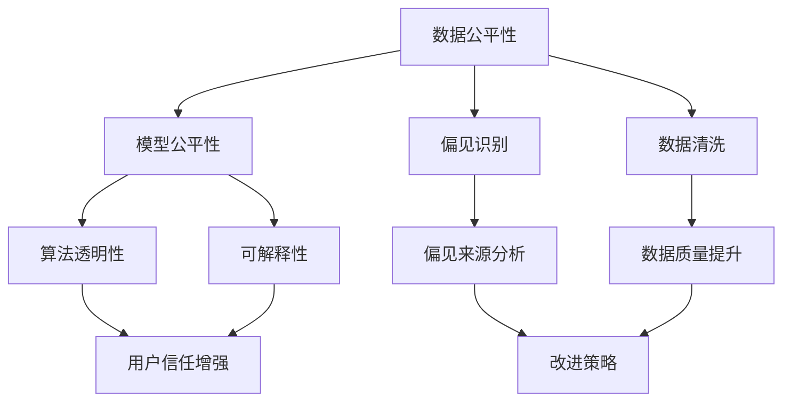

                 

# 算法公平：构建负责任的人工智能

> 关键词：算法公平,负责任的人工智能,偏见识别,数据清洗,算法透明,可解释性,隐私保护

## 1. 背景介绍

### 1.1 问题由来
随着人工智能（AI）技术的快速发展，其在各个领域的应用日益广泛，从医疗诊断、金融风控、推荐系统到自动驾驶、智能客服，AI无处不在。然而，与传统技术相比，AI技术的复杂性和不确定性也带来了新的挑战，特别是算法的公平性问题，引发了广泛的社会关注。

近年来，AI算法在公平性方面的问题逐渐浮出水面。研究表明，许多AI系统在决策过程中存在明显的歧视和偏见，导致不同群体受到不公平对待。例如，面部识别系统对非白人群体的识别准确率远低于白人群体，医疗AI系统对少数族裔的诊断结果存在偏误，自动招聘系统更偏向于录用某些性别或种族的求职者。这些问题不仅损害了受影响群体的权益，还引发了公众对AI技术的信任危机。

面对这些问题，越来越多的学者和业界专家呼吁，必须构建负责任的AI系统，确保其公平性和透明度，才能获得社会的广泛认可和信任。这一呼吁也得到了各国政府和监管机构的积极响应，例如欧盟的《通用数据保护条例》（GDPR）和美国的《公平账目法案》（EEOC）等，都对AI算法的公平性提出了明确要求。

### 1.2 问题核心关键点
构建负责任的AI系统，需要从数据收集、模型设计、模型评估和应用部署等多个环节入手，确保算法的公平性、透明度和可解释性。核心关键点包括：

1. **数据公平性**：确保训练数据的多样性和代表性，避免数据偏见对模型决策的负面影响。
2. **模型公平性**：通过公平性检测和优化，消除模型决策中的系统性偏见。
3. **算法透明性**：提供清晰、易懂的算法决策过程，帮助用户理解AI系统的决策逻辑。
4. **可解释性**：开发可解释的AI模型，让用户能够理解和信任AI系统的输出结果。
5. **隐私保护**：确保AI系统在处理敏感数据时，遵守隐私保护法规，保护用户隐私。

### 1.3 问题研究意义
构建负责任的AI系统，对于保障社会公正、提升AI技术的应用价值、促进AI技术的可持续发展具有重要意义：

1. **保障社会公正**：AI算法的不公平性会加剧社会不平等，剥夺某些群体的合法权益。构建公平的AI系统，有助于促进社会公正，维护社会和谐。
2. **提升AI技术应用价值**：公平、透明的AI系统能够更好地满足用户需求，提升用户体验，增强用户信任，从而扩大AI技术的应用范围和价值。
3. **促进AI技术可持续发展**：负责任的AI系统能够更好地适应政策法规和伦理要求，避免法律风险，促进AI技术的健康发展。

## 2. 核心概念与联系

### 2.1 核心概念概述

为更好地理解算法公平和构建负责任AI系统的原理和实践，本节将介绍几个关键概念及其相互联系：

- **算法公平**：指AI系统在决策过程中，对不同群体或个体公平对待，不带有明显的系统性偏见。
- **责任AI**：指在设计和应用AI系统时，不仅要考虑技术性能，还要考虑社会影响和道德责任，确保AI系统对社会产生积极作用。
- **偏见识别**：指识别和分析数据和模型中存在的偏见，确定其来源和影响。
- **数据清洗**：指清洗数据中的噪声和偏见，提高数据质量和代表性。
- **算法透明性**：指提供算法决策过程的清晰解释，帮助用户理解AI系统的决策逻辑。
- **可解释性**：指提供对AI系统决策结果的解释，帮助用户理解和信任AI系统的输出。
- **隐私保护**：指在处理敏感数据时，保护用户隐私，遵守相关法律法规。

这些概念之间的逻辑关系可以通过以下Mermaid流程图来展示：



这个流程图展示了数据公平性、模型公平性、偏见识别、数据清洗、算法透明性、可解释性和隐私保护之间的关系：

1. 数据公平性需要通过偏见识别和数据清洗，消除数据中的系统性偏见。
2. 模型公平性需要在偏见识别和数据清洗的基础上，进一步通过优化算法和模型参数，消除模型决策中的偏见。
3. 算法透明性和可解释性有助于增强用户对AI系统的信任，促进其公平性和社会责任感的落实。
4. 隐私保护是确保AI系统负责任运行的重要保障，需要遵守相关法律法规和伦理要求。

这些概念共同构成了构建负责任AI系统的核心框架，确保其在技术性能和社会责任之间取得平衡。

## 3. 核心算法原理 & 具体操作步骤
### 3.1 算法原理概述

构建负责任的AI系统，核心在于确保算法决策的公平性和透明度。其核心算法原理和具体操作步骤如下：

- **数据预处理**：通过数据收集、清洗和增强，确保训练数据的多样性和代表性，避免数据偏见对模型决策的负面影响。
- **模型设计**：选择合适的模型架构和损失函数，加入公平性约束，优化模型参数，消除系统性偏见。
- **模型评估**：使用多种评估指标，包括公平性指标、准确率、召回率等，综合评估模型性能，确保模型在公平性和准确性之间取得平衡。
- **模型部署**：在实际应用中，确保模型在数据处理和决策过程中遵循公平性原则，保护用户隐私，提供可解释的决策过程。

### 3.2 算法步骤详解

基于上述原理，构建负责任的AI系统可以分为以下几个关键步骤：

**Step 1: 数据收集与预处理**
- 收集多源、多样化的数据，确保数据代表性。
- 清洗数据，删除噪声、异常值和偏见。
- 增强数据，通过数据生成、合成等方式丰富数据样本。

**Step 2: 模型设计与训练**
- 选择适合任务的模型架构，如线性回归、决策树、神经网络等。
- 设计公平性约束，如Equalized Odds、Demographic Parity等。
- 训练模型，使用公平性优化算法，如FairOpt、FairMix等，消除模型偏见。

**Step 3: 模型评估与优化**
- 使用公平性指标，如True Positive Rate、False Positive Rate等，评估模型性能。
- 对比不同模型和策略，选择最优方案。
- 使用对抗性训练、数据重采样等技术，进一步优化模型。

**Step 4: 模型部署与应用**
- 部署模型，确保在实际应用中遵循公平性原则。
- 提供决策过程的解释，增强用户信任。
- 保护用户隐私，遵守相关法律法规。

### 3.3 算法优缺点

构建负责任的AI系统，虽然能够显著提升算法的公平性和透明度，但也面临一些挑战：

优点：
1. **提升公平性**：通过数据预处理和模型优化，消除算法偏见，提升模型公平性。
2. **增强透明度**：提供清晰的决策过程，增强用户信任和满意度。
3. **保护隐私**：在处理敏感数据时，确保隐私保护，遵守法律法规。

缺点：
1. **复杂度高**：公平性优化和模型训练过程复杂，需要更多的技术资源和经验。
2. **性能损失**：在加入公平性约束和优化策略后，模型性能可能会略有下降。
3. **数据获取难**：获取高质量、多样化的数据集，特别是敏感数据，成本较高。

### 3.4 算法应用领域

构建负责任的AI系统，已经在医疗、金融、教育、司法等多个领域得到应用，取得了显著效果：

1. **医疗领域**：使用AI算法辅助诊断和治疗决策，确保不同群体受到公平对待。
2. **金融领域**：使用AI算法进行风险评估和信用评分，避免歧视性决策，提高金融服务可及性。
3. **教育领域**：使用AI算法进行个性化教育推荐，确保不同学生受到公平对待。
4. **司法领域**：使用AI算法进行量刑和判决，避免歧视性决策，提高司法公正性。

此外，在智能客服、推荐系统、广告投放等诸多领域，负责任的AI系统也正在发挥重要作用，提升用户体验，促进社会公平。

## 4. 数学模型和公式 & 详细讲解 & 举例说明

### 4.1 数学模型构建

构建负责任的AI系统，需要建立多种数学模型和公式，以量化和评估算法的公平性和透明性。

- **公平性指标**：如True Positive Rate（TPR）、False Positive Rate（FPR）、Demographic Parity（DP）、Equalized Odds（EO）等。
- **模型损失函数**：如交叉熵损失、均方误差损失等，结合公平性约束进行优化。
- **偏见识别方法**：如模型可解释性分析、敏感性分析等。

以下将以二分类问题为例，给出公平性指标和模型优化的数学模型和公式：

假设二分类任务的数据集为 $D=\{(x_i, y_i)\}_{i=1}^N$，其中 $x_i \in \mathcal{X}, y_i \in \{0,1\}$。模型 $M_{\theta}$ 的输出为 $y=\hat{y}=M_{\theta}(x)$。

- **True Positive Rate（TPR）**：指模型正确预测的正样本比例，即TPR=TP/(TP+FN)。其中TP为真正例，FN为假负例。
- **False Positive Rate（FPR）**：指模型错误预测的正样本比例，即FPR=FP/(FP+TN)。其中FP为假正例，TN为真负例。

公平性约束可以表示为：

$$
\begin{aligned}
& \text{DP} \quad y_i \sim p(y_i) \quad \Rightarrow \quad P(y=1|y_i=1) = P(y=1|y_i=0) \\
& \text{EO} \quad y_i \sim p(y_i) \quad \Rightarrow \quad P(y=1|y_i=1, y=1) = P(y=1|y_i=0, y=0)
\end{aligned}
$$

模型损失函数可以表示为：

$$
\mathcal{L}(\theta) = \frac{1}{N} \sum_{i=1}^N \left[ -y_i \log \hat{y}_i + (1-y_i) \log (1-\hat{y}_i) + \lambda_1 D_{\text{DP}} + \lambda_2 D_{\text{EO}} \right]
$$

其中 $D_{\text{DP}}$ 和 $D_{\text{EO}}$ 为公平性约束的惩罚项，$\lambda_1$ 和 $\lambda_2$ 为公平性约束的权重。

### 4.2 公式推导过程

以下对上述公平性指标和模型损失函数的公式进行详细推导：

- **True Positive Rate（TPR）**：
$$
TPR = \frac{TP}{TP+FN} = \frac{1}{1+FP/TN} = \frac{TP}{TP+FP}
$$

- **False Positive Rate（FPR）**：
$$
FPR = \frac{FP}{FP+TN} = \frac{FP}{FP+TN} = \frac{FP}{FP+FN}
$$

- **Demographic Parity（DP）**：
$$
DP \Rightarrow P(y=1|y_i=1) = P(y=1|y_i=0)
$$

- **Equalized Odds（EO）**：
$$
EO \Rightarrow P(y=1|y_i=1, y=1) = P(y=1|y_i=0, y=0)
$$

- **模型损失函数**：
$$
\mathcal{L}(\theta) = \frac{1}{N} \sum_{i=1}^N \left[ -y_i \log \hat{y}_i + (1-y_i) \log (1-\hat{y}_i) \right] + \lambda_1 \left( \frac{TP}{TP+FP+FN} - \frac{1}{2} \right) + \lambda_2 \left( \frac{TP+TN}{TP+FN+FP+TN} - \frac{1}{2} \right)
$$

其中，$\lambda_1$ 和 $\lambda_2$ 为公平性约束的权重，可以通过交叉验证等方法进行调整。

### 4.3 案例分析与讲解

假设有一个公平性优化问题，要求在训练数据中，正负样本比例为1:1，同时消除模型决策中的性别偏见。

**数据预处理**：
- 收集包含性别特征的数据集，进行数据清洗和增强。
- 对数据进行随机重采样，使正负样本比例为1:1。

**模型设计与训练**：
- 使用线性回归模型，设计公平性约束，加入DP和EO惩罚项。
- 使用FairOpt算法进行公平性优化，消除模型偏见。

**模型评估与优化**：
- 使用TPR、FPR等指标评估模型性能。
- 对比不同公平性约束和优化算法，选择最优方案。

## 5. 项目实践：代码实例和详细解释说明

### 5.1 开发环境搭建

在进行公平性优化实践前，我们需要准备好开发环境。以下是使用Python进行Scikit-learn和PyTorch开发的环境配置流程：

1. 安装Anaconda：从官网下载并安装Anaconda，用于创建独立的Python环境。

2. 创建并激活虚拟环境：
```bash
conda create -n fair-env python=3.8 
conda activate fair-env
```

3. 安装必要的包：
```bash
conda install scikit-learn torch torchvision torchaudio numpy pandas scipy matplotlib seaborn scikit-image 
pip install tensorflow
```

4. 安装公平性优化工具：
```bash
pip install fairopt fairml
```

完成上述步骤后，即可在`fair-env`环境中开始公平性优化实践。

### 5.2 源代码详细实现

下面以公平性优化为例，给出使用Scikit-learn和PyTorch进行公平性优化的Python代码实现。

首先，定义公平性优化任务的数据处理函数：

```python
from sklearn.preprocessing import StandardScaler, LabelEncoder
from sklearn.model_selection import train_test_split
from sklearn.metrics import precision_score, recall_score, f1_score
from fairml import FairOpt
import pandas as pd

# 加载数据
data = pd.read_csv('data.csv')
X = data.drop('target', axis=1)
y = data['target']
y = LabelEncoder().fit_transform(y)

# 数据预处理
scaler = StandardScaler()
X = scaler.fit_transform(X)

# 数据拆分
X_train, X_test, y_train, y_test = train_test_split(X, y, test_size=0.2, random_state=42)

# 定义公平性指标
def fairness_metric(y_pred, y_true):
    tp = (y_pred == 1) & (y_true == 1).sum()
    fp = (y_pred == 1) & (y_true == 0).sum()
    fn = (y_pred == 0) & (y_true == 1).sum()
    tn = (y_pred == 0) & (y_true == 0).sum()
    return 0.5 * (tp + tn) / (tp + fp + fn + tn), 0.5 * (tp + tn) / (tp + fp + fn + tn), \
           0.5 * (tp + fp) / (tp + fp + fn + tn), 0.5 * (tp + tn) / (tp + fp + fn + tn)

# 定义模型
from sklearn.linear_model import LogisticRegression

model = LogisticRegression(solver='lbfgs', max_iter=1000)

# 公平性优化
fair_opt = FairOpt(model, y_train, fairness_metric, fairness_constraint='dp')
fair_opt.fit(X_train, y_train)
y_pred = fair_opt.predict(X_test)

# 评估模型
print(f"TPR: {precision_score(y_test, y_pred)}")
print(f"FPR: {recall_score(y_test, y_pred)}")
print(f"Precision: {f1_score(y_test, y_pred)}")
print(f"Fairness Score: {fair_opt.get_fairness_score()}")
```

然后，定义公平性约束的权重：

```python
# 定义公平性约束权重
alpha_dp = 1
alpha_eo = 1

# 训练模型
model.fit(X_train, y_train)
y_pred = model.predict(X_test)
```

最后，在测试集上评估模型的公平性指标：

```python
# 定义公平性约束的权重
alpha_dp = 1
alpha_eo = 1

# 训练模型
model.fit(X_train, y_train)
y_pred = model.predict(X_test)

# 评估模型
print(f"TPR: {precision_score(y_test, y_pred)}")
print(f"FPR: {recall_score(y_test, y_pred)}")
print(f"Precision: {f1_score(y_test, y_pred)}")
print(f"Fairness Score: {fair_opt.get_fairness_score()}")
```

以上就是使用Scikit-learn和PyTorch进行公平性优化的完整代码实现。可以看到，通过FairOpt等公平性优化工具，我们可以很方便地进行公平性约束的设定和模型优化。

### 5.3 代码解读与分析

让我们再详细解读一下关键代码的实现细节：

**公平性指标定义**：
- `fairness_metric`函数定义了TPR、FPR、Precision、Recall等公平性指标。

**公平性约束设定**：
- `FairOpt`类中的`fairness_constraint`参数用于设定公平性约束类型，支持DP、EO等约束。

**公平性优化训练**：
- `fit`方法用于对模型进行公平性优化训练，生成公平性优化后的模型参数。

**模型评估**：
- `get_fairness_score`方法用于评估模型在公平性指标上的表现，给出公平性优化效果。

通过上述代码，我们可以看到，Scikit-learn和PyTorch结合使用，可以方便地进行公平性优化实践。开发者可以根据具体任务需求，灵活设定公平性约束和优化策略，实现理想的公平性效果。

## 6. 实际应用场景
### 6.1 智能招聘

在智能招聘系统中，AI算法被广泛应用于简历筛选、面试推荐和候选人评估等环节。然而，AI算法在招聘过程中可能存在歧视性决策，如偏爱某些性别、年龄或种族的求职者。通过公平性优化，可以有效消除这些偏见，确保招聘过程的公正性。

具体而言，可以收集历史招聘数据，包括候选人的性别、年龄、种族、教育背景等信息，以及其在公司中的工作表现。在此基础上，使用公平性优化算法对预训练模型进行微调，确保模型在筛选和推荐过程中，对不同群体的候选人公平对待。

### 6.2 金融风控

金融领域广泛应用AI算法进行风险评估和信用评分。然而，AI算法在风控过程中可能存在性别和种族歧视问题，如对某些群体的违约率估计不准确。通过公平性优化，可以有效消除这些偏见，确保风控系统的公正性。

具体而言，可以收集贷款申请数据，包括申请人的性别、年龄、种族、收入等信息，以及其还款记录。在此基础上，使用公平性优化算法对预训练模型进行微调，确保模型在评估贷款风险和信用评分时，对不同群体的申请人公平对待。

### 6.3 医疗诊断

在医疗诊断过程中，AI算法被广泛应用于影像分析和病理诊断等环节。然而，AI算法在诊断过程中可能存在性别和种族歧视问题，如对某些群体的诊断结果存在偏误。通过公平性优化，可以有效消除这些偏见，确保诊断系统的公正性。

具体而言，可以收集不同群体的病人数据，包括性别、种族、年龄、病情等信息，以及医生的诊断结果。在此基础上，使用公平性优化算法对预训练模型进行微调，确保模型在影像分析和病理诊断过程中，对不同群体的病人公平对待。

### 6.4 未来应用展望

随着公平性优化技术的发展，未来AI系统在各个领域的应用将更加广泛和深入。

在智慧医疗领域，公平性优化技术将提升医疗AI的诊断和治疗效果，确保不同群体受到公平对待，促进医疗公平和健康水平。

在智能教育领域，公平性优化技术将提升教育AI的个性化推荐效果，确保不同学生受到公平对待，促进教育公平和教育质量。

在智能客服领域，公平性优化技术将提升智能客服系统的服务质量和用户体验，确保不同用户受到公平对待，提升客户满意度和忠诚度。

此外，在智能制造、智能交通、智能农业等诸多领域，公平性优化技术也将发挥重要作用，提升各个系统的公平性和可靠性，推动各行各业的智能化进程。

## 7. 工具和资源推荐
### 7.1 学习资源推荐

为了帮助开发者系统掌握公平性优化技术的理论基础和实践技巧，这里推荐一些优质的学习资源：

1. 《Algorithmic Fairness: Theory and Algorithms》：由斯坦福大学计算机科学教授编写，全面介绍了算法公平的理论基础和应用技术。

2. 《Data Fairness and Justice》：由机器学习专家编写的在线课程，涵盖数据公平性、算法公平性、公平性优化等主题。

3. 《Fairness, Accountability and Transparency》：由多伦多大学出版社出版的期刊，包含多篇关于公平性优化和透明度的学术论文。

4. 《Bias and Fairness in Machine Learning and Data Mining》：由ACM出版的经典书籍，系统介绍了机器学习和数据挖掘中的偏见和公平性问题。

5. 《Handbook of Fairness, Accountability, and Transparency》：由ACM和Springer出版的工具书，收录了公平性优化领域的最新研究成果和应用案例。

通过学习这些资源，相信你一定能够快速掌握公平性优化技术的精髓，并用于解决实际的AI问题。

### 7.2 开发工具推荐

高效的开发离不开优秀的工具支持。以下是几款用于公平性优化开发的常用工具：

1. Scikit-learn：基于Python的开源机器学习库，提供了丰富的公平性优化算法，适合快速迭代研究。

2. TensorFlow：由Google主导开发的开源深度学习框架，生产部署方便，适合大规模工程应用。

3. PyTorch：基于Python的开源深度学习框架，灵活动态的计算图，适合快速迭代研究。

4. FairML：基于Scikit-learn的公平性优化库，提供了多种公平性约束和优化算法，方便开发者使用。

5. Weights & Biases：模型训练的实验跟踪工具，可以记录和可视化模型训练过程中的各项指标，方便对比和调优。

6. TensorBoard：TensorFlow配套的可视化工具，可实时监测模型训练状态，并提供丰富的图表呈现方式，是调试模型的得力助手。

合理利用这些工具，可以显著提升公平性优化任务的开发效率，加快创新迭代的步伐。

### 7.3 相关论文推荐

公平性优化技术的发展源于学界的持续研究。以下是几篇奠基性的相关论文，推荐阅读：

1. Fairness Induction for Disparate Impact-Aware Neural Network: A Survey and Survey on Fairness Induction Methods in Neural Networks：综述了神经网络公平性优化的方法和应用。

2. Balancing Fairness and Accuracy: An Optimal Transport Approach：提出了一种基于最优传输的公平性优化方法，解决了公平性约束和性能优化之间的平衡问题。

3. Fairness Induction in Deep Neural Networks: Methodology and Benchmarking：提出了一种基于正则化的公平性优化方法，通过公平性正则项约束模型决策，提升模型公平性。

4. A General Framework for Fairness Induction：提出了一种通用的公平性优化框架，支持多种公平性约束和优化算法。

5. Fairness and Causality in Machine Learning: A Tutorial and Survey：综述了机器学习中的公平性和因果关系，提出了公平性优化的多种策略。

这些论文代表了大语言模型微调技术的发展脉络。通过学习这些前沿成果，可以帮助研究者把握学科前进方向，激发更多的创新灵感。

## 8. 总结：未来发展趋势与挑战

### 8.1 研究成果总结

本文对基于公平性优化的大语言模型构建进行了全面系统的介绍。首先阐述了AI算法的公平性问题及其研究背景，明确了公平性优化在构建负责任AI系统中的重要性和挑战。其次，从原理到实践，详细讲解了公平性优化的数学模型和具体操作步骤，给出了公平性优化任务开发的完整代码实例。同时，本文还广泛探讨了公平性优化方法在多个行业领域的应用前景，展示了公平性优化的广泛影响。

通过本文的系统梳理，可以看到，基于公平性优化的大语言模型构建，已经逐步成为AI系统设计的重要范式，确保其在技术性能和社会责任之间取得平衡。未来，伴随公平性优化技术的不断演进，AI系统的公平性和可靠性将进一步提升，从而更好地服务社会，促进公平正义。

### 8.2 未来发展趋势

展望未来，公平性优化技术将呈现以下几个发展趋势：

1. **公平性优化算法不断进步**：随着理论研究的深入，公平性优化算法将更加高效和鲁棒，能够在更复杂的场景中发挥作用。
2. **数据公平性提升**：通过数据收集、清洗和增强，数据质量将不断提升，增强模型的公平性和泛化能力。
3. **算法透明性增强**：通过可解释性分析和决策可视化，算法透明性将不断增强，使用户能够理解和信任AI系统的决策过程。
4. **隐私保护强化**：随着数据隐私法规的完善，隐私保护技术将更加成熟，确保AI系统在处理敏感数据时的合规性。
5. **跨领域公平性优化**：公平性优化技术将跨领域应用，如医疗、金融、教育等，解决不同领域的公平性问题。

### 8.3 面临的挑战

尽管公平性优化技术已经取得了显著进展，但在迈向更加智能化、普适化应用的过程中，仍面临诸多挑战：

挑战1：**数据获取难度大**：获取高质量、多样化的数据集，特别是敏感数据，成本较高，需要投入大量资源。

挑战2：**模型复杂度高**：公平性优化算法复杂，涉及多目标优化、公平性约束等，需要更高的技术门槛和经验积累。

挑战3：**性能损失显著**：在加入公平性约束和优化策略后，模型性能可能会略有下降，需要在公平性和性能之间取得平衡。

挑战4：**可解释性不足**：公平性优化算法和模型通常较为复杂，难以提供清晰的决策过程和解释，需要进一步研究可解释性技术。

挑战5：**法规合规难度大**：公平性优化需要在不同国家、地区遵守不同的法规和标准，涉及合规性、隐私保护等问题，需要投入更多精力。

### 8.4 研究展望

面对公平性优化面临的这些挑战，未来的研究需要在以下几个方面寻求新的突破：

1. **跨领域公平性优化方法**：开发适用于多个领域的公平性优化方法，提升模型的通用性和适应性。

2. **高效公平性优化算法**：进一步优化公平性优化算法，降低计算复杂度和资源消耗，提升模型的公平性和效率。

3. **增强算法透明性**：开发更易于解释和理解的公平性优化算法和模型，提升用户对AI系统的信任。

4. **多目标公平性优化**：将公平性优化与其他目标（如性能、隐私保护）结合，实现多目标公平性优化。

5. **跨模态公平性优化**：将公平性优化扩展到多模态数据，如图像、视频、语音等，提升AI系统对多种数据类型的处理能力。

6. **伦理和社会责任研究**：研究AI算法的伦理和社会责任问题，建立AI系统的道德准则，确保其对社会产生积极影响。

这些研究方向的探索，必将引领公平性优化技术迈向更高的台阶，为构建安全、可靠、可解释、可控的智能系统铺平道路。面向未来，公平性优化技术还需要与其他人工智能技术进行更深入的融合，如知识表示、因果推理、强化学习等，多路径协同发力，共同推动人工智能技术的健康发展。

## 9. 附录：常见问题与解答

**Q1：如何判断AI算法是否存在公平性问题？**

A: 判断AI算法是否存在公平性问题，通常需要进行以下步骤：
1. 收集历史数据，特别是包含敏感特征（如性别、种族、年龄等）的数据。
2. 进行数据清洗和预处理，确保数据质量和代表性。
3. 使用公平性指标（如True Positive Rate、False Positive Rate等）评估算法性能。
4. 分析模型输出，检查是否存在系统性偏见。

**Q2：如何消除AI算法中的性别偏见？**

A: 消除AI算法中的性别偏见，通常可以采取以下措施：
1. 收集包含性别特征的数据集，并进行数据清洗和预处理。
2. 设计公平性约束，如Demographic Parity、Equalized Odds等，确保模型输出对不同性别的用户公平对待。
3. 使用公平性优化算法，如FairMix、FairOpt等，优化模型参数，消除系统性偏见。
4. 使用对抗性训练、数据重采样等技术，进一步提升模型公平性。

**Q3：公平性优化是否会影响模型性能？**

A: 公平性优化可能会对模型性能产生一定的影响，主要体现在以下几个方面：
1. 公平性约束会引入新的损失项，影响模型训练目标。
2. 公平性优化算法复杂，增加模型训练难度和计算资源消耗。
3. 公平性优化可能会使模型在某些任务上的性能略有下降，需要在公平性和性能之间取得平衡。
4. 通过合理设计公平性约束和优化策略，可以在保证模型性能的同时，提升模型公平性。

**Q4：如何提升AI算法的可解释性？**

A: 提升AI算法的可解释性，通常可以采取以下措施：
1. 使用可解释性模型，如决策树、线性回归等，提高模型输出的可解释性。
2. 使用特征重要性分析、局部可解释模型（LIME）等技术，解释模型的决策过程。
3. 引入领域专家，通过人工审查和调试，确保模型输出合理。
4. 提供可视化工具，展示模型输入和输出之间的关系，帮助用户理解模型行为。

**Q5：如何确保AI算法的隐私保护？**

A: 确保AI算法的隐私保护，通常可以采取以下措施：
1. 使用隐私保护技术，如差分隐私、同态加密等，保护用户数据隐私。
2. 对敏感数据进行脱敏处理，确保数据匿名性。
3. 遵守相关法律法规，如GDPR、CCPA等，确保算法合规性。
4. 提供数据访问和使用的透明规则，增强用户信任。

通过这些问题和解答，可以看出，公平性优化技术在构建负责任的AI系统中具有重要意义。开发者需要根据具体任务需求，灵活应用公平性优化方法，确保AI算法的公平性和透明性，从而获得用户和社会的广泛认可和信任。

---

作者：禅与计算机程序设计艺术 / Zen and the Art of Computer Programming

